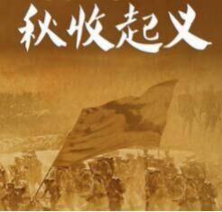

# 2017年422联考《行测》题（吉林卷甲级）

> 政治理论 · 2 题 · 吉林 2017

## 第 1 题　qid 2051962 · 马克思主义

习近平总书记指出，问题是事物矛盾的表现形式，我们强调增强问题意识，坚持问题导向。这句话的哲学依据是：

- **A**. 具体问题具体分析是认识和解决问题的关键
- **B**. 承认矛盾的普遍性是认识和解决问题的关键　✅
- **C**. 坚持问题导向才能体现中国共产党的宗旨
- **D**. 问题意识是中国特色社会主义的理论基础

**答案**：B

**官方解析**

B项正确：习近平总书记在中央政治局第二十次集体学习时强调，要学习掌握事物矛盾运动的基本原理，不断强化问题意识，积极面对和化解前进中遇到的矛盾。问题是事物矛盾的表现形式，我们强调增强问题意识、坚持问题导向，就是承认矛盾的普遍性、客观性，就是要善于把认识和化解矛盾作为打开工作局面的突破口。
故正确答案为B。

---

## 第 2 题　qid 2051988 · 新思想

中国共产党不断总结经验，汲取教训，领导中国革命一步一步走向胜利，仔细观察下图，如果用一个主题概括图中事件的教训最突出的一项应是：

- **A**. 必须武装反抗国民党反动派
- **B**. 必须把工作重点从城市转入农村　✅
- **C**. 必须建立党对军队的绝对领导
- **D**. 必须建立广泛的革命统一战线

**答案**：B

**官方解析**

本题考查毛中特。
B项正确：南昌起义、秋收起义的失败，说明了敌人的力量主要集中在城市中，党从中得到的最主要的教训是必须将工作重心从城市转入农村，建立农村革命根据地。
A项错误：武装反抗是从大革命失败中得出的教训。1927年8月1日，南昌起义打响了武装反抗国民党反动派的第一枪。8月7日，中共中央在汉口召开八七会议，确定了开展土地革命和武装反抗国民党反动派的总方针，并决定发动秋收起义。因此A项不是从这两个起义中吸取的教训。
C项错误：三湾改编已经把“支部设在连上”实际上确立了党对军队的绝对领导。古田会议正式确定党对军队绝对领导为人民军队建设的根本原则。
D项错误：历史上，中国共产党在不同时期，为完成不同的历史任务，倡议和建立了革命统一战线、工农民主统一战线、抗日民族统一战线、人民民主统一战线和爱国统一战线。秋收起义和南昌起义都没有提到统一战线的有关内容。
故正确答案为B。

---
