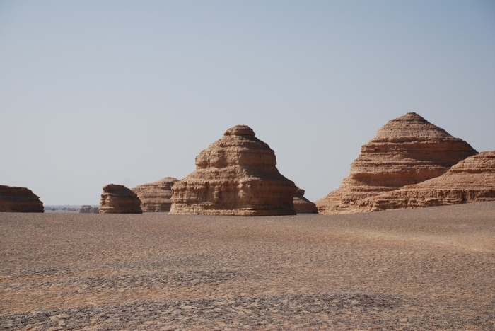

# 2016年423联考《行测》题（四川卷）

> 常识判断 · 10 题 · 四川 2016

## 第 1 题　qid 1796332 · 经济常识

下列关于党的重要思想，按提出时间先后顺序排列正确的是：
①社会主义市场经济理论    ②“三个代表”重要思想
③社会主义本质理论           ④构建社会主义和谐社会理念

- **A**. ①②③④
- **B**. ①②④③
- **C**. ③①②④　✅
- **D**. ③②①④

**答案**：C

**官方解析**

①社会主义市场经济理论：1992年10月12日，中共十四大报告明确指出，中国经济体制改革的目标是建立社会主义市场经济体制，以利于进一步解放和发展生产力。
②“三个代表”重要思想：2000年2月，江泽民在广东考察工作，第一次提出“三个代表”要求。2002年11月，江泽民在党的十六大报告中进一步阐述了“三个代表”重要思想的时代背景、历史地位、精神实质和指导意义。党的十六大把“三个代表”重要思想同马克思列宁主义、毛泽东思想、邓小平理论一道，确立为党必须长期坚持的指导思想并写入党章。
③社会主义本质理论：1992年初，邓小平在“南方谈话”中提出：“社会主义的本质，是解放生产力，发展生产力，消灭剥削，消除两极分化，最终达到共同富裕”。
④构建社会主义和谐社会理念：2004年9月19日，党的十六届四中全会第一次明确提出，共产党作为执政党，要“坚持最广泛最充分地调动一切积极因素，不断提高构建社会主义和谐社会的能力”。这是在党的文件中第一次把和谐社会建设放到同经济建设、政治建设、文化建设并列的突出位置。
由此可知，按照提出时间从先至后顺序为③①②④。
故正确答案为C。

---

## 第 2 题　qid 1796252 · 科技常识

下列对诗词中的物理现象描述错误的是：

- **A**. 坐地日行八万里，巡天遥看一千河——地球的公转　✅
- **B**. 两岸青山相对出，孤帆一片日边来——运动的相对性
- **C**. 八月秋高风怒号，卷我屋上三重茅——空气振动发声
- **D**. 飞流直下三千尺，疑是银河落九天——势能转化为动能

**答案**：A

**官方解析**

A项错误，“坐地日行八万里”是指地球自转。地球赤道半径约6378公里，地球自转一周，人行的路程为周长值约为：。

B项正确，“两岸青山相对出”，研究的对象是“青山”，运动状态是“出”，青山是运动的，是相对于船来说的；“孤帆一片日边来”，研究的对象是“孤帆”，运动状态是“来”，船是运动的，相对于日（或两岸、青山）来说的。同一个物体，以不同的参照物，它的运动状态可能不同，这就是运动和静止的相对性。

C项正确，“八月秋高风怒号”中的风声是空气振动发出的声音。

D项正确，“飞流直下三千尺”，是因为水受到重力的作用，从高处往低处流，在此过程中势能减小，减小的势能转化为动能。

本题为选非题，故正确答案为A。

---

## 第 3 题　qid 1796166 · 人文常识

下列关于微波的说法正确的是：

- **A**. 微波的频率比一般无线电波的频率低
- **B**. 含水量多少对微波加热效果没有影响
- **C**. 微波会被玻璃、塑料和瓷器等物体反射
- **D**. 微波通信容量大、质量好、传输距离远　✅

**答案**：D

**官方解析**

A项错误，微波是指频率为300MHz~300GHz的电磁波。微波频率比一般的无线电波频率高，通常也称为“超高频电磁波”。
B项错误，水分子属极性分子，介电常数较大，其介质损耗因数也很大，对微波具有强吸收能力。
C项错误，微波可以穿过玻璃、陶瓷、塑料等绝缘材料，但不会消耗能量，也不会被反射。
D项正确，由于微波频率很高，所以在不大的相对带宽下，其可用的频带很宽，可达数百甚至上千兆赫兹，这是低频无线电波无法比拟的。这意味着微波的信息容量大，所以现代多路通信系统，包括卫星通信系统，几乎都是在微波波段内工作的。
故正确答案为D。

---

## 第 4 题　qid 1796178 · 人文常识

下图所示的是哪种典型地貌？

- **A**. 喀斯特地貌
- **B**. 冰川地貌
- **C**. 丹霞地貌
- **D**. 风蚀地貌　✅

**答案**：D

**官方解析**

A项错误，喀斯特地貌是具有溶蚀力的水对可溶性岩石（大多为石灰岩）进行溶蚀作用等所形成的地表和地下形态的总称。喀斯特地貌地面上往往崎岖不平，岩石绚丽，奇峰林立。

B项错误，冰川地貌是由冰川作用塑造的地貌，属于气候地貌范畴。地貌类型比较多样，按成因分为侵蚀地貌和堆积地貌两类。图中所示并非冰川地貌的特征。
C项错误，丹霞地貌系指由产状水平或平缓的层状铁钙质混合不均匀胶结而成的红色碎屑岩，受垂直或高角度节理切割，并在差异风化、重力崩塌、流水溶蚀、风力侵蚀等综合作用下形成的有陡崖的城堡状、宝塔状、针状、柱状、棒状、方山状或峰林状的地貌特征。
D项正确，风蚀地貌是经由风和风沙流对土壤表面物质及基岩进行的吹蚀和磨蚀作用所形成的地表形态。题干图片所示的是风蚀地貌中的雅丹地貌，是一种河湖相土状堆积物地区发育的风蚀土墩和风蚀凹地相间的地貌形态。其发育过程是：挟沙气流磨蚀地面，地面出现风蚀沟槽，磨蚀作用进一步发展，沟槽扩展为风蚀洼地；洼地之间的地面相对高起，成为风蚀土墩。
故正确答案为D。

---

## 第 5 题　qid 1796180 · 经济常识

假如某国出现比较严重的经济衰退，该国当局却不能运用货币政策进行调节。这个国家可能是：

- **A**. 德国　✅
- **B**. 美国
- **C**. 英国
- **D**. 新加坡

**答案**：A

**官方解析**

货币政策是指中央银行为实现既定的目标，运用各种工具调节货币供应量来调节市场利率，通过市场利率的变化来影响民间的资本投资，影响总需求来影响宏观经济运行的各种方针措施。
A项正确，德国属于欧元区国家，而欧洲中央银行负责制定欧盟欧元区的金融及货币政策。欧洲中央银行是超国家层面的中央银行和欧盟成员国的各国家中央银行的有机结合。因此一旦发生经济衰退，德国不能运用独立的货币政策进行调节，必须符合欧洲中央银行的整体政策要求。英国不属于欧元区国家，有自己独立的货币英镑。美国和新加坡均有自己的独立货币美元和新加坡元，三个国家都有独立的中央银行，可以使用货币政策调节本国经济。B、C、D三项不符合题意，排除。
故正确答案为A。

---

## 第 6 题　qid 1797768 · 法律常识

关于药品，下列说法错误的是：

- **A**. 大部分药品属于处方药，如注射剂、毒麻药品等
- **B**. 非处方药不需要凭执业医师处方即可自行购买和使用
- **C**. 处方药不可擅自使用、停用或增减剂量，否则可能引起严重后果
- **D**. 药品说明书用以指导医生和患者选择、使用药品，但不具法律意义　✅

**答案**：D

**官方解析**

处方药就是必须凭执业医师或执业助理医师处方才可调配、购买和使用的药品。大部分药品属于处方药，特殊药品也属于处方药：各类麻醉类药品、抗癌类药品以及精神类药品，因此A项正确；
非处方药是指为方便公众用药，在保证用药安全的前提下，经国家卫生行政部门规定或审定后，不需要医师或其它医疗专业人员开写处方即可购买的药品，一般公众凭自我判断，按照药品标签及使用说明就可自行使用，因此B项正确；
处方药必须凭执业医师或执业助理医师处方才可调配、购买和使用。不可擅自使用、停用或增减剂量，否则可能引起严重后果，因此C项正确；
药品说明书是载明药品的重要信息的法定文件，具有重要的法律意义。我国《药品管理法》第四十九条第一款规定，药品包装应当按照规定印有或者贴有标签并附有说明书，因此D项错误。
本题为选非题，故正确答案为D。

---

## 第 7 题　qid 1796236 · 科技常识

关于水稻，下列说法错误的是：

- **A**. 是一年生的禾本科植物
- **B**. 大多为自花授粉并结出种子
- **C**. 中国、印度、日本都是主产国
- **D**. 淀粉含量是早、中、晚品种的分类标准　✅

**答案**：D

**官方解析**

A项正确，水稻是一年生禾本科植物，禾亚科稻属。水稻所结子实即稻谷，稻谷(粒)去壳后称大米、香米、稻米。世界上近一半人口都以大米为食。
B项正确，自花授粉指一株植物的花粉，对同一个体的雌蕊进行授粉的现象。大部分水稻是自花授粉并结出种子。
C项正确，水稻的主要生长区域是中国南方、朝鲜半岛、日本、东南亚、南亚、地中海沿岸、美国东南部、中美洲、大洋洲和非洲部分地区。
D项错误，早、中、晚稻主要根据播种期和收获期而划分。以中国长江中下游地区为例，早稻一般于3月底4月初播种，7月中下旬收获；中稻一般4月初至5月底播种，9月中下旬收获；晚稻一般于6月中下旬播种，10月上中旬收获。同一地区，种完早稻可以接着种植晚稻，俗称双季稻。而中稻生育期较长，同一地区一年只能种植一次。
本题为选非题，故正确答案为D。

---

## 第 8 题　qid 1796124 · 法律常识

下列不属于夫妻共同财产的是：

- **A**. 婚前房屋在婚后所得的租金
- **B**. 夫妻关系存续期间，军人的复员费和自主择业费
- **C**. 赠与合同中确定只归一方的财产　✅
- **D**. 婚姻存续期间虽未实际取得，但明确可以取得的知识产权收益

**答案**：C

**官方解析**

A项正确，根据最高人民法院民一庭意见——个人所有房屋的婚后收益认定及其处理中表明：“一方个人所有的房屋婚后用于出租，其租金收入属于经营性收入，应认定为夫妻共同财产。”
B项正确，根据《最高人民法院关于适用中华人民共和国民法典婚姻家庭编的解释（一）》第七十一条规定：“人民法院审理离婚案件，涉及分割发放到军人名下的复员费、自主择业费等一次性费用的，以夫妻婚姻关系存续年限乘以年平均值，所得数额为夫妻共同财产。”
C项错误，根据《中华人民共和国民法典》第一千零六十三条规定：“下列财产为夫妻一方的个人财产：（一）一方的婚前财产；（二）一方因受到人身损害获得的赔偿或者补偿；（三）遗嘱或者赠与合同中确定只归一方的财产；（四）一方专用的生活用品；（五）其他应当归一方的财产。”
D项正确，根据《中华人民共和国民法典》第一千零六十二条规定：“夫妻在婚姻关系存续期间所得的下列财产，为夫妻的共同财产，归夫妻共同所有：······（三）知识产权的收益······”根据《最高人民法院关于适用中华人民共和国民法典婚姻家庭编的解释（一）》第二十四条规定：“民法典第一千零六十二条第一款第三项规定的‘知识产权的收益’，是指婚姻关系存续期间，实际取得或者已经明确可以取得的财产性收益。”
本题为选非题，故正确答案为C。

---

## 第 9 题　qid 1796314 · 人文常识

关于当代文学，下列说法错误的是：

- **A**. 《白鹿原》曾获得“茅盾文学奖”
- **B**. 《平凡的世界》是史铁生的作品　✅
- **C**. 余华是先锋文学的代表人物之一
- **D**. 电影《大红灯笼高高挂》由苏童的小说改编

**答案**：B

**官方解析**

A项正确，《白鹿原》是陈忠实的代表作。1997年，该小说获得中国第四届茅盾文学奖。
B项错误，《平凡的世界》是中国作家路遥创作的一部百万字的小说，并非由史铁生创作。1991年3月，《平凡的世界》获中国第三届茅盾文学奖。
C项正确，余华是当代文学中先锋派小说的代表作家之一，主要作品有《现实一种》《活着》《许三观卖血记》。
D项正确，《大红灯笼高高挂》改编自苏童的小说《妻妾成群》。
本题为选非题，故正确答案为B。

---

## 第 10 题　qid 1796160 · 人文常识

洲际导弹通常指射程大于8000公里的远程弹道式导弹。目前，中国研制的洲际弹道导弹主要是什么系列的？

- **A**. “东风”系列　✅
- **B**. “长征”系列
- **C**. “红旗”系列
- **D**. “天宫”系列

**答案**：A

**官方解析**

A项，“东风”系列，是中华人民共和国一系列近程、中远程和洲际弹道导弹。“东风”系列是目前世界上唯一覆盖各种类型弹道导弹的陆基弹道导弹系列。
B项，“长征”系列为我国运载火箭型号命名。中国自1956年开始展开现代火箭的研制工作。1964年6月29日，中国自行设计研制的中程火箭试飞成功之后，即着手研制多级火箭，向空间技术进军。经过了五年多的艰苦努力，1970年4月24日“长征一号”运载火箭诞生，首次发射“东方红一号”卫星成功。现在“长征”系列火箭已经走向世界，享誉全球，在国际发射市场占有重要一席。
C项，“红旗”系列防空导弹构成了我国地空防空导弹的主体。红旗系列防空导弹涵盖了中远程、中高空到近程超低空的火力范围，已经形成一个庞大的家族，担负着中国防空的重任。
D项，“天宫”系列是我国空间站项目的命名方式。早在1992年，中国就确立了以建立空间站为目标的航天计划。这一计划分三步，第一步是载人飞船阶段，目标是能够把宇航员送到太空，正常运行若干天，并成功返回。第二步是空间实验室阶段，在这个阶段要解决组装、交互对接、补给以及循环利用等四大技术。这些技术关系到空间站的组装、宇航员在空间站的生存等关键问题。第三步是建造载人空间站阶段，解决较大规模、长期有人照料的空间应用问题。“天宫”一号就是中国在第二步计划中为了解决交互对接问题而发射的一个目标飞行器。
故正确答案为A。

---
