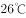

# 2016年上海市公务员录用考试《行测》题（A类）

> 常识判断 · 32 题 · 上海 2016

## 材料 1

        网络舆论共识度是网民社会心态的真实反映，也是衡量网络舆论场正负能量和理性程度的重要指标。为此，人民网舆情检测室推出国内首个“网络舆论共识度”指标体系和季度报告，旨在为中国网络舆论场的研究和社会舆论的理性引导提供新的观察视角和决策依据。根据研究报告情况，2015年第一季度舆论共识主要呈现出以下特点：

        一是“舆论共识度”在波动中有所提升。通过研究2015年第一季度舆情热点事件，“舆论共识度”呈现出波动中提升的状态，官方舆论和民间舆论就热点舆情事件意见趋于一致。

        二是“网民正能量指数”走高。2015年第一季度的“网民正能量指数”，由1月的0.38，2月的0.35增至3月的0.67。

        三是反腐倡廉长期占据“政府认同度”首位。检视2015年第一季度舆情热点事件，反腐倡廉类事件众多且处于舆论关注高位，更以政府认同度3.9，4.0，3.8的高分分别占据各月榜首，成为政府认同度最高的一类舆情事件。

        四是政府舆情危机处置仍待改善。相比反腐倡廉的高度“政府认同度”，突发危机类事件的“政府认同度”处于低位。

### 第 1 题　qid 1758760 · 人文常识

网络舆论共识度是网民社会心态的真实反映，也是衡量网络舆论场正负能量和理性程度的重要指标。造成网络舆情持续不断升温或引发一系列网络舆情危机的事件，说明了以网络传播为代表的新媒体具有（  ）。

- **A**. 公益性与危害性
- **B**. 传播及时性与广泛性　✅
- **C**. 客观性与不可控性　✅
- **D**. 主观性与隐蔽性　✅

**答案**：BCD

**官方解析**

A选项新媒体具有危害性表述片面，新媒体既能反映社会真实心态，也能引发危机，但是危机并不一定都是危害，故A项表述错误，排除。新媒体以其形式丰富、互动性强、渠道广泛、覆盖率高、精准到达、性价比高、推广方便等特点在现代传媒产业中占据越来越重要的位置，所以B选项正确，当选。新媒体的新闻是具有客观性的，但是网络传播具有不可控性，导致很难监管，所以C选项正确，当选。因为网民身份的隐秘性，所以新媒体还有隐蔽性和主观性的特点，所以D选项正确，当选。
故正确选项为BCD。

---

### 第 2 题　qid 1758762 · 人文常识

在2015年第一季度舆情热点事件中，反腐倡廉类事件众多且处于舆论关注高位，更以“政府认同度”3.9，4.0，3.8的高分分别占据各月榜首，成为政府认同度最高的一类舆情事件。这说明（    ）。

- **A**. 政府强力反腐受到社会的认可　✅
- **B**. 反腐倡廉是社会公众关注的焦点　✅
- **C**. 网络舆情有助于反腐倡廉工作的进一步推进　✅
- **D**. 在信息时代，政府公务员都是公众人物

**答案**：ABC

**官方解析**

反腐倡廉类事件众多且处于舆论关注高位，“政府认同度”占据各月榜首。说明我国的反腐工作得到了大家的认可，另外也体现了百姓对此事有较强的关注度，故A、B两项正确，当选。而网络舆情加强了对反腐工作的监督，所以也能推进反腐倡廉的工作，故C项正确，当选。公众人物亦称公共人物，是指一定范围内具有重要影响，为人们所广泛知晓和关注，并与社会公众利益密切相关的人物。其以社会知名度和社会公共利益相关性为构成要件，二者缺一不可，共同体现了公众人物的特性。“有的公务员并没有社会知名度，从事的工作也与社会公共利益无关。”所以“公务员都是公众人物”这一说法不准确，D项错误，排除。
故正确答案为ABC。

---

### 第 3 题　qid 1758764 · 人文常识

“网络舆论共识度”指标体系和季度报告告诉我们，面对新时期复杂的媒体环境，各级政府在突发事件中，与媒体沟通时要（  ）。

- **A**. 坚持积极主动的原则　✅
- **B**. 多个部门、多种渠道发布舆情信息　✅
- **C**. 快速反应、慎报原因、速报事实　✅
- **D**. 采取一定的舆情管制措施　✅

**答案**：ABCD

**官方解析**

突发危机类事件的“政府认同度”处于低位，说明政府在与媒体沟通时应该加强管理、应该提升沟通技巧。除了主动联系媒体发布与人民有关的舆情外，还应扩大这样的信息渠道，加强舆情监督，及时处理相关事项，所以ABC三个选项都正确，而D选项舆情管制措施也有利于政府信息的管理。
故正确答案为ABCD。

---

### 第 4 题　qid 1758766 · 人文常识

2015年第一季度的网民正能量指数渐趋提升，由1月的0.38，2月的0.35增至3月的0.67。官方舆论和民间舆论就热点舆情意见趋于一致，说明政府在推进公共治理中需要（  ）。

- **A**. 提升媒体沟通能力　✅
- **B**. 及时监测舆情动态　✅
- **C**. 充分发挥公众、社会组织等多元治理主体作用　✅
- **D**. 坚持正面引导舆情，变被动应对为主动服务　✅

**答案**：ABCD

**官方解析**

公共治理是由开放的公共管理与广泛的公众参与二者整合而成的公域之治模式，具有治理主体多元化、治理依据多样化、治理方式多样化等典型特征。政府在推进公共治理中需要提升与媒体的沟通能力，及时地收集民意，积极主动地服务。
故正确答案为ABCD。

---

## 材料 2

        某市乙公司获准使用该市一块土地，用途是设置综合农场，发展农业。2014年3月26日，该市规划局查知乙公司在地块内陆续建房，搭脚手架，但并没有用来发展农业，而是以“乙农庄”的名义对外经营。规划局遂于2014年4月2日向乙农庄作出《关于拆除违法建设的通告》，要求乙公司在通告之日起四日之内，自行无条件拆除违法建设房屋。该行政决定未告知乙公司所依据的事实、法规，也未告知乙公司依法享有的陈述、申辩的权利。同月3日，规划局直接在乙农庄门口张贴该通告，未通过其他任何方式向乙公司送达。同月18日，规划局组织有关人员对违法建筑物实施强制拆除。拆除期间未申请公证机构对现场拆除情况、财务清点情况进行证据保全和临时保管，亦未出具任何财务的交接手续，只由该市某镇法律服务所于当日制作了《用品清单》，有规划局、某镇政府、村委会和乙农庄一名员工的签名。5月19日，乙公司请某公证处出具了《公证书》，乙公司据此于2014年8月15日提起诉讼，要求该市规划局予以赔偿。

### 第 5 题　qid 1758768 · 人文常识

根据案例，该市规划局行为违法之处有（  ）。

- **A**. 未告知乙公司作出行政决定的理由和依据　✅
- **B**. 要求乙公司四日内自行拆除违法建筑物
- **C**. 未告知乙公司依法享有的陈述、申辩的权利　✅
- **D**. 未向乙公司送达《通告》　✅

**答案**：ACD

**官方解析**

《行政强制法》第三十五条规定，行政机关作出强制执行决定前，应当事先催告当事人履行义务。催告是一种行政法上的要式行为，必须以书面形式作出。催告的内容应当包括五个方面：一是指出催告所依据的行政决定；二是说明行政机关启动强制执行程序的理由；三是重申行政相对人应当履行的义务，并规定履行义务的期限和方式；四是提出行政相对人逾期不履行义务的后果；五是告知行政相对人依法享有陈述权、申辩权。催告有法定送达规定，要求催告书、行政强制执行决定应当直接送达当事人。因此A、C项错误。当事人拒不接收或者无法直接送达当事人的，应当依照《中华人民共和国民事诉讼法》有关规定送达。所以D项错误。违章建筑限期拆除的限期在现行的建设行政法律法规中未作明确的规定，从具体的操作来看应视违章建筑的结构、面积、拆除作业的难易程度确定一个合理的期限，所以B选项正确。
故正确答案为A、C、D。

---

### 第 6 题　qid 1758770 · 法律常识

根据《国家赔偿法》的规定，该市规划局不应当赔偿的范围有（  ）。

- **A**. 乙公司的违法建筑物　✅
- **B**. 乙公司在乙农庄里的合法财产
- **C**. 乙农庄的经营性损失　✅
- **D**. 受拆迁惊吓的乙公司员工的精神损害赔偿　✅

**答案**：ACD

**官方解析**

侵犯公民、法人和其他组织财产权的违法行政行为及其赔偿方式。这类行为有四种：1.违法实施罚款、吊销许可证和执照、责令停产停业、没收财物等行政处罚的；2.违法对财产采取查封、扣押、冻结等行政强制措施的；3.违反国家规定征收财物、摊派费用的；4.造成财产损害的其他违法行为。A选项为违章建筑，不需要获得赔偿，应选。行政赔偿一定是行政机关的违法行为所造成的，并且是对相对人的合法权益造成损害，才可以获得，因此B选项是需要获得赔偿的，排除。C选项经营性损失在赔偿中没有，不应当赔偿，应选。D选项侵犯人身权并造成精神损害的，应消除影响、恢复名誉、赔礼道歉；后果严重的同时支付精神损害抚慰金。D选项中乙公司员工仅仅是受到惊吓而并没有被侵犯人身权，所以不会获得赔偿，应选。
故正确答案为A、C、D。

---

### 第 7 题　qid 1758772 · 人文常识

该市规划局应当作出的强制执行决定，须载明的事项有（  ）。

- **A**. 乙公司的名称、地址　✅
- **B**. 强制执行的时间　✅
- **C**. 强制执行的方式　✅
- **D**. 复议机关的名称、地址

**答案**：ABC

**官方解析**

《行政强制法》第三十七条：经催告，当事人逾期仍不履行行政决定，且无正当理由的，行政机关可以作出强制执行决定。强制执行决定应当以书面形式作出，并载明下列事项：（一）当事人的姓名或者名称、地址；（二）强制执行的理由和依据；（三）强制执行的方式和时间；（四）申请行政复议或者提起行政诉讼的途径和期限；（五）行政机关的名称、印章和日期。在催告期间，对有证据证明有转移或者隐匿财物迹象的，行政机关可以作出立即强制执行决定。
故正确答案为A、B、C。

---

### 第 8 题　qid 1758774 · 法律常识

根据《行政诉讼法》及其相关司法解释，关于该市某镇法律服务所当日制作的《用品清单》和某公证处制作《公证书》的证据效力，下列判断正确的是（  ）。

- **A**. 公证的书证优于其他书证　✅
- **B**. 国家机关依职权制作的公务文书优于其他书证　✅
- **C**. 原始证据优于传来证据　✅
- **D**. 原物优于复制品　✅

**答案**：ABCD

**官方解析**

《最高人民法院关于行政诉讼证据若干问题的规定》第63条规定，证明同一事实的数个证据，其证明效力一般可以按照下列情形分别认定：（一）国家机关以及其他职能部门依职权制作的公文文书优于其他书证，所以B选项正确。（二）鉴定结论、现场笔录、勘验笔录、档案材料以及经过公证或者登记的书证优于其他书证、视听资料和证人证言，所以A选项正确。（三）原件、原物优于复制件、复制品，所以D选项正确。（四）法定鉴定部门的鉴定结论优于其他鉴定部门的鉴定结论；（五）法庭主持勘验所制作的勘验笔录优于其他部门主持勘验所制作的勘验笔录；（六）原始证据优于传来证据，所以C选项正确。（七）其他证人证言优于与当事人有亲属关系或者其他密切关系的证人提供的对该当事人有利的证言；（八）出庭作证的证人证言优于未出庭作证的证人证言；（九）数个种类不同、内容一致的证据优于一个孤立的证据。
故正确答案为A、B、C、D。

---

## 材料 3

关于2015年全国“爱眼日”活动的通知

各区县卫生计生委，市眼病防治中心，市医学会：

        2015年6月6日是第二十个全国“爱眼日”，今年“爱眼日”活动的主题为“告别沙眼盲，关注眼健康”。近日，国家卫生计生委办公厅、中国残联会办公厅联合转发了《关于开展2015年全国“爱眼日”活动的通知》（国卫办医函〔2015〕398号）。现将该通知印发给你们，并就本市开展2015年“爱眼日”活动有关事项通知如下：

        一、市级活动安排

        （一）6月1日上午，市卫生计生委联合市残联XX公园举行“爱眼日”大型主题咨询活动，组织全市14家三级医疗机构知名眼科专家开展眼病义诊和咨询，发放眼病防治和眼保健知识宣传资料。

        （二）6月1日—3日，在XX公园举办“本市沙眼防治历史回顾展”。

        二、工作要求

        （一）市眼病防治中心要做好本次市级“爱眼日”活动的组织落实，加强对区县活动的技术指导，市医学会应加大对相关学科临床医生的培训力度，切实提高临床医生预防糖尿病致盲等并发症发生的意识。

        （二）各区县卫生计生委要充分认识“爱眼日”活动的重要作用，紧紧围绕今年主题，会同残联等部门，深入社区、农村开展义诊、咨询、专题讲座等，进一步提升市民沙眼防治知识水平，巩固根治致盲性沙眼成果。

        （三）各区县要认真总结本次“爱眼日”宣传活动，并于6月13日前将活动总结等报送至市卫生计生委。

 

  XX市卫生和计划生育委员会办公室

                          2015年5月29日

### 第 9 题　qid 1758784 · 人文常识

下列针对以上公文的标题提出的修改意见，正确的是（  ）。

- **A**. “关于”前要添加发文机关全称或规范化简称
- **B**. “关于”后面添加“开展”二字　✅
- **C**. “通知”应改成“通告”
- **D**. 事由中“全国”二字删去

**答案**：B

**官方解析**

“关于”前可以添加发文机关全称或规范化简称，而不是必须的，所以A选项错误。根据语法知识，发现标题中缺少谓语，所以需要添加“开展”两字，所以B选项正确。通知适用于发布、传达要求下级机关执行和有关单位周知或者执行的事项，批转、转发公文。通告适用于在一定范围内公布应当遵守或者周知的事项。材料中公文是关于“爱眼日”活动相关事项的传达，应该使用通知，C项错误。材料中所提及活动为第十二个全国“爱眼日”活动，事由中“全国”二字不用删去，D项错误。
故正确答案为B。

---

### 第 10 题　qid 1758786 · 人文常识

下列针对以上公文正文用词提出的修改意见，恰当的是（  ）。

- **A**. 开头部分第二句中“转发”应改成“印发”　✅
- **B**. 开头部分末句中“印发”应改成“转发”　✅
- **C**. “本市沙眼防治历史回顾展”中“本市”应改成“XX市”　✅
- **D**. “工作要求（三）”中“各区县”应改成“市医学会”

**答案**：ABC

**官方解析**

转发了《关于开展2015年全国“爱眼日”活动的通知》这篇公文是由国家卫生计生委办公厅、中国残联会办公厅联合制定的，所以应为“印发”，A项正确，当选。B选项是地方对中央公文的一种发放，所以应为“转发”，B项正确，当选。正文内容要精准，以免产生歧义，所以C选项中的“本市”应改成“XX市”，因此C项正确，当选。D选项这篇通知中市医学会的任务已经安排，总结本次“爱眼日”宣传活动应该由各区县来做，所以“各区县”不需要修改，D项错误，排除。
故正确答案为ABC。

---

### 第 11 题　qid 1758788 · 人文常识

以上公文正文中的写作格式和内容存在的问题是（  ）。

- **A**. “市级活动安排”和“工作要求”位置颠倒
- **B**. “工作要求”（一）、（二）两条位置颠倒　✅
- **C**. “工作要求”（三）缺少联系人和联系电话
- **D**. 正文末尾缺少附件说明　✅

**答案**：BD

**官方解析**

A选项只有先有活动安排才可以部署他们的工作，所以位置不颠倒，A选项说法错误，排除。根据主送机关的顺序：各区县卫生计生委，市眼病防治中心，市医学会。我们可以得知需要先要求各区县卫生计生委，其次是市眼病防治中心，最后是市医学会，因此B选项正确，当选。C选项联系人和联系电话应写在正文下边的附注中，所以C选项错误，排除。本篇公文中有引文《关于开展2015年全国“爱眼日”活动的通知》，所以需要添加附件说明，因此D选项正确，当选。
故正确答案为BD。

---

### 第 12 题　qid 1758790 · 人文常识

下列针对以上公文的落款提出的修改意见，正确的是（    ）。

- **A**. 署名中“办公室”应删去　✅
- **B**. 成文日期应改成“二0一五年五月二十九日”
- **C**. 成文日期右边应空两格
- **D**. 成文日期右边应空四格

**答案**：A

**官方解析**

根据主送机关和正文内容可以看出这篇公文的发文机关应是XX市卫生和计划生育委员会，所以A项正确，当选。根据《党政机关工作处理条例》，成文日期应该用阿拉伯数字，所以B项错误，排除。不加盖印章的公文，单一机关行文时，在正文（或附件说明）下空一行右空二字编排发文机关署名，在发文机关署名下一行编排成文日期，首字比发文机关署名首字右移二字，所以C、D两项错误，均排除。
故正确答案为A。

---

### 第 13 题　qid 1758140 · 经济常识

对外是我国的一项基本国策，党的十八届五中全会提出，“十三五”期间要开成对外开放新体制，完成（    ）的营商环境，会合服务贸易促进体系，全面实行准入前国民待遇如负面清单管理体制，有序扩大服务业对外开放。

- **A**. 法治化　✅
- **B**. 国际化　✅
- **C**. 便利化　✅
- **D**. 平台化

**答案**：ABC

**官方解析**

十八届五中全会公报提出，要形成对外开放新体制，完善法治化、国际化、便利化的营商环境，健全服务贸易促进体系，全面实行准入前国民待遇如负面清单管理体制，有序扩大服务业对外开放。因此，本题A、B、C项正确。
故正确答案为ABC。

---

### 第 14 题　qid 1758684 · 人文常识

2015年3月25日国务院常务会议强调，要顺应“互联网+”的发展趋势，以（    ）为主线，重点发展新一代信息技术，高档数控机床和机器人等10大领域，强化工业基础能力，提高工艺水平和产品质量，推进智能制造，绿色制造。

- **A**. 信息化与工业化深度融合　✅
- **B**. 信息化带动现代化
- **C**. 实施中国制造2025
- **D**. 市场主导、改革创新

**答案**：A

**官方解析**

国务院总理李克强3月25日主持召开国务院常务会议。会议强调，要顺应“互联网+”的发展趋势，以信息化与工业化深度融合为主线，重点发展新一代信息技术、高档数控机床和机器人、航空航天装备、海洋工程装备及高技术船舶、先进轨道交通装备、节能与新能源汽车、电力装备、新材料、生物医药及高性能医疗器械、农业机械装备10大领域。
故正确答案为A。

---

### 第 15 题　qid 1758688 · 人文常识

2015年1月14日国务院发布《关于机关事业单位工作人员养老保险制度改革的决定》关于此次改革的基本思路，表述正确的是（    ）。

- **A**. 党政机关、事业单位建立与企业相同的基本养老保险制度　✅
- **B**. 从制度上和机制上化解“双轨制”矛盾　✅
- **C**. 先机关、后事业单位，逐步推进
- **D**. 职业年金与基本养老保险制度同步建立　✅

**答案**：ABD

**官方解析**

2014年12月23日上午，国务院副总理马凯代表国务院向第十二届全国人大常委会第十二次会议做了关于统筹推进城乡社会保障体系建设工作情况的报告。报告中首次明确，机关事业单位养老保险制度改革方案，已经国务院常务会议和中央政治局常委会审议通过。改革的基本思路是一个统一、五个同步。“一个统一”，即党政机关、事业单位建立与企业相同的基本养老保险制度，实行单位和个人缴费，改革退休费计发办法，从制度和机制上化解“双轨制”矛盾。“五个同步”，即机关与事业单位同步改革，职业年金与基本养老保险制度同步建立，养老保险制度改革与完善工资制度同步推进，待遇调整机制与计发办法同步改革，改革在全国范围同步实施。因此，本题A、B、D三项正确。
故正确答案为ABD。

---

### 第 16 题　qid 1758690 · 经济常识

2015年6月29日，《亚洲基础设施投资银行协定》签署仪式在北京举行，亚洲基础设施投资银行（简称亚投行）的建立将有利于推动完善全球金融治理。下列关于亚投行的说法，正确的是（  ）。

- **A**. 英国是加入亚投行的第一个主要西方国家　✅
- **B**. 亚投行是一个政府间性质的亚洲区域多边开发机构　✅
- **C**. 亚投行致力为亚洲基础设施建设提供融资支持　✅
- **D**. 亚投行是由我国提出倡议筹建的，总部设在上海

**答案**：ABC

**官方解析**

亚洲基础设施投资银行（简称亚投行）是一个政府间性质的亚洲区域多边开发机构，重点支持基础设施建设，成立宗旨在于促进亚洲区域的建设互联互通化和经济一体化的进程，并且加强中国及其他亚洲国家和地区的合作。总部设在北京。2015年3月12日，英国正式申请作为意向创始成员国加入亚投行，成为首个申请加入亚投行的欧洲国家，也是首个申请加入亚投行的主要西方国家。
故正确答案为ABC。

---

### 第 17 题　qid 1805088 · 人文常识

《中共中央、国务院关于深化国有企业改革的指导意见》明确，要划分国有企业不同类别，根据国有资本的战略定位和发展目标，结合不同国有企业在经济社会发展中的作用、现状和发展需要，将国有企业分为（    ）。

- **A**. 商业类　✅
- **B**. 工业类
- **C**. 科技类
- **D**. 公益类　✅

**答案**：AD

**官方解析**

《指导意见》根据国有资本的战略定位和发展目标，结合不同国有企业在经济社会发展中的作用、现状和发展需要，将国有企业分为商业类和公益类，并实行分类改革、分类发展、分类监管、分类定责、分类考核。
故正确答案为AD。

---

### 第 18 题　qid 1805066 · 法律常识

国家税务总局2015年2月26日向社会公布了第一批税务行政处罚权力清单，共涉及账簿凭证管理类、纳税申报类和税务检查类等3类8项处罚权力事项，这是由国家部委发布的首份（    ）。

- **A**. 执法权力清单　✅
- **B**. 权力运行负面清单
- **C**. 行政权力清单
- **D**. 不规范行为负面清单

**答案**：A

**官方解析**

2015年2月26日国家税务总局向社会公布了第一批税务行政处罚权力清单，共涉及3类8项处罚权力事项，这是由国家部委发布的首份执法权力清单。首批税务行政处罚权力清单主要涉及日常税收执法较多的账簿凭证管理、纳税申报和税务检查三个方面。税务总局要求，各级税务机关要严格按照权力清单行使权力，不得随意设定和行使税务行政处罚权力。税务总局将分批公布税务行政处罚权力清单，不断强化权力运行制约和监督体系。
故正确答案为A。

---

### 第 19 题　qid 1758730 · 法律常识

《行政许可法》规定，“行政许可所依据的法律、法规、规章修改或者废止，或者准予行政许可所依据的客观情况发生重大变化的，为了公共利益的需求，行政机关可以依法变更或者撤回已经生效的行政许可。由此给公民、法人或者其他组织造成财产损失的，行政机关应当依法给予补偿。”这主要体现了行政法中的（  ）。

- **A**. 行政合法性原则
- **B**. 行政合理性原则
- **C**. 正当程序原则
- **D**. 信赖利益保护原则　✅

**答案**：D

**官方解析**

行政合法性原则是指行政权的存在、行使必须依据法律、符合法律，不得与法律相抵触。A项说法与题干无关。合理行政原则，即行政机关做出的行政行为内容要客观、适度、符合理性。B项说法与题干无关。正当程序是当代行政法的主要原则之一。它主要包括：程序的控制要公开；公众参与原则；回避原则。C项行政机关作出影响行政相对人权益的行政行为，必须遵遁正当法律程序，包括事先告知相对人，向相对人说明行为的根据、理由，听取相对人的陈述、申辩，事后为相对人提供相应的救济途径等，与题干无关，所以C选项不选。D项正确，信赖利益保护原则源于民法中的诚实信用原则，诚实信用原则被运用到公法领域，要求政府与公民，行政主体与行政相对人之间的关系，也是建立在相互信任的基础上，特别是行政主体对行政相对人作出行政行为时，必须以诚信原则作为行事的准则。保护公民的利益，依法行政。所以，信赖利益保护原则就是诚实信用原则在行政法中的运用。而题干中体现出来客观情况发生了重大变化，行政机关变更或撤回造成损失的，应给予补偿，体现了信赖利益保护原则。
故正确答案为D。

---

### 第 20 题　qid 1758692 · 法律常识

下列关于行政合同的特征，说法错误的是（    ）。

- **A**. 行政合同是行政主体履行行政职责的一种手段
- **B**. 行政合同应当遵循平等原则和自愿原则　✅
- **C**. 行政主体可以根据情况，单方变更或者解除行政合同
- **D**. 行政主体在行政合同中享有优先处分权

**答案**：B

**官方解析**

行政合同，也叫行政契约，指行政机关为达到维护与增进公共利益，实现行政管理之目的，与相对人之间经过协商一致达成的协议。例如：国有土地使用权出让合同。行政合同是行政主体履行行政职责的一种手段，A选项说法正确；行政主体可以根据情况，单方变更或者解除行政合同，C选项说法正确；作为国家行政权力代表者的行政主体，为了维护社会公共利益，在行政合同中享有优先权，包括合同标的确定权、相对人选择权、监督合同履行权、单方变更（解除）合同权和行政制裁权，D选项说法正确。行政合同主要表现为行政主体居于优势地位，双方地位不平等。B项说法错误。
本题为选非题，故正确答案为B。

---

### 第 21 题　qid 1758696 · 人文常识

下列关于行政机关责任制的说法，正确的有（    ）。

- **A**. 国务院实行总理负责制　✅
- **B**. 外交部实行集体负责制
- **C**. 直辖市实行常委会负责制
- **D**. 自治区实行集体负责制

**答案**：A

**官方解析**

外交部、直辖市人民政府、自治区人民政府都是我们国家的行政机关，实行的都是首长负责制，人民代表大会实行民主集中制，所以B、C、D三项说法均错误，A项说法正确，国务院实行总理负责制。
故正确答案为A。

---

### 第 22 题　qid 1805072 · 法律常识

根据《行政复议法》的规定，公民、法人或者其他组织认为行政机关的具体行政行为所依据的规定不合法，在对具体行政行为申请行政复议时，可以一并向行政复议机关提出对该规定的审查申请。对此，下列说法正确的有（    ）。

- **A**. 可以对镇人民政府规定提出审查申请　✅
- **B**. 可以对公安部的规定提出审查申请　✅
- **C**. 可以对上海市政府规章提出审查申请
- **D**. 可以对国务院的规定提出审查申请

**答案**：AB

**官方解析**

《行政复议法》第十三条规定：“公民、法人或者其他组织认为行政机关的行政行为所依据的下列规范性文件不合法，在对行政行为申请行政复议时，可以一并向行政复议机关提出对该规范性文件的附带审查申请：（一）国务院部门的规范性文件；（二）县级以上地方各级人民政府及其工作部门的规范性文件；（三）乡、镇人民政府的规范性文件；（四）法律、法规、规章授权的组织的规范性文件。前款所列规范性文件不含规章。规章的审查依照法律、行政法规办理。”
故正确答案为AB。

---

### 第 23 题　qid 1805074 · 法律常识

根据《公务员法》的规定，对有下列（    ）情形的公务员，不得辞退。

- **A**. 丧失工作能力的
- **B**. 身患严重疾病，在规定的医疗期内的　✅
- **C**. 因社会公益而受到过嘉奖的
- **D**. 女性公务员有年幼子女需要抚养的

**答案**：B

**官方解析**

机关有依法定事由和法定程序辞退公务员的权利。但为了保护公务员的合法利益，《公务员法》也规定了机关不得辞退公务员的几种情形，这些情形是：（1）因公致残，被确认丧失或者部分丧失工作能力的；（2）患病或者负伤，在规定的医疗期内的；（3）女性公务员在孕期、产假、哺乳期内的；（4）法律、行政法规规定的其他不得辞退的情形。
故正确答案为B。

---

### 第 24 题　qid 1758726 · 法律常识

2015年10月8日，上海市政府常务会议审议通过《上海市清理取缔涉渔“三无”船舶专项行动工作方案》，决定自今年10月至2016年底，在全市范围内统一展开清理取缔涉渔“三无”船舶专项行动。关于这一行政决策行为，下列说法正确的是（  ）。

- **A**. 集体讨论决定是重大决策的法定程序　✅
- **B**. 在提交市政府常务会议讨论前，要对该方案进行合法性审查　✅
- **C**. 该方案属于上海市政府规章　✅
- **D**. 公民、法人和其他组织对该方案不服，可以直接提起行政诉讼

**答案**：ABC

**官方解析**

十八届四中全会确定重大行政决策需要五个法定程序：第一，老百姓参与。第二，请专家论证。第三，风险评估。第四，进行合法性审查。第五，集体讨论决定。所以A选项正确。国务院发布关于加强法治政府建设的意见，要求政府规范行政决策程序，重大决策事项应当在会前交由法制机构进行合法性审查，未经合法性审查或者经审查不合法的，不能提交会议讨论、作出决策。所以B选项正确。该文件属于上海市政府制定的政府规章，C选项正确。公民、法人只能对行政机关做出的具体行政行为提起诉讼，上海市政府常务会议审议通过《方案》不属于具体行政行为，不能提起行政诉讼，D项错误，排除。
故正确答案为ABC。

---

### 第 25 题　qid 1758722 · 法律常识

纵观历史，行政制度自从产生以来，就起着规范行政权力运作的作用。如中国古代政治家管仲所云：“法律政令者，吏民规矩绳墨也”。行政制度在规范行政权力运作方面的作用有（  ）。

- **A**. 行政制度确认行政权力是相对独立的国家权力　✅
- **B**. 行政制度规定对行政权力主体进行监督的范围和方式　✅
- **C**. 行政制度保障行政权力对行政相对人的有效行使　✅
- **D**. 行政制度规定行政活动的程序，使行政活动有章可循　✅

**答案**：ABCD

**官方解析**

行政制度自从产生以来，就起着规范行政权力运作的作用。第一，行政制度确认行政权力是相对独立的国家权力，主要由行政机关享有和行使，行政机关行使职权的活动不得受到非法干预和阻挠，A选项正确。第二，行政制度保障行政权力对行政相对人的有效行使，C选项正确。第三，行政制度规定行政活动的程序，从而使行政活动有章可循，增强行政后果的可预见性，D选项正确。第四，行政制度规定对行政权力主体进行监督的范围和方式。B选项正确。总之，行政制度的重要功能在于保证行政权力合法、适当、有效地运行。
故正确答案为ABCD。

---

### 第 26 题　qid 1805080 · 法律常识

推进预决算公开是政府公信力的体现，也是深化预算管理制度改革的体系。新《预算法》对财政预决算信息公开提出了更严格的要求，如明确提出要对机关进行经费的安排，使用情况以及政府采购情况等重要事项做出说明，政府预决算信息未按规定公开或作出说明，将被追究（    ）。

- **A**. 法律责任
- **B**. 刑事责任　✅
- **C**. 民事责任
- **D**. 行政责任　✅

**答案**：BD

**官方解析**

新《预算法》第九十二条，各级政府及有关部门有下列行为之一的，责令改正，对负有直接责任的主管人员和其他直接责任人员追究行政责任：
（一）未依照本法规定，编制、报送预算草案、预算调整方案、决算草案和部门预算、决算以及批复预算、决算的；
（二）违反本法规定，进行预算调整的；
（三）未依照本法规定对有关预算事项进行公开和说明的；（因此D正确）
（四）违反规定设立政府性基金项目和其他财政收入项目的；
（五）违反法律、法规规定使用预算预备费、预算周转金、预算稳定调节基金、超收收入的；
（六）违反本法规定开设财政专户的。
第九十六条，本法第九十二条、第九十三条、第九十四条、第九十五条所列违法行为，其他法律对其处理、处罚另有规定的，依照其规定。违反本法规定，构成犯罪的，依法追究刑事责任。（因此B正确）
故正确答案为BD。

---

### 第 27 题　qid 1758712 · 人文常识

近年来，城市暴雨洪涝灾害时有发生，不仅会给人带来财产损失，也会造成人员伤亡。下列对城市暴雨洪涝灾害发生原因的分析，不正确的是（  ）。

- **A**. 城市的扩张导致土地硬质化，渗水能力下降
- **B**. 城市的排水设施抵御暴雨能力不足
- **C**. 城市发展扩张过程中，填埋了大量的地表径流
- **D**. 台风是导致我国城市暴雨洪涝灾害的主要原因　✅

**答案**：D

**官方解析**

ABC三项都是造成城市洪涝灾害发生的主要原因。D项说法错误，台风指形成于热带或副热带以上广阔海面上的热带气旋，台风的出现往往伴随着暴雨，会引发城市内涝，但台风发生并不频繁，所以城市内涝主要还是城市规划和破坏的原因。

本题为选非题，故正确答案为D。

---

### 第 28 题　qid 1805084 · 人文常识

2015年8月，为筹建纪念中国人民抗日战争及世界反法西斯战争胜利70周年，国务院公布第二批100个国家抗战纪念设施、遗址名录，下列国家级抗战纪念遗址中，属于上海的是（    ）。

- **A**. 国歌展示馆　✅
- **B**. 中国人民抗日战争纪念馆
- **C**. 八路军太行纪念馆
- **D**. “九一八”历史博物馆

**答案**：A

**官方解析**

上海市：1、四行仓库抗战纪念馆位于上海市闸北区光复路1号；2、国歌展示馆位于上海市杨浦区荆州路151号；3、金山卫城南门侵华日军登陆处位于上海市金山区金山卫镇南安路87号。
故正确答案为A。

---

### 第 29 题　qid 1758732 · 人文常识

格林威治时间2015年6月30日午夜增加了1秒，使2015年比2014年长1秒，这1秒成为闰秒。产生闰秒的原因是（  ）。

- **A**. 2015年地球绕太阳公转一周的时间比2014年多1秒
- **B**. 和闰年一样，每四年会出现一次闰秒
- **C**. 正好当天的地球自转比往常慢了1秒
- **D**. 为了弥补原子钟计时与基于地球自转得出的“世界时”的差异　✅

**答案**：D

**官方解析**

闰秒是由于地球自转的不均匀性和长期变慢性引起的，所以A、C选项错误。闰秒一般加在公历年末或公历六月末。目前，全球已经产生了26次闰秒，所以B选项错误。由于地球自转的不均匀性和长期变慢性会使世界时和原子时之间相差超过到±0.9秒时，就把世界时向前拨1秒（负闰秒，最后一分钟为59秒）或向后拨1秒（正闰秒，最后一分钟为61秒），原子时是指现在最精确的原子钟计时，D选项说法正确。
故正确答案为D。

---

### 第 30 题　qid 1805092 · 经济常识

带有微处理器的IC卡也称智能卡，广泛应用于金融、交通、社会等诸多方面……如：银行卡正逐步由磁条卡转为智能卡，下列关于智能卡的说法，不正确的是（    ）。

- **A**. 智能卡不仅具有记忆能力，还具有处理信息的功能
- **B**. 智能卡是通过卡里的集成电路存储信息，而磁卡是通过卡内的磁力记录信息
- **C**. 智能卡克服磁卡信息存储量小、磁条易读出和伪造、保密性差等缺点
- **D**. 智能卡的成本比磁卡高，且只能和读卡器接触才能读取信息　✅

**答案**：D

**官方解析**

智能卡（Smart Card）：内嵌有微芯片的塑料卡（通常是一张信用卡的大小）的通称。一些智能卡包含一个RFID芯片，所以它们不需要与读写器的任何物理接触就能够识别持卡人。IC卡与磁卡是有区别的，IC卡是通过卡里的集成电路存储信息，而磁卡是通过卡内的磁力记录信息。IC卡的成本一般比磁卡高，但保密性更好，且存储容量大，按连接方式分为接触式和非接触式。因此D项说法错误。
本题为选非题，故正确答案为D。

---

### 第 31 题　qid 1758736 · 人文常识

现在沪宁线上使用的是长达303公里的超长无缝钢轨，无缝钢轨并不是没有缝隙，而是把25米长的钢轨焊接起来连成几百米甚至几千米长，然后再铺到路基上，每段无缝钢轨之间还是有11厘米的空隙。下列关于无缝钢轨的说法，正确的是（  ）。

- **A**. 采用无缝钢轨可以减少噪音污染　✅
- **B**. 与普通铁轨相比，采用无缝钢轨可大大减少磨损　✅
- **C**. 提高了轨道的可靠性，使列车更加平稳舒适　✅
- **D**. 无缝钢轨的制造使用了特殊钢材，没有热胀冷缩现象

**答案**：ABC

**官方解析**

无缝钢轨是火车提速的关键设备，减少了噪音污染，所以A选项正确。与普通铁轨相比，无缝铁轨消除了大量钢轨接头，因而消除了接头冲击力，减少了线路损害，节省了大量原材料，使磨损大大减少，所以B选项正确。无缝钢轨增加旅客的平稳、舒适感，所以C选项正确。由于气温变化等因素，钢轨都会出现热胀冷缩的现象，遇热时分子之间距离增大，钢轨就会伸长，同理遇冷就会收缩，沪宁高速最重要的也是要解决这个问题，所以D项说法错误。
故正确答案为A、B、C。

---

### 第 32 题　qid 1805098 · 科技常识

截止2015年5月25日，据世界卫生组织公布数据显示，全球累计实验室确认的感染中东呼吸综合征共1139例，其中431例死亡，中东呼吸综合征主要是通过接触动物引起的，这种动物是（    ）。

- **A**. 果子狸
- **B**. 斑马
- **C**. 骆驼　✅
- **D**. 羚羊

**答案**：C

**官方解析**

中东呼吸综合征（MERS）是由一种新型冠状病毒（MERS-CoV）而引起的病毒性呼吸道疾病，该病毒于2012年在沙特阿拉伯首次被发现。冠状病毒是一组能够导致人类和动物发病的病毒，常能够引起人类发生从普通感冒到严重急性呼吸综合征（SARS）的多种疾病。全部的感染来源尚不完全清楚。但在埃及、卡塔尔和沙特的骆驼中分离到和人类病毒株相匹配的病毒株。很多研究已经在非洲和中东的骆驼中发现病毒抗体。人和骆驼的病毒基因序列数据表明两者之间存在密切联系。可能还存在其他宿主。然而，山羊、牛、绵羊、水牛、猪和野生鸟类等动物体内到目前为止仍未检测到MERS-CoV抗体。这些研究结合起来，支持了骆驼是人类感染的可能来源的假设。
故正确答案为C。

---
