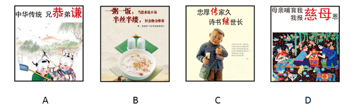

# 2016年吉林省公务员录用考试《行测》题（乙级）

> 常识判断 · 19 题 · 吉林 2016

## 第 1 题　qid 2021658 · 人文常识

当遇到下列情况时，你的正确选择是：

- **A**. 被农药污染的食品一定要充分煮熟再食用
- **B**. 被毒蛇咬伤手臂后，应首先扎住伤口处的近心端　✅
- **C**. 进行人工呼吸过程中，吹气者应始终捏紧被救者的鼻孔
- **D**. 处方药和非处方药都必须在医生的指导下购买和使用

**答案**：B

**官方解析**

B项正确：被毒蛇咬伤手臂后，为防止蛇毒随血液经过心脏扩散到全身，应当首先用止血带扎住伤口处的近心端，防止血液流向心脏；
A项错误：被农药污染的食品，即便充分煮熟，也没办法去除残留其中的有害物，故不宜食用；
C项错误：进行人工呼吸时，吹气时要捏紧被救者的鼻孔，是为了防止气体从鼻腔逸出，无法进入被救者的肺部；但是吹气完毕后，应当松开被救者的鼻子，便于气体交流，等下次吹气时再捏紧被救者的鼻子；
D项错误：处方药必须凭执业医师或执业助理医师的处方才可调配、购买和使用；但非处方药不需要医师或其它医疗专业人员开写处方即可购买。
故正确答案为B。

---

## 第 2 题　qid 2021666 · 人文常识

孔子说，一种人“和而不同”、还有一种人“同而不和”。下列角色行为属于“和而不同”的是：

- **A**. 公务员小李敢于指出领导脱离群众的缺点，使领导的群众基础更牢　✅
- **B**. 副镇长小张任职后谦虚谨慎，对老镇长的指示一向言听计从
- **C**. 村支书小吴很会做宣传动员工作，总能说服群众接受村委会的各项决定
- **D**. 选调生小刘喜欢张扬个性，走上工作岗位后常常是“独树一帜”

**答案**：A

**官方解析**

“和而不同”“同而不和”出自《论语·子路》：“君子和而不同，小人同而不和。”其大意是，君子在人际交往中能够与他人保持和谐友善的关系，但对于具体问题的看法，不必苟同于对方；小人则相反，在对问题的看法上，习惯迎合别人的心理、附和别人的言论，但实际上内心却并不抱和谐友善的态度。
A项正确：小李指出了领导脱离群众的缺点，反而增强了领导的群众基础，使得领导与群众保持更牢固的关系，是“和而不同”的表现；
B项错误：小张对老镇长的指示一向言听计从，没有体现出“和而不同”中的“不同”；
C项错误：村支书小吴的宣传动员工作是其职责行为，不能用“和而不同”、“同而不和”的观点来加以评价；
D项错误：小刘个性张扬，“独树一帜”，没有体现出“和而不同”中的“和”。
故正确答案为A。

---

## 第 3 题　qid 2021662 · 地理国情

“五十六个民族，五十六朵花”，各个民族都有绚丽多彩的民族文化。请为歌曲《美丽的草原我的家》《阿里郎》《青藏高原》《牡丹汗》依次配上相应的民族的乐器，对应民族的乐器是：

- **A**. ④①②③
- **B**. ①③②④　✅
- **C**. ②③④①
- **D**. ③①②④

**答案**：B

**官方解析**

B项正确：《美丽的草原我的家》《阿里郎》《青藏高原》《牡丹汗》分别是蒙古族、朝鲜族、藏族和维吾尔族的著名民族歌曲。图片中的四种乐器分别为：①蒙古族的马头琴、②藏族的扎木聂、③朝鲜族的长鼓、④维吾尔族的达卜。故与题干四首歌曲对应的民族乐器应为①③②④。
故正确答案为B。

---

## 第 4 题　qid 2021784 · 科技常识

在克隆羊的培育过程中，某只白细毛公羊提供了细胞核，某只黑细毛羊提供了去核卵细胞，某只白粗毛羊进行代孕，那么克隆羊的体表的毛和性别分别为：

- **A**. 白色粗羊毛、公羊
- **B**. 白色细羊毛、母羊
- **C**. 黑色粗羊毛、母羊
- **D**. 白色细羊毛、公羊　✅

**答案**：D

**官方解析**

D项正确：本题解析关键在弄清楚遗传物质的来源。生物的遗传物质存在于细胞核内，细胞核是遗传的控制中心。从题干可知，克隆羊体内的遗传物质来自于白细毛公羊的细胞核，具有白细毛公羊的全部遗传物质，因此最终克隆羊的形状应该是最像提供细胞核的白色细毛公羊，体表的毛为白色细羊毛，性别为公羊。
故正确答案为D。

---

## 第 5 题　qid 2021788 · 科技常识

下列每组现象包含的物理学原理不同的是：

- **A**. 高压锅蒸煮食物—火星上水的沸点降低
- **B**. 饮料从摔碎的瓶子中溅出—大质量恒星末期爆炸　✅
- **C**. 烤箱中葡萄干面包膨胀，葡萄干远移—宇宙扩张，星系远移
- **D**. 用LED手电直射滴入1滴牛奶的水杯，末端呈黄色—傍晚天边呈橘红色

**答案**：B

**官方解析**

本题考查物理常识。
B项符合题意：饮料本来依附在瓶子上，瓶子破裂，饮料与瓶子之间的附着力消失，饮料溅出，体现的是弹力原理。大质量恒星的质量越大，引力越大，塌陷时的压力就越强，大质量恒星末期爆炸是由于引力与塌陷产生的压力不平衡造成的。
A项不符合题意：两种现象均体现压强原理，高压锅蒸煮食物利用压强提高沸点，火星上由于气压低，水的沸点也降低。
C项不符合题意：两种现象都是由于膨胀造成周围物质远移。天体物理学家经常用“葡萄干面包”来比喻宇宙扩张。
D项不符合题意：两种现象均体现了光的散射原理。
本题为选非题，故正确答案为B。

---

## 第 6 题　qid 2021792 · 人文常识

下列证明与申请部门对应错误的是：

- **A**. 家庭收入情况证明——公证机关
- **B**. 存单名字错误证明——公安机关　✅
- **C**. 婚姻关系存在证明——民政部门
- **D**. 家庭成员失踪证明——人民法院

**答案**：B

**官方解析**

本题作答依据为2015年公安部发布的《18个不该由公安机关出具的证明》。
A项正确，家庭收入情况不属于派出所工作业务范畴，派出所不知情。因此，派出所不予出具证明，应到公证机关进行公证。
B项错误，因非公安机关原因将姓名填写错误，如：银行存单、保险单、学校、单位等档案中姓名同音不同字，需要证明是同一人的。造成错误的责任主体不是公安派出所，而且派出所也不知情，所以不应出具证明。公民应当到公证机关，由公证机关来公证证明。
C项正确，民政部门是婚姻登记机关，婚姻状况属于民政部门的责任范畴，公民应到民政部门开取证明。派出所不予出具证明。
D项正确，宣告公民失踪是人民法院受案范畴，不是派出所的责任范畴，派出所无权证明人员是否失踪，应向人民法院申请出具证明。
本题为选非题，故正确答案为B。

---

## 第 7 题　qid 2021674 · 科技常识

一段朽木上面长满了苔藓、地衣，朽木凹处聚积的雨水中还生活着孑孓，水蚤等，树洞中还有老鼠、蜘蛛等，下列各项中，与这段朽木的“生命系统层次”水平相当的是：

- **A**. 一块稻田里的全部害虫
- **B**. 一个池塘中的全部鲤鱼
- **C**. 一片松林中的全部生物
- **D**. 一间充满生机的温室大棚　✅

**答案**：D

**官方解析**

生命系统的层次有：细胞，组织，器官，系统，个体，种群，群落，生态系统，生物圈。而这段朽木的“生命系统层次”属于生态系统，即生物群落与无机环境相互作用而形成的统一整体。
D项正确：“一间充满生机的温室大棚”也属于生态系统，所以D项正确；
A项错误：“一块稻田里的全部害虫”属于多个种群，种群即在一定的自然区域内，同种生物的所有个体的总称；
B项错误：“一个池塘中的全部鲤鱼”属于一个种群；
C项错误：“一片松林中的全部生物”属于群落，群落即“在一定的自然区域内，所有的种群组成的总体”。
本题在解答时可采用排除法：A、B、C三个错误选项中都出现“全部”字眼，“全部”所指向的都是单纯的生物，没有类似“朽木”这种无机环境，可加以排除，推出D项为正确项。
故正确答案为D。

---

## 第 8 题　qid 2021802 · 人文常识

A县某酒厂酿造的“仙液”系列白酒深为当地人喜爱，A县政府办公室发文指定该酒为“接待用酒”，要求各机关、企事业单位、社会团体在业务用餐时，饮酒应以“仙液”系列为主，同时，酒厂公开承诺用餐者凭市内各酒楼出具的证明，可以取得消费100元返还10元的奖励。关于此事，下列说法错误的是：

- **A**. A县政府办公室的行为属于限制竞争行为
- **B**. 酒厂的做法，尚未构成商业贿赂行为
- **C**. 上级机关可以责令A县政府改正错误
- **D**. 监督检查部门可以没收酒厂的违法所得，并处以罚款　✅

**答案**：D

**官方解析**

《反不正当竞争法》第七条规定：“政府及其所属部门不得滥用行政权力，限定他人购买其指定的经营者的商品，限制其他经营者正当的经营活动。政府及其所属部门不得滥用行政权力，限制外地商品进入本地市场，或者本地商品流向外地市场。”第八条规定：“经营者不得采用财物或者其他手段进行贿赂以销售或者购买商品。在账外暗中给予对方单位或者个人回扣的，以行贿论处；对方单位或者个人在账外暗中收受回扣的，以受贿论处。经营者销售或者购买商品，可以以明示方式给对方折扣，可以给中间人佣金。经营者给对方折扣、给中间人佣金的，必须如实入账。接受折扣、佣金的经营者必须如实入账。”第三十条规定：“政府及其所属部门违反本法第七条规定，限定他人购买其指定的经营者的商品、限制其他经营者正当的经营活动，或者限制商品在地区之间正常流通的，由上级机关责令其改正；情节严重的，由同级或者上级机关对直接责任人员给予行政处分。被指定的经营者借此销售质次价高商品或者滥收费用的，监督检查部门应当没收违法所得，可以根据情节处以违法所得一倍以上三倍以下的罚款。”
D项错误：本题中，该酒厂的“仙液”系列白酒虽然被指定为“接待用酒”，但并没有出现借此销售质次价高商品或者滥收费用的情形，监督检查部门无权没收其违法所得。
A项正确：根据《反不正当竞争法》第七条的规定，A县政府办公室指定该酒为“接待用酒”，符合第七条规定的情形，其行为属于限制竞争行为。
B项正确：根据《反不正当竞争法》第八条的规定，酒厂以公开承诺的方式给消费者优惠，不属于商业贿赂行为。
C项正确：根据《反不正当竞争法》第三十条的规定，根据对于A县政府的行为，上级机关可以责令其改正。
本题为选非题，故正确答案为D。

---

## 第 9 题　qid 2021808 · 人文常识

下列“讲文明树新风”公益广告用语使用错误的是：

- **A**. A　✅
- **B**. B
- **C**. C
- **D**. D

**答案**：A

**官方解析**

A项符合题意：“兄恭弟谦”的说法有误，中国传统文化提倡的是“兄友弟恭”，即哥哥对弟弟友爱，弟弟对哥哥恭敬，强调兄弟间互爱互敬。
B项提倡节约粮食，C项宣扬忠厚的家风，D项宣扬报答养育之恩的孝道，B、C、D三项均符合主流价值观。
本题为选非题，故正确答案为A。

---

## 第 10 题　qid 2021812 · 人文常识

下列所描述的情形符合史实的是：

- **A**. 苏东坡可以吃到辣椒
- **B**. 唐朝时期，西红柿炒鸡蛋就是家常菜了
- **C**. 三字经所言的“六谷”中的黍指的是玉米
- **D**. 花椒原产中国，胡椒是张骞出使西域后传入　✅

**答案**：D

**官方解析**

D项正确：花椒原产于我国秦岭山脉海拔1000米以下地区，胡椒是在西汉时期张骞出使西域后传入我国的。
A项错误：辣椒原产墨西哥，明朝末年才传入中国，苏东坡是宋朝人，不可能吃到辣椒。
B项错误：西红柿是在明朝末年随西方传教士传入我国，清朝末年中国人才开始食用西红柿，因此唐朝不存在“西红柿炒鸡蛋”这道菜。
C项错误：玉米原产于美洲，明朝传入我国。《三字经》创作于宋末元初，不可能出现关于“玉米”的记载。
故正确答案为D。

---

## 第 11 题　qid 2021816 · 人文常识

下列选项中，对于古文化常识描述错误的是：

- **A**. 古称兄弟间的老大为“伯”，古代兄弟间以伯、仲、叔、季为排行顺序，古人常在字前加排行次序，如“伯禽”“仲尼”“叔向”“季路”等
- **B**. 垂髫是古时对六十岁以上老妇人的别称，髫是指老人轻软披散的头发　✅
- **C**. 古代位居方向有尊卑之称，如南向为胜、尊，以北向为败、卑；以东为主为首，以西为从为次，后渐以“东家”为主人的代称
- **D**. 蛾眉，亦作“娥眉”，古代美女的代称，“娥眉”本为女子长而美的眉毛，代指女子美貌，进而代称美女

**答案**：B

**官方解析**

B项错误：“垂髫”指儿童，“髫”指儿童垂下的头发。古时汉族儿童不束发，头发下垂，因此用“垂髫”来代指儿童。该词出自陶渊明《桃花源记》中的“黄发垂髫，并怡然自乐”。
A、C、D三项，说法均正确。
本题为选非题，故正确答案为B。

---

## 第 12 题　qid 2021820 · 人文常识

对于当前的纹身现象，四个大学生从各自的角度表达了他们对诸子百家思想的理解。
甲说：身体天然完整，纹身就是自虐；
乙说：纹身影响仪容，是低俗身份人的爱好，有身份的人不会纹身；
丙说：纹身费财又费力，何必呢？简简单单不很好吗；
丁说：国家应该严格限制纹身，应该规定人们的行为选择。
他们的描述所对应的思想是：

- **A**. 甲-儒，乙-墨，丙-法，丁-道
- **B**. 甲-道，乙-儒，丙-墨，丁-法　✅
- **C**. 甲-儒，乙-法，丙-墨，丁-道
- **D**. 甲-道，乙-墨，丙-法，丁-儒

**答案**：B

**官方解析**

B项正确：道家思想崇尚自然和谐；儒家思想主张“礼治”，强调等级观念；墨家思想代表平民阶层的利益；法家思想强调法治，重视法的作用。甲认为身体天然完整，纹身是自虐，对应道家思想；乙认为纹身与身份有关，体现等级观念，对应儒家思想；丙认为纹身费财费力，简单就好，代表平民阶级的利益说法，对应墨家思想；丁认为国家应限制纹身，体现了法治的观念，对应法家思想。
故正确答案为B。

---

## 第 13 题　qid 2021826 · 人文常识

当地球运行到C点时，下列说法符合长春市具体情况的是：

- **A**. 昼长达一年最大值　✅
- **B**. 日落时间将逐渐推迟
- **C**. 正午太阳高度角将逐渐增大
- **D**. 正值冬至日

**答案**：A

**官方解析**

A项正确，当地球运行到C点时，太阳直射北回归线，北半球的昼长达一年最大值，长春位于北半球，因此昼长达一年最大值；
B项错误，太阳直射北回归线后，其直射点将逐渐南移，北半球各地白昼逐渐变短，日落时间将越来越早；
C项错误，太阳直射北回归线时，北半球各地正午太阳高度角都达到最大值，之后太阳直射点逐渐南移，各地正午太阳高度角逐渐减小；
D项错误，太阳直射北回归线时，北半球是夏至日。
故正确答案为A。

---

## 第 14 题　qid 2021830 · 科技常识

能源按转换传递过程可分为“一次能源”和“二次能源”，下列属于“二次能源”的一组是：

- **A**. 沼气、焦炭、核电　✅
- **B**. 煤、石油、天然气
- **C**. 煤、核能、海洋能
- **D**. 水能、风能、核能

**答案**：A

**官方解析**

“一次能源”是指直接取自自然界没有经过加工转换的各种能量和资源，如原煤、原油、天然气、油页岩、核能、太阳能、水能、风能、波浪能、潮汐能、地热能、生物质能和海洋温差能等。“二次能源”指由一次能源经过加工转换以后得到的能源产品，如沼气、焦炭、汽油、柴油、电力、蒸汽、核电等。
A项正确：沼气、焦炭、核电均由一次能源加工而得，属于二次能源；
B项错误：煤、石油、天然气属于一次能源；
C项错误：煤、核能、海洋能属于一次能源；
D项错误：水能、风能、核能属于一次能源。
故正确答案为A。

---

## 第 15 题　qid 2021836 · 人文常识

近年来，建立在智能手机和移动互联网基础之上的手机打车应用市场快速发展，手机打车软件公司推出各种针对乘客和出租车司机的优惠和补贴措施。打车费用的降低，吸引了广大民众纷纷采用打车软件叫出租车出行。
下列对手机打车软件叫车这一消费现象的分析错误的是：

- **A**. 打车软件与智能手机是互补商品，打车软件使用量与智能手机的需求量呈正相关　✅
- **B**. “互联网+”消费热点的持续升温拉动了手机应用市场的发展
- **C**. 手机打车应用市场的发展和打车费用对民众的影响反映供求双方互为前提，此消彼长
- **D**. 采用打车软件叫车出行是求实心理引发的健康消费行为

**答案**：A

**官方解析**

A项错误，互补品是指如果两种商品必须组合在一起才能满足人们的某种需要，那这两种东西就是互补商品。例如：汽车和汽油，羽毛球和羽毛球拍，相机和胶卷。打车软件与智能手机不存在使用上的互补性，例如智能手机可以独立使用，就算没有打车软件，也不影响智能手机的其它功能。“打车软件使用量与智能手机的需求量呈正相关”这一说法不准确，打车软件的使用量与智能手机的需求没有直接关系，打车软件的使用量的影响因素是民众的打车需求和软件的便民程度等。
B项正确，“互联网+”的发展为手机应用市场的发展提供了可能性和基础，因此它对于手机应用市场的发展有拉动作用。
C项正确，“手机打车应用市场”相对比较狭小的时候，打车软件公司通过更多的发放补贴，以降低打车费用的方式吸引广大民众，刺激需求；反之，根据社会现实，当前的社会由于打车软件已经被很多人认可，市场需求也已经很旺盛，此时打车软件公司在打车费用的优惠幅度就减少很多。这就反映供求双方互为前提，此消彼长的关系。
D项正确，求实心理：消费者在选择商品时往往考虑很多因素评价，讲求实惠，根据自己需要选择商品，是一种理智的消费。采用打车软件是“互联网+”时代大背景下催生的产品，有利于满足人们个性化的打车需求，是一种健康消费行为。
本题为选非题，故正确答案为A。

---

## 第 16 题　qid 2021840 · 法律常识

某社区举行了居民政治参与的交流活动：甲作为选民参加了一次直接选举人大代表的活动；乙找过区人大代表反映菜市场环境问题；丙对居委会工作提出过批评建议；丁参加了市政府改造“人民公园”听证会。
据此我们可以判断：

- **A**. 甲选举的是省人大代表
- **B**. 乙积极参与基层民主管理
- **C**. 丙直接行使了民主权利　✅
- **D**. 丁参与对政府的民主监督

**答案**：C

**官方解析**

A项错误：省市级以上人大代表的选举采用间接方式，只有区县级和乡镇级人大代表选举，才由选民直接选举。甲作为选民直接选举，可知他选举的不是省人大代表；
B项错误：乙找过区人大代表反映菜市场环境问题，行使的是监督权而非管理权；
C项正确：丙对居委会工作提出批评建议，属于民主管理的范畴，这是公民直接行使民主权利的体现；
D项错误：丁参加听证会是属于参与民主决策。
故正确答案为C。

---

## 第 17 题　qid 2021690 · 人文常识

数学中常常能折射出人生智慧。下列选项与算式体现的道理一致的是：

     

   

- **A**. 江碧鸟逾白，山青花欲燃
- **B**. 问渠那得清如许？为有源头活水来
- **C**. 聚沙成塔，集腋成裘　✅
- **D**. 横看成岭侧成峰，远近高低各不同

**答案**：C

**官方解析**

C项正确：题干中的算式主要想表达量变和质变的关系，强调量的积累导致质的改变。“聚沙成塔，集腋成裘”的意思是通过积累“沙”可以建成“塔”，通过集聚“腋”可以织成“裘”，同样强调了量变引起质变原理；
A项错误：该句出自杜甫《绝句·江碧鸟逾白》，意为：江水碧波浩荡，衬托水鸟雪白羽毛，山峦郁郁苍苍，红花相映，便要燃烧。并没有体现量变与质变的关系；
B项错误：该句出自朱熹《观书有感·其一》，意为：渠中的水这么清是什么原因呢？是因为有源头活水不断进行补充。体现了与时俱进的哲学思想；
D项错误：该句出自苏轼《题西林壁》，意为：从正面看庐山山岭连绵起伏，从其他面看庐山山峰耸立，从远处、近处、高处、低处各个不同的角度看庐山，庐山都呈现出各种不同的样子。蕴含着看问题要全面的哲学思想。
故正确答案为C。

---

## 第 18 题　qid 2021688 · 人文常识

成功就是把“不可能”变成“不！可能”，把“Impossible”变成“I&#39;m possible”。这一说法的合理性在于：

- **A**. 思维和存在具有同一性
- **B**. 实践具有直接现实性　✅
- **C**. 真理具有条件性
- **D**. 意识具有主动创造性

**答案**：B

**官方解析**

B项正确：把“不可能”变成“不！可能”，把“Impossible”变成“I&#39;m possible”需要通过实践去实现。实践的直接现实性是指实践是一种直接现实性活动，它可以把人们头脑中的观念的存在变为现实的存在，符合题干的表述。
故正确答案为B。

---

## 第 19 题　qid 2021692 · 经济常识

李克强总理指出，要继续促进教育公平，使全国财政性教育经费支出占国内生产总值比例超过4%。如果某地财政教育经费投入不足，对这一问题，假设你是当地人大代表，可以：

- **A**. 行使任免权，罢免在教育投入上不足的政府领导
- **B**. 行使质询权，督促当地政府依法落实财政教育经费的投入　✅
- **C**. 行使调查权，联名其他代表提请人大监督财政教育经费的使用
- **D**. 行使决定权，统筹当地政府的政府教育经费投入

**答案**：B

**官方解析**

人大代表主要享有审议权、提案权、表决权、询问权和质询权、选举权、罢免权、建议权、批评权等。
B项正确：人大代表具有质询权，是指人大代表依照有关法律规定，有对本级人民政府及其所属工作部门，本级人民法院、人民检察院提出质询并要求必须予以答复的权利。人大代表发现某地财政教育经费投入不足，督促当地政府依法落实财政教育经费的投入，是行使质询权的体现。
A项错误：人大代表具有任免权，可以罢免国家机关领导人员。但必须在人大举行会议期间提出，且须进行会议表决。
C项错误：人大代表的权利中不包括调查权，且“联名其他代表提请人大监督财政教育经费的使用”更像监督权而非调查权。
D项错误：人大代表无决定权这一权利。
故正确答案为B。

---
