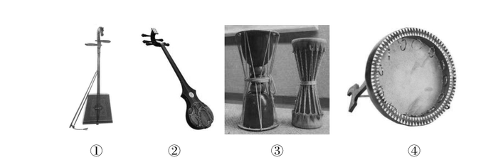
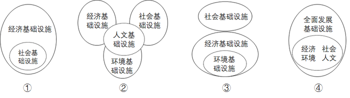

# 2016年吉林省公务员录用考试《行测》题（甲级）

> 常识判断 · 19 题 · 吉林 2016

## 第 1 题　qid 2021658 · 人文常识

当遇到下列情况时，你的正确选择是：

- **A**. 被农药污染的食品一定要充分煮熟再食用
- **B**. 被毒蛇咬伤手臂后，应首先扎住伤口处的近心端　✅
- **C**. 进行人工呼吸过程中，吹气者应始终捏紧被救者的鼻孔
- **D**. 处方药和非处方药都必须在医生的指导下购买和使用

**答案**：B

**官方解析**

B项正确：被毒蛇咬伤手臂后，为防止蛇毒随血液经过心脏扩散到全身，应当首先用止血带扎住伤口处的近心端，防止血液流向心脏；
A项错误：被农药污染的食品，即便充分煮熟，也没办法去除残留其中的有害物，故不宜食用；
C项错误：进行人工呼吸时，吹气时要捏紧被救者的鼻孔，是为了防止气体从鼻腔逸出，无法进入被救者的肺部；但是吹气完毕后，应当松开被救者的鼻子，便于气体交流，等下次吹气时再捏紧被救者的鼻子；
D项错误：处方药必须凭执业医师或执业助理医师的处方才可调配、购买和使用；但非处方药不需要医师或其它医疗专业人员开写处方即可购买。
故正确答案为B。

---

## 第 2 题　qid 2021660 · 人文常识

参会代表在主席台前合影后，某专家要求拍一张单身照，摄影师应采取的方法是：

- **A**. 使照相机靠近他，同时镜头往后缩，离胶片近一些
- **B**. 使照相机靠近他，同时镜头向前伸，离胶片远一些　✅
- **C**. 使照相机远离他，同时镜头往后缩，离胶片近一些
- **D**. 使照相机远离他，同时镜头向前伸，离胶片远一些

**答案**：B

**官方解析**

B项正确：照相机前面都有一个镜头，镜头相当于一个凸透镜，来自物体的光经镜头后会聚在胶片上，形成一个倒立、缩小的实像。根据题意，参会代表在合影结束后要再拍张单人照，实际上就是要让人的像变大。根据照相机的调节方式，要使底片上人的像变大，人离镜头应该近一些，像离镜头要远一些，所以照相机要更靠近人，同时镜头应该往前伸，拉大镜头与胶片的距离，A、C、D项均错误。
故正确答案为B。

---

## 第 3 题　qid 2021662 · 地理国情

“五十六个民族，五十六朵花”，各个民族都有绚丽多彩的民族文化。请为歌曲《美丽的草原我的家》《阿里郎》《青藏高原》《牡丹汗》依次配上相应的民族的乐器，对应民族的乐器是：

- **A**. ④①②③
- **B**. ①③②④　✅
- **C**. ②③④①
- **D**. ③①②④

**答案**：B

**官方解析**

B项正确：《美丽的草原我的家》《阿里郎》《青藏高原》《牡丹汗》分别是蒙古族、朝鲜族、藏族和维吾尔族的著名民族歌曲。图片中的四种乐器分别为：①蒙古族的马头琴、②藏族的扎木聂、③朝鲜族的长鼓、④维吾尔族的达卜。故与题干四首歌曲对应的民族乐器应为①③②④。
故正确答案为B。

---

## 第 4 题　qid 2021664 · 人文常识

下列摘自历史专题片中的解说词，内容与史实不相符的是：

- **A**. 汉景帝时，刘濞等宗室诸侯王因不满中央政权削减封地，便起兵发动“七国之乱”
- **B**. 项羽虽未称帝，在《史记》中，司马迁却将项羽列入“本纪”，并给予高度评价
- **C**. 嘉靖年间，戚继光率领“戚家军”与其他明军配合，取得抗倭战争的最后胜利
- **D**. 七七事变激起国人抗日救国的高潮，张、杨二将军为逼蒋抗日，发动了西安兵变　✅

**答案**：D

**官方解析**

D项符合题意：七七事变发生在1937年7月7日，而西安事变发生在1936年12月12日，发生时间先于七七事变爆发时。西安事变是张学良和杨虎城为了达到劝谏蒋介石停止内战，一致抗日的目的，在西安发动的一场“兵谏”。
A、B、C三项的说法均与史实相符。
本题为选非题，故正确答案为D。

---

## 第 5 题　qid 2021666 · 人文常识

孔子说，一种人“和而不同”、还有一种人“同而不和”。下列角色行为属于“和而不同”的是：

- **A**. 公务员小李敢于指出领导脱离群众的缺点，使领导的群众基础更牢　✅
- **B**. 副镇长小张任职后谦虚谨慎，对老镇长的指示一向言听计从
- **C**. 村支书小吴很会做宣传动员工作，总能说服群众接受村委会的各项决定
- **D**. 选调生小刘喜欢张扬个性，走上工作岗位后常常是“独树一帜”

**答案**：A

**官方解析**

“和而不同”“同而不和”出自《论语·子路》：“君子和而不同，小人同而不和。”其大意是，君子在人际交往中能够与他人保持和谐友善的关系，但对于具体问题的看法，不必苟同于对方；小人则相反，在对问题的看法上，习惯迎合别人的心理、附和别人的言论，但实际上内心却并不抱和谐友善的态度。
A项正确：小李指出了领导脱离群众的缺点，反而增强了领导的群众基础，使得领导与群众保持更牢固的关系，是“和而不同”的表现；
B项错误：小张对老镇长的指示一向言听计从，没有体现出“和而不同”中的“不同”；
C项错误：村支书小吴的宣传动员工作是其职责行为，不能用“和而不同”、“同而不和”的观点来加以评价；
D项错误：小刘个性张扬，“独树一帜”，没有体现出“和而不同”中的“和”。
故正确答案为A。

---

## 第 6 题　qid 2021668 · 人文常识

毛泽东的《七律·人民解放军占领南京》中写到：“钟山风雨起苍黄，百万雄师过大江。虎踞龙盘今胜昔，天翻地覆慨而慷。宜将剩勇追穷寇，不可沽名学霸王。天若有情天亦老，人间正道是沧桑。”根据此诗，下列说法错误的是：

- **A**. 钟山就是人们常说的紫金山，是南京的重要地标和风景区
- **B**. 南京城外有奇石耸立，如虎盘踞，与钟山绵延之势共得名“虎踞龙盘”　✅
- **C**. “宜将剩勇追穷寇，不可沽名学霸王”是用典手法
- **D**. 律诗一般八行，每两行为一联，共四联，分首联、颔联、颈联、尾联

**答案**：B

**官方解析**

B项错误：“虎踞龙盘”一词最早出自于晋代吴勃的《吴录》：“刘备曾使诸葛亮至京，因睹秣陵山阜，叹曰：‘钟山龙盘，石头虎踞，此帝王之宅。’”后来“虎踞龙盘”便用来形容南京地势之雄伟。其中“石头”一词指的是石头城，也有说法是指南京城外的石头山，而不是指城外耸立的奇石。
A项正确：钟山又称紫金山，位于南京市玄武区，是江南四大名山之一，是南京名胜古迹荟萃之地，也是南京市的重要地标。
C项正确：“宜将剩勇追穷寇，不可沽名学霸王”一句使用了西楚霸王项羽的典故。鸿门宴上，项羽曾有机会除掉刘邦，但他听信项伯之言“今人有大功而击之,不义也”，放虎归山，最终反被刘邦所害。这里使用这个典故是警示大家要趁有“剩勇”追击“穷寇”，不能像项羽一样贻误战机。其中“霸王”一词很容易联想到项羽，可以轻松将此项排除。
D项正确：律诗是唐朝流行起来的一种汉族诗歌体裁，属于近体诗的一种，因格律要求非常严格而得名。常见的类型有五律和七律，通常的律诗规定每首八句，每两句成一联，共四联，习惯上称第一联为首联、第二联为颔联、第三联为颈联、第四联为尾联。其中“颔”即下巴的意思，因此“首”“颔”“颈”“尾”即头、下巴、脖颈、尾，很容易排序。
本题为选非题，故正确答案为B。

---

## 第 7 题　qid 2021670 · 科技常识

在能源危机面前，人们纷纷将目光投向大海，浩瀚的大海有类型多样、数量巨大的海洋能源，关于各种海洋能源利用，以下表述错误的是：

- **A**. 人们所说的海洋能源主要指海底所储存的煤、石油、天然气等海底能源资源以及溶于水中的铀、锂、镁、重水等化学能源资源　✅
- **B**. 通过风的作用引起海水沿水平方向周期性运动产生的波浪能可以发电
- **C**. 盐差能发电原理实际上是利用浓溶液扩散到稀溶液中释放出的能量
- **D**. 海水容纳的热量是巨大的，海洋热能是电能的来源之一

**答案**：A

**官方解析**

A项错误：浩瀚的大海，不仅蕴藏着丰富的矿产资源，更有真正意义上取之不尽、用之不竭的海洋能源。它既不同于海底所储存的煤、石油、天然气等海底能源资源，也不同于溶于水中的铀、镁、锂、重水等化学能源资源，而是潮汐能、波浪能、海水温差能、海流能及盐度差能等独特的能源形态。
B、C、D三项说法均正确。
本题为选非题，故正确答案为A。

---

## 第 8 题　qid 2021672 · 地理国情

拉尼娜现象就是太平洋中东部海水异常变冷的情况，东南信风将表面被太阳晒热的海水吹向太平洋西部，致使西部比东部海平面增高将近60厘米，西部海水温度增高，气压下降，潮湿空气积累形成台风和热带风暴，东部底层海水上翻，致使东太平洋海水变冷。拉尼娜现象总是出现在厄尔尼诺现象之后，是厄尔尼诺现象的反向，也称为“反厄尔尼诺”或“冷事件”，对于拉尼娜现象可能带来的影响，下列说法错误的是：

- **A**. 拉尼娜现象出现时，我国易出现冷冬热夏
- **B**. 登陆我国的热带气旋个数比常年多，洪涝灾害更易发生
- **C**. 印度尼西亚等东南亚地区降雨偏多
- **D**. 美国西南部和南美洲西岸将有更充沛的降水　✅

**答案**：D

**官方解析**

D项错误：拉尼娜现象会加强太平洋上空的热力环流，导致美国西南部和南美洲西岸异常干旱。
A项正确：拉尼娜现象中太平洋西部在强劲的信风作用下海平面海水异常偏高，而海水温度的偏高会阻碍副热带高压的南移，从而导致副热带高压在冬季长期盘踞在我国陆地上空，形成冷高压，导致冬季气温偏低。而海水温度偏高，会导致副热带高压较往年更加强势，而夏季正是副高控制我国陆地的时期，在副高的控制下多晴朗天气，温度偏高。
B项正确：海水温度偏高，导致海洋上大气运动更为剧烈，所以极易产生热带气旋，也更容易带来洪涝灾害。
C项正确：拉尼娜现象会导致太平洋中、东部海水异常变冷，使得西太平洋热带地区降水增多，印度尼西亚等东南亚地区受影响较大，甚至可能引发洪涝灾害。
本题为选非题，故正确答案为D。

---

## 第 9 题　qid 2021674 · 科技常识

一段朽木上面长满了苔藓、地衣，朽木凹处聚积的雨水中还生活着孑孓，水蚤等，树洞中还有老鼠、蜘蛛等，下列各项中，与这段朽木的“生命系统层次”水平相当的是：

- **A**. 一块稻田里的全部害虫
- **B**. 一个池塘中的全部鲤鱼
- **C**. 一片松林中的全部生物
- **D**. 一间充满生机的温室大棚　✅

**答案**：D

**官方解析**

生命系统的层次有：细胞，组织，器官，系统，个体，种群，群落，生态系统，生物圈。而这段朽木的“生命系统层次”属于生态系统，即生物群落与无机环境相互作用而形成的统一整体。
D项正确：“一间充满生机的温室大棚”也属于生态系统，所以D项正确；
A项错误：“一块稻田里的全部害虫”属于多个种群，种群即在一定的自然区域内，同种生物的所有个体的总称；
B项错误：“一个池塘中的全部鲤鱼”属于一个种群；
C项错误：“一片松林中的全部生物”属于群落，群落即“在一定的自然区域内，所有的种群组成的总体”。
本题在解答时可采用排除法：A、B、C三个错误选项中都出现“全部”字眼，“全部”所指向的都是单纯的生物，没有类似“朽木”这种无机环境，可加以排除，推出D项为正确项。
故正确答案为D。

---

## 第 10 题　qid 2021676 · 人文常识

如果你“穿越”回汉代，你不可能吃到的食物是：

- **A**. 葡萄、胡桃
- **B**. 土豆、地瓜　✅
- **C**. 火腿、豆豉
- **D**. 粽子、米糕

**答案**：B

**官方解析**

B项符合题意：土豆即马铃薯，由于缺乏早期的文字记载，对于马铃薯何时传入中国的说法不一。根据我国史学家考证认为，马铃薯最早传入中国的时间是在明万历年间。地瓜原产美洲热带地区，哥伦布发现新大陆后由西班牙人传入菲律宾，以后传到世界各地，传入中国时，正是明代万历年间。因此“穿越”回汉代不可能吃到土豆和地瓜。
A项错误：《史记·大宛列传》中有记载：“宛左右以蒲陶为酒…汉使取其实来，于是天子始种苜蓿蒲陶肥饶地。”“蒲陶”即今天所说的葡萄，而文中的“汉使”是指汉武帝时出使西域的张骞；胡桃曾经也被认为是张骞出使西域时带回中国的，但1972年发现距今约7000多年磁山文化遗址出土的胡桃，推翻了此种说法。由此可见，若“穿越”回汉代，葡萄及胡桃都有可能吃到。
C项错误：豆豉最早的记载见于汉代刘熙《释名》一书中，其制作历史可以追溯到先秦时期。因此“穿越”回汉代可能吃到豆豉。而火腿起源于中国唐代以前，唐代陈藏器《本草拾遗》中就有描述“火脮，产金华者佳”的描述。最早出现火腿二字的是北宋，苏东坡在他写的《格物粗谈·饮食》明确记载火腿做法。因此回到汉代能否吃到火腿不能肯定。
D项错误：粽子是中华民族传统节庆食物之一，据传是为了纪念屈原而发明，汉代已有粽子是“芦叶裹米”的记载。米糕拥有很悠久的历史，是中国汉族传统小吃食品之一。汉朝对米糕就有“稻饼”“饵”“糍”等多种称呼。汉代的扬雄在《方言》一书中就已有“糕”的称谓。因此“穿越”回汉代可能吃到粽子和米糕。
本题为选非题，故正确答案为B。

---

## 第 11 题　qid 2021678 · 人文常识

下列关于古代启蒙读物的说法，错误的是：

- **A**. 《百家姓》和《千字文》是识字类蒙书
- **B**. 《龙文鞭影》和《幼学琼林》是技能类蒙书　✅
- **C**. 《增广贤文》和《弟子规》是家训类蒙书
- **D**. 《笠翁对韵》和《千家诗》是声律类蒙书

**答案**：B

**官方解析**

B项错误：《龙文鞭影》主要介绍中国历史上的人物典故和逸事传说。《幼学琼林》内容广博、包罗万象，被称为“中国古代的百科全书”。《龙文鞭影》和《幼学琼林》是流传最广、影响最大的两部知识性蒙书。
A项正确：《百家姓》是一本关于中国姓氏的书，对于中国姓氏文化的传承、汉字的启蒙起了巨大作用。《千字文》是用一千个不重复的汉字组成的一篇长韵文，是儿童习字的启蒙读物。二者均为识字类蒙书。
C项正确：《增广贤文》是中国明代时期编写的儿童启蒙书目，内容十分广泛。《弟子规》成书于清朝，是启蒙养正，教育后辈，养成忠厚家风的最佳读物。二者均为家训类蒙书。
D项正确：《笠翁对韵》是从前人们学习写作近体诗、词，用来熟悉对仗、用韵、组织词语的启蒙读物。《千家诗》是我国旧时带有启蒙性质的诗歌选本。故二者均为声律类蒙书。
本题为选非题，故正确答案为B。

---

## 第 12 题　qid 2021680 · 人文常识

成语“猴年马月”泛指没有盼头的遥远岁月。下列关于猴年马月说法中，错误的是：

- **A**. 并非所有“猴年”都有“马月”　✅
- **B**. 每年的农历五月都是“马月”
- **C**. “猴年马月”的周期是12年
- **D**. 甲申年和丙申年都是“猴年”

**答案**：A

**官方解析**

A项错误：中国夏历（农历）使用干支纪年、月、日，其中十二地支与十二生肖对应。所以，按照干支排列，每年的农历五月都是马月，猴年也不例外。
B项正确：根据干支历法，每年农历正月到腊月大致对应的属相依次是：虎、兔、龙、蛇、马、羊、猴、鸡、狗、猪、鼠、牛。五月草长，人欢马叫。故每年的农历五月都是马月。
C项正确：根据干支历法，猴年12年一个轮回，而马月12个月为一个轮回，“猴年马月”的周期是12年。
D项正确：中国农历使用干支纪年，干支的十二地支对应的就是十二生肖年，“甲申年”和“丙申年”中的“申”是地支，对应的生肖是猴，因此均为猴年。
本题为选非题，故正确答案为A。

---

## 第 13 题　qid 2021682 · 科技常识

关于诺贝尔奖，下列说法正确的是：

- **A**. 诺贝尔奖分为物理、化学、生理或医学、数学、文学、和平六个奖项
- **B**. 莫言是第一位获诺贝尔奖的华人
- **C**. 居里夫人是第一位获得诺贝尔奖的女性　✅
- **D**. 由于创造新型抗癌药—青蒿素，屠呦呦获得诺贝尔医学奖

**答案**：C

**官方解析**

C项正确：玛丽·居里是首位诺贝尔奖女性得主，波兰裔法国籍女物理学家、放射化学家，是放射性现象的研究先驱。1903年，居里夫人与其丈夫皮埃尔·居里及亨利·贝克勒共同获颁诺贝尔物理学奖。
A项错误：诺贝尔奖设物理、化学、生理学或医学、文学、和平、经济学六大奖项，没有数学奖。
B项错误：李政道和杨振宁是最早获诺贝尔奖的华人。李政道，1926年生于上海，美籍华人，1957年获诺贝尔物理学奖，时年31岁；杨振宁，1922年生于安徽，美籍华人，1957年获诺贝尔物理学奖，时年35岁。而莫言是第一位获得诺贝尔奖的本土中国人，他于2012年获得诺贝尔文学奖。“华人”是全体中华民族之人的代称，其下包括了“中国公民”以及海外“华侨”。“美籍华人”同样属于“华人”的范畴，莫言并非第一位获得诺贝尔奖的华人，答题时从这词可果断排除此项。
D项错误：2015年10月，屠呦呦获诺贝尔生理学或医学奖是由于她发现青蒿素治疗疟疾的新疗法。
故正确答案为C。

---

## 第 14 题　qid 2021684 · 人文常识

国家发展理念是指导国家选择、安排和整合发展行为的思想基础，下列关于基础设施的观念图式代表国家发展理念演进的四个不同阶段，这四个阶段的正确排序是：

- **A**. ①③②④　✅
- **B**. ①③④②
- **C**. ③①②④
- **D**. ④①③②

**答案**：A

**官方解析**

基础设施是指为社会生产和居民生活提供公共服务的物质工程设施，是用于保证国家或地区社会经济活动正常进行的公共服务系统。它是社会赖以生存发展的一般物质条件。在现代社会中，经济越发展，对基础设施的要求越高。根据经济发展规律，我们可以推知，国家发展中首先要求社会基础设施，其次为经济基础设施，第三为环境基础设施，第四为人文基础设施，最后达到全面发展的基础设施，故正确顺序为①③②④。
故正确答案为A。

---

## 第 15 题　qid 2021686 · 人文常识

备受关注的微信“春节摇红包”活动把2015年春晚推向高潮，当晚共发放由众多品牌企业赞助的5亿现金微信红包。这意味着，微信红包开始从用户个人行为转向企业营销行为。借助向企业营销平台的转变，成为各家企业的营销工作。这种营销模式的成功之处在于：

- **A**. 减少流通环节，提高企业生产效率
- **B**. 提高品牌知名度，创造消费动力　✅
- **C**. 引导消费者量入为出，理智消费
- **D**. 降低经营成本，增加商品的价值量

**答案**：B

**官方解析**

B项符合题意：企业通过赞助微信红包进行营销，吸引了消费者的关注和热捧，提升了品牌知名度，创造了消费动力；
A项错误：这种营销模式与商品流通，提高生产率无关；
C项错误：企业赞助微信红包作为一种营销模式不存在引导消费者量入为出，理智消费的功能；
D项错误：借助营销平台进行营销确实可能降低企业的经营成本，但并不能增加商品的价值量。
故正确答案为B。

---

## 第 16 题　qid 2021688 · 人文常识

成功就是把“不可能”变成“不！可能”，把“Impossible”变成“I&#39;m possible”。这一说法的合理性在于：

- **A**. 思维和存在具有同一性
- **B**. 实践具有直接现实性　✅
- **C**. 真理具有条件性
- **D**. 意识具有主动创造性

**答案**：B

**官方解析**

B项正确：把“不可能”变成“不！可能”，把“Impossible”变成“I&#39;m possible”需要通过实践去实现。实践的直接现实性是指实践是一种直接现实性活动，它可以把人们头脑中的观念的存在变为现实的存在，符合题干的表述。
故正确答案为B。

---

## 第 17 题　qid 2021690 · 人文常识

数学中常常能折射出人生智慧。下列选项与算式体现的道理一致的是：

     

   

- **A**. 江碧鸟逾白，山青花欲燃
- **B**. 问渠那得清如许？为有源头活水来
- **C**. 聚沙成塔，集腋成裘　✅
- **D**. 横看成岭侧成峰，远近高低各不同

**答案**：C

**官方解析**

C项正确：题干中的算式主要想表达量变和质变的关系，强调量的积累导致质的改变。“聚沙成塔，集腋成裘”的意思是通过积累“沙”可以建成“塔”，通过集聚“腋”可以织成“裘”，同样强调了量变引起质变原理；
A项错误：该句出自杜甫《绝句·江碧鸟逾白》，意为：江水碧波浩荡，衬托水鸟雪白羽毛，山峦郁郁苍苍，红花相映，便要燃烧。并没有体现量变与质变的关系；
B项错误：该句出自朱熹《观书有感·其一》，意为：渠中的水这么清是什么原因呢？是因为有源头活水不断进行补充。体现了与时俱进的哲学思想；
D项错误：该句出自苏轼《题西林壁》，意为：从正面看庐山山岭连绵起伏，从其他面看庐山山峰耸立，从远处、近处、高处、低处各个不同的角度看庐山，庐山都呈现出各种不同的样子。蕴含着看问题要全面的哲学思想。
故正确答案为C。

---

## 第 18 题　qid 2021692 · 经济常识

李克强总理指出，要继续促进教育公平，使全国财政性教育经费支出占国内生产总值比例超过4%。如果某地财政教育经费投入不足，对这一问题，假设你是当地人大代表，可以：

- **A**. 行使任免权，罢免在教育投入上不足的政府领导
- **B**. 行使质询权，督促当地政府依法落实财政教育经费的投入　✅
- **C**. 行使调查权，联名其他代表提请人大监督财政教育经费的使用
- **D**. 行使决定权，统筹当地政府的政府教育经费投入

**答案**：B

**官方解析**

人大代表主要享有审议权、提案权、表决权、询问权和质询权、选举权、罢免权、建议权、批评权等。
B项正确：人大代表具有质询权，是指人大代表依照有关法律规定，有对本级人民政府及其所属工作部门，本级人民法院、人民检察院提出质询并要求必须予以答复的权利。人大代表发现某地财政教育经费投入不足，督促当地政府依法落实财政教育经费的投入，是行使质询权的体现。
A项错误：人大代表具有任免权，可以罢免国家机关领导人员。但必须在人大举行会议期间提出，且须进行会议表决。
C项错误：人大代表的权利中不包括调查权，且“联名其他代表提请人大监督财政教育经费的使用”更像监督权而非调查权。
D项错误：人大代表无决定权这一权利。
故正确答案为B。

---

## 第 19 题　qid 2021694 · 人文常识

党的十八届五中全会提出了引领中国发展的“五大理念”，即创新、协调、绿色、开放、共享。下列发展举措中，不符合“五大理念”的是：

- **A**. 实施“京津冀一体化”“长江经济带”战略
- **B**. 把发展、民生、社会建设融为一体，减少贫困人口
- **C**. 充分利用劳动力资源丰富优势，大力发展生产要素驱动的作用　✅
- **D**. 推动建立绿色低碳循环发展产业体系，实施近零碳排放区示范工程

**答案**：C

**官方解析**

C项所述的劳动力生产要素驱动型产业属于落后的、低端的产业模式，是当下需要进行改革优化部分，不符合“五大理念”中创新的要求，当选。
A项“京津冀一体化”、“长江经济带”战略体现了“五大理念”中协调的理念，排除；
B项把发展、民生、社会建设融为一体体现了“五大理念”中协调、共享的理念，排除；
D项推动建立绿色低碳循环发展产业、实施近零碳排放区示范工程体现了“五大理念”中绿色的理念，排除。
本题为选非题，故正确答案为C。

---
