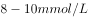
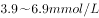

# 2016年四川省公务员录用考试《行测》题（下半年）

> 常识判断 · 10 题 · 四川 2016

## 第 1 题　qid 2030018 · 法律常识

根据我国有关法律，以下说法不正确的是：

- **A**. 依照我国《宪法》规定，任何组织或个人都不得有超越宪法和法律的特权
- **B**. 依照我国《兵役法》规定，中华人民共和国的武装力量，由中国人民解放军、中国人民武装警察部队和民兵组成
- **C**. 依照我国《全国人民代表大会和地方各级人民代表大会选举法》规定，设区的市的人民代表大会的代表，由选民直接选举　✅
- **D**. 依照我国《香港特别行政区基本法》规定，香港特别行政区实行高度自治，享有行政管理、立法权、独立的司法权和终审权

**答案**：C

**官方解析**

C项错误：我国《全国人民代表大会和地方各级人民代表大会选举法》第二条规定：全国人民代表大会的代表，省、自治区、直辖市、设区的市、自治州的人民代表大会的代表，由下一级人民代表大会选举。不设区的市、市辖区、县、自治县、乡、民族乡、镇的人民代表大会的代表，由选民直接选举；
A项正确：我国《宪法》第五条规定：······任何组织或者个人都不得有超越宪法和法律的特权；
B项错误：根据《国防法》第二十二条规定：中华人民共和国的武装力量，由中国人民解放军、中国人民武装警察部队、民兵组成。
D项正确：我国《香港特别行政区基本法》第二条规定：全国人民代表大会授权香港特别行政区依照本法的规定实行高度自治，享有行政管理权、立法权、独立的司法权和终审权。
本题为选非题，故正确答案为C。
注：因法律修改，本题B选项也为错误选项。

---

## 第 2 题　qid 2030060 · 法律常识

下列选项中，符合法律规定的是：

- **A**. 新录用的公务员小张，其试用期为六个月
- **B**. 小陈今年15岁，在某工地打工，干一些杂务
- **C**. 因工作需要，公务员小朱前往甲单位授课，他可以在甲单位领取授课费
- **D**. 某公司未按照劳动合同约定向员工小李支付劳动报酬，小李可以随时通知该公司解除劳动合同　✅

**答案**：D

**官方解析**

D项正确：根据《劳动法》第三十二条规定：“有下列情形之一的，劳动者可以随时通知用人单位解除劳动合同：……（三）用人单位未按照劳动合同约定支付劳动报酬或者提供劳动条件的。”
A项错误，根据《公务员法》第三十四条规定：“新录用的公务员试用期为一年。试用期满合格的，予以任职；不合格的，取消录用。”
B项错误：《劳动法》第十五条规定：“禁止用人单位招用未满十六周岁的未成年人。文艺、体育和特种工艺单位招用未满十六周岁的未成年人，必须依照国家有关规定，履行审批手续，并保障其接受义务教育的权利。”小陈在工地打工，用人单位不属于文艺、体育和特种工艺单位，因此不符合法律规定。
C项错误，根据《公务员法》第四十四条规定：“公务员因工作需要在机关外兼职，应当经有关机关批准，并不得领取兼职报酬。”
故正确答案为D。

---

## 第 3 题　qid 2030064 · 人文常识

下列关于我国的国家中心城市的说法，错误的是：

- **A**. 目前确定的国家中心城市中已包含了所有的直辖市
- **B**. 目前确定的国家中心城市中最靠西的城市是重庆市　✅
- **C**. 国家中心城市的政治、经济、文化等多方面具备引领、辐射、集散功能
- **D**. 国家中心城市在《全国城镇体系规划》中处于城镇体系层级的最高位置

**答案**：B

**官方解析**

B项错误：2016年5月，经国务院同意，发改委和住建部联合印发《成渝城市群发展规划》指导文件，其中《规划》中首次明确提出，成都要以建设国家中心城市为目标，增强成都西部地区重要的经济中心、科技中心、文创中心、对外交往中心和综合交通枢纽功能。而北京、天津、上海和广州均位于我国东部，只有重庆和成都位于我国的西南地区。而成都比重庆更靠西，因此，目前确定的国家中心城市中，最靠西的城市是成都市。 
A、C、D正确：国家中心城市是住房和城乡建设部编制的《全国城镇体系规划》中提出的处于城镇体系最高位置的城镇层级。国家中心城市在全国具备引领、辐射、集散功能的城市，这种功能表现在政治、经济、文化、对外交流等多方面。2010年2月，住房和城乡建设部发布的《全国城镇体系规划纲要（2010-2020年）》明确提出五大（北京、天津、上海、广州、重庆）国家中心城市的规划和定位，其中包括了四个直辖市。
本题为选非题，故正确答案为B。

---

## 第 4 题　qid 2030066 · 人文常识

关于气象灾害，下列说法正确的是：

- **A**. 沙尘天气分为浮尘、扬沙、沙尘暴三类
- **B**. 台风中心为低压中心，以气流的垂直运动为主　✅
- **C**. 在我国，暴雨的橙色预警信号为最高级预警信号
- **D**. 寒潮主要爆发于春末夏初季节，寒潮袭击时气温会急剧下降

**答案**：B

**官方解析**

B项正确：在气象图上，台风的等压线和等温线近似为一组同心圆，其中台风中心为低压中心，以气流的垂直运动为主，附近风平浪静，天气晴朗。
A项错误：沙尘天气是一种由于大风将地面沙尘吹（卷）起或被高空气流带到下游地区而造成的一种大气混浊现象。按照程度划分，沙尘天气分为：浮尘、扬尘、沙尘暴、强沙尘暴、特强沙尘暴五类。
C项错误：我国的暴雨预警信号分四级，分别以蓝色、黄色、橙色、红色表示，其中红色预警信号为最高级预警信号。
D项错误：寒潮是指来自极地或寒带的寒冷空气像潮水一样大规模地向中、低纬度的侵袭活动。在我国，从9月到次年5月均可发生寒潮，主要爆发于初春时节，我国大部分地区都会受到影响。
故正确答案为B。

---

## 第 5 题　qid 2030074 · 科技常识

关于物理现象的解释，下列说法错误的是：

- **A**. 量子隧穿效应不遵循牛顿运动定律
- **B**. “小小秤砣压千斤”运用的是杠杆原理
- **C**. 汽车的观后镜多使用凸面镜 ，可以扩大视野范围
- **D**. 高压锅煮食物快主要是因为增大了锅内气压，降低了水的沸点　✅

**答案**：D

**官方解析**

D项错误：高压锅煮食物快是因为水的沸点与压强有关，压强增大，沸点升高，煮饭菜时高压锅的气压比普通锅内的气压高，所以水沸腾时高压锅内的温度高于普通锅内的温度，温度越高，饭菜熟的越快。
A项正确：量子隧穿效应是一种量子特性，是电子等微观粒子能够穿过它们本来无法通过的“墙壁”的现象。这种效应无法用经典力学来解释，不遵循牛顿运动定律。
B项正确：秤杆可以看做一个杠杆，根据杠杆原理，秤砣的质量比较小，但是它的力臂比较长。相反，千斤物体的质量虽然大，但是力臂却比较短，所以二者可以平衡。
C项正确：汽车的观后镜是凸面镜，凸面镜对光有发散作用，能使驾驶员观察到更大范围的景物，因此利用凸面镜制作的观后镜可以扩大驾驶员的视野。
本题为选非题，故正确答案为D。

---

## 第 6 题　qid 2030090 · 科技常识

关于医学常识，下列说法正确的是：

- **A**. 
在正常情况下，人的血糖值的正常范围在

- **B**. 
成年人安静时心率超过时，为心动过速

- **C**. 
父母血型分别为A型和B型时，子女血型不可能为O型

- **D**. 
临床上通常用口腔温度、直肠温度和腋窝温度来代表体温
　✅

**答案**：D

**官方解析**

D项正确：正常体温根据测试部位的不同，体温的正常值稍有差异。临床上常用的体温包括：口腔温度、直肠温度和腋窝温度。

A项错误：正常情况下，人的空腹全血血糖正常值范围在，血浆血糖为。

B项错误：成年人安静时心率超过时为心动过速。

C项错误：根据血型的遗传规律，父母血型分别为A型和B型时，子女血型可能为A型、B型、AB型、O型。

故正确答案为D。

---

## 第 7 题　qid 2030094 · 人文常识

我国很多民间乐器是少数民族代表乐器，下列对应不正确的是：

- **A**. 芦笙——朝鲜族　✅
- **B**. 葫芦丝——傣族
- **C**. 冬不拉——哈萨克族
- **D**. 马头琴——蒙古族

**答案**：A

**官方解析**

A项错误：芦笙为西南地区苗、瑶、侗等民族的簧管乐器，并非朝鲜族的代表乐器。朝鲜族在我国主要分布于东北三省，代表乐器主要有伽倻琴、玄鹤琴等。
其余三项均正确。
本题为选非题，故正确答案为A。

---

## 第 8 题　qid 2030096 · 人文常识

关于二战时期的重要会议，下列说法不正确的是：

- **A**. “雅尔塔会议”作出了战后世界秩序安排
- **B**. “开罗会议”确定了日本侵略罪行及战后对日本的处理问题
- **C**. “德黑兰会议”美、英、苏三大同盟国共同商量对日作战问题　✅
- **D**. “波茨坦会议”召开于德国无条件投降，欧洲战争结束之后

**答案**：C

**官方解析**

C项错误：“德黑兰会议”美、英、苏三大同盟国共同商量对德作战的军事问题。关于对日作战问题，苏联初步同意在欧洲战争结束后半年左右参加对日作战，但没有进行进一步商讨，1945年的波茨坦会议上讨论了对日作战等问题。
其余三项均正确。
本题为选非题，故正确答案为C。

---

## 第 9 题　qid 2030100 · 人文常识

下列场景最不可能发生的是：

- **A**. 战国人使用象牙制品
- **B**. 屈原和宋玉饮酒作赋
- **C**. 霍去病向汉武帝上纸本奏议　✅
- **D**. 商王武丁的妻子身穿丝绸服装

**答案**：C

**官方解析**

A项正确：经考古发掘证明，早在新石器时期，我国就有使用如象牙匕、象牙笄等象牙制品。在古代，象牙制品作为一种独特的动物制品，深受上等阶层的推崇。故选项所述场景有可能发生。
B项不严谨：关于屈原的生卒年，史书上没有记载，后世学者有多种说法，大致有生于楚威王或楚宣王年间，卒于楚襄王年间等说法。关于宋玉的生平也不详，据他的有关作品看，可能是楚襄王朝失职的贫士，根据权威的学术典籍《历代赋辞典》，宋玉当生在屈原之后，大概只是屈原的后学，所以他俩还是有可能一起饮酒作赋的。
C项错误：根据《二十六史精要辞典 • 上》（责任者：门岿主编；出版者：人民日报出版社）记载：“1957年考古工作者在陕西省西安灞桥一座古汉墓中，发掘出时间不晚于汉武帝时期(前140—前87)的纸。这种纸经过化验，是用大麻和苎麻等原料制造的，取名‘灞桥纸’。‘灞桥纸’是迄今为止，我国和世界上人们发现的最早的纸”。但是所谓“灞桥纸”究竟是何用途，学界尚没有一致答案，且其表面粗糙皱涩，甚至是未打碎的麻绳头，无文字，也不便于书写。故霍去病向汉武帝上纸本奏议不大可能发生。
D项正确：根据考古发现推测，距今五六千年前的新石器时代，中国便开始养蚕织绸了，并且在仰韶时期便开始出现丝绸织物，故选项所述场景有可能发生。
本题问的是“最不可能发生”，单选择优，最不可能的是C项。
本题为选非题，故正确答案为C。

---

## 第 10 题　qid 2030104 · 人文常识

下列关于秋天的诗句，产生年代最早的是：

- **A**. 袅袅兮秋风，洞庭波兮木叶下　✅
- **B**. 无边落木萧萧下，不尽长江滚滚来
- **C**. 昨夜西风凋碧树，独上高楼，望尽天涯路
- **D**. 悲哉，秋之为气也，萧瑟兮草木摇落而变衰

**答案**：A

**官方解析**

A项正确：本句出自屈原的《九歌》，创作于战国时期。
B项错误：本句出自杜甫的《登高》，创作于唐朝。
C项错误：本句出自晏殊的《蝶恋花》，创作于北宋时期。
D项错误：本句出自宋玉的《九辨》，创作于战国时期。A和D虽均创作于战国时期，但屈原（公元前340年－公元前278年）的生卒年份早于宋玉（约公元前298年－约公元前222年），屈原去世时宋玉年纪不过二十左右，而《九辩》原文“时亹亹而过中兮，蹇淹留而无成”表明作者在创作时已人过中年。
故正确答案为A。

---
