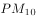
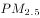

# 2016年国家公务员录用考试《行测》题（地市级）

> 常识判断 · 20 题 · 国考 2016

## 第 1 题　qid 1746630 · 人文常识

“四个全面”是新一届党的领导集体治国理政的战略布局。下列与“四个全面”有关的说法正确的是：

- **A**. 党的十八大通过了《中共中央关于全面深化改革若干重大问题的决定》
- **B**. 十八届三中全会通过了《中共中央关于全面推进依法治国若干重大问题的决定》
- **C**. 十八届四中全会提出了“全面建成小康社会”的战略目标
- **D**. 习近平总书记在江苏调研时将“从严治党”首次提升到“全面从严”的高度　✅

**答案**：D

**官方解析**

《中共中央关于全面深化改革若干重大问题的决定》是十八届三中全会通过的，故A项错误。《中共中央关于全面推进依法治国若干重大问题的决定》是十八届四中全会通过的，故B项错误。“全面建成小康社会”的战略目标是十八大提出的，故C项错误。2014年12月，习近平总书记在江苏调研时将“三个全面”上升到了“四个全面”，要“协调推进全面建成小康社会、全面深化改革、全面推进依法治国、全面从严治党，推动改革开放和社会主义现代化建设迈上新台阶”，新增了“全面从严治党”。首次将“从严治党” 提升到“全面从严治党”的高度。 
故正确答案为D。
备注：2020年党的十九届五中全会在北京胜利召开，会议审议通过了《中共中央关于制定国民经济和社会发展第十四个五年规划和二〇三五年远景目标的建议》。明确提出要“协调推进全面建设社会主义现代化国家、全面深化改革、全面依法治国、全面从严治党的战略布局”。

---

## 第 2 题　qid 1746636 · 法律常识

根据全国人大常委会关于实行宪法宣誓制度的决定，实行宪法宣誓的人员不包括：

- **A**. 各级人民政府任命的国家工作人员
- **B**. 各级人民法院、人民检察院任命的国家工作人员
- **C**. 党的机关、政协机关、民主党派和工商联等机关的工作人员　✅
- **D**. 各级人大及县级以上各级人大常委会选举或决定任命的国家工作人员

**答案**：C

**官方解析**

第十二届全国人民代表大会常务委员会第十五次会议决定：各级人民代表大会及县级以上各级人民代表大会常务委员会选举或者决定任命的国家工作人员，以及各级人民政府、人民法院、人民检察院任命的国家工作人员，在就职时应当公开进行宪法宣誓。
本题为选非题，故正确答案为C。

---

## 第 3 题　qid 1746644 · 法律常识

“行政机关不得法外设定权力，没有法律法规依据不得作出减损公民、法人和其他组织合法权益或者增加其义务的决定”，这体现了法治政府建设中哪项要求？

- **A**. 职能科学
- **B**. 守法诚信
- **C**. 执法严明
- **D**. 权责法定　✅

**答案**：D

**官方解析**

“权责法定”是指权力机关的权力和责任都由法律规定，即对权力机关而言，“法不授权不可为之”。题干中“行政机关不得法外设定权力，没有法律法规依据不得······”正是体现了“法不授权不可为之”。
故正确答案为D。

---

## 第 4 题　qid 1746650 · 法律常识

下列说法不符合我国法律规定的是：

- **A**. 甲带侄子外出游玩，遇地震，甲无需为侄子在地震中所受损害承担责任
- **B**. 甲用拳头殴打乙，乙将甲推倒后持刀将其扎死，乙无需为甲的死亡承担责任　✅
- **C**. 甲、乙发生口角，对骂过程中甲欲讹诈乙而故意倒地，乙无需为甲因倒地所受伤害承担责任
- **D**. 甲、乙因言语不和而厮打一起，丙撞见后趁机殴打与其素来不和的甲，乙无需为丙殴打甲所造成的损害承担责任

**答案**：B

**官方解析**

本题考查法律常识。
A项正确，“遇地震”属于“不可抗力”，根据《刑法》第十六条规定，行为在客观上虽然造成了损害结果，但是不是出于故意或者过失，而是由于不能抗拒或者不能预见的原因所引起的，不是犯罪。根据《民法典》第一百八十条规定：“因不可抗力不能履行民事义务的，不承担民事责任。法律另有规定的，依照其规定。不可抗力是不能预见、不能避免且不能克服的客观情况。”
B项错误，乙将甲推倒属于正当防卫，当甲被推倒证明不法侵害人已经被制伏，因而此时乙再持刀将其扎死不属于防卫，构成故意杀人罪，需要承担刑事责任。
C项正确，甲欲讹诈乙故意倒地，即“甲倒地”是自己造成的，与乙没有因果关系，乙无需担责。
D项正确，丙殴打甲的行为与乙没有关联，乙无需担责。
本题为选非题，故正确答案为B。

---

## 第 5 题　qid 1746656 · 法律常识

下列处理问题的做法不符合我国相关法律法规的是：

- **A**. 某公安局处长对本人被辞退的决定不服，当天即向法院提起行政诉讼　✅
- **B**. 某工商局科员拒不赡养父母，情节严重，单位给予其开除处分
- **C**. 某省商务厅厅长退休后第二年到商务厅下属商贸公司任职，该省公务员主管部门责令其限期改正
- **D**. 某税务局科长执行公务时，认为局长的决定有错误，向局长提出改正意见

**答案**：A

**官方解析**

A项错误，“处长被辞退”是不可以提起行政诉讼的，因为行政机关对行政机关工作人员的奖惩、任免等决定是不属于人民法院的受案范围的。
B项正确，科员拒不赡养父母，情节严重，已经构成“遗弃罪”，此时单位可以给予其“开除”处分。
C项正确，商务厅厅长退休后第二年到商务厅下属的商贸公司任职，违反了“公务员辞去公职或者退休的，原系领导成员的公务员在离职三年内，其他公务员在离职两年内，不得到与原工作业务直接相关的企业或者其他营利性组织任职，不得从事与原工作业务直接相关的营利性活动”这一《公务员法》中的规定，该省公务员主管部门责令其限期改正是正确的做法。
D项正确，公务员是有“对机关工作和领导人员提出批评和建议”的权利的，故科长向局长提出改正意见是符合规定的。
本题为选非题，故正确答案为A。

---

## 第 6 题　qid 1746664 · 法律常识

下列情形中，行为人不负刑事责任的是：

- **A**. 十四周岁的张某，贩卖冰毒0.2克
- **B**. 十五周岁的李某，因过失导致他人伤残　✅
- **C**. 二十周岁的周某，醉酒后殴打他人致人重伤
- **D**. 三十五周岁的聋哑人宋某，入户盗窃现金5000元

**答案**：B

**官方解析**

《刑法》第十七条第一款第二款规定：“已满十六周岁的人犯罪，应当负刑事责任。已满十四周岁不满十六周岁的人，犯故意杀人、故意伤害致人重伤或者死亡、强奸、抢劫、贩卖毒品、放火、爆炸、投放危险物质罪的，应当负刑事责任。”
A项正确，十四岁的张某贩毒，属于《刑法》第十七条第二款中的八大行为之一，故张某应当负刑事责任。
B项错误，十五岁的李某过失致人伤残，不符合《刑法》第十七条第二款中的故意犯罪，故李某不负刑事责任。
C项正确，《刑法》第十八条第四款规定：“醉酒的人犯罪，应当负刑事责任。”在本选项中，周某已满十六周岁，且醉酒不是免责情形，故周某应当负刑事责任。
D项正确，《刑法》第十九条规定：“又聋又哑的人或者盲人犯罪，可以从轻、减轻或者免除处罚。” 在本选项中，宋某已满十六周岁，且聋哑人不是免责情形，故宋某应当负刑事责任。
本题为选非题，故正确答案为B。
备注：根据2021年3月1日起施行的《刑法修正案（十一）》，已满十六周岁的人犯罪，应当负刑事责任。已满十四周岁不满十六周岁的人，犯故意杀人、故意伤害致人重伤或者死亡、强奸、抢劫、贩卖毒品、放火、爆炸、投放危险物质罪的，应当负刑事责任。已满十二周岁不满十四周岁的人，犯故意杀人、故意伤害罪，致人死亡或者以特别残忍手段致人重伤造成严重残疾，情节恶劣，经最高人民检察院核准追诉的，应当负刑事责任。

---

## 第 7 题　qid 1746682 · 人文常识

下列与某食品厂相关的做法不符合食品安全法规定的是：

- **A**. 该厂无需为食品安全风险评估付费
- **B**. 该厂退休职工有权举报食品安全违法行为
- **C**. 该厂配备了兼职的食品安全专业技术人员
- **D**. 食品安全风险监测工作人员到该厂采集样品无需支付费用　✅

**答案**：D

**官方解析**

A项正确：我国《食品安全法》第十七条第四款规定：“食品安全风险评估不得向生产经营者收取费用，采集样品应当按照市场价格支付费用。”
B项正确：我国《食品安全法》第十二条规定：“任何组织或者个人有权举报食品安全违法行为，依法向有关部门了解食品安全信息，对食品安全监督管理工作提出意见和建议。”
C项正确：我国《食品安全法》第三十三条规定：“食品生产经营应当符合食品安全标准，并符合下列要求：······（三）有专职或者兼职的食品安全专业技术人员、食品安全管理人员和保证食品安全的规章制度；······”
D项错误：我国《食品安全法》第八十七条规定：“县级以上人民政府食品安全监督管理部门应当对食品进行定期或者不定期的抽样检验，并依据有关规定公布检验结果，不得免检。进行抽样检验，应当购买抽取的样品，委托符合本法规定的食品检验机构进行检验，并支付相关费用；不得向食品生产经营者收取检验费和其他费用。”D项“采集样品无需支付费用”是错误的做法。
本题是选非题，故正确答案为D。

---

## 第 8 题　qid 1746694 · 人文常识

关于我国农业国情，下列说法错误的是：

- **A**. 五大牧区的简称为新、藏、青、蒙和陇
- **B**. 南北方最主要的糖料作物分别是甘蔗和甜菜
- **C**. “湖广熟，天下足”，江汉平原是最大的商品粮产区　✅
- **D**. 红壤是一种粘性酸壤，主要分布于长江以南的低山丘陵区

**答案**：C

**官方解析**

新疆、西藏、青海、内蒙古、甘肃是我国的五大牧区，A项中的简称“新、藏、青、蒙、陇”是正确的，故A项正确。我国的糖料作物主要包括甘蔗和甜菜，甘蔗主要分布在南方沿海的各省区，甜菜主要分布在北方各省区，被称为“南蔗北菜”，故B项正确。我国最大的商品粮产区是松嫩平原，故C项错误。红壤在中国主要分布于长江以南的低山丘陵区，故D项正确。
本题为选非题，故正确答案为C。

---

## 第 9 题　qid 1746706 · 人文常识

下列俗语描述的现象与经济学名词对应错误的是：

- **A**. 覆水难收——机会成本　✅
- **B**. 一山不容二虎——完全垄断
- **C**. 入芝兰之室，久而不闻其香——边际效用递减
- **D**. 城门失火，殃及池鱼——负外部效应

**答案**：A

**官方解析**

A项错误，机会成本是指为了得到某种东西而所要放弃另一些东西的最大价值，而“覆水难收”体现的是“沉没成本”，即无法收回的成本，二者没有对应关系。
B项正确，完全垄断是指整个行业中只有一个生产者的市场结构，符合“一山不容二虎”的描述。
C项正确，边际效用是指每消费一个单位的物品所带来的效用的增加量，而边际效用递减是指在一定时间内，当一个人连续消费某种物品时，随着所消费的该物品的数量增加，物品的边际效用有递减的趋势，“久而不闻其香”正合此意。
D项正确，负外部效应是指某些企业或个人因其它企业和个人的经济活动而受到不利影响，又不能从造成这些影响的企业和个人那里得到补偿的经济现象，“城门失火，殃及池鱼”与之吻合。
本题为选非题，故正确答案为A。

---

## 第 10 题　qid 1746718 · 人文常识

下列历史人物与其擅长领域对应错误的是：

- **A**. 军事：白起、李靖
- **B**. 经济：桑弘羊、郦道元　✅
- **C**. 天文：张衡、郭守敬
- **D**. 艺术：吴道子、顾恺之

**答案**：B

**官方解析**

郦道元是南北朝时期北魏地理学家，撰有《水经注》四十卷，B项将其对应“经济”是错误的。A项，白起是秦国名将，李靖是唐朝名将，对应“军事”是正确的。C项，张衡改进了浑天仪，郭守敬制定了《授时历》，对应“天文”是正确的。D项，吴道子和顾恺之都是画家，对应“艺术”是正确的。
本题为选非题，故正确答案为B。

---

## 第 11 题　qid 1746618 · 人文常识

下列历史人物与其著名言论对应错误的是：

- **A**. 孟子——穷则独善其身，达则兼济天下
- **B**. 林则徐——苟利国家生死以，岂因祸福避趋之
- **C**. 梁启超——国家之主人为谁？即一国之民是也
- **D**. 曾国藩——天变不足畏，祖宗不足法，人言不足恤　✅

**答案**：D

**官方解析**

A项语出《孟子》，后亦被改为“达则兼济天下，穷则独善其身”。该句是中国文化精髓的“儒道互补”的体现：前半句表达了儒家的理想主义和入世精神，而后半句显示出道家的豁达态度与出世境界，对应正确。
B项出自林则徐的《赴戍登程口占示家人》一诗，作于1842年8月，当时林则徐被充军去伊犁途经西安，口占留别家人。诗中表明了林则徐在禁烟抗英问题上不顾个人安危的态度，虽遭革职充军也无悔意，对应正确。
C项出自梁启超的《中国积弱溯源论》。梁启超的政治主张是推行宪政。在宪政国家，人民不仅是国家的主体，也是国家的所有者，这就是国家的人民主体性。获得了主体性，人民才真正成为了国家的主人。这类强调民主同时带一点古文的，通常情况下，出自两个人之口，一个是孙中山，一个是梁启超。孙的言论往往激励，梁的比较温和，这句话比较温和，是梁的可能性更大，对应正确。
D项出自《宋史·王安石列传》。北宋的王安石是我国历史上著名的改革家。为了推行自己的改革主张，他强调要在思想上破除当时人的守旧心理。不是曾国藩所讲，故D项对应错误。
本题为选非题，故正确答案为D。

---

## 第 12 题　qid 1746620 · 法律常识

“乐以天下，忧以天下，然而不王者，未之有也”与下列哪一观点属于同一学派？

- **A**. 刑过不避大臣，赏善不遗匹夫
- **B**. 天之道，损有余而补不足；人之道，则不然，损不足以奉有余
- **C**. 域民不以封疆之界，固国不以山溪之险，威天下不以兵革之利　✅
- **D**. 其用战也胜，久则钝兵挫锐，攻城则力屈，久暴师则国用不足

**答案**：C

**官方解析**

“乐以天下，忧以天下，然而不王者，未之有也”出自《孟子·梁惠王章句下》，是典型的儒家王道乐土的政治理想，倾向强调施行仁政，为政以德，以道德教化治天下。
A项“刑过不避大臣，赏善不遗匹夫”出自《韩非子》，意在强调赏罚有度，法律面前人人平等，没有地位高低之分，是法家思想，排除。
B项是道家思想，出自《老子》七十七章。老子认为，人道是逆天而行，天道才是好的，要道法自然，无为而治，排除。
C项“域民不以封疆之界，固国不以山溪之险……”出自《孟子·公孙丑下》，强调强国的关键在于民心，是典型的儒家的思想，当选。
D项“其用战也胜，久则钝兵挫锐……”是典型的兵家理论，出自《孙子兵法》，排除。
故正确答案为C。

---

## 第 13 题　qid 1746622 · 人文常识

下列作品与第二次世界大战有关的是：

- **A**. 《辛德勒名单》　✅
- **B**. 《静静的顿河》
- **C**. 《智取威虎山》
- **D**. 《战争与和平》

**答案**：A

**官方解析**

A项《辛德勒名单》是澳大利亚小说家托马斯·肯尼利的作品，记录了德国企业家辛德勒“二战”期间倾家荡产保护了1200余名犹太人的故事，后由犹太人导演斯皮尔伯格拍成电影，当选。
B项《静静的顿河》是俄国天才作家肖洛霍夫的作品，记录的是1912—1922年俄国特色群体——顿河地区哥萨克人的生活，时间在“二战”之前，排除。
C项《智取威虎山》是记录解放战争时期解放军在东北剿匪的故事，时间在“二战”之后，排除。
D项《战争与和平》是一部描写19世纪初俄国人民反对拿破仑入侵的卫国战争的小说，是俄国作家列夫·尼古拉耶维奇·托尔斯泰的代表作品，时间在“二战”之前，排除。
故正确答案为A。

---

## 第 14 题　qid 1746624 · 人文常识

某城市空气质量较差，检测结果显示，在主要污染物中，颗粒浓度严重超标，颗粒浓度及有害气体浓度尚在正常范围。如果你是城市决策者，采取以下哪些措施能在影响最小的情况下，最有效地改善空气质量？

  ①整改郊区水泥厂        ②整改郊区造纸厂  

  ③市区车辆限号行驶    ④改善郊区植被环境

- **A**. ①②
- **B**. ①④　✅
- **C**. ③④
- **D**. ②③

**答案**：B

**官方解析**

PM2.5是指环境空气中直径小于等于2.5微米的颗粒物，主要来源为汽车尾气、工业生产等；PM10是指环境空气中直径小于等于10微米的颗粒物，主要来自于产生大量烟尘的工业生产，比如燃煤、冶金、大型炼油化工等，二者相比，PM10的颗粒物更大一些。
②中造纸厂造成的污染为草类制浆和漂白工程排放的废液对水体造成的污染，整改造纸厂对大气污染的效果十分有限，故排除，答案在B项和C项之间。
题干中指出PM2.5在正常范围，所以汽车尾气排放不是题干所表述的主要污染源，排除③。据此可知正确做法为①④，B项符合。
故正确答案为B。

---

## 第 15 题　qid 1746626 · 人文常识

根据合理的城市规划，图中①处最适合建：

 

- **A**. 化工厂
- **B**. 钢铁厂
- **C**. 造纸厂
- **D**. 自来水厂　✅

**答案**：D

**官方解析**

①处于上风口，风从这里经过会进入市区，化工厂、钢铁厂都会大量排放废气，不适合建在此处，排除A、B两项。①同时处于河流的上游，造纸厂会带来大量的水污染，不适合建在此处，排除C项。故最适合建的是自来水厂。
故正确答案为D。

---

## 第 16 题　qid 1746628 · 人文常识

京沪铁路没有经过下列哪一名胜所在的省份？

- **A**. 景德镇古窑民俗博览区　✅
- **B**. 蓬莱阁风景区
- **C**. 承德避暑山庄
- **D**. 黄山风景区

**答案**：A

**官方解析**

景德镇古窑民俗博览区位于江西省；蓬莱阁风景区位于山东省；承德避暑山庄位于河北省；黄山风景区位于安徽省。京沪铁路自北向南经过的省级行政区有：北京市、天津市、河北省、山东省、安徽省、江苏省、上海市。所以没有经过的省份是江西省。
本题为选非题，故正确答案为A。

---

## 第 17 题　qid 1746632 · 科技常识

下列哪种情形可能发生？

- **A**. 辛亥革命发生时，希腊人在体育场观看世界杯足球赛
- **B**. 五四运动发生时，中国大学生利用半导体收音机收听广播
- **C**. 冷战时期，苏联某地电影院放映彩色电影　✅
- **D**. 越战期间，美国人在家里用计算机访问互联网

**答案**：C

**官方解析**

辛亥革命爆发于1911年10月10日；第一届世界杯是1930年乌拉圭世界杯，故A项不可能发生。
“五四”运动发生在1919年5月4日；半导体收音机是一种由二极管、三极管等电子器件组成的可接收电信号并转成声音信号播出的一种电子设备，最早出现在1946年，故B项不可能发生。
冷战（1947—1991年）简单来说就是以美国为首的西方集团（即北大西洋公约组织的成员国）和以苏联为首的东欧集团（即华沙条约组织的成员国）之间在政治和外交上的对抗。第一部自然色彩的彩色影片在1906年就诞生了，因此冷战期间苏联有彩色电影放映，故C项可能发生。
越战时间为1955—1975年；第一台计算机出现在1946年，互联网的诞生最早可以追溯到20世纪60年代后期到70年代初期，但是互联网的真正发展开始于1985年，故D项不可能发生。 
故正确答案为C。

---

## 第 18 题　qid 1746634 · 科技常识

下列关于恐龙的说法正确的是：

- **A**. 主要活跃在中生代时期　✅
- **B**. 霸王龙和剑龙都是肉食性动物
- **C**. 属于脊椎亚门类动物中的哺乳纲
- **D**. 可通过某个DNA片段克隆出恐龙

**答案**：A

**官方解析**

恐龙的祖先属于古生代，到了中生代开始发展壮大。恐龙生活在距今约24500万年至6500万年。因此中生代被誉为“恐龙的时代”，故A项正确。暴龙又名霸王龙，属暴龙科中体型最大的一种，名字的意思是残暴的蜥蜴王，是史上最庞大的陆地肉食性动物之一和最著名的食肉恐龙；剑龙为一种巨大的草食性恐龙，是一种生存在侏罗纪晚期的食草性动物，故B项错误。恐龙属于爬行纲，故C项错误。克隆需要完整的DNA序列，只有某个DNA片段没办法克隆完整的恐龙，故D项错误。
故正确答案为A。

---

## 第 19 题　qid 1746640 · 科技常识

图中a表示地壳中含量最多的三种元素氧、硅、铝，b表示人体内含量最多的三种元素。关于阴影部分代表的元素，下列说法<b>错误</b>的是：

- **A**. 在冶金工业中有广泛用途
- **B**. 其单质可以燃烧　✅
- **C**. 是碱类物质必不可少的元素
- **D**. 是大气中的一种重要元素

**答案**：B

**官方解析**

由人体中元素含量较多的前五位元素分别是氧、碳、氢、氮、钙可知，含量占前三位的元素依次是氧、碳、氢。所以阴影部分是氧。
A项氧不但是动物维持生命过程和燃烧过程中不可缺少的物质，而且在现代工业生产中也十分重要，说法正确。
B项氧气在常温常压下，为无色、无味的气体，支持燃烧，但单质不可燃烧，说法错误。
C项碱是指电离时生成的阴离子全部是氢氧根离子的化合物，碱溶液中的阴离子都是氢氧根离子。所以碱的组成中一定含有氢、氧两种元素，说法正确。
D项地球上的大气有氮、氧、氩等气体成分，所以氧是大气中重要的元素之一，说法正确。
本题为选非题，故正确答案为B。

---

## 第 20 题　qid 1746642 · 科技常识

关于导体及其导电原理，下列说法错误的是：

- **A**. 金属导电，是因为金属中有可以自由移动的电子
- **B**. 人体导电，是因为人体内含有大量水分和矿物质
- **C**. 石墨导电，是因为石墨中含有碳元素　✅
- **D**. 酸碱溶液导电，是因为溶液内含有自由离子

**答案**：C

**官方解析**

A项，关于金属导体导电，经典导电理论认为，是由于金属导体内部存在大量的可以自由移动的自由电子，这些自由电子在电场力的作用下定向移动而形成电流，说法正确。
B项，人体中的每个细胞全充满着水，溶解着各类电解质，像钠、钾、钙等。矿物质是人体内无机物的总称，其中包含钙、镁、钾、钠、磷、硫、氯等电解质元素。电解质溶解于人的体液中，便形成了带电的离子，这些离子在外电场的作用下，于体液内作定向移动，便形成了电流，人体同样就有了导电性，说法正确。
C项，石墨中有大量的可流动的电子，电子的定向移动就是电流。石墨的原子结构中，每个碳原子用3个电子与周围的碳形成3个共价键，所以每个碳原子都剩余1个电子，这些电子能够自由移动，因此石墨能导电不是含有碳元素，而是因为有可以自由移动的电子，说法错误。
D项，酸碱溶液导电是因为溶液内含有自由离子，说法正确。
本题为选非题，故正确答案为C。

---
