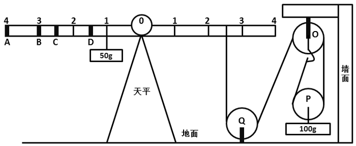

# 2016年广东省公务员录用考试《行测》题（县级以上）

> 常识判断 · 20 题 · 广东 2016

## 第 1 题　qid 1796536 · 科技常识

粮食生产是国民经济的基础，耕地是粮食生产的基础。立足国内耕地资源、保障国家粮食安全是关系我国经济社会发展全局的重大问题。
以下有关表述有误的是（ ）。

- **A**. 人多地少是我国基本国情，人均耕地少于世界上许多国家
- **B**. “坚守18亿亩红线”是指确保我国耕地面积不能低于18亿亩
- **C**. 除保障性安居工程外，任何住房用地均不得占用基本农田　✅
- **D**. 目前，卫星遥感监测技术已被应用于我国耕地保护工作

**答案**：C

**官方解析**

A项：我国土地面积居全世界第三位，但是人均土地面积和人均耕地面积相当于全世界人均水平的30%左右，正确；
B项：2007年温家宝总理在《政府工作报告》中明确指出：一定要守住全国耕地不少于18亿亩这条红线，符合选项表述，正确；
C项：《基本农田保护条例》第十五条规定：“基本农田保护区经依法划定后，任何单位和个人不得改变或者占用。国家能源、交通、水利、军事设施等重点建设项目选址确实无法避开基本农田保护区，需要占用基本农田，涉及农用地转用或者征收土地的，必须经国务院批准。”因此，保障性安居工程不得占用基本农田，而国家能源、交通、水利、军事设施等重点建设项目确实需占用基本农田的，经国务院批准，可占用。故C项表述错误；
D项：遥感技术在我国土地资源调查和耕地保护中，通过20多年的应用和实践，正确。
本题为选非题，故正确答案为C。

---

## 第 2 题　qid 1796550 · 人文常识

以下适合于建设防火林带的树种是（   ）。

- **A**. 木荷　✅
- **B**. 松树
- **C**. 樟树
- **D**. 杉木

**答案**：A

**官方解析**

通过对可燃物的易燃性分析得出，杉木难燃可燃物占总量的比例明显低于8年生以上木荷，而杉木较易燃和较难燃可燃物占有比例明显高于木荷。木荷着火温度高，含水量大，不易燃烧，是营造生物防火林带的理想树种，故A项当选，D项排除。樟树本身也是不易燃的，但是就其枯叶持水能力而言是易燃的，故排除C项。松树属于有油脂的树木，有油脂的树木都是易燃树种，故排除B项。
故正确答案为A。

---

## 第 3 题　qid 1796558 · 科技常识

春耕前，农民向田里施用草木灰主要是为了给农作物补充（   ）元素。

- **A**. 钾　✅
- **B**. 氮
- **C**. 磷
- **D**. 碳

**答案**：A

**官方解析**

草木灰的主要成分是碳酸钾()。草木灰肥料因草木灰为植物燃烧后的灰烬，所以凡是植物所含的矿质元素，草木灰中几乎都含有。其中含量最多的是钾元素，一般含钾6—12%，其中90%以上是水溶性，以碳酸盐形式存在；其次是磷，一般含1.5—3%；还含有钙、镁、硅、硫和铁、锰、铜、锌、硼、钼等微量营养元素。A项正确。

故正确答案为A。

---

## 第 4 题　qid 1796566 · 人文常识

梯田是在山坡上开辟的农田，样子像楼梯，每一级边缘均筑有田埂。一些历史悠久的梯田已成为受国家保护的文化遗产。修建梯田的主要目的是（  ）。

- **A**. 保护环境
- **B**. 传承文化
- **C**. 保持水土　✅
- **D**. 节约人力

**答案**：C

**官方解析**

修建梯田可以使田地的坡度减小，防止丘陵斜坡上的水土流失，有利于保持水土，发展农业。A项说的过于宽泛，B、D项与题干无关。
故正确答案为C。

---

## 第 5 题　qid 1796596 · 人文常识

现代化工业社会过多燃烧煤炭、石油和天然气等化石资源，使自然界更多（更强）地产生灾害性天气（气候）现象，包括有（    ）。
①雾霾 ②极光 ③温室效应 ④龙卷风 ⑤酸雨 ⑥冰雹

- **A**. ②③④
- **B**. ①④⑥
- **C**. ①④⑤
- **D**. ①③⑤　✅

**答案**：D

**官方解析**

极光、冰雹、龙卷风都属于自然现象。极光的产生是自然现象，往往出现于星球的高磁纬地区上空，是一种绚丽多彩的发光现象。而地球的极光，来自地球磁层或太阳的高能带电粒子流（太阳风）使高层大气分子或原子激发（或电离）而产生。龙卷风是一种相当猛烈的天气现象，由快速旋转并造成直立中空管状的气流形成。冰雹，水蒸气凝结成冰或雪，就是下雪了，如果温度急剧下降，就会结成较大的冰团，也就是冰雹。

雾霾、温室效应和酸雨是由于大气污染，煤炭燃烧后会产生、和等有害气体，其中是温室气体，微小颗粒物也是雾霾的因素之一，石油等石化材料过度使用会污染大气环境，产生致癌物和温室效应，破坏臭氧层等。雨水被大气中存在的酸性气体污染，pH小于5.65的酸性降水叫酸雨。酸雨主要是人为的向大气中排放大量酸性物质造成的。我国的酸雨主要是因大量燃烧含硫量高的煤而形成的，多为硫酸雨，少硝酸雨，此外，各种机动车排放的尾气也是形成酸雨的重要原因。

故正确答案为D。

---

## 第 6 题　qid 1796604 · 人文常识

在众多色彩中，人们往往对红色“情有独钟”，常采用红灯做指示，比如指挥交通的红灯，汽车尾部的红灯，公共场所安全门的红灯。这是因为，红色光在可见光中（  ）。

- **A**. 波长最长，且不容易被散射　✅
- **B**. 波长最短，且不容易被散射
- **C**. 波长最长，且容易被散射
- **D**. 波长最短，且容易被散射

**答案**：A

**官方解析**

红色，可见光谱中长波末端的颜色，波长大约为620-760纳米，类似新鲜血液的颜色，是三原色和心理原色之一。在所有的可见光中，红光的波长是最长的，因此红光的穿透力最强。大气对光的散射有一个特点：波长较短的光容易被散射，波长较长的光不容易被散射；因此红光不易被散射，它可以传得较远。所以，汽车尾灯和交通紧急提示灯都用红光，A项当选，其他选项说法本身错误。
故正确答案为A。

---

## 第 7 题　qid 1796608 · 人文常识

人口红利是指一个国家的劳动年龄人口占总人口比重较大，抚养率比较低，为经济发展创造了有利的人口条件。目前，我国正处于人口红利的（   ）阶段。

- **A**. 成熟
- **B**. 发展
- **C**. 停滞
- **D**. 下降　✅

**答案**：D

**官方解析**

1990年我国进入人口红利期，1990年—2010年人口红利逐步提升，2010年抚养比下降到34.2%最低值、人口红利上升到峰值；其后人口红利逐渐衰减，2030年前后衰减为零并随即转变到人口负债期；而后负债率逐步走高，2050年抚养比将达到62%左右，负债率也将创出新高。A应属于2010年的成熟时期。B属于90年代到2010年的上升时期，目前我国人口红利是下降趋势。C是未来的老龄化社会时期，也排除。
故正确答案为D。

---

## 第 8 题　qid 1796610 · 人文常识

当一种商品价格升高而导致另一种商品需求的增加，那么这两种商品之间存在替代关系，互为替代品。下列各项中的两种商品互为替代品的是（  ）。

- **A**. 羊肉、牛肉　✅
- **B**. 大米、糖果
- **C**. 手表、时钟
- **D**. 电脑、手机

**答案**：A

**官方解析**

替代品是指两种商品可以互相代替来满足同一种需求，一种商品价格的上升会导致另一种商品需求的增加。
A项正确：羊肉和牛肉能满足消费者的同一种需求，羊肉价格上升，消费者会减少对羊肉的需求，转而购买牛肉，牛肉的需求量会增加。
B项错误：大米和糖果不能满足消费者的同一种需求，大米价格的上升，不会导致糖果需求量的增加，不互为替代品。
C项错误：手表和时钟虽然都可以计算时间，但功能并不完全相同，手表可以随身携带，时钟则不可以，手表价格的上升不会导致时钟需求量的增加，不互为替代品。
D项错误：电脑和手机不能满足消费者的同一需求，电脑价格的上升不会导致手机需求量的增加，不互为替代品。
故正确答案为A。

---

## 第 9 题　qid 1796614 · 科技常识

人们在厨房做菜时，如果不小心把水滴进热油锅中，常常会发生溅油的现象。这是因为（  ）。

- **A**. 水与油一起加热产生了化学反应，释放出热量
- **B**. 水密度比油大而沸点比油低，会在油面下迅速汽化　✅
- **C**. 油在加热情况下与水相溶，更容易蒸发而产生气泡
- **D**. 水在加热时对流速度加快，与油发生摩擦而产生了热量

**答案**：B

**官方解析**

油的密度比水的小，且其沸点比水的大，所以水滴入热油中，水被瞬时加热，超过了水的沸点，会沸腾，将油溅起来，就产生了“溅油”现象，故B项正确。溅油现象属于物理现象不是化学反应，故A项错误。水分子和油分子由于表面张力差别太大，互相不会融合。水分子在油里面是以滴状形式存在的。换句话说，油水互不交融也不会产生摩擦，故C、D项错误。
故正确答案为B。

---

## 第 10 题　qid 1796622 · 科技常识

物质在发生能量转化时通常都存在一系列的物理或化学反应，下列能量转化的过程存在化学反应的是（    ）。

- **A**. 风力发电
- **B**. 烧煤取暖　✅
- **C**. 冰雪融化
- **D**. 酒精挥发

**答案**：B

**官方解析**

物理变化是指没有生成其他物质的变化，例如风力发电，酒精挥发，冰雪融化，灯泡发光等。化学变化是变化时生成其他物质的变化，例如木条燃烧，铁生锈，食物腐烂等，化学变化不但生成其他物质，而且伴随能量变化，常表现为吸热，放热，发光等。A、C、D三项均属于物理变化。
故正确答案为B。

---

## 第 11 题　qid 1796624 · 人文常识

声音可以在固态、液态和气态的介质中传播，传播的速度与介质分子间距有关，分子间距越小，声音的传播速度越快。下列介质中声音传播速度最快的是（    ）。

- **A**. 铁棒　✅
- **B**. 竹竿
- **C**. 盐水
- **D**. 液态汞

**答案**：A

**官方解析**

声音传播的速度与介质的种类有关：声音在固体中传播的最快，在气体中传播的最慢，液体介于两者之间。而铁棒的密度要大于竹竿，因此声音通过铁棒传播的速度更快。所以排除B、C、D三项，只有A项属于密度最大的固体。
故正确答案为A。

---

## 第 12 题　qid 1796628 · 科技常识

吸烟严重威胁人体健康。针对香烟产生的各种有害物质的描述，下列说法错误的是（    ）。

- **A**. 尼古丁可让吸烟者成瘾，并有较强的毒性
- **B**. 烟焦油易沉积于肺等器官，可诱发癌变
- **C**. 香烟燃烧时物质分解放出的射线可以致癌
- **D**. 一氧化碳易溶于水，从而与血红蛋白结合　✅

**答案**：D

**官方解析**

吸烟严重威胁人体的健康，香烟燃烧时释放的烟雾中含有3800多种已知的化学物质，绝大部分对人体有害，其中包括一氧化碳、尼古丁等生物碱、胺类、腈类、醉类、酚类、烷烃、醛类、氮氧化物，多环芳烃、杂环族化合物、羟基化合物、重金属元素、有机农药等。
香烟中含有的尼古丁可以使吸烟者成瘾，并有较强的毒性，A项说法正确。
烟焦油易沉积于肺等器官，可诱发癌变，B项说法正确。
C项中香烟燃烧时物质分解放出的射线可以致癌的表述，目前科学界对此缺乏公认的理论，说法也不一，香烟中的致癌物目前我们通常认为是多环芳香烃和亚硝胺之类的化合物，但据最权威的美国《科学》杂志公布的一项调查研究表明：香烟燃烧时产生的钋210的放射性射线辐射会有2%的几率致癌，符合题干可以致癌的表述。
D项一氧化碳更容易和血红蛋白结合的原因是：一氧化碳与血红蛋白的亲和力比氧和血红蛋白的亲和力大200－300倍而非易溶于水，二者无因果关系，且一氧化碳的物理性质之一是可（此处有争议，一种说法为微溶，一种为难溶，但没有易溶的说法）溶于水，而非易溶于水。
C项表述缺乏严谨的理论依据，但是得到主流科学媒体的认同，D项无因果关系且有表述错误。
本题为选非题，故正确答案为D。

---

## 第 13 题　qid 2031580 · 人文常识

在我国的一些地区，冰雹通常出现在（    ）天气。

- **A**. 春日的阴雨
- **B**. 夏日的雷暴　✅
- **C**. 秋日的晴朗
- **D**. 冬日的寒冷

**答案**：B

**官方解析**

B项正确：冰雹是在气流强烈升降条件下发生的一种固态降水现象，冰粒呈圆球形或圆锥形，直径一般为5～50毫米，大的有时可达10厘米以上。冰雹只有在热湿气流强烈上升时才能产生，所以多发生在夏季或春夏之交的雷暴天气。
A、C、D项的天气均无法满足冰雹形成的条件。
故正确答案为B。

---

## 第 14 题　qid 2031612 · 科技常识

木本植物指根和茎因增粗生长形成大量的木质部，而细胞壁也多数木质化的坚固的植物，是草本植物的对应词，以下属于木本植物的是（    ）

- **A**. 牡丹　✅
- **B**. 玉米
- **C**. 菊花
- **D**. 棉花

**答案**：A

**官方解析**

A项正确：木本植物依形态不同可分为乔木、灌木和半灌木三类，牡丹是多年生落叶小灌木，茎高达2米，分枝短而粗，属于木本植物；
B项错误：玉米是禾本科玉蜀黍属，是一年生草本植物；
C项错误：菊花是菊科、菊属的多年生宿根草本植物；
D项错误：棉花是锦葵科棉属植物的种籽纤维，是一年生草本植物。
故正确答案为A。

---

## 第 15 题　qid 1796632 · 科技常识

自然界中，我们看到大部分植物的叶片都呈现绿色，对此解释正确的是（    ）。

- **A**. 叶片进行光合作用吸收了绿光
- **B**. 叶片进行光合作用释放出绿光
- **C**. 叶片反射了太阳光中的绿光　✅
- **D**. 叶片表皮覆盖着一层绿色物质

**答案**：C

**官方解析**

不透明的物体的颜色是由它反射的光的颜色决定的，植物叶子是不透明的。当阳光照在叶片上，阳光的七彩颜色被叶片吸收，只有绿色光被反射。所以，植物的叶子大多是绿色的。其他选项本身说法错误。
故正确答案为C。

---

## 第 16 题　qid 1796638 · 科技常识

如图所示，一个装有水的杯子中悬浮着一个小球，杯子放在斜面上，该小球受到的浮力方向是（  ）。

- **A**. F1
- **B**. F2
- **C**. F3　✅
- **D**. F4

**答案**：C

**官方解析**

浮力的方向总是竖直向上的，不受物体的位置，形状等因素的影响，即图中小球所受浮力为F3，故C项正确。
故正确答案为C。

---

## 第 17 题　qid 1796582 · 科技常识

如图所示，物体沿斜面匀速滑下时，它的（   ）。

- **A**. 动能增加，重力势能减少，机械能不变
- **B**. 动能不变，重力势能减少，机械能不变
- **C**. 动能增加，重力势能不变，机械能减少
- **D**. 动能不变，重力势能减少，机械能减少　✅

**答案**：D

**官方解析**

物体的动能由物体的质量与速率决定，即匀速下滑的物体动能不变；物体的重力势能由物体的质量与所处高度决定，匀速下滑的物体重力势能减少；物体的机械能是动能与重力势能的总和，则匀速下滑的物体机械能减小，故D项正确。
故正确答案为D。

---

## 第 18 题　qid 1796602 · 科技常识

如图所示，实心蜡球漂浮在杯中的水面上，当向杯中不断慢慢加入酒精时，以下不可能出现的情况是（   ）。（已知：水的密度蜡球的密度酒精的密度）

- **A**. 蜡球向下沉一些，所受浮力增大　✅
- **B**. 蜡球向下沉一些，所受浮力不变
- **C**. 蜡球悬浮于液体中，所受浮力不变
- **D**. 蜡球沉到杯底，所受浮力变小

**答案**：A

**官方解析**

当酒精缓慢加入水中，水和酒精混合，混合液体的密度小于水的密度，则随着酒精的注入，将发生如下现象：首先，蜡球向下沉一下，增大排开液体的体积，此时蜡球所受浮力仍不变，等于蜡球所受重力；然后，随着加入酒精的增多，蜡球完全浸没进液体中，所受浮力仍等于蜡球所受重力；最后，液体密度小于蜡球密度，蜡球完全浸没液体中，所受浮力小于蜡球所受重力，蜡球将沉入杯底。即A项错误，故选A项。
本题为选非题，故正确答案为A。

---

## 第 19 题　qid 1796514 · 科技常识

如图所示，在一个装着水的杯子里放进一块冰，则在冰块融化的过程中，杯子水面高度的变化情况应当是（    ）。

- **A**. 一直上升
- **B**. 先下降后上升
- **C**. 先上升后下降
- **D**. 一直不变　✅

**答案**：D

**官方解析**

问题求解：冰所受的浮力等于其所受重力，由于冰融化前后所受的重力不变，其排开水的体积不发生变化，则杯中液面不发生变化，故D项正确。
故正确答案为D。

---

## 第 20 题　qid 1796524 · 科技常识

如图所示，地面上有一架天平，天平左端系有一个50g的物体，右端通过绳子连接一组滑轮。滑轮组合中，O、Q为定滑轮，P为动滑轮，下端系有一个100g的物体。要使天平两端平衡，需要的操作是（  ）。

- **A**. 在A处挂上重15g的物体
- **B**. 在B处挂上重25g的物体　✅
- **C**. 在C处挂上重50g的物体
- **D**. 在D处挂上重75g的物体

**答案**：B

**官方解析**

问题求解：右方滑轮组有效的绳子段数为2，若要保持滑轮组的平衡，等同于天平右端对应绳的位置放入质量为50g物体。若保持系统左端天平的平衡，则天平两端需满足力矩平衡原理：。图中数据代入公式可知：，选项中数值代入得，ACD项不满足等式，故B项正确。

故正确答案为B。

---
