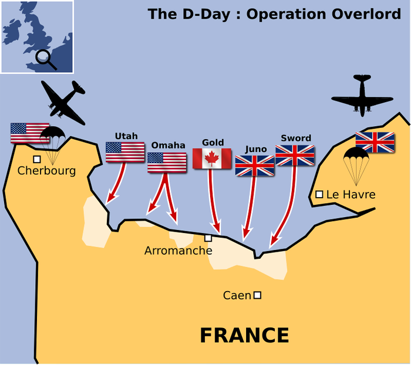

# 2016年重庆市公务员录用考试《行测》题（下半年）

> 常识判断 · 20 题 · 重庆 2016

## 第 1 题　qid 2015366 · 地理国情

下图为第二次世界大战中某著名战役的示意图，下列关于这一战役的说法<b>错误</b>的是：

- **A**. 发生于1944年6月
- **B**. 登陆部队横渡的海峡是英吉利海峡
- **C**. 是迄今为止世界上规模最大的一次海上登陆作战
- **D**. 参战双方是以英国、法国和美国为首的协约国和以德国为首的同盟国　✅

**答案**：D

**官方解析**

D项错误：图示战役为诺曼底登陆。诺曼底登陆是第二次世界大战中盟军在欧洲西线战场发起的一场大规模攻势，参战双方为英国、加拿大和美国为首的同盟国和以德国为首的轴心国。
A项正确：诺曼底登陆发生于1944年6月。
B项正确：诺曼底登陆的战役目的为横渡英吉利海峡，在法国北部夺取战略性登陆场，为开辟欧洲第二战场创造条件。
C项正确：诺曼底登陆是迄今为止世界上规模最大的一次海上登陆作战。盟军参战兵力达到288万，德军兵力达到138万。
本题为选非题，故正确答案为D。

---

## 第 2 题　qid 2024102 · 人文常识

理学家朱熹曾以山水为题材，写下大量脍炙人口的诗作，体现出“以诗人比兴之体，发圣人义理之秘”的特征。
下列选项属于“发圣人义理之秘”的是：

- **A**. 上有苍石屏，百仞耸雄观
- **B**. 水深波浪阔，浮绿春涣涣
- **C**. 浅麓下萦回，深林久丛灌
- **D**. 珍重舍瑟人，重来足幽伴　✅

**答案**：D

**官方解析**

“以诗人比兴之体，发圣人义理之秘”是宋代理学诗人真德秀提出的哲理文学观，其大意是借助诗歌这一载体来表达义理，即“托物言志”。题干四个选项的诗句均出自朱熹的诗作《行视武夷精舍作》。A、B、C三个选项均是描写武夷精舍的自然环境，属于写景，“以诗人比兴之体”类；D项诗句则是抒发了诗人对友情的重视，属于“发圣人义理之秘” 类。
故正确答案为D。

---

## 第 3 题　qid 2015430 · 人文常识

下列诗句中所蕴含的哲理不同于其他三项的是：

- **A**. 人间四月芳菲尽，山寺桃花始盛开
- **B**. 乱花渐欲迷人眼，浅草才能没马蹄　✅
- **C**. 深处种菱浅种稻，不深不浅种荷花
- **D**. 梅须逊雪三分白，雪却输梅一段香

**答案**：B

**官方解析**

本题考查哲学常识，主要涉及辩证法的相关知识。
A项：该诗句的意思是：四月的花基本凋谢了，但是山寺桃花依然盛开。因为山上和山下地势不同，温差不同，所以同一植物生长的状况也不同，体现了矛盾具有特殊性，要求我们具体问题具体分析。
B项：该诗句的意思是：眼观岸边野花，渐使游人为之着迷；路上浅浅绿草，仅能把马蹄遮盖。这两句从植物的变化写早春景象，作者通过对景色的客观描写，表达了作者流连忘返，在西湖早春风光中无比喜悦的感受，并没有体现哲学道理。
C项：该诗句的意思是：在水深的地方种上菱角，水浅的地方种植水稻，在那不深不浅的水域里种上荷花。不同的植物种在不同的地方，体现了矛盾的特殊性，要求我们做任何事情都要从实际出发，因地制宜，不能形而上学地搞一刀切，绝对化。
D项：该诗句的意思是：梅花须逊让雪花三分晶莹洁白，雪花却没有梅花的清香。梅香而不白，雪白而无香说明事物既有优点，也有不足，体现了矛盾普遍性与特殊性相结合的原理，告诉我们要用全面的观点看问题。
A、C、D项都体现了矛盾的特殊性原理。
本题为选非题，故正确答案为B。

---

## 第 4 题　qid 2015402 · 人文常识

东坡居士苏轼有可能与下列哪一名句的作者一起推杯换盏、吟诗作对：

- **A**. 在天愿作比翼鸟，在地愿为连理枝
- **B**. 长风破浪会有时，直挂云帆济沧海
- **C**. 问渠那得清如许，为有源头活水来
- **D**. 两情若是久长时，又岂在朝朝暮暮　✅

**答案**：D

**官方解析**

D项正确：本句出自北宋词人秦观的《鹊桥仙》。秦观（1049年—1100年）与苏轼（1037年—1101年）生活在同一时期，有可能一起推杯换盏、吟诗作对。
A项错误：本句出自唐代诗人白居易的《长恨歌》。白居易（772年—846年）与苏轼不是同一朝代的人物。
B项错误：本句出自唐代诗人李白的《行路难》。李白（701年—762年）与苏轼不是同一朝代的人物。
C项错误：本句出自南宋诗人朱熹的《观书有感·其一》。朱熹（1130年—1200年）与苏轼不是同一朝代的人物。
故正确答案为D。

---

## 第 5 题　qid 2015418 · 人文常识

王某最近失业了，因其有失业保险，在一定时期内，每个月可领到一笔失业救济金，所以他不用过于担心生活问题，可以继续安心找工作。而李某失业后没有失业保险，一段时间后，仍然没有找到新工作，积蓄也花光了，生活陷入困境，于是他开始小偷小摸。
上述材料中的失业保险体现了下列社会保障的哪一项功能？

- **A**. 促进经济发展
- **B**. 保持社会公平
- **C**. 维护社会稳定　✅
- **D**. 增进国民福祉

**答案**：C

**官方解析**

失业保险是指国家通过立法强制实行的，由社会集中建立基金，对因失业而暂时中断生活来源的劳动者提供物质帮助的制度。
题干通过对比有失业保险的王某和没有失业保险的李某，在失业之后对社会的无害和有害相反情形，来体现失业保险的稳定社会作用。
A项错误：题干并未涉及经济发展相关内容。
B项错误：社会公平体现的是人们之间一种平等享受生存权、发展权、产权的社会关系。题干中王某有失业保险，李某却没有，因此未体现出保持社会公平功能。
C项正确：没有失业保险的李某，失业后偷窃，损害社会治安和稳定。有失业保险的王某可安心找工作，对社会无害，对比可知，体现的即为维护社会稳定功能。
D项错误：失业保险是一种社会救济制度，目的是帮助失业者渡过难关，而非是在国民原有福祉基础上去增进。
故正确答案为C。

---

## 第 6 题　qid 2015432 · 人文常识

下列关于军事知识的说法正确的是：

- **A**. M16步枪是德国人发明的
- **B**. 美国鱼鹰运输机具备垂直升降能力　✅
- **C**. 航空母舰是世界上排水量最大的船只
- **D**. 海军航空兵是在海洋上空执行作战任务的空军兵种

**答案**：B

**官方解析**

B项正确：美国鱼鹰运输机是美国国防部“多用途垂直起降飞机研制计划”的产物，集直升机的垂直直降和固定翼飞机的高速度、大载荷、大航程等优点于一身。
A项错误：M16由美国军方主导研制，是第二次世界大战后美国换装的第二代步枪，被誉为当今世界六大名枪之一。
C项错误：世界上排水量最大的船只是诺克·耐维斯号油轮，排水量48万吨。且选项表述本身有误，船只是非集合概念，特指某一艘船；而航空母舰是集合概念，包含很多排水量存在差异的个体，用非集合概念特性判定集合概念不合逻辑。
D项错误：海军航空兵是在海洋上空执行作战任务的海军兵种，按照起降基地不同，分为岸基航空兵和舰载航空兵。
故正确答案为B。

---

## 第 7 题　qid 2015306 · 法律常识

下列4个日常生活谚语与我国现行法律法规不完全一致的是：
①法不责众②父债子还③欠债还钱④杀人偿命

- **A**. ①②③
- **B**. ①②④
- **C**. ②③④
- **D**. ①②③④　✅

**答案**：D

**官方解析**

①法不责众，与我国现行法律规定不一致。法具有“规范性、强制性、普遍性”，宪法规定“我国公民在法律面前一律平等”，法治有“违法必究”原则，刑法有“罪责刑相适应”原则，故“法应责众”，对于违法犯罪分子，并不考虑人数多寡，均应受到法律惩处。
②父债子还，与我国现行法律规定不完全一致。根据《民法典》第一千一百六十一条规定：“继承人以所得遗产实际价值为限清偿被继承人依法应当缴纳的税款和债务。超过遗产实际价值部分，继承人自愿偿还的不在此限。继承人放弃继承的，对被继承人依法应当缴纳的税款和债务可以不负清偿责任。”故对于父债，如果子女继承其父母遗产的才需要代偿，如不继承无需代偿。
③欠债还钱，与我国现行法律规定不完全一致。民法规定债务除清偿外，还有免除、混同、抵销、提存4种方式，其中混同（债权人、债务人归于同一人的事实）、免除（债权人放弃债权）均无需履行债务，即欠债不一定需要还钱。
④杀人偿命，与我国现行法律规定不完全一致。根据《刑法》第二百三十二条规定：“故意杀人的，处死刑、无期徒刑或者十年以上有期徒刑；情节较轻的，处三年以上十年以下有期徒刑。”可知，杀人存在无需“偿命”的情况。
①②③④都与现行法律规定不完全一致。
故正确答案为D。

---

## 第 8 题　qid 2015316 · 人文常识

下列关于对外开放的历史事件，按照实际先后顺序排列正确的是：
①设立经济特区
②推进“一带一路”建设
③开放沿海城市
④全面开放沿边、沿江及内陆省会城市
⑤开发开放浦东新区

- **A**. ①③④⑤②
- **B**. ①③⑤④②　✅
- **C**. ①④③⑤②
- **D**. ①⑤③④②

**答案**：B

**官方解析**

本题考查人文常识。
①1979年4月30日，邓小平首次提出要开办“出口特区”，后于1980年3月24日将“出口特区”改名为“经济特区”，并在深圳加以实施。1980年5月，中共中央和国务院决定将深圳、珠海、汕头和厦门这四个出口特区改称为经济特区。
②2013年9月和10月，中国国家主席习近平在出访中亚和东南亚国家期间，先后提出共建“丝绸之路经济带”和“21世纪海上丝绸之路”的重大倡议，得到国际社会高度关注。2016年04月23日，中国“一带一路”规划正式公布。
③沿海开放城市是中国沿海地区对外开放的、并在对外经济活动中实行经济特区的某些特殊政策的一系列港口城市。1984年，大连、秦皇岛等14个沿海城市，被国务院批准为全国首批对外开放城市。
④继1992年沿海、沿边城市相继对外开放之后，国务院于1998年8月13日又发出通知，决定进一步对外开放5个长江沿岸城市，4个边境、沿少海地区省会(首府)城市，11个内陆地区省会(首府)城市，实行沿海开放城市的政策。至此，我国全方位对外开放的新格局已初步形成。
⑤1990年，中央政府决定开放浦东，使浦东新区成为上海新兴高科技产业和现代工业基地，成为上海新的经济增长点，成为中国90年代改革开放的重点和标志。
以上历史事件的正确排序为①③⑤④②。
故正确答案为B。

---

## 第 9 题　qid 2024106 · 科技常识

通常情况下，电子政务业务分为政务信息查询、公共政务办公、政府办公自动化3个领域，其业务流程如下图所示。下列选项依次填入图中①、②、③空缺处正确的是：

- **A**. 政务信息发布系统、政务业务办理系统、办公自动化系统
- **B**. 办公自动化系统、政务信息发布系统、政务业务办理系统　✅
- **C**. 政务业务办理系统、办公自动化系统、政务信息发布系统
- **D**. 政务业务办理系统、政务信息发布系统、办公自动化系统

**答案**：B

**官方解析**

B项正确：根据政府机构的业务形态来划分，电子政务包括政务信息查询、公共政务办公、政府办公自动化三个应用领域。政务信息查询是为社会公众和企业组织提供查询服务；公共政务办公是借助互联网实现政府机构的对外办公，办理政务相关业务；办公自动化系统是以信息化手段提高政府机构内部办公的效率。从业务流程来看，政府通过办公自动化系统，将信息更新到政务信息发布系统上，供社会公众和企业查询；政府工作人员与社会公众和企业之间，则通过政务业务办理系统建立沟通，处理相关业务。
故正确答案为B。

---

## 第 10 题　qid 2024108 · 人文常识

下列关于中国教育史的表述错误的是：

- **A**. 我国最早专门论述教育问题的著作是《学记》
- **B**. 严复的“三育论”是指“鼓民力”“开民智”“新民德”
- **C**. 《三字经》《百家姓》和《千字文》是我国古代的蒙学教材
- **D**. 蔡元培提倡“五育并举”，五育是指实利主义教育、公民道德教育、世界观教育、美感教育和劳动教育　✅

**答案**：D

**官方解析**

A项：《学记》是我国古代典章制度专著《礼记》中的一篇，写于战国晚期，是我国也是世界上最早的一篇专门论述教育和教学问题的论著，正确；
B项：严复受达尔文的进化论和斯宾塞社会学说的影响，在教育作用问题上，提出“三育论”， 主张鼓民力、开民智和新民德，正确；
C项：《三字经》《百家姓》《千字文》简称“三百千”，是我国古代影响较大且流行较广的儿童启蒙读物，正确；
D项：“五育并举”是由我国教育思想家蔡元培提出的教育思想主张，“五育”指的是“军国民教育、实利主义教育、公民道德教育、世界观教育、美感教育”，D项中的“劳动教育”不属于“五育”之一，错误。
本题为选非题，故正确答案为D。

---

## 第 11 题　qid 2015320 · 人文常识

下列关于里约热内卢奥运会的说法正确的是：
①里约热内卢是奥运史上首个举办奥运会的南美洲城市
②里约热内卢是首个举办奥运会的葡萄牙语城市
③现代奥运会开幕式最先进场的代表团是东道国代表团
④国际奥委会主席巴赫宣布里约奥运会口号：“一个新世界”
⑤里约奥运会新增高尔夫、五人制橄榄球两项赛事

- **A**. ①②④　✅
- **B**. ②③⑤
- **C**. ①③⑤
- **D**. ②③④

**答案**：A

**官方解析**

①②第31届夏季奥林匹克运动会，又称2016年里约热内卢奥运会，于2016年8月在巴西的里约热内卢举行。里约热内卢成为奥运史上首个主办奥运会的南美洲城市，同时也是首个主办奥运会的葡萄牙语城市，正确。
③北京时间8月6日早晨7点，2016里约奥运会开幕式举行，按照传统，希腊代表团将在旗手的带领下首先步入会场，东道主巴西队将作为最后一个代表团入场。故“最先进场为东道主代表团”表述错误，按照传统应该是希腊代表团第一个进场，错误。
④2016年6月14日，国际奥委会主席巴赫宣布里约奥运会口号“一个新世界”，正确。
⑤2009年10月9日，第121届国际奥林匹克委员会大会投票决定高尔夫和七人制橄榄球成为2016年里约热内卢奥运会、2020年东京奥运会的正式比赛项目。故“五人制橄榄球”表述错误，应该为“七人制橄榄球”，错误。
①②④表述正确，故正确答案为A。

---

## 第 12 题　qid 2015332 · 人文常识

我国大气，地表水环境与资源管理中实行污染物排放总量控制，这一规定体现的生态规律是：

- **A**. 物质循环转换与再生规律
- **B**. 环境资源的有效极限规律　✅
- **C**. 物质输入输出的动态平衡规律
- **D**. 相互依存与相互制约的互生规律

**答案**：B

**官方解析**

本题考查生物常识，主要考查生态规律相关知识。
题干表述污染物的排放要与大气、地表水的承受能力相对应，而不能超过承受极限，否则会造成更为严重的后果，说明环境资源的承受能力是有极限的。
B项正确：环境资源的有效极限规律，是指生态系统中作为生物赖以生存的各种环境资源，在质量、数量、空间、时间等方面，都有一定的限度，而不能无限制地供给，因此，每一个生态系统对任何外来干扰都有一定的忍耐极限，当外来干扰超过此极限时，生态系统就会被损伤、破坏甚至瓦解。这一规律要求我们要注意极限，坚持适度原则。
A项错误：物质循环转换与再生规律，是指生态系统中，植物、动物、微生物和非生物成分，借助能量的不停流动，由此形成不停顿的物质循环。未体现环境资源的承受能力。
C项错误：物质输入输出的平衡规律，是指当一个自然生态系统不受人类活动干扰时，生物与环境之间的输入与输出是相互对立的关系，对生物体进行输入时，环境必然进行输出，反之亦然。未体现环境资源的承受能力。
D项错误：相互依存与相互制约的互生规律，主要分为两类：（1）普遍的依存与制约，也称“物物相关”，是指有相同生理、生态特性的生物构成生物群落或生态系统；（2）通过“食物”而相互联系与制约的协调关系，也称“相生相克”规律，即每一种生物在食物链或食物网中，都占据一定的位置，并具有特定的作用。未体现环境资源的承受能力。
故正确答案为B。

---

## 第 13 题　qid 2015346 · 科技常识

中药材的主要来源包括动物、植物、矿物等，下列哪一选项属于动物类药材？

- **A**. 田七、阿胶
- **B**. 地龙、牛黄　✅
- **C**. 龙骨、鸡内金
- **D**. 决明子、蝉衣

**答案**：B

**官方解析**

本题考查生活常识，主要考查医药常识。
动物类药材是中医药学遗产中的重要组成部分。中医药学历来认为：动物类药材属“血肉有情之”，具有疗效确切、历史悠久等特点，而倍受重视。
A项错误，田七是五加科人参属，属于植物类药材；阿胶是以驴皮为主要原料，放阿井之水而制成，属于动物类药材。
B项正确，地龙即蚯蚓，属于动物类药材；牛黄是脊索动物门哺乳纲牛科动物牛肝脏的胆结石，属于动物类药材。
C项错误，龙骨为古代哺乳动物如象类、犀牛类、三趾马等的骨骼的化石，属于矿物类药材；鸡内金是指家鸡的砂囊内壁，属于动物类药材。
D项错误，决明子是一年生半灌木状草本，属于植物类药材；蝉衣是蝉科昆虫黑蚱羽化后的蜕壳，属于动物类药材。
故正确答案为B。

---

## 第 14 题　qid 2015350 · 科技常识

在催化剂中，能够使化学反应加快速度的称为正催化剂，使化学反应速度减慢的称为负催化剂，下列属于负催化剂的是：

- **A**. 为防止食用油脂酸化而加入的没食子酸正丙酯　✅
- **B**. 在分解氯酸钾制备氧气实验时加入的二氧化锰
- **C**. 在用锌和稀硫酸反应制备氢气时加入的硫酸铜
- **D**. 在大雪后为促使积雪融化而在马路上撒下的盐

**答案**：A

**官方解析**

本题考查化学常识，主要考查催化剂相关知识。
题干给出了负催化剂的定义，即导致化学反应速度减慢的催化剂。可将此概念代入各选项进行一一比对。
A项正确，没食子酸正丙酯的作用是减慢食用油脂酸化的速度，属于负催化剂。
B项错误，二氧化锰能加快氯酸钾的分解速度，属于正催化剂，故排除。
C项错误，硫酸铜能加快锌和稀硫酸的反应，属于正催化剂，故排除。
D项错误，促使积雪融化，在马路上撒盐属于物理现象，不是化学反应。
故正确答案为A。

---

## 第 15 题　qid 2015356 · 人文常识

变色太阳镜的镜片能在太阳光线射来之后变暗，光线减弱后变亮，这是因为：

- **A**. 镜片吸收水平偏振光线，使镜片变暗，光线减弱后，水平偏振光增强使镜片变亮
- **B**. 镜片有选择地反射部分波段的光线，使镜片变暗，光线减弱后，透射光增加使镜片变亮
- **C**. 镜片中的晶体见光分解，吸收光线使镜片变暗，光线变暗时，晶体重新形成，镜片变亮　✅
- **D**. 镜片有选择地吸收部分波段的太阳光线，使镜片变暗，光线变暗时，反射光加强，镜片变亮

**答案**：C

**官方解析**

本题考查物理常识。
变色太阳镜在阳光下光线强烈照射时，镜片颜色会渐渐变深，可以保护眼睛免受强光刺激；进入室内，光线减弱，镜片颜色渐渐变浅，保证了对景物的正常观察。
C项正确：变色太阳镜的镜片是用含氯化银微晶体的光学玻璃制作的，根据光色互变可逆反应原理，在日光和紫外线照射下可迅速变暗，完全吸收紫外线，对可见光呈中性吸收；回到暗处，能快速恢复无色透明。
A项错误：偏振光是电矢量相对于传播方向以一固定方式振动的光，偏振镜主要应用于摄影，可以改变蓝天影调和色调、模拟夜景效果、改善非金属物体表面耀斑部位的影像清晰度、质感和色彩饱和度等。
B项错误：光投射到两种介质的分界面时，一部分光线改变了传播方向，返回第一媒介质继续传播，称之为光的反射。即光学镜片都会发生光的反射，并不是变色太阳镜变暗的原理。
D项错误，有选择性地吸收部分太阳波段的光线是偏光太阳镜的原理，即我们常说的墨镜，偏光太阳镜的镜片由于金属粉末过滤装置，能在光线射入时对其进行选择，将所有有害光线都阻隔掉却不影响可视光的透过，能够很好的保护眼睛不受阳光中有害光线的伤害。
故正确答案为C。

---

## 第 16 题　qid 2015364 · 科技常识

下列古语与物理现象对应错误的是：

- **A**. 磁石召铁，或引之也——磁现象
- **B**. 马力即竭，辀（指车辕）犹能一取焉——惯性现象
- **C**. 鉴洼，景一小而易倒，一大而正，说在中之外、内——凸面镜成像　✅
- **D**. 瓶存二窍，以水实之，倒泄；闭一则水不下，盖（气）不升则水不降——大气压力现象

**答案**：C

**官方解析**

本题考查物理常识，主要考查生活中常见的物理现象对应的原理。
C项错误：战国时期的《墨子·经下》中记载：“鉴洼，景一小而易，一大而正。说在中之外、内。”意思是：凹面镜成像，一种情况是缩小而倒立，一种情况是放大而正立，这是由于物处于“中”的外、内的不同而造成的。“鉴洼”即凹面镜，“中”是指球面中心与焦点之间的区域。
A项正确：战国时期秦国的《吕氏春秋》中记载：“磁石召铁，或引之也。”意思是：磁石吸引铁器，是有一种力在吸引它。这是物理上的磁现象。
B项正确：春秋时期的《考工记》中记载：“马力既竭，辀犹能一取焉。”意思是：在马拉车时，马不走了，即马对车不施力了，车子还有前进的趋势。这是物理上的惯性现象，说明物体不受力了，却依然具有速度。
D项正确：南北朝时期的《关尹子·九药篇》中记载：“瓶存二窍，以水实之，倒泻；闭一则水不下，盖（气）不升则（水）不降。”意思是：有两个小孔的瓶子能倒出水，如果闭住一个小孔，另一个小孔外面的空气压力会比瓶里水的压力大，水就流不出来。这是物理上的大气压力现象，即虹吸原理。
本题为选非题，故正确答案为C。

---

## 第 17 题　qid 2024114 · 科技常识

据报道，一个小行星采矿公司释放了一颗试验性小行星采矿探测器，希望其深入太阳系寻找具有采矿前景的近地小行星。该探测实验第一步的中心任务是从小行星提取水分。
下列关于探测器提取水分原因的解释最合理的是：

- **A**. 太空提取的水分没有污染，有利于科学研究
- **B**. 水是生命之源，提取水分有助于寻找地外生命
- **C**. 水可以被分解为氧和氢，能为探测器提供优质燃料　✅
- **D**. 地球水资源严重污染，必须从太空获取洁净的水资源供给人类

**答案**：C

**官方解析**

C项正确：报道中的小行星采矿公司为美国一家致力于开采自然资源和开展太空探索的科技公司——“行星资源”公司。该公司在新闻发布会上表示，除了开采行星上丰富的矿产资源，还将对太空进行探索。小行星上拥有丰富的水资源，水可以被分解为氧和氢，能够为外星探测设施提供燃料，成为深入探索太空的基石。C项最能解释为何探测实验第一步的中心任务是从小行星提取水分。ABD项的解释均不恰当。
故正确答案为C。

---

## 第 18 题　qid 2015376 · 人文常识

用砂锅煮食物，食物煮好后，让砂锅离开火炉，食物将在锅内继续沸腾一段时间，这是因为：

- **A**. 
砂锅是不良导体，导热速度较慢，锅内食物温度上升较慢

- **B**. 
锅内食物吸收较多热量，温度超过，降温所需时间较长

- **C**. 
离开火炉的砂锅锅底超过，食物继续吸热，会保持沸腾状态
　✅
- **D**. 
砂锅热容量较大，离开火炉后，食物将从砂锅吸收热量，温度继续上升

**答案**：C

**官方解析**

本题考查物理常识，主要考查物体的状态变化。

C项正确：用砂锅煮食物，食物煮好后，让砂锅离开火炉，食物将在锅内继续沸腾一段时间，这是因为砂锅离开火炉时，砂锅底的温度高于，而锅内食物为，离开火炉后，锅内食物能从锅底吸收热量，继续沸腾，直到锅底的温度降为为止。

A项错误：在已经达到沸点时，温度不会继续上升，砂锅导热速度慢，因此锅内食物温度降低较慢。

B项错误：在1个标准大气压下，水的沸点是。

D项错误：砂锅离开火炉后，从锅底吸收热量，使锅内温度保持在，而无法使温度继续上升。

故正确答案为C。

---

## 第 19 题　qid 2015384 · 科技常识

下列关于生活常识的做法正确的是：

- **A**. 生病时，可用茶水送服西药
- **B**. 可用聚氯乙烯塑料包装食品
- **C**. 二氧化硫可作为食品的防腐剂和保鲜剂　✅
- **D**. 可加过量的亚硝酸钠来保持食品的鲜美

**答案**：C

**官方解析**

C项正确：二氧化硫具有杀菌作用，能抑制腐败、腐烂，可以用作食品的防腐与保鲜。按照标准规定合理使用二氧化硫不会对人体健康造成危害。
A项错误：茶水不能用来送服西药，尤其是硫酸亚铁、碳酸亚铁、铁胺等含铁剂和氢氧化铝等含铝剂的西药，遇到茶水中的茶多酚类物质与金属离子结合而沉淀，会降低或失去药效。此外，茶叶含有咖啡因，具有兴奋作用，因此服用镇静、催眠、镇咳类药物时，也不宜用茶水送服，避免药性冲突降低药效。
B项错误：聚氯乙烯塑料不能用来包装食品。聚氯乙烯塑料中的增塑剂，含有对苯二甲酸二丁酯、邻苯二甲酸二辛酯等，这些化学品都有毒性。另外，聚氯乙烯塑料制品在较高温度下，如50℃左右就会慢慢地分解出氯化氢气体，这种气体对人体有害。
D项错误：过量的亚硝酸钠会致癌。亚硝酸钠在烹调和消化过程中会和食物中的胺反应，产生致癌物质亚硝胺类化合物，因此不能用过量的亚硝酸钠来保持食物鲜美。
故正确答案为C。

---

## 第 20 题　qid 2024116 · 科技常识

根据红细胞表面有无抗原A和B可以将血液分为A、B、AB，O四种血型。A血型含有抗原A，B血型含有抗原B，AB血型含有抗原A和B，O血型不含抗原A和B。抗原A和B分别由I（A）和I（B） 基因产物负责合成。现有一对夫妇，丈夫是O血型，妻子是AB血型，他们生下的小孩可能的血型是：

- **A**. O型或A型
- **B**. O型或B型
- **C**. A型或B型　✅
- **D**. AB型或A型

**答案**：C

**官方解析**

根据题意，O血型不含抗原A和B，属于隐性性状，其基因组合为ii，AB血型含有抗原A和B，属于显性性状，其基因组合为I(A)I(B)。结合遗传三大定律，丈夫是O血型，妻子是AB血型，其子女血型可能表现为I(A)i或I(B)i，即可能为A血型或B血型，C项正确。
故正确答案为C。

---
