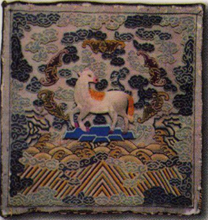

# 2016年黑龙江省公务员录用考试《行测》题（县乡卷）

> 常识判断 · 20 题 · 黑龙江 2016

## 第 1 题　qid 2391952 · 人文常识

下列清代官员的补服图案表示武官品级的是：

- **A**. 

- **B**. 

　✅
- **C**. 

- **D**. 

**答案**：B

**官方解析**

补服是一种饰有品级徽识的官服，或称“补袍”或“补褂”，是从明清时期开始出现的。官位品阶不同，需要用不同的“补子”，补子形状均为方形，补子以青、黑、深红等深色为底，五彩织绣，色彩非常艳丽。飞禽和走兽的图案分别是文官和武官补服上的纹样，主要用于区别官位高低。
清代对补子的规定是:一品，文鹤、武麒麟；二品，文锦鸡、武狮；三品，文孔雀、武豹；四品，文雁、武虎；五品，文白鹇、武熊；六品，文鹭鸶、武彪；七品，文鸂鶒、武犀牛；八品，文鹌鹑、武犀牛；九品，文练雀、武海马。
题干四个选项中，A、C、D项均为飞禽，仅有B项图案为走兽。
故正确答案为B。

---

## 第 2 题　qid 2391953 · 人文常识

关于中国的省份，下列说法错误的是：

- **A**. 湖南、湖北的“湖”指洞庭湖
- **B**. 山东、山西的“山”指太行山
- **C**. 河南、河北的“河”指黄河
- **D**. 广东、广西的“广”指广州　✅

**答案**：D

**官方解析**

本题考查地理国情。
A项正确，湖南、湖北的“湖”指洞庭湖。洞庭湖位于湖南和湖北交界的地方，因洞庭湖跨湘鄂两省，北连长江，南接湘、资、沅、鄧四水，自古就有“八百里洞庭”之说。湖南省位于长江中游南岸，春秋战国时属楚国，秦分二郡，汉属荆州。唐分归两道，因地居洞庭湖以南，始称湖南。因湘江纵贯省境，故简称湘，省会长沙。而湖北省位于长江中游北岸。因地处洞庭湖以北，称湖北；因西部有鄂西山地，故简称鄂，省会武汉。
B项正确，山东、山西的“山”指太行山。山西的“山”是指太行山，山西东为太行，西为吕梁。太行山是山西与河北的交界，太行山以东是河北而不是山东。山东的“山”在古时泛指太行山以东的地区，山东省名即来源于此。
C项正确，河南、河北的“河”指黄河。河南，因历史上大部分位于黄河以南，故名河南。河北，因位于黄河以北而得名。河南、河北成对出现，始于唐朝李世民时期。
D项错误，广东、广西的“广”指广信，也叫广南。广东以“广南东路”简称而得名，宋朝设置广南东路，简称广东路，清朝改为广东省，省名至今未变；广西以“广南西路”简称而得名，宋朝设置广南西路，简称广西路，清朝改为广西省，建国后改为广西壮族自治区，区名至今未变。
本题为选非题，故正确答案为D。

---

## 第 3 题　qid 2391954 · 人文常识

下列设计不符合建筑规范的是：

- **A**. 在设计电梯时配置辅助楼梯
- **B**. 卧室之间可以穿越　✅
- **C**. 厨房、卧室、起居室直接采光
- **D**. 影院平面设计成扇形

**答案**：B

**官方解析**

本题考查科技常识。
A项正确，按防火规范的要求，设计电梯时应配置辅助楼梯，供电梯发生故障时使用。布置时可将两者靠近，以便灵活使用，并有利于安全疏散。
B项错误，按住宅建筑规范的要求，卧室之间不应穿越，卧室应有直接采光、自然通风。
C项正确，按住宅建筑规范的要求，住宅应充分利用外部环境提供的日照条件，卧室、起居室(厅)、厨房应设置外窗进行直接采光。
D项正确，根据影院的规模大小、视距、音质条件等要求，可以进行如下平面设计：矩形平面、钟形平面、楔形平面、扇形平面、八角形平面、六角形平面、卵形平面和圆形平面。扇形平面的优点是容量大、平面利用率高。
本题为选非题，故正确答案为B。

---

## 第 4 题　qid 2391955 · 人文常识

下列哪一人物的发明成果与我国四大发明中的某一项最类似？

- **A**. 爱迪生
- **B**. 贝尔
- **C**. 诺贝尔　✅
- **D**. 瓦特

**答案**：C

**官方解析**

本题考查科技常识。四大发明是指中国古代对世界具有重大影响的四种发明，是中国古代劳动人民的重要创造，是指造纸术、指南针、火药及印刷术。
A项错误，爱迪生一生的发明共有两千多项，拥有专利一千多项，比较重要的有电灯、电车、电影、发电机、电动机、电话机、留声机，等等。
B项错误，贝尔的主要成就是发明了电话，并且还制造了助听器，改进了爱迪生发明的留声机。
C项正确，诺贝尔是瑞典化学家、工程师、发明家、军工装备制造商和炸药的发明者，被誉为“现代炸药之父”，是诺贝尔奖的设立者。诺贝尔发明的炸药和四大发明之一的火药类似。
D项错误，瓦特是英国著名科学家，蒸汽机的发明者。他开辟了人类利用能源的新时代，使人类进入“蒸汽时代”。后人为了纪念这位伟大的发明家，把功率的单位定为“瓦特”（简称“瓦”，符号W）。
故正确答案为C。

---

## 第 5 题　qid 2391962 · 科技常识

下列关于我国现代科技成果的说法不正确的是：

- **A**. 第一颗人造地球卫星是“东方红1号”
- **B**. 第一个南极科学考察站是中山站　✅
- **C**. 第一座实用型核电站是秦山核电站
- **D**. 第一辆汽车是产自长春的解放牌汽车

**答案**：B

**官方解析**

本题考查科技常识。
A项正确，1970年4月24日，我国自行设计、制造的第一颗人造地球卫星“东方红1号”，由“长征”一号运载火箭一次发射成功。这标志着我国成为继苏联、美国、法国和日本之后世界上第五个能独立自主研制并发射人造地球卫星的国家，这是我国航天事业发展的第一个里程碑。“从此，中国正式进入太空时代。”作为纪念，自2016年起，我国将每年4月24日设立为“中国航天日”。
B项错误，1985年2月20日，中国第一个南极科学考察实验基地中国南极长城站建成，标志着我国极地考察事业已发展到新阶段。同年3月20日，中国南极长城气象站被世界气象组织纳入全球气象台网站。中山站是中国在南极洲建立的科学考察站之一，建立于1989年2月26日，位于东南极大陆拉斯曼丘陵，是中国第二个南极考察站。
C项正确，秦山核电站是中国自行设计和建造的第一座实用型核电站，位于浙江省嘉兴市海盐县东南秦山，由上海核工程研究设计院等单位设计。
D项正确，中国第一座汽车制造厂——长春第一汽车制造厂，1953年7月15日动工兴建，1956年7月15日生产出中国第一辆解放牌汽车，从此结束了中国不能生产汽车的历史。
本题为选非题，故正确答案为B。

---

## 第 6 题　qid 2391964 · 人文常识

下列关于LED灯的说法不正确的是：

- **A**. 一般使用高压电源　✅
- **B**. 抗震性能好，寿命较长
- **C**. 耗能比白炽灯、节能灯都低
- **D**. 可通过调节电流的强弱来控制亮度

**答案**：A

**官方解析**

本题考查科技常识。

A项错误，一般来说LED的工作电压是2-3.6V，工作电流是0.02-0.03A，即LED一般使用低压电源即可。

B项正确，LED灯为固体冷光源，环氧树脂封装，抗震性能较好，灯体内没有松动的部分，不存在灯丝发光易烧、热沉积、光衰等缺点，使用寿命可达6万-10万小时。

C项正确，LED的工作电压低，采用直流驱动方式，超低功耗（单管0.03-0.06W），在相同照明效果下比传统光源节能以上，属于典型的绿色照明光源。

D项正确，LED的优势之一是可控性大，LED作为一种发光器件，可以通过调节电流的变化控制亮度，也可通过不同波长LED的配置实现色彩的变化与调节。

本题为选非题，故正确答案为A。

---

## 第 7 题　qid 2391966 · 人文常识

下列关于智齿的说法正确的是：

- **A**. 与智力的发育相关
- **B**. 通常在换牙期发育
- **C**. 一般会有六颗
- **D**. 容易引发牙冠的炎症　✅

**答案**：D

**官方解析**

本题考查科技常识。
A项错误，智齿是指人类口腔内牙槽骨上最里面的第三颗磨牙，从正中的门牙往里数刚好是第八颗牙齿。由于它萌出时间很晚，一般在16～25岁间萌出，此时人的生理、心理发育都接近成熟，有“智慧到来”的象征，因此被俗称为“智齿”。
B项错误，智齿萌出时间很晚，一般在16～25岁间萌出，智齿萌出的年龄差异较大，有的人20岁之前萌出，有人40、50岁才长或者终生不长，这都是正常现象。
C项错误，智齿生长方面，个体有很大差异，通常情况下应该有上下左右对称的4颗，有的少于4颗甚至没有，极少数人会多于4颗。
D项正确，长智齿的症状常常会由于智齿萌出不完全，牙冠的一部分被牙龈包绕，形成盲袋，食物残渣易进难出，导致冠周软组织红肿、盲袋积脓，患者会有疼痛、开口困难、发热、头疼、扁桃体肿大等症状。
故正确答案为D。

---

## 第 8 题　qid 2391967 · 科技常识

关于人体，下列表述错误的是：

- **A**. 人体含水量百分比最高的器官是胃　✅
- **B**. 人体内数目最多的细胞是红血球
- **C**. 人体结构中最坚硬的物质是牙釉质
- **D**. 人体消化吸收功能最强的部位是小肠

**答案**：A

**官方解析**

本题考查科技常识。

A项错误，水是人体内含量最多的成分，人体不同器官的水分含量差别很大，其中眼球含水量最大，高达，即人体含水量百分比最高的器官是眼球。

B项正确，红细胞也称红血球，是血液中数量最多的一种血细胞，同时也是脊椎动物体内通过血液运送氧气的最主要的媒介，同时还具有免疫功能。

C项正确，牙釉质，是牙冠外层的白色半透明的钙化程度最高的坚硬组织。牙釉质内部并不具有神经与血管，它的功用除了咬碎食物之外，也可以保护下层的牙本质，是人体中最坚硬的物质，保护着牙齿内部的牙本质和牙髓组织。

D项正确，小肠位于腹中，上端接幽门与胃相通，下端通过阑门与大肠相连，是食物消化吸收的主要场所。食物经过小肠内胰液、胆汁和小肠液的化学性消化及小肠运动的机械性消化后，基本上完成了消化过程，同时营养物质被小肠粘膜吸收。

本题为选非题，故正确答案为A。

---

## 第 9 题　qid 2391970 · 地理国情

在城市规划设计中，最为合理的一项是：

- **A**. 居民住宅区位于盛行风的上风向　✅
- **B**. 有污染的企业布局尽量分散
- **C**. 在市中心建火车站方便交通
- **D**. 存在水污染的企业靠近河流

**答案**：A

**官方解析**

本题考查地理国情。
A项正确，盛行风即常年主导风向，就是每年风频最大的方向。住宅区分布在盛行风的上方，而工业区分布在下风向，其目的是为了保护住宅区环境空气质量。
B项错误，有污染的企业布局应尽量集中分布，且远离城市中心区域，可以便于政府监管和污染处理。
C项错误，火车站一般位于城市外围，因为城市中心土地寸土寸金，一般用于发展商业。位于外围的火车站要有便捷的交通网络，以便于人们出行，与普通铁路网、高速公路网、机场相结合，形成功能合理的综合交通体系是十分必要的。
D项错误，存在水污染的企业不能临河而建，因为一旦发生污染泄露将可能严重危害水资源。对于水污染企业要配备污水处理设备和加强监督管理，确保水资源安全。
故正确答案为A。

---

## 第 10 题　qid 2391973 · 地理国情

《西游记》中唐僧师徒四人受阻于火焰山，在我国新疆也有火焰山，关于这座火焰山，下列说法错误的是：

- **A**. 古代丝绸之路穿过这里
- **B**. 位于吐鲁番盆地
- **C**. 地表岩石主要为页岩　✅
- **D**. 属大陆性干旱气候

**答案**：C

**官方解析**

本题考查地理国情。

A、B项正确，新疆火焰山，位于吐鲁番盆地的北缘，古丝绸之路北道，主要由中生代的侏罗纪、白垩纪和第三纪的赤红色砂、砾岩和泥岩组成。当地人称它为“克孜勒塔格”，意即“红山”。

C项错误，火焰山主要由赤红色砂、砾岩和泥岩组成，以红色的花岗岩反射阳光而闻名遐迩。

D项正确，火焰山是中国最热的地方，吐鲁番属典型的大陆性干旱荒漠气候。多年测得的绝对最高气温为（1975年7月13日），而地表温度能达到，是名符其实的“中国热极”。火焰山终年不雨或雨而未觉亦不足为奇，可以算得上是“中国干极”。

本题为选非题，故正确答案为C。

---

## 第 11 题　qid 2391974 · 人文常识

“一二三四五六七，万木生芽是今日。远天归雁拂云飞，近水游鱼迸冰出。”这一首诗描述的是哪一节气？

- **A**. 立春　✅
- **B**. 惊蛰
- **C**. 谷雨
- **D**. 清明

**答案**：A

**官方解析**

本题考查人文常识。题干出自罗隐的《京中正月七日立春》，意思是：“春天来了，树木发芽，大雁从南方飞回，河里的冰融化了，鱼儿欢快地游出水面。”整首诗表现了冬去春来，万物复苏，生机勃勃的景象，描述的是二十四节气中的立春。
故正确答案为A。

---

## 第 12 题　qid 2391975 · 人文常识

在一场旨在弘扬中国传统艺术的比赛中，下列哪一项不适合作为参赛项目？

- **A**. 表演皮影戏
- **B**. 演奏长笛　✅
- **C**. 现场书写对联
- **D**. 太极剑表演

**答案**：B

**官方解析**

本题考查人文常识。
A项正确，皮影戏又称“影子戏”或“灯影戏”，是中国民间古老的传统艺术。据史书记载，皮影戏始于春秋，兴于汉朝，盛于宋代，极盛于明清，可谓历史悠久，源远流长。
B项错误，长笛起源于欧洲，初名横笛，是现代管弦乐和室内乐中主要的高音旋律乐器，属木管乐。长笛不是我国的传统乐器，不适宜作为参赛项目。
C项正确，对联，中国的传统文化之一，又称楹联或对子，是写在纸、布上或刻在竹子、木头、柱子上的对偶语句。对联对仗工整，平仄协调，是一字一音的中华语言独特的艺术形式。
D项正确，太极剑是属于太极拳门派中的剑术，具有太极拳和剑术两者的风格特点。太极剑作为太极拳系列的组成部分，在古代剑术的基础上，改造发展而成。
本题为选非题，故正确答案为B。

---

## 第 13 题　qid 2391977 · 人文常识

关于中国古代的敬语和谦称，下列归类错误的是：

- **A**. 称呼自己——老朽、鄙人
- **B**. 称呼对方——足下、公子
- **C**. 称呼自己的家人——拙荆、舍妹
- **D**. 称呼对方的家人——家父、令郎　✅

**答案**：D

**官方解析**

本题考查人文常识。
A项正确，“老朽”是谦称自己为衰老无用之人；“鄙人”则是谦称自己的见识、修养不如其他人。
B项正确，“足下”是对对方的尊称，译为“您”，是旧时交际用语中，下称上或同辈之间相称的敬词；“公子”用来尊称别人的儿子。
C项正确，“拙荆”是丈夫对妻子的一种谦称，“舍妹”用于对别人称自己家的妹妹，属于谦词。
D项错误，“家父”是对人谦称自己父亲的称呼，“令郎”是称对方儿子的敬词。
本题为选非题，故正确答案为D。

---

## 第 14 题　qid 2391979 · 人文常识

下列作者和作品对应中，不正确的是：

- **A**. 诸葛亮——《出师表》
- **B**. 李白——《饮中八仙歌》　✅
- **C**. 屈原——《天问》
- **D**. 曹植——《洛神赋》

**答案**：B

**官方解析**

本题考查人文常识。
A项正确，《出师表》是三国时期诸葛亮的作品，这篇文章以议论为主，兼用记叙和抒情。以恳切委婉的言辞劝勉后主要广开言路、严明赏罚、亲贤远佞，以此兴复汉室，还于旧都；同时也表达自己以身许国，忠贞不二的思想。
B项错误，《饮中八仙歌》是唐代诗人杜甫的作品。此诗将当时号称“酒中八仙人”的李白、贺知章、李适之、李琎、崔宗之、苏晋、张旭、焦遂八人从“饮酒”的角度联系在一起，用追叙的方式，洗炼的语言，人物速写的笔法，构成一幅栩栩如生的群像图。
C项正确，《天问》是战国时期诗人屈原创作的一首长诗。此诗从天地离分、阴阳变化、日月星辰等自然现象，一直问到神话传说乃至圣贤凶顽和治乱兴衰等历史故事，表现了作者对某些传统观念的大胆怀疑，以及追求真理的探索精神，具有浓厚的道家色彩。
D项正确，《洛神赋》是三国时期曹魏文学家曹植创作的辞赋名篇。此赋虚构了作者自己与洛神的邂逅相遇和彼此间的思慕爱恋，洛神形象美丽绝伦，人神之恋飘渺迷离，但由于人神道殊而不能结合，最后抒发了无限的悲伤怅惘之情。
本题为选非题，故正确答案为B。

---

## 第 15 题　qid 2391981 · 地理国情

关于我国各大名山，下列说法错误的是：

- **A**. 泰山是世界文化与自然双重遗产
- **B**. 峨眉山有“秀甲天下”之美誉
- **C**. 武当山属亚热带季风气候区
- **D**. 九华山是中国道教四大名山之一　✅

**答案**：D

**官方解析**

本题考查人文常识。
A项正确，世界文化与自然双重遗产，又称复合遗产，是同时具备自然遗产与文化遗产两种条件者。泰山是中国、也是世界上第一个自然与文化双重遗产。
B项正确，四川峨眉山是中国佛教四大名山之一（另三个为：山西五台山、浙江普陀山和安徽九华山）。峨眉山地势陡峭，风景秀丽，有“秀甲天下”之美誉。
C项正确，武当山，中国道教圣地，武当武术的发源地，被称为“亘古无双胜境，天下第一仙山”。属亚热带季风气候，垂直气候明显，气温随海拔高度递减。
D项错误，中国道教四大名山为：安徽齐云山、湖北武当山、四川青城山、江西龙虎山。安徽九华山是我国佛教四大名山之一。
本题为选非题，故正确答案为D。

---

## 第 16 题　qid 2391982 · 人文常识

下列历史事件及其标志性意义对应不正确的是：

- **A**. 第一次鸦片战争：中国近代史的开端
- **B**. 《共产党宣言》的发表：马克思主义的诞生
- **C**. 《狂人日记》的发表：新文化运动的兴起　✅
- **D**. 蒸汽机的发明：第一次工业革命

**答案**：C

**官方解析**

本题考查人文常识。
A项正确，第一次鸦片战争是1840年至1842年英国对中国发动的一场战争，也是中国近代史的开端。
B项正确，《共产党宣言》是马克思和恩格斯为共产主义者同盟起草的纲领，全文贯穿马克思主义的历史观，是马克思主义诞生的重要标志。
C项错误，1915年9月，陈独秀在上海创办《新青年》是新文化运动兴起的标志。内容：提倡民主，反对专制；提倡科学，反对迷信；提倡新道德，反对旧道德；提倡新文学，反对旧文学。《狂人日记》是鲁迅创作的第一个短篇白话日记体小说，也是中国第一部现代白话文小说。
D项正确，第一次工业革命是指18世纪60年代从英国发起的技术革命，是技术发展史上的一次巨大革命，它开创了以机器代替手工劳动的时代。第一次工业革命是以工作机的诞生开始的，以蒸汽机作为动力机被广泛使用为标志的。
本题为选非题，故正确答案为C。

---

## 第 17 题　qid 2391985 · 人文常识

“庖丁解牛”之所以能够做到事半功倍，是因为他：

- **A**. 顺应客观规律　✅
- **B**. 注重主动思考
- **C**. 能够坚持不懈
- **D**. 能够触类旁通

**答案**：A

**官方解析**

本题考查人文常识。
“庖丁解牛”，出自《庄子•内篇•养生主》，比喻经过反复实践，掌握了事物的客观规律，做事得心应手，运用自如。
故正确答案为A。

---

## 第 18 题　qid 2391986 · 人文常识

下列关于商品经济的说法，正确的是：

- **A**. 农业和畜牧业分离是商品经济产生的原因
- **B**. 商人的产生是形成商品经济的根本条件
- **C**. 商品经济是为交换而生产的经济形态　✅
- **D**. 商品经济社会中所有的东西都是商品

**答案**：C

**官方解析**

本题考查经济常识。
A项错误，商品经济产生和存在的一般条件有两个：一是社会分工；二是生产资料和产品属于不同的物质利益主体所有。
B项错误，生产资料和产品属于不同的所有者是形成商品经济的根本条件。
C项正确，商品经济是指直接以交换为目的经济形式，包括商品生产和商品交换。
D项错误，商品是用于交换的劳动产品。商品需要同时满足两个条件：一是劳动产品，二是用于交换。劳动产品若不用于交换就不是商品。
故正确答案为C。

---

## 第 19 题　qid 2391987 · 法律常识

2015年3月十二届全国人大三次会议对《中华人民共和国立法法》作了修改，它在我国社会主义法律体系中属于：

- **A**. 基本法律
- **B**. 基本法律以外的其他法律
- **C**. 宪法及其相关法　✅
- **D**. 基本法

**答案**：C

**官方解析**

本题考查法律常识。
我国的法律体系大体由在宪法统领下的宪法及宪法相关法、民法商法、行政法、经济法、社会法、刑法、诉讼与非诉讼程序法等七个部分构成，包括法律、行政法规、地方性法规三个层次。
A、B、D项错误，该三项的分类标准不属于我国社会主义法律体系的范畴。
C项正确，宪法是国家的根本大法。宪法相关法是与宪法配套、直接保障宪法实施的宪法性法律规范的总和，包括《全国人民代表大会组织法》、《民族区域自治法》、《香港特别行政区基本法》、《澳门特别行政区基本法》、《立法法》、《全国人民代表大会和地方各级人民代表大会选举法》、《全国人民代表大会和地方各级人民代表大会代表法》、《国旗法》、《国徽法》等。
故正确答案为C。

---

## 第 20 题　qid 2391988 · 法律常识

关于我国的宪法，下列说法错误的是：

- **A**. 我国公民甲说：“我国宪法规定国家公职人员实行宪法宣誓制度。”
- **B**. 外国人乙说：“中华人民共和国可以给予我要求政治避难而受到庇护的权利。”
- **C**. 我国公民丙说：“公民不仅可以通过人民代表大会行使国家权力，同时也可以依法参加国家事务的管理。”　✅
- **D**. 外国人丁说：“中华人民共和国的宪法监督机关是全国人大及其常委会。”

**答案**：C

**官方解析**

本题考查法律常识。
A项正确，《宪法》第二十七条第三款规定，“国家工作人员就职时应当依照法律规定公开进行宪法宣誓。”
B项正确，《宪法》第三十二条第二款规定，“中华人民共和国对于因为政治原因要求避难的外国人，可以给予受庇护的权利。”
C项错误，《宪法》第二条第二、三款规定：“人民行使国家权力的机关是全国人民代表大会和地方各级人民代表大会。人民依照法律规定，通过各种途径和形式，管理国家事务，管理经济和文化事业，管理社会事务。”选项中的“公民”应改为“人民”。“人民”和“公民”的区别：1.概念不同：在我国，人民是国家的主人，在我国现阶段，包括工人、农民、知识分子和其他的全体社会主义劳动者、社会主义事业的建设者、拥护社会主义的爱国者、拥护祖国统一和致力于中华民族伟大复兴的爱国者；公民是指具有某国国籍并根据该国宪法和法律规定，享有权利和义务的人。2.性质不同：人民是政治概念，公民是法律概念。3.范围不同：公民比人民范围大，公民既包括人民，也包括敌人。
D项正确，《宪法》第六十二条规定：“全国人民代表大会行使下列职权：······（二）监督宪法的实施；······”；第六十七条规定：“全国人民代表大会常务委员会行使下列职权：（一）解释宪法，监督宪法的实施；······”
本题为选非题，故正确答案为C。

---
