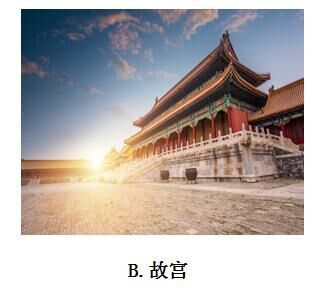
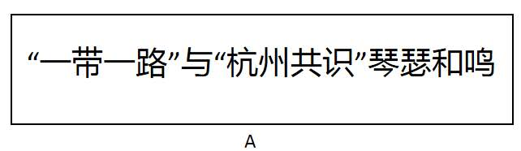
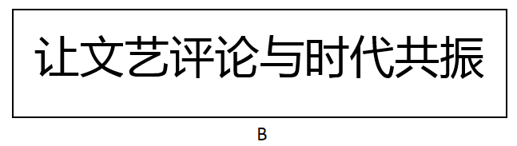

# 2017年422联考《行测》题（吉林卷甲级）

> 常识判断 · 18 题 · 吉林 2017

## 第 1 题　qid 2050522 · 人文常识

党的十八大以来，一些标志性话语深刻反映了中央治国理政新理念。其中，下列标志性话语与治国理政新理念对应错误的是：

- **A**. “刮骨疗毒，壮士断腕”——加强党风廉政建设
- **B**. “踏石留印，抓铁有痕”——推动国防军队改革　✅
- **C**. “凝聚共识，合作共赢”——发展大国外交
- **D**. “一个都不能少”——全面建成小康社会

**答案**：B

**官方解析**

B项错误：习近平在十八届中央纪委二次全会上的讲话中指出：“要以踏石留印、抓铁有痕的劲头抓下去，善始善终、善做善成，防止虎头蛇尾，让全党全体人民来监督，让人民群众不断看到实实在在的成效和变化。”意在强调要持续深入抓作风建设、表达反腐倡廉的坚定决心，而非推动国防军队改革。
A项正确：习近平在中国共产党第十八届中央纪委第三次全体会议上发表重要讲话，他强调，全党同志要深刻认识反腐败斗争的长期性、复杂性、艰巨性，以猛药去疴、重典治乱的决心，以刮骨疗毒、壮士断腕的勇气，坚决把党风廉政建设和反腐败斗争进行到底。
C项正确：在亚信会议、巴黎气候大会等区域性和国际性的会议上，习主席强调各国要凝聚共识，促进对话，加强协作，在追求本国利益时兼顾各国合理关切，发展合作共赢的新型伙伴关系，体现了我国外交政策的导向。
D项正确：2016年春节前夕，习近平到江西看望慰问广大干部群众，他对乡亲们说，我们党是全心全意为人民服务的党，将继续大力支持老区发展，让乡亲们日子越过越好。在扶贫的路上，不能落下一个贫困家庭，丢下一个贫困群众。从中我们看到了在全面实现小康道路上，一个都不能少。
本题为选非题，故正确答案为B。

---

## 第 2 题　qid 2051970 · 人文常识

“有时候文明只是十公分的宽度，有时候只是一张纸的厚度，当我们把十公分的盲道让出来，当我们在椅子上垫一张纸，每个人的一小步构成了中国文明进步的一大步。”这段话蕴含的道理是：

- **A**. 质变是量变的结果，要重视量的积累　✅
- **B**. 只要抓住时机，就能实现事物的质变
- **C**. 要注重系统内部结构的优化趋向
- **D**. 要立足整体，发挥整体统率作用

**答案**：A

**官方解析**

A项正确：每个人的一小步累积起来就是量变，量变达到一定量的积累就会引起质变，一小步的积累达到量变引起文明一大步的质变，质变是量变的结果。
故正确答案为A。

---

## 第 3 题　qid 2051972 · 人文常识

积极者说，人生犹如一首歌，有低音也有高调，抑扬顿挫是人生美妙的旋律；消极者说，人生犹如一场戏，有高潮也有低潮，喜怒哀乐是人生无奈的节奏。这段话反映的哲理是：

- **A**. 人们对事物的反映具有主体性特点　✅
- **B**. 受知识水平制约,认识具有反复性
- **C**. 正确的认识产生于激烈的争论之中
- **D**. 人们不可能形成对事物的一致看法

**答案**：A

**官方解析**

A项正确：对于人生有起有落这件事，积极者和消极者有不同的认识，这说明人们对事物的认识是从主观感受出发的，具有主体性特点。
B项错误：认识过程的反复性是指人们对于一个复杂事物的认识往往要经过由感性认识到理性认识、再由理性认识到实践的多次反复才能完成。而题干中说的是人们对同一件事情的不同认识，不涉及认识的反复性。
C项错误：题干中讲的是人们对同一件事物的不同认识，这是人从自身出发的主观认识，不涉及认识的正确性。
D项错误：由于观察的角度不同，人们对同一事物会有不同的正确反映，每个人对事物认知的标准和看法都不一样，但是在有些事物上，人们通过相互交流和互相学习，可能达成一致看法，例如科学界的某些公理。
故正确答案为A。

---

## 第 4 题　qid 2050582 · 人文常识

在中国传统文化中，鸡具有君子风范。《韩诗外传》说鸡有五德：

- **A**. 文德、武德、勇德、仁德、信德　✅
- **B**. 智德、勇德、武德、礼德、义德
- **C**. 智德、武德、勇德、礼德、信德
- **D**. 文德、勇德、武德、仁德、义德

**答案**：A

**官方解析**

A项正确：《韩诗外传》是一部记述中国古代史实、传闻的著作，作者是西汉人韩婴。《韩诗外传》有云：“君独不见夫鸡乎，头戴冠者文也，足傅距者武也，敌在前敢斗者勇也，见食相呼者仁也，守夜不失时者信也。”意思是：您难道没看见那鸡吗？头上戴着冠，这是有文采；脚后面有距，这是有武勇；敌人在前面，它敢前去打斗，这是勇敢；看见食物招呼别的伙伴，这是有仁德；守夜不会忘记报时，这是守信用。即鸡有五德：文德、武德、勇德、仁德、信德。
故正确答案为A。

---

## 第 5 题　qid 2050560 · 人文常识

在我国文化用语中经常出现“别称”或“代称”。下列关于“别称”和“代称”的表述错误的是：

- **A**. 李清照词“人比黄花瘦”中的黄花是菊花
- **B**. 古人用“弄璋之喜”来祝贺他人升官　✅
- **C**. 人们称妇女为“巾帼”是由于妇女戴的头巾叫巾帼
- **D**. “及笄之年”指古代女子年满十五岁，到了可结婚的年纪

**答案**：B

**官方解析**

B项错误：“弄璋之喜”是指祝贺人家生男孩。古人把璋给男孩玩，希望他将来有玉一样的品德，“弄璋”即中国民间对生男的古称。始见周代诗歌中。祝贺人家生女孩是“弄瓦之喜”，瓦是纺车上的零件，希望她将来能胜任女工的意思。
本题为选非题，故正确答案为B。

---

## 第 6 题　qid 2051982 · 人文常识

九是中国古代最高统治者的专属数字。西周时期，只有天子可用九鼎，后世只有皇帝的龙袍可绣九条金龙。与此直接相关的制度是：

- **A**. 分封制
- **B**. 宗法制
- **C**. 礼乐制　✅
- **D**. 九品中正制

**答案**：C

**官方解析**

C项正确：礼乐制是维护封建制度的文化制度。周朝通过礼乐制度来规范贵族的身份地位，要求贵族在衣、食、住、行等方面都要符合自己的身份，贵贱长幼之间要有明显的差别。就连如何称呼“死”，不同等级的贵族也不一样。“九”作为中国古代最高统治者的专属数字，体现的是统治者的身份地位，因此与此直接相关的制度是礼乐制。
A项错误：分封制也称分封制度或封建制，即狭义的“封建”，由共主或中央王朝给宗族姻亲、功臣子弟、前朝遗民分封领地和相当的治权，属于政治制度范畴。与题干信息无直接关联。
B项错误：宗法制度是由氏族社会父系家长制演变而来的，是王族贵族按血缘关系分配国家权力，以便建立世袭统治的一种制度。其特点是宗族组织和国家组织合二为一，宗法等级和政治等级完全一致。与题干信息无直接关联。
D项错误：九品中正制，是魏晋南北朝时期重要的选官制度，是魏文帝曹丕采纳尚书令陈群的意见，命其制定的制度。虽然名字里面含有“九”字，但是与题干中“九”字体现统治者地位这个信息无直接关联。
故正确答案为C。

---

## 第 7 题　qid 2050572 · 人文常识

下列四组诗句分别反映了中国古代四种传统节日习俗，其起源与佛教没有直接关联的是：

- **A**. 谁家见月能闲坐，何处闻灯不看来
- **B**. 今朝佛粥交相馈，更觉江村节物新
- **C**. 风雨梨花寒食过，几家坟上子孙来　✅
- **D**. 道场普渡妥幽魂，原有盂兰古意存

**答案**：C

**官方解析**

C项错误：此句诗出自元代高启的《送陈秀才还沙上省墓》，意思是在风雨中，梨花落尽了，寒食节也过去了，清明扫墓的时候，有几户人家的坟墓还会有后人来祭拜呢。讲的是清明节，清明节据传始于古代帝王将相“墓祭”之礼，后来民间亦相仿效，于此日祭祖扫墓，历代沿袭而成为中华民族一种固定的风俗，与佛教没有直接关系，错误。
A项正确：此句诗出自唐代崔液的《上元夜》，意思是有谁家能见到元宵的月亮而能够无动于衷不去观赏呢，有哪里看到处处都在闹花灯而忍得住不去看呢。讲的是元宵节，元宵赏灯始于东汉明帝时期，明帝提倡佛教，听说佛教有正月十五日僧人观佛舍利，点灯敬佛的做法，就命令这一天夜晚在皇宫和寺庙里点灯敬佛，令士族庶民都挂灯。以后这种佛教礼仪节日逐渐形成民间盛大的节日。该节经历了由宫廷到民间，由中原到全国的发展过程。
B项正确：此句诗出自宋朝陆游的《十二月八日步至西村》，意思是腊日里人们互赠、食用着佛粥（即腊八粥），更感觉到清新的气息，讲的是腊八节，腊八节，俗称“腊八”，即农历十二月初八，古人有祭祀祖先和神灵、祈求丰收吉祥的传统，一些地区有喝腊八粥的习俗。相传这一天还是佛祖释迦牟尼成道之日，称为“法宝节”，是佛教盛大的节日之一。
D项正确：此句诗出自清代文人王凯泰的《中元节有感》，讲的是中元节。中元节，俗称鬼节、施孤、七月半，佛教称为盂兰盆节。
本题为选非题，故正确答案为C。

---

## 第 8 题　qid 2051984 · 经济常识

在经济生活中一种经济现象的出现往往引起另一种现象的产生。下列表述能体现这一关系的是：

- **A**. 美元兑人民币汇率下跌，赴美旅游费用一定会上涨
- **B**. 水务公司供水价格提高，会使居民生活用水量大幅减少
- **C**. 上海至广州的高铁开通，上海飞广州航班的客流量可能下降　✅
- **D**. 重大节日免收小型客车通行费，导致居民消费以享受型为主

**答案**：C

**官方解析**

C项正确：高铁与飞机互为替代品，高铁开通，坐飞机的人可能会减少。
A项错误：美元兑人民币汇率下跌，相同的人民币纸币可换到的美元纸币变多了，赴美旅游费用下降。
B项错误：水是生活必需品，且没有替代品，所以水的需求价格弹性很小。即使供水价格大幅提高，居民的用水量也不会产生较大波动。
D项错误：因果之间没有必然联系。
故正确答案为C。

---

## 第 9 题　qid 2050568 · 人文常识

2016年农民李某把自家的10亩土地入股流转给某民营农业科技有限公司，成为该公司的股东和员工。年底，她除每亩地获得保底租金1000元外，又领了的分红，加上每月工资1200元，一年下来能挣四万多。李某的收入：

①属于按生产要素分配

②受公司经营状况的影响

③属于按劳分配

④受股票价格波动的影响

- **A**. ①②　✅
- **B**. ③④
- **C**. ①④
- **D**. ②③

**答案**：A

**官方解析**

①正确：按生产要素分配，是指按照进行物质资料生产时所投入的生产要素的多少进行收益分配的一种方式。生产要素主要包括劳动力、技术、人才、资本、管理、土地、房屋等。题干中，租金1000元属于按土地要素分配，的分红属于按资本要素分配，月工资1200元属于按劳动力要素分配，以上均属于按生产要素分配。

②正确：入股之后的分红会受到公司经营状况的影响，收入高利润好，就能分的多一些。

③错误：按劳分配是在公有制经济中的分配方式，与题意不符。

④错误：本题中没有体现股票，且股票决定劳动收入等明显不符合常理。

故正确答案为A。

---

## 第 10 题　qid 2050574 · 地理国情

某校在长白山举行地理夏令营活动。在野外，老师要求同学们除了文字记录外，还要将看到的典型地貌和地质结构描绘出来，同学们应采用的绘画技法是：

- **A**. 速写　✅
- **B**. 工笔
- **C**. 写意
- **D**. 留白

**答案**：A

**官方解析**

A项正确，速写是在较短时间内迅速将对象描绘下来的一种绘画形式。它具有收集绘画素材、训练造型能力两大方面的功能。典型地貌和地质结构描绘应采用速写。
B项错误，工笔亦称“细笔”，与“写意”对称，中国画技法名，属于工整细致一类密体的画法，用细致的笔法制作，着重线条美，一丝不苟是工笔画的特色。
C项错误，写意，国画的一种画法。用笔不讲究工细，注重神态的表现和抒发作者的情趣，是一种形简而意丰的表现手法。
D项错误，留白是中国艺术作品创作中常用的一种手法，极具中国美学特征。留白一词指书画艺术创作中为使整个作品画面、章法更为协调精美而有意留下相应的空白，留有想象的空间。
故正确答案为A。

---

## 第 11 题　qid 2050586 · 人文常识

下列古代汲水灌溉工具与应用原理对应错误的是：

- **A**. 桔槔——杠杆原理
- **B**. 辘轳——轮轴原理
- **C**. 翻车——对称守恒原理　✅
- **D**. 筒车——叶轮原理

**答案**：C

**官方解析**

A项正确：桔槔始见于《墨子·备城门》，作“颉皋”。是一种利用杠杆原理的取水机械。
B项正确：辘轳，汉族民间提水设施，流行于北方地区。由辘轳头、支架、井绳、水斗等部分构成。利用轮轴原理制成的井上汲水的起重装置。
C项错误：中国古代链传动的最早应用就是在翻车上，是农业灌溉机械的一项重大改进。翻车并没有应用对称守恒原理，此原理经常用在协同反应中描述分子轨道。
D项正确：筒车是和翻车相类似的提水机具。这是利用湍急的水流转动车轮，使装在车轮上的水筒，自动戽水，提上岸来进行灌溉。
本题为选非题，故正确答案为C。

---

## 第 12 题　qid 2052008 · 人文常识

下列著名建筑中，其建筑风格属于哥特式的是：

- **A**. 

　✅
- **B**. 

- **C**. 

- **D**. 

**答案**：A

**官方解析**

A项正确：哥特式建筑盛行于12至15世纪，它的造型风格以高、直、尖和强烈的向上感为特征，巴黎圣母院是法国典型的哥特式建筑。
B项错误：中国故宫属于中国古代建筑，不属于哥特式风格。
C项错误：麦加清真寺属于伊斯兰教建筑，不属于哥特式风格。
D项错误：罗马圆形大剧场属于罗马式建筑，不属于哥特式风格。
故正确答案为A。

---

## 第 13 题　qid 2050596 · 科技常识

中国首位80后女航天员王亚平，随神舟十号飞船进入太空飞行15天。飞行中她不会碰到的情况是：

- **A**. 看到绚丽多彩的极光
- **B**. 四周一片漆黑
- **C**. 穿过稠密的大气层
- **D**. 听到远处星体爆炸的声音　✅

**答案**：D

**官方解析**

A项正确：在太空飞行时，可以看到地球两极出现的极光。

B项正确：宇宙空间接近真空状态，四周的背景都是漆黑的。
C项正确：在从太空飞行返回时，需要穿过稠密的大气层才能回到地球。
D项错误：声音的传播是需要介质的，比如固体，液体，气体。太空接近真空状态，不能传声，所以航天员不可能听到爆炸声。
本题为选非题，故正确答案为D。

---

## 第 14 题　qid 2052010 · 人文常识

下列解说词出自电视专题片，其中符合自然常识的是：

- **A**. “每年除夕夜，这里的爆竹声都震耳欲聋，烟雾弥漫不见明月。”
- **B**. “他把神鼓当作月亮，而那七只鹿崽就是环绕着他的北斗七星。”
- **C**. “天快亮了，月亮还挂在天空，他突然想起来今天是农历初八。”
- **D**. “黎明时分，一弯月牙与金星同现东方低空，这便是金星合月。”　✅

**答案**：D

**官方解析**

D项正确：金星合月，也就是金星和月亮正好运行到同一经度上，两者之间的距离达到最近，它是行星合月天象中的一种。2015年9月10日晨出现过金星合月现象，2017年7月24日晨也出现过这一现象。
A项错误：除夕时月相应该为新月，晚上无法观测，并非因为烟雾弥漫而看不到。
B项错误：北斗七星并不环绕着月亮。
C项错误：农历初八时月相为上弦月，出现在上半夜，到半夜时分月亮就落下了，天快亮的时候是观测不到的。
故正确答案为D。

---

## 第 15 题　qid 2050602 · 人文常识

关于人体消化和吸收的叙述，错误的是：

- **A**. 胃吸收酒精的能力较强
- **B**. 胆汁不具有促进脂肪消化的功能　✅
- **C**. 大肠的作用是排泄未吸收的食物
- **D**. 肝被誉为“物质代谢中枢”

**答案**：B

**官方解析**

A项正确：酒的化学成分是乙醇，在消化道内不需要消化即可吸收，吸收快而且完全。一般在胃中吸收。胃内有无食物、胃壁的功能状况、饮料含酒精的多少以及饮酒习惯均可影响酒精的吸收。

B项错误：肝脏分泌的胆汁中不含消化酶，但胆汁对脂肪有乳化作用，能把脂肪变成微小颗粒，增加了脂肪与消化酶的接触面积，从而有利于脂肪的消化。

C项正确：大肠是对食物残渣中的水分进行吸收，并且可以将食物残渣自身形成粪便排出的脏器。

D项正确：被誉为“物质代谢中枢”的是肝脏，肝脏是身体内以代谢功能为主的一个器官，并在身体里面扮演着去氧化，储存肝糖，分泌性蛋白质的合成等等。肝脏也制造消化系统中的胆汁。

本题为选非题，故正确答案为B。

---

## 第 16 题　qid 2050520 · 科技常识

生物学家认为，人体有两个大脑系统存在，一个是头颅中的大脑系统，另一个是胸腹内的“第二大脑”系统。下列诗词描写的活动与“第二大脑”系统有关的是：

- **A**. 自从弃置便衰朽，世事蹉跎成白首
- **B**. 一向年光有限身，等闲离别易消魂
- **C**. 无可奈何花落去，似曾相识燕归来
- **D**. 料得年年肠断处，明月夜，短松冈　✅

**答案**：D

**官方解析**

“第二大脑”实际上也就是肠道内的神经系统，由分散在食管、胃、小肠、结肠组织上的神经元、神经传感器和蛋白质组成。与头颅中的大脑工作原理一样，它们相互之间也快速传递着信息，独立地感知、接受信号，并作出相关的反应，使人产生“愉悦”或“不适”的感觉，但它不能像真正意义上的大脑那样具有思维功能。
D项正确，“料得年年肠断处，明月夜，短松冈”出自宋代诗人苏轼的词作品《江城子·乙卯正月二十日夜记梦》第三四句，全词表达了作者怀念亡妻的悼念之情。作者用“肠断处”表达出自己的悲痛之情，与“第二大脑”系统的定义相符合。
A项错误，“自从弃置便衰朽，世事蹉跎成白首”出自唐朝诗人王维的古诗作品《老将行》，释义为：“自被摈弃不用便开始衰朽，世事随时光流逝而人成白首。”没有与“第二大脑”系统相关联的内容。
B项错误，“一向年光有限身，等闲离别易销魂”出自晏殊的《浣溪沙》，该句话的意思是片刻的时光，有限的生命，宛若江水东流，一去不返，让人深感悲伤。此句诗词与“第二大脑”系统没有关联。
C项错误，“无可奈何花落去，似曾相识燕归来”出自于宋代晏殊的《浣溪沙》，大意为那花儿落去我也无可奈何，那归来的燕子似曾相识，没有提到与“第二大脑”系统相关联的内容，故排除。
故正确答案为D。

---

## 第 17 题　qid 2052018 · 人文常识

下列四个选项，能正确表示食物链的是：

- **A**. 
大鱼小鱼虾

- **B**. 
草羊狼
　✅
- **C**. 
阳光草兔

- **D**. 
昆虫青蛙蛇

**答案**：B

**官方解析**

在生态系统内，各种生物之间由于食物而形成的一种联系，叫做食物链。食物链的开始通常是绿色植物（生产者），从绿色植物开始至少要有三个营养级。
B项正确：羊以草为食，狼以羊为食，且从绿色植物（草）开始。
A项错误：食物链方向错误。
C项错误：食物链最开始的是绿色植物（生产者）而非阳光。
D项错误：昆虫已经是食草动物，没从绿色植物（生产者）开始。
故正确答案为B。

---

## 第 18 题　qid 2050540 · 人文常识

下列新闻标题用语存在明显错误的是：

- **A**. 

- **B**. 

- **C**. 

　✅
- **D**. 

**答案**：C

**官方解析**

C项错误，古人把代人作文称为“捉刀”，“亲著”是亲自著述，可见如果是“捉刀”就不是“亲著”，两者互相矛盾。《城市论》显然是市委书记“亲著”，而非“捉刀”之作。故此处新闻标题用语存在明显错误。
A项正确，“琴瑟和鸣”一般用来比喻夫妇情笃和好，此处作者用来形容“一带一路”与“杭州共识”的良好关系，不存在明显错误。
B项正确，“共振”是物理学上的一个专业术语，是指一物理系统在特定频率下，比其他频率以更大的振幅做振动，这些特定频率称之为共振频率。此处用来形容文艺评论与时代发展的关系，没有明显错误。
D项正确，“别出机杼”指诗文创作另辟途径，不落俗套，“耳目一新”指听到的、看到的跟以前完全不同，使人感到新鲜。此标题没有明显错误。
本题为选非题，故正确答案为C。

---
