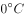

# 2017年422联考《行测》题（安徽卷）

> 常识判断 · 20 题 · 安徽 2017

## 第 1 题　qid 2049548 · 人文常识

下列说法错误的是：

- **A**. 2016年里约热内卢举办了第31届夏季奥林匹克运动会
- **B**. 河北张家口具有2022年第24届冬季奥运会的主办资格
- **C**. 动漫人物铁臂阿童木出任东京申奥特殊大使开创了先河　✅
- **D**. 北京是目前唯一获得夏季奥运会和冬季奥运会举办权的城市

**答案**：C

**官方解析**

A项正确，第31届夏季奥林匹克运动会，又称2016年里约热内卢奥运会，2016年8月5日至21日在巴西里约热内卢举行。
B项正确，第24届冬季奥林匹克运动会，将在2022年2月4日至2022年2月20日由中国北京市和张家口市联合举行。这是中国历史上第一次举办冬季奥运会，北京、张家口同为主办城市。
C项错误，日本著名动漫形象哆啦A梦将出任2020年东京申奥特殊大使。过去的申奥特殊大使多由奥运会的奖牌得主出任，动漫人物出任申奥特殊大使尚属首次。
D项正确，北京是目前唯一获得夏季奥运会和冬季奥运会举办权的城市。
本题为选非题，故正确答案为C。

---

## 第 2 题　qid 2049816 · 经济常识

下列关于“海上丝绸之路”的说法错误的是：

- **A**. 是陆上丝绸之路的一种补充形式　✅
- **B**. 是意大利人马可·波罗回国所走之路
- **C**. 始于秦汉，繁荣于唐宋，衰落于明清
- **D**. 是古代中外贸易和对外交往的海上通道

**答案**：A

**官方解析**

C项正确：“海上丝绸之路”的雏形在秦汉时期便已存在，目前已知有关中外海路交流的最早史载来自《汉书·地理志》，海上丝绸之路繁荣于唐宋时期，唐玄宗时设立市舶使专管海上对外贸易；宋时指南针用于海船，中国商船的远航能力大为加强；明清时期由于海禁政策，“海上丝绸之路”衰落。
D项正确：海上丝绸之路是古代中国与世界其他地区进行经济文化交流交往的海上通道。海上丝绸之路从中国东南沿海，经过中南半岛和南海诸国，穿过印度洋，进入红海，抵达东非和欧洲，成为中国与外国贸易往来和文化交流的海上大通道，并推动了沿线各国的共同发展。
A项表述不严谨，海上丝绸之路最开始确实是陆上丝绸之路补充，大量丝织品通过陆路西运，后来陆上通道阻塞、战乱、经济中心南移等原因，慢慢地演变为与陆上丝绸之路同等重要的贸易往来通道。
B项关于马可波罗是否来过中国，各国历史学家争议较大且各有充足的依据，从本题选项设置来看，该题认为是来过中国，按照大多数人的观点，马可波罗是沿着海上丝绸之路返回的。相比之下选A更合适。
本题为选非题，故正确答案为A。

---

## 第 3 题　qid 2049808 · 经济常识

随着我国社会逐步进入老龄化，现有的养老模式一般包括家庭养老、机构养老、社区养老和以房养老等。下列关于我国农村老人养老模式的表述错误的是：

- **A**. 张大爷根据四个儿子之间的协议，每月轮流到其中一个儿子家中生活
- **B**. 王大娘的两个儿子均没空照顾生活不能自理的老人，于是将其送到附近一家养老机构
- **C**. 李大爷选择将房子抵押给金融机构，由金融机构每月支付其养老费用　✅
- **D**. 赵大娘不愿离开熟悉的社区和朋友，于是选择在社区服务机构中养老

**答案**：C

**官方解析**

A项正确，家庭养老是指由家庭成员提供养老资源的养老方式和养老制度。张大爷轮流到四个儿子家生活，是家庭养老模式；
B项正确，《老年人权益保护法》第十五条：对生活不能自理的老年人，赡养人应当承担照料责任；不能亲自照料的，可以按照老年人的意愿委托他人或者养老机构等照料；
C项错误，《中华人民共和国民法典》第三百九十九条规定：“下列财产不得抵押：······（二）宅基地、自留地、自留山等集体所有土地的使用权，但是法律规定可以抵押的除外；······”农村的房子是建在宅基地上的，故李大爷不能做此选择；
D项正确，“社区养老”是以家庭养老为主，社区机构养老为辅，在为居家老人照料服务方面，又以上门服务为主，托老所服务为辅的整合社会各方力量的养老模式。赵大娘选择的是社区养老模式。
本题为选非题，故正确答案为C。

---

## 第 4 题　qid 2049594 · 人文常识

下列言行体现公民没有自觉履行法定义务的是：
①“听说你养母病了？”“与我无关，我是被收养的。”
②“听说你生父病了？”“与我无关，我已经被叔叔收养了。”
③“爸，大学催缴学杂费了。”“你都成年了，自己挣钱交去。”
④“爸，小学催缴生活费了。”“我与你妈离婚了，找她要去。”

- **A**. ①③
- **B**. ①④　✅
- **C**. ②③
- **D**. ②④

**答案**：B

**官方解析**

本题考查法律常识。
①错误，根据《民法典》第一千零七十二条第二款规定：“继父或者继母和受其抚养教育的继子女间的权利义务关系，适用本法关于父母子女关系的规定。”且根据《民法典》第一千零六十七条规定：“父母不履行抚养义务的，未成年子女或者不能独立生活的成年子女，有要求父母给付抚养费的权利。成年子女不履行赡养义务的，缺乏劳动能力或者生活困难的父母，有要求成年子女给付赡养费的权利。”因此，养子女对养母有赡养的义务，养母生病之后养子女有赡养的义务。
②正确，根据《民法典》第一千一百一十一条第二款规定：“养子女与生父母以及其他近亲属间的权利义务关系，因收养关系的成立而消除。”因此，子女被收养之后对生父母没有赡养义务。
③正确，根据《民法典》第一千零六十七条规定：“父母不履行抚养义务的，未成年子女或者不能独立生活的成年子女，有要求父母给付抚养费的权利。成年子女不履行赡养义务的，缺乏劳动能力或者生活困难的父母，有要求成年子女给付赡养费的权利。”且根据《最高人民法院关于适用中华人民共和国民法典婚姻家庭编的解释（一）》第四十一条规定：“尚在校接受高中及其以下学历教育，或者丧失、部分丧失劳动能力等非因主观原因而无法维持正常生活的成年子女，可以认定为民法典第一千零六十七条规定的‘不能独立生活的成年子女’。”③中该子女为已成年的大学生，且不符合“不能独立生活的子女”的条件，因此，其父可以不支付其学杂费。
④错误，根据《民法典》第一千零八十四条第二款规定：“离婚后，父母对于子女仍有抚养、教育、保护的权利和义务。”父母与子女间的关系，不因父母离婚而消除。离婚后，父母不履行抚养义务的，未成年子女，有要求父母给付抚养费的权利。因此，父亲以离婚为借口，要求上小学的子女找母亲讨要生活费的行为不符合法律规定。
因此②③表述正确，①④表述错误。
本题为选非题，故正确答案为B。

---

## 第 5 题　qid 2049778 · 人文常识

王某将自家三层楼房的承建工程承包给没有施工资质的包工头李某。双方合同约定，李某“包工不包料”，在施工过程中产生的一切责任由李某承担。李某找来邻居张某帮工，工资100元/天。施工过程中脚手架倒塌，将在地面上递砖块的张某压成重伤。张某要求包工头李某赔偿医药费、误工费等。李某不肯，双方闹至法院。那么，下列说法正确的是：

- **A**. 李某承担全部责任
- **B**. 王某、李某、张某都要承担责任
- **C**. 李某、张某承担责任，王某没有责任
- **D**. 王某、李某承担责任，张某没有责任　✅

**答案**：D

**官方解析**

本题考查法律常识。
根据《民法典》第一千一百九十二条规定：“个人之间形成劳务关系······提供劳务一方因劳务受到损害的，根据双方各自的过错承担相应的责任······”第一千一百九十三条规定：“承揽人在完成工作过程中造成第三人损害或者自己损害的，定作人不承担侵权责任。但是，定作人对定作、指示或者选任有过错的，应当承担相应的责任。”
题干当中王某是定作人，李某是承揽人，张某和李某是雇佣关系，张某被压成重伤，李某应该承担责任。王某将楼房承包给没有施工资质的李某，选人有过失，因此王某也应当承担相应的赔偿责任。
故正确答案为D。

---

## 第 6 题　qid 2049586 · 人文常识

下列诗句中没有传达出幸福感的是：

- **A**. 却看妻子愁何在，漫卷诗书喜欲狂
- **B**. 两岸猿声啼不住，轻舟已过万重山
- **C**. 枝上柳绵吹又少，天涯何处无芳草　✅
- **D**. 春风得意马蹄疾，一日看尽长安花

**答案**：C

**官方解析**

本题考查人文历史。
A项正确，诗句出自杜甫的《闻官军收河南河北》，诗人听到安史之乱结束的消息欣喜若狂，凸显了急于返回故乡的欢快之情。
B项正确，诗句出自李白的《早发白帝城》，是李白流放途中遇赦返回时所创作的。把诗人遇赦后愉快的心情和江山的壮丽多姿、顺水行舟的流畅轻快融为一体。
C项错误，诗句出自苏轼的《蝶恋花·春景》，表现了词人对春光流逝的叹息，以及自己的情感不为人知的烦恼。
D项正确，诗句出自孟郊《登科后》，说他在春风里洋洋得意地跨马疾驰，一天就看完了长安的似锦繁花，表现出极度欢快的心情。
本题为选非题，故正确答案为C。

---

## 第 7 题　qid 2049590 · 人文常识

下列我国的世界遗产不属于多省联合申遗的是：

- **A**. 土司遗址
- **B**. 丝绸之路
- **C**. 中国丹霞
- **D**. 大足石刻　✅

**答案**：D

**官方解析**

本题考查文化常识。
A项：留存至今的土司城寨及官署建筑遗存曾是“土司”的行政和生活中心。在2015年，德国波恩召开的第三十九届世界遗产大会上，中国申报的“中国土司遗产”成功列入世界文化遗产名录。中国土司遗产包括湖南永顺老司城遗址、贵州播州海龙屯遗址、湖北唐崖土司城遗址。故土司遗址属于多省联合申遗。
B项：丝绸之路，简称丝路，是指西汉（前202年—8年）时，由张骞出使西域开辟的以长安（今西安）为起点，经甘肃、新疆，到中亚、西亚，并联结地中海各国的陆上通道。因为这条路上主要贩运的是中国的丝绸，故得此名。丝绸之路是跨国系列文化遗产，属文化线路类型。它经过的路线长度大约8700公里，包括各类共33处遗迹。其中，中国境内有22处考古遗址、古建筑等遗迹，包括河南省4处、陕西省7处、甘肃省5处、新疆维吾尔自治区6处。故丝绸之路属于多省联合申遗。
C项：丹霞，这个术语指的是一种有着特殊地貌特征以及与众不同的红颜色的地貌景观（即“丹霞地貌”），像“玫瑰色的云彩”或者“深红色的霞光”。 在地质和地貌学层面上，丹霞可以定义如下：“丹霞是一种形成于西太平洋活性大陆边缘断陷盆地极厚沉积物上的地貌景观。它主要由红色砂岩和砾岩组成，反映了一个干热气候条件下的氧化陆相湖盆沉积环境。”“中国丹霞”于2010年8月1日在巴西利亚举行的第34届世界遗产大会上，经联合国教科文组织世界遗产委员会批准，被正式列入《世界遗产名录》。中国丹霞是由湖南崀山、广东丹霞山、福建泰宁、江西龙虎山等景区共同签订捆绑申报合作协议。故中国丹霞属于多省联合申遗。
D项：大足石刻位于重庆市大足区境内，是唐末、宋初时期宗教摩崖石刻，以佛教题材为主，儒、道教造像并陈，是著名的艺术瑰宝、历史宝库和佛教圣地，有“东方艺术明珠”之称。故大足石刻不属于多省联合申遗。
本题为选非题，故正确答案为D。

---

## 第 8 题　qid 2049588 · 人文常识

“云母屏风烛影深，长河渐落晓星沉”描写的是一天之中的哪一时段：

- **A**. 黄昏
- **B**. 夜半
- **C**. 黎明　✅
- **D**. 午后

**答案**：C

**官方解析**

本题考查文学常识。该句诗出自李商隐的《嫦娥》。本句诗的意思是：云母屏风上烛影暗淡，银河在渐渐地消失，晨星渐渐沉没在黎明的曙光里。“沉”字逼真地描绘出晨星低垂、欲落未落的动态，主人公的心也似乎正在逐渐沉下去。“烛影深”“长河落”“晓星沉”，表明时间已到将晓未晓之际，着一“渐”字，暗示了时间的推移流逝。寂寞中的主人公，面对冷屏残烛、青天孤月，又度过了一个不眠之夜。故该句诗描写的是一天之中的黎明。
A项：错误，黄昏，指日落以后到天还没有完全黑的这段时间。也指昏黄，光色较暗。
B项：错误，夜半，即半夜。夜里12点钟前后。
C项：正确，黎明，指天快要亮或刚亮的时候。
D项：错误，午后，是指中午（12点）以后，称为下午。
故正确答案为C。

---

## 第 9 题　qid 2050236 · 人文常识

首因效应也叫第一印象效应，是指个体在社会认知过程中，通过“第一印象”最先输入的信息对客体以后的认知产生的影响作用。
下列选项符合首因效应的是：

- **A**. 物以类聚
- **B**. 削足适履
- **C**. 恶人先告状　✅
- **D**. 一俊遮百丑

**答案**：C

**官方解析**

根据文意可知，首因效应是指“第一印象”影响了个体对客体的认知，C项“恶人先告状”指坏人或理亏的人，抢先去诬告别人，从而给有理的人造成不好的第一印象，与文意相符，当选。
A项“物以类聚”是指同类的东西聚在一起，体现的是心理学的“磁石法则”，与文意不符，排除；
B项“削足适履”比喻不合理的迁就凑合或不顾具体条件，生搬硬套，体现的是心理学的“刻板效应”，与文意不符，排除；
D项“一俊遮百丑”是指一项美掩盖了许多的丑陋，体现的是心理学的“晕轮效应”，与文意不符，排除。
故正确答案为C。

---

## 第 10 题　qid 2050152 · 人文常识

下列哪一项不属于孔子提倡的教学方法？

- **A**. 因材施教
- **B**. 学而优则仕　✅
- **C**. 启发诱导
- **D**. 学思行结合

**答案**：B

**官方解析**

本题考查诸子百家。孔子的教育主张包括有教无类、因材施教、学用结合、学无常师、谦虚好学等。
A项正确：孔子主张对不同天赋、性格的人采用不同教育方法。如《论语·先进》中子路、冉有同时问孔子“行”的问题，子曰:“求也退，故进之；由也兼人，故退之。”
B项错误：这是子夏的直接主张，《论语·子张》子夏曰：“仕而优则学，学而优则仕。”优通悠，指学习有余力就去做官，是学习的目的，不是方法。
C项正确：《论语·子罕》颜渊喟然叹曰：“夫子循循然善诱人，博我以文，约我以礼，欲罢不能。”道出了孔子的启发诱导法。
D项正确：《论语·为证》子曰：“学而不思则罔，思而不学则殆。”道出了孔子学、思结合的主张；《论语·述而》子曰：“学而时习之，不亦说乎”，“习”做“行”解，体现了学、行结合的主张。
本题为选非题，故正确答案为B。

---

## 第 11 题　qid 2049592 · 人文常识

下列关于国际战争的说法错误的是：

- **A**. 前苏联于1978年入侵阿富汗，持续十余年
- **B**. 1990年开始的海湾战争源于伊朗入侵科威特　✅
- **C**. 中东战争是以色列与周边阿拉伯国家所进行的5次大规模战争
- **D**. 1982年4月-6月，英国和阿根廷爆发了马尔维纳斯群岛海战

**答案**：B

**官方解析**

本题考查历史常识。主要涉及国际战争的相关内容。
B项错误，海湾战争是指1991年1月17日，以美国为首的多国联盟为恢复科威特主权，对伊拉克进行的战争，源于1990年8月2日伊拉克出兵入侵科威特。
A项正确，1979年苏联入侵阿富汗战争，1979年12月末，苏联入侵阿富汗导致的长达10年的战争，据考生回忆，此处选项中确为1978年，与史实不符，但综合B项比较之后，国家差别比1年差距更大，故B的错误更严重。
C项正确，中东战争，或称阿以战争、以阿战争，是指以色列与埃及、叙利亚等周围阿拉伯国家所进行的5次大规模战争（1948年、1956年、1967年、1973年、1982年）。
D项正确，马尔维纳斯群岛战争，简称马岛战争，是1982年4月到6月间，英国和阿根廷为争夺马岛的主权而爆发的一场战争。
本题为选非题，故正确答案为B。

---

## 第 12 题　qid 2049562 · 人文常识

下列哪一选项描述的是竞争关系：

- **A**. 鹬蚌相争
- **B**. 不见兔子不撒鹰
- **C**. 螳螂捕蝉，黄雀在后
- **D**. 鸠占鹊巢　✅

**答案**：D

**官方解析**

生物间的关系按性质可归并为两类。一是种间互助性的相互关系，如共栖、共生等；二是种间对抗性的相互关系，如寄生、捕食、竞争等。
A项错误，鹬是一种水鸟，常在浅水边或水田中捕食小鱼、昆虫、河蚌等。鹬以蚌为食，两者为捕食关系。
B项错误，兔子与鹰是捕食关系。
C项错误，蝉与螳螂、螳螂与黄雀都是捕食关系。
D项正确，鸠和鹊为竞争关系。
故正确答案为D。

---

## 第 13 题　qid 2049794 · 科技常识

下列关于生活常识的表述错误的是：

- **A**. 
水在真空中会先沸腾后结冰

- **B**. 
颜色深的汽车隔热膜，隔热效果好
　✅
- **C**. 
纯水（只有水分子）在时不会结冰

- **D**. 
天凉时，湿润的地方比干旱的地方使人觉得更冷

**答案**：B

**官方解析**

A项正确：水的沸点随着气压的降低而降低，而真空中没有空气，所以水开始会沸腾，然后水变成水蒸气吸收热量，温度降低进而结冰。
B项错误：汽车贴隔热膜的主要目的，就是在汽车玻璃上形成一道隔绝层，阻止热量透过玻璃进入到车内。早期的隔热膜以染色工艺为主，靠颜色来隔热，需要颜色越深才能起到效果。而实际上这种方式并不好。现在的汽车隔热膜的隔热效果和膜的颜色深浅没有必然的关系。优质的隔热膜不但能够高效地隔热，还能同时保证高的透光度，保障行车安全。
C项正确：纯水只含水分子时，当温度降低到冰点以下时还会保持液态，这被称为过冷水。但是一旦有振动或凝结核加入（比如随机的灰尘、气泡以及不平整的容器壁）时就会迅速结晶。
D项正确：水的比热很大，用人的体温来加热潮湿的空气要比加热干燥的空气会消耗更多的热量，所以人会在湿润的地方感觉到更冷。
本题为选非题，故正确答案为B。

---

## 第 14 题　qid 2049810 · 人文常识

近年来，粉尘爆炸事件屡见不鲜。下列粉尘中不容易引起爆炸的是：

- **A**. 肥皂粉
- **B**. 水泥粉　✅
- **C**. 面粉
- **D**. 奶粉

**答案**：B

**官方解析**

粉尘爆炸，指可燃性粉尘在爆炸极限范围内，遇到热源，瞬间剧烈燃烧，释放巨大压力和热量。爆炸危险性相对较高的可燃性粉尘有：金属制品，如铝粉、镁粉等；农副产品，如面粉、奶粉、饲料、玉米淀粉、大米淀粉等；木制品/纸制品，如木粉、纸浆粉等；纺织品，如棉花、亚麻等；橡胶和塑料制品，如树脂粉、橡胶粉等；冶金、有色、建材行业煤粉。
A项：错误，肥皂粉主要由油脂混合海藻灰或桦木灰等制成，易燃，易爆；
B项：正确，水泥粉主要成分是硅酸盐，不具有可燃性，不易爆；
C项：错误，面粉是粮食类易爆粉尘；
D项：错误，奶粉是粮食类易爆粉尘。
本题为选非题，故正确答案为B。

---

## 第 15 题　qid 2050166 · 科技常识

自来水厂用来进行水消毒处理的常用化学试剂是：

- **A**. 臭氧
- **B**. 氯气　✅
- **C**. 过氧化氢
- **D**. 碘伏

**答案**：B

**官方解析**

B项正确：自来水厂主要以氯气为消毒剂，氯气与水反应生成次氯酸，而次氯酸的强氧化性能导致微生物细胞中的酶被氧化并且蛋白质被阻止合成而死亡，从而实现了消毒。
A项错误：臭氧虽然也可用于水处理、水产养殖等领域，但是由于投资大、费用较氯化消毒高，消毒后对管道有腐蚀作用等缺点，臭氧并不是水消毒的常用化学剂。
C项错误：过氧化氢水溶液俗称双氧水，适用于医用伤口消毒及环境消毒和食品消毒。
D项错误：碘伏是单质碘与聚乙烯吡咯烷酮的不定型结合物，在医疗上用作杀菌消毒剂。
故正确答案为B。

---

## 第 16 题　qid 2049802 · 人文常识

《黄帝内经》深受诸子百家学术思想的影响，其中有这么一段话：“心者，君主之官也，神明出焉。肺者，相傅之官，治节出焉。肝者，将军之官，谋虑出焉。胆者，中正之官，决断出焉。膻中者，臣使之官，喜乐出焉。”这段论述受到下列哪一学派思想的影响：

- **A**. 儒家　✅
- **B**. 道家
- **C**. 法家
- **D**. 墨家

**答案**：A

**官方解析**

A项正确，《黄帝内经》将人体器官按照功能与君、相、将、臣等相对应，受到的是儒家“君君臣臣”思想主张的影响。“君君臣臣”是指为君者应尽君道，为臣者应尽臣道。
B项错误，道家思想核心是“道”，主张道法自然、无为清净，对君臣礼仪规范并不强调，而归于次要地位。
C项错误，法家思想核心是法治，主张不分血统亲疏、阶级出身，依法治国，奖励耕战、富国强兵，题干未体现。
D项错误，墨家思想核心是兼爱、非攻，主张博爱、反对战争，文段未体现。
故正确答案为A。

---

## 第 17 题　qid 2050122 · 科技常识

下列哪两种疾病是由细菌引起的：

- **A**. 手足口病、狂犬病
- **B**. 麻疹、腮腺炎
- **C**. 肺结核、破伤风　✅
- **D**. 非典型肺炎、水痘

**答案**：C

**官方解析**

本题考查科技常识。
A项错误，手足口病是由肠道病毒引起的传染病，最常见的是柯萨奇病毒A组16型和肠道病毒71型；狂犬病是由狂犬病毒所致的急性传染病，人多因被病兽咬伤而感染。

B项错误，麻疹是由麻疹病毒引起的传染性很强的急性呼吸道疾病，是儿童最常见的传染病之一；腮腺炎病因可分为感染性、免疫性、阻塞性及原因未明性炎症肿大等，最常见的是感染引起的腮腺炎，多为细菌性和病毒性。
C项正确，肺结核是由结核分枝杆菌引起的肺部慢性传染病，主要通过呼吸道传播；破伤风是破伤风梭菌经由皮肤或黏膜伤口侵人人体，在缺氧环境下生长繁殖，产生毒素而引起肌痉挛的一种特异性感染。
D项错误，非典型肺炎简称非典，泛指所有由某种未知的病原体引起的肺炎症状，这些病原体，有可能是冠状病毒、肺炎支原体、肺炎衣原体或嗜肺军团杆菌，也可泛指不是由细菌所引起的肺炎症状；水痘是由水痘-带状疱疹病毒初次感染引起的急性传染病，主要易感人群为婴幼儿和学龄前儿童。
故正确答案为C。

---

## 第 18 题　qid 2050136 · 人文常识

下列关于胎儿与母体关系的表述错误的是：

- **A**. 胎儿与母体具有不同的遗传物质
- **B**. 胎儿与母体的血液通过脐带相通　✅
- **C**. 胎儿在母体中的发育场所是子宫
- **D**. 胎儿与母体通过胎盘进行物质交换

**答案**：B

**官方解析**

A项正确：基因位于染色体上，是具有遗传效应的DNA片段，随染色体传给下一代。人类体细胞中有46条染色体，其中23条来自父方，23条来自母方。因此，胎儿具有与母体不同的遗传物质，胎儿遗传父母各自一半的染色体基因，即来自父母双方的基因共同控制着胎儿的性状。
B项错误：母亲主要是通过脐带给胎儿提供营养物质以及氧气，促进其正常发育，但红细胞并不能通过这种半透膜，由此可以看出，胎儿和母亲的血液不能相通。胎儿有自己的造血器官，可以自己制造血液。
C项正确：卵细胞受精以后开始分裂、分化，形成胚泡，然后形成囊胚，并植入母体子宫内膜中，吸收营养，继续发育。
D项正确：胎盘内有许多绒毛，绒毛内有毛细血管，这些毛细血管与脐带内的血管相通，绒毛与绒毛之间则充满了母体的血液。胎儿和母体通过胎盘上的绒毛进行物质交换。
本题为选非题，故正确答案为B。

---

## 第 19 题　qid 2049786 · 人文常识

对着电视画面拍照，应关闭照相机闪光灯和室内照明灯，这样照出的照片画面更清晰。这是因为：

- **A**. 闪光灯和照明灯在电视屏上的反射光会干扰电视画面的透射光　✅
- **B**. 闪光灯和照明灯在电视屏上的反射光会干扰电视画面的散射光
- **C**. 闪光灯和照明灯在电视屏上的透射光会干扰电视画面的散射光
- **D**. 闪光灯和照明灯在电视屏上的透射光会干扰电视画面的反射光

**答案**：A

**官方解析**

闪光灯、照明灯和电视机屏幕都是光源，都会发光。电视机屏幕相当于透镜，当闪光灯和照明灯的光线照射到电视机屏幕上时，会发生光线反射，从而干扰到电视机自身发出的透射光。
故正确答案为A。

---

## 第 20 题　qid 2050158 · 人文常识

海绵城市，指城市能够像海绵一样，在适应环境变化和应对自然灾害等方面具有良好的“弹性”，下雨时吸水、蓄水、渗水、净水。需要时将蓄存的水“释放”并加以利用。下列属于“城市海绵体”的是：

- **A**. 完善的地下排水管网，绿地、花园、大型写字楼等城市配套设施
- **B**. 江河、湖、湿地等水系，绿地、花园、可渗透路面等城市配套设施　✅
- **C**. 完善的地下排水管网，绿地、花园、硬质柏油或水泥等城市配套设施
- **D**. 江河、湖、湿地等水系，城市花园、硬质柏油或水泥等城市配套设施

**答案**：B

**官方解析**

海绵城市，是新一代城市雨洪管理概念，海绵城市是指通过加强城市规划建设管理，充分发挥建筑、道路和绿地、水系等生态系统对雨水的吸纳、蓄渗和缓释作用，有效控制雨水径流，实现自然积存、自然渗透、自然净化的城市发展方式。建设海绵城市就要有“海绵体”。“城市海绵体”既包括河、湖、池塘等水系，也包括绿地、花园、可渗透路面这样的城市配套设施。雨水通过这些“海绵体”下渗、滞蓄、净化、回用，最后剩余部分径流通过管网、泵站外排，从而可有效提高城市排水系统的标准，缓减城市内涝的压力。《国务院办公厅关于推进海绵城市建设的指导意见》中指出：推进海绵型道路与广场建设，在非机动车道、人行道、停车场、广场等扩大使用透水铺装，推行道路与广场雨水的收集、净化和利用，减轻对市政排水系统的压力。B项符合城市海绵体的要求。
A项错误：没有提到可渗透路面这一重要的城市配套设施，且大型写字楼也无法体现排水功能。C、D项中的硬质柏油和水泥路面透水率低，不利于排解城市洪涝。
故正确答案为B。

---
