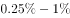

# 2017年422联考《行测》题（山东卷）

> 常识判断 · 20 题 · 山东 2017

## 第 1 题　qid 2049764 · 人文常识

关于我国的国家制度，下列说法错误的是：

- **A**. 我国是人民民主专政的社会主义国家
- **B**. 我国人民行使国家权力的机关是各级人民政府　✅
- **C**. 我国的国家机构实行民主集中制原则
- **D**. 我国经济制度的基础是全民所有制和劳动群众集体所有制

**答案**：B

**官方解析**

B项错误：《宪法》第二条第一款和第二款规定：“中华人民共和国的一切权力属于人民。人民行使国家权力的机关是全国人民代表大会和地方各级人民代表大会。”
A项正确：《宪法》第一条第一款规定：“中华人民共和国是工人阶级领导的、以工农联盟为基础的人民民主专政的社会主义国家。”
C项正确：《宪法》第三条第一款规定：“中华人民共和国的国家机构实行民主集中制的原则。”
D项正确：《宪法》第六条第一款规定：“中华人民共和国的社会主义经济制度的基础是生产资料的社会主义公有制，即全民所有制和劳动群众集体所有制。社会主义公有制消灭人剥削人的制度，实行各尽所能、按劳分配的原则。”
本题为选非题，故正确答案为B。

---

## 第 2 题　qid 2049770 · 人文常识

关于我国巡回法庭，下列说法错误的是：

- **A**. 巡回法庭作出的判决、裁定和决定，是最高人民法院的判决、裁定和决定
- **B**. 最高人民法院设立巡回法庭是对我国二审终审制的变通规定　✅
- **C**. 巡回法庭的受案范围暂不包括最高人民检察院抗诉的案件
- **D**. 巡回法庭根据审判工作需要，可以在巡回区内接待来访

**答案**：B

**官方解析**

B项错误：二审终审制是指一个案件经过两级人民法院审判即告终结的制度，对于第二审人民法院作出的终审判决、裁定，当事人等不得再提出上诉，人民检察院不得按照上诉审程序抗诉。而巡回法庭制度是指法院为方便群众诉讼，在辖区设置巡回地点，定期或不定期到巡回地点受理并审判案件的制度，也需遵循二审终审制。
A项正确：《最高人民法院关于巡回法庭审理案件若干问题的规定》第二条：“巡回法庭是最高人民法院派出的常设审判机构。巡回法庭作出的判决、裁定和决定，是最高人民法院的判决、裁定和决定。”
C项正确：《最高人民法院关于巡回法庭审理案件若干问题的规定》第三条第一款：“巡回法庭审理或者办理巡回区内应当由最高人民法院受理的以下案件：（一）全国范围内重大、复杂的第一审行政案件；（二）在全国有重大影响的第一审民商事案件；（三）不服高级人民法院作出的第一审行政或者民商事判决、裁定提起上诉的案件；（四）对高级人民法院作出的已经发生法律效力的行政或者民商事判决、裁定、调解书申请再审的案件；（五）刑事申诉案件；（六）依法定职权提起再审的案件；（七）不服高级人民法院作出的罚款、拘留决定申请复议的案件；（八）高级人民法院因管辖权问题报请最高人民法院裁定或者决定的案件；（九）高级人民法院报请批准延长审限的案件；（十）涉港澳台民商事案件和司法协助案件；（十一）最高人民法院认为应当由巡回法庭审理或者办理的其他案件。不包括最高人民检察院抗诉的案件。”
D项正确：《最高人民法院关于巡回法庭审理案件若干问题的规定》第九条：“巡回法庭根据审判工作需要，可以在巡回区内巡回审理案件、接待来访。”
本题为选非题，故正确答案为B。

---

## 第 3 题　qid 2049780 · 人文常识

某选区共有选民1889人，张某是候选人之一。在下列情况下，张某可以当选为该选区人大代表的是：

- **A**. 参加投票的有889人，张某获选票880张
- **B**. 参加投票的有1770人，张某获选票1781张
- **C**. 参加投票的有1881人，张某获选票697张
- **D**. 参加投票的有1001人，张某获选票792张　✅

**答案**：D

**官方解析**

A、C两项错误：《选举法》第四十五条规定，在选民直接选举人民代表大会代表时，选区全体选民的过半数参加投票，选举有效。代表候选人获得参加投票的选民过半数的选票时，始得当选。县级以上的地方各级人民代表大会在选举上一级人民代表大会代表时，代表候选人获得全体代表过半数的选票时，始得当选。A项中参加投票的889人不到选民1889人一半，无法当选。C项中张某获选票697张，未获得半数选票，无法当选。

B项错误：《选举法》第四十四条规定：“每次选举所投的票数，多于投票人数的无效，等于或者少于投票人数的有效。每一选票所选的人数，多于规定应选代表人数的作废，等于或者少于规定应选代表人数的有效。”选项中张某获选票数为1781张，多于参加投票的人数1770人，无法当选。
D项正确：《选举法》第四十五条规定，在选民直接选举人民代表大会代表时，选区全体选民的过半数参加投票，选举有效。代表候选人获得参加投票的选民过半数的选票时，始得当选。县级以上的地方各级人民代表大会在选举上一级人民代表大会代表时，代表候选人获得全体代表过半数的选票时，始得当选。选项中参加投票人数1001人超过全体选民1889人的一半，张某获选票792张超过参加投票选民1001人的一半，可以当选。
故正确答案为D。

---

## 第 4 题　qid 2049792 · 人文常识

赵某逛电器商场，准备购买一台豆浆机，其享有的权利不包括：

- **A**. 人身、财产安全不受损害的权利
- **B**. 选择购买何种品牌豆浆机的权利
- **C**. 拒绝保安因商场失窃而提出搜查其背包的权利
- **D**. 购买一台低价促销、有轻微划痕的豆浆机，一个月后以商品存在瑕疵为由提出退款的权利　✅

**答案**：D

**官方解析**

A项正确，《消费者权益保护法》第七条第一款：“消费者在购买、使用商品和接受服务时享有人身、财产安全不受损害的权利。”

B项正确，《消费者权益保护法》第九条第一款：“消费者享有自主选择商品或者服务的权利。”
C项正确，《消费者权益保护法》第二十七条：“经营者不得对消费者进行侮辱、诽谤，不得搜查消费者的身体及其携带的物品，不得侵犯消费者的人身自由。”
D项错误，《消费者权益保护法》第二十三条第一款规定：“经营者应当保证在正常使用商品或者接受服务的情况下其提供的商品或者服务应当具有的质量、性能、用途和有效期限；但消费者在购买该商品或者接受该服务前已经知道其存在瑕疵，且存在该瑕疵不违反法律强制性规定的除外。”
本题为选非题，故正确答案为D。

---

## 第 5 题　qid 2049804 · 法律常识

小张与小刘系夫妻，婚后小张患精神病，完全丧失辨认自己行为的能力，小刘准备离婚。下列说法符合法律规定的是：

- **A**. 小刘是小张第一顺位法定监护人，但其不能在离婚诉讼中作为小张的诉讼代理人　✅
- **B**. 小张的父亲作为小张的诉讼代理人参加离婚诉讼后，可以根据小张与小刘感情破裂的实际情况，代替小张对是否同意离婚作出意思表示
- **C**. 小张的父亲作为小张的诉讼代理人，如果不能到庭，法院不能判决准予离婚
- **D**. 如果小刘愿意放弃全部夫妻共同财产，则可以与小张协议离婚

**答案**：A

**官方解析**

A项正确：配偶作为原告提起离婚诉讼，被告为无民事行为能力人，需除了配偶外的近亲属作为诉讼代理人。A项中，小刘是小张的配偶，故其离婚诉讼中不能作为小张的诉讼代理人。
B项错误：诉讼代理人不能对是否同意离婚作出意思表示，因为法律赋予公民以婚姻自主权，由公民自主决定婚姻问题，他人不能替代。B项中，小张的父亲不能代替小张作出意思表示，是否离婚只能由法院根据婚姻状况及感情破裂程度，作出是否离婚的判决。
C项错误：无民事行为能力人的离婚诉讼，当事人的法定代理人应当到庭；法定代理人不能到庭的，人民法院应当在查清事实的基础上，依法作出判决。C项中，“法院不能判决”的表述错误。
D项错误：对于无民事行为能力人的离婚，只能通过诉讼进行，而不能协议离婚，因为无民事行为能力人不能进行民事活动，其所作出的意思表示是无效的。D项中，“可以与小张协议离婚”表述错误。
故正确答案为A。

---

## 第 6 题　qid 2049814 · 法律常识

根据我国刑事诉讼法的规定，下列证据应当予以直接排除的是：

- **A**. 采用刑讯逼供的方法收集的犯罪嫌疑人的供述　✅
- **B**. 收集犯罪嫌疑人贪污所得现金不符合法定程序的
- **C**. 收集合同诈骗罪涉案支票不符合法定程序，可能严重影响司法公正的
- **D**. 收集盗窃自行车不符合法定程序，不会影响司法公正，但无法作出合理解释的

**答案**：A

**官方解析**

根据《刑事诉讼法》第五十六条第一款规定：“采用刑讯逼供等非法方法收集的犯罪嫌疑人、被告人供述和采用暴力、威胁等非法方法收集的证人证言、被害人陈述，应当予以排除。收集物证、书证不符合法定程序，可能严重影响司法公正的，应当予以补正或者作出合理解释；不能补正或者作出合理解释的，对该证据应当予以排除。”
A项正确，采用刑讯逼供的方法收集犯罪嫌疑人的供述，应当予以直接排除。
B、C两项错误，“现金”“支票”属于“物证”，收集过程中不符合法定程序，可能严重影响司法公正的情况下，需要看能否“补正或者作出合理解释”，不能的才要排除，而不能直接排除。
D项错误，收集盗窃的“自行车”不会影响司法公正，不需直接排除。
故正确答案为A。

---

## 第 7 题　qid 2049822 · 人文常识

关于国家的政治制度，下列说法错误的是：

- **A**. 日本、泰国是君主立宪制国家
- **B**. 德国、俄罗斯是联邦制国家
- **C**. 英国是典型的多党制国家　✅
- **D**. 美国是典型的两党制国家

**答案**：C

**官方解析**

C项错误：英国是世界上最早出现资产阶级政党的，并最先确立和实行两党制的国家。目前英国属于议会内阁制下的两党制。
多党制是指在一个国家中，通常由不确定的两个或两个以上的政党联合执政的政治制度。比如意大利、荷兰、希腊等国实行多党制。
A项正确：君主立宪制指在保留君主制的前提下，通过立宪，树立人民主权、限制君主权力。日本为君主立宪国，宪法订明“主权在民”，天皇为日本国及人民团结的象征，但天皇没有政治实权。泰国政体为议会制君主立宪制。
B项正确：联邦制是一种复合制的国家结构，实行中央政府和地方政府分权。《德意志联邦共和国基本法》规定：德国是联邦制国家。俄罗斯联邦，简称俄联邦或俄罗斯，是由22个自治共和国、46个州、9个边疆区、4个自治区、1个自治州、3个联邦直辖市组成的联邦共和立宪制国家。
D项正确：两党制是指一国内两大政党轮流执政的政治制度。美国的两大政党是共和党和民主党。英国也属于两党制国家，包括保守党和工党。
本题为选非题，故正确答案为C。

---

## 第 8 题　qid 2049826 · 经济常识

与其他投资基金相比，下列哪项不是货币型基金的特点？

- **A**. 高流动性
- **B**. 风险性较高　✅
- **C**. 收益率较低
- **D**. 投资费用低

**答案**：B

**官方解析**

B项错误：货币型基金风险性低。货币市场工具的到期日通常很短，货币型基金投资组合的平均期限一般为个月，因此风险较低，其价格通常只受市场利率的影响。

A项正确：货币型基金流动性高。这些特点主要源于货币市场是一个低风险、流动性高的市场。同时，投资者可以不受到日期限制，随时可根据需要转让基金单位。

C项正确：货币型基金收益率较低。货币型基金的收益率一般跟短期利率有关，随行就市。

D项正确：货币型基金投资成本低。货币型基金通常不收取赎回费用，并且其管理费用也较低，货币型基金的年管理费用大约为基金资产净值的，低于传统的基金年管理费率。

本题为选非题，故正确答案为B。

---

## 第 9 题　qid 2049828 · 人文常识

同时具备“三国时期”“皇帝”“邺下文人集团”这三种特征的历史人物是：

- **A**. 曹操
- **B**. 曹丕　✅
- **C**. 刘邦
- **D**. 刘备

**答案**：B

**官方解析**

本题考查人文历史。
三国时期（公元220年－公元280年）是上承东汉下启西晋的一段历史时期，分为曹魏、蜀汉、东吴三个政权。邺下文人集团是以曹氏父子为中心的名流学士，因曹操建都邺城（今河北临漳县邺北城）得名，作品反映社会动乱与民生疾苦，悲天悯人，表现乱世英雄建功立业，收拾金瓯的使命感。
A项错误，曹操（公元155年－公元220年），字孟德，东汉末年杰出的政治家、军事家、文学家，三国中曹魏政权的奠基人，但曹操一生未称帝，不符合“皇帝”这一特征。
B项正确，曹丕（公元187年－公元226年），字子桓，建安二十五年（220年），曹丕受禅登基，以魏代汉，结束了汉朝四百多年的统治建立魏国，史称魏文帝。曹丕是中国三国时代杰出的诗人，他的五言和乐府清绮动人，现存诗约四十首。
C项错误，刘邦（公元前256年－公元前195年），沛丰邑中阳里人，汉朝开国皇帝，汉民族和汉文化的伟大开拓者之一、中国历史上杰出的政治家、卓越的战略家和指挥家。不符合“三国时期”“邺下文人集团”的特征。
D项错误，刘备（公元161年－公元223年），字玄德，东汉末年幽州涿郡涿县，西汉中山靖王刘胜的后代，三国时期蜀汉开国皇帝、政治家，史家又称他为先主。不符合“邺下文人集团”的特征。
故正确答案为B。

---

## 第 10 题　qid 2049838 · 人文常识

关于这幅图中的人物，下列说法不正确的是：

- **A**. 曾东渡日本传播佛法　✅
- **B**. 曾在古印度学习佛教圣典
- **C**. 大雁塔用于安置他所带回的佛经
- **D**. 《大唐西域记》是由其口述、弟子记录的游记

**答案**：A

**官方解析**

本题考查中国人文常识。图片为佛教绘画《玄奘负笈图》，相传为宋代无名画家所画。
A项错误：曾东渡日本传播佛法是鉴真。鉴真，唐朝僧人，应日本留学僧请求先后六次东渡，弘传佛法，促进了文化的传播与交流。
B项正确：玄奘为探究佛教各派学说分歧，于贞观年间一人西行五万里，历经艰辛到达印度佛教中心那烂陀寺取真经，前后十七年在印度学遍了当时的大小乘各种学说，共带回佛舍利150粒、佛像7尊、经论657部，并长期从事翻译佛经的工作。
C项正确：大雁塔位于陕西西安的大慈恩寺内，唐永徽三年（652年）玄奘为保存由天竺经丝绸之路带回长安的经卷佛像主持修建了大雁塔，最初五层，后加盖至九层，再后层数和高度又有数次变更，最后固定为今天所看到的七层塔身。
D项正确：《大唐西域记》是我国和世界最早的国际新闻作品集、佛教史籍，又称《西域记》，由玄奘口述，其弟子辩机撰文。本书是玄奘奉唐太宗敕命而著，贞观二十年成书。
本题为选非题，故正确答案为A。

---

## 第 11 题　qid 2049662 · 人文常识

沉积是自然界中一种重要的成岩过程，下列关于沉积的说法正确的是：

- **A**. 在构成岩石圈的三大岩类中，沉积岩所占比例最大
- **B**. 由于沉积过程中的压实作用，沉积岩的岩体内不存在孔隙
- **C**. 在搬运过程中，当水动力减弱时，较重的碎屑会先沉积下来　✅
- **D**. 沉积物一旦稳定成岩，就不会再被剥蚀搬运

**答案**：C

**官方解析**

A项错误，沉积岩、岩浆岩和变质岩是三种组成地球岩石圈的主要岩石。在地球地表，有的岩石是沉积岩，但如果按照从地球表面到16公里深的整个岩石圈算，沉积岩只占5。因此从整个岩石圈来看，沉积岩的比例不是最大的。

B项错误，通过压实作用沉积物发生脱水，孔隙度降低，体积缩小，密度增大，松软的沉积物变成固结的岩石。B项说法过于绝对，压实作用只会让孔隙度降低，不会完全没有孔隙。

C项正确，在流水的搬运途中，由于水的流速、流量的变化以及碎屑物本身大小、形状、比重等的差异，沉积顺序有先后之分。一般颗粒大、比重大的物质先沉积，颗粒小、比重小的物质后沉积。所以当水动力减弱时，较重的碎屑会先沉积下来。

D项错误，剥蚀搬运十分普遍，地表的岩石无时无刻不在经受着这种作用。即使像花岗岩、大理岩等算是坚硬的岩石，在风化作用下仍然不免遭到破坏。

故正确答案为C。

---

## 第 12 题　qid 2049664 · 人文常识

下列关于极光的说法正确的是：

- **A**. 多出现在高磁纬地区上空　✅
- **B**. 是地球所特有的现象
- **C**. 是极昼、极夜现象产生的原因
- **D**. 水汽、磁场和带电粒子是其产生的必要条件

**答案**：A

**官方解析**

极光是出现于星球的高磁纬地区上空，是一种绚丽多彩的发光现象。在南极被称为南极光，在北极被称为北极光。地球的极光是来自地球磁层或太阳的高能带电粒子流（太阳风）使高层大气分子或原子激发（或电离）而产生。
A项：正确，极光产生必备条件之一是高能粒子，由于地磁场的作用，这些高能粒子转向极区，所以极光常见于高磁纬地区。
B项：错误，极光不只在地球上出现，太阳系内具备大气、磁场、高能带电粒子的行星上也有极光。
C项：错误，产生极昼、极夜现象的原因是倾斜着的地球在沿椭圆形轨道绕太阳公转时，还绕着自身的倾斜地轴旋转。
D项：错误，极光产生的条件有三个：大气、磁场、高能带电粒子，水汽不是极光产生的必要条件。
故正确答案为A。

---

## 第 13 题　qid 2049666 · 人文常识

中国古代的姓、氏、名、字各有不同的意义。下列哪个人物的称谓是由姓和名构成的？

- **A**. 鲁班
- **B**. 屈原
- **C**. 苏东坡
- **D**. 辛弃疾　✅

**答案**：D

**官方解析**

A项：错误，鲁班，鲁非其姓，因是春秋时鲁国人故有此称。姬姓，公输氏，名班。人称公输盘、公输般、班输，或鲁般，惯称鲁班，尊称公输子。发明了锯子、曲尺、墨斗等。
B项：错误，屈原，屈为氏，姓芈；原为字，名平。战国时楚国人，《离骚》的作者，楚辞的主要创立者和作者，端午节源于纪念他。
C项：错误，苏东坡，东坡是他的号，姓苏，名轼，字子瞻。秦汉时期我国姓氏已合而为一。苏轼与欧阳修并称欧苏，为“唐宋八大家”之一。 
D项：正确，辛弃疾，是姓、名。辛弃疾，字幼安，号稼轩。有“词中之龙”之称，与李清照并称“济南二安”。
故正确答案为D。

---

## 第 14 题　qid 2049668 · 人文常识

关于诗句所描述的节日，下列对应正确的是：
①东篱把酒黄昏后，有暗香盈袖
②雨中禁火空斋冷，江上流莺独坐听
③莫唱江南古调，怨抑难招，楚江沉魄

- **A**. 元宵  清明  中秋
- **B**. 重阳  寒食  端午　✅
- **C**. 中秋  寒食  端午
- **D**. 元宵  清明  重阳

**答案**：B

**官方解析**

①东篱把酒黄昏后，出自宋·李清照《醉花阴》。此句中的“东篱”，借用晋·陶渊明的“采菊东篱下”（饮酒•其五），指的是黄昏把酒赏菊。赏菊为九月九日重阳习俗，重阳另有饮菊花酒、登高、插茱萸等习俗。
②雨中禁火空斋冷，出自唐·韦应物《寒食寄京师诸弟》。“禁火空斋冷”道出寒食节习俗。寒食节相传是晋文公为纪念介子推所设，在清明前一日或两日，有禁烟火、吃冷食的习俗。
③莫唱江南古调，怨抑难招，楚江沉魄，出自宋·吴文英《澡兰香•淮安重午》。“江南古调”应指离骚，古楚国方言所做歌曲。“楚江沉魄”道出屈原一心救楚，反遭驱逐，投古楚国汨罗江而死，端午节即后人为纪念他而来。有划龙舟、吃粽子、喝雄黄酒、挂艾草和菖蒲的习俗。
故正确答案为B。

---

## 第 15 题　qid 2049672 · 地理国情

“秦时明月汉时关，万里长征人未还。但使龙城飞将在，不教胡马度阴山。”关于《出塞》这首诗，下列说法错误的是：

- **A**. 我国的800毫米年等降水量线经过阴山山脉　✅
- **B**. “胡”是中国古代对北方和西方各少数民族的泛称
- **C**. 作者被誉为“七绝圣手”
- **D**. “飞将”指的是西汉名将李广

**答案**：A

**官方解析**

A项：错误，我国的800毫米年等降水量线，沿秦岭——淮河一线向西折向青藏高原东南边缘一线。北，止于秦岭淮河的江苏、河南、陕西等省，并未经过更北内蒙境内的阴山；
B项：正确，“胡”是中国古代对北方和西方各少数民族的泛称。如称匈奴为“胡”，其东之乌桓、鲜卑先世为“东胡”，西域各族为“西胡”。魏晋后，活动于中原地区的有些民族也常被称为“胡”，如“羯胡”“稽胡”等；
C项：正确，此诗作者王昌龄，字少伯，河东晋阳（今山西太原）人。盛唐著名边塞诗人，后人誉为“七绝圣手”。其诗以七绝见长，尤以登第之前赴西北边塞所作边塞诗最著，有“诗家夫子王江宁（指其官职江宁丞）”之誉；
D项：正确，《史记·李广列传》载：广居右北平，匈奴闻之，号曰“汉之飞将军”，避之，数岁不敢入右北平。
本题为选非题，故正确答案为A。

---

## 第 16 题　qid 2049674 · 科技常识

旅行者2号探测器于1977年8月20日在肯尼迪航天中心成功发射升空，近探过太阳系的四颗行星后，飞向了外太空。这四颗行星依次为：

- **A**. 水星、金星、火星、天王星
- **B**. 水星、金星、木星、天王星
- **C**. 木星、土星、天王星、海王星　✅
- **D**. 木星、火星、天王星、海王星

**答案**：C

**官方解析**

旅行者2号探测器是美国航天局研制的飞往太阳系外的两艘空间探测器的第二艘。探访顺序如下：
①木星，在1979年7月9日最接近，在距离木星云顶570,000公里（350,000英里）处掠过；
②土星，在1981年8月25日最接近，当太空船处于土星后方时（相对地球而言），它以雷达对土星的大气层上部进行探测，并量度了气温及密度等资料；
③天王星，在1986年1月24日最接近，并随即发现了10个之前未知的天然卫星；
④海王星，在1989年8月25日最接近，发现了海王星的大暗斑。
可知，近探顺序依次为木星、土星、天王星、海王星。
故正确答案为C。

---

## 第 17 题　qid 2049676 · 人文常识

下列哪一事件不是发生在魏晋南北朝时期？

- **A**. 七国之乱　✅
- **B**. 五胡乱华
- **C**. 王与马共天下
- **D**. 梁武帝舍身佛寺

**答案**：A

**官方解析**

本题考查历史常识。主要涉及中国历史的相关内容。
A项：错误，七国之乱是发生在西汉汉景帝时期的一次诸侯国叛乱。七国之乱是地方割据势力与中央专制皇权之间矛盾的爆发。七国之乱的平定，标志着西汉诸侯王势力的威胁基本被清除，中央集权得到巩固和加强。
B项：正确，五胡乱华指在西晋时期塞外众多游牧民族趁西晋八王之乱，国力衰弱之际，陆续建立的非汉族政权，形成与南方汉人政权对峙的时期。
C项：正确，“王与马，共天下”是说东晋时期琅琊王氏家族与当时皇室力量势均力敌，甚至还有过之，当时百姓称之为“王与马，共天下”，琅琊王氏进入极盛时期。 
D项：正确，南北朝时期佛教盛行，到了梁武帝时臻于鼎盛。据说当时仅建康（南京）城内就有寺院500余所，僧尼达10万余人。主要原因是梁武帝一心崇佛，极力发展佛教。他本人曾几次舍身到同泰寺（今南京鸡鸣寺）当和尚，被人称为“和尚皇帝”。
本题为选非题，故正确答案为A。

---

## 第 18 题　qid 2049678 · 人文常识

关于历史上的“南北”，下列说法错误的是：

- **A**. 禅宗自五祖弘忍之后分为南宗和北宗
- **B**. 董其昌将唐代以来的山水画分为南、北两宗
- **C**. “南洪北孔”指清代戏曲作家洪昇和孔尚任
- **D**. 李煜是南北朝时期南朝的帝王　✅

**答案**：D

**官方解析**

本题考查历史常识。主要涉及中国历史的相关内容。
D项：错误，李煜，南唐中主李璟第六子，初名从嘉，字重光，号钟隐、莲峰居士，南唐最后一位国君，南唐属于五代十国时期，而非南北朝；
A项：正确，南北宗，中国佛教禅宗至唐时形成的两个派别，禅宗自五祖弘忍以后，因北方神秀的渐悟说和南方慧能的顿悟说主张不同而形成；
B项：正确，董其昌在《容台别集•画旨》中论及“画分南北宗”：“禅家有南北二宗，唐时始分；画之南北二宗，亦唐时分也。”
C项：正确，南洪北孔指的是清初著名历史剧作家洪昇和孔尚任，他们分别以《长生殿》和《桃花扇》名震剧坛。
本题为选非题，故正确答案为D。

---

## 第 19 题　qid 2049682 · 人文常识

下列哪组成语均属于谦辞？

- **A**. 不吝赐教、班门弄斧
- **B**. 抛砖引玉、望尘莫及　✅
- **C**. 洗耳恭听、蓬荜生辉
- **D**. 高抬贵手、一孔之见

**答案**：B

**官方解析**

本题考查文学常识。谦辞，表示谦虚或谦恭的言辞，大都只能用于自称。
B项：正确，抛砖引玉：抛出砖去，引回玉来。比喻用自己不成熟的意见或作品引出别人更好的意见或好作品，谦词。望尘莫及：指望见走在前面的人带起的尘土而追赶不上，比喻远远落后，谦词。
A项：错误，不吝赐教：不吝惜自己的意见，希望别人给予指导，敬词。班门弄斧：比喻在行家面前卖弄本领，谦词。
C项：错误，洗耳恭听：指做好准备用心地聆听别人说的话，对自己有很大的帮助。请人讲话时的客气话，指专心地听，敬词。蓬荜生辉：指某事物使寒门增添光辉，多用作宾客来到家里，或赠送可以张挂的字画等物的客套话，谦词。
D项：错误，高抬贵手：原意手抬高一些就可以让人过去，引申是表示请求宽恕、通融时的客套用语，请求对方宽恕、原谅等，属于敬词。一孔之见：比喻狭小片面的见解，可用做谦辞，不做谦辞时，含贬义。
故正确答案为B。

---

## 第 20 题　qid 2049686 · 人文常识

关于地质年代与地层，下列说法错误的是：

- **A**. 当岩层之间有切割现象时，被切割的岩层比切割的岩层古老
- **B**. 发现大量三叶虫化石的岩层比发现大量鱼类化石的岩层古老
- **C**. 放射性同位素方法可用来测定岩层的形成年代
- **D**. 在全球范围内，形成于同一地质时期的岩层岩性都是相同的　✅

**答案**：D

**官方解析**

本题考查地理国情。
D项：错误，在全球范围内，形成于同一地质时期的岩层岩性都是相同的，表述过于绝对，形成于同一地质时期、同一地质环境下的岩石性质才大致相同。
A项：正确，岩层切割律又称穿插关系，就侵入岩与围岩的关系来说，总是侵入者年代新，被侵入者年代老，这就是切割律。即当岩层之间有切割现象时，被切割的岩层比切割的岩层古老。
B项：正确，地球相对年龄的确立主要依据于化石。自从英国地质学家史密斯提出“化石层序律”后，就把时间与生物演化阶段联系起来。人们知道，在不同时代的地层中含有不同的化石，同样，我们得到了这些化石后也可以推断产出这些化石的地层年代。三叶虫出现的时间要略早于鱼类。故发现大量三叶虫化石的岩层比发现大量鱼类化石的岩层古老。
C项：正确，该方法是1904年英国物理学家卢福首先提出的，此方法的基本原理是：假设岩石形成时，含有一定量的具放射性的母体同位素，随时间的流逝，该母体同位素蜕变，其含量逐渐减少，蜕变后形成的子体同位素则逐渐增多，只要测定母体同位素与子体同位素之比，则该比值就可作为岩石形成以来的时间的尺度。
本题为选非题，故正确答案为D。

---
