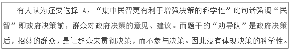

# 2017年北京市公务员录用考试《行测》题

> 常识判断 · 34 题 · 北京 2017

## 第 1 题　qid 2031048 · 人文常识

2016年2月中共中央、国务院印发了《关于进一步加强城市规划建设管理工作的若干意见》，提出了未来一段时间我国城市发展的一些具体方针与措施。其中不包括：

- **A**. 大力发展住宅小区建设　✅
- **B**. 建设地下综合管廊
- **C**. 保护历史文化风貌
- **D**. 推进海绵城市建设

**答案**：A

**官方解析**

A项错误：《关于进一步加强城市规划建设管理工作的若干意见》提出了未来一段时间我国城市发展的一些具体方针与措施，其中不包括大力发展住宅小区建设。住宅小区的建设需要根据实际情况来做出调整，并不一定要大力发展。
B、C、D项正确：《关于进一步加强城市规划建设管理工作的若干意见》从塑造城市特色风貌、完善城市公共服务、营造城市宜居环境等方面提出一些具体方针与措施。B项建设地下综合管廊属于完善城市公共服务，有利于城市地下空间的整合，保障城市运行的重要基础设施；C项保护历史文化风貌属于塑造城市特色风貌，能更好地延续历史文脉，展现城市风貌；D项推进海绵城市建设属于营造城市宜居环境，能提升水源涵养能力，缓解雨洪内涝压力，促进水资源循环利用。
本题为选非题，故正确答案为A。

---

## 第 2 题　qid 2031058 · 人文常识

有序疏解非首都功能是落实城市战略定位、治理“大城市病”、实现可持续发展的阶段性要求，符合城市转型升级的一般发展规律。下列对于北京市“十三五”期间有序疏解非首都功能措施描述正确的是：
①在全市区域内严禁发展一般性制造业和高端制造业
②在全市区域内严禁新建包括零售网点在内的商品交易市场设施
③就地淘汰一批有色金属、建材、化工、机械、印刷等污染较大、耗能耗水较高的行业
④有序退出区域性物流基地、区域性专业市场等部分第三产业

- **A**. ①②
- **B**. ②③
- **C**. ②④
- **D**. ③④　✅

**答案**：D

**官方解析**

D项正确：根据《“十三五”时期京津冀国民经济和社会发展规划》（以下简称《规划》），推进北京非首都功能疏解。实施的措施主要有：坚决退出一般性制造业特别是高消耗产业，有序退出区域性物流基地、区域性专业市场等部分第三产业，推动部分教育、医疗等社会公共服务功能疏解，有序疏解部分行政性、事业性服务机构和企业总部等。故③④正确。
A、B、C项错误：其中①高端制造业错误，②零售网点在内的商品交易市场设施错误。
故正确答案为D。

---

## 第 3 题　qid 2031062 · 人文常识

二十国集团（G20）领导人第十一次峰会于2016年9月4日至5日在我国举行，并取得圆满成功。下列关于二十国集团（G20）的说法中，不正确的是：

- **A**. 2016年G20峰会在我国浙江省杭州市举行
- **B**. 2016年G20峰会的主题是“构建创新、活力、联动、包容的世界经济”
- **C**. G20是亚太地区层级最高、领域最广、最具影响力的经济合作机制　✅
- **D**. 二十国集团领导人第一次峰会于2008年举行

**答案**：C

**官方解析**

C项错误：亚太地区层级最高、领域最广、最具影响力的经济合作机制是亚太经济合作组织（APEC）。
A项正确：2016年9月4日至5日在浙江杭州举办二十国集团领导人第十一次峰会。
B项正确：习近平主席对中国主办2016年峰会提出的“4个I”主题，即希望推动各方共同构建创新(innovative)、活力(invigorated)、联动(interconnected)、包容(inclusive)的世界经济，2016年峰会主题为“构建创新、活力、联动、包容的世界经济”。
D项正确：2008年11月，二十国集团领导人首次峰会在美国华盛顿举行。
本题为选非题，故正确答案为C。

---

## 第 4 题　qid 2031066 · 科技常识

2016年8月16日我国发射了世界首颗量子科学实验卫星，这将使我国在世界上首次实现卫星和地面之间的量子通信。这颗卫星被命名为：

- **A**. “孔子号”
- **B**. “墨子号”　✅
- **C**. “孟子号”
- **D**. “荀子号”

**答案**：B

**官方解析**

B项正确：2016年8月16日，我国在酒泉卫星发射中心成功将世界首颗量子科学实验卫星（简称“量子卫星”）“墨子号”发射升空。这颗量子卫星以我国古代伟大科学先贤墨子的名字命名为“墨子号”。
解析本题时，观察四个选项里，可发现只有墨子具有科学家的身份，墨子所著的《墨经》中就包含了丰富的关于力学、光学、几何学、工程技术知识和现代物理学、数学的基本要素。初中物理还介绍了墨经中的小孔成像的记载。灵活运用知识储备是常识要诀。
故正确答案为B。

---

## 第 5 题　qid 2031070 · 人文常识

发展为了人民、发展依靠人民、发展成果由人民共享，这是中国推进改革开放和社会主义现代化建设的根本目的。这段话体现的哲学原理是：

- **A**. 共享是社会主义核心价值观
- **B**. 发展是现代化建设的目的
- **C**. 改革是社会发展的动力
- **D**. 群众是社会历史发展的主体　✅

**答案**：D

**官方解析**

D项正确：马克思主义唯物史观指出人民群众是社会历史的主体，强调人民群众是历史的创造者，要树立群众观点和群众路线。“发展为了人民、发展依靠人民、发展成果由人民共享”符合“群众观点”的基本要求；
A项错误：选项表述不是哲学原理，且社会主义核心价值观包括：富强、民主、文明、和谐，自由、平等、公正、法治，爱国、敬业、诚信、友善，不包括“共享”；
B项错误：选项表述不是哲学原理，且现代化建设的目的是提高人民物质文化生活水平；
C项错误：选项表述本身是正确的，但题干未体现。
故正确答案为D。

---

## 第 6 题　qid 2031074 · 人文常识

我们纪念红军长征胜利80周年，就是要缅怀革命先烈不朽功勋，继承光荣的革命传统，弘扬伟大的长征精神，走好自己的长征路。这主要是因为：

- **A**. 量变能引起质变
- **B**. 意识对物质具有反作用　✅
- **C**. 外因是事物发展的基本条件
- **D**. 世界是普遍联系的

**答案**：B

**官方解析**

B项正确：长征精神，是正确反映客观事物及其发展规律的意识，能够指导我们有效的开展实践活动，促进客观事物的发展，对我们走好自己的长征路具有积极的指导意义，正体现了意识的反作用。
A项错误：题干强调的是“长征精神”这一意识，属于唯物观的内容；“量变引起质变”属于辩证法相关内容，不符合题意。
C项错误：题干强调的是“长征精神”这一意识，属于唯物观的内容；“内外因”属于辩证法相关内容，不符合题意。
D项错误：题干强调的是“长征精神”这一意识，属于唯物观的内容；“联系”属于辩证法相关内容，不符合题意。
故正确答案为B。

---

## 第 7 题　qid 2031080 · 经济常识

在任何社会中，构成社会财富的物质内容是：

- **A**. 货币
- **B**. 资本
- **C**. 使用价值　✅
- **D**. 劳动

**答案**：C

**官方解析**

马克思在《资本论·第一卷·第一章·商品的两个因素》中指出：“使用价值只是在使用或消费中得到实现。不论财富的社会形式如何，使用价值总是构成财富的物质内容。在我们所要考察社会形式中，使用价值同时又是交换价值的物质承担者”。 
故正确答案为C。

---

## 第 8 题　qid 2031084 · 经济常识

在当下社会，纸币已经出现电子形态，比如越来越多的人使用手机进行支付，整个支付过程完全见不到纸币的踪影。这说明手机支付可以代替货币的哪项职能？

- **A**. 世界货币
- **B**. 储藏手段
- **C**. 价值尺度
- **D**. 支付手段　✅

**答案**：D

**官方解析**

D项正确：货币作为独立的价值形式进行单方面运动（如清偿债务、缴纳税款、支付工资和租金等）时所执行的职能。在货币作为支付手段的情况下，由于很多商品生产者互相欠债，他们之间便结成了一个债务锁链，手机支付就是起到债务支付的作用；
A项错误：世界货币是货币在世界市场上执行一般等价物的职能，作为世界货币，必须是足值的金和银，手机支付与其无关；
B项错误：储藏手段，又称贮藏手段，必须是实在的足值的金银货币（金银铸币或金银条块）才能发挥货币贮藏手段的职能，“盛世古董乱世金”中的“乱世金”即是货币储藏手段的写照，因此手机支付与储藏手段无关；
C项错误：价值尺度是用来衡量和表现商品价值的一种职能，手机支付与其无关。
故正确答案为D

---

## 第 9 题　qid 2031088 · 经济常识

在市场经济下，当一国处于经济下降阶段时，经济上不可能出现的特征是：

- **A**. 商品价格持续上升　✅
- **B**. 居民消费需求下滑
- **C**. 投资减少，失业率上升
- **D**. 居民收入减少

**答案**：A

**官方解析**

A项错误：经济下降是指衡量经济增长的各项指标都在不断的降低，比如GDP（国内生产总值）、PPI（生产者物价指数）、CPI（居民消费价格指数）等，因此，商品价格应出现下降的状态；
B项正确：经济下降，居民消费会需求下滑；
C项正确：经济下降，相应会出现投资减少，失业率上升；
D项正确：经济下降，社会财富减少，居民相应的收入也减少。
本题为选非题，故正确答案为A。

---

## 第 10 题　qid 2031092 · 法律常识

根据《民法典》物权编，下列属于不动产的是：

- **A**. 邮轮
- **B**. 私人飞机
- **C**. 个人住宅　✅
- **D**. 房车

**答案**：C

**官方解析**

C项正确，在司法实践中，不动产和动产是根据物能否移动和移动后是否会损害物的价值为标准进行划分的。不动产指依自然性质或法律规定不可移动的物，如土地、房屋等；动产是指能够移动并且不因移动损害其价值的物，不动产以外的物可解释为动产。四个选项中，C项“个人住宅”属于不动产，A、B、D三项均属于动产。
故正确答案为C。

---

## 第 11 题　qid 2031094 · 人文常识

张家欲购买刘家的老宅，刘家一直没有同意，后张家见刘家人老势弱，迫使刘家在自己起草的房屋买卖协议上签了字。张家的行为主要违背了下列哪项民法原则？

- **A**. 自愿原则　✅
- **B**. 平等原则
- **C**. 公平原则
- **D**. 诚信原则

**答案**：A

**官方解析**

A项正确：自愿原则，就是在民事活动中当事人的意思自治，即当事人可以根据自己的判断去从事民事活动。本案中刘家一直未同意卖房，张家迫使刘家违背本意的情况下签订了房屋买卖协议，违背了自愿原则。
B项错误：平等原则，是指主体的身份平等，是指不论其自然条件和社会处境如何，其法律资格亦即权利能力一律平等。本案中刘家和张家的法律地位是平等的，因此张家未违背民法的平等原则。
C项错误：公平原则是指在民事活动中以利益均衡作为价值判断标准，在民事主体之间发生利益关系摩擦时，以权利和义务是否均衡来平衡双方的利益。本案中刘家与张家签订了卖房协议，并未谈到刘家迫使张家低于市场价格出售，未显失公平。
D项错误：诚信原则是指民事主体进行民事活动必须意图诚实、善意、行使权利不侵害他人与社会的利益，履行义务信守承诺和法律规定，最终达到所有获取民事利益的活动。本案中刘家并未出现欺骗等不诚信的行为，他只是迫使张家卖房。
故正确答案为A。

---

## 第 12 题　qid 2031096 · 法律常识

警方在一家餐馆内展开抓捕行动，由于犯罪嫌疑人暴力抵抗，餐馆部分物品在抓捕过程中被损坏，餐馆的营业秩序受到一定影响。关于餐馆的损失，下列说法中正确的是：

- **A**. 应由餐馆自行承担
- **B**. 应由实施抓捕的警察赔偿
- **C**. 应由犯罪嫌疑人赔偿
- **D**. 应由国家补偿　✅

**答案**：D

**官方解析**

D项正确：国家补偿是指国家对国家机关及其工作人员的合法行使职权行为对公民造成的损失给予的补偿。本题中，餐馆的损失是由于警方在抓捕犯罪嫌疑人造成的，属于合法行使职权行为时造成的损失，应当由国家给予补偿；
A项错误：餐馆的损失是由于警方抓捕犯罪嫌疑人造成，不应由餐馆自行承担；
B项错误：《警察法》第五十条规定：“人民警察在执行职务中，侵犯公民或者组织的合法权益造成损害的，应当依照《中华人民共和国国家赔偿法》和其他有关法律、法规的规定给予赔偿。”根据有关司法解释，这种赔偿并不是民警个人行为，而是国家行为，由其所属的公安机关承担。可知，本题中应由实施抓捕的警察所属的公安机关承担；
C项错误：犯罪嫌疑人在逃脱抓捕时损坏公民财物，属于纯粹的民事侵权行为，应当按照《侵权责任法》和《民法通则》的有关规定，受害者可与该嫌疑人商议赔偿问题，商议不成的，可以提起民事诉讼，要求赔偿。可知，餐馆的损失不一定由犯罪嫌疑人赔偿。
故正确答案为D。

---

## 第 13 题　qid 2031098 · 人文常识

“物质奖励+纪律惩罚”所依据的是现代管理理论中的什么假定？

- **A**. “机械人”
- **B**. “经济人”　✅
- **C**. “社会人”
- **D**. “复杂人”

**答案**：B

**官方解析**

B项正确：“经济人”假设是指每个人都以自身利益最大化为目标，认为人类本性懒惰，厌恶工作，唯一的激励办法就是以经济报酬来激励生产。“物质奖励+纪律惩罚”就是一种通过经济报酬的增加或减少来激励生产、避免损失的一种管理手段；
A项错误：“机械人”假设是指把人看作是进行生产作业的机械工具，认为他们只能被动地接受命令、进行作业，不具有独立思考能力和创造能力。不符合题意；
C项错误：“社会人”假设认为在社会上活动的员工不是各自孤立存在的，而是作为某一个群体的一员有所归属的“社会人”，是社会存在。人具有社会性的需求，人与人之间的关系和组织的归属感比经济报酬更能激励人的行为。不符合题意；
D项错误：“复杂人”假设包含两个方面的含义：其一，就个体而言，其需要和潜力会随着年龄的增长，知识的增加，地位的改变，环境的改变以及人与人之间关系的改变而各不相同。其二，就群体而言，人与人是有差异的。因此，无论是“经济人”、“社会人”，还是“自我实现人”的假设，虽然各有其合理性的一面，但并不适用于一切人。不符合题意。
故正确答案为B。

---

## 第 14 题　qid 2031102 · 法律常识

按照当前我国法律规定，地方各级人民政府每届任期几年？

- **A**. 三
- **B**. 四
- **C**. 五　✅
- **D**. 六

**答案**：C

**官方解析**

C项正确：根据《中华人民共和国地方各级人民代表大会和地方各级人民政府组织法》第五十八条规定：地方各级人民政府每届任期五年。
故正确答案为C。

---

## 第 15 题　qid 2031104 · 人文常识

2016年9月21日，全国推行“双随机、一公开”监管工作电视电话会议召开。会议指出，要全力推进该项工作，以科学有效地“管”促进更大力度地“放”，着力打造公平竞争的市场环境和法治化便利化营商环境，更好服务企业和群众创业兴业，为促进经济社会持续健康发展作出新贡献。“双随机、一公开”监管方式中的“双随机”是指：

- **A**. 随机确定执法检查机构，随机选派执法检查人员
- **B**. 随机确定执法检查机构，随机确定检查时间
- **C**. 随机抽取检查对象，随机选派执法检查人员　✅
- **D**. 随机抽取检查对象，随机确定检查时间

**答案**：C

**官方解析**

C项正确：9月21日，在全国推行“双随机、一公开”监管工作电视电话会议召开之际，中共中央政治局常委、国务院总理李克强作出重要批示。批示指出：全面推行“双随机、一公开”监管，随机抽取检查对象，随机选派执法检查人员，抽查情况及查处结果及时向社会公开，是深化简政放权、放管结合、优化服务改革的重要举措，是完善事中事后监管的关键环节，对于提升监管的公平性、规范性和有效性，减轻企业负担和减少权力寻租，都具有重要意义。
故正确答案为C。

---

## 第 16 题　qid 2031106 · 人文常识

“中体西用”是洋务派处理中西文化关系的一种文化模式，一种文化心态。在洋务运动时期，下列不属于“中体西用”的内容的是：

- **A**. 西方军事装备
- **B**. 西方政治制度　✅
- **C**. 西方新式学堂
- **D**. 西方科学技术

**答案**：B

**官方解析**

B项错误：“中体西用”主张在维护清王朝封建统治的基础上，不改变当前封建社会制度，采用西方造船炮、修铁路、开矿山、架电线等自然科学技术以及文化教育方面的具体办法来挽救统治危机。
A项正确：属于“中体西用”内容，洋务派在这一时期兴建了“北洋、南洋、福建”三支海军，成立江南制造总局和安庆内军械所等，增强了军事实力。
C项正确：属于“中体西用”内容，洋务派在这一时期兴建了“京师同文馆”，选派留学生出国学习。
D项正确：属于“中体西用”内容，洋务派在这一时期兴建了一批民用工业，学习西方的造船、炼铁、纺织和采矿等技术，成立汉阳铁厂、开平矿务局等企业。
本题为选非题，故正确答案为B。

---

## 第 17 题　qid 2031108 · 人文常识

下列各项所描写的人物中，与其它三项不处于同一时代的是：

- **A**. 功盖三分国，名成八阵图
- **B**. 治世之能臣，乱世之奸雄
- **C**. 千万雄兵莫敢当，单刀匹马斩颜良
- **D**. 江东子弟多才俊，卷土重来未可知　✅

**答案**：D

**官方解析**

D项错误：“江东子弟多才俊，卷土重来未可知”这句诗出自杜牧的《题乌江亭》，意思是江东子弟人才济济，若能重整旗鼓卷土杀回，楚汉相争，谁输谁赢还很难说。所描写的人物是西楚霸王项羽。
A项正确：“功盖三分国，名成八阵图”出自杜甫的《八阵图》，赞颂的是三国时期的诸葛亮。第一句是从总的方面写，说诸葛亮在确立魏蜀吴三分天下、鼎足而立局势的过程中，功绩最为卓绝。第二句是从具体的方面来写，说诸葛亮创制八阵图使他声名更加卓著。
B项正确：“治世之能臣，乱世之奸雄”是许劭对三国曹操的评价，这句话可以理解为处在治世就是能臣，处在乱世，就是奸雄。
C项正确：“千万雄兵莫敢当，单刀匹马斩颜良”是赞颂三国时期关羽的诗句，这句诗的意思是千军万马都不敢阻挡他，单枪匹马可以斩杀上将颜良。
本题为选非题，故正确答案为D。

---

## 第 18 题　qid 2031112 · 人文常识

2016年中央一号文件提出，要牢固树立和深入贯彻落实创新、协调、绿色、开放、共享的发展理念，用发展新理念破解“三农”新难题。下列选项中，体现了“农业绿色发展理念”的是：

- **A**. 落实和完善耕地占补平衡制度，坚决防止占多补少、占优补劣、占水田补旱地，严禁毁林开垦　✅
- **B**. 加快农产品批发市场升级改造，加强粮食等重要农产品仓储物流设施建设
- **C**. 大力推进“互联网+”现代农业，应用现代信息技术，推动农业全产业链改造升级
- **D**. 加大对农产品出口支持力度，巩固农产品出口传统优势，培育新的竞争优势，扩大特色和高附加值农产品出口

**答案**：A

**官方解析**

A项正确：2016中央一号文件中“加强资源保护和生态修复，推动农业绿色发展”的措施中包括：加强农业资源保护和高效利用、加快农业环境突出问题治理、加强农业生态保护和修复、实施食品安全战略。A选项中的做法体现了加强农业生态保护和修复，属于农业绿色发展的理念；
B项错误：B项的做法属于“推进农村产业融合，促进农民收入持续较快增长”中的“加强农产品流通设施和市场建设”的措施；
C项错误：C项的做法属于“持续夯实现代农业基础，提高农业质量效益和竞争力”中的 “强化现代农业科技创新推广体系建设”的措施；
D项错误：D项的做法属于“持续夯实现代农业基础，提高农业质量效益和竞争力”中的“统筹用好国际国内两个市场、两种资源”的措施。
故正确答案为A。

---

## 第 19 题　qid 2031114 · 人文常识

我国海域广阔，有四大海域，从南到北排列依次为：

- **A**. 南海、黄海、渤海、东海
- **B**. 南海、黄海、东海、渤海
- **C**. 南海、东海、黄海、渤海　✅
- **D**. 南海、东海、渤海、黄海

**答案**：C

**官方解析**

C项正确：我国位于亚洲大陆的东部，面向太平洋，拥有辽阔的海域，濒临的四大海域从南到北排列依次为南海、东海、黄海、渤海。
故正确答案为C。

---

## 第 20 题　qid 2031122 · 人文常识

下列选项中，属于儒家观点的是：

- **A**. 天下万物生于有，有生于无
- **B**. 君子喻于义，小人喻于利　✅
- **C**. 法莫如显，而术不欲见
- **D**. 天下兼相爱则治，交相恶则乱

**答案**：B

**官方解析**

本题考查的是中国古代的文学常识，主要考查我国古代著名哲学流派的思想。            
B项正确：该句出自《论语·里仁》，大意是“君子看重的是道义，小人看重的是利益” ，属于儒家观点。
A项错误：该句出自老子的《道德经》，大意是“天下的万物产生于看得见的有形质，有形质又产生于不可见的无形质”，属于道家观点。
C项错误：该句出自韩非子的《韩非子》，大意为“‘法’是为达到某种目标而订立的办法、规章之类的强制性制度，应明文公布；‘术’则是统治者控制其臣下的技巧，应当潜藏胸中，择机使用，不轻易示人”，属于法家观点。
D项错误：该句出自墨翟的《墨子·兼爱上第十四》，大意是“假使人人都彼此爱护，则天下安治；倘若人人都彼此交恶，则天下大乱”，属于墨家观点。
故正确答案为B。

---

## 第 21 题　qid 2031124 · 人文常识

燕京八绝是指具有“京作”特色的八种工艺门类，它们充分汲取了各地民间工艺的精华，又承袭了宫廷文化的精髓，是北京的艺术典范。下列关于燕京八绝的说法中，正确的是：

- **A**. 内画壶属于燕京八绝之一
- **B**. 八大工艺门类均兴起于清代，并形成了宫廷特色
- **C**. 燕京八绝都属于非物质文化遗产　✅
- **D**. 这八类工艺品均以皇家生活场景为创作内容

**答案**：C

**官方解析**

本题主要考查我国古代的文化常识，考查了我国古代著名的工艺“燕京八绝”；
A项错误：内画壶是清代末年发展起来的一种汉族特有的传统工艺品，最开始只是为了装饰鼻烟壶，后来逐渐发展成为一种独特的工艺，不属于燕京八绝之一。
B项错误：燕京八绝并不都是兴起于清代，只是在清代均开创了中华传统工艺新的高峰。像玉雕、雕漆在明代就已有；金漆镶嵌在元代就已经颇为成熟；花丝镶嵌在明代就已产生；宫毯在元代就已产生；京绣在唐代就开始兴旺；
C项正确：燕京八绝指景泰蓝、玉雕、牙雕、雕漆、金漆镶嵌、花丝镶嵌、宫毯、京绣八大工艺门类。其中，景泰蓝、牙雕和雕漆于2006年被国家列为第一批非物质文化遗产；玉雕、金漆镶嵌和花丝镶嵌于2008年入选第二批国家级非物质文化遗产；宫毯技艺于2008年被列入北京市非物质文化遗产，2010年国务院又将其列入国家级非物质文化遗产；京绣于2014年被列入第四批国家级非物质文化遗产。所以燕京八绝都属于非物质文化遗产；
D项错误：燕京八绝充分汲取了各地民间工艺的精华，并不都是以皇家生活为创作内容，各项工艺在清代均开创了中华传统工艺新的高峰，并逐渐形成了“京作”特色的宫廷艺术。
故正确答案为C。

---

## 第 22 题　qid 2031126 · 科技常识

我国地大物博，许多风景名胜和古迹分布在名山大川之中。下列关于我国风景名胜的叙述中，有错误的是：

- **A**. 九寨沟国家级自然保护区以丹霞地貌而闻名，这里赋予大熊猫、金丝猴等珍稀动物以优良的自然生态环境　✅
- **B**. 澜沧江、怒江、金沙江并流称为“三江并流”，是地质地貌类型多样性的博物馆
- **C**. 地处武陵山脉腹地的武陵源风景区由我国第一个国家森林公园——张家界国家森林公园、天子山、索溪峪、杨家界四个景区组成
- **D**. 青海西南部玉树藏族自治州境内的可可西里自然保护区，拥有野牦牛、藏羚羊、藏野驴等青藏高原上特有的野生动物

**答案**：A

**官方解析**

本题考查的是我国的地理国情，考查了考生对我国著名风景名胜的了解。
A项错误：九寨沟地处青藏高原向四川盆地过渡地带，地质背景复杂，碳酸盐分布广泛，褶皱断裂发育，新构造运动强烈，发育了大规模喀斯特作用的钙华沉积，以喀斯特地貌闻名，而非丹霞地貌。

B项正确：“三江并流”是指金沙江、澜沧江和怒江这三条发源于青藏高原的大江，“三江并流”地区是世界上蕴藏最丰富的地质地貌博物馆。
C项正确：武陵源风景区位于湖南省张家界市，属武陵山区腹地。由张家界市的张家界森林公园、慈利县的索溪峪自然保护区、桑植县的天子山自然保护区以及杨家界新景区四个景区组合而成。其中，张家界国家森林公园是中国第一个国家森林公园。
D项正确：青海可可西里国家级自然保护区位于青海省玉树藏族自治州西部，是21世纪初世界上原始生态环境保存较好的自然保护区，主要是保护藏羚羊、野牦牛、藏野驴、藏原羚等珍稀野生动物、植物及其栖息环境。
本题为选非题，故正确答案为A。
【备注】本题A项存在明显的知识性错误，应为当选项（本题为单选题）。小粉笔经教研后认为，本题C项表述存在一些缺漏，准确的表述应为：地处武陵山腹地的武陵源风景区由我国第一个国家森林公园——张家界国家森林公园、天子山、索溪峪、杨家界四个景区组成。因无法查证考场中试卷中原表述版本，小粉笔现就网友回忆版题目存在的值得商榷之处作以说明，学员掌握C项中知识点即可。

---

## 第 23 题　qid 2031130 · 人文常识

2016年9月17日是全民国防教育日，北京市五环路外区域试鸣防空警报，这是本市第四次大规模鸣响防空警报。关于防空警报，下列说法中不正确的是：

- **A**. 防空警报信号分为预先警报、空袭警报、解除警报
- **B**. 战时用于在城市受到空袭威胁时鸣响的提醒人们防空的警报
- **C**. 战时是各级政府实施人民防空指挥、组织人民疏散的基本手段
- **D**. 听到警报时在公共场所的居民，应立即回家，再次听到指令后可到临时疏散地域掩蔽　✅

**答案**：D

**官方解析**

本题考查了生活常识中的防空警报。防空警报是城市防空工程的重要组成部分，平时用于抗灾救灾和突发事故情况下的灾情预报和紧急报知。战时用于人民防空，是各级人民政府实施人民防空指挥，组织人员疏散的基本手段，是在城市受到空袭威胁时鸣响的提醒人们防空的警报。
A项正确：防空警报分为预先警报、空袭警报和解除警报这三种。预先警报：鸣响36秒，停24秒，反复3遍为一个周期，时间3分钟；空袭警报：鸣响6秒，停6秒，反复15遍为一个周期，时间3分钟；解除警报：连续鸣响一长声，时间3分钟；
B项正确：防空警报战时用于人民防空，是各级人民政府实施人民防空指挥，组织人员疏散的基本手段，是在城市受到空袭威胁时鸣响的提醒人们防空的警报；
C项正确：同B项；
D项错误：听到警报后市民应立即停止一切工作，把家中电源拉闸断电，关好煤气、熄灭火种、关好门窗，携带有效证件，生活必需品及防护器材，迅速撤离到附近地下防空避难所、人防工程、防空洞。听到解除警报指令后市民可以走出地下防空避难所、人防工程、防空洞，恢复正常工作。
本题为选非题，故正确答案为D。

---

## 第 24 题　qid 2031134 · 人文常识

北京作为世界著名古都，名胜古迹众多，其中在市二环路边坐落着一座藏传佛教皇家寺院，它是：

- **A**. 恭王府
- **B**. 雍和宫　✅
- **C**. 大钟寺
- **D**. 历代帝王庙

**答案**：B

**官方解析**

本题主要考查北京的市情，考查考生对于北京名胜古迹的了解。
A项错误：恭王府是清代规模最大的一座王府，曾经是文华殿大学士和珅、庆亲王永璘的宅邸，位于北京西城区前海西街；
B项正确：雍和宫是北京现存最大的一座藏传佛教寺院，位于北京东城区二环路边上；
C项错误：大钟寺原名觉生寺，原为皇家佛教寺庙，现为古钟博物馆，位于北京海淀区北三环路；
D项错误：历代帝王庙俗称帝王庙，是明清两代皇帝祭祀先祖的地方，位于北京西城区阜成门内大街路北。
故正确答案为B。

---

## 第 25 题　qid 2031136 · 人文常识

国务院近期印发的《北京加强全国科技创新中心建设总体方案》明确了北京加强全国科技创新中心建设的总体思路、发展目标等，并明确北京全国科技创新中心的定位是全球：

- **A**. 科技创新引领者　✅
- **B**. 高端经济增长极　✅
- **C**. 创新人才首选地　✅
- **D**. 文化创新先行区　✅

**答案**：ABCD

**官方解析**

本题考查时事政治。
2016年9月，国务院印发《北京加强全国科技创新中心建设总体方案》，提出按照“三步走”方针，不断加强北京全国科技创新中心建设，使北京成为全球科技创新引领者、高端经济增长极、创新人才首选地、文化创新先行区和生态建设示范城。
故正确答案为ABCD。

---

## 第 26 题　qid 2031138 · 经济常识

自2016年5月1日起，我国全面推开“营改增”试点，将建筑业、房地产业、金融业、生活服务业纳入试点范围。“营改增”指以前缴纳营业税的应税项目改成缴纳增值税。“营改增”改革的目的有：

- **A**. 进一步减轻企业税负　✅
- **B**. 进一步推进财税体制改革　✅
- **C**. 进一步提高地方财政收入
- **D**. 进一步促进经济结构调整　✅

**答案**：ABD

**官方解析**

本题考查的是2016年主要时政“营改增”。“营改增”是指以前缴纳营业税的应税项目改成缴纳增值税，增值税只对产品或者服务的增值部分纳税，减少了重复纳税的环节，是党中央、国务院根据经济社会发展新形势，从深化改革的总体部署出发做出的重要决策。目的是加快财税体制改革、进一步减轻企业赋税，调动各方积极性，促进服务业尤其是科技等高端服务业的发展，促进产业和消费升级、培育新动能、深化供给侧结构性改革。
A项正确：“营改增”有利于减少营业税重复征税，使市场细化和分工协作不受税制影响，确保所有行业税收只减不增，因而能进一步减轻企业税负。
B项正确：营业税将退出历史舞台，增值税制度将更加规范，这是自1994年分税制改革以来，财税体制的又一次深刻变革。
C项错误：“营改增”收入预算级次仍按原营业税级次入库，但是营业税是地方税收的主体税种，由于营改增的减税效应，必将造成地方财政收入的减少。

D项正确：“营改增”有利于完善和延伸二三产业增值税抵扣链条，促进二三产业融合发展，因而能进一步促进经济结构调整。
故正确答案为ABD。

---

## 第 27 题　qid 2031142 · 法律常识

中共十八届六中全会公报指出，各级党委应当支持和保证同级人大、政府、监察机关、司法机关等对国家机关与公职人员依法进行监督。下列对我国行政监察机关和监察工作的表述正确的有：

- **A**. 监察工作应当实行教育与惩处相结合、监督检查与制度建设相结合　✅
- **B**. 监察机关依法对国家行政机关、国家公务员以及国家行政机关任命的其他人员实施监察　✅
- **C**. 行政监察工作是国家行政管理的重要内容和必要环节，也是外部监督的重要形式
- **D**. 行政监察机关具有检查权、调查权、建议权、决定权　✅

**答案**：ABD

**官方解析**

本题考查了行政法中的《行政监察法》。《行政监察法》是为了加强监察工作，保证政令畅通，维护行政纪律，促进廉政建设，改善行政管理，提高行政效能，而制定的法律。         
A项正确：《行政监察法》第五条规定：监察工作应当实行教育与惩处相结合、监督检查与制度建设相结合。
B项正确：《行政监察法》第二条规定：监察机关是人民政府行使监察职能的机关，依照本法对国家行政机关及其公务员和国家行政机关任命的其他人员实施监察。
D项正确：行政监察机关具有检查权、调查权、建议权、决定权。（一）检查权是指监察机关对国家行政机关遵守和执行法律法规和人民政府的决定、命令中的问题进行检查的权力。（二）调查权是指监察机关依法拥有的对监察对象违反行政纪律的行为进行专门的调查核实的权力。（三）建议权是指监察机关在检查、调查的基础上，就一定的事项向被监察部门和人员或者有处理权的有关机关提出处理问题及改进工作的建议的权力。（四）决定权是指监察机关根据检查、调查的结果，就一定的事项向被监察部门和人员作出处理决定的权力。
C项错误：此题为2017年北京市公务员考试真题，当时宪法还没有进行修改，行政监察属于政府行政的内部监督。但2018年我国修改了宪法，把监察机关独立于行政机关以外，故目前监察机关属于行政外部监督。
故正确答案为ABD。

---

## 第 28 题　qid 2031144 · 法律常识

某街道工委、办事处、社区党委会同当地公安部门发动社区群众成立劝导队，劝导不文明行为，维护社区生活秩序，举报违法犯罪，将矛盾化解在源头，实现了社区环境的有效改善，劝导队的经验表明：

- **A**. 集中民智更有利于增强决策的科学性
- **B**. 群众组织是社会公共服务的主要载体
- **C**. 民主管理是公民社会参与的重要渠道　✅
- **D**. 群众自治是基层事务管理的有效途径　✅

**答案**：CD

**官方解析**

A项错误，“集中民智更有利于增强决策的科学性”此句话体现的是做决策之前，通过广泛搜集民智可以更加有利于决策的科学性，此处的“集中民智”是指下决策前的信息收集行为。题干的“劝导队”的成立更加有利于解决矛盾是因为他们的群众身份更加有利于开展工作，他们对于社区生活更加了解，民众更加熟悉，这样开展工作更加方便，劝导队并未为政府决策提供民智，没有体现决策的科学性。

B项错误，社会公共服务是指通过国家权力介入或公共资源投入，为满足公民的社会发展活动直接需要所提供的服务，是为满足公民的生存、生活、发展等社会性直接需求，如公办教育、公办医疗、公办社会福利等。劝导队的行为重点在于社会管理而非提供社会服务，无法体现群众组织是社会公共服务的主要载体这一观点。

C项正确，民主管理是群众参与下的多数人管理多数人的管理，“社区群众成立劝导队，劝导不文明行为”可以体现民主管理的特点。

D项正确，基层群众性自治组织是指在城市和农村按居民的居住地区建立起来的居民委员会和村民委员会，“发动社区群众成立劝导队，劝导不文明行为，维护社区生活秩序，举报违法犯罪，将矛盾化解在源头。”体现了群众自治组织对于基层事务管理的有效性。

故正确答案为CD。

---

## 第 29 题　qid 2031148 · 法律常识

根据《中华人民共和国公务员法》的规定，下列哪些是确定公务员级别的根据：

- **A**. 所任职务　✅
- **B**. 德才表现　✅
- **C**. 工作实绩　✅
- **D**. 资历　✅

**答案**：ABCD

**官方解析**

本题考查行政法。
根据《公务员法》第二十一条规定：“公务员的领导职务、职级应当对应相应的级别。公务员领导职务、职级与级别的对应关系，由国家规定。 根据工作需要和领导职务与职级的对应关系，公务员担任的领导职务和职级可以互相转任、兼任；符合规定资格条件的，可以晋升领导职务或者职级。公务员的级别根据所任领导职务、职级及其德才表现、工作实绩和资历确定。公务员在同一领导职务、职级上，可以按照国家规定晋升级别。 公务员的领导职务、职级与级别是确定公务员工资以及其他待遇的依据。”可知，公务员的级别根据所任领导职务、职级及其德才表现、工作实绩和资历确定。
故正确答案为ABCD。

---

## 第 30 题　qid 2031150 · 经济常识

下列属于北京市政府全体会议的组成人员的有：

- **A**. 市长　✅
- **B**. 各区区长
- **C**. 市财政局局长　✅
- **D**. 市政府秘书长　✅

**答案**：ACD

**官方解析**

本题考查的是行政法中的《地方各级人民代表大会和地方各级人民政府组织法》。《地方各级人民代表大会和地方各级人民政府组织法》第六十三条规定，县级以上的地方各级人民政府全体会议由本级人民政府全体成员组成。
《北京市人民政府工作规则》（京政发[2013]5号）第三十四条规定：“市政府全体会议由市长、副市长、市政府秘书长和市政府组成部门的主要负责人组成，由市长召集和主持。······市政府全体会议一般每年召开1至2次，根据需要可安排市政府副秘书长，有关部门、单位负责人和区县长列席会议。”可知，市长、市财政局局长、市政府秘书长均属于北京市政府全体会议的组成人员，所以A、C、D项正确。而各区区长属于区一级人民政府组成人员，非北京市政府全体会议的组成人员，但根据需要他们可以列席市政府全体会议，所以B项错误。
故正确答案为ACD。

---

## 第 31 题　qid 2031152 · 人文常识

关于启蒙运动，下列说法正确的有：

- **A**. 是发生在17、18世纪欧洲的一场思想文化解放运动　✅
- **B**. 代表人物有卢梭、但丁等
- **C**. 发源于意大利
- **D**. 为法国大革命爆发做了充分的思想准备　✅

**答案**：AD

**官方解析**

本题考查的是世界历史中的大事件——启蒙运动。
A项正确：启蒙运动指发生在17-18世纪欧洲的一场资产阶级和人民大众的反封建、反教会的思想文化运动。
B项错误：启蒙运动的代表人物有伏尔泰、卢梭、孟德斯鸠等，但丁不是启蒙运动的代表人物，而是文艺复兴的代表人物。
C项错误：启蒙运动发源于英国，而后发展到法国、德国与俄国。此外，荷兰、比利时等国也有波及。
D项正确：启蒙运动批判了封建专制主义、宗教愚昧及特权主义，宣传了自由、民主和平等的思想，为法国大革命爆发，推翻专制王朝做了充分的思想准备。
故正确答案为AD。

---

## 第 32 题　qid 2031154 · 人文常识

古语有云：“百行孝为先”。二十四孝故事在民间广泛流传，以下属于二十四孝成语故事的有：

- **A**. 鹿乳奉亲　✅
- **B**. 缘木求鱼
- **C**. 卧冰求鲤　✅
- **D**. 恣蚊饱血　✅

**答案**：ACD

**官方解析**

本题考查文学常识，主要考查我国古代二十四孝的故事。我国的二十四孝故事有：孝感动天、戏彩娱亲、鹿乳奉亲、百里负米、啮指痛心、芦衣顺母、亲尝汤药、拾葚异器、埋儿奉母、卖身葬父、刻木事亲、涌泉跃鲤、怀橘遗亲、扇枕温衾、行佣供母、闻雷泣墓、哭竹生笋、卧冰求鲤、扼虎救父、恣蚊饱血、尝粪忧心、乳姑不怠、涤亲溺器、弃官寻母。A项正确：“鹿乳奉亲” 讲述了孝子周郯子冒着生命危险，想方设法得到鹿乳来奉养亲人的故事。此为《二十四孝》的第六则故事。
B项错误：“缘木求鱼”意为爬到树上去找鱼，比喻方向或办法不对，不可能达到目的。并非《二十四孝》的故事。
C项正确：“卧冰求鲤” 讲述了晋朝王祥冬天冒着凛冽寒风为继母在冰面上捕鱼的故事，此为《二十四孝》的第十八则故事。
D项正确：“恣蚊饱血”讲述了晋朝吴猛为了让父亲不受蚊子叮咬，竟赤裸上身让蚊子吸自己血的故事。此为《二十四孝》的第二十则故事。
故正确答案为ACD。

---

## 第 33 题　qid 2031156 · 人文常识

下列选项中，属于绘画中三原色的有：

- **A**. 黄　✅
- **B**. 蓝　✅
- **C**. 绿
- **D**. 红　✅

**答案**：ABD

**官方解析**

本题考查了文化常识中的绘画常识。原色又称为基色，是指自身不能被别的色彩混合而成、但可以用来调配出绝大多数色彩的颜色。三原色分为两类，一类是色光三原色，另一类是绘画三原色。色光三原色为红、绿、蓝，绘画三原色为红、黄、蓝。
故正确答案为ABD。

---

## 第 34 题　qid 2031158 · 科技常识

孟德尔根据豌豆杂交实验的结果提出了遗传学中最基本的定律，下列对于孟德尔选用豌豆进行试验的原因表述正确的有：

- **A**. 豌豆是自花授粉植物　✅
- **B**. 豌豆豆荚成熟后籽粒自动从豆荚里脱落
- **C**. 各种豌豆品质具有可以区分的稳定的性状　✅
- **D**. 豌豆易于与其他植物嫁接，具有普适性

**答案**：AC

**官方解析**

本题考查了生物学中著名的孟德尔豌豆实验。孟德尔把一种开紫花的豌豆种和一种开白花的豌豆种结合在一起，第一次结出来的豌豆开紫花，第二次紫白相间，第三次全白。他揭示出遗传学的两个基本定律——分离定律和自由组合定律，统称为孟德尔遗传定律。
孟德尔遗传定律选择豌豆作为实验材料，主要是因为豌豆具备如下优点：①豌豆是自花传粉、闭花授粉植物，避免了外来花粉的干扰，自然状态下是纯种；②豌豆各品种间具有一些稳定的、差异较大而容易区分的性状，使实验结果既可靠又易于统计分析；③豌豆花比较大，易于做人工杂交实验；④豌豆一次能繁殖产生许多后代，容易收集到大量的数据用于分析。所以A、C项正确。
豌豆成熟之后，豆荚自己会裂开，然后将里面的种子弹射出去，这样会导致无法将种子和植株进行对应。因此，在豌豆荚完全成熟之前应人工收集对应植株的豌豆，这样便于各种类型的籽粒的准确计数，B项错误。
孟德尔的豌豆杂交实验中，不涉及嫁接内容，豌豆是否容易与其他植物嫁接与实验无关，D项错误。
故正确答案为AC。

---
