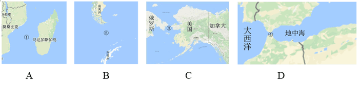

# 2017年国家公务员录用考试《行测》题（地市级）

> 常识判断 · 20 题 · 国考 2017

## 第 1 题　qid 2028256 · 法律常识

根据我国《宪法》，下列表述错误的是：

- **A**. 我国形成了人民代表大会制度、中国共产党领导的多党合作和政治协商制度以及基层群众自治制度等民主形式
- **B**. 为追查刑事犯罪，公安机关、检察机关、审判机关可依法对公民的通信进行检查　✅
- **C**. 我国在普通地方、民族自治地方和特别行政区建立了相应的地方制度
- **D**. 一切组织和个人都负有实施宪法和保证宪法实施的职责

**答案**：B

**官方解析**

B项符合题意：我国《宪法》第四十条规定：“中华人民共和国公民的通信自由和通信秘密受法律的保护。除因国家安全或者追查刑事犯罪的需要，由公安机关或者检察机关依照法律规定的程序对通信进行检查外，任何组织或者个人不得以任何理由侵犯公民的通信自由和通信秘密。”由此可知，审判机关无权对公民的通信进行检查，当选。
A、C、D项说法均符合我国现行《宪法》的规定，排除。
本题为选非题，故正确答案为B。

---

## 第 2 题　qid 2028260 · 人文常识

关于中国外交，下列说法错误的是：

- **A**. 二十世纪八九十年代，邓小平提出“韬光养晦、有所作为”的外交战略
- **B**. “另起炉灶”是毛泽东在新中国成立前夕提出的外交方针
- **C**. 周恩来和陈毅都曾担任过外交部长
- **D**. 委内瑞拉是第一个同新中国建交的拉丁美洲国家　✅

**答案**：D

**官方解析**

本题考查毛中特。
D项错误：第一个和新中国建交的拉丁美洲国家是古巴，两国于1960年建立外交关系；中国与委内瑞拉建立外交关系是在1974年，当选；
A项正确：“韬光养晦、有所作为”是邓小平在20世纪八十年代末九十年代初面对国际国内局势急剧变化时提出的外交战略方针，排除；
B项正确：“另起炉灶”是毛泽东在中共七届二中全会前后提出的三大外交政策之一，七届二中全会于1949年3月召开，正处新中国成立前夕，排除；
C项正确：在中华人民共和国成立后，周恩来于1949年-1958年担任第一任外交部长，陈毅于1958年-1972年担任第二任外交部长，排除。
本题为选非题，故正确答案为D。

---

## 第 3 题　qid 2028532 · 法律常识

下列情形属于我国行政复议受案范围的是：

- **A**. 甲市公安局处理治安案件出具的调解书
- **B**. 乙市人民政府对于确认矿藏所有权的决定　✅
- **C**. 丙市工商局对其工作人员作出的警告处分决定
- **D**. 丁市人民政府颁布的地方政府规章《丁市城市市容管理规定》

**答案**：B

**官方解析**

B项正确：根据《行政复议法》第十一条规定：“有下列情形之一的，公民、法人或者其他组织可以依照本法申请行政复议：······（四）对行政机关作出的确认自然资源的所有权或者使用权的决定不服；······”因此，乙市人民政府对于确认矿藏所有权的决定属于我国行政复议受案范围，当选；
A项错误：《行政复议法》第十二条第四项规定：“下列事项不属于行政复议范围：（四）行政机关对民事纠纷作出的调解。”因此，甲市公安局处理治安案件出具的调解书，不属于行政复议受案范围，排除；
C项错误：《行政复议法》第十二条第三项规定：“下列事项不属于行政复议范围：（三）行政机关对行政机关工作人员的奖惩、任免等决定；”因此，丙市工商局对其工作人员作出的警告处分决定，不属于行政复议受案范围，排除；
D项错误：根据《行政复议法》第十二条第二项的规定：“下列事项不属于行政复议范围：（二）行政法规、规章或者行政机关制定、发布的具有普遍约束力的决定、命令等规范性文件；”不属于行政复议受案范围，排除。
故正确答案为B。

---

## 第 4 题　qid 2028258 · 法律常识

依据《刑法修正案（九）》的规定，下列说法错误的是：

- **A**. 对伪造货币罪不再处以死刑
- **B**. 对代替他人参加高考的行为应作出行政处罚　✅
- **C**. 组织群众在医院闹事、造成严重损失的行为是犯罪行为
- **D**. 编造虚假险情在微信中传播、严重扰乱社会秩序的行为是犯罪行为

**答案**：B

**官方解析**

B项错误：依据《刑法修正案（九）》第二十五条第一款 “在法律规定的国家考试中，组织作弊的，处三年以下有期徒刑或者拘役，并处或者单处罚金；情节严重的，处三年以上七年以下有期徒刑，并处罚金。”和第四款“代替他人或者让他人代替自己参加第一款规定的考试的，处拘役或者管制，并处或者单处罚金。”可知，代替他人参加高考的行为属于犯罪行为，应处于刑事处罚而非行政处罚，当选；
A项正确：《刑法修正案（九）》取消了包括伪造货币罪在内的9个适用死刑的罪名，对伪造货币罪不再处以死刑，排除；
C项正确：依据《刑法修正案（九）》第三十一条：“聚众扰乱社会秩序，情节严重，致使工作、生产、营业和教学、科研、医疗无法进行，造成严重损失的，对首要分子，处三年以上七年以下有期徒刑；对其他积极参加的，处三年以下有期徒刑、拘役、管制或者剥夺政治权利。”可知，组织群众在医院闹事、造成严重损失的行为属于犯罪行为，排除；
D项正确：《刑法修正案（九）》第三十二条规定：“编造虚假的险情、疫情、灾情、警情，在信息网络或者其他媒体上传播，或者明知是上述虚假信息，故意在信息网络或者其他媒体上传播，严重扰乱社会秩序的，处三年以下有期徒刑、拘役或者管制；造成严重后果的，处三年以上七年以下有期徒刑。”因此编造虚假险情在微信中传播，严重扰乱社会秩序的行为属于犯罪行为，排除。
本题为选非题，故正确答案为B。

---

## 第 5 题　qid 2028526 · 法律常识

某塑料厂职工丁某因公死亡，其近亲属可以依法从工伤保险基金领取：

- **A**. 供养亲属抚恤金　✅
- **B**. 工伤医疗补助金
- **C**. 伤残就业补助金
- **D**. 生活护理费

**答案**：A

**官方解析**

A项符合题意：我国《工伤保险条例》第三十九条规定：“职工因工死亡，其近亲属按照下列规定从工伤保险基金领取丧葬补助金、供养亲属抚恤金和一次性工亡补助金：……（二）供养亲属抚恤金按照职工本人工资的一定比例发给由因工死亡职工生前提供主要生活来源、无劳动能力的亲属。……”即职工因工死亡，使得由其提供主要生活来源、无劳动能力的亲属丧失了生活来源，基本生活难以维系，造成这种状况的直接原因就是工伤事故，因此其近亲属应当受到赔偿。B、C、D三项都属于工伤人员本人应获得的相关补助。
故正确答案为A。

---

## 第 6 题　qid 2028528 · 人文常识

如果我国现行个人所得税适用于古代，下列哪一情形不需要缴纳个人所得税？

- **A**. 苏轼发表《赤壁赋》所得的稿酬
- **B**. 包拯任开封府府尹期间所得俸禄
- **C**. 康熙年间旱灾灾民获得的救济款　✅
- **D**. 罗尚德将银两存入钱庄所得利息

**答案**：C

**官方解析**

C项符合题意：根据《中华人民共和国个人所得税法》第四条第四款的规定：下列各项个人所得，免纳个人所得税：四、福利费、抚恤金、救济金。因此本项中灾民因旱灾所得的救济款不需要缴纳个人所得税，当选；
A、B、D项不符合题意：根据《中华人民共和国个人所得税法》第二条第一款的规定：“下列各项个人所得，应当缴纳个人所得税：（一）工资、薪金所得；（二）劳务报酬所得；（三）稿酬所得；（四）特许权使用费所得；（五）经营所得；（六）利息、股息、红利所得；（七）财产租赁所得；（八）财产转让所得；（九）偶然所得。”A项中的稿酬属于第（三）项的内容，B项中的俸禄属于第（一）项的内容、D项中的利息属于第（六）项的内容，都需要缴纳个人所得税，均排除。
本题为选非题，故正确答案为C。

---

## 第 7 题　qid 2028530 · 法律常识

下列说法不符合我国《慈善法》规定的是：

- **A**. 慈善组织的设立应当向工商行政管理部门申请登记　✅
- **B**. 慈善组织为实现财产保值、增值，通常可以进行投资
- **C**. 慈善组织可以委托有服务专长的其他组织提供慈善服务
- **D**. 慈善组织可以采取基金会、社会团体、社会服务机构等组织形式

**答案**：A

**官方解析**

A项错误：我国《慈善法》第二章第十条第一款规定：“设立慈善组织，应当向县级以上人民政府民政部门申请登记，民政部门应当自受理申请之日起三十日内作出决定。符合本法规定条件的，准予登记并向社会公告；不符合本法规定条件的，不予登记并书面说明理由。”因此慈善组织的设立不用向工商行政管理部门申请登记，当选；
B项正确：我国《慈善法》第五十四条规定：“慈善组织为实现财产保值、增值进行投资的，应当遵循合法、安全、有效的原则，投资取得的收益应当全部用于慈善目的······”
C项正确：我国《慈善法》第六十一条第二款规定：“慈善组织开展慈善服务，可以自己提供或者招募志愿者提供，也可以委托有服务专长的其他组织提供。”
D项正确：我国《慈善法》第八条第二款规定：“慈善组织可以采取基金会、社会团体、社会服务机构等组织形式。”
本题为选非题，故正确答案为A。

---

## 第 8 题　qid 2028262 · 人文常识

在银行的资产负债表中，客户存款属于：

- **A**. 资产
- **B**. 权益
- **C**. 资金
- **D**. 负债　✅

**答案**：D

**官方解析**

D项正确：银行的资产负债表是综合反映其资产负债科目及数量的会计报表，主要包括资产项目和负债项目。资产主要包括现金资产、贷款证券投资、固定资产等，负债主要由存款和其他负债构成，存款包括短期存款和长期存款等；其他负债指存款之外的其他借入款，如向中央银行借款。因此，客户存款在银行的资产负债表中属于负债，D项当选。
故正确答案为D。

---

## 第 9 题　qid 2028266 · 人文常识

关于我国著名园林，下列说法正确的是：

- **A**. 《枫桥夜泊》涉及的城市是留园所在地　✅
- **B**. 十二兽首曾是颐和园的镇园之宝
- **C**. 承德避暑山庄始建于明代崇祯年间
- **D**. 苏州拙政园整体呈现均衡对称的格局

**答案**：A

**官方解析**

A项正确，《枫桥夜泊》是唐朝诗人张继在安史之乱后，途经苏州寒山寺时有感而发抒写的一首羁旅诗，“枫桥”位于今苏州市阊门外；留园是我国大型古典私家园林，位于苏州阊门外留园路。该选项说法正确，当选；
B项错误，十二生肖兽首原位于圆明园海晏堂外的喷泉处，是清乾隆年间的红铜铸像，与颐和园无关，排除；
C项错误，承德避暑山庄始建清代康熙四十二年（1703年），排除；
D项错误，苏州拙政园是苏州现存最大的古典园林，全园以水为中心，分为东、中、西三部分，没有明显的中轴线，大都是因地制宜，错落有致，疏朗开阔，近乎自然，整体没有呈现均衡对称的格局，排除。
故正确答案为A。

---

## 第 10 题　qid 2028292 · 人文常识

我国古代用“金”“石”“丝”“竹”指代不同材质、类别的乐器。下列诗词涉及“竹”的是：

- **A**. 珠帘夕殿闻钟磬，白日秋天忆鼓鼙
- **B**. 主人有酒欢今夕，请奏鸣琴广陵客
- **C**. 深秋帘幕千家雨，落日楼台一笛风　✅
- **D**. 哀筝一弄湘江曲，声声写尽湘波绿

**答案**：C

**官方解析**

本题考查人文历史。
我国古代按照乐器的材质将其分为“金、石、丝、竹、匏、土、革、木”八音。
A项错误，诗句中提到的“磬”是古代的一种石制打击乐器，属于八音之“石”，“鼓”是用皮革制成的，属于八音之“革”。
B项错误，诗句中提到的“琴”是指古琴，即汉族的一种传统弦类乐器，属于八音之“丝”。
C项正确，“竹”是指竹制吹奏乐器，主要包括萧、笛等，诗句中提到的“笛”即属于竹制乐器。
D项错误，诗句中提到的“筝”是指古筝，即中国古老的拨弦类乐器，属于八音之“丝”。
故正确答案为C。

---

## 第 11 题　qid 2028294 · 人文常识

柏拉图认为处于变化之中的事物不是真正的存在，持这种理念的人会认为以下哪项最真实？

- **A**. 一棵树
- **B**. 勾股定理　✅
- **C**. 人的照片
- **D**. 关于马的概念

**答案**：B

**官方解析**

B项正确：勾股定理是一个基本的几何定理，是人类早期发现并证明的重要数学定理之一。这条定理是既定的、不变的，按照题干中柏拉图的观点，勾股定理是真正存在的，当选；
A项错误：一棵树从生根到发芽再到枝繁叶茂，是处在不断生长、不断变化的状态之中的，排除；
C项错误：人的照片虽然定格了人一瞬间的样子，但照片会随着时间变得陈旧褪色，即不断发生变化，排除；
D项错误：语言文字会随着社会发展而不断发生变化，关于“马”的概念也是这样，随着人们对事物的认识不断更新，“马”的概念也在不断变化，排除。
故正确答案为B。
本题为争议题，争议答案为D项。根据柏拉图本人的观点，马的概念是永恒不变的。但本题问的是持柏拉图的理念的一类人的看法，本题中，柏拉图认为处于变化之中的事物不是真正的存在，也就是说，真正的存在是静止不变的。四个选项中，只有B项更符合上述题干给出的论断，故粉笔题库倾向于答案为B。

---

## 第 12 题　qid 2028306 · 人文常识

与              共同构成中国诗歌传统源头的《楚辞》，主要作者是因谗去国、被流放到蛮荒之地的屈原，他用“                      ”这一著名诗句，表现了岁月蹉跎、时不我待的恐惧。
文中画横线部分应依次填入：

- **A**. 《庄子》长太息以掩涕兮，哀民生之多艰
- **B**. 《庄子》日月忽其不淹兮，春与秋其代序
- **C**. 《诗经》惟草木之零落兮，恐美人之迟暮　✅
- **D**. 《诗经》路漫漫其修远兮，吾将上下而求索

**答案**：C

**官方解析**

C项符合题意：《诗经》是中国古代诗歌开端，是中国最早的一部诗歌总集，收集了西周初年至春秋中叶的300多首诗歌；楚辞是屈原创作的一种新诗体，同时《楚辞》是中国文学史上第一部浪漫主义诗歌总集，包括《离骚》《九歌》《天问》等。《诗经》和《楚辞》共同构成了中国诗歌的源头。《离骚》中的名句“惟草木之零落兮，恐美人之迟暮”表现了岁月蹉跎、时不我待的恐惧，当选。
A、B两项中的《庄子》不符合题意，D项中的“路漫漫其修远兮，吾将上下而求索”表达的是诗人面对困难积极进取的心态，均排除。
故正确答案为C。

---

## 第 13 题　qid 2028298 · 人文常识

下列艺术领域与专业术语对应有误的是：

- **A**. 摄影：噪点、景深
- **B**. 绘画：散点透视、写意
- **C**. 音乐：调式、声部
- **D**. 舞蹈：变位跳、变奏　✅

**答案**：D

**官方解析**

D项错误：“变位跳”是舞蹈领域的专业术语，芭蕾舞、现代舞等舞蹈中均有变位跳。而“变奏”是音乐领域的专业术语，是指在原旋律的基础上加上一些修饰或者围绕原旋律进行一些变形，使乐曲具有更丰富的表现形式，当选；
A项正确：“噪点”主要是指相机的感光元件将光线作为接收信号并输出的过程中所产生的图像中的粗糙部分，也指图像中不该出现的外来像素，通常由电子干扰产生。“景深”是指在摄影机镜头或其他成像器前沿能够取得清晰图像的成像所测定的被摄物体前后距离范围。二者都是摄影领域的专业术语，排除；
B项正确：“散点透视”是中国画中使用较多的一种透视方法，即画家观察点不是固定在一个地方，也不受下定视域的限制，而是根据需要，移动着立足点进行观察，凡各个不同立足点上所看到的东西都可组织进自己的画面上来。“写意”是国画的一种画法，用笔不苛求工细，注重神态的表现和抒发作者的情趣。二者都是绘画领域的专业术语，排除；
C项正确：“调式”指若干高低不同的乐音，围绕某一有稳定感的中心音，按一定的音程关系组织在一起，成为一个有机的体系。四部和声的每一部叫做一个声部。器乐声部分高音、中音、次中音、低音；声乐声部分女高音、女低音、男高音、男低音。二者都是音乐领域的专业术语，排除。
本题为选非题，故正确答案为D。

---

## 第 14 题　qid 2028234 · 人文常识

掩星是一种天文现象，指一个天体在另一个天体与观测者之间通过而产生的遮蔽现象。科学家经常借助观察这一现象来判断星体是否有大气层。当行星掩过遥远恒星，如果恒星变得模糊之后才消失，那么可以认为：

- **A**. 该行星有稠密的大气层　✅
- **B**. 该恒星有稠密的大气层
- **C**. 该行星无大气层或大气层稀薄
- **D**. 该恒星无大气层或大气层稀薄

**答案**：A

**官方解析**

A项正确：被遮蔽恒星变模糊之后才消失，是由于遮掩行星存在有稠密的大气层。在掩星过程中先是由这层大气层对恒星进行遮掩，由于大气层可以透光，但会对光线进行散射和反射，因此在观测者看来恒星变得暗淡模糊。而当行星完全遮掩恒星后，恒星的光线无法透过行星本体，因此观测者看到恒星消失，当选；
C项错误：若行星无大气层或大气层稀薄，在掩星过程中，将不存在恒星变得模糊的过程，排除；
B、D项错误：恒星本身具有大气层，若其自身的大气层会导致模糊，则不会仅在掩星现象中模糊。因此掩星现象的发生与被掩蔽恒星是否有大气层无关，排除。
故正确答案为A。

---

## 第 15 题　qid 2028246 · 人文常识

下列矿物与其用途对应错误的是：

- **A**. 燧石—取火
- **B**. 石灰岩—生产水泥
- **C**. 石棉—促进燃烧　✅
- **D**. 石英—制作半导体

**答案**：C

**官方解析**

C项错误：石棉指具有高抗张强度、高挠性、耐化学和热侵蚀、电绝缘和具有可纺性的硅酸盐类矿物产品。石棉是重要的防火、绝缘和保温材料。因此石棉不仅不会促进燃烧，反而会遏制燃烧，当选；
A项正确：燧石俗称“火石”，是常见的硅质岩石。燧石和铁器击打会产生火花，因此在古代常被用作取火工具，排除；
B项正确：石灰岩简称灰岩，是以方解石为主要成分的碳酸盐岩。石灰岩是生产水泥的主要材料，排除；
D项正确：石英主要成分为二氧化硅，是制造半导体单晶硅的原料，因此石英可以用于制作半导体，排除。
本题为选非题，故正确答案为C。

---

## 第 16 题　qid 2028240 · 地理国情

关于图中所标示的海峡，下列说法错误的是：

- **A**. ①是世界上最繁忙的石油运输航道　✅
- **B**. ②是世界上最宽的海峡
- **C**. ③的海峡中心线是国际日期变更线的一部分
- **D**. ④的附近地区夏季炎热干燥，冬季温和多雨

**答案**：A

**官方解析**

A项错误：①是位于非洲大陆与马达加斯加岛之间的莫桑比克海峡，是世界上最长的海峡。世界主要石油输出国集中于中东，如伊朗、沙特阿拉伯、阿联酋等，而石油的主要输入国则主要是工业和经济相对发达的国家，如美国、西欧、日本、中国；途经莫桑比克海峡的航道不符合两者的任一特征。世界上最繁忙的石油运输航道应该是中东地区连接波斯湾和阿曼湾的霍尔木兹海峡，该项当选；
B项正确：②是位于南美洲南端与南极洲之间的德雷克海峡，是世界上最宽的海峡，排除；
C项正确：③是位于亚欧大陆与美洲大陆之间的白令海峡。国际日期变更线是国际经度会议为了避免日期上的混乱规定的一条用于区分地球“昨天”与“今天”的分界线。国际日期变更线通过白令海峡的中心线。该项排除；
D项正确：④是沟通地中海与大西洋的直布罗陀海峡，直布罗陀海峡和附近地区属地中海气候，夏季炎热干燥，冬季温和多雨，排除。
本题为选非题，故正确答案为A。

---

## 第 17 题　qid 2028230 · 科技常识

下列关于航天器的说法正确的是：

- **A**. “风云”系列气象卫星通过光纤实现与地面的数据传输
- **B**. “玉兔”号月球车在月球上行走的动力驱动是电动车　✅
- **C**. “长征一号”属于二级运载火箭
- **D**. “北斗二号”属于通信广播卫星

**答案**：B

**官方解析**

B项正确：由于月球表面没有空气，常规动力（风力、内燃机动力等）不具备供给条件，而月球光照充足，太阳能电池功能是目前的最优解决方案，所以在月球上可以用太阳能电池提供电能，因此“玉兔”号月球车在月球上行走的动力驱动是电动车，当选；
A项错误：“风云”系列气象卫星的数据传输是通过几个不同的波段实时数据传输信号的方式进行传输。题干中的光纤是有线的，不可能从卫星上连接到地球，排除；
C项错误：“长征一号”是为发射我国第一颗人造地球卫星东方红一号而研制的三级运载火箭，排除；
D项错误，“北斗二号”卫星导航系统是中国独立开发的全球卫星导航系统，并不是通信卫星，排除。
故正确答案为B。

---

## 第 18 题　qid 2028236 · 人文常识

氢气是重要的工业燃料，下列关于氢气的说法正确的是：

- **A**. 氢气在氧气中燃烧发出明亮的红色火焰
- **B**. 电解水生成氢气的过程是一个吸热过程　✅
- **C**. 人工降雨过程中通常使用氢气作催化剂
- **D**. 氢气在自然界中含量很少，故为稀有气体

**答案**：B

**官方解析**

B项正确：水被直流电电解生成氢气和氧气的过程被称为电解水。电解水生成氢气的过程是吸热的，但在实验过程中，水温会升高，其原因在于水充当了导体，电流做功发热。当选；
A项错误：氢气在氧气中燃烧产生淡蓝色火焰，排除；
C项错误：人工降雨过程中使用的催化剂通常分为三类，第一类是可以大量产生凝结核或凝华核的碘化银等成核剂；第二类是可以使云中的水分形成大量冰晶的干冰等制冷剂；第三类是可以吸附云中水分变成较大水滴的盐粒等吸湿剂。氢气并不用作人工降雨的催化剂，排除；
D项错误：稀有气体不是指自然界中含量很少的气体，而是指元素周期表上的0族元素。在常温常压下，它们是无色无味的单原子气体，很难进行化学反应。天然存在的稀有气体有六种，即氦（He）、氖（Ne）、氩（Ar）、氪（Kr）、氙（Xe）和具放射性的氡（Rn）。氢气不属于稀有气体，排除。
故正确答案为B。

---

## 第 19 题　qid 2028232 · 人文常识

关于垃圾分类处理，下列说法错误的是：

- **A**. 速冻饺子的包装袋属于厨余垃圾　✅
- **B**. 塑料制品不可采用深度填埋的处理方法
- **C**. 果皮等食品类废物可进行堆肥处理
- **D**. 红色的收集容器用于收集有害垃圾

**答案**：A

**官方解析**

A项说法错误：厨余垃圾是指居民日常生活及食品加工、饮食服务、单位供餐等活动中产生的垃圾，包括丢弃不用的菜叶、剩菜、剩饭、果皮、蛋壳、茶渣、骨头等，其主要来源为家庭厨房、餐厅、饭店、食堂、市场及其他与食品加工有关的行业。一次性餐具、食品包装袋都归类为“其他垃圾”。因此速冻水饺的包装袋不属于厨余垃圾。
B项说法正确：塑料制品自然分解速度缓慢，会占用大量土地资源，造成土地资源的浪费。
C项说法正确：堆肥指利用自然界广泛存在的微生物，有控制地促进固体废物中可降解有机物转化为稳定的腐殖质的生物化学过程。果皮等食品类废物中有机物含量较高，可以进行堆肥处理。
D项说法正确：垃圾箱颜色包括四种，其中红色代表有害垃圾；绿色代表厨余垃圾；蓝色代表可回收再利用垃圾；灰色代表除了有害物质与可回收物质以外的垃圾。
本题为选非题，故正确答案为A。

---

## 第 20 题　qid 2028244 · 人文常识

关于农业生产中使用的草木灰，下列说法错误的是：

- **A**. 在种有大白菜的地里撒上草木灰可防病虫害
- **B**. 花卉移栽时，可以用草木灰做底料增加养分
- **C**. 育苗时，草木灰和氮肥同时施用效果更好　✅
- **D**. 往鱼塘撒草木灰能够降低鱼类的发病率

**答案**：C

**官方解析**

A项正确，草木灰是一种碱性肥料，富含钾，并含有大量的磷、钙、镁、硫及各种微量元素，不仅是一种很好的农家肥料，而且是一种治病虫的良药。施用草木灰，可防止锈病、白粉病等病虫害的发生，排除。 

B项正确，草木灰在花卉上一般使用撒、埋、叶面施肥或溶水进行浇施，可以促进花卉生长，排除。

C项错误，草木灰是植物（草本和木本植物）燃烧后的残余物，呈碱性，含有植物所需的大部分矿质元素，主要成分是碳酸钾（），是很好的钾肥补充剂。但草木灰中的碳酸钾和氮肥会发生化学反应形成氨气，造成氮损失，因此不能混合使用，当选。

D项正确，鱼类正常生长所需水体环境为PH值为7.5~8.5的碱性环境。草木灰呈碱性，可以调节鱼塘酸碱度。另一方面，草木灰具有杀菌作用，能有效杀灭鱼体上的各种病原体，常施草木灰既可对鱼塘水体进行消毒，又能净化水质，排除。　

本题为选非题，故正确答案为C。

---
