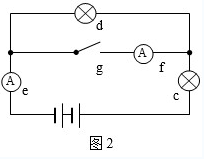
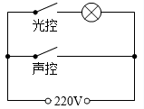
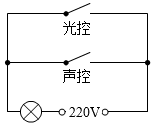
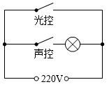
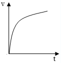
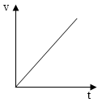
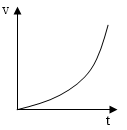
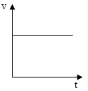
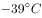

# 2017年广东省公务员录用考试《行测》题（县级、乡镇统一卷）

> 常识判断 · 24 题 · 广东 2017

## 第 1 题　qid 2047890 · 科技常识

在下面的电路图中，c、d是两个不同的灯泡，e、f均为安培表。当开关g闭合时（如图1），e显示读数为1.3A，f显示读数为0.9A。如果将断开的开关g与灯泡c的位置互换（如图2），则以下情况不会出现的是：

- **A**. f的读数变为0A
- **B**. e的读数变小
- **C**. c比原来亮　✅
- **D**. d比c亮

**答案**：C

**官方解析**

由图1电路到图2电路分析可知，g开关处断路，f的读数为0A，两灯泡由并联到串联，总电路电阻增大，则e的读数减小。
c灯泡在图1的分压为电源电压，而在图2中，分压小于电源电压，则比原来暗。
图1中，总电流为1.3A，f电流为0.9A，则d灯泡的电流为0.4A，并联电路的电压相同，所以d灯泡电阻大于c灯泡电阻，则在串联之后，d分压大于c分压，所以d比c亮，即A、B、D项正确，C项错误。
本题为选非题，故正确答案为C。

---

## 第 2 题　qid 2047892 · 科技常识

下列关于蔬菜大棚内氧气和二氧化碳含量变化的说法，不正确的是：

- **A**. 在无光的环境下，植物只进行呼吸作用，二氧化碳含量增加
- **B**. 在有光的环境下，植物同时进行光合作用和呼吸作用，氧气含量增加
- **C**. 光线逐渐增强时，植物的光合作用逐渐增强，氧气含量增加
- **D**. 光线逐渐减弱时，植物的光合作用和呼吸作用也逐渐减弱，氧气含量降低　✅

**答案**：D

**官方解析**

问题分析：一般情况下，随着光照强度的增加，光合作用逐渐加强；随着光照强度的减弱，光合作用逐渐减弱；光照强度与呼吸作用强弱没有直接关系。
选项分析：
A项：在无光的环境下，植物只进行呼吸作用，消耗氧气生成二氧化碳，故二氧化碳含量增加，故A项正确。
B项：在有光的环境下，植物同时进行光合作用和呼吸作用，光合作用消耗二氧化碳储存有机物并产生氧气，呼吸作用消耗氧气生成二氧化碳，但是光合作用产生氧气的速率大于呼吸作用消耗氧气的速率，所以氧气含量增加，故B项正确。
C项：光线逐渐增强时，植物的光合作用逐渐增强，光合作用产生氧气的速率大于呼吸作用消耗氧气的速率，所以氧气含量增加，故C项正确。
D项：光线逐渐减弱时，植物的光合作用逐渐减弱，呼吸作用不随光照强度而改变，所以氧气含量降低，故D项错误。
本题为选非题，故正确答案为D。
备注：此题其实是不太严谨的，例如B项，如果光照很弱，则光合可能比呼吸弱，氧气含量会下降，此处只能结合大棚种植的实际情况，将B项理解为“正常光照条件下，蔬菜正常生长”，才能判定光合强于呼吸；又如C项，光线增强到一定程度，由于二氧化碳浓度等限制因素，光合作用就不再随之增强（称为光饱和点)，此处也只能理解为“光照强度未达到饱和”，才能判定C项正确。尽管此处B项和C项都有一定的问题，但是D项错误更加明显，在考场上考生面对这样的真题，进行对比择优即可。

---

## 第 3 题　qid 2047894 · 科技常识

小王用塑料圆筒做了一个简易哨子（如图），当他从吹气口吹气的同时，将活塞慢慢往下拉，可以听到哨声：

- **A**. 逐渐变小声
- **B**. 音调越来越高
- **C**. 音调越来越低　✅
- **D**. 没有变化

**答案**：C

**官方解析**

当向下推动活塞时，空气柱的长度变长，因此空气柱的振动变慢，音调越来越低，故C项正确。
故正确答案为C。

---

## 第 4 题　qid 2047896 · 科技常识

两块完全相同的平面玻璃砖相互垂直放置（如图），一束单色光从左侧水平射入左边的玻璃砖，从右边的玻璃砖射出，则出射光线相对入射光线：

- **A**. 向上偏折
- **B**. 向下偏折
- **C**. 在同一条直线上　✅
- **D**. 平行

**答案**：C

**官方解析**

光路图如下所示：

光线通过第一块玻璃砖再进入空气时发生两次折射：第一次是从空气斜射进入玻璃砖，折射光线应该靠近法线偏折，折射角小于入射角；第二次是从玻璃砖斜射进入空气，折射光线应该远离法线偏折，折射角大于入射角。由于玻璃砖上下表面平行，第二次折射的入射角等于第一次折射的折射角，所以第二次折射的折射角等于第一次折射的入射角，出射光线与入射光线相比，只是作了平移，即出射光线与入射光线平行。

同理，经过第二块玻璃砖时，第四次的折射光线，与第三次的入射光线即第二次的折射光线平行；第二次的折射光线与第与第一次的入射光线平行，因为两块完全相同的玻璃砖，折射率相同，因此经过两块玻璃砖折射后，出射光线与入射光线在同一直线上，故C项正确。

故正确答案为C。

---

## 第 5 题　qid 2047898 · 科技常识

有一家四口，包括一对夫妻和他们的两个亲生子女，四人的ABO血型各不相同。已知儿子有一次受伤时，是爸爸献的血，那么，以下信息可以确定的是：

- **A**. 爸爸的血可以献给家里所有人使用
- **B**. 妈妈的血不能献给家里所有人使用　✅
- **C**. 女儿有可能是AB型血
- **D**. 儿子只可能是A型或B型血

**答案**：B

**官方解析**

AB血型的人可以接受任何血型，O型血可以输给任何血型的人。一家四口，血型各不相同，则可知父母血型为A、B型或者AB、O型。已知儿子可以接受爸爸的血型，若父母为A或B型，则儿子为AB型，女儿为O型，则父母的血不能献给家里所有人使用；若父母为O、AB型，则子女为A或B型，爸爸是O型血，可以献给家里所有人使用，妈妈的血不能献给家里所有人使用。综上所述，B项正确。
故正确答案为B。

---

## 第 6 题　qid 2047840 · 科技常识

为节约用电，有生产商为楼道照明开发出“光控开关”和“声控开关”。“光控开关”在天黑时自动闭合，天亮时自动断开；“声控开关”在有人走动发出声音时自动闭合，无人走动时自动断开。若将这两种开关配合使用，就可以使楼道照明变得更加节能。为达到这个目的，楼道照明的电路安装简图是：

- **A**. 

- **B**. 

- **C**. 

　✅
- **D**. 

**答案**：C

**官方解析**

根据题目可知，为达到节能的目的，只有当天黑且有人走动发出声音时才提供楼道照明，则可知当光控开关断开时，无论声控开关处于什么状态，电路都应处于断开的状态，即光控和声控开关是串联的关系，故C项正确。
故正确答案为C。

---

## 第 7 题　qid 2047852 · 科技常识

下图是某地市区与郊区之间的热力环流图。根据该图，为保证市区空气质量，下列说法正确的是：

- **A**. 化工厂可以建设在郊区
- **B**. 绿化带应该建设在郊区外
- **C**. 绿化带可以建设在市区内　✅
- **D**. 化工厂应该建设在郊区与市区之间

**答案**：C

**官方解析**

由图中市区和郊区的热力环流图可知，无论化工厂建在郊区、市区或郊区与市区之间，污染物都会通过热力环流到达市区；而绿化带可以选择建在市区内，可以阻断污染物通过热力环流在郊区和市区之间扩散，还可以减少温室效应，故C项正确。
故正确答案为C。

---

## 第 8 题　qid 2047854 · 科技常识

如图所示，两物体M、N用绳子连接，绳子跨过固定在斜面顶端的滑轮（不计滑轮的质量和摩擦力），N悬于空中，M放在斜面上，均处于静止状态。当用水平向右的拉力F作用于物体M时，M、N仍静止不动，则下列说法正确的是：

- **A**. 绳子的拉力始终不变　✅
- **B**. M受到的摩擦力方向沿斜面向上
- **C**. 物体M所受到的合外力变大
- **D**. 物体M总共受到4个力的作用

**答案**：A

**官方解析**

对N进行受力分析可知，N受到重力和绳子拉力的作用处于平衡状态，即绳子的拉力等于N的重力；对M进行受力分析可知，M一开始受到重力、拉力、支持力，可能有斜面方向的摩擦力，加上拉力F之后，M一定受到绳子的拉力、重力、拉力F这三个力的作用，仅受这三个力的作用有可能保持平衡状态，否则还可能受到沿斜面的摩擦力或斜面支持力的作用。
选项分析：
A项：绳子的拉力等于N的重力，一直保持不变，正确。
B项：M可能不受摩擦力的作用，错误。
C项：M静止不动，所受的合外力一直为零，错误。
D项：M可能只受到三个力的作用，错误。
故正确答案为A。

---

## 第 9 题　qid 2047856 · 科技常识

下图是某辆汽车的位移x随着时间t变化而变化的图像，下列说法中正确的是：

- **A**. 在a到b的时间段内，汽车的加速度不断增大
- **B**. 在b到c的时间段内，汽车做匀速运动
- **C**. 在c到d的时间段内，汽车的速度保持不变
- **D**. 在d时间点，汽车回到出发地　✅

**答案**：D

**官方解析**

A项：在a到b时间段内，汽车的位移时间图像为倾斜的直线，即汽车为匀速直线运动，加速度为零，错误。

B项：在b到c时间段内，汽车的位移为零，汽车可能静止，错误。
C项：题中未说明直线运动，如果物体做曲线运动，速度的方向就会发生变化，而速度为矢量，在方向变化的情况下，即使大小不变，也不能说速度保持不变，错误。
D项：在d点时位移为0，因此汽车回到出发地，正确。
故正确答案为D。
备注：本题客观来讲很不严谨，C、D两项其实都是正确的，位移-时间图像中，斜率的正、负分别表示速度方向为正方向、负方向（例如，若规定向右为正方向，则速度为正表示速度向右、速度为负表示速度向左），因此，严格来说，位移-时间图像中速度只有正、负两个方向可选，只能表示直线运动。
但是公务员考试行测为单选题，从出题人的设计意图来看，很可能是将C选项设计为了干扰项，认为物体如果做曲线运动，则速度的方向会改变，这样来看C选项就是错误的，因此两个答案相比，粉笔更倾向于D项为正确答案。

---

## 第 10 题　qid 2047858 · 科技常识

下列能正确反映自由落体速度随时间变化的图像是：

- **A**. 

- **B**. 

　✅
- **C**. 

- **D**. 

**答案**：B

**官方解析**

自由落体运动是初速度为零，加速度为g的匀加速直线运动，即其速度随时间变化图像是过原点的直线，故B项正确。
故正确答案为B。

---

## 第 11 题　qid 2047680 · 地理国情

“海上丝绸之路”是古代中国与外国交通贸易和文化交往的海上通道，包括东海航线和南海航线。以下城市不属于“海上丝绸之路”航线中主要港口的是：

- **A**. 广州
- **B**. 泉州
- **C**. 宁波
- **D**. 厦门　✅

**答案**：D

**官方解析**

D项符合题意：中国境内海上丝绸之路主要有广州、泉州、宁波三个主港和其他支线港组成。《汉书·地理志》中记载，秦汉时期，广州已成为海上丝绸之路的主港；唐宋时期，广州成为中国第一大港，明初、清初海禁，广州长时间处于“一口通商”局面，是世界海上交通史上唯一的2000多年长盛不衰的大港。宋末至元代时，泉州成为中国第一大港，与埃及的亚历山大港并称为“世界第一大港”，后因明清海禁而衰落，泉州是唯一被联合国教科文组织承认的海上丝绸之路起点。在东汉初年，宁波地区已与日本有交往，到了唐朝，宁波成为中国的大港之一，两宋时，靠北的外贸港先后为辽、金所占，或受战事影响，外贸大量转移到宁波。其中，广州和泉州属于南海航线，宁波属于东海航线。
本题为选非题，故正确答案为D。

---

## 第 12 题　qid 2047686 · 科技常识

角蛋白是一种控制细胞形状和稳定性的蛋白。以下对角蛋白认识错误的是：

- **A**. 人的头发、指甲主要是由角蛋白构成的
- **B**. 角蛋白是爬行动物鳞片、羽毛、爪子的主要成分
- **C**. 在人的皮肤中，角蛋白主要分布在真皮层　✅
- **D**. 角蛋白来源于外胚层分化而来的细胞，是一种硬蛋白

**答案**：C

**官方解析**

C项错误：角蛋白是硬蛋白之一，是一类具有结缔和保护功能的纤维状蛋白质，来源于外胚层分化而来的细胞。它是外胚层细胞的结构蛋白，包括毛发、指甲、羽毛等，它还是一种不能直接为畜禽所吸收利用的硬蛋白，主要存在于动物的鳞片、毛发、羽毛和蹄中。在人体的皮肤中，角蛋白主要分布在表皮层。A、B、D三项均正确。
本题为选非题，故正确答案为C。
备注：B项表述不严谨：羽毛应当为鸟类标志。

---

## 第 13 题　qid 2047688 · 科技常识

从卫星在外太空拍摄的地球照片来看，地球是一个蓝色的星球，这是因为：

- **A**. 地球上大部分地区都被水覆盖着　✅
- **B**. 天空是蓝色的，而蓝天包围着大地
- **C**. 大气分子、冰晶、水滴等和阳光的共同作用
- **D**. 太阳光穿过地球大气层产生折射

**答案**：A

**官方解析**

A项正确：因为地球大部分面积都被海水覆盖，又因为海水是蓝色的，在水深超过100米的海洋里，波长较长的光大部分都被海水吸收了，而波长较短的蓝光和紫光遇到较纯净的海水分子时就会发生强烈的散射和反射，于是人们所见到的海洋就呈现一片蔚蓝色或深蓝色。所以从在外太空拍摄的地球照片，地球是一个蓝色的星球。
故正确答案为A。

---

## 第 14 题　qid 2047696 · 地理国情

我国海洋综合科考船“海洋六号”从珠江口进入南海海域，执行大洋南极科考任务。下列关于科考船从珠江口进入南海，所受浮力情况说法正确的是：

- **A**. 由于船始终浮在水面上，所以受到的浮力不变　✅
- **B**. 由于海水的密度更大，所以船在海洋里受到的浮力更大
- **C**. 由于船排开海水的体积更小，所以在海洋里受到的浮力更小
- **D**. 由于船排开江水的体积更大，所以在江水里受到的浮力更大

**答案**：A

**官方解析**

本题考查浮力相关知识。浸在液体里的物体会受到液体竖直向上托的力，这就是浮力。物体受到的浮力等于物体下沉时排开液体的重力。当浮力等于物体自身的重力，且物体的平均密度小于液体的密度时，物体就可以漂浮在液体之上。
A项正确：科考船不论是在江水中还是在海水中，都为漂浮状态，此时浮力始终等于重力，所以船受到的浮力是不变的。
B项错误：船在漂浮状态下的浮力等于重力，与水的密度无关。
C项错误：船从江水到海水中，受到的浮力始终等于重力，不会因为排开海水的体积变小而变小。
D项错误：江水中的船所受到的浮力仍等于重力，不会因为排开江水的体积变化而变化。
故正确答案为A。

---

## 第 15 题　qid 2047674 · 人文常识

以下对人的各种感觉描述不正确的是：

- **A**. 触觉感受器大部分存在于皮肤中，指尖尤其敏感
- **B**. 人看到物体时，视网膜上会形成一幅上下颠倒的影像
- **C**. 耳朵可以帮助人体保持平衡
- **D**. 嗅觉和味觉是一起工作的，感知食物味道更多依赖味觉　✅

**答案**：D

**官方解析**

D项错误：我们的舌头其实只能分辨基础的味觉感知，如酸、甜、苦、咸这些。而对于味道的整体感知更多是依靠嗅觉系统完成的。所以人在感冒鼻塞时，往往尝不出食物的味道。
A项正确：触觉感受器是接受接触刺激，传导触觉和压觉的感受器，大量存在于皮肤当中。皮肤表面散布着触点，尤其指腹处最多，所以指尖的触觉最为敏感。
B项正确：人眼的结构相当于一个凸透镜，外界物体在视网膜上所成的像是倒立缩小的实像。因此，人看到物体时，视网膜上形成的影像实际是上下颠倒的。
C项正确：人体维持平衡主要依靠内耳的前庭部、视觉、肌肉和关节等本体感觉三个系统的相互协调来完成的。其中内耳的前庭系统最重要。
本题为选非题，故正确答案为D。

---

## 第 16 题　qid 2047676 · 科技常识

地球上的矿产资源非常丰富。关于矿产，以下认识不正确的是：

- **A**. 最坚硬的矿石是金刚石，最软的矿石是石膏　✅
- **B**. 砂岩按照砂粒直径划分为微粒、细粒、中粒、粗粒和巨粒
- **C**. 煤、石油和天然气都是化石燃料，由动植物的遗体演变而成
- **D**. 大多数矿物是在熔融的岩石或炽热的熔体冷却结晶时形成的

**答案**：A

**官方解析**

A项错误：金刚石是最硬的矿石，是已知的世界上最硬的物质。滑石是世界上最软的矿石，任何一种矿物都能在滑石上划出痕迹；
B项正确：砂岩按砂粒的直径划分为：微粒砂岩（0.125～0.0625mm）、细粒砂岩（0.25～0.125mm）、中粒砂岩（0.5～0.25mm）、粗粒砂岩（1～0.5mm）、巨粒砂岩（2～1mm）；
C项正确：化石燃料也称矿石燃料，包括的天然资源为煤炭、石油和天然气等，是由死去的有机物和植物在地下分解而形成的；
D项正确：熔融的岩石或地壳下面的岩浆熔体在上升过程中温度不断降低，当温度低于某种矿物的熔点时就会形成该矿物结晶。随着温度的持续下降，岩浆中所有的成分会形成一系列的矿物，例如形成橄榄石、辉石、角闪石与云母等多种矿物。
本题为选非题，故正确答案为A。

---

## 第 17 题　qid 2047678 · 人文常识

世界上多数国家都采用以区时为单位的标准时。关于时间，以下认识不正确的是：

- **A**. 所有时区都以格林尼治本初子午线为基础
- **B**. 国际日期变更线的西边要比东边晚一天　✅
- **C**. 许多国家在夏季人为地把时钟拨快一小时，使用夏令时间
- **D**. 全球共分为24个时区，每个时区都有自己的时间

**答案**：B

**官方解析**

A项正确，为了克服时间上的混乱，1884年在华盛顿召开的一次国际经度会议上，规定将全球划分为24个时区（东、西各12个时区）。规定英国（格林尼治天文台旧址）为中时区（零时区），向东为东1~12区，向西为西1~12区。每个时区横跨经度15度，时间正好是1小时。故所有时区都以格林尼治本初子午线为基础。
B项错误，按照规定，凡越过国际日期变更线时，日期都要发生变化：从东向西越过这条界线时，日期要加一天；从西向东越过这条界线时，日期要减去一天。即国际日期变更线的西边要比东边早一天。
C项正确，夏时制，是一种为节约能源而人为规定地方时间的制度，在这一制度实行期间所采用的统一时间称为“夏令时间”。一般在天亮早的夏季人为将时间调快一小时，可以使人早起早睡，减少照明量，以充分利用光照资源，从而节约照明用电。
D项正确，“区时系统”规定，地球上每15°经度范围作为一个时区。这样，整个地球的表面就被划分为24个时区。每一时区都按它的中央子午线来计量时间，即采用它的中央子午线的地方平时，叫做标准时。
本题为选非题，故正确答案为B。

---

## 第 18 题　qid 2047682 · 科技常识

地球上生物的种类极其丰富，从表面上看，不同的生物之间似乎并没有相同之处，但其实所有的生物都具有一些共同特征。以下不属于生物共同特征的是：

- **A**. 由单细胞构成　✅
- **B**. 需要能量才能生存
- **C**. 具有生命周期
- **D**. 新陈代谢

**答案**：A

**官方解析**

A项错误：生物组成多种多样。有单细胞生物（如衣藻等部分藻类、草履虫）、多细胞生物（如裸子植物、被子植物、哺乳动物），也有无细胞生物（如病毒）。因此，“由单细胞组成”不属于生物的共同特征。
B项正确：所有的生物都需要能量来维持生命。
C项正确：生物学上的生命周期是指生物体从出生、成长、成熟、衰退到死亡的全部过程。所有的生物都具有生命周期。
D项正确：机体与机体内环境之间的物质和能量交换以及生物体内物质和能量的自我更新过程叫做新陈代谢。新陈代谢属于生物的共同特征。
本题为选非题，故正确答案为A。

---

## 第 19 题　qid 2047684 · 科技常识

水银可用于制作体温计，其主要原因不包括：

- **A**. 水银对温度变化敏感
- **B**. 水银容易获得　✅
- **C**. 水银的熔点低，沸点高
- **D**. 水银的化学性质稳定

**答案**：B

**官方解析**

给体温计选用材料时，优先考虑的是原材料的特性。对利用液体热胀冷缩的特性来制造的体温计，一般应考虑以下因素：①液体的沸点和熔点；②性能是否稳定；③液体体积对温度变化是否敏感。

B项错误：体温计的工作物质是水银，水银体温计中含有汞。 汞在自然界以硫化汞矿石的形式大量存在，即“朱砂”，制取过程相对容易。但题目中说的水银用作体温计的主要原因，强调的是水银的物理性质和化学性质，容易获得并不是主要原因，就像CPU（中央处理器）中含有黄金，黄金容易取得，但这不是CPU发挥功能的主要原因，故B项错误。

A项正确：体温计液泡里的水银，由于受到体温的影响，产生微小的变化，水银体积的膨胀，使管内水银柱的高度发生明显的变化。体温计的下部靠近液泡处的管颈是一个很狭窄的曲颈，在测体温时，液泡内的水银，受热体积膨胀，由曲颈部分上升到管内某位置。当与体温达到热平衡时，水银柱恒定。当体温计离开人体后，外界气温较低，水银遇冷体积收缩，就在狭窄的曲颈部分断开，使已升入管内的部分水银退不回来，水银柱仍保持在与人体接触时所达到的高度。微小的变化就能使水银柱的高度发生明显变化，这说明水银对温度的变化敏感。

C项正确：水银是在常温、常压下唯一以液态存在的金属。熔点，沸点，密度13.59，可见水银的熔点低、沸点高，这使得它在除了极端环境外的绝大多数环境条件下，都能正常使用。

D项正确：汞是银白色闪亮的重质液体，不溶于酸也不溶于碱，其化学性质稳定。

本题为选非题，故正确答案为B。

---

## 第 20 题　qid 2047706 · 人文常识

如果将豆腐冰冻一段时间再解冻，豆腐内部会出现非常多的小孔。这一变化的原因是：

- **A**. 豆腐内的水分聚集凝结成冰晶，体积增大，挤出了这些小孔　✅
- **B**. 豆腐在低温下组织纤维变硬，体积膨大，露出了空隙
- **C**. 温度骤然变化导致豆腐的组织纤维热胀冷缩，露出了空隙
- **D**. 豆腐中的某些成分在低温环境下释放出大量气体，挤出了这些小孔

**答案**：A

**官方解析**

A项符合题意：冷冻后的豆腐发生了物理变化。水有一种特性：在时，它的密度最大，体积最小；到以下时，水结成了冰，密度变小，体积变大，比常温时水的体积约大左右。当豆腐的温度降到以下时，里面的水分结成冰，原来的小孔便被冰撑大了，整块豆腐就被挤压成网格形状。等到冰融化成水从豆腐里跑掉以后，就留下了数不清的孔洞，使豆腐变得像泡沫塑料一样。

故正确答案为A。

---

## 第 21 题　qid 2047710 · 人文常识

人口增长模式包括原始型、传统型、现代型三种。目前，我国已基本实现了从（  ）的转变。

- **A**. 原始型向传统型
- **B**. 原始型向现代型
- **C**. 现代型向传统型
- **D**. 传统型向现代型　✅

**答案**：D

**官方解析**

D项符合题意：人口增长模式，又称人口转变模式，它反映了不同国家和地区的人口出生率、死亡率和自然增长率随社会经济条件变化而变化的规律。人口增长模式有三种类型：①原始型：高出生率，高死亡率，低自然增长率（高高低）；②传统型：高出生率，低死亡率，高自然增长率（高低高）；③现代型：低出生率，低死亡率，低自然增长率（低低低）。我国的人口模式已基本实现了从高、低、高向低、低、低的转变，即由传统型向现代型的转变。
故正确答案为D。

---

## 第 22 题　qid 2047716 · 科技常识

准备活动是指在比赛、训练和体育课正式开始前，为克服内脏器官的生理惰性，缩短进入运动状态的时间和预防运动创伤而进行的身体练习，为接下来的剧烈运动或比赛做好准备。下列不属于准备活动主要作用的是：

- **A**. 提高中枢神经系统的兴奋性
- **B**. 增加皮肤血流量以利于散热
- **C**. 提高运动时对氧气的利用率　✅
- **D**. 提高机体的代谢水平

**答案**：C

**官方解析**

C项错误：准备活动可以使肺通气量及心输出量增加，使工作肌能获得更多的氧气，而不是提高对氧气的利用率。
A项正确：准备活动可以提高中枢神经系统的兴奋性，调节不良的赛前状态，使大脑反应速度加快，参加活动的运动中枢间相互协调，可以为正式练习或比赛时生理功能迅速达到适宜程度做好准备。
B项正确：皮肤温度在调节散热中起主导作用，而皮肤温度的高低决定于皮肤血流量的大小，准备活动即为剧烈运动或赛前的热身活动，皮肤血流量增加可以使皮肤温度升高，从而利于散热。
D项正确：通过做准备活动，可使体温和肌肉温度升高，从而使酶的活性增高，使肌肉的代谢得到加强。
本题为选非题，故正确答案为C。

---

## 第 23 题　qid 2047722 · 人文常识

以下不属于导致听力下降、听力减退原因的是：

- **A**. 太多的噪音伤害了内耳中的细毛
- **B**. 经常用耳勺掏挖耳朵碰伤了耳道　✅
- **C**. 精神压力过大导致内耳供血障碍
- **D**. 戴耳机听音乐导致听觉中枢受损

**答案**：B

**官方解析**

B项错误：耳道是一条自外耳门至鼓膜的弯曲管道，碰伤耳道并不会引起听力下降、听力减退；如果洁耳过度导致破坏鼓膜，则会引起听力下降、听力减退。
A项正确：太多的噪音会导致内耳的微细血管经常处于痉挛状态，内耳供血减少，听力急剧减退。
C项正确：如果经常处于急躁，恼怒的状态中，会导致体内植物神经失去正常的调节功能，使内耳器官发生缺血，水肿或产生听觉障碍，这样容易出现听力锐减。
D项正确：听觉中枢受损容易导致中枢性耳聋。
本题为选非题，故正确答案为B。

---

## 第 24 题　qid 2047734 · 人文常识

2016年，我国推动供给侧结构性改革取得初步成效，部分行业的供求关系、政府和企业的理念行为发生积极变化。2017年是供给侧结构性改革的深化之年。下列经济行为中，不符合供给侧结构性改革精神的是：

- **A**. 推动钢铁、煤炭行业化解过剩产能
- **B**. 消化三四线城市房地产库存
- **C**. 加强减税、降费，降低各类交易成本
- **D**. 对缺乏市场竞争力的企业进行补贴　✅

**答案**：D

**官方解析**

供给侧结构性改革的根本目的是提高社会生产力水平，落实好以人民为中心的发展思想。要在适度扩大总需求的同时，去产能、去库存、去杠杆、降成本、补短板，从生产领域加强优质供给，减少无效供给，扩大有效供给，提高供给结构适应性和灵活性，提高全要素生产率，使供给体系更好适应需求结构变化。
D项错误：对缺乏市场竞争力的企业进行补贴不能从根本上提高企业的竞争力，无法增加有效供给。
A项正确：推进供给侧结构性改革的重要任务之一是积极稳妥地化解过剩产能，其目的就是将宝贵的资源要素从那些产能严重过剩的、增长空间有限的产业，如钢铁、煤炭等中释放出来，通过理顺供给端，提高有效供给，创造新的生产力。
B项正确：去库存方面，供给侧结构性改革的任务主要是解决房地产市场库存，重点是解决三、四线城市房地产库存过多问题。要坚持分类调控，因城因地施策。解决房地产市场库存，还是要提高三、四线城市的吸引力，要在提高城市教育、医疗等公共服务水平上下功夫，要在产业结构调整上下功夫，要能吸引住人，留得住人，既能就业，又很宜居，这才是真正解决房地产库存的必由之路。
C项正确：降成本方面，要在减税、降费、降低要素成本上加大工作力度。要降低各类交易成本特别是制度性交易成本，减少审批环节，降低各类中介评估费用，降低企业用能成本，降低物流成本，提高劳动力市场灵活性，推动企业眼睛向内降本增效。
本题为选非题，故正确答案为D。

---
