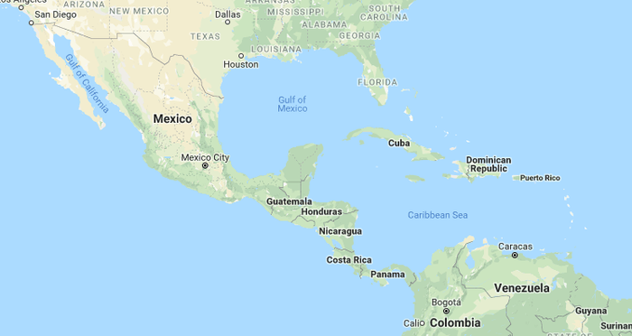

# 2017年河南省公务员录用考试《行测》题（网友回忆版）

> 常识判断 · 20 题 · 河南 2017

## 第 1 题　qid 2136544 · 人文常识

下列与鸟有关的说法中错误的是：

- **A**. 秃鹫被称为“草原清道夫”，喜食腐烂的尸体
- **B**. 蜂鸟主要分布在南美洲，是世界上最小的鸟类
- **C**. 鸵鸟肌肉发达，后肢粗壮有力，可以飞行　✅
- **D**. 金丝燕嘴里分泌的唾液就是燕窝

**答案**：C

**官方解析**

本题主要考查生物常识的基本内容。
A项正确，秃鹫主要以大型动物的尸体和其他腐烂动物为食，被称为“草原上的清道夫”，常在开阔而较裸露的山地和平原上空翱翔，窥视动物尸体。
B项正确，蜂鸟只有在美洲有发现，且其中多数生活在南美洲的热带雨林中。蜂鸟是世界上最小的鸟类，有的甚至比黄蜂还小。体型最大的巨蜂鸟体长也不过20厘米，体重不足20克。
C项错误，鸵鸟腿很长，十分粗壮，脚也极为强大，趾的下面有角质的肉垫，富有弹性并能隔热，适于在沙地中行走或奔跑，但是鸵鸟两翼退化，不能飞翔。
D项正确，燕窝是一种叫“金丝燕”的雀鸟，利用苔藓、海藻和柔软植物织维混合他们的羽毛和唾液胶结而成的。
本题为选非题，故正确答案为C。

---

## 第 2 题　qid 2136548 · 人文常识

关于野外生存技能，下列说法中正确的是：

- **A**. 在海岛生存时，如身体缺少盐分可饮用海水进行补充
- **B**. 可以用手表、北极星、树冠、树桩来确认方向　✅
- **C**. 次氯酸钠可以用于破损伤口的消毒
- **D**. 攀登雪山的时候不要大量饮水，否则容易造成水肿

**答案**：B

**官方解析**

本题主要考查生活常识。
A项错误，海水中含有大量盐类和多种元素，其中许多元素是人体所需要的。但海水中各种物质浓度太高，远远超过饮用水卫生标准，如果大量饮用，会导致某些元素过量进入人体，影响人体正常的生理功能，还会导致人体脱水，严重的还会引起中毒。所以不可饮用海水补充盐分。
B项正确，在野外，可以利用指针式手表对太阳的方法确认方向；夜间天气晴朗的情况下，可以利用北极星确认方向，北极星指示的方向就是北方；可以利用树冠是否浓密确认方向；也可以利用树桩的年轮疏密来确认方向。
C项错误，次氯酸钠是强氧化剂，用作漂白剂、氧化剂及水净化剂，用于造纸、纺织、轻工业等，具有漂白、杀菌、消毒的作用，用于水的净化，以及作消毒剂、纸浆漂白等，医药工业中用于制氯胺等。但是次氯酸钠具有腐蚀性，可致人体灼伤，具有致敏性，不能用于破损伤口的消毒。
D项错误，登雪山时身体不断以出汗或者呼吸的形式失去水分，因此应当保持充分的饮水以防止脱水，故选项中攀登雪山时不要大量饮水是错误的。
故正确答案为B。

---

## 第 3 题　qid 2136552 · 科技常识

关于马铃薯，下列说法中错误的是：

- **A**. 通过块茎繁殖
- **B**. 原产于南美洲
- **C**. 我国唐朝已经有种植记录　✅
- **D**. 是茄科茄属一年生草本植物

**答案**：C

**官方解析**

本题主要考查生物常识的基本内容。
A项正确，马铃薯主要利用块茎进行无性繁殖。
B项正确，马铃薯原产于南美洲安第斯山区，人工栽培历史最早可追溯到大约公元前8000年到5000年的秘鲁南部地区。
C项错误，根据我国科学家对资料的考证认为，马铃薯最早传入中国的时间是在明万历年间（1573年至1619年），明万历年间蒋一葵撰著的《长安客话》卷二《黄都杂记》中，记述北京地区种植的马铃薯称为土豆。康熙二十一年（1682年）编撰的《畿辅通志》物产部是我国记载马铃薯最早的志书，18世纪中叶马铃薯在京津地区已经广泛种植。所以“我国唐朝已经有种植记录”说法错误。
D项正确，根据《马铃薯及其近缘种的利用》在分类学上，所有马铃薯都属于茄科茄属马铃薯亚属马铃薯组。起源于拉丁美洲秘鲁和玻利维亚等国的安第斯山脉高原地区。马铃薯是马铃薯亚组中能形成地下块茎的一年生草本、多倍性作物。（文献出处：金黎平.[A].中国农业科学院·中国作物学会马铃薯专业委员会.2005年全国马铃薯产业学术年会论文集[C].）
本题为选非题，故正确答案为C。

---

## 第 4 题　qid 2136560 · 人文常识

根据下方地图，下列说法中正确的是：

- **A**. 在地图上可以看到好望角
- **B**. 陆地东侧有寒流经过
- **C**. 麦哲伦曾经到达这一地区
- **D**. 此地原住民主要是印第安人　✅

**答案**：D

**官方解析**

本题考查地理常识。图中所示为中美洲，墨西哥湾沿岸。墨西哥湾呈半圆形，海湾的东部与北部是美国，西岸与南岸是墨西哥，东南方的海上是古巴。
A项错误，好望角是非洲西南端的岬角，它位于大西洋和印度洋的汇合处，即非洲南非共和国南部。而题干中的图为中美洲，因此在地图上无法看到好望角。
B项错误，陆地东侧是墨西哥湾，墨西哥湾有着世界著名的暖流，俗称湾流。墨西哥湾暖流是大西洋重要的洋流，是世界大洋中最强大的暖流，也是最大的暖流。它起源于墨西哥湾，经过佛罗里达海峡沿着美国的东部海域与加拿大纽芬兰省向北，最后跨越北大西洋通往北极海。因此，陆地东侧有暖流经过，而非寒流。
C项错误，麦哲伦环球航行是从欧洲出发经过大西洋过麦哲伦海峡(南美洲最南端)，过太平洋，经印度洋，过好望角，最后通过大西洋回到欧洲。但图中所示地区是中美洲，因此麦哲伦并没有经过该地区。
D项正确，印第安人是对除爱斯基摩人之外的所有美洲原住民的总称。美洲土著居民中的绝大多数为印第安人，分布于美洲各国。图中所示地区为中美洲，美洲原住居民为印第安人。
故正确答案为D。

---

## 第 5 题　qid 2136564 · 经济常识

下列国家或地区与其货币发行机构对应错误的是：

- **A**. 欧元区——欧洲中央银行
- **B**. 中国香港——货币发行管理局　✅
- **C**. 新加坡——金融管理局
- **D**. 美国——美联储

**答案**：B

**官方解析**

本题考查经济常识。
A项正确，欧元由欧洲中央银行和各欧元区国家的中央银行组成的欧洲中央银行系统负责管理。总部坐落于德国法兰克福的欧洲中央银行有独立制定货币政策的权力，欧元区国家的中央银行参与欧元纸币和欧元硬币的印刷、铸造与发行，并负责欧元区支付系统的运作。
B项错误，香港的官方货币为港币。目前港元的纸币绝大部分是在香港金融管理局监管下由三家发钞银行发行的：汇丰银行、渣打银行和中国银行，另有少部分新款十元钞票，由香港金融管理局自行发行。硬币则由金融管理局负责发行。因此，港币的发行并不是由货币发行管理局发行的。
C项正确，新加坡官方货币是由新加坡金融管理局发行的新加坡元。新加坡金融管理局是新加坡的中央银行，成立于1971年，自其成立后，新加坡的金融业务由政府部门执行并专业管理。
D项正确，美国的官方货币为美元，当前美元的发行是由美国联邦储备系统控制。具体来说，美元的发行主管部门是国会，具体发行业务由联邦储备银行负责办理。
本题为选非题，故正确答案为B。

---

## 第 6 题　qid 2136524 · 人文常识

下列诗词与其反映的节日对应错误的是：

- **A**. 东风夜放花千树，更吹落、星如雨——春节　✅
- **B**. 风吹旷野纸钱飞，古墓垒垒春草绿——清明
- **C**. 叶落疏桐秋正半，花开丛桂月常圆——中秋
- **D**. 尘世难逢开口笑，菊花须插满头归——重阳

**答案**：A

**官方解析**

本题考查文学常识，需要结合选项具体分析。
A项错误，“东风夜放花千树，更吹落、星如雨”出自宋代辛弃疾的《青玉案·元夕》。该诗句的意思是东风吹开了元宵夜的火树银花，花灯灿烂，就像千树花开，从天而降的礼花，犹如星雨。该词描写的是元宵节观灯的盛况。
B项正确，“风吹旷野纸钱飞，古墓垒垒春草绿”出自唐代白居易《寒食野望吟》。该诗句的意思是风吹动空旷野外中的纸钱，纸钱飞舞，陈旧的坟墓重重叠叠，上面已经长满了绿草。该诗主要描写的是寒食节、清明节的时候人们思念亲人悲凉的心情。
C项正确，“叶落疏桐秋正半，花开丛桂月常圆”是一副描写中秋节景象的对联。对联中的“秋正半”恰好指秋天的一半，就是八月十五，也就是中秋节。
D项正确，“尘世难逢开口笑，菊花须插满头归”出自唐代杜牧的《九日齐山登高》。该诗句的意思是尘世烦扰平生难逢开口笑，菊花盛开之时要插满头而归。该诗句描写的九月九日重阳节登高的场景。
本题为选非题，故正确答案为A。

---

## 第 7 题　qid 2136528 · 法律常识

行政许可是指行政机关根据行政相对人的申请，经依法审查，准予其从事特定活动的行为。关于行政许可，下列说法中错误的是：

- **A**. 行政许可主要是指法定的行政审批
- **B**. “非行政许可审批事项”这一类型将会不复存在
- **C**. 税务机关对企业申请享受纳税减免优惠的审批属于行政许可　✅
- **D**. 行政许可不应包括市场竞争机制能够有效调节的事项

**答案**：C

**官方解析**

本题考查行政法，主要涉及行政许可的相关知识。
A项正确，根据《中华人民共和国行政许可法》第二条，本法所称行政许可，是指行政机关根据公民、法人或者其他组织的申请，经依法审查，准予其从事特定活动的行为。所以行政许可主要是指法定的行政审批。
B项正确，2015年5月14日，国务院发布《关于取消非行政许可审批事项的决定》，在前期大幅减少部门非行政许可审批事项的基础上，再取消49项非行政许可审批事项，将84项非行政许可审批事项调整为政府内部审批事项。今后不再保留“非行政许可审批”这一审批类别。所以“非行政许可审批事项”这一类型将会不复存在。
C项错误，根据国家税务总局《关于税务行政许可若干问题的公告》（2016年第11号公告）指出，税务行政许可事项有：（一）企业印制发票审批；（二）对纳税人延期缴纳税款的核准；（三）对纳税人延期申报的核准；（四）对纳税人变更纳税定额的核准；（五）增值税专用发票（增值税税控系统）最高开票限额审批；（六）对采取实际利润额预缴以外的其他企业所得税预缴方式的核定；（七）非居民企业选择由其主要机构场所汇总缴纳企业所得税的审批。“税务机关对企业申请享受纳税减免优惠的审批”不属于上述税务机关的行政许可事项。
D项正确，《国务院关于第六批取消和调整行政审批项目的决定》（国发〔2012〕52号）指出：凡公民、法人或者其他组织能够自主决定，市场竞争机制能够有效调节，行业组织或者中介机构能够自律管理的事项，政府都要退出。由此可见行政许可不应包括市场竞争机制能够有效调节的事项。

本题为选非题，故正确答案为C。

---

## 第 8 题　qid 2136532 · 人文常识

下列疾病与治疗药物对应错误的是：

- **A**. 冠心病——硝酸甘油片
- **B**. 糖尿病——胰岛素
- **C**. 佝偻病——维生素D片
- **D**. 坏血病——阿司匹林　✅

**答案**：D

**官方解析**

本题考查生活常识，主要涉及疾病与药物的相关知识。
A项正确，硝酸甘油片，适应症为用于冠心病、心绞痛的治疗及预防，也可用于降低血压或治疗充血性心力衰竭。所以硝酸甘油片可以用于治疗冠心病。
B项正确，胰岛素可增加葡萄糖的利用，能加速葡萄糖的无氧酵解和有氧氧化，促进肝糖原和肌糖原的合成和贮存，并能促进葡萄糖转变为脂肪，控制糖原分解和糖异生，因而能使血糖降低。所以胰岛素用于糖尿病患者控制血糖特别是餐后高血糖。
C项正确，佝偻病即维生素D缺乏性佝偻病，是由于婴幼儿、儿童、青少年体内维生素D不足，引起钙、磷代谢紊乱，产生的一种以骨骼病变为特征的全身、慢性、营养性疾病。所以补充维生素D可以有效治疗佝偻病。
D项错误，坏血病一般指维生素C缺乏症，这是一种急性或慢性疾病，特征为出血，类骨质及牙本质形成异常。阿司匹林是一种解热镇痛药，主要用于治感冒、发热、头痛、牙痛、关节痛、风湿病，还能抑制血小板聚集。所以坏血病应补充维生素C，而不是用阿司匹林治疗。
本题为选非题，故正确答案为D。

---

## 第 9 题　qid 2136536 · 地理国情

关于国家，下列说法中错误的是：

- **A**. 丹麦是世界上纬度最高的国家
- **B**. 俄罗斯是世界上跨经度最广的国家
- **C**. 芬兰拥有世界上最多的湖泊
- **D**. 沙特阿拉伯有世界上面积最大的沙漠　✅

**答案**：D

**官方解析**

本题考查国情社情，主要涉及各个国家的相关知识。

A项正确，丹麦王国简称丹麦，北欧五国之一，是一个君主立宪制国家，拥有两个自治领地——法罗群岛和格陵兰岛。格陵兰岛位于世界上纬度最高的国家——丹麦，面积平方公里，是世界第一大岛。格陵兰在地理纬度上属于高纬度，它最北端莫里斯•耶苏普角位于，故格陵兰岛所在的丹麦是世界上纬度最高的国家。

B项正确，俄罗斯横跨个经度。地跨欧亚两大洲，是世界上面积最大，东西距离最长，跨经度最广的国家。

C项正确，芬兰，位于欧洲北部，北欧五国之一，与瑞典、挪威、俄罗斯接壤，南临芬兰湾，西濒波的尼亚湾。海岸线长公里，内陆水域面积占全国面积的，有岛屿约万个，湖泊约万个，是世界上拥有湖泊最多的国家，有“千湖之国”之称。

D项错误，世界上面积最大的沙漠是撒哈拉沙漠，横贯非洲大陆北部,东西长达公里，南北宽约公里，约占非洲总面积。撒哈拉沙漠西从大西洋沿岸开始，北到地中海，东部直抵红海，南部到苏丹热带草原。而沙特阿拉伯位于亚洲西南部的阿拉伯半岛。撒哈拉沙漠并不经过沙特阿拉伯。

本题为选非题，故正确答案为D。

---

## 第 10 题　qid 2136540 · 人文常识

关于太阳系，下列说法中正确的是：

- **A**. 太阳系位于银河系的中心
- **B**. 矮行星是围绕大行星运行的天体
- **C**. 距太阳越远的行星公转周期越长　✅
- **D**. 八大行星的自转方向相同

**答案**：C

**官方解析**

本题考查关于太阳系的自然常识。
A项错误，太阳系位于银河系内，但并不位于银河系的中心，其距离银河系中心尚有几万光年的距离。
B项错误，矮行星的体积介于行星和小行星之间，围绕恒星运转，而非大行星。大行星是指太阳系中的八大行星。
C项正确，八大行星离太阳越远，公转轨道半径越大，同时公转周期越长。
D项错误，八大行星的自转方向多数为自西向东，但是金星和天王星为自东向西。所以不能说八大行星的自转方向相同。
故正确答案为C。

---

## 第 11 题　qid 2136578 · 人文常识

下列与“三”有关的故事，哪一组不是出自同一名著？

- **A**. 三顾茅庐、桃园三结义
- **B**. 三打祝家庄、三碗不过冈
- **C**. 三探无底洞、三计乱荆州　✅
- **D**. 三打白骨精、三借芭蕉扇

**答案**：C

**官方解析**

本题考查文学常识。
A项正确，“三顾茅庐”讲述的是刘备三顾茅庐拜访诸葛亮的故事；“桃园三结义”讲述的是刘、关、张桃园三结义，约定有福同享、有难同当的故事。两个均出自《三国演义》。
B项正确，“三打祝家庄”讲述的是宋江攻打祝家庄的故事；“三碗不过冈”讲述的是武松在景阳冈上三碗不过冈酒楼喝醉后，空手打死一只吊睛白额虎的故事。两个均出自《水浒传》。
C项错误，“三探无底洞”讲述的是孙悟空为解救唐僧三次与老鼠精斗法的故事，出自《西游记》；“三计乱荆州”是《三国演义》中的故事。二者并非出自同一名著。
D项正确，“三打白骨精”讲述的是孙悟空火眼金睛识破白骨精真身，三次将其打退的故事；“三借芭蕉扇”讲述的是唐僧师徒三借芭蕉扇，扇灭火焰山的故事。这两个典故都出自《西游记》。
本题为选非题，故正确答案为C。

---

## 第 12 题　qid 2136584 · 地理国情

战国时期，所谓“山东六国”中的“山”指的是：

- **A**. 阴山
- **B**. 太行山
- **C**. 崤山　✅
- **D**. 祁连山

**答案**：C

**官方解析**

本题考查中国历史。山东六国，即相对于秦国而言，位于以崤山为分界线的崤山以东。
A项错误，阴山是中国内蒙古自治区中部山脉，在战国时期，尚未被秦国统治。秦统一后，秦始皇于公元前215年派蒙恬北击匈奴，才占领阴山。故山东六国不可能在阴山以东。
B项错误，今天的山东省指的是太行山以东，和战国时的“山东”不是同一概念，因为战国时期赵、魏、韩三国跨越太行山东、西，秦国边境尚未向东推进至太行山一线，不能混为一谈。
C项正确，战国七雄中，秦国与其他六国以崤山为界，除了秦国在崤山以西之外，其余的六国均在其东边。因此这六国又称“山东六国”。
D项错误，祁连山位于中国青海省东北部与甘肃省西部边境，战国时尚未被中原政权统治。故山东六国不可能在祁连山以东。
故正确答案为C。

---

## 第 13 题　qid 2136588 · 人文常识

关于文学作品与其主人公，下列对应正确的是：

- **A**. 《桃花扇》——崔莺莺、张君瑞
- **B**. 《西厢记》——杜丽娘、柳梦梅
- **C**. 《牡丹亭》——李香君、侯方域
- **D**. 《长生殿》——唐玄宗、杨贵妃　✅

**答案**：D

**官方解析**

本题主要考查文学常识。
A项错误，《桃花扇》作者为孔尚任，主人公为侯方域和李香君，作品通过描述他们悲欢离合的爱情故事，表现了丰富复杂的社会历史内容；而崔莺莺、张君瑞（又名张生）是《西厢记》的主人公，因此对应错误。
B项错误，《西厢记》作者王实甫，主人公为张君瑞（又名张生）和崔莺莺；而杜丽娘、柳梦梅是《牡丹亭》的主人公，因此对应错误。
C项错误，《牡丹亭》是明代汤显祖的代表作，主人公为杜丽娘、柳梦梅；而李香君、侯方域是《桃花扇》的主人公，因此对应错误。
D项正确，《长生殿》是洪昇戏曲创作的代表作，其主要描写唐玄宗与杨贵妃之间凄美的爱情故事，因此对应正确。
故正确答案为D。

---

## 第 14 题　qid 2136592 · 人文常识

下列有关条约或协议的说法中正确的是：

- **A**. 《尼布楚条约》是中国签订的第一个不平等条约
- **B**. 《马关条约》是中国被割占领土最多的条约
- **C**. 《南京条约》标志着中国完全沦为半殖民地半封建社会
- **D**. 《雅尔塔协议》的签署有损中国主权与领土的完整　✅

**答案**：D

**官方解析**

本题主要考查中国历史有关常识。
A项错误，《尼布楚条约》是清朝和俄罗斯之间经过平等协商，签定的第一个中俄边界条约，从法律上肯定了黑龙江和乌苏里江流域包括库页岛在内的广大地区都是中国的领土。中国签订的第一个不平等条约是1842年中英《南京条约》。
B项错误，中国被割占领土最多的条约是中俄《瑷珲条约》而非中日《马关条约》，《瑷珲条约》令中国失去了黑龙江以北、外兴安岭以南约60万平方千米的领土。
C项错误，《南京条约》是中国近代史上签订的第一个不平等条约，标志着中国开始沦为半殖民地半封建社会。而中国完全沦为半殖民地半封建社会的标志是《辛丑条约》的签订。
D项正确，《雅尔塔协议》虽然进一步协调了盟国的行动，加快了战胜日法西斯的步伐，但是参会的三大国苏、美、英在苏联参加对日作战和关于战后世界的安排等问题上为了维护自己国家的利益，不惜牺牲他国的权益，如背着中国政府签订秘密协定，同意苏联提出的欧洲战后结束三个月内对日作战的条件：维持外蒙古现状，保证苏联在中国东北的铁路、港口等方面拥有的特权，这种做法显然严重损害了中国的主权和领土完整。
故正确答案为D。

---

## 第 15 题　qid 2136602 · 人文常识

下列与戏剧有关的说法中错误的是：

- **A**. 《被缚的普罗米修斯》是古希腊悲剧
- **B**. 《仲夏夜之梦》是莎士比亚的喜剧
- **C**. 萨特是存在主义戏剧的代表人物
- **D**. 萧伯纳是美国剧作家　✅

**答案**：D

**官方解析**

本题主要考查文化常识。
A项正确，《被缚的普罗米修斯》是古希腊的一部悲剧作品，作者是悲剧家埃斯库罗斯。剧中通过描写普罗米修斯面对痛苦、折磨时的坚强不屈，体现他爱护人类、不屈服于暴力的光辉形象。
B项正确，《仲夏夜之梦》是英国剧作家威廉•莎士比亚创作的一部喜剧，讲述了一个发生在古希腊雅典，有情人终成眷属的爱情故事。
C项正确，萨特是20世纪法国著名的文学家、哲学家和政治评论家，法国无神论存在主义的主要代表人物，同时也是优秀的戏剧家和社会活动家，代表作品《存在与虚无》。
D项错误，萧伯纳出生于爱尔兰，后移居英国，因此并非美国人。他是现代杰出的现实主义戏剧作家，1925年因作品具有理想主义和人道主义而获诺贝尔文学奖，是世界著名的擅长幽默与讽刺的语言大师，代表作品《圣女贞德》、《伤心之家》等。
本题为选非题，故正确答案为D。

---

## 第 16 题　qid 2136612 · 人文常识

下列战事与参战的将领对应错误的是：

- **A**. 长平之战：白起、赵括
- **B**. 滑铁卢之战：拿破仑、威灵顿
- **C**. 朝鲜战争：彭德怀、麦克阿瑟
- **D**. 斯大林格勒保卫战：朱可夫、隆美尔　✅

**答案**：D

**官方解析**

本题考查历史中的重大战役与参战的将领。
A项正确，长平之战，是发生在秦、赵之间的战役。秦国名将白起率军在赵国的长平一带同赵括率领的赵国军队发生战争。最终赵国战败，秦国获胜。
B项正确，滑铁卢之战，是法国的军事统帅拿破仑率领的法军对反法盟军在比利时小镇滑铁卢进行的决战，法军惨败。英国元帅威灵顿，是反拿破仑战争中的联盟军统帅之一，以指挥滑铁卢战役闻名于世。
C项正确，朝鲜战争，原是朝鲜半岛上的朝韩之间的民族内战，后美国、苏联、中国等多个国家不同程度地卷入这场战争。彭德怀是朝鲜战争的中国将领，麦克阿瑟是朝鲜战争中的美国将领。
D项错误，斯大林格勒保卫战，是第二次世界大战中纳粹德国为争夺苏联南部城市斯大林格勒而进行的战役。苏联主席斯大林任命朱可夫为最高副统帅。隆美尔是德国陆军元帅，主要负责北非战场，并没有参与斯大林格勒保卫战。
本题为选非题，故正确答案为D。

---

## 第 17 题　qid 2136618 · 人文常识

关于大河起源，下列对应错误的是：

- **A**. 长江——唐古拉山
- **B**. 黄河——巴颜喀拉山
- **C**. 莱茵河——阿尔卑斯山
- **D**. 亚马逊河——落基山　✅

**答案**：D

**官方解析**

本题考查世界地理中的大河起源。
A项正确，长江是我国第一长河，起源于“世界屋脊”——青藏高原的唐古拉山脉各拉丹冬峰西南侧。自西向东干流流经11个省、自治区、直辖市，于崇明岛以东注入东海。
B项正确，黄河是我国第二长河，起源于我国青海省巴颜喀拉山脉。自西向东流经9个省、自治区，最后流入渤海。
C项正确，莱茵河是西欧第一大河，起源于瑞士境内的阿尔卑斯山北麓，西北流经列支敦士登、奥地利、法国、德国和荷兰，最后在鹿特丹附近注入北海。
D项错误，亚马逊河位于南美洲，是世界第二长河。最西端的发源地是位于太平洋附近的安第斯山，入口在大西洋。落基山位于北美洲。
本题为选非题，故正确答案为D。

---

## 第 18 题　qid 2136626 · 人文常识

下列机关中，无权制定地方性法规的是：

- **A**. 省级人大及其常委会
- **B**. 设区的市人大及其常委会
- **C**. 自治州人大及其常委会
- **D**. 县级人大及其常委会　✅

**答案**：D

**官方解析**

本题考查地方性法规的制定机关。
A项正确，根据《中国人民共和国立法法》第七十二条规定：“省、自治区、直辖市的人民代表大会及其常务委员会根据本行政区域的具体情况和实际需要，在不与宪法、法律、行政法规相抵触的前提下，可以制定地方性法规。”因此省级人大及其常委会有权制定地方性法规。
B项正确，根据《中国人民共和国立法法》第七十二条规定：“设区的市的人民代表大会及其常务委员会根据本市的具体情况和实际需要，在不与宪法、法律、行政法规和本省、自治区的地方性法规相抵触的前提下，可以对城乡建设与管理、环境保护、历史文化保护等方面的事项制定地方性法规，法律对设区的市制定地方性法规的事项另有规定的，从其规定。设区的市的地方性法规须报省、自治区的人民代表大会常务委员会批准后施行。”因此设区的市人大及其常委会有权制定地方性法规。
C项正确，根据《中国人民共和国立法法》第七十二条规定：“自治州的人民代表大会及其常务委员会可以依照本条第二款规定行使设区的市制定地方性法规的职权。”因此自治州人大及其常委会有权制定地方性法规。
D项错误，法律未授权县级人大及其常委会制定地方性法规的权利，因此其无权制定地方性法规。
本题为选非题，故正确答案为D。

---

## 第 19 题　qid 2136630 · 人文常识

下列关于武器装备的说法中错误的是：

- **A**. 尼米兹级航母是美军装备的核动力航空母舰
- **B**. S300导弹是俄罗斯生产的高空防空导弹
- **C**. 枭龙是我国生产的性能优良的无人机　✅
- **D**. F-22是美军装备的先进的隐身战机

**答案**：C

**官方解析**

本题主要考查科技常识中的军事常识。
A项正确，尼米兹级航母是美国综合作战能力最强的现役核动力航空母舰，也是目前世界上排水量最大、载机最多、现代化程度最高的一级核动力航空母舰。
B项正确，S300导弹系统是俄罗斯研发生产的第三代地对空导弹系统的合称，共有三种基本型号S-300P、S-300V、S-300F，并以这3种基本型号为基础衍生、改进出了诸多新型号，包括了陆、海、空军三大系列的防空导弹。S300系列防空导弹目前可适应从超低空到高空、近距离到超远程的全空域作战。
C项错误，枭龙战机（FC-1），是中国成都飞机公司与巴基斯坦航空综合企业合作研制生产的单座单发轻型多用途战机，有超视距作战能力，需要驾驶员，并非无人机。
D项正确，F-22“猛禽”战斗机是由美国洛克希德•马丁公司和波音公司联合研制的单座双发高隐身性第五代战斗机，并于21世纪初期陆续开始进入美国空军服役。
本题为选非题，故正确答案为C。

---

## 第 20 题　qid 2136634 · 人文常识

下列表述中不符合十八届五中全会精神和“十三五”规划纲要提法的是：

- **A**. 供给侧结构性改革是我国“十三五”时期经济社会发展的主线
- **B**. 创新是引领发展的第一动力
- **C**. 投资起着推动发展的基础性作用　✅
- **D**. “放、管、服”是我国当前和今后一个时期政府职能转变的主要任务

**答案**：C

**官方解析**

本题主要考查时事政治，主要涉及十八届五中全会和“十三五”规划的相关知识。
A项正确，“十三五”规划纲要指出：坚持发展是第一要务，牢固树立和贯彻落实创新、协调、绿色、开放、共享的发展理念，以提高发展质量和效益为中心，以供给侧结构性改革为主线，扩大有效供给，满足有效需求，加快形成引领经济发展新常态的体制机制和发展方式。
B项正确，“十三五”规划纲要提出：创新是引领发展的第一动力。必须把创新摆在国家发展全局的核心位置，不断推进理论创新、制度创新、科技创新、文化创新等各方面创新，让创新贯穿党和国家一切工作，让创新在全社会蔚然成风。
C项错误，“十三五”规划纲要指出：适应消费加快升级，以消费环境改善释放消费潜力，以供给改善和创新更好满足、创造消费需求，不断增强消费拉动经济的基础作用。围绕有效需求扩大有效投资，优化供给结构，提高投资效率，发挥投资对稳增长、调结构的关键作用。规划中只有“消费对拉动经济起基础作用”的表述，并未提及“投资对推动发展起基础性作用”的表述。
D项正确，“十三五”规划纲要第十四章深化行政管理体制改革指出：加快政府职能转变，持续推进简政放权、放管结合、优化服务，提高行政效能，激发市场活力和社会创造力。所以“放、管、服”是我国当前和今后一个时期政府职能转变的主要任务。
本题为选非题，故正确答案为C。

---
