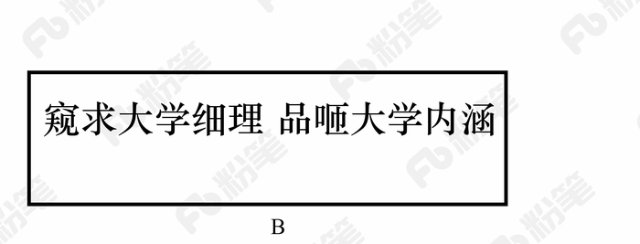

# 2018年421联考《行测》题（吉林乙级）（网友回忆版）

> 常识判断 · 23 题 · 吉林 2018

## 第 1 题　qid 2187416 · 人文常识

国务院机构改革优化了创新引擎。一方面，重组科学技术部，加强、优化、转变政府科技管理和服务职能；另一方面，重组国家知识产权局，强化知识产权创造、保护和运用，让“第一动力”更有劲头。这段话蕴含的哲理是：

- **A**. 社会存在状况决定社会意识
- **B**. 上层建筑应与经济基础相适应　✅
- **C**. 生产关系应与生产力相适应
- **D**. 社会意识一定要适应社会存在

**答案**：B

**官方解析**

本题考查哲学常识。
A项错误，社会存在是指社会物质生活条件的总和，它包括地理环境、人口因素和生产方式。社会意识是社会生活的精神方面，是社会存在的总体反映。社会存在决定社会意识，但是本题没有体现社会存在和社会意识的辩证关系原理，而是强调对国家机构进行改革以促进科技创新发展。
B项正确，上层建筑是指建立在一定经济基础上的社会意识形态以及与之相适应的政治法律制度，包括政治上层建筑和思想上层建筑。经济基础是指占统治地位的生产关系的总和。题干中的国家机构为经济发展、鼓励科技创新而进行改革，体现了调整上层建筑为经济基础服务。
C项错误，生产力是人类改造自然并从自然界获得生存和发展的物质资料的能力。生产关系是人们在物质生产过程中所结成的经济关系。生产力决定生产关系，生产关系对生产力具有反作用。题干只是强调国家机构改革促进创新的发展，没有体现生产力和生产关系的辩证关系。
D项错误，社会存在和社会意识的辩证关系为社会存在决定社会意识，社会意识对社会存在具有反作用，同时社会意识具有相对独立性。社会存在和社会意识的发展不完全同步，社会意识有时会先于社会存在，有时会落后于社会存在，选项表述太过绝对。
故正确答案为B。

---

## 第 2 题　qid 2187973 · 科技常识

新西兰一家园艺研究所研究发现，水果成熟时会释放挥发性的化合物，而且随着成熟程度的增加，其浓度也会有所变化。研究人员正是根据水果这一特性，制成了一种能“感知”水果是否成熟的标签。当水果成熟时，标签通过感知其释放的挥发性化合物的浓度而变换颜色。这段话体现的哲理是：

- **A**. 意识是人脑的机能和属性
- **B**. 意识对人们改造世界具有指导作用　✅
- **C**. 意识活动具有科学预见性
- **D**. 意识活动具有直接现实性

**答案**：B

**官方解析**

本题考查哲学常识，主要涉及辩证唯物主义的相关内容。
A项错误，意识是人脑的机能和属性，是客观世界的主观映象。题干强调的是发挥意识的作用，故选项与题干无关；
B项正确，题干描述的“水果这一特性”属于自然规律，人们认识并利用这一自然规律制造出了“感知标签”，体现了意识可以能动的改造世界，对人们改造世界的活动具有指导作用；
C项错误，意识活动具有正确和错误之分，只有正确的意识才具有科学预见性。正确的意识是指如实地反映客观事物的本来面目（包括状态、性质、变化规律等）的意识。正确意识的这一性质决定了它能够对事物的发展趋势作出正确的分析、判断和预测，使人们采取正确的措施，从而推动事物的发展。错误的意识歪曲了事物的本质，会阻碍事物的发展；
D项错误，意识具有目的性、创造性和计划性，但不具有直接现实性。实践活动具有直接现实性。
故正确答案是B。

---

## 第 3 题　qid 2187394 · 人文常识

下列流行语与其所反映的哲理对应错误的是：

- **A**. 正能量——发挥社会意识正确导向作用
- **B**. 新常态——静止的、无条件的　✅
- **C**. 接地气——从实际出发，密切联系群众
- **D**. 中国式——共性寓于个性之中

**答案**：B

**官方解析**

A项正确，正能量指的是一种健康乐观、积极向上的动力和情感，对事物发展有积极作用，体现了“发挥社会意识正确导向作用”的原理。
B项错误，中国新常态要发挥对世界经济的正面效应，需要不断推进改革来驱动增长，这体现了“事物之间的联系具有条件性、多样性”的原理；在新常态下，中国经济结构调整的本质是资源要素的重新组合利用，资产重组调整再分配，是此消彼长的关系，这体现了“一切事物是变化发展的，发展具有普遍性”的原理；在新常态下新旧力量将长期并存，原有的对经济发展有影响的因素会继续发挥其效应，而新的特征和趋势也将逐步形成，新常态需要新思路和新方式，但不否定那些仍继续有效的做法，这体现了“矛盾具有普遍性、具体性”的原理。所以，B项错误，并未体现“静止的、无条件的”原理。
C项正确，接地气比喻联系实际、联系基层群众，体现了“从实际出发，密切联系群众”的原理。
D项正确，中国式是指具有中国特色的事物。共性指不同事物的普遍性质；个性指一事物区别于他事物的特殊性质，体现了“共性寓于个性之中”的原理。
本题为选非题，故正确答案为B。

---

## 第 4 题　qid 2187403 · 人文常识

甲国国家领导人出访乙国，乙国的接待做法不符合涉外交际礼仪惯例的是：

- **A**. 邀请甲国领导人发表演讲时，将演讲台放置于主席台的右前方
- **B**. 用轿车接送时，安排甲国领导人坐后排右座，翻译坐副驾驶座
- **C**. 面对行进方向，在轿车右侧悬挂甲国国旗，左侧悬挂乙国国旗
- **D**. 在乙国安排的招待宴会上，应将甲国领导人安排在主位的左侧　✅

**答案**：D

**官方解析**

本题考查文化常识。
A项正确，根据国际社交礼仪，演讲台应放置于主席台的右前方。
B项正确，乘坐双排五座轿车时，当是专职司机驾车时，座次由高到低是：后排右座、后排左座、后排中座、副驾驶座。位于轿车前排的副驾驶座，在由专职司机驾车时，一般被称为“随员座”，它是属于陪同、秘书、翻译或是警卫人员的专座。所以安排甲国领导人坐后排右座，翻译坐副驾驶座。
C项正确，在轿车上悬挂两国国旗时，以轿车行进方向为准，以驾驶员右侧为上，悬挂来国国旗，以驾驶员左侧为下，悬挂东道主国国旗。甲国为出访国，乙国为东道主国，所以右侧悬挂甲国国旗，左侧悬挂乙国国旗。
D项错误，依照国际礼仪的普遍惯例，是“以右为尊”。在招待宴上，面对宴厅的门为主位，“主陪”就坐，而甲国领导人为主宾，应该坐在主位的右侧。
本题为选非题，故正确答案为D。

---

## 第 5 题　qid 2188129 · 人文常识

下列新闻标题用语存在明显错误的是：

- **A**. 

- **B**. 

- **C**. 

- **D**. 

　✅

**答案**：D

**官方解析**

本题考查文化常识，主要涉及标题用语的相关内容。
A项正确，“嬗变”具有以下几种解释：1.蜕变；2.一种元素通过核反应转化为另一种元素或者一种核素转变为另一种核素；3.彻底改变（如特征或条件的改变）；4.演变。选项标题为《那些小山村的嬗变》，可以理解为小山村的蜕变，或者是发生彻底的变化，语意通顺，无明显错误。
B项正确，《窥求大学细理 品咂大学内涵》是冯玉忠（辽宁大学原校长）先生的一篇文章，全文围绕“大学使命，大学何为”展开，文章引人深思，发人深省。
C项正确，引擎是发动机的核心部分，因此习惯上也常用引擎指发动机。体育产业需要创新引擎，意思是体育产业需要创新提供动力，无明显语病。
D项错误，“无出其右”是一个成语，汉代以右为尊，意思是没有能超过他的，出自《史记·田叔列传》。“无人能出其左右”，“左右”指两个方面，存在歧义，该用法错误。
本题为选非题，故正确答案是D。

---

## 第 6 题　qid 2187979 · 人文常识

关于下列谦辞的用法，表述错误的是：

- **A**. “刍议”用于谦称自己撰写的文章
- **B**. “续貂”用于谦称修补别人的服饰　✅
- **C**. “芹献”用于谦称赠送别人的礼物
- **D**. “补壁”用于谦称赠人的书画作品

**答案**：B

**官方解析**

本题考查文化常识。
A项正确，“刍议”，谦词，指自己的不成熟的言谈议论，亦指浅陋的议论，多用于第一人称的自谦之语。
B项错误，“续貂”，比喻拿不好的东西接到好的东西后面，多用于谦称续写别人的著作。一般不用于谦称修补别人的服饰。
C项正确，“芹献”，指的是谦称赠人的礼品菲薄或所提的建议浅陋。所以，“芹献”可以用于谦称赠送别人的礼物。
D项正确，“补壁”，字面意思是修补墙壁。作书绘画的人，把作品赠人时的谦词，意思是说水平拙劣，不足登大雅之堂，潜台词就是自己的作品价值不高，至多用作修补墙壁的材料。
本题为选非题，故正确答案是B。

---

## 第 7 题　qid 2187983 · 人文常识

陆游《临安春雨初霁》中的诗句“小楼一夜听春雨，深巷明朝卖杏花”描写的场景是农历的：

- **A**. 二月　✅
- **B**. 五月
- **C**. 四月
- **D**. 三月

**答案**：A

**官方解析**

本题主要考查文学常识。
《临安春雨初霁》是南宋诗人陆游晚年时期所作的一首七言律诗。 诗中“小楼一夜听春雨，深巷明朝卖杏花”意思是住在小楼听尽了一夜的春雨淅沥滴答，清早会听到小巷深处在一声声叫卖杏花。
A项正确，从诗句中的“杏花”推断出该诗描述的应是杏花开放的时节。古人记月除常用的序数法外，还常常以物候的特点来命名。古代农历的二月正值杏花开放的时节，故古人将农历二月又称为杏月，本题选择A项最合适。因此B、C、D项错误。
故正确答案为A。

---

## 第 8 题　qid 2187988 · 人文常识

对下列典籍名称中划线词解释错误的是：

- **A**. 
《<u>齐民</u>要术》———平等之黎民 

- **B**. 
《<u>本草</u>纲目》——根本之药物 

- **C**. 
《<u>文心</u>雕龙》——为文之用心

- **D**. 
《<u>梦溪</u>笔谈》——游览之胜地
　✅

**答案**：D

**官方解析**

本题主要考查历史常识。
A项正确，《齐民要术》是北魏贾思勰所著，该书系统地总结了黄河中下游地区劳动人民长期积累的生产经验。“齐民者，若今言平民也”，“齐民”指的是平等的黎民。
B项正确，《本草纲目》，是明代李时珍所著的医药学著作。其中，“本草”指的是根本之药物中草药。
C项正确，《文心雕龙》是南朝刘勰撰写的文学理论专著。在《文心雕龙·序志》当中提到，“文心者，言为文之用心也”。
D项错误，《梦溪笔谈》，是北宋科学家沈括所撰，是一部涉及古代中国自然科学、工艺技术及社会历史现象的综合性的著作。其中，“梦溪”指的是当时沈括所居的房子，并非指游览之胜地。
本题为选非题，故正确答案为D。

---

## 第 9 题　qid 2187397 · 人文常识

下列做法符合公文处理规则的是：

- **A**. 县民政局向本县所属乡镇政府发布指令性公文
- **B**. 镇党委书记以党委负责人名义向县委报送公文
- **C**. 镇政府向县政府报送的报告中带有请示事项
- **D**. 县科技局和林业局联合行文中只标注了主办机关的发文字号　✅

**答案**：D

**官方解析**

本题考查公文处理常识，主要考查《党政机关公文处理工作条例》的相关知识。
A项错误，根据《党政机关公文处理工作条例》第十六条第（二）款规定：党委、政府的办公厅（室）根据本级党委、政府授权，可以向下级党委、政府行文，其他部门和单位不得向下级党委、政府发布指令性公文或者在公文中向下级党委、政府提出指令性要求。县民政局不是党委、政府的办公厅（室），不可以向本县所属乡镇政府发布指令性公文。
B项错误，根据《党政机关公文处理工作条例》第十五条第（五）款规定：除上级机关负责人直接交办事项外，不得以本机关名义向上级机关负责人报送公文，不得以本机关负责人名义向上级机关报送公文。
C项错误，根据《党政机关公文处理工作条例》第十五条第（四）款规定：请示应当一文一事。不得在报告等非请示性公文中夹带请示事项。
D项正确，根据《党政机关公文处理工作条例》第九条第（五）款规定：联合行文时，使用主办机关的发文字号。
故本题正确答案为D。

---

## 第 10 题　qid 2187990 · 人文常识

直线型组织结构又称单线型组织结构，是最古老、最简单的一种组织结构类型，其特点是组织系统职权从组织上层“流向”组织基层。上下级关系是直线关系，即命令与服从的关系。下列关于直线型组织结构的说法中，错误的是：

- **A**. 信息流通迅速，利于民主决策　✅
- **B**. 权责明确，管理成本低
- **C**. 联系便捷，易于适应环境变化
- **D**. 结构简单，命令统一

**答案**：A

**官方解析**

本题主要考查管理常识。直线型组织上下级的权责关系是直线型，上级在其职权范围内具有直接指挥权和决策权，下属必须服从。这种结构形式具有权责明确、命令统一、决策迅速、反应灵敏和管理机构简单等优点；其缺点是权限高度集中，易于造成家长式管理作风、形成独断专行、长官意志，组织发展受到管理者个人能力的限制，组织成员只注意上下沟通，从而忽视横向联系。
A项错误，该组织成员只注重上下级沟通，信息横向流通不畅；该组织结构中，上级具有直接指挥权和决策权，下属必须服从，这样不利于民主决策。
B项正确，该组织结构下级只受一个上级领导管理，上下级关系简明清晰，权责明确；组织机构简单，管理成本低。
C项正确，该组织因为结构简单，可以随着组织结构的变化灵活调整，体现其联系便捷，易于适应环境变化的特点。
D项正确，该组织结构简单，上级具有直接指挥权和决策权，命令统一。
本题为选非题，故正确答案为A。

---

## 第 11 题　qid 2187994 · 经济常识

在经济学意义上，投资每增长一个百分点，能拉动经济增长；而消费每增长一个百分点，能拉动经济增长，是投资的4倍。下列选项中，有助于促进居民消费的是：

- **A**. 降低银行存贷款利率　✅
- **B**. 改善投资环境扩大招商引资
- **C**. 优化投资结构并实现总量扩张
- **D**. 家电企业扩大生产规模

**答案**：A

**官方解析**

本题考查的是经济常识的相关知识。
A项正确，银行存款利率降低，存款利息会随之变少，因此人们的银行存款会变少；银行贷款利率降低，贷款利息随之减少，因此人们的银行贷款会变多。总之，居民手中持有的货币量会增加，所以降低银行存贷款利率有利于促进居民消费。
B项错误，改善投资环境扩大招商引资属于增加投资。
C项错误，优化投资结构并实现总量扩张属于增加投资。
D项错误，家电企业扩大生产规模属于增加投资。
故正确答案为A。

---

## 第 12 题　qid 2187404 · 地理国情

发源于长白山的松花江滋养了东北大地，与东北人的生活息息相关。下列关于松花江表述错误的是：

- **A**. 松花江是东北境内航运价值较大的河流
- **B**. 松花江流域属温带大陆性季风气候
- **C**. 松花江是中国黑龙江最小的支流　✅
- **D**. 吉林市位于松花江沿岸

**答案**：C

**官方解析**

本题考查的是地理国情相关知识。
A项正确，松花江通航里程约1500公里，吉林市、齐齐哈尔市以下可通航汽轮；哈尔滨市以下可通航千吨江轮。通航期一般为4月中旬至11月上旬，是东北境内航运价值较大的河流。
B项正确，温带季风气候在我国主要分布在东部秦岭—淮河一线以北地区。松花江流域地处温带季风气候区，气候特点为夏季高温多雨，冬季寒冷干燥，松花江属于温带大陆性季风气候。
C项错误，松花江是黑龙江在中国最大的支流，而非最小的支流。
D项正确，吉林市位于吉林省中部，东北腹地长白山脉，长白山向松嫩平原过渡地带的松花江畔。吉林市满语名为“吉林乌拉”，意为“沿江的城池”。
本题为选非题，故正确答案为C。

---

## 第 13 题　qid 2187405 · 人文常识

“个性化定制”就在我们身边，“互联网+”大背景下，我们可以张扬更多的个性，从一件T恤到一本书，只要你愿意，生活中就会充满惊喜。这种消费属于：

- **A**. 求异心理引发的消费　✅
- **B**. 攀比心理引发的消费
- **C**. 从众心理引发的消费
- **D**. 求同心理引发的消费

**答案**：A

**官方解析**

本题考查的是经济常识。
A项正确，求异心理引发的消费指的是有些人消费时喜欢追求与众不同、标新立异的效果。题中追求“个性化定制”属于求异心理引发的消费。
B项错误，攀比心理引发的消费是指消费者出于攀比心理，脱离自己实际收入水平而盲目攀高的消费心理，与题干不符。
C项错误，从众心理引发的消费是指人们出于跟风、随大流的心理，引发对某类商品或某种风格的商品的追求，并形成流行趋势，当然盲目从众不可取。
D项错误，求同心理引发的消费是指不管自己是否愿意作出某种行为，也会尽量与周围的人保持一致，与题干不符。
故正确答案为A。

---

## 第 14 题　qid 2188077 · 人文常识

在同一城市，不同片区的居民收到的天气预报往往不一样，且每隔数小时都会更新一次。这种天气预报法属于：

- **A**. 定性预报法
- **B**. 网格化预报法　✅
- **C**. 定点预报法
- **D**. 描述性预报法

**答案**：B

**官方解析**

本题考查科技常识。

网格化预报法，就像地球上的经纬网一样，把中国以及每个城市所在的区域分解成许多个5公里5公里，甚至1公里1公里的网格，而公众就是生活在这样一个个的网格中，每个网格中的天气情况会有所差异。网格化预报的精细不仅体现在空间上，还反映在可以每天更高频次的更新和发布上。所以题干中的信息符合的正是“网格化预报法”， A、C、D三项均不符合题意。

故正确答案为B。

---

## 第 15 题　qid 2187972 · 人文常识

北极气候恶劣，冰雪无边。室外最低气温能达到零下59摄氏度，但冰屋却给那里的居民提供了温暖的住所。下列关于冰屋的说法，不正确的是：

- **A**. 冰屋能够保留其内部空间的热量，因为冰墙是热的不良导体
- **B**. 为了避免冷空气的进入，冰屋顶部应该被设计成密封圆拱形　✅
- **C**. 冰屋一半陷入地下，通过冷暖空气对流来保证冰屋内部气温
- **D**. 冰屋的内壁较为光亮，可以通过辐射防止内部热量向外扩散

**答案**：B

**官方解析**

本题考查的是科技常识的相关知识。
A项正确，因为冰是热的不良导体，能很好地隔热，屋里的热量几乎不能通过冰墙传导到屋外，所以冰屋能够保留其内部热量。
B项错误，冰屋顶部设计为圆拱形，是因为拱形受压时会把力传给相邻的部分，拱形可以向下向外分散压力，所以拱形所能承受的力量更重。所以冰屋屋顶设计成密封圆拱形，是为了承受更大的压力。
C项正确，冰屋在建造过程中会在半球形屋顶罩住的土地上挖掘一个深坑，根据热空气上升冷空气下降，冷空气会降到冰坑里，热空气升到人所在的位置，因此保证内部温度。
D项正确，冰屋内壁光亮的冰壳能够把辐射出去的热能反射回来，有效阻止屋内的热量向外扩散，从而保证室内温度的均衡。
本题为选非题，故正确答案为B。

---

## 第 16 题　qid 2187974 · 人文常识

中医认为，咸、甜、酸、苦、辣分别与人体的五脏相对应，各有其作用，即五味各入其脏，有所裨益。下述关于五味与五脏对应关系的表述中，错误的是：

- **A**. 酸味——肝脏
- **B**. 甜味——脾脏
- **C**. 咸味——肾脏
- **D**. 辣味——心脏　✅

**答案**：D

**官方解析**

本题主要考查文化常识。“五味”属于中药学概念，五味理论最早载于《神农本草经》，其序录云：“药有酸、咸、甘、苦、辛五味，又有寒、热、温、凉四气。”中药学中根据中药的味道、作用将其概括为酸、苦、甘、辛、咸，题干中的甜属于甘，辣属于辛，随症用药对五脏（心、肝、脾、肺、肾）有一定的选择性，《素问·宣明五气论》中有：“酸入肝、苦入心、甘入脾、辛入肺、咸入肾”之说。其作用是辛味药以散肺气之郁，甘味药以补脾气之虚，苦味药以泻心火，酸味药以敛肝阴，咸味药以补肾虚。所以五味与“五脏”对应关系是：酸对应肝脏，苦对应心脏，甜（甘）对应脾脏，辣（辛）对应肺脏，咸对应肾脏。 
A、B、C三项正确，酸对应肝脏，甜（甘）对应脾脏，咸对应肾脏。
D项错误，辣（辛）对应肺脏，而不是心脏，心脏对应苦味。
本题为选非题，故正确答案为D。

---

## 第 17 题　qid 2187976 · 人文常识

户外运动可以促进骨骼的健康，这是因为太阳光中的某种频率的电磁波可以促成维生素D的活化，促进身体吸收食物中钙和磷，从而促进骨骼的生长。这种电磁波是：

- **A**. 
紫外线
　✅
- **B**. 
与射线

- **C**. 
无线电波

- **D**. 
红外线

**答案**：A

**官方解析**

本题主要考查物理常识。

A项正确，紫外线是电磁波谱中波长从5nm～370nm之间的电磁波。太阳光里有紫外线，人体接受适量的紫外线照射，能促进钙的吸收，促进骨骼生长，改善身体健康。

B项错误，射线又称伦琴射线，能够穿透物质，可以用来检查人体内部器官。在工业上，利用射线检查金属零件内部的缺陷。γ射线是波长最短的电磁辐射，能够破坏生命物质。可以摧毁病变的细胞，用来治疗某些癌症。

C项错误，波长大于1mm的电磁波是无线电波。无线电波用于通信、广播及其他信号传输。

D项错误，红外线波长比无线电波短，比可见光长，所有物体都发射红外线。利用此现象制造的红外探测器，能够在较冷的背景上探测出较热物体的红外辐射，这是夜视仪器和红外摄影的基础。此外，红外线在军事上的应用也十分重要。

故正确答案为A。

---

## 第 18 题　qid 2187978 · 人文常识

下列我国史书中记载的国家与今日国名对应错误的是：

- **A**. 倭奴国——日本
- **B**. 暹罗国——伊朗　✅
- **C**. 安南国——越南
- **D**. 身毒国——印度

**答案**：B

**官方解析**

本题主要考查历史常识。
A项正确，倭奴国，最早称倭奴，后来称呼为倭寇，是我国古代对日本的称呼，也是日本最初的国名。
B项错误，暹罗国，是我国古代对东南亚国家泰国的古称。1939年6月24日改国号为“泰国”，1945年复名“暹罗”，1949年再度改名为“泰国”，沿用至今。故暹罗并不对应伊朗，而是对应泰国。
C项正确，安南国，为越南古名，其得名于唐代的安南都护府，自公元前3世纪开始成为我国领土，至五代十国时吴权割据安南脱离南汉，北宋无力统一，故正式独立，此后越南长期作为我国的藩属国存在。
D项正确，身毒国，是我国古代对现代印度次大陆上文明区域的称呼，其范围主要指今日印度河流域一带。
本题为选非题，故正确答案为B。

---

## 第 19 题　qid 2187980 · 科技常识

下列说法符合生物常识的是：

- **A**. 蜜蜂用头部的螯针蜇人
- **B**. 蜻蜓拥有咀嚼式的口器　✅
- **C**. 蚂蚁出生后由雄蚁喂养
- **D**. 蟋蟀依靠口器发出声音

**答案**：B

**官方解析**

本题考查生物常识，结合选项具体分析。
A项错误，蜜蜂蜇人的刺称之为蜂针，蜂针是蜜蜂的自卫器官，当蜜蜂感受到生命受到其他生物的威胁时，会执行蜇刺的动作。蜂针位于蜜蜂的尾部而非头部。
B项正确，蜻蜓是一种肉食昆虫，拥有咀嚼式口器，上颚发达，视觉极为灵敏。
C项错误，蚂蚁在幼虫阶段没有任何能力，它们也不需要觅食，完全由工蚁喂养。
D项错误，蟋蟀靠翅膀的摩擦来发音。在蟋蟀雄虫的前翅上，有旋涡纹状的翅膜。一边翅膀长着锉刀状的翅膜弦器，另一边翅膀长着较硬翅膜弹器。当这两种发音器相互摩擦，就能发出声音。
故正确答案为B。

---

## 第 20 题　qid 2187982 · 人文常识

牵牛花早晨为蓝色，下午会变为红色，这主要是因为牵牛花逐渐吸收了大量的：

- **A**. 酸性气体　✅
- **B**. 惰性气体
- **C**. 中性气体
- **D**. 碱性气体

**答案**：A

**官方解析**

本题考查化学常识。牵牛花内有特殊的色素，随着酸碱度变化而变化，吸收二氧化碳越多，越偏酸性。吸收二氧化碳是一个随时间持续的过程，白天光合作用强，因此随着吸收二氧化碳量的增加，逐渐变为红色；夜晚之后，光合作用停止，吸收二氧化碳减少，逐渐变回蓝色。
故正确答案为A。

---

## 第 21 题　qid 2187984 · 人文常识

拳术在长期的社会实践中形成了各种不同风格和特点的拳种流派。根据“舒缓柔和，轻灵圆活”的特点，判断该拳种是

- **A**. 通臂拳
- **B**. 长拳
- **C**. 南拳
- **D**. 太极拳　✅

**答案**：D

**官方解析**

本题考查与拳术相关的文化常识，结合选项具体分析。
A项错误，通臂拳是流传于北京、天津一带的拳术。通臂拳以其特殊的伸臂动作而著称，伸臂动作要力由背发，通过肩、肘、以达到指尖，所以要求背、肩、肘协调，用力伸展，并非单纯地伸臂。
B项错误，长拳是中国传统拳派之一，属于一种北派武术。其动作撑长舒展、筋顺骨直，如流星迅疾、敏捷、有力。
C项错误，南拳套路短小精悍，结构紧凑，动作朴实，手法多变，短手连打，步法稳健，攻击勇猛，常伴以声助威，技击性强。
D项正确，太极拳是一种以柔克刚，以静待动，以圆化直，以小胜大，以弱胜强，舒缓柔和，轻灵圆活的拳法。
故正确答案为D。

---

## 第 22 题　qid 2187986 · 人文常识

关于语言文字与字母的关系，下列说法错误的是

- **A**. 法语使用的是拉丁字母
- **B**. 日语使用的是阿拉伯字母　✅
- **C**. 俄语使用的是斯拉夫字母
- **D**. 德语使用的是拉丁字母

**答案**：B

**官方解析**

本题考查与语言文字相关的文化常识，结合选项具体分析。
A、D两项正确，拉丁字母是目前世界上流传最广的字母体系，源自希腊字母。拉丁字母、阿拉伯字母、斯拉夫字母（西里尔字母）被称为世界三大字母体系。法国和德国均使用拉丁字母。
B项错误：日语的文字主要由汉字、假名、罗马字三个部分构成，假名又分为平假名和片假名。其中罗马字是使用拉丁字母来表记日语的一种方法。一般在书写日语时，不需要用到罗马字。罗马字用于给日语注音，输入日语文字。有时在书写地名、人名、商标时可能会用到罗马字。
C项正确，俄语字母是西里尔字母的变体，西里尔字母是由基督教传教士西里尔在9世纪为了方便在斯拉夫民族传播东正教所创立的，被斯拉夫民族广泛采用，因此有时也称为斯拉夫字母。
本题为选非题，故正确答案为B。

---

## 第 23 题　qid 2187393 · 人文常识

某电视专题片介绍了三位富有诗书才华的古代帝王，片中先后出现了《玉树后庭花》“千古词帝”“瘦金体”等内容。这三位帝王分别是：

- **A**. 南朝梁武帝萧衍、南唐后主李煜、隋炀帝杨广
- **B**. 南朝陈后主陈叔宝、南唐后主李煜、宋徽宗赵佶　✅
- **C**. 魏文帝曹丕、南朝陈后主陈叔宝、唐玄宗李隆基
- **D**. 南朝梁武帝萧衍、唐玄宗李隆基、宋徽宗赵佶

**答案**：B

**官方解析**

《玉树后庭花》，以花为曲名，本来是乐府民歌中一种情歌的曲子，后被南朝陈的最后一个皇帝陈后主陈叔宝填词。所以，《玉树后庭花》对应的帝王是南朝陈后主陈叔宝。
“千古词帝”指的是南唐后主李煜。李煜精于书画，谙于音律，工于诗文，词尤为五代之冠，被称为“千古词帝”。
“瘦金体”是宋徽宗赵佶所创的一种字体，是书法史上极具个性的一种书体，因其与晋楷唐楷等传统书体区别较大，个性极为强烈，故可称作是书法史上的一个独创，代表作有《秾芳诗》等。
由此可知，《玉树后庭花》“千古词帝”“瘦金体”对应的三位帝王分别是：南朝陈后主陈叔宝、南唐后主李煜、宋徽宗赵佶。所以，B项正确，A、C、D三项错误。
故正确答案为B。

---
