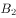
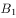
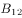

# 2018年421联考《行测》题（吉林甲级）（网友回忆版）

> 常识判断 · 22 题 · 吉林 2018

## 第 1 题　qid 2187416 · 人文常识

国务院机构改革优化了创新引擎。一方面，重组科学技术部，加强、优化、转变政府科技管理和服务职能；另一方面，重组国家知识产权局，强化知识产权创造、保护和运用，让“第一动力”更有劲头。这段话蕴含的哲理是：

- **A**. 社会存在状况决定社会意识
- **B**. 上层建筑应与经济基础相适应　✅
- **C**. 生产关系应与生产力相适应
- **D**. 社会意识一定要适应社会存在

**答案**：B

**官方解析**

本题考查哲学常识。
A项错误，社会存在是指社会物质生活条件的总和，它包括地理环境、人口因素和生产方式。社会意识是社会生活的精神方面，是社会存在的总体反映。社会存在决定社会意识，但是本题没有体现社会存在和社会意识的辩证关系原理，而是强调对国家机构进行改革以促进科技创新发展。
B项正确，上层建筑是指建立在一定经济基础上的社会意识形态以及与之相适应的政治法律制度，包括政治上层建筑和思想上层建筑。经济基础是指占统治地位的生产关系的总和。题干中的国家机构为经济发展、鼓励科技创新而进行改革，体现了调整上层建筑为经济基础服务。
C项错误，生产力是人类改造自然并从自然界获得生存和发展的物质资料的能力。生产关系是人们在物质生产过程中所结成的经济关系。生产力决定生产关系，生产关系对生产力具有反作用。题干只是强调国家机构改革促进创新的发展，没有体现生产力和生产关系的辩证关系。
D项错误，社会存在和社会意识的辩证关系为社会存在决定社会意识，社会意识对社会存在具有反作用，同时社会意识具有相对独立性。社会存在和社会意识的发展不完全同步，社会意识有时会先于社会存在，有时会落后于社会存在，选项表述太过绝对。
故正确答案为B。

---

## 第 2 题　qid 2187419 · 人文常识

以“也门撤侨”的真实事件改编的军事题材的电影《红海行动》，展现了人民解放军官兵不畏危险、不畏艰苦，宁可牺牲自己，也要捍卫国家荣誉，保卫人民安全。该影片叫好又叫座，这表明：

- **A**. 观众的喜好是评判艺术作品优秀与否的根本标准
- **B**. 艺术作品的创作需要立足于社会生活实践　✅
- **C**. 艺术作品的创作需要源于作家的创新思维
- **D**. 维护和平的共同心愿是创作优秀艺术作品的源泉

**答案**：B

**官方解析**

本题考查人文常识。
A项错误，艺术作品的发展离不开观众的支持。要把批评权和评判权交给观众，才可以使艺术作品取得更好、更全面的进步。观众的喜好是评判艺术作品优秀与否的因素之一，但并不是评判艺术作品优秀与否的根本标准。
B项正确，题干中提到电影《红海行动》改编于“也门撤侨”的真实事件，体现了艺术作品的创作需要立足于社会生活实践。
C项错误，艺术作品的创作需要作家的创新思维，但并不是源于作家的创新思维。文艺的一切创新，归根结底都直接或间接来源于人民和生活。
D项错误，《平凡的世界》的作者路遥先生在领取茅盾文学奖时说：“人民是我们的母亲，生活是艺术的源泉”。并且，习近平总书记于2014年10月15日在文艺工作座谈会上也曾提到：“文艺创作方法有一百条、一千条，但最根本、最关键、最牢靠的办法是扎根人民、扎根生活。”人民和生活才是创作优秀艺术作品的源泉。
故正确答案为B。

---

## 第 3 题　qid 2187392 · 人文常识

公元前3世纪，古希腊数学家欧几里得提出：“三角形内角之和等于180度。”19世纪，德国数学家黎曼提出：“在球面上，三角形内角之和大于180度。”后来，俄国数学家罗巴切夫斯基又提出：“在凹面上，三角形内角之和小于180度。”这一认识过程说明：

- **A**. 真理具有绝对性
- **B**. 真理具有唯一性
- **C**. 真理具有客观性
- **D**. 真理具有相对性　✅

**答案**：D

**官方解析**

本题考查马克思主义哲学认识论的常识。
A项错误，真理的绝对性是指任何真理都是对客观事物及其规律的正确反映，在它所适用的范围内是不能推翻的。选项说法正确，但与题干无关。
B项错误，真理具有唯一性，是指对于一个确定的对象，在同一条件下得出的真理只有一个，不存在反映同一对象的相互矛盾的不同的真理。选项说法正确，但与题干无关。
C项错误，真理具有客观性，真理是标志主观同客观相符合的哲学范畴，是人们对客观事物及其规律的正确反映，并且客观性是真理的最基本的属性。选项说法正确，但与题干无关。
D项正确，真理的相对性，是指真理是具体的有条件的，即在一定条件下，人们对客观事物的发展过程及其发展规律的正确认识总是有局限的、不完全的。题干中数学家们在不同时期对三角形内角和与180度的关系提出了不同的认识，体现了真理的相对性。
故正确答案为D。

---

## 第 4 题　qid 2187393 · 人文常识

某电视专题片介绍了三位富有诗书才华的古代帝王，片中先后出现了《玉树后庭花》“千古词帝”“瘦金体”等内容。这三位帝王分别是：

- **A**. 南朝梁武帝萧衍、南唐后主李煜、隋炀帝杨广
- **B**. 南朝陈后主陈叔宝、南唐后主李煜、宋徽宗赵佶　✅
- **C**. 魏文帝曹丕、南朝陈后主陈叔宝、唐玄宗李隆基
- **D**. 南朝梁武帝萧衍、唐玄宗李隆基、宋徽宗赵佶

**答案**：B

**官方解析**

《玉树后庭花》，以花为曲名，本来是乐府民歌中一种情歌的曲子，后被南朝陈的最后一个皇帝陈后主陈叔宝填词。所以，《玉树后庭花》对应的帝王是南朝陈后主陈叔宝。
“千古词帝”指的是南唐后主李煜。李煜精于书画，谙于音律，工于诗文，词尤为五代之冠，被称为“千古词帝”。
“瘦金体”是宋徽宗赵佶所创的一种字体，是书法史上极具个性的一种书体，因其与晋楷唐楷等传统书体区别较大，个性极为强烈，故可称作是书法史上的一个独创，代表作有《秾芳诗》等。
由此可知，《玉树后庭花》“千古词帝”“瘦金体”对应的三位帝王分别是：南朝陈后主陈叔宝、南唐后主李煜、宋徽宗赵佶。所以，B项正确，A、C、D三项错误。
故正确答案为B。

---

## 第 5 题　qid 2187394 · 人文常识

下列流行语与其所反映的哲理对应错误的是：

- **A**. 正能量——发挥社会意识正确导向作用
- **B**. 新常态——静止的、无条件的　✅
- **C**. 接地气——从实际出发，密切联系群众
- **D**. 中国式——共性寓于个性之中

**答案**：B

**官方解析**

A项正确，正能量指的是一种健康乐观、积极向上的动力和情感，对事物发展有积极作用，体现了“发挥社会意识正确导向作用”的原理。
B项错误，中国新常态要发挥对世界经济的正面效应，需要不断推进改革来驱动增长，这体现了“事物之间的联系具有条件性、多样性”的原理；在新常态下，中国经济结构调整的本质是资源要素的重新组合利用，资产重组调整再分配，是此消彼长的关系，这体现了“一切事物是变化发展的，发展具有普遍性”的原理；在新常态下新旧力量将长期并存，原有的对经济发展有影响的因素会继续发挥其效应，而新的特征和趋势也将逐步形成，新常态需要新思路和新方式，但不否定那些仍继续有效的做法，这体现了“矛盾具有普遍性、具体性”的原理。所以，B项错误，并未体现“静止的、无条件的”原理。
C项正确，接地气比喻联系实际、联系基层群众，体现了“从实际出发，密切联系群众”的原理。
D项正确，中国式是指具有中国特色的事物。共性指不同事物的普遍性质；个性指一事物区别于他事物的特殊性质，体现了“共性寓于个性之中”的原理。
本题为选非题，故正确答案为B。

---

## 第 6 题　qid 2187400 · 人文常识

下列加划线的称谓使用正确的是：

- **A**. 
顾恺之是中国美术史上画人物的<u>宗师</u>
　✅
- **B**. 
她向人夸赞道：“<u>家夫</u>为人十分谦和。”

- **C**. 
皇后谓皇帝道：“<u>哀家</u>不便干涉朝政。”

- **D**. 
海灯法师曾经是观雾山极乐寺的<u>主持</u>

**答案**：A

**官方解析**

本题命题上不严谨，选A、选D均可。题库给出正确答案A，但选D亦可，大家掌握知识点即可。
A项正确，“宗师”指在思想或学术上受人尊崇而可奉为师表的人。顾恺之，杰出画家、绘画理论家、诗人，为我国传统绘画的发展奠定了基础。所以，A项正确。 
B项错误，“家”是对别人谦称自己亲属中长辈或同辈中年长者的用词，如“家祖”、“家翁”、“家父”、“家母”、“家慈”等。谦辞“家”不能用在平辈或晚辈身上，故“家夫”的说法是不存在的。
C项错误，“哀家”一词仅用于丧夫的皇后，而且仅在文学作品、影视作品里出现，历史真实中的皇后，无论何时都不自称哀家。题干表述为皇帝健在，用“哀家”不当。
D项错误，佛教寺院中的最高负责人就是住持。“住持”的语义为“安住之、维持之”，原意指代佛传法、续佛慧命之人，后被用来指称各寺院之主持者，或长老。该词用在寺职称谓时，又称寺主或院主。相传住持一职为唐代百丈山怀海所创，根据《敕修百丈清规》卷二〈住持章〉云：“始奉其师为住持，而尊之曰长老。”海灯法师，先后任观雾山极乐寺等多个寺庙的住持，而不是主持。
故正确答案为A。

---

## 第 7 题　qid 2187401 · 人文常识

下列表述的内容与自身民族生活相符合的是：

- **A**. 壮族同胞说：“‘三月三’歌节是我们传统的盛大节日”　✅
- **B**. 朝鲜族同胞说：“我们种的莲雾又获得丰收”
- **C**. 黎族同胞说：“我们每年举行盛大的赛马会”
- **D**. 高山族同胞说：“我们用青稞酒招待远方来客”

**答案**：A

**官方解析**

本题考查人文常识。
A项正确，农历三月三是中国多个民族的传统节日，其中以壮族为典型。据记载，歌节已有上千年历史。壮族山歌的发展尤为突出，歌会十分盛行。 
B项错误，莲雾又名天桃，原产于马来半岛，在马来西亚、印尼、菲律宾和中国广东、台湾普遍栽培，是一种主要生长于热带的水果。而我国朝鲜族主要分布在东北黑吉辽三省。
C项错误，赛马会是藏族传统节日，每年藏历六月举行，又称“草原盛会”，为期5－15天不等。
D项错误，青稞酒藏语称“纳然”或者叫做“羌”，是用青藏高原出产的一种主要粮食——青稞制成的。它是藏民族最喜欢喝的酒，逢年过节、结婚、生孩子、迎送亲友，必不可少，是藏族人待客的最佳饮料。 
故正确答案为A。

---

## 第 8 题　qid 2187395 · 人文常识

下列对联悬挂于不同的省份，其中对应错误的是

- **A**. 只手挽残局，常归谈笑；鞠躬悲尽瘁，剩有讴歌——四川
- **B**. 风声雨声读书声声声入耳，家事国事天下事事事关心——江苏
- **C**. 青山有幸埋忠骨，白铁无辜铸佞臣——浙江
- **D**. 对江楼阁参天立，全楚山河缩地来——湖南　✅

**答案**：D

**官方解析**

本题考查人文常识。
A项正确，“只手挽残局，常归谈笑；鞠躬悲尽瘁，剩有讴歌”是四川成都武侯祠孔明苑门前的对联，是赞颂诸葛亮在蜀川的功德的。
B项正确，此联为明东林党领袖顾宪成所撰。顾宪成在无锡创办东林书院，讲学之余，往往评议朝政。后来人们用以提倡“读书不忘救国”，至今仍有积极意义。无锡隶属江苏省。
C项正确，“青山有幸埋忠骨，白铁无辜铸佞臣”出自浙江杭州西湖岳王庙，这幅对联表达了对岳飞的敬重，对奸臣秦桧夫妇的愤恨唾弃。
D项错误，“对江楼阁参天立，全楚山河缩地来”出自湖北武汉黄鹤楼，描写了黄鹤楼临江而立的壮阔。
本题为选非题，故正确答案为D。

---

## 第 9 题　qid 2187396 · 人文常识

下列诗句中，“青”字代表的颜色依次是：
①高堂明镜悲白发，朝如青丝暮成雪
②青云杳杳无力飞，白露苍苍抱枝宿
③两个黄鹂鸣翠柳，一行白鹭上青天
④两岸青山相对出，孤帆一片日边来

- **A**. 白色、黑色、绿色、蓝色
- **B**. 白色、黑色、蓝色、绿色
- **C**. 黑色、白色、蓝色、绿色　✅
- **D**. 黑色、白色、绿色、蓝色

**答案**：C

**官方解析**

本题考查人文常识。
①“高堂明镜悲白发，朝如青丝暮成雪”出自李白的《将进酒》。意思是：高堂之上的人，对着明镜感叹自己的白发，早上还是黑色到晚上就变得雪白。“青”代表黑色。
②“青云杳杳无力飞，白露苍苍抱枝宿”出自唐代诗人刘长卿的《山鸲鹆歌》，意为白云悠远，依稀可见，鸲鹆却飞不起来，白露凝结为霜，鸲鹆只能在树枝上休憩。这句诗主要描写的是鸲鹆的凄凉景象，映衬出了作者官运不济的落魄。“青云”指“白云”，其中“青”代表白色。
③“两个黄鹂鸣翠柳，一行白鹭上青天”意思是两只黄鹂在翠绿的柳树间婉转地歌唱，一队整齐的白鹭直冲向蔚蓝的天空。“青”代表蓝色。
④“两岸青山相对出，孤帆一片日边来”出自李白的《望天门山》，这首诗写了碧水青山，白帆红日，交映成一幅色彩绚丽的画面。所以“青”在这里指绿色。
可知，“青”在诗句中代表的颜色依次是：黑色、白色、蓝色、绿色。
故正确答案为C。

---

## 第 10 题　qid 2187397 · 人文常识

下列做法符合公文处理规则的是：

- **A**. 县民政局向本县所属乡镇政府发布指令性公文
- **B**. 镇党委书记以党委负责人名义向县委报送公文
- **C**. 镇政府向县政府报送的报告中带有请示事项
- **D**. 县科技局和林业局联合行文中只标注了主办机关的发文字号　✅

**答案**：D

**官方解析**

本题考查公文处理常识，主要考查《党政机关公文处理工作条例》的相关知识。
A项错误，根据《党政机关公文处理工作条例》第十六条第（二）款规定：党委、政府的办公厅（室）根据本级党委、政府授权，可以向下级党委、政府行文，其他部门和单位不得向下级党委、政府发布指令性公文或者在公文中向下级党委、政府提出指令性要求。县民政局不是党委、政府的办公厅（室），不可以向本县所属乡镇政府发布指令性公文。
B项错误，根据《党政机关公文处理工作条例》第十五条第（五）款规定：除上级机关负责人直接交办事项外，不得以本机关名义向上级机关负责人报送公文，不得以本机关负责人名义向上级机关报送公文。
C项错误，根据《党政机关公文处理工作条例》第十五条第（四）款规定：请示应当一文一事。不得在报告等非请示性公文中夹带请示事项。
D项正确，根据《党政机关公文处理工作条例》第九条第（五）款规定：联合行文时，使用主办机关的发文字号。
故本题正确答案为D。

---

## 第 11 题　qid 2187398 · 人文常识

某高校行政管理专业开展研究性教学活动，老师让学生提出关于“如何提升基层政府公信力”的建议。在学生给出的建议中，错误的是

- **A**. 接受监督，让群众成为决策主体　✅
- **B**. 注重诚信，避免“塔西佗陷阱”
- **C**. 关注民生，提高行政管理能力
- **D**. 优化服务，与群众保持和谐关系

**答案**：A

**官方解析**

本题考查管理常识，主要考查行政管理方面的相关知识。
A项错误，政府要接受群众的监督，并且让群众参与民主决策，但群众不是决策的主体。
B项正确，“塔西佗陷阱”，是指当公权力遭遇公信力危机时，无论说真话还是假话，做好事还是坏事，都会被认为是说假话、做坏事。政府要想提升公信力，必须要注重诚信，避免“塔西佗陷阱”，用政务诚信带动社会诚信，才能获得群众的认可。
C项正确，关注民生，完善社会管理，提高行政管理能力，都可以有效提升政府公信力。
D项正确，政府要提升公信力，必须优化公共服务，与人民群众保持和谐关系。
本题为选非题，故正确答案为A。

---

## 第 12 题　qid 2187399 · 法律常识

某面馆每位服务员胸前都佩戴一个牌子，上面印有二维码，并写着“感谢打赏3元”的字样。每当顾客用完餐结账时，服务员就会建议顾客扫码打赏。从法律角度看，这种扫码打赏属于：

- **A**. 侵犯了消费者的合法权益
- **B**. 消费者的道德义务
- **C**. 赠与行为　✅
- **D**. 不合法的变相收费

**答案**：C

**官方解析**

本题考查法律常识。
A、D两项错误，该面馆的服务员只是“建议”顾客扫码打赏，消费者可以自由选择打赏或者不打赏，因此，该行为并没有损害消费者的合法权益，也不属于不合法的变相收费。
B项错误，消费者没有义务必须对服务员进行打赏。
C项正确，赠与行为是指赠与人将自己的财产无偿给予受赠人，而受赠人愿意接受赠与。本题中，消费者如果自愿扫码打赏，属于将自己的财产赠与服务员，因此法律上属于赠与行为。
故正确答案为C。

---

## 第 13 题　qid 2187403 · 人文常识

甲国国家领导人出访乙国，乙国的接待做法不符合涉外交际礼仪惯例的是：

- **A**. 邀请甲国领导人发表演讲时，将演讲台放置于主席台的右前方
- **B**. 用轿车接送时，安排甲国领导人坐后排右座，翻译坐副驾驶座
- **C**. 面对行进方向，在轿车右侧悬挂甲国国旗，左侧悬挂乙国国旗
- **D**. 在乙国安排的招待宴会上，应将甲国领导人安排在主位的左侧　✅

**答案**：D

**官方解析**

本题考查文化常识。
A项正确，根据国际社交礼仪，演讲台应放置于主席台的右前方。
B项正确，乘坐双排五座轿车时，当是专职司机驾车时，座次由高到低是：后排右座、后排左座、后排中座、副驾驶座。位于轿车前排的副驾驶座，在由专职司机驾车时，一般被称为“随员座”，它是属于陪同、秘书、翻译或是警卫人员的专座。所以安排甲国领导人坐后排右座，翻译坐副驾驶座。
C项正确，在轿车上悬挂两国国旗时，以轿车行进方向为准，以驾驶员右侧为上，悬挂来国国旗，以驾驶员左侧为下，悬挂东道主国国旗。甲国为出访国，乙国为东道主国，所以右侧悬挂甲国国旗，左侧悬挂乙国国旗。
D项错误，依照国际礼仪的普遍惯例，是“以右为尊”。在招待宴上，面对宴厅的门为主位，“主陪”就坐，而甲国领导人为主宾，应该坐在主位的右侧。
本题为选非题，故正确答案为D。

---

## 第 14 题　qid 2187404 · 地理国情

发源于长白山的松花江滋养了东北大地，与东北人的生活息息相关。下列关于松花江表述错误的是：

- **A**. 松花江是东北境内航运价值较大的河流
- **B**. 松花江流域属温带大陆性季风气候
- **C**. 松花江是中国黑龙江最小的支流　✅
- **D**. 吉林市位于松花江沿岸

**答案**：C

**官方解析**

本题考查的是地理国情相关知识。
A项正确，松花江通航里程约1500公里，吉林市、齐齐哈尔市以下可通航汽轮；哈尔滨市以下可通航千吨江轮。通航期一般为4月中旬至11月上旬，是东北境内航运价值较大的河流。
B项正确，温带季风气候在我国主要分布在东部秦岭—淮河一线以北地区。松花江流域地处温带季风气候区，气候特点为夏季高温多雨，冬季寒冷干燥，松花江属于温带大陆性季风气候。
C项错误，松花江是黑龙江在中国最大的支流，而非最小的支流。
D项正确，吉林市位于吉林省中部，东北腹地长白山脉，长白山向松嫩平原过渡地带的松花江畔。吉林市满语名为“吉林乌拉”，意为“沿江的城池”。
本题为选非题，故正确答案为C。

---

## 第 15 题　qid 2187405 · 人文常识

“个性化定制”就在我们身边，“互联网+”大背景下，我们可以张扬更多的个性，从一件T恤到一本书，只要你愿意，生活中就会充满惊喜。这种消费属于：

- **A**. 求异心理引发的消费　✅
- **B**. 攀比心理引发的消费
- **C**. 从众心理引发的消费
- **D**. 求同心理引发的消费

**答案**：A

**官方解析**

本题考查的是经济常识。
A项正确，求异心理引发的消费指的是有些人消费时喜欢追求与众不同、标新立异的效果。题中追求“个性化定制”属于求异心理引发的消费。
B项错误，攀比心理引发的消费是指消费者出于攀比心理，脱离自己实际收入水平而盲目攀高的消费心理，与题干不符。
C项错误，从众心理引发的消费是指人们出于跟风、随大流的心理，引发对某类商品或某种风格的商品的追求，并形成流行趋势，当然盲目从众不可取。
D项错误，求同心理引发的消费是指不管自己是否愿意作出某种行为，也会尽量与周围的人保持一致，与题干不符。
故正确答案为A。

---

## 第 16 题　qid 2187406 · 科技常识

下列区域中，地热资源、太阳能、水能资源均丰富的是：

- **A**. 塔里木盆地
- **B**. 海南岛
- **C**. 青藏高原　✅
- **D**. 四川盆地

**答案**：C

**官方解析**

本题主要考查地理常识。
地热资源，是贮存在地球内部的可再生热能，一般集中分布在构造板块边缘一带；太阳能，即太阳的热辐射能；水能资源指的是水体的动能、势能和压力能等能量资源，我国是世界上水能资源较为丰富的国家，但分布不均匀，大部分集中在西南地区，东部沿海地区的水能资源较少。
A项错误，塔里木盆地位于新疆南部，因塔里木盆地中心为广阔的沙漠，故水能资源并不丰富。
B项错误，海南岛位于热带，年内降雨较多，阴雨天云量多，从而导致到达地面的太阳辐射相对于C项青藏高原来说要少，太阳能资源比青藏高原少。
C项正确，青藏高原位于构造板块的边缘，地壳运动活跃，所以这里地热资源丰富；青藏高原地势高，空气稀薄，大气对太阳辐射削弱作用微弱，到达地面的太阳辐射能十分丰富，是我国太阳能资源最为丰富的地区；青藏高原地区水源充足，加之地势高，落差大，水能资源丰富。
D项错误，四川盆地地势较低，雾天较多，水汽不易散发，从而造成日照的时间短，日照强度弱，太阳能资源匮乏。
故正确答案为C。

---

## 第 17 题　qid 2187407 · 科技常识

关于人的大脑，下列说法正确的是：

- **A**. 男性大脑比女性大脑更适合学数学
- **B**. 成人也能够长出新的脑细胞　✅
- **C**. 昏迷其实是一种深度睡眠
- **D**. 有人是左脑型性格，有人是右脑型性格

**答案**：B

**官方解析**

本题考查生物学常识。
A项错误，根据研究表明，一般来说，男性大脑比女性大脑体积要大，但并不能说明男性比女性大脑更适合学数学，二者不存在必然联系。
B项正确，脑细胞是构成脑的多种细胞的通称。脑细胞主要包括神经元和神经胶质细胞，神经细胞属于永久细胞不可再生，但是神经胶质细胞主要对神经元起支持、保护和营养辅助作用，并通过再生修复受损的神经细胞，所以成人的脑细胞可以再生。 
C项错误，昏迷不是深度睡眠，昏迷是完全意识丧失，对外界刺激反应的迟钝或消失。深度睡眠是睡眠的一部分，神经反射减弱，能被外界的刺激唤醒。
D项错误，大脑可分为左半球和右半球，一般大脑左半球具有语言、概念、数字、分析、逻辑推理等功能；大脑右半球具有音乐、绘画、想象等功能。人的左右半脑思维方式不同，但并不能作为划分人性格的依据。
故正确答案为B。

---

## 第 18 题　qid 2187402 · 人文常识

食品添加剂被誉为现代食品工业的灵魂。下列食品工业中所应用的食品添加剂与其所属类型，对应错误的是：

- **A**. 制作罐头时使用的山梨酸钾——防腐剂
- **B**. 制作香肠时使用的谷氨酸钠——增味剂
- **C**. 制作老豆腐时使用的盐卤——凝固剂
- **D**. 制作面包时使用的碳酸氢钠——酸度调节剂　✅

**答案**：D

**官方解析**

本题考查化学常识，主要涉及食品添加剂方面的知识。
A项正确，山梨酸钾是一种常见的食品防腐剂，它能有效地抑制霉菌、酵母菌和好氧性细菌的活性，从而有效地延长食品的保存时间，保持食品原有风味。
B项正确，谷氨酸钠是生活中常用的调味料味精的主要成分，是常用的增味剂，具有强烈的肉类鲜味，制作香肠时加入，可以让香肠品尝起来变得更加鲜美，味道更丰富。
C项正确，盐卤的主要成分有氯化钠、氯化钾、氯化镁和氯化钙及硫酸镁等，能使蛋白质溶液凝结成凝胶，是制豆腐常用的凝固剂。用盐卤作凝固剂制成的豆腐，硬度、弹性和韧性较强，称为老豆腐。
D项错误，碳酸氢钠，俗称小苏打，是一种常见的膨松剂，它加热后会分解成碳酸钠、二氧化碳和水， 二氧化碳和水蒸气逸出，可使食品更加蓬松，所以碳酸氢钠并不是酸度调节剂。
本题为选非题，故正确答案为D。

---

## 第 19 题　qid 2187408 · 科技常识

关于维生素，下列说法错误的是：

- **A**. 
维生素可用于治疗脚气病
　✅
- **B**. 
维生素可用于治疗周围神经炎

- **C**. 
维生素可用于防治夜盲症

- **D**. 
维生素可用于治疗巨幼细胞性贫血

**答案**：A

**官方解析**

本题考查生物常识，主要涉及维生素方面的知识。

A项错误，维生素可以帮助消除口腔、唇、舌的炎症；促使毛发、皮肤、指甲正常生长。而脚气病指因为缺乏维生素引起的全身性疾病，表现为多发性神经炎、肌肉萎缩等症状。

B项正确，周围神经炎一般指多发性末梢神经炎，是由多种原因造成如中毒、营养代谢障碍、感染、过敏、变态反应等引起的多发性末梢神经损害的总称，可选用、等进行治疗。

C项正确，夜盲症指在光线昏暗环境下或夜晚视物不清造成完全看不见东西、行动困难的症状，该症状一般都是因缺乏维生素，因此适量服用维生素可以防治夜盲症。

D项正确，巨幼细胞性贫血是由于脱氧核糖核酸（DNA）合成障碍所引起的一种贫血，主要系体内缺乏维生素和(或)叶酸所致，因此维生素可用于治疗巨幼细胞性贫血。 

本题为选非题，故正确答案为A。

---

## 第 20 题　qid 2187410 · 科技常识

钛和钛合金被誉为21世纪最有前途的金属材料。它具有熔点高、抗腐蚀能力强等特点，尤其与人体器官具有很好的生物相容性。下列用途不切合实际的是：

- **A**. 钛可以用来制造人造膝关节
- **B**. 钛合金用于制造潜艇的壳体
- **C**. 极细的钛粉是造火箭的材料
- **D**. 钛往往被用来制作钢化玻璃　✅

**答案**：D

**官方解析**

本题考查科技常识，主要涉及钛用途方面的知识。
A项正确，人造膝关节含金属和塑料两大部分，金属部分包括钛合金或钴铬合金所铸成的股骨、胫骨及髌骨关节，故钛可以用来制造人造膝关节。
B项正确，钛合金有强度高、重量轻、耐腐蚀、非磁性等特点，非常适合在舰艇上使用，利用钛合金制造潜艇壳体，不仅没有磁性，而且减轻了重量，可以使潜艇的下潜深度超过1000m。
C项正确，由于钛的高抗拉强度－密度比、优良的抗腐蚀性、抗疲乏性、抗裂痕性及能够在没有蠕变的情况下抵受适度高温的性质，钛合金被用于航空器、装甲敷板、海军舰只、航天器与导弹的制造中，故极细的钛粉可以用于制造火箭。
D项错误，钢化玻璃原材料与普通平板玻璃相同，一般是用多种无机矿物(如石英砂、硼砂、硼酸、重晶石、碳酸钡、石灰石、长石、纯碱等)为主要原料，另外加入少量辅助原料制成的。它的主要成分为二氧化硅和其他氧化物，故钛通常不被用来制作钢化玻璃。
本题为选非题，故正确答案为D。

---

## 第 21 题　qid 2187412 · 科技常识

生态环境部正在制定蓝天保卫战三年作战计划。下列措施不利于“蓝天保卫战”的是：

- **A**. 开发利用新能源汽车
- **B**. 加大石油、天然气、煤炭的开采力度　✅
- **C**. 大力实施绿化工程
- **D**. 让水、风、光在能源生产中发挥重要作用

**答案**：B

**官方解析**

本题考查时政。
蓝天保卫战是李克强总理在中华人民共和国第十二届全国人民代表大会第五次会议上所做的政府工作报告中提出的。
A项正确，政府工作报告指出“强化机动车尾气治理。基本淘汰黄标车，加快淘汰老旧机动车，对高排放机动车进行专项整治，鼓励使用清洁能源汽车”。所以，开发利用新能源汽车，减少机动车尾气排放，从而保护大气质量，有利于蓝天保护。
B项错误，化石燃料的使用，是造成空气污染的重要因素，因此应减少化石燃料的使用。故加大石油、天然气、煤炭的开采力度，不利于蓝天保护。
C项正确，政府工作报告指出“推进生态保护和建设。抓紧划定并严守生态保护红线。积极应对气候变化。启动森林质量提升、长江经济带重大生态修复、第二批山水林田湖生态保护工程试点，完成退耕还林还草1200万亩以上，加强荒漠化、石漠化治理，积累更多生态财富，构筑可持续发展的绿色长城”。所以，大力实施绿化工程，有利于蓝天保护。
D项正确，政府工作报告指出“抓紧解决机制和技术问题，优先保障清洁能源发电上网，有效缓解弃水、弃风、弃光状况。安全高效发展核电”。所以，让水、风、光在能源生产中发挥重要作用，有利于蓝天保护。
本题为选非题，故正确答案为B。

---

## 第 22 题　qid 2187414 · 人文常识

超市卖的农产品包装上，有的贴“绿色食品”，有的贴“有机食品”，有的贴“无公害食品”。绿色食品、有机食品、无公害食品标准对产品的要求由高到低依次排列为：

- **A**. 无公害食品、有机食品、绿色食品
- **B**. 绿色食品、无公害食品、有机食品
- **C**. 绿色食品、有机食品、无公害食品
- **D**. 有机食品、绿色食品、无公害食品　✅

**答案**：D

**官方解析**

本题考查生活常识，主要涉及食品安全的相关内容。

有机食品：位于金字塔顶端，生产制作过程非常严苛，严禁使用化肥、农药、抗生素、激素，包括转基因食品技术及其衍生物。

绿色食品：在生产过程中允许使用农药和化肥，但对用量和残留量有严格规定。

无公害食品：生产过程中允许使用农药和化肥，但不能使用国家禁止使用的高毒、高残留农药。

这三者用图展示如下：

故正确答案为D。

---
