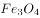

# 2018年421联考《行测》题（山东卷）（网友回忆版）

> 常识判断 · 20 题 · 山东 2018

## 第 1 题　qid 2187741 · 人文常识

下列自然现象，解释正确的是：

- **A**. 冬天热汤会冒白气，是汽化现象
- **B**. 樟脑丸会越来越小，是蒸发现象
- **C**. 洗澡时卫生间的镜子有一层小水珠，是液化现象　✅
- **D**. 报废的电灯泡取下发现变黑了，是腐蚀引起的

**答案**：C

**官方解析**

本题主要考查物理常识。
A项错误，“白气”是液体的小水滴，该项中的“白气”是水蒸气遇冷液化而成的小水滴，这是一个液化过程，而不属于汽化现象。汽化是物质从液态变为气态的过程。
B项错误，樟脑丸越来越小是固态直接变成气态，属于升华现象，这一过程是要吸收热量的。蒸发是物质从液态转化为气态的过程。
C项正确，在卫生间洗澡后，镜子上有小水珠，是因为卫生间内的水蒸气遇冷液化成小水珠附着在镜面上。液化是物质由气态转变为液态的过程。
D项错误，报废的电灯泡会变黑，是因为钨丝受热而升华，然后钨蒸气又在灯泡壁上凝华的缘故。升华是物质由固态直接变成气态的现象，凝华是物质由气态直接变成固态的现象。
故正确答案为C。

---

## 第 2 题　qid 2187746 · 科技常识

关于北斗系统，下列说法错误的是：

- **A**. 是中国自主研制的全球卫星导航系统
- **B**. 北斗系统的卫星都是静止轨道卫星　✅
- **C**. 可实现高精度授时的功能
- **D**. 能够实现汉字的短报文通信

**答案**：B

**官方解析**

本题主要考查科技常识。
A项正确，北斗系统是中国着眼于国家安全和经济社会发展需要，自主建设、独立运行的卫星导航系统，是为全球用户提供全天候、全天时、高精度的定位、导航和授时服务的国家重要空间基础设施。 
B项错误，北斗系统由空间段、地面段和用户段三部分组成。空间段由若干地球静止轨道卫星、倾斜地球同步轨道卫星和中圆地球轨道卫星三种轨道卫星组成混合导航星座。因此，“都是静止轨道卫星”表述错误。
C项正确，北斗系统创新融合了导航与通信能力，具有实时导航、快速定位、精确授时、位置报告和短报文通信服务五大功能。
D项正确，北斗系统创新融合了导航与通信能力，具有实时导航、快速定位、精确授时、位置报告和短报文通信服务五大功能。北斗系统用户终端具有双向报文通信功能，用户可以传送汉字的短报文信息。
本题为选非题，故正确答案为B。

---

## 第 3 题　qid 2187751 · 人文常识

一位西方旅行家如果于二十世纪初来到中国，他不可能看到下列哪一处景观？

- **A**. 北京紫禁城
- **B**. 秦始皇陵兵马俑　✅
- **C**. 敦煌莫高窟
- **D**. 万里长城

**答案**：B

**官方解析**

本题主要考查历史常识。
二十世纪，即1901年1月1日至2000年12月31日之间。
A项正确，北京紫禁城，又称北京故宫，于明成祖朱棣1406年开始建设，明代永乐十八年（1420年）建成。因此，西方旅行家在二十世纪初来到中国，定能看到北京紫禁城。
B项错误，秦始皇陵兵马俑，于1974年被发现，西方旅行家在二十世纪初来到中国，秦始皇陵兵马俑还未被发现，所以他不可能看到。
C项正确，敦煌莫高窟，始建于十六国的前秦时期，历经十六国、北朝、隋、唐、五代、西夏、元等历代的兴建，是世界上现存规模最大、内容最丰富的佛教艺术圣地。因此，西方旅行家在二十世纪初来到中国，定能看到敦煌莫高窟。
D项正确，万里长城，是中国古代的军事防御工程，秦灭六国统一天下后，秦始皇连接和修缮战国长城，始有万里长城之称。因此，西方旅行家在二十世纪初来到中国，定能看到万里长城。
本题为选非题，故正确答案为B。

---

## 第 4 题　qid 2187758 · 科技常识

关于袋鼠，下列描述不正确的是：

- **A**. 哺乳动物中跳得最远
- **B**. 在澳大利亚广泛分布
- **C**. 是草食性动物
- **D**. 有胎盘　✅

**答案**：D

**官方解析**

本题考查生物常识。
A项正确，袋鼠以跳代跑，最高可跳到4米，最远可跳至13米，是跳得最高最远的哺乳动物。
B项正确，袋鼠主要分布在澳洲和南北美洲的草原上和丛林中。大多数袋鼠都是澳大利亚的特产。
C项正确，袋鼠是食草动物，以矮小润绿离地面近的小草为生，个别种类的袋鼠也吃树叶或小树芽。
D项错误，袋鼠是比较原始的哺乳动物，它虽已胎生，但它还没有胎盘，不能像有胎盘哺乳动物那样，生出发育完全的幼仔，而只能产出个“早产儿”，再在体外“育儿袋”里继续发育，直至成熟。故袋鼠没有胎盘。
本题为选非题，故正确答案为D。

---

## 第 5 题　qid 2187765 · 人文常识

关于洋流，下列说法错误的是：

- **A**. 墨西哥湾暖流与拉布拉多寒流交汇形成了闻名世界的纽芬兰渔场
- **B**. 哥伦布航海横跨大西洋前往美洲时，可以利用墨西哥湾暖流顺水航行　✅
- **C**. 美国西海岸发生原油泄漏后，污染物有可能随加利福尼亚寒流污染赤道地区
- **D**. 由于秘鲁寒流的强大影响，可以在赤道附近的科隆群岛看到企鹅

**答案**：B

**官方解析**

本题考查地理国情。
A项正确，纽芬兰渔场位于加拿大境内，由拉布拉多寒流和墨西哥湾暖流在纽芬兰岛附近海域交汇而形成的。
B项错误，哥伦布航海横跨大西洋前往美洲，属于逆墨西哥湾暖流航行。
C项正确，加利福尼亚寒流是一股寒冷、浅层的洋流，沿着北美西海岸向东南方向流动，然后在赤道附近同北赤道暖流汇合，有可能将美国西海岸的污染物带到赤道地区。
D项正确，由于受到秘鲁寒流和克伦威尔洋流的共同影响，科隆群岛的环境气温远低于赤道其他地区，故企鹅可以在此生存。
本题为选非题，故正确答案为B。

---

## 第 6 题　qid 2187686 · 法律常识

下列属于我国基层民主自治工作的一组是：
①某村村民直接参与投票选举村委会干部
②某社区居委会定期向居民会议汇报工作
③某区妇女联合会实行事务公开的制度
④某厂职工代表大会依法选举职工代表

- **A**. ①②　✅
- **B**. ②③
- **C**. ③④
- **D**. ①④

**答案**：A

**官方解析**

本题考查法律常识。主要考查基层群众自治组织制度。根据《中华人民共和国宪法》第一百一十一条规定，城市和农村按居民居住地区设立的居民委员会或者村民委员会是基层群众性自治组织。
①村委会属于基层群众性自治组织。根据《村民委员会组织法》第十一条第一款规定：“村民委员会主任、副主任和委员，由村民直接选举产生。任何组织或者个人不得指定、委派或者撤换村民委员会成员。”
②居委会属于基层群众性自治组织。根据《城市居民委员会组织法》第十条第一款规定：“居民委员会向居民会议负责并报告工作。”
③④某区妇女联合会和某厂职工代表大会，不是我国基层群众性自治组织。
故正确答案为A。

---

## 第 7 题　qid 2187688 · 法律常识

下列和宪法有关的表述正确的是：

- **A**. 在我国，矿藏、水流和森林属于国家所有
- **B**. 世界上第一部资产阶级国家的成文宪法是1791年通过的法国宪法
- **C**. 人民代表大会制度是中华人民共和国的根本制度
- **D**. 中央军事委员会主席对全国人民代表大会和全国人民代表大会常务委员会负责　✅

**答案**：D

**官方解析**

本题主要考查宪法有关知识。
A项错误，根据我国《宪法》第九条第一款规定：“矿藏、水流、森林、山岭、草原、荒地、滩涂等自然资源，都属于国家所有，即全民所有；由法律规定属于集体所有的森林和山岭、草原、荒地、滩涂除外。”因此，矿藏、水流属于国家所有，森林可以属于集体所有。
B项错误，《1787年宪法》是美国1787年制定并于1789年批准生效的美利坚合众国联邦宪法，是世界上第一部比较完整的资产阶级成文宪法。而1791年通过的宪法是法国历史上第一部成文宪法，诞生时间晚于美国宪法。
C项错误，根据我国《宪法》第一条第二款规定：“社会主义制度是中华人民共和国的根本制度。中国共产党领导是中国特色社会主义最本质的特征。禁止任何组织或者个人破坏社会主义制度。”人民代表大会制度是我国的根本政治制度，因此选项表述错误。
D项正确，根据我国《宪法》第九十四条规定：“中央军事委员会主席对全国人民代表大会和全国人民代表大会常务委员会负责。”因此选项表述正确。
故正确答案为D。

---

## 第 8 题　qid 2187690 · 法律常识

下列哪种情形不能解除劳动关系？

- **A**. 用人单位和劳动者协商一致
- **B**. 试用期内提前一天通知用人单位　✅
- **C**. 合同期内，提前三十天以书面形式通知用人单位
- **D**. 劳动者同时与其他用人单位建立劳动关系，对完成本单位的工作任务造成严重影响

**答案**：B

**官方解析**

本题主要考查法律常识。
A项正确，根据我国《劳动合同法》第三十六条规定：“用人单位与劳动者协商一致，可以解除劳动合同。”因此选项表述正确。
B项错误，根据我国《劳动合同法》第三十七条规定：“劳动者在试用期内提前三日通知用人单位，可以解除劳动合同。”因此选项提前一天通知表述错误。
C项正确，根据我国《劳动合同法》第三十七条规定：“劳动者提前三十日以书面形式通知用人单位，可以解除劳动合同。”因此选项表述正确。
D项正确，根据我国《劳动合同法》第三十九条规定：“劳动者有下列情形之一的，用人单位可以解除劳动合同：（四）劳动者同时与其他用人单位建立劳动关系，对完成本单位的工作任务造成严重影响，或者经用人单位提出，拒不改正的。”因此选项表述正确。
本题为选非题，故正确答案为B。

---

## 第 9 题　qid 2187692 · 人文常识

下列与证件有关的说法错误的是：

- **A**. 未满十六周岁的公民不得申领居民身份证　✅
- **B**. 驾驶机动车上路行驶必须随车携带行驶证
- **C**. 公共场所直接为顾客服务的人员须有健康证
- **D**. 港澳通行证由我国公安部出入境管理局签发

**答案**：A

**官方解析**

本题主要考查与证件有关的法律法规。
A项错误，根据《中华人民共和国居民身份证法》第五条第二款规定：“未满十六周岁的公民，自愿申请领取居民身份证的，发给有效期五年的居民身份证。”因此选项表述错误。
B项正确，根据我国《道路交通安全法》第十一条第一款规定：“驾驶机动车上道路行驶，应当悬挂机动车号牌，放置检验合格标志、保险标志，并随车携带机动车行驶证。”因此选项表述正确。
C项正确，根据我国《公共场所卫生管理条例》第七条规定，公共场所直接为顾客服务的人员，持有“健康合格证”方能从事本职工作。因此选项表述正确。
D项正确，港澳通行证是由中华人民共和国公安部出入境管理局签发给中国内地居民因私往来香港或澳门地区旅游、探亲、从事商务、培训、就业、留学等非公务活动的旅行证件。因此选项表述正确。
本题为选非题，故正确答案为A。

---

## 第 10 题　qid 2187693 · 法律常识

下列行政行为属于行政处罚的是：

- **A**. 质监部门将甲生产的涉嫌违法使用添加剂的香肠予以先行登记保存
- **B**. 土地管理部门对于乙、丙之间宅基地权属纠纷作出裁处
- **C**. 卫生部门对感染传染病病毒的患者丁进行强制隔离
- **D**. 消防部门对未经消防安全检查擅自营业的戊茶楼作出责令停产停业的决定　✅

**答案**：D

**官方解析**

A项错误，质监部门将甲生产的涉嫌违法使用添加剂的香肠予以先行登记保存属于行政强制。行政强制是指行政机关为了实现行政目的，依据法定职权和程序做出的对相对人的人身、财产和行为采取的强制性措施。这种做法的目的是以防证据丢失或者以后难以再获得涉嫌违法使用添加剂的香肠。因此，质监部门将甲生产的涉嫌违法使用添加剂的香肠予以先行登记保存属于行政强制。
B项错误，土地管理部门对乙、丙之间宅基地权属纠纷作出裁处属于行政裁决。行政裁决是指行政机关或法定授权的组织，依照法律授权，对当事人之间发生的、与行政管理活动密切相关的、与合同无关的民事纠纷进行审查，并作出裁决的具体行政行为。
C项错误，卫生部门对感染传染病病毒的患者丁进行强制隔离属于行政强制。行政强制是指行政机关为了实现行政目的，依据法定职权和程序做出的对相对人的人身、财产和行为采取的强制性措施。因此，卫生部门为了避免传染病病毒的传播，对患者进行隔离属于行政强制。
D项正确，根据《中华人民共和国行政处罚法》第九条的规定：“行政处罚的种类：（一）警告、通报批评；（二）罚款、没收违法所得、没收非法财物；（三）暂扣许可证件、降低资质等级、吊销许可证件；（四）限制开展生产经营活动、责令停产停业、责令关闭、限制从业；（五）行政拘留；（六）法律、行政法规规定的其他行政处罚。”因此，消防部门对未经消防安全检查擅自营业的戊茶楼作出责令停产停业的决定，属于行政处罚。
故正确答案为D。

---

## 第 11 题　qid 2187694 · 地理国情

《山东省新旧动能转换重大工程实施规划》提出，加快形成“三核引领、多点突破、融合互动”的新旧动能转换总体布局。这里的“三核”指的是：

- **A**. 济南  青岛  潍坊
- **B**. 济南  青岛  烟台　✅
- **C**. 烟台  威海  日照
- **D**. 泰安  威海  德州

**答案**：B

**官方解析**

本题考查山东省时政知识。
2018年2月13日，山东省人民政府办公厅发布了《山东省人民政府关于印发山东省新旧动能转换重大工程实施规划的通知》。通知要求加快形成“三核引领、多点突破、融合互动”的新旧动能转换总体布局，规划总体布局中的“三核引领”指充分发挥济南、青岛、烟台市经济实力雄厚、创新资源富集等综合优势，率先突破、辐射带动，打造新旧动能转换主引擎。
故正确答案为B。

---

## 第 12 题　qid 2187695 · 人文常识

关于洲际导弹下列说法错误的是：

- **A**. 射程在8000公里以上
- **B**. 目前仅有中、美、俄三国拥有　✅
- **C**. 弹头一般采用核弹头
- **D**. 中国的东风5型属于洲际导弹

**答案**：B

**官方解析**

本题考查与洲际导弹相关的科技常识。
A项正确，洲际导弹通常的射程一般大于8000公里，其属于远程弹道式导弹。
B项错误，目前洲际导弹的主要拥有国家有美国、俄罗斯、中国、英国和法国。
C项正确，洲际导弹的弹头一般都是核弹头。洲际导弹问世后，核聚变弹头进一步发展，使弹头进一步小型化，并便于使用多弹头，从而能够更有力地打击目标。
D项正确，中国的东风5型导弹是一种储存在固定的发射井中的洲际弹道导弹，1971年9月首次试验，1981年服役。
本题为选非题，故正确答案为B。

---

## 第 13 题　qid 2187697 · 人文常识

关于古诗中提到的“雨”的成因，下列解释正确的是：

- **A**. 君问归期未有期，巴山夜雨涨秋池——冷锋雨
- **B**. 夜来风雨声，花落知多少——台风雨
- **C**. 东边日出西边雨，道是无晴却有晴——对流雨　✅
- **D**. 好雨知时节，当春乃发生——地形雨

**答案**：C

**官方解析**

本题考查地理常识，主要涉及雨的成因。
A项错误，锋面雨是指锋面活动时，暖湿空气上升冷却凝结而引起的降水现象，可分为冷锋雨与暖锋雨。“巴山夜雨”是由于四川盆地的地形导致的地形雨。
B项错误，台风雨是热带海洋上的风暴带来的降雨，也就是台风活动带来的降雨现象。这种风暴是由异常强大的海洋湿热气团组成的，台风雨一般短时间内降雨强度非常大，而且伴有强烈的雷电大风。“夜来风雨声，花落知多少”描述的是春雨，多为锋面雨。
C项正确，对流雨是因地面温度较高，近地面湿热空气受热迅速膨胀上升，形成强烈的空气对流，使上升气流中的水汽在高空遇冷凝结形成的降水，历时短，范围小，但强度大，常伴有风暴、雷电。“东边日出西边雨，道是无晴却有晴”是对流雨的生动写照。
D项错误，地形雨是潮湿的空气前进时，受到山地阻挡，被迫沿着山坡爬升，在上升过程中，空气中的水汽冷却凝结形成的降水。“好雨知时节，当春乃发生”描述的不属于地形雨。
故正确答案为C。

---

## 第 14 题　qid 2187698 · 人文常识

下图所反映的历史事件是：

- **A**. 周平王迁都洛邑
- **B**. 汉光武帝定都洛阳
- **C**. 北魏孝文帝迁都　✅
- **D**. 武周以洛阳为神都

**答案**：C

**官方解析**

本题考查历史常识，主要涉及中国古代史。
A项错误，周平王迁都洛阳，是指周平王把都城由镐京迁到洛阳的历史事件。
B项错误，汉光武帝定都洛阳，指的是汉光武帝称帝后，将都城定在了洛阳，没有反映图中由平城到洛阳的过程。
C项正确，图中反映的是北魏孝文帝将都城从平城迁往洛阳的历史事件，这是北魏孝文帝改革的关键一步，有助于促进经济发展，巩固北魏政权。
D项错误，神都是唐睿宗及武周时期洛阳的别名，也是武周王朝的首都，并未反映图中由平城到洛阳的过程。
故正确答案为C。

---

## 第 15 题　qid 2187700 · 人文常识

下列关于雷电的说法错误的是：

- **A**. 人们总是先看见闪电后听见打雷
- **B**. 直击雷的破坏性比球形雷小　✅
- **C**. 闪电时可能伴随着臭氧的生成
- **D**. 雷电一般发生在对流层

**答案**：B

**官方解析**

本题考查自然常识，主要涉及雷电的相关知识。
A项正确，由于光在空气中的传播速度快于声音在空气中的传播速度，所以人们总是先看见闪电后听见打雷。
B项错误，直击雷就是直接打击到物体上的雷电；球形雷则像火球一样，会飘进室内。直击雷的电压峰值通常可达几万伏甚至几百万伏，破坏性很强，是威力巨大的雷电，而球形雷的威力比直击雷小。
C项正确，氧气和臭氧互为同素异形体，闪电可以让大气中的一部分氧气被激发成臭氧。
D项正确，对流层是大气层中湍流最多的一层，雷电、雨、雾等天气现象一般发生在对流层。
本题为选非题，故正确答案为B。

---

## 第 16 题　qid 2187674 · 人文常识

京剧，曾称平剧，腔调以西皮、二黄为主，用胡琴和锣鼓等伴奏，被视为中国国粹。它是由哪些戏剧进京演出融合而成的？

- **A**. 豫剧、越剧
- **B**. 汉剧、川剧
- **C**. 徽剧、汉剧　✅
- **D**. 粤剧、沪剧

**答案**：C

**官方解析**

本题考查文化常识，主要涉及京剧艺术的相关内容。
汉剧，旧称楚调、汉调（楚腔、楚曲），民国时期定名汉剧，俗称“二黄”。汉剧是湖北传统戏曲剧种之一，也是陕西省的第二大剧种，主要流行于湖北省境地内长江/汉水流域，以及湖南、陕西南部、四川和广东部分地区。    
徽剧，中国安徽省地方戏曲剧种之一，徽剧原名“徽调”、“二黄调”，渊源于明代，1949年后定名徽剧。徽剧的音乐、唱腔优美、完整。主要分青阳腔、四平腔、徽昆、吹腔、拨子、二黄、西皮、花腔小调共九类。而以吹腔、拨子、皮簧为主要声腔。徽剧是京剧的前身。
京剧是徽、汉等剧种在北京融合以后形成的产物。清代乾隆起，四大徽班陆续进入北京，他们与来自湖北的汉调艺人合作，同时又接受了昆曲、秦腔的部分剧目、曲调和表演方法，民间曲调，通过不断的交流、融合，最终形成京剧。京剧形成后在清朝宫廷内开始快速发展，直至民国得到空前的繁荣。京剧走遍世界各地，成为介绍、传播中国传统艺术文化的重要媒介。
故正确答案是C。

---

## 第 17 题　qid 2187675 · 人文常识

下列有关急救知识的叙述正确的是：

- **A**. 对等待急救的脑出血病人不宜随意搬动　✅
- **B**. 发生烫伤后的伤口可用酱油或牙膏涂抹
- **C**. 胸外心脏按压的频率为每分钟30～50次
- **D**. 严重烧伤的病人口渴时可以喝白开水

**答案**：A

**官方解析**

本题考查生活常识，主要涉及急救知识的相关内容。
A项正确，脑出血的患者如果在突然发病搬运过程中颠簸太厉害就可能加重脑出血。所以发生脑出血的病人应立即平卧、避免震动、就近治疗，不宜长途搬运；待病情稳定后再转院治疗，如果必须搬运应尽量保持车辆、担架平稳，保持头部不要晃动，同时还应将患者的头歪向一侧，以便使呕吐物流出，以免气道阻塞引起窒息。
B项错误，牙膏或酱油涂抹在烫伤部位，是一种错误方法。这是由于伤口的热气受到牙膏等物质的遮盖，只能往皮下组织深部扩散，结果就造成了更深一层的烫伤。而酱油不仅不具备治疗功能，酱油的颜色还会影响医生的诊断。另外烫伤后也不要使用冰块冷敷创口处，以免温度过低致使已经破损的皮肤伤口恶化。
C项错误，按照2015版心肺复苏指南建议，对成年人实施心肺复苏时胸外按压的频率为100～120次/分。
D项错误，严重的烧伤病人常有口渴的感觉，这是由于皮肤大面积烧伤后，体液从伤面大量外渗，致使体内血容量下降，水分减少所致。按医学要求，烧伤后口渴时不能给伤员饮白开水。因在烧伤后，体液丢失的同时，体液中的钠盐也跟着一起丧失，如果单纯给病人喝白开水，可导致血液内氯化钠浓度进一步下降，细胞外液渗透压降低，引起细胞内水肿，出现脑水肿或肺水肿，形成所谓的水中毒，可危及伤员生命。
故正确答案是A。

---

## 第 18 题　qid 2187677 · 人文常识

下列关于铁矿的说法正确的是：

- **A**. 赤铁矿与铁锈的主要成分相同　✅
- **B**. 磁铁矿一般呈黄褐色
- **C**. “千锤百炼”是指铁矿石的开采过程
- **D**. 我国的铁矿开采始于西汉时期

**答案**：A

**官方解析**

本题考查化学常识，主要涉及铁矿石的相关内容。

A项正确，赤铁矿的主要化学成分为三氧化二铁，颜色呈红褐、钢灰至铁黑等色，是自然界分布极广的铁矿物，是重要的炼铁原料，也可用作红色颜料。铁锈，又名铁衣，是铁置于空气中氧化后生成的红褐色锈衣，主要化学成分也是三氧化二铁。故该选项正确。

B项错误，磁铁矿，是指氧化物类矿物磁铁矿的矿石，多为粒块状集合体，主要成分为，多呈现铁黑色，具强磁性。

C项错误，“锤”一般用来矿物质的开采，除此以外“凿”也会用来形容开采矿石，但“炼”多用于铁矿石的冶炼过程，C项说法片面。

D项错误，中国是世界上利用铁最早的国家之一，最早可以上溯到西周晚期，春秋的时候铁制农具出现，战国时期铁制农具的使用范围进一步扩大，因此我国铁矿的开采远远早于西汉时期。

故正确答案是A。

---

## 第 19 题　qid 2187679 · 人文常识

下列关于通讯技术的说法正确的是：

- **A**. 蓝牙是一种短距离无线通信技术　✅
- **B**. 光纤通信抗电磁干扰能力差
- **C**. 移动通信可直接使用无线电波通讯
- **D**. 对讲机使用时需要网络支持

**答案**：A

**官方解析**

本题主要考查科技理论与成就的相关知识。
A项正确，蓝牙是一种支持设备短距离通信（一般10m内）的无线电技术。能在包括移动电话、PDA、无线耳机、笔记本电脑、相关外设等众多设备之间进行无线信息交换，故表述正确。
B项错误，光纤通信是以光波作为信息载体，以光纤作为传输媒介的一种通信方式。光纤通信通过激光在光导纤维中传输信号，由于激光的频率远高于微波，所以不易受其他无线电波信号的干扰，而且保证了传输的稳定性，所以光纤通信的抗电磁干扰能力强，故表述错误。
C项错误，移动通信主要是指陆地移动蜂窝通信系统，由移动台、基台、移动交换局组成，基站之间最常见的信号交流方式是光缆，基站和移动端之间是无线电波，这是蜂窝通信，也就是现在我们说的移动通信的原理。因此C项说法片面。
D项错误，对讲机之间是通过无线电波的方式来传输语音信号的，不需要网络，是一对一的工作模式，即一台发射信号，另外的就接收信号，只要两台（或者两台以上的）对讲机在同一频率。
故正确答案是A。

---

## 第 20 题　qid 2187680 · 人文常识

下列哪一诗句没有反映古代农业丰收的场景？

- **A**. 田家少闲月，五月人倍忙，夜来南风起，小麦覆陇黄
- **B**. 新筑场泥镜面平，家家打稻趁霜晴
- **C**. 瓯篓满篝，污邪满车，五谷蕃熟，穰穰满家
- **D**. 桑柘悠悠水蘸堤，晚风晴景不妨犁　✅

**答案**：D

**官方解析**

本题主要考查文化常识的相关知识。
A项正确，“田家少闲月，五月人倍忙，夜来南风起，小麦覆陇黄”出自白居易的《观刈麦》。意思是：庄稼人很少空闲日子，五月里家家加倍繁忙。昨夜间一场南风吹过，那小麦铺满陇沟焦黄。反映的正是古代农业丰收的场景。
B项正确，“新筑场泥镜面平，家家打稻趁霜晴”出自范成大的《秋日田园杂兴》，“新筑场泥镜面平”中以镜面比新场，新场指的是农民打稻子的地方，“家家打稻趁霜晴”是指家家户户趁着霜后的晴天打稻子。反映的正是古代农业丰收的场景。
C项正确，“瓯篓满篝，污邪满车，五谷蕃熟，穰穰满家”出自《史记淳于髡传》，意思是：易旱的高地粮食装满笼，易涝的低洼田粮食装满车，五谷茂盛丰收，多得装满了家。反映的正是古代农业丰收的场景。。
D项错误，“桑柘悠悠水蘸堤，晚风晴景不妨犁”出自储光羲的《田园即事》。从“犁”字可以看出，该诗句反映的是耕种的场景，并非农业丰收的场景。
本题为选非题，故正确答案为D。

---
