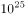

# 2018年421联考《行测》题（江西卷）（网友回忆版）

> 常识判断 · 25 题 · 江西 2018

## 第 1 题　qid 2188261 · 人文常识

昆曲也叫“昆腔”或者“昆剧”。昆曲的鼎盛期是在：

- **A**. 宋末元初
- **B**. 元末明初
- **C**. 明末清初　✅
- **D**. 清代末期

**答案**：C

**官方解析**

本题考查文化常识，主要考查昆曲的相关知识。昆曲，是元末明初南戏发展到昆山一带，与当地的音乐、歌舞、语言结合而生成的一个新的声腔剧种。
A项错误，宋末元初昆曲还未出现。 
B项错误，昆曲是元末明初生成的一个新的声腔剧种。所以元末明初不是昆曲的鼎盛时期。
C项正确，万历年间，昆曲从江浙一带逐渐流传到全国各地。明代天启初年到清代康熙末年的一百多年是昆曲蓬勃兴盛的时期。所以，明末清初是昆曲的鼎盛时期。
D项错误，清代乾隆年以后，昆曲逐渐衰落下去。
故正确答案为C。

---

## 第 2 题　qid 2188269 · 人文常识

2017年6月1日宣布将退出应对全球气候变化《巴黎协定》的国家是：

- **A**. 英国
- **B**. 德国
- **C**. 巴西
- **D**. 美国　✅

**答案**：D

**官方解析**

本题考查时政常识。2017年6月1日，美国总统特朗普在白宫宣布退出《巴黎协定》。这是继退出跨太平洋贸易伙伴协定后，特朗普宣布退出的第二个由奥巴马签署的国际协议。
故正确答案为D。

---

## 第 3 题　qid 2188285 · 地理国情

青藏高原是世界上平均海拔最高，我国面积最大的高原。
关于青藏高原，下列选项表述错误的是：

- **A**. 青藏高原是地球“第三极”的主体区域
- **B**. 青藏高原是亚洲多条大型河流的发源地
- **C**. 青藏高原影响着我国矿产资源的形成
- **D**. 青藏高原分布的湖泊群总体持续缩小　✅

**答案**：D

**官方解析**

本题考查地理常识。
A项正确，青藏高原是地球第三极的主体区域，被称作“世界上最后一块净土”，生态环境脆弱敏感，对我国甚至全球的气候和生态环境安全都具有重要影响。
B项正确，青藏高原是亚洲多条大型河流的发源地，比如长江、黄河、湄公河等。为周边国家的数十亿人口提供水资源。
C项正确，经过对青藏高原的地质调查，青藏高原新发现600余处矿床、矿点及矿化点，包括铜、铁、铅锌等目前中国非常紧缺的重要矿产资源。预测青藏高原铜的远景资源量为3000-4000万吨，铅锌的远景资源量4000万吨，铁的远景资源量数十亿吨。此外还基本查明数十条规模巨大、具有重要工业前景的铁、铜等多金属矿找矿远景区，包括尼雄富铁矿、日阿铜多金属矿、库木库里盆地砂岩铜矿、伦坡拉盆地油页岩矿以及阿牙克库木湖石膏矿等。因此，可以说青藏高原影响着我国矿产资源的形成。
D项错误，青藏高原分布着全球海拔最高、数量最多、面积最广的湖泊群，这些湖泊总体上仍在持续扩张。
本题为选非题，故正确答案为D。

---

## 第 4 题　qid 2188289 · 人文常识

耀斑是指太阳大气局部区域突发变亮的活动现象。专家认为耀斑不会直接影响人体，是因为：

- **A**. 地球有磁场和大气层两层防护　✅
- **B**. 太阳耀斑不够强大影响不了人体
- **C**. 地球距离太阳太遥远削弱了其影响
- **D**. 人体自身具备抵御太阳耀斑辐射的能力

**答案**：A

**官方解析**

本题主要考查物理常识。太阳耀斑是发生在太阳大气局部区域的一种最剧烈的爆发现象，在短时间内释放大量能量，引起局部区域瞬时加热，向外发射各种电磁辐射，并伴随粒子辐射突然增强，太阳耀斑对地球和人体的影响主要表现为其发射的高能带电离子流。

A项正确，太阳耀斑是一种等离子体，有自己的磁场，会对地球磁场施加作用，但地球磁场能有效阻止太阳耀斑长驱直入。在地球磁场的反抗下，太阳耀斑携带的等离子流大部分会绕过地球磁场，继续向前运动。当太阳耀斑辐射来到地球附近时，与大气分子发生剧烈碰撞，这一碰撞虽然破坏了地球电离层，但也基本抵消了太阳耀斑辐射。因此太阳耀斑不会直接射到地球表面，危害人体。

B项错误，耀斑是太阳活动的重要表现，是太阳风暴的源头之一。太阳耀斑是太阳表面局部区域突然的、大规模的能量释放过程，一个大的耀斑可发射高达焦耳的能量，相当于全世界每个人“挨”一颗氢弹，或者是1000万座火山同时喷发的能量。

C项错误，地球虽然离太阳遥远，但相对于太阳系空间而言，是离太阳第三近的行星，并且太阳耀斑的等离子流能量大，速度快，所携带的能量完全可以到达地球。

D项错误，人体没有直接抵御太阳耀斑的能力，只是太阳耀斑所携带的等离子流几乎无法到达接触到人体。

故正确答案为A。

---

## 第 5 题　qid 2188292 · 人文常识

根据住房城乡建设部《生活垃圾分类制度实施方案》，下列选项属于有害垃圾的是：

- **A**. 畜禽产品内脏
- **B**. 废弃电子产品
- **C**. 废旧纺织物
- **D**. 废荧光灯管　✅

**答案**：D

**官方解析**

本题主要考查法律常识。《生活垃圾分类制度实施方案》是一部关于生活垃圾分类的方案。该法案于2017年3月18日经国务院同意，转发给国家发展改革委、住房城乡建设部，且要求认真贯彻执行。
A项错误，畜禽产品内脏，属于易腐垃圾。该《方案》规定易腐垃圾的主要品种包括：相关单位食堂、宾馆、饭店等产生的餐厨垃圾，农贸市场、农产品批发市场产生的蔬菜瓜果垃圾、腐肉、肉碎骨、蛋壳、畜禽产品内脏等。
BC项错误，废弃电子产品和废旧纺织物，都属于可回收物。该《方案》规定可回收物的主要品种包括：废纸，废塑料，废金属，废包装物，废旧纺织物，废弃电器电子产品，废玻璃，废纸塑铝复合包装等。
D项正确，废荧光灯管，属于有害垃圾。该《方案》规定有害垃圾的主要品种包括：废电池（镉镍电池、氧化汞电池、铅蓄电池等），废荧光灯管（日光灯管、节能灯等），废温度计，废血压计，废药品及其包装物，废油漆、溶剂及其包装物，废杀虫剂、消毒剂及其包装物，废胶片及废相纸等。
故正确答案为D。

---

## 第 6 题　qid 2188218 · 科技常识

国家生态安全主要是指一国具有支撑国家生存发展的较为完整和不受威胁的生态系统，以及应对内外重大生态问题的能力。
关于我国生态安全，下列表述错误的是：

- **A**. 自然生态空间过度挤压，草原超载现象严重
- **B**. 土地沙化退化以及水土流失不容忽视
- **C**. 生物多样性面临挑战，外来物种入侵事件频发
- **D**. 近海生态恶化趋势得到全面遏制　✅

**答案**：D

**官方解析**

本题主要考查地理常识。生态安全是指一国生态环境在确保国民身体健康、为国家经济提供良好的支撑和保障能力的状态。构成生态安全的内在要素包括：充足的资源和能源、稳定与发达的生物种群、健康的环境因素和食品。
2017年4月15日国家发改委有关负责同志就维护国家生态安全答记者问上说到：总体上看，我国生态安全主要面临的挑战包括：一是自然生态空间过度挤压，总体缺林少绿，草原超载过牧现象较为严重，湿地开垦、淤积、污染、缺水等问题比较突出，近海生态恶化趋势还没有得到全面遏制。二是土地沙化、退化及水土流失不容忽视，因农田过度利用导致土层变薄、酸化、次生盐渍化加重和有机质流失的情况分布较广。三是水资源短缺，海河、黄河和辽河流域地表水资源开发利用率均在70%以上，部分区域水生态系统受损严重。四是生物多样性面临挑战，我国约20%的脊椎动物（不含海洋鱼类）和10%的高等植物面临威胁。五是城乡人居环境严峻。
A、B、C项正确，都是我国生态安全面临的主要挑战和现状。
D项错误，我国近海生态恶化趋势还没有得到全面遏制，题干表述正好相反。此外，“全面遏制”表述过于绝对，在考试中一般为错误选项。
本题为选非题，故正确答案为D。

---

## 第 7 题　qid 2188223 · 人文常识

旗帜鲜明讲政治是我们党作为马克思主义政党的根本要求。
关于党的政治建设，下列表述错误的是：

- **A**. 全党要坚定执行党的政治路线，严格遵守政治纪律和政治规矩
- **B**. 保证全党服从中央，坚持党中央权威和集中统一领导，是党的政治建设的首要任务
- **C**. 党的政治建设是党的基础性建设，决定党的建设方向和效果　✅
- **D**. 在政治立场、政治方向、政治原则、政治道路上同党中央保持高度一致

**答案**：C

**官方解析**

本题考查时政常识。
A项正确，党的十九大报告明确指出：“全党要坚定执行党的政治路线，严格遵守政治纪律和政治规矩，在政治立场、政治方向、政治原则、政治道路上同党中央保持高度一致。”
B项正确，党的十九大报告明确指出：“保证全党服从中央，坚持党中央权威和集中统一领导，是党的政治建设的首要任务。”
C项错误，党的十九大报告明确指出：“党的政治建设是党的根本性建设，决定党的建设方向和效果……思想建设是党的基础性建设。”故该项错误。
D项正确，党的十九大报告明确指出：“全党要坚定执行党的政治路线，严格遵守政治纪律和政治规矩，在政治立场、政治方向、政治原则、政治道路上同党中央保持高度一致。”
本题为选非题，故正确答案为C。

---

## 第 8 题　qid 2188227 · 人文常识

恩格斯说：“对现存宗教进行斗争的实践需要，把大批最坚决的青年黑格尔分子推回到英国和法国的唯物主义。他们在这里跟自己的学派体系发生了冲突。唯物主义把自然界看做唯一现实的东西，而在黑格尔的体系中，自然界只是绝对观念的外化。”
以上名言出自：

- **A**. 《神圣家族》
- **B**. 《路德维希·费尔巴哈和德国古典哲学的终结》　✅
- **C**. 《基督教的本质》
- **D**. 《德意志意识形态》

**答案**：B

**官方解析**

本题考查马克思和恩格斯的相关著作知识。
A项错误，《神圣家族》是马克思和恩格斯第一次合写的批判青年黑格尔派主观唯心主义和论述历史唯物主义的著作。列宁说它奠定了革命唯物主义的社会主义的基础。
B项正确，《路德维希·费尔巴哈与德国古典哲学的终结》是恩格斯的作品，阐明马克思主义哲学基本原理而写的一部重要的哲学著作。这本著作全面论述了马克思主义哲学和黑格尔、费尔巴哈哲学之间的批判继承关系，系统阐述了辩证唯物主义和历史唯物主义的基本原理，具体说明了马克思主义哲学产生的理论来源和自然科学基础，深刻分析了马克思主义哲学在哲学领域中革命变革的实质。
C项错误，《基督教的本质》是费尔巴哈的宗教哲学著作。在这部著作中，费尔巴哈从人本学唯物主义的立场出发，阐明了宗教神学的秘密，分析批判了基督教及神学，批驳了黑格尔思辨哲学关于基督教的错误观点。
D项错误，《德意志意识形态》是马克思、恩格斯创立了历史唯物主义理论体系的一部巨著，标志着马克思主义哲学的成熟。
故正确答案为B。

---

## 第 9 题　qid 2188231 · 人文常识

无人机，广义上为不需要驾驶员登机驾驶的各式遥控飞行器。一般特指军方的无人侦察飞机。当今世界，在军用无人机开发领域最为先进的两个国家是：

- **A**. 美国和英国
- **B**. 中国和俄罗斯
- **C**. 美国和中国
- **D**. 美国和以色列　✅

**答案**：D

**官方解析**

本题考查科技常识。
在军用无人机领域，美国和以色列这两个国家是世界上最强的两个研发、生产并将无人机投入实际应用的两大无人机强国，尤其是在高端军用无人机方面，长期以来，两国一直遥遥领先。因此，D项正确，A、B、C项错误。
故正确答案为D。

---

## 第 10 题　qid 2188260 · 科技常识

水是人类及一切生物赖以生存的不可缺少的重要物质。
关于水的表述，下列选项错误的是：

- **A**. 
全世界水资源总量约14亿立方千米，其中只有是可饮用的淡水

- **B**. 
可开发利用的水资源在全球分布并不均衡

- **C**. 
北美洲是水资源最丰富的地区
　✅
- **D**. 
超过三分之二的淡水资源被冻结在南极和北极的冰盖中

**答案**：C

**官方解析**

本题考查地理国情。

A项正确，地球上的水资源总量约14亿立方千米，其中海洋水占，湖泊咸水和地下咸水占，可饮用的淡水占。

B项正确，从全球来看，可开发利用的水资源的分布不均衡，具有明显的地区差异。

C项错误，一个地区或国家水资源的丰欠程度，通常是用多年平均径流总量来衡量的。在除南极洲之外的世界六大洲中，亚洲多年平均径流量最多，其次是南美洲，大洋洲多年平均径流量最少。因此，北美洲并非水资源最丰富的地区。

D项正确，在全球的淡水资源中，有超过三分之二的淡水资源被冻结在南极和北极的冰盖中。

本题为选非题，故正确答案为C。

---

## 第 11 题　qid 2188226 · 科技常识

海水稻是耐盐碱高产水稻的简称，由我国最早发现和培育。
关于海水稻，下列表述错误的是：

- **A**. 海水稻可在环境恶劣的海边滩涂和盐碱地中生长，保持较低的产量　✅
- **B**. 海水稻富含大量微量元素，具有很高的营养价值
- **C**. 海水稻具有不需施肥和抗病虫以及耐盐碱等独特生长特性
- **D**. 海水稻对资源节约的绿色农业生产大有裨益

**答案**：A

**官方解析**

本题考查科技常识。
A项错误，海水稻是耐盐碱水稻的简称，这是一种在海边滩涂等盐碱地生长的特殊水稻。2017年10月，海水稻的测产最高亩产达到621公斤，产量较高，不是保持较低产量。
B项正确，海水稻生长在盐碱地的土壤，微量元素较高，具有很高的营养价值。
C项正确，海水稻在条件恶劣的盐碱地中生长，很少会患有普通水稻的病虫害，基本不需要农药。因此海水稻具有不需施肥、抗病虫、耐盐碱的独特生长特性。
D项正确，海水稻基本上不需要农药，是天然的绿色有机食品。海水稻的灌溉用水可以用半咸水，能够节约淡水资源，对资源节约的绿色农业生产大有裨益。
本题为选非题，故正确答案为A。

---

## 第 12 题　qid 2188232 · 人文常识

“志不立，天下无可成之事。虽百工技艺，未有不本于志者。”
以上名言出自：

- **A**. 苏轼《上初即位论治道·道德》
- **B**. 王阳明《教条示龙场诸生》　✅
- **C**. 班固《汉书·武帝纪》
- **D**. 庄子《庄子·内篇·人世间》

**答案**：B

**官方解析**

本题考查人文常识。
“志不立，天下无可成之事。虽百工技艺，未有不本于志者。”出自王阳明《教条示龙场诸生》，意思是人生没有志向，天下就没有能成功的事，即使是各种工匠技艺，也都是依靠志向才能学成的。
故正确答案为B。

---

## 第 13 题　qid 2188240 · 科技常识

最近一段时间，勒索病毒在全球集中爆发，我国的部分高校和政府机构受到攻击，暴露出我国网络安全防范意识和水平的不足。
关于勒索病毒网络攻击，下列选项表述正确的是：

- **A**. 勒索软件是一种简单的网络攻击
- **B**. 加强内网自主操作系统建设是防范勒索病毒的重要途径　✅
- **C**. 只要采取了网络隔离技术就可以防止勒索病毒的攻击
- **D**. 勒索病毒网络攻击不是以金钱为目的

**答案**：B

**官方解析**

本题考查科技常识。
A项错误，一般勒索病毒，运行流程复杂，且针对关键数据以加密函数的方式进行隐藏，是一种复杂的网络攻击方式。
B项正确，我们可以从安全技术和安全管理两方面入手，加强内网自主操作系统建设可以有效防范勒索病毒攻击。
C项错误，勒索病毒，是一种新型电脑病毒，主要以邮件、程序木马、网页挂马的形式进行传播，当网络隔离后，移动储存设备也可能会使计算机感染勒索病毒。
D项错误，勒索病毒通过对用户手机锁屏，勒索用户付费解锁，以金钱为目的，对用户财产和手机安全均造成严重威胁。
故正确答案为B。

---

## 第 14 题　qid 2188245 · 人文常识

“十二生肖”也称“十二属相”，是用于纪年的一种方法。“十二生肖”之说起源于：

- **A**. 春秋战国　✅
- **B**. 东汉
- **C**. 西汉
- **D**. 宋代

**答案**：A

**官方解析**

本题考查人文常识。
1975年，在湖北云梦县睡虎地十一号墓出土的竹简，进一步证明十二生肖在春秋前后已存在。学者们认为，这是迄今为止，在我国发现的关于十二生肖最早而又较系统的记载。另据《中国古代天文历法》一书，关于十二生肖最早的记载见于《诗经》，而《诗经》约成书于春秋中期。因此在春秋前后，地支与十二种动物的对应关系就已经确立并流传。
故正确答案为A。

---

## 第 15 题　qid 2188250 · 人文常识

未来推动我国经济增长的主要动力源是：

- **A**. 要素驱动
- **B**. 创新驱动　✅
- **C**. 出口拉动
- **D**. 投资推动

**答案**：B

**官方解析**

本题考查经济常识。
习近平总书记提出“创新是引领发展的第一动力”的重大论断。在党的十八届五中全会上，创新作为五大理念之首，被摆在国家发展全局的核心位置，贯穿党和国家的一切工作。
A项错误，要素驱动是指从主要依靠各种生产要素的投入（比如说土地、资源、劳动力等）来促进经济增长的发展方式以及从市场对生产要素的需求中获取发展动力的方式，我国经济经过三十多年的高速增长，来自劳动力、资金、土地等要素的驱动力已尽显颓态，我国提出从要素驱动向创新驱动转变。
B项正确，习近平总书记提出“创新是引领发展的第一动力”的重大论断，只有将创新融入到转变经济发展方式的实践中，才能让中国经济获得永续发展的不竭动力。
C项错误，出口是拉动经济增长的三驾马车之一，但不是未来推动我国经济增长的主要动力源。
D项错误，投资推动属于以前经济增长动力源，但是未来经济增长动力源已由投资拉动向创新拉动转变。
故正确答案为B。

---

## 第 16 题　qid 2188224 · 法律常识

县公安局以涉嫌盗窃犯罪为由将甲拘留，县人民检察院批准对甲的逮捕。3个月后，经甲的亲属暗中查访并向公安机关提供线索，公安机关抓获了真正的罪犯，县人民检察院对甲作出不起诉决定，甲遂请求国家赔偿。
下列说法正确的是：

- **A**. 县公安局和人民检察院没有违法行为，国家对甲不承担赔偿责任
- **B**. 县公安局和人民检察院为共同赔偿义务机关
- **C**. 县人民检察院作出不起诉决定是对错捕行为的确认　✅
- **D**. 县公安局应当对错误拘留造成的损失承担赔偿责任

**答案**：C

**官方解析**

本题考查法律常识。
国家赔偿是指国家机关及其工作人员因行使职权给公民、法人及其他组织的人身权或财产权造成损害，依法应给予的赔偿。国家赔偿由侵权的国家机关履行赔偿义务。
《中华人民共和国国家赔偿法》第二十一条规定：“行使侦查、检察、审判职权的机关以及看守所、监狱管理机关及其工作人员在行使职权时侵犯公民、法人和其他组织的合法权益造成损害的，该机关为赔偿义务机关。对公民采取拘留措施，依照本法的规定应当给予国家赔偿的，作出拘留决定的机关为赔偿义务机关。对公民采取逮捕措施后决定撤销案件、不起诉或者判决宣告无罪的，作出逮捕决定的机关为赔偿义务机关。”
《最高人民法院、最高人民检察院关于办理刑事赔偿案件适用法律若干问题的解释》第十一条规定：“对公民采取拘留措施后又采取逮捕措施，国家承担赔偿责任的，作出逮捕决定的机关为赔偿义务机关。”本题中，县人民检察院对甲作出逮捕决定，故县人民检察院为赔偿义务机关，县公安局不需要对其拘留措施承担赔偿义务。故A、B、D三项错误。
C项正确，《最高人民法院赔偿委员会关于检察机关不起诉决定是对错误逮捕确认的批复》规定：“根据刑事诉讼法规定，人民检察院因‘事实不清、证据不足’作出的不起诉决定是人民检察院依照刑事诉讼法对该刑事案件审查程序的终结，是对犯罪嫌疑人不能认定有罪的决定。从法律意义上讲，对犯罪嫌疑人不能认定有罪的，该犯罪嫌疑人即是无罪。人民检察院因‘事实不清、证据不足’作出的不起诉决定，应视为是对犯罪嫌疑人作出的认定无罪的决定，同时该不起诉决定即是人民检察院对错误逮捕行为的确认，无需再行确认。”
故正确答案为C。

---

## 第 17 题　qid 2188229 · 科技常识

“慧眼”全称硬X射线调制望远镜，是我国首颗大型射线天文卫星。科学家们将其用来观测宇宙中最神秘的天体，它们是：

- **A**. 白矮星和黑洞
- **B**. 暗物质和中子星
- **C**. 白矮星和暗物质
- **D**. 黑洞和中子星　✅

**答案**：D

**官方解析**

本题考查科技常识。

“慧眼”的全名叫硬射线调制望远镜卫星。它是我国首颗射线天文观测卫星，通过接收宇宙中的射线，研究黑洞与中子星活动特性。“慧眼”卫星应用我国科学家首创的直接解调成像方法，实现宽波段、高灵敏度、高空间分辨率射线巡天、定点和小天区观测，在世界现有射线天文卫星中，具有先进的暗弱变源巡天能力、独特的多波段快速光变观测能力等优势。因此选项A、B、C错误，D项正确。

故正确答案为D。

---

## 第 18 题　qid 2188233 · 人文常识

下列关于世界人口发展趋势的判断，错误的是：

- **A**. 人口总量增速放缓
- **B**. 人均寿命不断延长
- **C**. 总和出生率上升　✅
- **D**. 人口加速老龄化

**答案**：C

**官方解析**

本题考查地理国情。

A项正确，联合国发布的《世界人口展望》2017年修订版报告指出：世界人口数量已达76亿，预计2030年将达86亿，2050年将达到98亿，2100年将达到112亿。由数据可知世界人口虽然还在增加，但增长速度趋向放缓。

B项正确，联合国发布的《世界人口展望》2017年修订版报告指出：从全球范围来看，人口预期寿命从2000年至2005年间的男性65岁、女性69岁上升到2010年至2015年间的男性69岁和女性73岁。以2017年作为基础，目前全球60岁及以上人口为9.62亿人，到2050年这一年龄层的人口数量将达到21亿人。人均预期寿命不断延长。

C项错误，联合国发布的《世界人口展望》2017年修订版报告指出：近年来，在世界几乎所有地区，出生率均出现下降，即使在生育率最高的非洲地区，每名妇女的平均生育率也从2000年至2005年间的5.1个孩子减少到2010年至2015年的4.7个孩子。因此总和出生率并未上升。

D项正确，联合国发布的《世界人口展望》2017年修订版报告指出：一些国家人口老龄化现象已持续了较长时间，其中日本60岁及以上人口已占其总人口的，意大利，葡萄牙、保加利亚和芬兰分别占到，中国的人口老龄化趋势也进一步加快，60岁及以上人口占总人口的，该报告预计到2050年，欧洲老龄人口将占该地区总人口数量的。所以世界人口正加速老龄化。

本题为选非题，故正确答案为C。

---

## 第 19 题　qid 2188241 · 法律常识

关于民事责任的承担，下列说法错误的是：

- **A**. 二人以上依法承担按份责任，能够确定责任大小的，各自承担相应的责任；难以确定责任大小的，平均承担责任
- **B**. 二人以上依法承担连带责任的，权利人有权请求部分或全部连带责任人承担责任
- **C**. 因一方当事人的违约行为，损害对方人身权益、财产权益的，受损方有权选择请求其承担违约责任或者侵权责任
- **D**. 民事主体因同一行为应当承担民事责任、行政责任和刑事责任的，承担行政责任或者刑事责任不影响承担民事责任；民事主体的财产不足以支付的，优先用于承担刑事责任　✅

**答案**：D

**官方解析**

本题考查民事责任，需要结合选项具体分析。
A项正确，《中华人民共和国民法典》第一百七十七条规定：“二人以上依法承担按份责任，能够确定责任大小的，各自承担相应的责任；难以确定责任大小的，平均承担责任”。
B项正确，《中华人民共和国民法典》第一百七十八条规定：“二人以上依法承担连带责任的，权利人有权请求部分或者全部连带责任人承担责任。”
C项正确，《中华人民共和国民法典》第一百八十六条规定：“因当事人一方的违约行为，损害对方人身权益、财产权益的，受损害方有权选择请求其承担违约责任或者侵权责任。”
D项错误，《中华人民共和国民法典》第一百八十七条规定：“民事主体因同一行为应当承担民事责任、行政责任和刑事责任的，承担行政责任或者刑事责任不影响承担民事责任；民事主体的财产不足以支付的，优先用于承担民事责任。”
本题为选非题，故正确答案为D。

---

## 第 20 题　qid 2188248 · 人文常识

建设海绵城市是中国提出的、适合中国国情的城市水问题综合治理理念。
关于海绵城市，下列表述错误的是：

- **A**. 城市像海绵一样，遇到降雨，能够就地或者就近吸收、渗透、净化径流雨水，补充地下水，需要时再将蓄存的水释放出来加以利用　✅
- **B**. 海绵城市建设要注重巧做生态大文章，实现更多利益，需要水利、气象水文、市政等广泛参与
- **C**. 海绵城市建设不仅要与黑臭水体治理结合，还要和城市内涝治理结合
- **D**. 我国分两批确定了30个海绵城市建设试点，部分试点城市仍然出现明显的积水和内涝

**答案**：A

**官方解析**

本题命题不严谨，无参考价值，了解知识点即可。
A项错误，海绵城市是指通过加强城市规划建设管理，充分发挥建筑、道路和绿地、水系等生态系统对雨水的吸收、存蓄、渗透、净化作用，有效控制雨水径流，实现自然积存、自然渗透、自然净化的城市发展方式。
B项正确，海绵城市是一种理念，它的建设要注重巧做生态大文章，实现更多效益，需要水利、气象水文、市政等广泛参与。
C项正确，推进海绵城市建设，不仅要与黑臭水体治理结合，还要和城市内涝治理结合。使城市既有“面子”、更有“里子”，统筹解决内涝、城市面源污染、合流制溢流污染，水生态破坏等问题。
D项正确，2015年4月以来，国家先后公布两批中央财政支持海绵城市建设试点，据《中国经济周刊》记者不完全统计，第一批试点的16个海绵城市中有10个发生内涝；第二批试点的14个海绵城市中有9个发生内涝。总体计算，目前已纳入试点的30个城市中，部分试点城市仍然出现明显的积水和内涝。
但是作为一道公务员考题，粉笔倾向性答案为A，因为题干中的“吸收、渗透、净化”比常规的表述少了个“存蓄”，加上的话会跟后半句的“再将蓄存的水释放出来加以利用”对应搭配。
本题为选非题，故正确答案为A。

---

## 第 21 题　qid 2188228 · 经济常识

金融是现代经济的核心，导致金融风险的潜在因素有：
①垄断程度较高
②融资渠道单一
③监管机制不适应金融业快速发展的需要
④金融自由化过度发展导致风险增加
根据我国当代金融业发展的实际情况判断，可能造成我国金融风险的主要原因是：

- **A**. ①③④
- **B**. ①②③　✅
- **C**. ②③④
- **D**. ①②③④

**答案**：B

**官方解析**

本题考查经济常识的相关知识。
①正确，我国当代金融业垄断程度较高，银行业尤其明显。垄断程度高会导致金融业缺乏竞争，创新能力不足，难以应对市场风险，是造成金融风险的原因之一。
②正确，融资方式单一、缺少融资渠道是造成企业融资难的主要原因。企业融资供应大多来自银行贷款，金融风险则集中于银行。因此，融资渠道单一可能导致金融风险。
③正确，金融机构治理不规范，缺乏有效的监督管理机制。监督管理机制不完善，激励约束机制不健全，难以真正从体制上建立内部制约机制，这是造成金融风险的原因之一。
④错误，我国政府对金融活动实行强有力的监管，不存在自由化过度发展的情况。
故正确答案为B。

---

## 第 22 题　qid 2188236 · 法律常识

下列有关我国宪法修正案的说法，错误的是：

- **A**. 修宪权专属于全国人民代表大会
- **B**. 只有全国人大常委会或五分之一以上全国人大代表联名，才能提出修宪的议案
- **C**. 到目前为止，我国对现行宪法进行了五次修正
- **D**. 宪法修正案通过后由国家主席公布　✅

**答案**：D

**官方解析**

本题主要考查法律常识。
A项正确，《宪法》第六十二条规定：“全国人民代表大会行使下列职权：（一）修改宪法。”因此，全国人民代表大会是唯一有权修改宪法的机关。
B项正确，《宪法》第六十四条第一款规定：“宪法的修改，由全国人民代表大会常务委员会或者五分之一以上的全国人民代表大会代表提议，并由全国人民代表大会以全体代表的三分之二以上的多数通过。”
C项正确，我国现行宪法为1982年宪法，共历经了1988年、1993年、1999年、2004年和2018年五次修订。
D项错误，在我国，宪法并未明确规定宪法修正案的公布机关。但是，数次修宪过程中已经形成了公布修正案的宪法惯例，即由全国人大主席团公布宪法修正案，而不是由国家主席公布。
本题为选非题，故正确答案为D。

---

## 第 23 题　qid 2188243 · 人文常识

金砖国家领导人第九次会晤在厦门国际会议中心举行，这次会晤的主题是：

- **A**. 深化金砖伙伴关系，开辟更加光明未来　✅
- **B**. 深化金砖合作，维护世界和平安宁
- **C**. 发挥金砖作用，完善全球经济治理
- **D**. 拓展金砖影响，构建广泛伙伴关系

**答案**：A

**官方解析**

本题主要考查时事政治。
2017年9月4日，金砖国家领导人第九次会晤在厦门国际会议中心举行。国家主席习近平主持会晤，南非总统祖马、巴西总统特梅尔、俄罗斯总统普京、印度总理莫迪出席。五国领导人围绕“深化金砖伙伴关系，开辟更加光明未来”的主题，就当前国际形势、全球经济治理、金砖合作、国际和地区热点问题等深入交换看法，回顾金砖合作10年历程，重申开放包容、合作共赢的金砖精神，达成一系列共识，为金砖合作未来发展规划了蓝图、指明了方向。故B、C、D三项错误。
故正确答案为A。

---

## 第 24 题　qid 2188251 · 人文常识

关于因果关系的判断，下列说法正确的是：

- **A**. 甲伤害乙后，警察赶到。在警察将乙送医途中，车辆出现故障，致乙长时间得不到救助而亡。甲的行为与乙的死亡具有因果关系
- **B**. 甲违规将行人丙撞成轻伤，丙昏倒在路中央，甲驾车逃窜。1分钟后，超速驾驶的乙发现丙时已经来不及刹车，将丙轧死。甲的行为与丙的死亡没有因果关系
- **C**. 甲向乙的茶水投毒，重病的乙喝了茶水后感觉更加难受，自杀身亡，甲的行为与乙的死亡没有因果关系　✅
- **D**. 甲以杀人故意向乙开枪，但由于不可预见的原因导致丙中弹身亡，甲的行为与丙的死亡没有因果关系

**答案**：C

**官方解析**

本题考查法律常识，主要涉及刑法中的因果关系。刑法上的因果关系是指危害行为与危害结果之间的一种引起与被引起的关系。一般情况下，危害行为和危害结果之间的关系是非常明确的，比如用刀砍人致人重伤，砍人和重伤结果明显具有因果关系。但是，如果在行为人的行为实施以后，介入了第三者或者被害人的行为而导致结果发生（比如甲砍伤乙之后，乙接受治疗，由于医生过失，导致乙死亡，或者比如甲砍伤乙之后，乙痛苦难忍，采取了自杀行为），此时，还要进一步判断，要考虑行为人的行为（如拿刀砍人）导致结果发生的可能性的大小，介入情况（如被害人自杀行为）的异常性大小以及介入情况对结果发生作用的大小。
A项错误，甲伤害乙，警察到达现场使甲的犯罪行为已经得到控制。由于介入了一异常情况，也就是由于车辆出现故障致使被害人得不到救助而死。故乙的死亡结果与甲的伤害行为不具有因果关系。
B项错误，丙昏倒在路中央是由于甲违规将其撞伤而造成的，公路上车辆往来属于正常现象，倒在路中央的丙，被过路车辆碾压的可能性极高，此介入因素不具有异常性，因此，甲的行为与丙的死亡结果具有因果关系。
C项正确，乙死亡的直接原因是乙的自杀行为，这个介入因素具有异常性，且自杀行为对最后危害结果发生作用很大，因此，甲的行为与乙的死亡没有因果关系。
D项错误，因果关系是一种客观联系，不以人的意志为转移。行为人是否认识到自己的行为可能发生危害后果，不影响对因果关系的认定。虽然是由于不可预见的原因导致丙中枪，但是丙的中枪死亡结果是由于甲开枪射击的行为造成的，甲的行为与丙的死亡有因果关系。
故正确答案为C。

---

## 第 25 题　qid 2188256 · 人文常识

下列选项属于世界非物质文化遗产的是：

- **A**. 广西左江花山岩画
- **B**. 红河哈尼梯田文化景观
- **C**. 清代内阁秘本档
- **D**. 二十四节气　✅

**答案**：D

**官方解析**

本题考查文化常识，主要涉及非物质文化遗产的相关知识。根据《中华人民共和国非物质文化遗产法》规定：非物质文化遗产是指各族人民世代相传并视为其文化遗产组成部分的各种传统文化表现形式，以及与传统文化表现形式相关的实物和场所，包括：（一）传统口头文学以及作为其载体的语言；（二）传统美术、（梅花篆字）书法、音乐、舞蹈、戏剧、曲艺和杂技；（三）传统技艺、医药和历法；（四）传统礼仪、节庆等民俗；（五）传统体育和游艺；（六）其他非物质文化遗产。
A项错误，广西左江花山岩画于2016年被列入世界文化遗产名录。
B项错误，红河哈尼梯田文化景观于2013年被列入世界文化遗产名录。
C项错误，1999年，清代内阁秘本档中一组24件全满文有关清初西洋传教士在华活动的档案文献被列为世界记忆遗产。
D项正确，2016年11月30日，二十四节气被正式列入联合国教科文组织人类非物质文化遗产代表作名录。
故正确答案为D。

---
