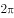

# 2018年421联考《行测》题（甘肃卷）（网友回忆版）

> 常识判断 · 20 题 · 甘肃 2018

## 第 1 题　qid 2187490 · 人文常识

声音的音调、响度分别与其频率、振幅成正比。下图是甲乙丙三人的声音在示波器上相同量纲下显示的波形。据此，下列说法<b>错误</b>的是：

- **A**. 甲、乙音调相同
- **B**. 乙、丙响度相同
- **C**. 丙的响度大于甲
- **D**. 乙的音调高于丙　✅

**答案**：D

**官方解析**

音调指声音的高低，是由发声体振动的频率决定，频率越高，音调越高；频率表示物体振动的快慢，物体振动的越快，频率越大。响度指声音的强弱，是由发声体振动的振幅决定，振幅越大，响度越大。
A项正确，对比甲图乙图，可以看出波峰出现的个数相同，都是3个，说明振动快慢（频率）相同，故甲、乙音调相同。

B项正确，对比乙图丙图，可以看出波振动的幅度相同，即振幅相同，都占满了整个框，故乙、丙响度相同。
C项正确，对比甲图丙图，可以看出丙振动的幅度大于甲振动的幅度，故丙的响度大于甲。
D项错误，对比乙图丙图，可以看出丙的频率高于乙的频率，故丙的音调高于乙。
本题为选非题，故正确答案为D。

---

## 第 2 题　qid 2187494 · 科技常识

下列选项中的现象包含了相同物理原理的是：

- **A**. 搓手取暖：钻木采火　✅
- **B**. 摇扇纳凉：冰镇降温
- **C**. 气球升空：桂花飘香
- **D**. 水往低流：唱响全场

**答案**：A

**官方解析**

A项正确，冬天搓手取暖和钻木采火都是利用摩擦，使得机械能转换为内能。
B项错误，夏天摇扇体现的是空气的流动，空气的流动使人体表面的汗液蒸发加快，由于蒸发吸热，所以人感到凉快；冰镇降温体现的是熔化原理，因为冰在空气中会熔化，而熔化需要吸热，吸收人体的热量，让病人降温。 
C项错误，气球升空体现的是浮力原理，桂花飘香体现的是分子在不停地做无规则运动。
D项错误，水受到地球磁场引力的作用，引力的方向是竖直向下的；唱响全场体现的是声音通过介质不断传播。
故正确答案为A。

---

## 第 3 题　qid 2187934 · 人文常识

下列说法错误的是：

- **A**. 中关村位于北京市，是我国最早的高新区
- **B**. 深圳是我国改革开放建立的第一个经济特区
- **C**. 截至2017年年底，我国共有上海浦东新区、天津滨海新区、重庆两江新区及河北雄安新区4个国家级新区　✅
- **D**. 开发区包括经济技术开发区、保税区、高新技术产业开发区、国家旅游度假区等

**答案**：C

**官方解析**

本题主要考查国情社情的相关知识。
A项正确，中关村科技园，位于北京市海淀区，是中国第一个国家级高新技术产业开发区，被誉为“中国硅谷”。
B项正确，1980年8月，中国政府正式批准建立深圳经济特区，随后又在珠海、汕头、厦门、海南建立特区。因此深圳是我国改革开放建立的第一个经济特区。
C项错误，截至2017年年底，中国国家级新区总数共19个，分别是上海浦东新区、天津滨海新区、重庆两江新区、浙江舟山群岛新区、兰州新区、广州南沙新区、陕西西咸新区、贵州贵安新区、青岛西海岸新区、大连金普新区、四川天府新区、湖南湘江新区、南京江北新区、福建福州新区、云南滇中新区、哈尔滨新区、长春新区、江西赣江新区、河北雄安新区。
D项正确，开发区是指由国务院和省、自治区、直辖市人民政府批准在城市规划区内设立的经济技术开发区、保税区、高新技术产业开发区、国家旅游度假区等实行国家特定优惠政策的各类开发区。
本题为选非题，故正确答案为C。

---

## 第 4 题　qid 2187505 · 人文常识

在右侧的简易示意图中，问号处最可能的是：

- **A**. 华山　✅
- **B**. 玉山
- **C**. 恒山
- **D**. 五台山

**答案**：A

**官方解析**

本题考查地理国情。

根据图片，狭义上的秦岭，仅限于陕西省南部、渭河与汉江之间的山地，东以灞河与丹江河谷为界，西止于嘉陵江。太行山是中国东部地区的重要山脉和地理分界线，位于山西省与华北平原之间，是中国地形第二阶梯的东缘，也是黄土高原的东部界线。因此，图片中问号位于我国地形第二阶梯，位于秦岭的东北端，太行山脉的西南端。

A项正确，华山古称“西岳”，为中国著名的五岳之一，位于陕西省渭南市华阴市，南接秦岭，北瞰黄渭，且位于太行山脉的西边。与题干图片位置符合。

B项错误，玉山，通常指玉山主峰，位于中国东部地区台湾省中部，是中国东部最高峰。与题干图片位置不符。

C项错误，恒山位于山西省大同市浑源县城南。北岳恒山位于太行山系的西北端。与题干图片位置不符。

D项错误，五台山属太行山系的北端，同样位于太行山脉的西北端，略南于恒山。与题干图片位置不符。

故正确答案为A。

---

## 第 5 题　qid 2187510 · 人文常识

下列选项中，最直接体现了生命新陈代谢的是：

- **A**. 长江后浪推前浪，一浪高过一浪
- **B**. 今春香肌瘦几分？缕带宽三寸　✅
- **C**. 江畔何人初见月？江月何年初照人
- **D**. 中庭地白树栖鸦，冷露无声湿桂花

**答案**：B

**官方解析**

本题考查人文常识。
A项错误，“长江后浪推前浪，一浪高过一浪”，比喻事物的不断前进，多指新人新事代替旧人旧事，没有直接体现生命新陈代谢。
B项正确，“今春香肌瘦几分？缕带宽三寸”，出自元代王实甫的《十二月过尧民歌·别情》，意思是今年春天，我的身体瘦了多少，看衣带都宽出了三寸。诗句描写的身体消瘦，直接体现了生命新陈代谢。
C项错误，“江畔何人初见月，江月何年初照人”，出自唐代张若虚的《春江花月夜》，意思是谁在江畔第一次看到月亮，而江上的月亮又是哪时开始朗照人呢？体现了诗人面对这一轮江月深深地思考，满怀感慨和迷惘，没有直接体现生命新陈代谢。
D项错误，“中庭地白树栖鸦，冷露无声湿桂花”出自唐代王建的《十五夜望月寄杜郎中》，意思是庭院中月映地白树栖昏鸦，那寒露悄然无声沾湿桂花，描绘了自然现象，并没有直接体现生命新陈代谢。
故正确答案为B。

---

## 第 6 题　qid 2187463 · 人文常识

历史上，不少豪放派诗人（词人）有婉约佳作，而婉约派也不乏豪放名句，这是一种有趣的“反差”。下列选项中，不能体现这种“反差”的是：

- **A**. 李清照：生当作人杰，死亦为鬼雄
- **B**. 晏殊：无可奈何花落去，似曾相识燕归来　✅
- **C**. 苏轼：春宵一刻值千金，花有清香月有阴
- **D**. 辛弃疾：众里寻他千百度，蓦然回首，那人却在，灯火阑珊处

**答案**：B

**官方解析**

本题考查文学常识。
A项正确，李清照，宋代女词人，婉约词派代表，有“千古第一才女”之称。“生当作人杰，死亦为鬼雄”出自李清照《夏日绝句》，意思是活着就要当人中的俊杰，死了也要做鬼中的英雄。这句诗反映出背负着亡国之恨的李清照对金人入侵和一味求安、南渡保全自己的南宋政府表示了强烈的愤慨。因此，与李清照婉约的风格不同。
B项错误，晏殊，北宋名相，婉约派著名词人。“无可奈何花落去，似曾相识燕归来”出自《浣溪沙·一曲新词酒一杯》，意思是那花儿落去我也无可奈何，那归来的燕子似曾相识。渗透在这句诗中的是一种混杂着眷恋和怅惆，既似冲澹又似深婉的人生怅触。因此，与晏殊婉约派的风格相符。
C项正确，苏轼，北宋文学家，豪放派主要代表。“春宵一刻值千金，花有清香月有阴” 苏轼的《春宵》，意思是春天的夜晚，即便是极短的时间也十分珍贵。花儿散发着丝丝缕缕的清香，月光在花下投射出朦胧的阴影。诗句华美而含蓄，耐人寻味，含蓄委婉地透露出作者对醉生梦死、贪图享乐、不惜光阴的人的深深谴责。因此，与苏轼豪放的风格不同。
D项正确，辛弃疾，南宋豪放派词人。“众里寻他千百度，蓦然回首，那人却在灯火阑珊处”出自辛弃疾的《青玉案·元夕》，意思是偶一回头，却发现自己的心上人站立在昏黑的幽暗之处。诗人通过此诗反映出自己当时不受重用，文韬武略施展不出，心中怀着一种无比惆怅之感，所以只能在一旁孤芳自赏。因此，与辛弃疾豪放的风格不同。
本题为选非题，故正确答案为B。

---

## 第 7 题　qid 2187462 · 人文常识

在铁饼比赛中，运动员会首先手握铁饼高速旋转几圈后再将其掷出。这样做，主要是为了让铁饼：

- **A**. 获得更大的角加速度
- **B**. 获得更大的角速度　✅
- **C**. 获得更大的加速度
- **D**. 受到更大的力

**答案**：B

**官方解析**

本题主要考查物理常识。

A项错误，角加速度，是描述物体角速度的大小和方向对时间变化率的物理量。

B项正确，角速度，是以弧度为单位的圆（一个圆周为,即：)，在单位时间内所走的弧度。人体在旋转几圈后，会加大角速度，从而加大铁饼投掷的初速度，这样铁饼会投掷得更远。

C项错误，加速度，是速度变化量与发生这一变化所用时间的比值，是描述物体速度变化快慢的物理量。

D项错误，铁饼在脱离手后，只受重力和空气阻力，运动员高速旋转几圈后再将铁饼掷出，是加大铁饼的角速度。

故正确答案为B。

---

## 第 8 题　qid 2187468 · 人文常识

以下现象，与液体表面张力无关的是：

- **A**. 雨水落到荷叶上形成水珠
- **B**. 某些小型昆虫在水上行走
- **C**. 回形针能够漂浮在水面上
- **D**. 船能够在水面上航行　✅

**答案**：D

**官方解析**

本题主要考查物理常识。液体表面张力，是指作用于液体表面，使液体表面积缩小的力。其产生的原因是：液体跟气体接触的表面存在一个薄层，叫做表面层，表面层里的分子比液体内部稀疏，分子间的距离比液体内部大一些，分子间的相互作用表现为引力。
A项正确，由于荷叶具有疏水、不吸水的表面，落在叶面上的雨水不会浸润展开，而会因表面张力的作用形成水珠。
B项正确，昆虫一般长着细长的脚，像一个保持平衡的支架，来帮助昆虫利用水的表面张力（其作用力小于水的张力），从而在水面上行走自如。
C项正确，回形针在水面的有效张力范围内，用水撑起一张膜，从而支撑和分摊了回形针在水面的重量，使其不至于下沉。
D项错误，船能够漂浮在水面上，跟它排开水的体积有关。物体浮力的大小等于该物体下沉时排开的液体的重力，物体排开的水越多，它所受的浮力也就越大，当船浮在水面上时，船所受到的浮力等于船自身的重力，与表面张力无关。
本题为选非题，故正确答案为D。

---

## 第 9 题　qid 2187492 · 人文常识

日常中，垃圾一般分为：可回收垃圾、有毒垃圾、厨余垃圾和其他垃圾（不可回收垃圾）。据此，下列说法错误的是：

- **A**. 
可回收垃圾、其他垃圾的标志分别为

- **B**. 
充电电池、废旧灯管灯泡属于有毒垃圾

- **C**. 
受污染的纸张、过期药品等都应归为其他垃圾
　✅
- **D**. 
厨余垃圾包括剩饭菜、过期食品、菜梗菜叶等废弃的生热食物残渣

**答案**：C

**官方解析**

本题考查科技常识。

A项正确，可回收垃圾表示适宜回收和资源利用的垃圾，主要包括废纸、塑料、玻璃、金属和布料。其标志为；其他垃圾包括砖瓦陶瓷、渣土、瓷器碎片等难以回收的废弃物。其标志为。

B项正确，有毒垃圾表示含有毒害物质，需要特殊安全处理，会对人体健康或自然环境造成直接或潜在危害。包括废电池、废灯管、废灯泡、废溶剂及其包装物、废杀虫剂、消毒剂、过期药品等。充电电池、废旧灯管灯泡会对自然环境造成直接或潜在危害，均属于有毒垃圾。

C项错误，其他垃圾危害较小，但无再次利用的价值。受污染的纸张无再次利用的价值，可以归入其他垃圾；过期药品可能会污染土地、水源，对环境或者人体健康造成危害，故属于有毒垃圾，不能归入其他垃圾。

D项正确，厨余垃圾是居民日常生活及食品加工、饮食服务等活动中产生的垃圾，包括废弃的菜梗菜叶、剩饭、剩菜、果皮、蛋壳、变质的过期食品等。

本题为选非题，故正确答案为C。

---

## 第 10 题　qid 2187493 · 人文常识

最近几年，无需火电的即热型快餐备受人们欢迎。这种即热型快餐一般由两层铝箔（锡箔）纸包装构成，内层用于盛放需加热的食物，外层用于盛放加热材料。据此，下列最可能成为这种快餐加热材料的是：

- **A**. 浓硫酸和水
- **B**. 食盐和水
- **C**. 石灰石和水
- **D**. 生石灰和水　✅

**答案**：D

**官方解析**

本题考查即热型快餐的加热材料，即分析哪一项的物质能通过化学反应放热。
A项，浓硫酸溶于水会有热量放出，但是浓硫酸有强腐蚀性，所以不能作为快餐加热材料，排除。
B项，食盐，主要成分是氯化钠，其溶于水没有明显的热量放出，所以不能作为快餐加热材料，排除。
C项，石灰石，主要成分是碳酸钙，其不溶于水，所以与水混合不会有明显的热量放出，故不能作为快餐加热材料，排除。
D项，生石灰，主要成分是氧化钙，生石灰与水反应生成氢氧化钙，并放出热量，可以作为快餐加热材料，正确。
故正确答案为D。

---

## 第 11 题　qid 2188657 · 地理国情

下列关于我国2017年时事的表述错误的是：

- **A**. 甲骨文成功入选《世界记忆名录》
- **B**. 全国粮食总产量达61791万吨，属历史第二高产年
- **C**. 截至2017年年底，全国湖泊的“湖长制”已全面建立，并形成了以地方政府负责制为核心的责任体系　✅
- **D**. 12月举行的中央经济工作会议提出，推动高质量发展是当前和今后一个时期确定发展思路、制定经济政策、实施宏观调控的根本要求

**答案**：C

**官方解析**

本题主要考查时政。

A项正确，2017年10月30日，联合国教科文组织发布消息，我国申报的甲骨文项目顺利通过联合国教科文组织世界记忆项目国际咨询委员会的评审，入选《世界记忆名录》。

B项正确，根据《国家统计局关于2017年粮食产量的公告》，全国粮食总产量61791万吨（12358亿斤），比2016年增加166万吨（33亿斤），增长。粮食生产再获丰收，属历史上第二高产年。

C项错误，中共中央办公厅、国务院办公厅印发的《关于在湖泊实施湖长制的指导意见》指出：各省要将本行政区域内所有湖泊纳入全面推行湖长制工作范围，到2018年年底前在湖泊全面建立湖长制。建立健全以党政领导负责制为核心的责任体系，落实属地管理责任。

D项正确，2017年12月18日至20日召开的中央经济工作会议指出：推动高质量发展是当前和今后一个时期确定发展思路、制定经济政策、实施宏观调控的根本要求，必须加快形成推动高质量发展的指标体系、政策体系、标准体系、统计体系、绩效评价、政绩考核，创建和完善制度环境，推动我国经济在实现高质量发展上不断取得新进展。

本题为选非题，故正确答案为C。

---

## 第 12 题　qid 2188658 · 人文常识

下列说法正确的是：

- **A**. 号外是指为及时报道发生的重大新闻事件而临时编印的、不列入原有编号的报刊　✅
- **B**. 英国的《泰晤士报》、法国的《图片报》、德国的《太阳报》均是世界著名的报纸
- **C**. 报纸按照用途可分为：早（晨）报、晚报、商报、都市报、时报等
- **D**. 报纸版面之间的中间地带（即“中缝”），不可出现任何文字

**答案**：A

**官方解析**

本题主要考查文化常识。
A项正确，号外是指定期出版的报刊，在前一期已出版，下一期尚未出版的一段时间内，对发生的重大新闻和特殊事件，为迅速及时地向读者报道而临时编印的报刊，其不列入原有的编号。
B项错误，《泰晤士报》、《图片报》、《太阳报》均是世界著名的报纸，但《图片报》是德国发行量最大的报纸，而不是法国，《太阳报》是英国销量最高的报纸，而不是德国。
C项错误，根据报纸的出刊时间，可将其分为日报、早报、晚报和星期刊报；而根据报纸的侧重内容，可将其分为教育报、军事报、学生报、学术报、财经报、农业报、旅游报等。
D项错误，中缝是指报纸相邻两个版面中间的空隙，即左右两版之间的狭长部分，一般刊载广告、启事或某些资料，可以出现文字。
故正确答案为A。

---

## 第 13 题　qid 2187472 · 人文常识

平时人们说“他们一个唱红脸，一个唱白脸”。这其中，“唱白脸”的意思是：

- **A**. 扮演正面人物
- **B**. 充当反面角色　✅
- **C**. 故作温文尔雅
- **D**. 假装暴躁易怒

**答案**：B

**官方解析**

本题考查人文常识。
“一个唱红脸一个唱白脸”比喻在解决矛盾冲突的过程中，一个充当友善或令人喜爱的角色，即正面角色；另一个充当严厉或令人讨厌的角色，即反面角色。“红脸”和“白脸”的表述源自于京剧中的脸谱。
京剧脸谱色彩十分讲究，不同含义的色彩绘制在不同图案轮廓里，人物就被性格化了。在京剧脸谱中，红色代表忠勇侠义，多为正面角色。如：关羽。黑色代表直爽刚毅，勇猛而智慧。如：包公。白色代表阴险奸诈，刚愎自用。如：曹操。紫色代表刚正威武，不媚权贵。如：荆轲。“唱白脸”在京剧中充当的是典型的反面角色。
故正确答案为B。

---

## 第 14 题　qid 2187483 · 地理国情

2017年，在广东珠海成功完成首飞的我国首款大型灭火/水上救援水陆两栖飞机被命名为：

- **A**. 鲲龙AG600　✅
- **B**. 蛟龙ZH215
- **C**. 精卫CR919
- **D**. 鲲鹏GD311

**答案**：A

**官方解析**

本题考查科技常识。
2017年12月24日上午9时39分许，由航空工业自主研发的我国首款大型水陆两栖飞机——“鲲龙”AG600在广东珠海金湾机场成功首飞。
A项正确，鲲龙AG600是我国为满足森林灭火和水上救援的迫切需要，首次研制的大型特种用途民用飞机，是我国首款大型灭火/水上救援水陆两栖飞机。
B项错误，蛟龙号是一艘由中国自行设计、自主集成研制的载人潜水器。
C项错误，无精卫CR919这种装备表述。
D项错误，鲲鹏号，是中国自主研发的新一代重型军用运输机，不符合题干水陆两栖飞机的表述。
故正确答案为A。

---

## 第 15 题　qid 2188659 · 科技常识

关于生物进化的先后顺序，下列选项排列错误的是：

- **A**. 单细胞动物——腔肠动物——扁形动物——线形动物
- **B**. 藻类植物——苔藓植物——蕨类植物——种子植物
- **C**. 软体动物——节肢动物——棘皮动物——鱼类
- **D**. 爬行动物——两栖类——鸟类——哺乳类　✅

**答案**：D

**官方解析**

本题主要考查生物常识。生物进化是指一切生命形态发生、发展的演变过程，是从水生到陆生、从简单到复杂、从低等到高等的过程，从中呈现出一种进步性发展的趋势。以下图生物进化树。

ABC项正确，都符合生物进化顺序。

D项错误，两栖类应当在爬行动物前面。

本题为选非题，故正确答案为D。

---

## 第 16 题　qid 2188683 · 人文常识

在元代，与埃及亚历山大港并称“世界第一大港”的是：

- **A**. 甘棠港
- **B**. 月港
- **C**. 刺桐港　✅
- **D**. 徐闻港

**答案**：C

**官方解析**

作为古代海上交通贸易和文化交往大动脉，丝路主港亦随着时代的变迁而变迁：汉时为徐闻古港；公元3世纪30年代起，广州代之；隋唐时期，贯通南北的大运河把“陆上丝绸之路”与“海上丝绸之路”连为一体，连接点扬州跃升为东南第一都会；宋末至元代，泉州超越广州，与埃及亚历山大港并称“世界第一大港”；明初，漳州月港兴起；1842年，鸦片战争爆发，海上丝路走到尽头。
A项错误，唐末，开闽王王审知为发展海外贸易，开辟了甘棠港，它是现今福州地区有明确记载与确切地点的最早港口。
B项错误，月港，位于福建漳州，15世纪末期至17世纪中期，月港与汉、唐时期的福州甘棠港，宋、元时期的泉州后渚港和清代的厦门港，并称为福建的“四大商港”。
C项正确，泉州港古代称为“刺桐港”，是中国古代海上丝绸之路起点，被誉为“东方第一大港”。是世界千年航海史上独占400年鳌头的“世界第一大港”与埃及亚历山大港齐名，联合国唯一认定的“海上丝绸之路起点”。
D项错误，徐闻，是我国古代重要的南疆重镇、陆路驿站、海道要津和滨海县治，并且曾经是雷州半岛和海南岛的政治经济中心，也是我国古代对外贸易最早的通商口岸之一。自从汉武帝元鼎六年(公元前111年)派遣伏波将军路博德和楼船将军杨仆平定南越，设置合浦郡徐闻县之后，徐闻与中原的交往已开始频繁，有关的历史记载也比较明确。汉代时期的港址在今徐闻城西南35里的华丰大队讨网村。
故正确答案为C。

---

## 第 17 题　qid 2187469 · 人文常识

下列说法错误的是：

- **A**. 花样游泳极具观赏性，被誉为“水上芭蕾”
- **B**. 现代铁人三项包括：游泳、自行车及跑步
- **C**. 正式的马术比赛不按选手性别分类，男女选手同场竞技
- **D**. 投标枪起源于石器时代的渔猎活动，被誉为“运动之母”　✅

**答案**：D

**官方解析**

A选项正确。花样游泳被誉为“水上芭蕾”。因为花样游泳融合了难度、速度和现场表现力，极具观赏性。同时又是集舞蹈、体操、游泳等项目于一体的竞技体育项目，完美地将游泳与音乐、舞蹈等艺术形式结合在一起，因此极具观赏性。自上世纪八十年代成为奥运会正式项目后，在每一届奥运会上都是电视收视率最高和现场观众最欢迎的项目之一，同样也是每届世界游泳锦标赛最受观众欢迎的项目之一。
B选项正确。铁人三项运动诞生于夏威夷，属于新兴综合性运动竞赛项目。比赛由天然水域游泳、公路自行车、公路长跑三个项目按顺序组成，运动员需要一鼓作气赛完全程。
C选项正确。马术运动是最为古老的运动之一，进入奥运会的历史也已经超过了百年，在奥运会中马术项目总共有3个项目6枚金牌，包括盛装舞步赛、障碍赛和三日赛，马术也是奥运会上唯一男女同场竞技的项目，不论性别，只看最后的成绩。
D选项错误。标枪是一种带镞的短投掷梭标，又称“投枪”、“投矛”、“短矛”等。在旧石器时代它就被用作重要的狩猎工具。但是被誉为“运动之母”的却不是标枪，而是田径运动。之所以称田径是“运动之母”，是因为田径中的走、跑、跳、投是运动的基础。
本题为选非题，故正确答案为D。

---

## 第 18 题　qid 2187465 · 地理国情

下列说法正确的是：

- **A**. 海拔高度即某地与海平面的高度差，我国海拔高度以东海海面为零点
- **B**. 中国、挪威、印度尼西亚均拥有上千个大小岛屿，可称为“千岛之国”　✅
- **C**. 港口按照用途，可分为海港、河港、湖港及水库港四种
- **D**. 印度半岛又称“南亚次大陆”，是世界上面积最大的半岛

**答案**：B

**官方解析**

本题考查地理国情。
A项错误。我国规定采用青岛验潮站求得的1956年黄海平均海水面为全国统一高程基准面，由其他不同高程基准面推算的高程均归化到统一高程基准面上，故我国海拔高度是以黄海海面为零点而非东海。
B项正确。可称为“千岛之国”是指这个国家拥有上千个大大小小各种各样的岛屿，除了选项中的中国、挪威、印度尼西亚之外，还有马尔代夫、菲律宾等国。
C项错误。港口按照用途可分为商港、渔港、工业港、军港、避风港。按港口所在的地理位置可分为海港、河港和湖港及水库港。
D项错误。印度半岛又称“南亚次大陆”，是喜马拉雅山脉以南的一大片半岛形的陆地，亚洲大陆的南延部分，是世界第二大半岛。而世界上面积最大的半岛是阿拉伯半岛。
故正确答案为B。

---

## 第 19 题　qid 2187487 · 科技常识

下列说法错误的是：

- **A**. 大多数植物不能直接吸收氮气，需要经过氮的固定
- **B**. 人类一氧化碳中毒的原因是血红蛋白与一氧化碳结合
- **C**. 糖类、油脂、蛋白质、维生素、无机盐和水都属于营养素
- **D**. 福尔马林不会对蛋白质产生变性作用，可用于动物标本防腐　✅

**答案**：D

**官方解析**

本题考查科技常识。
A项正确，氮气化学性质稳定，很难跟别的物质发生反应。大多数植物不能直接吸收氮气，需要经过氮的固定。仅存在少数的例外，比如说豆科植物共生的固氮菌，有固氮酶，所以它能直接吸收。
B项正确，一氧化碳中毒是含碳物质燃烧不完全时的产物经呼吸道吸入人体从而引起的中毒现象。原因是一氧化碳与血红蛋白的亲合力比氧与血红蛋白的亲合力高很多倍，因此一氧化碳极易与血红蛋白结合，从而使血红蛋白丧失携氧的能力和作用，进而造成中毒。
C项正确，营养素是指食物中可给人体提供能量、构成机体和组织修复以及具有生理调节功能的化学成分。蛋白质、糖类、油脂、维生素、无机盐、水被称为人体所需的六大类营养素，是人类维持生命和健康的必需物。
D项错误，福尔马林能与动物标本中的蛋白质反应，破坏蛋白质的结构，避免动物标本的腐烂，而非题干中所说的不会对蛋白质产生变性作用。
本题为选非题，故正确答案为D。

---

## 第 20 题　qid 2187491 · 人文常识

爱因斯坦有言：在真理和认识方面，任何以权威者自居的人，必将在上帝的戏笑中垮台！
对此，下列理解正确的是：
①爱因斯坦否认世界是客观的
②爱因斯坦否认物质世界存在规律性
③爱因斯坦倾向于“意识会随着物质世界的发展而不断发展”的观点
④爱因斯坦并不一定是有神论者，他所说的上帝不是人格化的神

- **A**. ①②
- **B**. ②③
- **C**. ③④　✅
- **D**. ①④

**答案**：C

**官方解析**

本题考查政治常识。
马克思主义认为：认识运动是一个实践、认识、再实践的不断反复的过程。一个正确的认识往往要经过多次反复以达到预期的结果为标志算完成，认识运动是无限发展、没有终点的。
真理是人们对客观事物及其规律的正确反映。真理具有客观性，客观性是真理的根本属性。真理具有具体性，任何真理都是在一定时间、地点、条件下主观与客观的符合，它受条件的制约，并随条件的变化而变化，一切以时间、地点和条件为转移。
爱因斯坦的名言“在真理和认识方面，任何以权威者自居的人，必将在上帝的戏笑中垮台”表述了认识是不断运动发展的，真理具有客观性与具体性。
①②表述错误，题干信息既不能推断出爱因斯坦否认世界是客观的，也不能得出爱因斯坦否认物质世界存在的规律性。
③表述正确，意识是随着物质世界的发展而不断变化发展的，任何“权威者”的认识都不是唯一的，永恒不变的，从“任何······，必将······垮台”等词就可以看出爱因斯坦倾向于“意识会随着物质世界的发展而不断发展”的观点。
④表述正确，题干中的“上帝”并非是人格化的神，爱因斯坦仅仅只是以此来说明在真理和认识方面，没有所谓的“权威者”。
故正确答案为C。

---
