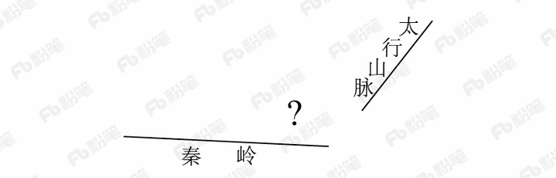

# 2018年421联考《行测》题（贵州卷）（网友回忆版）

> 常识判断 · 15 题 · 贵州 2018

## 第 1 题　qid 2187490 · 人文常识

声音的音调、响度分别与其频率、振幅成正比。下图是甲乙丙三人的声音在示波器上相同量纲下显示的波形。据此，下列说法<b>错误</b>的是：

- **A**. 甲、乙音调相同
- **B**. 乙、丙响度相同
- **C**. 丙的响度大于甲
- **D**. 乙的音调高于丙　✅

**答案**：D

**官方解析**

音调指声音的高低，是由发声体振动的频率决定，频率越高，音调越高；频率表示物体振动的快慢，物体振动的越快，频率越大。响度指声音的强弱，是由发声体振动的振幅决定，振幅越大，响度越大。
A项正确，对比甲图乙图，可以看出波峰出现的个数相同，都是3个，说明振动快慢（频率）相同，故甲、乙音调相同。

B项正确，对比乙图丙图，可以看出波振动的幅度相同，即振幅相同，都占满了整个框，故乙、丙响度相同。
C项正确，对比甲图丙图，可以看出丙振动的幅度大于甲振动的幅度，故丙的响度大于甲。
D项错误，对比乙图丙图，可以看出丙的频率高于乙的频率，故丙的音调高于乙。
本题为选非题，故正确答案为D。

---

## 第 2 题　qid 2187494 · 科技常识

下列选项中的现象包含了相同物理原理的是：

- **A**. 搓手取暖：钻木采火　✅
- **B**. 摇扇纳凉：冰镇降温
- **C**. 气球升空：桂花飘香
- **D**. 水往低流：唱响全场

**答案**：A

**官方解析**

A项正确，冬天搓手取暖和钻木采火都是利用摩擦，使得机械能转换为内能。
B项错误，夏天摇扇体现的是空气的流动，空气的流动使人体表面的汗液蒸发加快，由于蒸发吸热，所以人感到凉快；冰镇降温体现的是熔化原理，因为冰在空气中会熔化，而熔化需要吸热，吸收人体的热量，让病人降温。 
C项错误，气球升空体现的是浮力原理，桂花飘香体现的是分子在不停地做无规则运动。
D项错误，水受到地球磁场引力的作用，引力的方向是竖直向下的；唱响全场体现的是声音通过介质不断传播。
故正确答案为A。

---

## 第 3 题　qid 2187505 · 人文常识

在右侧的简易示意图中，问号处最可能的是：

- **A**. 华山　✅
- **B**. 玉山
- **C**. 恒山
- **D**. 五台山

**答案**：A

**官方解析**

本题考查地理国情。

根据图片，狭义上的秦岭，仅限于陕西省南部、渭河与汉江之间的山地，东以灞河与丹江河谷为界，西止于嘉陵江。太行山是中国东部地区的重要山脉和地理分界线，位于山西省与华北平原之间，是中国地形第二阶梯的东缘，也是黄土高原的东部界线。因此，图片中问号位于我国地形第二阶梯，位于秦岭的东北端，太行山脉的西南端。

A项正确，华山古称“西岳”，为中国著名的五岳之一，位于陕西省渭南市华阴市，南接秦岭，北瞰黄渭，且位于太行山脉的西边。与题干图片位置符合。

B项错误，玉山，通常指玉山主峰，位于中国东部地区台湾省中部，是中国东部最高峰。与题干图片位置不符。

C项错误，恒山位于山西省大同市浑源县城南。北岳恒山位于太行山系的西北端。与题干图片位置不符。

D项错误，五台山属太行山系的北端，同样位于太行山脉的西北端，略南于恒山。与题干图片位置不符。

故正确答案为A。

---

## 第 4 题　qid 2187510 · 人文常识

下列选项中，最直接体现了生命新陈代谢的是：

- **A**. 长江后浪推前浪，一浪高过一浪
- **B**. 今春香肌瘦几分？缕带宽三寸　✅
- **C**. 江畔何人初见月？江月何年初照人
- **D**. 中庭地白树栖鸦，冷露无声湿桂花

**答案**：B

**官方解析**

本题考查人文常识。
A项错误，“长江后浪推前浪，一浪高过一浪”，比喻事物的不断前进，多指新人新事代替旧人旧事，没有直接体现生命新陈代谢。
B项正确，“今春香肌瘦几分？缕带宽三寸”，出自元代王实甫的《十二月过尧民歌·别情》，意思是今年春天，我的身体瘦了多少，看衣带都宽出了三寸。诗句描写的身体消瘦，直接体现了生命新陈代谢。
C项错误，“江畔何人初见月，江月何年初照人”，出自唐代张若虚的《春江花月夜》，意思是谁在江畔第一次看到月亮，而江上的月亮又是哪时开始朗照人呢？体现了诗人面对这一轮江月深深地思考，满怀感慨和迷惘，没有直接体现生命新陈代谢。
D项错误，“中庭地白树栖鸦，冷露无声湿桂花”出自唐代王建的《十五夜望月寄杜郎中》，意思是庭院中月映地白树栖昏鸦，那寒露悄然无声沾湿桂花，描绘了自然现象，并没有直接体现生命新陈代谢。
故正确答案为B。

---

## 第 5 题　qid 2187463 · 人文常识

历史上，不少豪放派诗人（词人）有婉约佳作，而婉约派也不乏豪放名句，这是一种有趣的“反差”。下列选项中，不能体现这种“反差”的是：

- **A**. 李清照：生当作人杰，死亦为鬼雄
- **B**. 晏殊：无可奈何花落去，似曾相识燕归来　✅
- **C**. 苏轼：春宵一刻值千金，花有清香月有阴
- **D**. 辛弃疾：众里寻他千百度，蓦然回首，那人却在，灯火阑珊处

**答案**：B

**官方解析**

本题考查文学常识。
A项正确，李清照，宋代女词人，婉约词派代表，有“千古第一才女”之称。“生当作人杰，死亦为鬼雄”出自李清照《夏日绝句》，意思是活着就要当人中的俊杰，死了也要做鬼中的英雄。这句诗反映出背负着亡国之恨的李清照对金人入侵和一味求安、南渡保全自己的南宋政府表示了强烈的愤慨。因此，与李清照婉约的风格不同。
B项错误，晏殊，北宋名相，婉约派著名词人。“无可奈何花落去，似曾相识燕归来”出自《浣溪沙·一曲新词酒一杯》，意思是那花儿落去我也无可奈何，那归来的燕子似曾相识。渗透在这句诗中的是一种混杂着眷恋和怅惆，既似冲澹又似深婉的人生怅触。因此，与晏殊婉约派的风格相符。
C项正确，苏轼，北宋文学家，豪放派主要代表。“春宵一刻值千金，花有清香月有阴” 苏轼的《春宵》，意思是春天的夜晚，即便是极短的时间也十分珍贵。花儿散发着丝丝缕缕的清香，月光在花下投射出朦胧的阴影。诗句华美而含蓄，耐人寻味，含蓄委婉地透露出作者对醉生梦死、贪图享乐、不惜光阴的人的深深谴责。因此，与苏轼豪放的风格不同。
D项正确，辛弃疾，南宋豪放派词人。“众里寻他千百度，蓦然回首，那人却在灯火阑珊处”出自辛弃疾的《青玉案·元夕》，意思是偶一回头，却发现自己的心上人站立在昏黑的幽暗之处。诗人通过此诗反映出自己当时不受重用，文韬武略施展不出，心中怀着一种无比惆怅之感，所以只能在一旁孤芳自赏。因此，与辛弃疾豪放的风格不同。
本题为选非题，故正确答案为B。

---

## 第 6 题　qid 2187470 · 人文常识

租客小赵经房东老张的同意，将自己所租的房子（租金2000元/月）其中的一个卧室以800元/月的价格租给小刘。小刘在租住期间，擅自拆除门窗造成了价值10000元的房屋损毁。据此，下列说法正确的是：

- **A**. 小刘应向老张赔偿全部损失，但可向小赵追偿
- **B**. 小赵应向老张赔偿全部损失，但可向小刘追偿　✅
- **C**. 小赵、小刘应分别赔偿老张6000元、4000元
- **D**. 小赵在支付6000元赔偿后，可向小刘追偿

**答案**：B

**官方解析**

本题考查法律常识，主要考查民法知识。
首先，《中华人民共和国民法典》第七百一十六条规定：“承租人经出租人同意，可以将租赁物转租给第三人。承租人转租的，承租人与出租人之间的租赁合同继续有效，第三人造成租赁物损失的，承租人应当赔偿损失。承租人未经出租人同意转租的，出租人可以解除合同。”其次，小刘与小赵之间存在合同关系，《中华人民共和国民法典》五百七十七条规定：“当事人一方不履行合同义务或者履行合同义务不符合约定的，应当承担继续履行、采取补救措施或者赔偿损失等违约责任。”因此，基于合同关系，小赵应向老张赔偿全部损失，但可向小刘追偿。因此，B项正确，A、C、D三项错误。
故正确答案为B。

---

## 第 7 题　qid 2187476 · 人文常识

在我国古代，很多事物往往被人们寄予特定的寓意，下列事物及其寓意对应错误的是：

- **A**. 青鸟——友情　✅
- **B**. 桑梓——故乡
- **C**. 仙鹤——长寿
- **D**. 杨柳——离别

**答案**：A

**官方解析**

本题考查人文常识。
A项错误，“青鸟”的典故出自《山海经》。青鸟代表送达书信、消息的鸟，也可以说是信使，在古诗中常常用来指爱情信使，最著名的就是李商隐《无题·相见时难别亦难》中“蓬山此去无多路，青鸟殷勤为探看”的诗句。
B项正确，桑树的叶、果、树干、枝条、皮各有用途，梓树是一种速生树种，在古代还常被作为薪炭用材。所以，古代的人们经常在自己家的房前屋后植桑栽梓，故“桑梓”就成了故乡的象征。
C项正确，鹤为长寿仙禽，具有仙风道骨，据说，鹤寿无量，与龟一样被视为长寿之王，“仙鹤”就成了长寿的象征。
D项正确，“杨柳”最早就是柳树的意思。一到春天，柳树就会飞絮，很容易引起古人的伤感。“柳”即是“留”，折柳送别是古代的一种风俗，在抒发离愁别绪的诗词里经常出现，故“杨柳”就成了离别的象征。
本题为选非题，故正确答案为A。

---

## 第 8 题　qid 2187483 · 地理国情

2017年，在广东珠海成功完成首飞的我国首款大型灭火/水上救援水陆两栖飞机被命名为：

- **A**. 鲲龙AG600　✅
- **B**. 蛟龙ZH215
- **C**. 精卫CR919
- **D**. 鲲鹏GD311

**答案**：A

**官方解析**

本题考查科技常识。
2017年12月24日上午9时39分许，由航空工业自主研发的我国首款大型水陆两栖飞机——“鲲龙”AG600在广东珠海金湾机场成功首飞。
A项正确，鲲龙AG600是我国为满足森林灭火和水上救援的迫切需要，首次研制的大型特种用途民用飞机，是我国首款大型灭火/水上救援水陆两栖飞机。
B项错误，蛟龙号是一艘由中国自行设计、自主集成研制的载人潜水器。
C项错误，无精卫CR919这种装备表述。
D项错误，鲲鹏号，是中国自主研发的新一代重型军用运输机，不符合题干水陆两栖飞机的表述。
故正确答案为A。

---

## 第 9 题　qid 2187493 · 人文常识

最近几年，无需火电的即热型快餐备受人们欢迎。这种即热型快餐一般由两层铝箔（锡箔）纸包装构成，内层用于盛放需加热的食物，外层用于盛放加热材料。据此，下列最可能成为这种快餐加热材料的是：

- **A**. 浓硫酸和水
- **B**. 食盐和水
- **C**. 石灰石和水
- **D**. 生石灰和水　✅

**答案**：D

**官方解析**

本题考查即热型快餐的加热材料，即分析哪一项的物质能通过化学反应放热。
A项，浓硫酸溶于水会有热量放出，但是浓硫酸有强腐蚀性，所以不能作为快餐加热材料，排除。
B项，食盐，主要成分是氯化钠，其溶于水没有明显的热量放出，所以不能作为快餐加热材料，排除。
C项，石灰石，主要成分是碳酸钙，其不溶于水，所以与水混合不会有明显的热量放出，故不能作为快餐加热材料，排除。
D项，生石灰，主要成分是氧化钙，生石灰与水反应生成氢氧化钙，并放出热量，可以作为快餐加热材料，正确。
故正确答案为D。

---

## 第 10 题　qid 2187468 · 人文常识

以下现象，与液体表面张力无关的是：

- **A**. 雨水落到荷叶上形成水珠
- **B**. 某些小型昆虫在水上行走
- **C**. 回形针能够漂浮在水面上
- **D**. 船能够在水面上航行　✅

**答案**：D

**官方解析**

本题主要考查物理常识。液体表面张力，是指作用于液体表面，使液体表面积缩小的力。其产生的原因是：液体跟气体接触的表面存在一个薄层，叫做表面层，表面层里的分子比液体内部稀疏，分子间的距离比液体内部大一些，分子间的相互作用表现为引力。
A项正确，由于荷叶具有疏水、不吸水的表面，落在叶面上的雨水不会浸润展开，而会因表面张力的作用形成水珠。
B项正确，昆虫一般长着细长的脚，像一个保持平衡的支架，来帮助昆虫利用水的表面张力（其作用力小于水的张力），从而在水面上行走自如。
C项正确，回形针在水面的有效张力范围内，用水撑起一张膜，从而支撑和分摊了回形针在水面的重量，使其不至于下沉。
D项错误，船能够漂浮在水面上，跟它排开水的体积有关。物体浮力的大小等于该物体下沉时排开的液体的重力，物体排开的水越多，它所受的浮力也就越大，当船浮在水面上时，船所受到的浮力等于船自身的重力，与表面张力无关。
本题为选非题，故正确答案为D。

---

## 第 11 题　qid 2187478 · 人文常识

下面场景不符合我国医务常识的是：

- **A**. 婴儿患吸入性肺炎，医疗人员在对其的治疗中使用了抗生素药物
- **B**. 小红需要大量输血，但医生拒绝了她的直系血亲输血给她的要求
- **C**. 医生严正拒绝向孕妇家属透露腹中胎儿的性别信息
- **D**. 医生抽取了小张100立方厘米的血液用于常规体检　✅

**答案**：D

**官方解析**

本题考查科技常识。

A项正确，婴儿吸入性肺炎是指婴儿意外吸入酸性物质，如食物、胃内容物以及其他刺激性液体等，引起的化学性肺炎，严重者可发生呼吸衰竭或呼吸窘迫综合征。治疗给予对症治疗，吸氧，取出异物等，出现继发细菌感染给予抗生素治疗。

B项正确，根据输血原则，直系亲属间输血有时会发生一种严重的输血反应，称为输血相关性移植物抗宿主病（TA-GVHD），这种输血反应虽然发病率低，但死亡率极高。故医生的做法是正确的。

C项正确，《中华人民共和国母婴保健法》（简称《母婴保健法》）在第三十二条第二款明确规定：“严禁采用技术手段对胎儿进行性别鉴定，但医学上确有需要的除外。”

D项错误，常规体检血常规抽取的血量一般在2-20毫升，最多不会超过50毫升，选项中100立方厘米是，不符合医学常识。

本题为选非题，故正确答案为D。

---

## 第 12 题　qid 2187934 · 人文常识

下列说法错误的是：

- **A**. 中关村位于北京市，是我国最早的高新区
- **B**. 深圳是我国改革开放建立的第一个经济特区
- **C**. 截至2017年年底，我国共有上海浦东新区、天津滨海新区、重庆两江新区及河北雄安新区4个国家级新区　✅
- **D**. 开发区包括经济技术开发区、保税区、高新技术产业开发区、国家旅游度假区等

**答案**：C

**官方解析**

本题主要考查国情社情的相关知识。
A项正确，中关村科技园，位于北京市海淀区，是中国第一个国家级高新技术产业开发区，被誉为“中国硅谷”。
B项正确，1980年8月，中国政府正式批准建立深圳经济特区，随后又在珠海、汕头、厦门、海南建立特区。因此深圳是我国改革开放建立的第一个经济特区。
C项错误，截至2017年年底，中国国家级新区总数共19个，分别是上海浦东新区、天津滨海新区、重庆两江新区、浙江舟山群岛新区、兰州新区、广州南沙新区、陕西西咸新区、贵州贵安新区、青岛西海岸新区、大连金普新区、四川天府新区、湖南湘江新区、南京江北新区、福建福州新区、云南滇中新区、哈尔滨新区、长春新区、江西赣江新区、河北雄安新区。
D项正确，开发区是指由国务院和省、自治区、直辖市人民政府批准在城市规划区内设立的经济技术开发区、保税区、高新技术产业开发区、国家旅游度假区等实行国家特定优惠政策的各类开发区。
本题为选非题，故正确答案为C。

---

## 第 13 题　qid 2187465 · 地理国情

下列说法正确的是：

- **A**. 海拔高度即某地与海平面的高度差，我国海拔高度以东海海面为零点
- **B**. 中国、挪威、印度尼西亚均拥有上千个大小岛屿，可称为“千岛之国”　✅
- **C**. 港口按照用途，可分为海港、河港、湖港及水库港四种
- **D**. 印度半岛又称“南亚次大陆”，是世界上面积最大的半岛

**答案**：B

**官方解析**

本题考查地理国情。
A项错误。我国规定采用青岛验潮站求得的1956年黄海平均海水面为全国统一高程基准面，由其他不同高程基准面推算的高程均归化到统一高程基准面上，故我国海拔高度是以黄海海面为零点而非东海。
B项正确。可称为“千岛之国”是指这个国家拥有上千个大大小小各种各样的岛屿，除了选项中的中国、挪威、印度尼西亚之外，还有马尔代夫、菲律宾等国。
C项错误。港口按照用途可分为商港、渔港、工业港、军港、避风港。按港口所在的地理位置可分为海港、河港和湖港及水库港。
D项错误。印度半岛又称“南亚次大陆”，是喜马拉雅山脉以南的一大片半岛形的陆地，亚洲大陆的南延部分，是世界第二大半岛。而世界上面积最大的半岛是阿拉伯半岛。
故正确答案为B。

---

## 第 14 题　qid 2187487 · 科技常识

下列说法错误的是：

- **A**. 大多数植物不能直接吸收氮气，需要经过氮的固定
- **B**. 人类一氧化碳中毒的原因是血红蛋白与一氧化碳结合
- **C**. 糖类、油脂、蛋白质、维生素、无机盐和水都属于营养素
- **D**. 福尔马林不会对蛋白质产生变性作用，可用于动物标本防腐　✅

**答案**：D

**官方解析**

本题考查科技常识。
A项正确，氮气化学性质稳定，很难跟别的物质发生反应。大多数植物不能直接吸收氮气，需要经过氮的固定。仅存在少数的例外，比如说豆科植物共生的固氮菌，有固氮酶，所以它能直接吸收。
B项正确，一氧化碳中毒是含碳物质燃烧不完全时的产物经呼吸道吸入人体从而引起的中毒现象。原因是一氧化碳与血红蛋白的亲合力比氧与血红蛋白的亲合力高很多倍，因此一氧化碳极易与血红蛋白结合，从而使血红蛋白丧失携氧的能力和作用，进而造成中毒。
C项正确，营养素是指食物中可给人体提供能量、构成机体和组织修复以及具有生理调节功能的化学成分。蛋白质、糖类、油脂、维生素、无机盐、水被称为人体所需的六大类营养素，是人类维持生命和健康的必需物。
D项错误，福尔马林能与动物标本中的蛋白质反应，破坏蛋白质的结构，避免动物标本的腐烂，而非题干中所说的不会对蛋白质产生变性作用。
本题为选非题，故正确答案为D。

---

## 第 15 题　qid 2187491 · 人文常识

爱因斯坦有言：在真理和认识方面，任何以权威者自居的人，必将在上帝的戏笑中垮台！
对此，下列理解正确的是：
①爱因斯坦否认世界是客观的
②爱因斯坦否认物质世界存在规律性
③爱因斯坦倾向于“意识会随着物质世界的发展而不断发展”的观点
④爱因斯坦并不一定是有神论者，他所说的上帝不是人格化的神

- **A**. ①②
- **B**. ②③
- **C**. ③④　✅
- **D**. ①④

**答案**：C

**官方解析**

本题考查政治常识。
马克思主义认为：认识运动是一个实践、认识、再实践的不断反复的过程。一个正确的认识往往要经过多次反复以达到预期的结果为标志算完成，认识运动是无限发展、没有终点的。
真理是人们对客观事物及其规律的正确反映。真理具有客观性，客观性是真理的根本属性。真理具有具体性，任何真理都是在一定时间、地点、条件下主观与客观的符合，它受条件的制约，并随条件的变化而变化，一切以时间、地点和条件为转移。
爱因斯坦的名言“在真理和认识方面，任何以权威者自居的人，必将在上帝的戏笑中垮台”表述了认识是不断运动发展的，真理具有客观性与具体性。
①②表述错误，题干信息既不能推断出爱因斯坦否认世界是客观的，也不能得出爱因斯坦否认物质世界存在的规律性。
③表述正确，意识是随着物质世界的发展而不断变化发展的，任何“权威者”的认识都不是唯一的，永恒不变的，从“任何······，必将······垮台”等词就可以看出爱因斯坦倾向于“意识会随着物质世界的发展而不断发展”的观点。
④表述正确，题干中的“上帝”并非是人格化的神，爱因斯坦仅仅只是以此来说明在真理和认识方面，没有所谓的“权威者”。
故正确答案为C。

---
