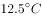

# 2018年上海市公务员录用考试《行测》题（B类）（网友回忆版）

> 常识判断 · 39 题 · 上海 2018

## 材料 1

        党的十八大以来，习近平主席在国际国内多个重要场合提出构建人类命运共同体，并对其丰富内涵和实践路径作了深入阐述。人类命运共同体理念明确回答了世界向何处去、崛起的中国向何处去、新形势下中国怎样办外交等重大命题，是当代中国外交理论的重大创新成果之一，也是马克思主义中国化的最新成果之一。人类命运共同体理念超越了西方主流国际关系理论，蕴含着重大理论意义和实践价值，必将有力促进人类和平与发展的崇高事业。任何重大理论创新都不是无源之水、无本之木，往往都是在继承前人思想精髓的基础上，结合新的现实条件和具体实践发展起来的。人类命运共同体理念是在继承马克思主义与中华传统文化思想精髓的基础上形成的理论创新成果。 

        一个科学的理论体系往往有其核心范畴，用以统摄理论体系中的相关概念，保证理论体系概念间的自洽和逻辑上的贯通。人类命运共同体可以说是中国特色大国外交理论体系的核心范畴，它引领着党的十八大以来我国外交的新理念新思想新战略。

        一部人类思想发展史，也是一部思想超越史。没有思想上的不断超越，人类社会就无法不断前进。人类命运共同体理念在多个方面体现出对近代以来西方主流国际关系理论的超越。正因为这些超越，人类命运共同体理念已经得到国际学术界的肯定，被认为是一种新的秩序观、价值观乃至新的哲学。当前，国际社会对人类命运共同体理念的认可度不断提升。

        2017年2月，联合国社会发展委员会第五十五届会议在其通过的“非洲发展新伙伴关系的社会层面”决议中，明确写入“构建人类命运共同体”的愿景。这是联合国决议首次写入人类命运共同体理念，体现了广大成员国对这一理念的支持。联合国秘书长表示，联合国“践行多边主义的目的，就是要建立人类命运共同体”。

### 第 1 题　qid 2137208 · 人文常识

人类命运共同体理念继承和发展了马克思、恩格斯的共同体思想。马克思、恩格斯曾把无产阶级为之奋斗的共产主义社会确立为        。

- **A**. “无产者联合体”
- **B**. “自由人联合体”　✅
- **C**. “无产阶级共同体”
- **D**. “世界公民联合体”

**答案**：B

**官方解析**

本题考查政治常识。
人类命运共同体理念是在继承马克思主义与中华传统文化思想精髓的基础上所形成的理论创新成果。马克思、恩格斯明确提出并系统阐释了共同体思想。他们把作为无产阶级奋斗目标的共产主义社会确立为“自由人联合体”。在这种共同体中，个人是“世界历史性的、经验上普遍的个人”，是自由而全面发展并因此具有丰富个性的“自由人”。马克思、恩格斯的共同体思想，为人类命运共同体理念奠定了坚实的理论基础。
故正确答案为B。

---

### 第 2 题　qid 2137212 · 人文常识

人类命运共同体理念汲取了中华传统文化中        的思想精髓，将攸关中国前途命运的中国梦与攸关世界各国前途命运的世界梦紧密连接在一起，让世界各国共享中国经验，让中国发展成为世界的机遇。

- **A**. “天下观”　✅
- **B**. “中庸观”
- **C**. “博弈论”
- **D**. “辩证法”

**答案**：A

**官方解析**

以习近平同志为核心的党中央面对国际形势的深刻变化和各国人民的共同愿望，提出构建人类命运共同体，有力推动了中国特色大国外交理论的新发展。汲取了中华传统文化中“天下观”与“和文化”的思想精髓。中华传统文化中的“天下观”源远流长，无内无外、天下一家是其核心原则，协和万邦、世界大同是其终极目标。这种“天下观”与和而不同、和为贵等“和文化”有机结合，构成了中国人处理与外部世界关系的基本准则。人类命运共同体理念汲取了中华传统文化中“天下观”与“和文化”的思想精髓，将攸关中国前途命运的中国梦与攸关世界各国前途命运的世界梦紧密连接在一起，让世界各国共享中国经验，让中国发展成为世界的机遇。
故正确答案为A。
【文段出处】《人类命运共同体理念引领人类文明进步方向》

---

### 第 3 题　qid 2137214 · 人文常识

纵观人类历史不难发现，如果一种关于未来世界的设想不具有和平属性，而是内含诱发冲突乃至战争的因素，那它必将被历史淘汰。人类命运共同体作为一种具有鲜明和平属性的理念，要求        。

- **A**. 具有不同历史文化传统的国家最终实行同样的社会制度
- **B**. 各个国家和地区通过和平方式即非暴力的合作方式建立和积累互信　✅
- **C**. 反对霸权主义和强权政治　✅
- **D**. 处于不同发展水平的国家和地区实现共同富裕

**答案**：BC

**官方解析**

本题考查时事政治。
纵观人类历史不难发现，如果一种关于未来世界的设想不具有和平属性，而是内含诱发冲突乃至战争的因素，那它必将被历史淘汰。只有以维护和平为目的，具有鲜明和平属性，这样的愿景才可能产生广泛影响力，并切实推动人类社会发展进步。人类命运共同体就是这样一种具有鲜明和平属性的理念。人类命运共同体理念承认世界的差异性和多样性，并在此基础上追求世界的统一性，体现的是一种和而不同的价值追求与殊途同归的理性判断。具体来说，人类命运共同体意味着具有不同历史文化传统、实行不同社会制度、处于不同发展水平的国家和地区，在彼此信任的基础上，在涉及生存和发展等根本问题上要做到同舟共济、守望相助、荣辱与共。这就要求各个国家和地区之间通过和平方式即非暴力的合作方式建立和积累互信，反对霸权主义和强权政治。
故正确答案为BC。
【文段出处】《人类命运共同体理念引领人类文明进步方向》

---

## 材料 2

材料一：党的十九大报告指出，改革开放之初，我们党发出了走自己的路、建设中国特色社会主义的伟大号召。从那时以来，我们党团结带领全国各族人民不懈奋斗，推动我国经济实力、科技实力、国防实力、综合国力进入世界前列，推动我国国际地位实现前所未有的提升，党的面貌、国家的面貌、人民的面貌、军队的面貌、中华民族的面貌发生了前所未有的变化，中华民族正以崭新姿态屹立于世界的东方。经过长期努力，中国特色社会主义进入了新时代，这是我国发展新的历史方位。 

材料二：“中国特色社会主义进入了新时代”，这是党的十九大对我国发展新的历史方位的科学判断，也是贯穿党的十九大报告的一条主线。在新时代坚持和发展中国特色社会主义，就要深刻认识新时代的重大意义和丰富内涵，就要深刻认识新时代我国社会主要矛盾的历史性变化，从而牢牢把握我们党在新时代的历史使命，更好进行伟大斗争、建设伟大工程、推进伟大事业、实现伟大梦想，在新时代中国特色社会主义的伟大实践中，以党的坚强领导和顽强奋斗，激励全体中华儿女不断奋进，凝聚起同心共筑中国梦的磅礴力量。

### 第 4 题　qid 2137230 · 人文常识

进入新时代，我国社会主要矛盾的变化不仅是巨大的，也是极为深刻的，要求我们在继续推动发展的基础上，着力解决好发展不平衡不充分的问题，        。

- **A**. 大力提升发展质量和效益　✅
- **B**. 带领全国人民告别贫困、跨越温饱
- **C**. 更好满足人民在经济、政治、文化、社会、生态等方面日益增长的需要　✅
- **D**. 更好推动人的全面发展、社会全面进步　✅

**答案**：ACD

**官方解析**

本题考查政治常识，主要考查十九大报告的有关内容。
十九大报告指出：中国特色社会主义进入新时代，我国社会主要矛盾已经转化为人民日益增长的美好生活需要和不平衡不充分的发展之间的矛盾······必须认识到，我国社会主要矛盾的变化是关系全局的历史性变化，对党和国家工作提出了许多新要求。我们要在继续推动发展的基础上，着力解决好发展不平衡不充分的问题，大力提升发展质量和效益，更好满足人民在经济、政治、文化、社会、生态等方面日益增长的需要，更好推动人的全面发展、社会全面进步。
故正确答案为ACD。

---

### 第 5 题　qid 2137232 · 人文常识

进入新时代，实现伟大梦想，必须进行伟大斗争，建设伟大工程，伟大斗争、伟大工程、伟大事业、伟大梦想，紧密联系、相互贯通、相互作用，其中起决定性作用的是        。

- **A**. 坚持社会主义制度的伟大斗争
- **B**. 党的建设新的伟大工程　✅
- **C**. 中国特色社会主义的伟大事业
- **D**. 中华民族走向复兴的伟大梦想

**答案**：B

**官方解析**

本题考查时事政治，主要考查十九大报告的有关内容。
十九大报告中指出：中华民族伟大复兴，绝不是轻轻松松、敲锣打鼓就能实现的。全党必须准备付出更为艰巨、更为艰苦的努力。实现伟大梦想，必须进行伟大斗争，必须建设伟大工程，必须推进伟大事业。伟大斗争，伟大工程，伟大事业，伟大梦想，紧密联系、相互贯通、相互作用，其中起决定性作用的是党的建设新的伟大工程。推进伟大工程，要结合伟大斗争、伟大事业、伟大梦想的实践来进行，确保党在世界形势深刻变化的历史进程中始终走在时代前列，在应对国内外各种风险和考验的历史进程中始终成为全国人民的主心骨，在坚持和发展中国特色社会主义的历史进程中始终成为坚强领导核心。
故正确答案为B。

---

## 材料 3

        根据《中华人民共和国人民调解法》，人民调解是指人民调解委员会通过说服、疏导等方法，促使当事人在平等协商基础上自愿达成调解协议，解决民间纠纷的活动。开展行业性、专业性人民调解工作，是新时期人民调解工作的创新发展，是人民调解制度的丰富和完善。

        自2011年国务院颁布《国有土地上房屋征收与补偿条例》，旧区改造工作开始适用房屋征收新政。新政以政府实施、公众参与、补偿透明、程序规范等特点加之有效的技术手段，有效遏制了拆迁旧政中存在的前紧后松、暗箱操作、暴力强拆等问题，公正、公开、公平的制度得到了较为广泛的社会认可，旧区改造速度得以加快，居民满意度得以提升。为积极应对近年来房屋征收矛盾多发、频发的现状，为推动人民调解工作优势向矛盾纠纷积聚领域进一步延伸，A市各区逐步在房屋征收实践中引入人民调解工作，并不断完善。

        在A市的房屋征收实践中，近年来产生的房屋征收民间纠纷主要有三类：一是家庭内部矛盾，包括房产确权、补偿款分割、补偿方式不一致、财产分割后的履行保障纠纷，以及连带产生的老年人赡养、未成年人抚养、无民事行为能力人抚养等纠纷；二是被征收房屋房东与租客之间的租赁纠纷，主要涉及用以经营的店铺或门面房；三是对一些建筑物、附属物、混合物的认定引起的邻里纠纷。其中第一、第二类纠纷属于人民调解的可调范围，第三种需由专业部门依据事实认定，实践中第一类纠纷占绝大多数。

        例如，B区在旧区改造任务最繁重的S街道和J街道，采取由街道办事处牵头，在房屋征收基地设立由分管综合司法工作的街道党工委副书记任组长的人民调解组，街道司法所全体成员、街道人民调解委员会的人民调解员、居委调解干部、律师、民警、退休法官等任组员，在征收基地区域设立专门的接待场所，回答居民的法律咨询、受理调解申请并开展具体的调解工作。户籍在J街道72街坊某号的王某，因诈骗罪被判刑13年，已服刑8年。由于该户目前由其前妻姚某承租，王某非常担心其安置权益被忽略，出狱后无家可归，故向司法所帮教人员提出希望通过征收补偿得到一套住房。司法所立即联系征收事务所了解情况。之后，司法所会同调解工作室，牵头征收事务所和居委会，主动与姚某接触，开展矛盾化解工作。通过数次与姚某的沟通，及进监做王某的工作，双方终于就调解方案达成一致。姚某将价值59万的安置房登记在王某名下，并表示给予王某适当的装修费。王某的旧改权益，在多方努力下得到了维护，他出狱后的生活也获得了保障。

### 第 6 题　qid 2137254 · 法律常识

2011年国务院颁布《国有土地上房屋征收与补偿条例》取代原《城市房屋拆迁管理条例》，这从政策过程的角度来看，属于        。

- **A**. 政策分解
- **B**. 政策修订
- **C**. 政策更替　✅
- **D**. 政策终结

**答案**：C

**官方解析**

A项错误，政策分解指的是将旧政策的内容按照一定的原则分解成几个部分，每个部分各自形成一项新政策。政策分解一般发生在旧政策内容庞杂、目标众多而影响政策效果时，对其加以适当分解，以利于问题的解决。本题中并未涉及政策分解，排除。
B项错误，政策修订是指法定机关对政策进行全面的修改，是整体的修改。本题中并未涉及政策的修订，排除。
C项正确，政策更替即原先的政策不能解决某一问题，或者社会环境发生了变化，再沿用旧政策已经不能解决新条件下的这一问题，因此用新的政策来替代。如本材料中，我国原先实行的《城市房屋拆迁管理条例》已不能解决旧区改造工作存在的前紧后松、暗箱操作、暴力强拆的问题，于是，通过新的《国有土地上房屋征收与补偿条例》来替代原先的政策，从而解决新问题，得到社会认可，当选。
D项错误，政策终结是指公共政策的决策者通过对政策进行审慎的评估后，采取必要的措施，以终止那些错误的、过时的、多余的或无效的政策的一种行为。本题中并未涉及政策终结，排除。
故正确答案为C。

---

### 第 7 题　qid 2137256 · 人文常识

下列有关人民调解的说法，正确的是        。

- **A**. 人民调解属于司法调解和行政调解的范畴
- **B**. 人民调解尊重当事人的权利　✅
- **C**. 人民调解采用一定的强制手段
- **D**. 人民调解的内容包含了家庭内部矛盾和租赁纠纷　✅

**答案**：BD

**官方解析**

A项错误，人民调解是指人民调解委员会通过说服、疏导等方法，促使当事人在平等协商基础上自愿达成调解协议，解决民间纠纷的活动。司法调解是人民法院组织和主持的调解，行政调解是行政机关组织和主持的调解。人民调解不属于司法调解和行政调解的范畴。
B项正确、C项错误，根据《人民调解法》第三条规定：“人民调解委员会调解民间纠纷，应当遵循下列原则：（一）在当事人自愿、平等的基础上进行调解；（二）不违背法律、法规和国家政策；（三）尊重当事人的权利，不得因调解而阻止当事人依法通过仲裁、行政、司法等途径维护自己的权利。”
D项正确，《人民调解工作若干规定》第二十条规定：“人民调解委员会调解的民间纠纷，包括发生在公民与公民之间、公民与法人和其他社会组织之间涉及民事权利义务争议的各种纠纷。”家庭内部纠纷和租赁纠纷均属于涉及民事权利义务争议的各种纠纷，属于人民调解的内容。
故正确答案为BD。

---

### 第 8 题　qid 2137264 · 法律常识

材料中J街道72街坊某号王某的案例，主要体现了房屋征收人民调解制度中的       原则。

- **A**. 以法律服务帮助居民自行化解纠纷　✅
- **B**. 均衡利益助推搬迁　✅
- **C**. 以信息化手段助力和解
- **D**. 保障特殊群体权益　✅

**答案**：ABD

**官方解析**

A项正确，材料中，J街道72街坊某号的王某是服刑人员，向司法所提出希望通过征收补偿得到一套住房，最后，在多方共同努力下，王某与前妻就调解方案达成一致，当选。
B项正确，材料中通过多方共同努力，王某与前妻就调解方案达成一致，姚某将价值59万的安置房登记在王某名下，并表示给予王某适当的装修费。正是均衡各方利益的体现，有助于搬迁工作的开展，当选。
C项错误，以信息化手段助力和解即通过远程视频的形式，简便、快速地为当事人完成调解，材料中并未体现出用信息化手段去调解，排除。
D项正确，王某是服刑人员，属于特殊群体，司法所会同调解工作室，牵头征收事务所和居委会，在多方努力下王某的旧政权益得到了维护，他出狱后的生活也获得了保障，此即保障了特殊群体权益，当选。
故正确答案为ABD。

---

### 第 9 题　qid 2137268 · 人文常识

A市在房屋征收实践中引入人民调解工作的价值体现在        。

- **A**. 基础价值：化解征收纠纷，加快征收推进　✅
- **B**. 稳定价值：推进平安建设，构建和谐社会　✅
- **C**. 治理价值：强化基层建设，提升治理能力　✅
- **D**. 效益价值：降低解纷成本，提高司法效率　✅

**答案**：ABCD

**官方解析**

A项正确，人民调解是一项具有中国特色的社会主义法律制度，在维护社会和谐稳定方面发挥了重要作用，被国际社会誉为“东方经验”。在房屋征收实践中引入人民调解工作，目的就在于通过解决居民的法律问题，化解征收纠纷，加快推进征收工作，当选。 B项正确，党的十八大以来，最高人民法院、司法部深入实施《人民调解法》，不断推进人民调解工作创新，人民调解工作达到一个新水平。仅2016年，就调解各类矛盾纠纷900万件，调解成功率达以上。A市在房屋征收实践中引入人民调解工作，有效排查化解了大量矛盾纠纷，为维护社会和谐稳定作出了重要贡献，当选。

C项正确，人民调解委员会是维护人民群众根本利益、反映社情民意、改进群众工作、密切党群干群关系的重要组织，是健全预警防范体系建设的重要内容。基层人民调解委员会具有扎根基层，深入群众，便民、利民、不收费的特点和优势，能最大限度地把各种矛盾纠纷化解在基层，解决在萌芽状态，是完善社会治理体系、促进社会治理能力现代化建设的基础工程，当选。

D项正确，A市在房屋征收实践中引入人民调解工作，切实增强人民调解的公信力，提高了司法效率，节约了司法资源，也为纠纷当事人减少不必要的诉讼成本，当选。

故正确答案为ABCD。

---

## 材料 4

        S省X市质量技术监督局（以下简称“质监局”）接G省乙公司X市经销部举报称，X市甲公司有600余箱假冒其所生产的“乙牌”瓷砖，质监局当天下午派执法人员到甲公司进行执法检查，发现甲公司正在加工处理“乙牌”瓷砖。经现场陪同人员乙公司X市经销部销售经理王某初步鉴定，该批瓷砖在包装上与乙公司产品存在差异，应为假冒。质监局执法人员根据检查情况，以甲公司该批瓷砖涉嫌存在“质量问题”为由，依据《中华人民共和国产品质量法》相关规定，当场对该批瓷砖进行了扣押，并现场向甲公司送达了《质量技术监督扣押决定书》。后经调查，甲公司的“乙牌”瓷砖确系真品，系甲公司直接从乙公司购买，而乙公司X市经销部系“乙牌”瓷砖在S省唯一总代理，该经销部未曾向甲公司销售过“乙牌”瓷砖，其在未做认真调查的情况下认为甲公司的“乙牌”瓷砖为假冒，故而报案。质监局根据后来查实的事实证据，做出了《质量技术监督解除扣押决定书》。 

### 第 10 题　qid 2137280 · 法律常识

X市质监局查封甲公司600余箱“乙牌”瓷砖的行为属于        。

- **A**. 行政强制行为　✅
- **B**. 行政强制措施　✅
- **C**. 行政处罚
- **D**. 行政监督检查

**答案**：AB

**官方解析**

本题考查行政法相关知识，结合选项具体分析。
A项正确，行政强制行为属于具体行政行为，包括行政强制措施和行政强制执行。题目中的扣押行为属于行政强制措施，因此也属于行政强制行为。
B项正确，《中华人民共和国行政强制法》第九条规定：“行政强制措施的种类：（一）限制公民人身自由；（二）查封场所、设施或者财物；（三）扣押财物；（四）冻结存款、汇款；（五）其他行政强制措施”。X市质监局扣押甲公司的货物属于其中之一。
C项错误，《行政处罚法》第九条规定：“行政处罚的种类：（一）警告、通报批评；（二）罚款、没收违法所得、没收非法财物；（三）暂扣许可证件、降低资质等级、吊销许可证件；（四）限制开展生产经营活动、责令停产停业、责令关闭、限制从业；（五）行政拘留；（六）法律、行政法规规定的其他行政处罚。”
D项错误，行政监督检查，是指行政机关或法定授权的组织依法对管理相对人遵守法律、法规和规章的情况进行督促检查。检查的具体内容主要是公民、法人或其他组织是否依法正当行使权利和履行义务。X市质监局扣押甲公司的货物不属于行政监督检查。
故正确答案为AB。

---

### 第 11 题　qid 2137284 · 人文常识

X市质监局查封甲公司的“乙牌”瓷砖时，应当        。

- **A**. 由两名以上行政执法人员实施　✅
- **B**. 告知甲公司依法享有的权利　✅
- **C**. 听取甲公司的陈述和申辩　✅
- **D**. 制作现场笔录　✅

**答案**：ABCD

**官方解析**

本题考查行政法相关知识。
《中华人民共和国行政强制法》第十八条规定：“行政机关实施行政强制措施应当遵守下列规定：（一）实施前须向行政机关负责人报告并经批准；（二）由两名以上行政执法人员实施；（三）出示执法身份证件；（四）通知当事人到场；（五）当场告知当事人采取行政强制措施的理由、依据以及当事人依法享有的权利、救济途径；（六）听取当事人的陈述和申辩；（七）制作现场笔录······”。
根据法条，四项均属于行政机关实施行政强制措施应当遵守的规定之一。
故正确答案为ABCD。

---

### 第 12 题　qid 2137292 · 人文常识

行政机关采取扣押财产的措施后，有下列        情形的，应当及时作出解除查封决定。

- **A**. 当事人没有违法行为　✅
- **B**. 查封的财物与违法行为有关
- **C**. 查封、扣押期限届满　✅
- **D**. 当事人提供了财产担保

**答案**：AC

**官方解析**

本题考查行政法相关知识。
根据《中华人民共和国行政强制法》第二十八条规定：“有下列情形之一的，行政机关应当及时作出解除查封、扣押决定：（一）当事人没有违法行为；（二）查封、扣押的场所、设施或者财物与违法行为无关；（三）行政机关对违法行为已经作出处理决定，不再需要查封、扣押；（四）查封、扣押期限已经届满；（五）其他不再需要采取查封、扣押措施的情形。”
A项正确，符合规定（一）。
B项错误，“查封、扣押的场所、设施或者财物与违法行为无关”而非“有关”。
C项正确，符合规定（四）。
D项错误，不符合上述规定的任何情形。
故正确答案为AC。

---

### 第 13 题　qid 2137296 · 法律常识

如果甲公司认为X市质监局扣押其财产的行为违法，给其造成了经济损失，要提起行政赔偿诉讼，被告应当是        。

- **A**. X市质监局　✅
- **B**. 乙公司X市经销部
- **C**. 乙公司X市经销部销售经理王某
- **D**. X市质监局和乙公司X市经销部

**答案**：A

**官方解析**

本题考查行政法相关知识，结合选项具体分析。
首先，承担赔偿义务的是作出行政行为的机关。根据《中华人民共和国国家赔偿法》第七条规定：“行政机关及其工作人员行使行政职权侵犯公民、法人和其他组织的合法权益造成损害的，该行政机关为赔偿义务机关。”
其次，行政诉讼中被告应为行政机关。根据《中华人民共和国行政诉讼法》第二十六条规定：“公民、法人或者其他组织直接向人民法院提起诉讼的，作出行政行为的行政机关是被告。”
X市质监局扣押甲公司的货物这一行政行为的作出主体是“X市质监局”，赔偿义务机关也为“X市质监局”，如果甲公司认为X市质监局的行为违法并对其造成损失，提起行政赔偿诉讼，被告应当是“X市质监局”。
故正确答案为A。

---

## 材料 5

### 第 14 题　qid 2137314 · 人文常识

上面公文标题不规范，下列修正正确的是        。

- **A**. XX市新闻出版局关于开展第三届全国“书香之家”推荐活动的通知
- **B**. XX市新闻出版局转发国家新闻出版广电总局关于开展第三届全国“书香之家”推荐活动的通知
- **C**. XX市新闻出版局转发《关于开展第三届全国“书香之家”推荐活动的通知》的通知　✅
- **D**. XX市新闻出版局转发《关于开展第三届全国“书香之家”推荐活动的通知》

**答案**：C

**官方解析**

本题考查公文标题的写法。
公文标题由发文机关名称、事由和文种组成，介词“关于”连接发文机关名称和事由，助词“的”连接事由和文种。通知是法定公文的一种，可用于批转、转发公文，该公文是一份转发性公文，应该用通知文种。为避免标题中出现“关于······关于”，若转发的公文标题中含有“关于”，则在“转发”之前不得再加介词“关于”。
A项错误，虽然该选项标题包含发文机关名称、事由和文种，但事由不恰当。市级的新闻出版局开展“全国推荐活动”不合逻辑，且从正文内容看，“开展第三届全国‘书香之家’推荐活动”是国家新闻出版广电总局的通知事由，排除。
B项错误，转发其他公文，原公文标题应加书名号。另外，加书名号后该标题缺乏文种“通知”，排除。
  C项正确，该标题包含发文机关名称（XX市新闻出版局）、事由（转发《关于开展第三届全国“书香之家”推荐活动的通知》）和文种（通知），当选。
D项错误，该标题缺少文种“通知”，排除。
故正确答案为C。

---

### 第 15 题　qid 2137318 · 人文常识

下列关于公文主送机关的修改意见，不正确的是        。

- **A**. “本市”二字删去
- **B**. 向左顶格
- **C**. 要写全称　✅
- **D**. 括号删去　✅

**答案**：CD

**官方解析**

本题考查公文主送机关的写法。
主送机关是指对公文负有办理和答复责任的机关，应当使用机关全称、规范化简称或者同类型机关统称，应当居左顶格写，最后一个机关名称后标全角冒号。
A项正确，该通知是将总局的文件向下级机关转发，主送机关应当是“XX市新闻出版局”的下级机关，无需加“本市”二字，排除。
B项正确，公文主送机关应居左顶格写，材料中主送机关缩进两个字符，应向左顶格，排除。
C项错误，主送机关可使用机关全称、规范化简称或者同类型机关统称，当选。
D项错误，我国的行政机关名称复杂多样，主送机关中的文化局、文广局均为县区一级的新闻出版与广播电视的主管部门，只是机关名不同，要用“（）”加以区分，因此统写为“各区文化（广）局”无误，无需删除，当选。
本题为选非题，故正确答案为CD。

---

### 第 16 题　qid 2137320 · 人文常识

下列关于公文正文的修改意见，表述正确的是        。

- **A**. “新广出函〔2017〕175号”应改为“（新广出函（2017）175号）”
- **B**. 正文第二段中，申报表和汇总表的表格名称应使用书名号　✅
- **C**. 正文第三、第四两段位置颠倒了，应交换位置
- **D**. 正文末句中“二十八”应使用阿拉伯数字　✅

**答案**：BD

**官方解析**

本题考查公文写作及公文格式有关内容。
A项错误，发文字号由发文机关代字、年份代码和发文顺序号组成。年份代码使用四位阿拉伯数字标识的公历年份，用六角括号“〔〕”括入；发文顺序号不编虚位，即1不编为01，不加“第”等虚字。材料中年份代码用六角括号“〔〕”正确，不应改为圆括号。
B项正确，正文引用其他文件应加书名号，第二段中的“第三届‘全国书香’之家申报表”和 “第三届全国‘书香之家’推荐候选家庭汇总表”都属于表格文件名称，需要用书名号括入，当选。
C项错误，根据行文内容的逻辑，应该是区级机关先推荐，然后市级机关评审，评审后再上报，因此无需调整。
D项正确，依据《国家标准：出版物上数字用法》（GB/T 15835—2011）规定：“（在表达计量或编号所需用到的数字个数不多的情况下，）如果要突出简洁醒目的表达效果，应使用阿拉伯数字；如果要突出庄重典雅的表达效果，应使用汉字数字。”此篇公文中的数字是为了突出简洁醒目即“向总局推荐28个家庭”，应使用阿拉伯数字，当选。
故正确答案为BD。

---

### 第 17 题　qid 2137324 · 人文常识

上面公文需补充的内容有        。

- **A**. 附件应补充转发的通知名称　✅
- **B**. 附件应补充第三届“书香之家”申报表
- **C**. 各区推荐家庭申报材料纸质版份数　✅
- **D**. 出版管理处地址、邮编、电子邮箱地址、联系人姓名、电话号码、传真　✅

**答案**：ACD

**官方解析**

本题考查公文写作的相关内容。
A项正确，本题揣测出题人意图是想出成正确项，其所谓的“附件”应为“附件说明”（《党政机关公文处理工作条例》第九条第（十）项规定：“附件说明是公文附件的顺序号和名称”），只是出题人未严谨表达出。本文是转发类公文，且附加了其它附件，因此“附件说明”处应该补充通知名称。虽然表述不严谨，但是揣测出题意图，将此项定为正确项，各位考生要知道该项表达不严谨。
B项错误，正文第二段中提到“第三届全国‘书香之家’申报表”和“第三届全国‘书香之家’推荐候选家庭总汇表”的电子版可在总局网站（www.sapprft.gov.cn）新闻资讯-通知公示栏下载，所以无需在附件中补充，排除。
C项正确，正文中申报材料应明确份数，比如一式两份、一式三份，而材料中未提及，需要补充，当选。
D项正确，正文中提及纸质材料需要报送，所以需要补充“出版管理处地址、邮编、联系人姓名、电话号码、传真”；电子材料需要发送到邮箱，所以需要补充“电子邮箱地址”，当选。
故正确答案为ACD。

---

### 第 18 题　qid 2137526 · 人文常识

中共中央办公厅于2017年3月印发了《关于推进“两学一做”学习教育常态化制度化的意见》，意见指出要把              作为查找和解决问题的重要途径，注意听取群众的意见和反馈，抓早抓小、防微杜渐。

- **A**. 批评与自我批评
- **B**. 党的组织生活　✅
- **C**. 自我反思
- **D**. 巡视工作

**答案**：B

**官方解析**

《关于推进“两学一做”学习教育常态化制度化的意见》指出，要把党的组织生活作为查找和解决问题的重要途径，注意听取群众的意见和反映，抓早抓小、防微杜渐。鲜明阐述了党的组织生活在党内政治生活中的基础性地位和作用，为严肃党内政治生活，推进党内生活科学化，明确了重要抓手，指明了努力方向。
故正确答案为B。

---

### 第 19 题　qid 2137534 · 经济常识

上海自贸试验区将进入新一轮建设，到2020年的目标已经明确，关键是要与国际投资和贸易通行规则相衔接，加快健全                ；最终是要瞄准国际最高标准、最好水平的自贸试验区，率先形成法治化、国际化、便利化的营商环境和公平、统一、高效的市场环境。

- **A**. 投资管理、贸易监管“两个体系”
- **B**. 投资管理、贸易监管、金融服务“三个体系”
- **C**. 投资管理、贸易监管、金融服务、政府管理“四个体系”　✅
- **D**. 投资管理、贸易监管、金融服务、政府管理、社会治理“五个体系”

**答案**：C

**官方解析**

在2017年7月25日下午举行的上海市第十四届人大常委会第三十九次会议（扩大）上，上海市委副书记、市长应勇表示，上海自贸试验区将进入新一轮建设，到2020年的目标已经明确，核心是要坚持制度创新，加快构建开放型经济新体制；关键是要与国际投资和贸易通行规则相衔接，加快健全投资管理、贸易监管、金融服务、政府管理“四个体系”；最终是要瞄准国际最高标准、最好水平的自贸试验区，率先形成法治化、国际化、便利化的营商环境和公平、统一、高效的市场环境。
故正确答案为C。

---

### 第 20 题　qid 2137538 · 人文常识

上海市第十一次党代会报告指出，要大力实施创新驱动战略，加快科技创新中心建设，将以全球视野、国际标准推进             综合性国家科学中心建设。

- **A**. 张江　✅
- **B**. 紫竹
- **C**. 杨浦
- **D**. 漕河泾

**答案**：A

**官方解析**

中国共产党上海市第十一次代表大会报告指出，要大力实施创新驱动发展战略，加快科技创新中心建设，把握科技进步大方向、产业革命大趋势、集聚人才大举措，在推进科技创新、实施创新驱动发展战略方面走在全国前头、走到世界前列，加快向具有全球影响力的科技创新中心进军，以全球视野、国际标准推进张江综合性国家科学中心建设。
故正确答案为A。

---

### 第 21 题　qid 2137554 · 法律常识

《中华人民共和国国歌法》于2017年10月1日起施行。该法是为了维护国歌的尊严，规范国歌的奏唱、播放和使用，增强公民的国家观念，弘扬爱国主义精神，培育和践行社会主义核心价值观，根据宪法所制定。根据该法，下列表述不正确的是         。

- **A**. 在公共场合侮辱国歌的，由公安机关依法追究刑事责任　✅
- **B**. 国歌不得作为公共场所的背景音乐使用
- **C**. 中华人民共和国国歌是中华人民共和国的象征和标志
- **D**. 县级以上各级人民政府及其有关部门在各自职责范围内，对国歌的奏唱、播放和使用进行监督管理

**答案**：A

**官方解析**

A项错误，《中华人民共和国国歌法》第十五条规定，在公共场合，故意篡改国歌歌词、曲谱，以歪曲、贬损方式奏唱国歌，或者以其他方式侮辱国歌的，由公安机关处以警告或者十五日以下拘留；构成犯罪的，依法追究刑事责任。因此根据法条规定，在公共场合侮辱国歌只有构成犯罪时才会被追究刑事责任。
B项正确，《中华人民共和国国歌法》第八条规定，国歌不得用于或者变相用于商标、商业广告，不得在私人丧事活动等不适宜的场合使用，不得作为公共场所的背景音乐等。
C项正确，《中华人民共和国国歌法》第三条规定，中华人民共和国国歌是中华人民共和国的象征和标志。一切公民和组织都应当尊重国歌，维护国歌的尊严。
D项正确，《中华人民共和国国歌法》第十四条规定，县级以上各级人民政府及其有关部门在各自职责范围内，对国歌的奏唱、播放和使用进行监督管理。
本题为选非题，故正确答案为A。

---

### 第 22 题　qid 2137548 · 人文常识

国务院总理李克强2017年5月17日主持召开国务院常务会议，部署以试点示范推进《中国制造2025》深入实施。会议指出，下一步要深化供给侧结构性改革，以市场为导向，以企业为主体，强化创新驱动和政策激励，把        作为主攻方向，加快建设制造强国。

- **A**. 绿色化和服务型升级
- **B**. 发展智能制造　✅
- **C**. 关键核心技术升级
- **D**. 改造传统产业

**答案**：B

**官方解析**

本题考查时政常识。国务院总理李克强2017年5月17日主持召开国务院常务会议，部署以试点示范推进《中国制造2025》深入实施，促进制造业转型升级。会议指出，下一步深入实施《中国制造2025》，要深化供给侧结构性改革，以市场为导向，以企业为主体，强化创新驱动和政策激励，把发展智能制造作为主攻方向，与“互联网+”和大众创业、万众创新紧密结合，打造勇于改革创新、成果不断涌现、具有引领作用的“示范方阵”，促进整个制造业向智能化、绿色化和服务型升级，加快建设制造强国。故A、C、D三项错误，B项正确。
故正确答案为B。

---

### 第 23 题　qid 2137546 · 人文常识

根据中共中央组织部等四部门于2017年印发的《关于规范公务员辞去公职后从业行为的意见》，即便原先不是各级机关中领导班子成员，且非担任县处级以上职务的公务员，其辞去公职后2年内，也不得接受与原工作业务直接相关的企业、中介机构或其他        的聘任。

- **A**. 事业单位
- **B**. 科研单位
- **C**. 营利性组织　✅
- **D**. 公益性组织

**答案**：C

**官方解析**

本题考查时政和行政管理常识。
《关于规范公务员辞去公职后从业行为的意见》中第二条规定：“各级机关中原系领导班子成员的公务员以及其他担任县处级以上职务的公务员，辞去公职后3年内，不得接受原任职务管辖地区和业务范围内的企业、中介机构或其他营利性组织的聘任，个人不得从事与原任职务管辖业务直接相关的营利性活动；其他公务员辞去公职后2年内，不得接受与原工作业务直接相关的企业、中介机构或其他营利性组织的聘任，个人不得从事与原工作业务直接相关的营利性活动。”
故正确答案为C。

---

### 第 24 题　qid 2137540 · 人文常识

2017年5月，国务院办公厅印发《政府网站发展指引》，对政府网站管理体制、内容功能、发展方向、集约化建设等提出明确要求和标准规范。根据《指引》，下列关于政府网站建设的说法，不正确的是        。

- **A**. 县级以上各级人民政府及其部门原则上一个单位最多开设一个网站
- **B**. 政府网站要使用以“.gov.cn”为后缀的英文域名和符合要求的中文域名，不得使用其他后缀的英文域名
- **C**. 政府网站分为政府门户网站和部门网站
- **D**. 乡镇、街道必须开设政府门户网站提供政务服务　✅

**答案**：D

**官方解析**

本题考查时政。
A项，根据《政府网站发展指引》第三部分第（一）条的规定，县级以上各级人民政府及其部门原则上一个单位最多开设一个网站，正确。
B项，根据《政府网站发展指引》第三部分第（一）条第4款的规定，政府网站要使用以.gov.cn为后缀的英文域名和符合要求的中文域名，不得使用其他后缀的英文域名，正确。
C项，根据《政府网站发展指引》第三部分第（一）条的规定，政府网站分为政府门户网站和部门网站，正确。
D项，根据《政府网站发展指引》第三部分第（一）条第1款的规定，乡镇、街道原则上不开设政府门户网站，通过上级政府门户网站开展政务公开，提供政务服务。已有的乡镇、街道网站要尽快将内容整合至上级政府门户网站。确有特殊需求的乡镇、街道，参照政府门户网站开设流程提出申请获批后，可保留或开设网站，错误。
本题为选非题，故正确答案为D。

---

### 第 25 题　qid 2137530 · 法律常识

诉讼程序的启动总是以具体案件的发生为前提，不论是刑事诉讼、民事诉讼还是行政诉讼，都通常必须由诉讼参与人的诉讼行为来启动，这说明诉讼活动具有        。

- **A**. 主动性
- **B**. 被动性　✅
- **C**. 独立性
- **D**. 权威性

**答案**：B

**官方解析**

本题考查法律常识，主要涉及法律适用特点等相关知识点。
A项错误，主动性是执法的特征，被动性是司法的特征。主动性要求执法机关应当积极主动地去执行法律，而不一定需要行政相对人的请求和同意。因此诉讼活动并不具备主动性，错误。
B项正确，司法过程的启动总是以具体案件的发生为前提，在大多数案件中，司法活动必须由当事人的诉讼行为来启动。这种消极性和被动性是由法院作为中立的第三者的地位所决定的，裁判者只能是中立的第三者。这种消极性和被动性在诉讼上主要体现为，诉讼的启动权在当事人，当事人没有行使诉讼权，提起诉讼时，法院不能主动开始诉讼程序；当事人没有提出的请求和主张，法院不能主动进行审查和判断，正确。
C项错误，独立性体现在人民法院依法独立行使审判权，人民检察院依法独立行使检察权，不受行政机关、社会团体和公民个人的非法干涉，与题干无关，错误。
D项错误，权威性体现在国家机关尤其是司法机关的活动是以国家名义进行的，司法裁决一旦发生法律效力，任何组织和个人都必须执行，不得擅自修改和违抗，与题干无关，错误。
故正确答案为B。

---

### 第 26 题　qid 2137524 · 法律常识

在行政主体制度中，下列关于法律法规授权组织的说法不正确的是        。

- **A**. 该组织应当是国家机关以外的组织
- **B**. 基于授权，该组织具有了国家机关资格　✅
- **C**. 该组织能独立行使法律法规授予的特定行政职权
- **D**. 该组织对行使法律法规授权的行为独立承担责任

**答案**：B

**官方解析**

本题考查法律常识，主要涉及行政法中法律法规授权组织的相关知识点。
A项正确，法律、法规授权组织是指根据法律法规的规定，可以以自己的名义从事行政管理活动、参加行政复议和行政诉讼并承担相应法律责任的非国家机关组织。
B项错误，基于授权，法律、法规授权组织可以行使特定的行政职权，但并不意味着其获得了国家机关资格。　
C项正确，法律、法规授权组织行使的是特定行政职权，而不是一般行政职权。一般行政职权是指行政机关根据宪法、各种组织法而获得的行政职权，特定行政职权是指单行法律、法规基于处理特定行政事务的需要而规定的行政职权。
D项正确，法律、法规授权的组织可以以自己名义行使法律法规授权的行为，并由其本身对外承担法律责任。
本题为选非题，故正确答案为B。

---

### 第 27 题　qid 2137520 · 法律常识

在中国古代法律传统中，关于“礼”与“法”在社会治理中的关系，下列说法正确的是        。

- **A**. 礼法结合，礼主法辅，法为礼的重要实施手段　✅
- **B**. 礼法结合，法主礼辅，礼为法的实施提供道德基础
- **C**. 礼法并重，两种社会规范分别从不同方面调整社会关系
- **D**. 礼法并重，将所有法律规范道德化，将所有道德规范法律化

**答案**：A

**官方解析**

本题主要考查“礼”与“法”的关系。
“礼治”和“法治”在我国的发展大致经历了以下几个阶段：
1．夏商西周的“礼治”时代：法作为礼治体系的一个组成部分而存在。礼治体系最大程度地发挥了教化的作用，而法与刑的锋芒被深藏，在不失威严的情况下副作用得到有效控制。
2．春秋战国至秦的“法治”时代：礼法分离，独任法治。儒法两家之争，以法家的胜利告终，原本附于礼治的法获得了独立的发展时机，但法家之“法”泛指制度，偏重刑罚。
3．西汉的礼法融合时期：汉儒通过对秦政反省认为过分摒弃“礼”和“德教”，独任严刑峻法是秦灭亡的主要原因。于是汉儒开始了在不排斥“法”独立存在的前提下，重振“礼乐”，建构“礼法结合”的新的传统法体系。
4．隋唐时期，法观念定型：礼主法辅，礼在法中，法外有礼。
自汉时起的礼法融合，经魏晋南北朝的发展，定型于隋唐。中国正统的法观念的核心理念是“德主刑辅”、“礼法结合”、“王霸并用”，三者合言之便是“礼主法辅”式的结合。在礼法融合的思想指导下，中国传统法向着儒家化、伦理化、道德化发展。董仲舒的“《春秋》决狱”、西汉后期兴起的以经注律、魏晋南北朝时的引经入律等，为形成“一准乎礼”的《唐律》打下了深厚基础。我们从《唐律》的注释“疏议”中可以体会到，《唐律》的每一条款的设置都能找到礼的依据。礼与律真正达到水乳交融的地步。
经过长时间的发展，我国古代关于“礼”与“法”在社会治理中的关系确定为：礼法结合，礼主法辅。
故正确答案为A。

---

### 第 28 题　qid 2137516 · 人文常识

人口政策与公共利益息息相关，因此政府会运用公共权力，依据人口发展规律制定符合国情的人口政策，用政策手段调控人口的增减，并通过相应的职能机构推行实施。人口政策可以归于政府职能中的        。

- **A**. 政治职能
- **B**. 经济职能
- **C**. 文化职能
- **D**. 社会职能　✅

**答案**：D

**官方解析**

本题主要考查政府职能。政府职能是指公共行政管理机关在经济、社会发展中所应承担的职责和所应发挥的作用，体现着公共行政活动的基本内容和方向。政治职能、经济职能、文化职能、社会职能均属于政府的基本职能。
A项错误，政治职能是指政府为维护国家统治阶级的利益，对外保护国家安全，对内维持社会秩序的职能。题干没有涉及到政府发挥国防、安保、外交等方面的职能。
B项错误，经济职能是指政府为国家经济的发展，对社会经济生活进行管理的职能。主要包括①宏观调控职能；②社会管理职能；③市场监管职能；④公共服务的职能。题干中的人口政策没有涉及到经济方面的内容。
C项错误，文化职能是指政府为满足人民日益增长的文化生活需要，依法对文化事业所实施的管理。主要包括和科、教、文、卫、体相关的政府职能。题干没有涉及到文化方面的内容。
D项正确，社会职能是指除政治、经济、文化职能以外政府必须承担的其他职能。主要包括：①调节社会分配和组织社会保障的职能；②保护生态环境和自然资源的职能；③促进社会化服务体系建立的职能；④提高人口质量，实行计划生育的职能。题干中政府运用公共权力，制定符合国情的人口政策，属于政府的社会职能。
故正确答案为D。

---

### 第 29 题　qid 2137162 · 法律常识

行政监督内容的广泛性决定了监督标准的多维性。《公务员法》中对国家公务员义务和行为规范的规定，可作为行政监督的              。

- **A**. 宪法标准
- **B**. 权利标准
- **C**. 纪律标准　✅
- **D**. 公共政策标准

**答案**：C

**官方解析**

本题主要考查行政监督的标准。
《公务员法》是一部规范公务员行为的法律，是我国第一部干部人事管理的综合性法律。
A项错误，宪法是国家的根本大法，靠国家强制力保证实施，所调整的对象非常广泛，涉及国家和社会生活各方面最基本的社会关系，而《公务员法》仅是对国家公务员的要求，不属于行政监督的宪法标准。
B项错误，《公务员法》中对国家公务员义务和行为规范的规定，是对公务员所需履行的义务的规定，不属于行政监督的权利标准。
C项正确，《公务员法》第五十九条，对国家公务员所要承担的义务和必须履行的行为规范做出了明确规定。该法条明确了公务员必须遵守的十八条纪律，故可作为行政监督的纪律标准。
D项错误，公共政策是公共权力机关经由政治过程所选择和制定的，为解决公共问题、达成公共目标、以实现公共利益的方案。而《公务员法》只是对国家公务员的要求标准，不属于行政监督的公共政策的行为标准。
故正确答案为C。

---

### 第 30 题　qid 2137164 · 经济常识

公共财政指的是仅为市场经济提供公共服务的政府分配行为，它是国家财政的一种具体存在形态，即与市场经济相适应的财政类型。下列选项中，不属于公共财政的基本特征的是                 。

- **A**. 以弥补政府失效为行为准则　✅
- **B**. 为市场活动提供同质的服务
- **C**. 非市场营利性
- **D**. 法治性

**答案**：A

**官方解析**

本题主要考查公共财政的基本特征。公共财政是指国家集中一部分社会资源，用于为市场提供公共物品和服务，满足社会公共需要的分配活动或经济行为。
A项错误，公共财政的基本特征是为了弥补市场失灵，而非政府失效。在市场经济条件下，市场在资源配置中起决定性作用，但也存在市场自身无法解决或解决得不好的公共问题，而这些问题属于社会公共领域的事项，需要公共财政介入解决。
B项正确，公共财政政策要一视同仁。市场经济的本质特征之一就是公平竞争，体现在财政上就是必须实行一视同仁的财政政策，为社会成员和市场主体提供平等的财政条件。
C项正确，公共财政具有非营利性的特征。公共财政只能以满足社会公共需要为己任，追求公益目标，一般不直接从事市场活动和追逐利润。公共财政的收入，是为满足社会公共需要而筹措资金；公共财政的支出，是以满足社会公共需要和追求社会公共利益为宗旨，不能以赢利为目标。
D项正确，公共财政要把公共管理的原则贯穿于财政工作的始终，以法制为基础，管理要规范和透明。市场经济是法治经济。一方面，政府的财政活动必须在法律法规的约束规范下进行；另一方面，通过法律法规形式，依靠法律法规的强制保障手段，社会公众得以真正决定、约束、规范和监督政府的财政活动，确保其符合公众的根本利益。所以公共财政具有法治性。
本题为选非题，故正确答案为A。

---

### 第 31 题　qid 2137166 · 人文常识

政策监控是贯穿政策过程始终的一个基本环节，是政策监督和政策控制的合成。监控目的在于保证制定出尽可能完善的政策方案，并保证政策方案得到有效的贯彻实施，及时发现和纠正政策偏差。政策监控的作用一般不包括                。

- **A**. 形成政策方案　✅
- **B**. 保证政策合法化
- **C**. 实现政策调整与完善
- **D**. 促使政策终结

**答案**：A

**官方解析**

本题主要考查政策监控的作用。政策监控是政策过程的一个基本环节，它贯穿于政策过程的始终，制约或影响着其他各个环节，有重要的作用。
政策监控的作用包括四个方面：
第一，保证政策的合法化，它包括政策的形式合法化和内容合法化两个方面；
第二，保证政策得到贯彻和执行；
第三，实现政策的调整和完整；
第四，促使政策终结，通过监控那些错误的，过时的，无效的或多余的政策，及时向有关方面提出报告，或提交合理的建议，促进政策最终实现。
故政策监控的作用不包括A选项形成政策方案，从题干表述来看，监控在于使得形成的方案本身更加完善，而不是形成该项方案。
本题为选非题，故正确答案为A。

---

### 第 32 题　qid 2137172 · 人文常识

飞机轮胎是飞机上安全性与可靠性要求都很高的重要部件。例如要求轮胎的爆破压力高于额定内压4倍以上。飞机的安全起飞和降落都必须依靠飞机轮胎的各种独特的功能。下列关于飞机轮胎的说法，正确的是                。

- **A**. 制造飞机轮胎的橡胶材料要能耐高温和低温，且要有很低的生热性　✅
- **B**. 为了防止爆胎，飞机轮胎用的是实心轮胎
- **C**. 为了防止静电积累，飞机轮胎用的是绝缘橡胶
- **D**. 飞机轮胎承受的落地冲击力约等于飞机的重力

**答案**：A

**官方解析**

本题主要考查科技常识。飞机轮胎，又称航空轮胎，是指用于航空飞行器械上的充气轮胎。这种轮胎具备的特性主要有：（1）具有高抗冲击强度和很低生热性；（2）用于制造航空轮胎的橡胶材料必须确保在以下和以上的苛刻条件下，经24h后性能符合规定指标；（3）轮胎的爆破压力高于额定内压4倍以上；（4）飞机起飞和降落时轮胎产生的静电荷要能均匀传至地面。

A项正确，因为在起飞和降落时与地面摩擦产生大量热量，会使轮胎温度变高，飞机在高空飞行时气温又很低，这就要求飞机轮胎既要耐高温，又要耐低温，且要求轮胎具有很低的生热性。

B项错误，飞机轮胎属于充气轮胎，即飞机轮胎是空心的，它行驶舒适，重量轻，操控性比实心胎好，飞机在降落时还可以起到吸收地面震动，起到减震的功能。

C项错误，飞机起飞和降落时，轮胎会产生静电荷，为使静电能均匀传至地面，飞机轮胎一般为导电橡胶。

D项错误，飞机轮胎必须具有高抗冲击强度，其承受的落地冲击力大于飞机的重力。

故正确答案为A。

---

### 第 33 题　qid 2137178 · 人文常识

自古以来，工匠精神就是“中国气质”之一，中国自古就是一个具有创新传统和工匠精神的国度。明代就有了世界上第一部关于农业和手工业生产的综合性著作，被外国学者称为“中国17世纪的工艺百科全书”。这部著作就是        。

- **A**. 沈括《梦溪笔谈》
- **B**. 贾思勰《齐民要术》
- **C**. 郦道元《水经注》
- **D**. 宋应星《天工开物》　✅

**答案**：D

**官方解析**

本题考查人文常识。
《天工开物》作者是明朝科学家宋应星，是世界上第一部关于农业和手工业生产的综合性著作，是中国古代一部综合性的科学技术著作，被英国科学家李约瑟称为“中国17世纪的工艺百科全书”。作者在书中强调人类要和自然相协调、人力要与自然力相配合。是中国科技史料中保留最为丰富的一部，它更多地着眼于手工业，反映了中国明代末年出现资本主义萌芽时期的生产力状况。
A项错误，《梦溪笔谈》由北宋科学家、政治家沈括撰写，是一部涉及古代中国自然科学、工艺技术及社会历史现象的综合性笔记体著作。该书在国际亦受重视，被英国科学史家李约瑟评价为“中国科学史上的里程碑”。
B项错误，《齐民要术》由北魏时期杰出农学家贾思勰所著，是我国现存最早的一部完整的农书。该书被誉为“中国古代农业百科全书”。
C项错误，《水经注》作者为北魏时期郦道元，我国古代地理名著，该书详细记载了一千多条大小河流及有关的历史遗迹、人物掌故、神话传说等，是我国古代最全面、最系统的综合性地理著作。该书还记录了不少碑刻墨迹和渔歌民谣，文笔绚烂，语言清丽，具有较高的文学价值。
D项正确，《天工开物》作者宋应星，初刊于1637年（明崇祯十年），被英国科学家李约瑟称为“中国17世纪的工艺百科全书”。
故正确答案为D。

---

### 第 34 题　qid 2137180 · 人文常识

公元前770年，周平王将都城东迁，史称“东周”，分为“春秋”“战国”两个时期。春秋时期，100多个诸侯国林立，互相争夺，胜者称为霸主。
下列成语的出处中涉及春秋时期诸侯国争霸的是（    ）。

- **A**. 否极泰来
- **B**. 问鼎之心　✅
- **C**. 草木皆兵
- **D**. 纸上谈兵

**答案**：B

**官方解析**

本题主要考查文学常识。需结合具体选项予以分析。
A项错误，依据《古汉语成语典故词典》，否极泰来词源《周易·否》：“否之匪人，不利君子贞，大往小来。”又《周易·泰》：“泰，小往大来，吉亨。”词义：情况从极坏的方面转为好的方面。《吴越春秋·勾践入吴外传》：“时过于期，否终则泰。”又用以说明事物发展变化周而复始。究其本源为《周易》，且《吴越春秋》非正史，被认为是杂史或小说，只是引用《周易》，故不当选。
B项正确，问鼎之心（问鼎中原、问鼎轻重），语本《左传·宣公三年》：“楚子伐陆浑之戎，遂至于雒，观兵于周疆。定王使王孙满劳楚子，楚子问鼎之大小、轻重焉。对曰：‘在德不在鼎······周德虽衰，天命未改，鼎之轻重，未可问也。’”“楚子”即春秋五霸之一楚庄王，与春秋争霸有关。后世多有引用，比喻篡夺政权的野心。
C项错误，草木皆兵，出处《晋书·苻坚载记》，意思是把山上的草木都当做敌兵，形容人在惊慌时疑神疑鬼，讲述了东晋时前秦苻坚与晋国大将谢石、谢玄开战的故事。《晋书》记载的事件晚于春秋时期。
D项错误，纸上谈兵，出自《史记·廉颇蔺相如列传》，讲述了战国时赵国名将赵奢之子赵括，年轻时学兵法，谈起兵事来父亲也难不倒他，后来他接替廉颇为赵将，在长平之战中，只知道根据兵书打仗，不知道变通，结果被秦军大败。纸上谈兵指在纸面上谈论打仗。此事发生于战国晚期，不是春秋时期。
故正确答案为B。

---

### 第 35 题　qid 2137184 · 人文常识

氯乙烷在常温常压下是气体，平时储存在压强较高的金属罐中。医护人员在对突然受伤的运动员实施急救时，常常会对着受伤部位喷氯乙烷雾状药剂，使受伤部位迅速降温并冷冻，神经被麻痹，疼痛感得以缓解。下列关于氯乙烷的说法正确的是        。

- **A**. 氯乙烷的沸点比水高
- **B**. 从气体变成液体过程中，氯乙烷会吸收大量的热量
- **C**. 在金属罐中，氯乙烷一般处于液体状态　✅
- **D**. 氯乙烷能使神经麻痹的原因是它含有使神经麻醉的药物成分

**答案**：C

**官方解析**

本题考查氯乙烷的特性。氯乙烷在常温常压下为无色气体，具有类似醚样的气味，常用作聚丙烯的催化剂，也用作冷冻剂、麻醉剂、杀虫剂等。

A项错误，氯乙烷的沸点只有，比水的沸点低，排除。

B项错误，物质由气态转变为液态的过程，是液化的过程，液化过程要放热。因此氯乙烷从气体变成液体过程中，会放出热量。

C项正确，氯乙烷在常温常压下是气体，但它通常以液体形式被储存在压强较高的金属罐中。低温高压下，气体通常可以被液化，液化后安全性高、运输和储存方便。

D项错误，由液体变成气体的氯乙烷从受伤部位的皮肤上吸收了大量热量，皮肤温度瞬间大幅降低，使皮肤肌肉及浅表神经受冷冻麻木，于是疼痛感就被迅速缓解了，而非含有使神经麻醉的药物成分。

故正确答案为C。

---

### 第 36 题　qid 2137188 · 人文常识

单向玻璃的“秘密”就在于玻璃面上涂有很薄的银膜或铝膜。强光照在镜子的银膜上大部分都反射了，而从另一面过来的暗光太弱，被反射的强光所“遮挡”，以至于人们看不见另一面。下列关于单向玻璃描述正确的是        。

- **A**. 为了达到单向观察的目的，单向玻璃利用特殊的涂层破坏了光路的可逆性
- **B**. 单向玻璃正面为玻璃镜面，安装时应把正面朝向监控室
- **C**. 被监控室光线越亮越强，玻璃的单向透视效果越明显　✅
- **D**. 监控室内要保证一定的亮度，否则不能有效观察被监控室内的情况

**答案**：C

**官方解析**

单向玻璃也叫单向透视透镜。其一面叫作玻璃镜面（正面），该面涂有一层薄薄的反光涂层，反光能力很强，能反射大部分的光，站在此面的人，只能看到玻璃上的一个反射的影像，与普通镜子没有什么区别，使用时玻璃镜面应朝向迎光面或较亮的地方；另一面（反面）相当于普通的透光玻璃，玻璃镜面虽能反射大部分光，但是还是会有一部分光线穿透玻璃到达另一面，在单向玻璃反面的人就可以通过玻璃观察到对面的人，使用时反面应朝向暗室。
A项错误，光路的可逆性是指光能以一条路径从A出发到达一个终点B，那么必然能从这个终点B以完全反向的同一路径到达A点。光路的可逆性不可改变，单向玻璃无法改变。
B项错误，正面为玻璃镜面，即站在此面的人看着像普通镜子的一面，所以安装时应把正面朝向被监控室（即：所要观察的空间，如犯罪嫌疑人所在空间）；而把反面朝向监控室所在位置。
C项正确，被监控室的灯光强度应保证足够亮度，被监控室光线越亮、越强，玻璃的单向透视效果越明显。
D项错误，为使玻璃的单向透视性能达到最佳状态，监控室内原则上不安装天花顶灯，不允许有其他发光灯源存在。监控室旁边若有窗户，必须安装不透光的窗帘，如宾馆酒店使用的密封窗帘。若监控室内一定要使用灯光，建议使用点状灯光，如书写台灯等（灯罩不透光），以缩小灯照范围。
故正确答案为C。

---

### 第 37 题　qid 2137192 · 科技常识

湿地、海洋、森林并称为全球三大生态系统。其中，湿地拥有“地球之肾”的美誉，这是因为湿地        。

- **A**. 具有维系二氧化碳和氧气的平衡，净化空气和环境的作用
- **B**. 具有降解污染物、净化水质、维持自然生态健康平衡的作用　✅
- **C**. 对调节全球的热量分布有重要意义
- **D**. 是水生动物、两栖动物、鸟类和其他野生生物的重要栖息地

**答案**：B

**官方解析**

本题考查地理国情。
湿地像天然的过滤器，它有助于减缓水流的速度，当含有毒物（农药、生活污水和工业排放物）和杂质的流水经过湿地时，流速减慢有利于毒物和杂质的沉淀和排除。一些湿地植物能有效地吸收水中的有毒物质，净化水质。沼泽湿地能够分解、净化环境物，起到“排毒”、“解毒”的功能，因此被人们喻为“地球之肾”。假如没有了湿地，好比一个人被割去了肾脏。
故正确答案为B。

---

### 第 38 题　qid 2137194 · 人文常识

人与人之间最小的差距是智商，最大的差距是坚持。“踏破铁鞋无觅处，得来全不费功夫”①，说的是成功的偶然性。然而，这种“不费功夫”的偶然，却建立在“吾将上下而求索”②“众里寻他千百度”③“为伊消得人憔悴”④之上，是千辛万苦付出后的某种必然。世间事，除了岁月，没有“不费功夫”就得来的好事。对上述语段引用内容的出处说明错误的是        。

- **A**. ①明·冯梦龙《警世通言》
- **B**. ②战国·屈原《离骚》
- **C**. ③宋·辛弃疾《青玉案·元夕》
- **D**. ④宋·李清照《声声慢·寻寻觅觅》　✅

**答案**：D

**官方解析**

本题考查文学常识。
A项正确，出自明代冯梦龙《警世通言·金令史美婢酬秀童》“金满将大门闭了，两个促膝细谈。正是：踏破铁鞋无觅处，得来全不费工夫”；
B项正确，出自屈原《离骚》“路漫漫其修远兮，吾将上下而求索”；
C项正确，出自南宋辛弃疾《青玉案·元夕》“众里寻他千百度，蓦然回首，那人却在，灯火阑珊处”；
D项错误，出自北宋柳永的《蝶恋花》“衣带渐宽终不悔，为伊消得人憔悴”。 
本题为选非题，故正确答案为D。

---

### 第 39 题　qid 2137198 · 人文常识

月亮在我国古代诗文中有许多美称。下列选项中，不含“月亮”美称的是        。

- **A**. 著意登楼瞻玉兔，何人张幕遮银阙
- **B**. 玉轮轧露湿团光，鸾佩相逢桂香陌
- **C**. 直须日观三更后，首送金乌上碧空　✅
- **D**. 但愿人长久，千里共婵娟

**答案**：C

**官方解析**

本题主要考查文学常识。
A项正确，“著意登楼瞻玉兔，何人张幕遮银阙”出自辛弃疾的《满江红·中秋》，“玉兔”又称月兔，中国神话中月亮上有玉兔捣药，因此以“玉兔”象征明净的月亮，是“月亮”的美称之一。
B项正确，“玉轮轧露湿团光，鸾佩相逢桂香陌”出自李贺的《梦天》。“玉轮轧露湿团光”，玉轮是汉语词语，意为月的别名，是“月亮”的美称之一。
C项错误，“直须日观三更后，首送金乌上碧空”出自韩偓的《晓日》，描述的是日出时红日喷薄而出，霞光万道的壮美景象。“金乌”是一种古代神话中的神鸟，为“太阳”的别称，而不是“月亮”的美称。
D项正确，“但愿人长久，千里共婵娟”出自苏轼的《水调歌头·明月几时有》， “婵娟”可指明月，是“月亮”的美称之一。
本题为选非题，故正确答案为C。

---
