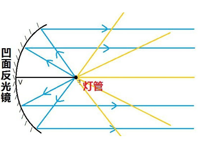
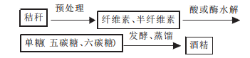

# 2018年四川省公务员录用考试《行测》题（下半年）（网友回忆版）

> 常识判断 · 13 题 · 四川 2018

## 第 1 题　qid 2280939 · 人文常识

下列有关村民委员会的说法，不正确的是：

- **A**. 选举实行无记名投票、公开计票的方法，选举结果应当当场公布
- **B**. 每届任期五年，届满应当及时举行换届选举，村民委员会成员可以连选连任　✅
- **C**. 成员中，应当有妇女成员，多民族村民居住的村应当有人数较少的民族的成员
- **D**. 罢免村民委员会成员，须有登记参加选举的村民过半数投票，并须经投票的村民过半数通过

**答案**：B

**官方解析**

本题考查法律常识。
A项正确，《村民委员会组织法》第十五条第三款规定：选举实行无记名投票、公开计票的方法，选举结果应当当场公布。选举时，应当设立秘密写票处。
B项错误，《村民委员会组织法》第十一条第二款规定：村民委员会每届任期三年，届满应当及时举行换届选举。村民委员会成员可以连选连任。因考试时间为2018年下半年，考题答案沿用《中华人民共和国村民委员会组织法(2010修订)》，故解析参照此内容，每届任期五年表述错误。根据最新的村民委员会组织法，村民委员会每届任期五年。
C项正确，《村民委员会组织法》第六条第二款规定：村民委员会成员中，应当有妇女成员，多民族村民居住的村应当有人数较少的民族的成员。
D项正确，《村民委员会组织法》第十六条第二款规定：罢免村民委员会成员，须有登记参加选举的村民过半数投票，并须经投票的村民过半数通过。
本题为选非题，故正确答案为B。
【说明】根据最新的村民委员会组织法，村民委员会每届任期五年。

---

## 第 2 题　qid 2280944 · 法律常识

根据2018年3月20日十三届全国人大一次会议通过的《中华人民共和国监察法》，下列说法错误的是：

- **A**. 行贿受贿一起查
- **B**. 以“留置”取代“两规”
- **C**. 确立了监察委员会依法独立行使监察权
- **D**. 监察委员会对违法的公职人员依法调查并作出政纪处分决定　✅

**答案**：D

**官方解析**

本题考查法律常识。
A项正确，根据《监察法》第二十二条规定：“被调查人涉嫌贪污贿赂、失职渎职等严重职务违法或者职务犯罪，监察机关已经掌握其部分违法犯罪事实及证据，仍有重要问题需要进一步调查，并有下列情形之一的，经监察机关依法审批，可以将其留置在特定场所：（一）涉及案情重大、复杂的；（二）可能逃跑、自杀的；（三）可能串供或者伪造、隐匿、毁灭证据的；（四）可能有其他妨碍调查行为的。对涉嫌行贿犯罪或者共同职务犯罪的涉案人员，监察机关可以依照前款规定采取留置措施。留置场所的设置、管理依照国家有关规定执行。”由此可见，监察机关对行贿和受贿的行为均可以进行调查。
B项正确，“两规”是《中国共产党纪律检查机关案件检查工作条例》第28条关于“调查措施”中的第三项，即“要求有关人员在规定的时间、地点就案件所涉及的问题作出说明”。习近平总书记在十九大报告中提出：“制定国家监察法，依法赋予监察委员会职责权限和调查手段，用留置取代‘两规’措施”。在《监察法》中，对留置的审批程序、适用对象、使用条件、措施采取的时限等都做出了严格的规定，甚至对调查过程的安全、医疗保障等也做出了相应的规定，这对于进一步推进反腐败工作规范化、法治化具有重大意义。
C项正确，根据《监察法》第四条规定：“监察委员会依照法律规定独立行使监察权，不受行政机关、社会团体和个人的干涉。”所以，监察委员会依法独立行使监察权。
D项错误，根据《监察法》第十一条第三项规定：“监察委员会对违法的公职人员依法作出政务处分决定；对履行职责不力、失职失责的领导人员进行问责；对涉嫌职务犯罪的，将调查结果移送人民检察院依法审查、提起公诉；向监察对象所在单位提出监察建议。”因此，监察委员会对违法的公职人员作出的是政务处分决定而非政纪处分决定。
本题为选非题，故正确答案为D。

---

## 第 3 题　qid 2280946 · 人文常识

关于经济学中的成本，下列说法不正确的是：

- **A**. 工资属于显性成本
- **B**. 办公室租金属于固定成本
- **C**. 企业管理费用属于可变成本　✅
- **D**. 固定设备折旧费属于隐性成本

**答案**：C

**官方解析**

本题考查经济常识。
A项正确，显性成本是指厂商在生产要素市场上购买或租用他人所需要的生产要素的实际支出，例如支付的生产费用、工资费用等，所以工资属于显性成本。
B项正确，固定成本是指成本总额在一定时期和一定业务量范围内，不受业务量增减变动影响而能保持不变的成本。例如房屋租金，所以办公室租金属于固定成本。
C项错误，可变成本是指成本中随着产量的变动而产生变化的成本项目，主要指原材料、燃料等。企业管理费用不是生产要素，不会随着产量的变动而产生变化，因此不属于可变成本。
D项正确，隐性成本指的是厂商自己所拥有的且被用于自己企业生产过程中的那些生产要素的报酬，如机械设备的折旧费，因此固定设备折旧费属于隐性成本。
本题为选非题，故正确答案为C。

---

## 第 4 题　qid 2280947 · 法律常识

下列情形适用我国《劳动争议调解仲裁法》的是：

- **A**. 公司员工张某经常加班，就加班工资与公司发生争议　✅
- **B**. 大学生王某暑假到某公司勤工俭学，就加班费与公司发生争议
- **C**. 赵某雇佣护工照顾瘫痪在床的父亲，双方就报酬问题发生争议
- **D**. 员工李某持有所在公司的股份，年终就分红问题与公司发生争议

**答案**：A

**官方解析**

本题考查法律常识。《劳动争议调解仲裁法》第一条规定：“为了公正及时解决劳动争议，保护当事人合法权益，促进劳动关系和谐稳定，制定本法。”《劳动争议调解仲裁法》第二条的规定：“中华人民共和国境内的用人单位与劳动者发生的下列劳动争议，适用本法：（一）因确认劳动关系发生的争议；（二）因订立、履行、变更、解除和终止劳动合同发生的争议；（三）因除名、辞退和辞职、离职发生的争议；（四）因工作时间、休息休假、社会保险、福利、培训以及劳动保护发生的争议；（五）因劳动报酬、工伤医疗费、经济补偿或者赔偿金等发生的争议；（六）法律、法规规定的其他劳动争议。”
A项正确，张某是该公司的员工，与公司之间有劳动关系，其和公司之间发生的因加班工资报酬问题所产生的争议可以适用《劳动争议调解仲裁法》。
B项错误，王某是尚未毕业的大学生，其与公司之间并未建立劳动关系，因此王某和公司之间因加班费产生的争议并非《劳动争议调解仲裁法》调整的劳动争议，不能适用《劳动争议调解仲裁法》。
C项错误，赵某和护工之间属于雇佣关系，而非劳动关系，护工与赵某之间的纠纷不属于《劳动争议调解仲裁法》的适用范围，不能适用《劳动争议调解仲裁法》。
D项错误，年终分红问题不属于《劳动争议调解仲裁法》第二条所规定的劳动争议范围，不能适用《劳动争议调解仲裁法》。
故正确答案为 A。

---

## 第 5 题　qid 2280948 · 人文常识

下列遗嘱有效的是：

- **A**. 甲委托其妻到公证处办理的公证遗嘱
- **B**. 乙口述遗嘱，由其孙子记录，乙签字认可
- **C**. 丙写下遗嘱将其财产全部留给照顾其多年的保姆，但未签名
- **D**. 丁遭遇车祸，临死前，立下口头遗嘱，由两名交警在场证明　✅

**答案**：D

**官方解析**

本题主要考查法律常识。
A项错误，公证遗嘱是依公证方式而设立的遗嘱，是证据力较强的一种遗嘱形式。根据《中华人民共和国民法典》第一千一百三十九条的规定：“公证遗嘱由遗嘱人经公证机构办理。”故办理公证遗嘱须由遗嘱人亲自到公证机关办理，公证人员对遗嘱的真实性、合法性进行审査，在确认其有效性后，由公证员出具《遗嘱公证书》。所以，A项中甲委托其妻到公证处办理的公证遗嘱无效。
B项错误，根据《中华人民共和国民法典》第一千三百三十五条的规定：“代书遗嘱应当有两个以上见证人在场见证，由其中一人代书，并由遗嘱人、代书人和其他见证人签名，注明年、月、日。”所以，B项中乙口述遗嘱，由其孙子记录，由于现场没有第三人在场见证，乙签字认可的遗嘱无效。
C项错误，根据《中华人民共和国民法典》第一千一百三十四条的规定：“自书遗嘱由遗嘱人亲笔书写，签名，注明年、月、日。”所以C项中丙未签名的遗嘱无效。
D项正确，根据《中华人民共和国民法典》第一千一百三十八条的规定：“遗嘱人在危急情况下，可以立口头遗嘱。口头遗嘱应当有两个以上见证人在场见证。危急情况消除后，遗嘱人能够以书面或者录音录像形式立遗嘱的，所立的口头遗嘱无效。”根据《中华人民共和国民法典》第一千一百四十条的规定：“下列人员不能作为遗嘱见证人：(一)无行为能力人、限制行为能力人以及其他不具有见证能力的人；(二)继承人、受遗赠人；(三)与继承人、受遗赠人有利害关系的人。”丁遭遇车祸属于危急情况，临死前立下口头遗嘱，由两名符合要求的遗嘱见证人在场证明，这种情况属于有效的口头遗嘱。
故正确答案为D。

---

## 第 6 题　qid 2280949 · 人文常识

《三十六计》是体现我国古代卓越军事思想的一部兵书，下列不属于《三十六计》的是：

- **A**. 反戈一击　✅
- **B**. 声东击西
- **C**. 暗度陈仓
- **D**. 调虎离山

**答案**：A

**官方解析**

本题主要考查人文常识。《三十六计》或称“三十六策”，是指中国古代三十六个兵法策略，语源于南北朝，成书于明清。它是根据我国古代卓越的军事思想和丰富的斗争经验总结而成的兵书，是中华民族悠久非物质文化遗产之一。
A项错误，“反戈一击”比喻掉转头来反对自己原来所属的或拥护的一方，不属于“三十六计”。其出自《尚书·武成》：“前徙倒戈，攻于后以北。”明代罗贯中《三国演义》第十七回写道：“吾与杨将军反戈击之。但看火起为号，温侯以兵相应可也。” 
B项正确，“声东击西”属于“三十六计”中的“胜战计”，指造成要攻打东边的声势，实际上却攻打西边，是使敌人产生错觉的一种出奇制胜战术，它以假动作欺敌，掩护主力在第一时间击其要害。
C项正确，“暗度陈仓”属于“三十六计”中的“敌战计”，指将真实的意图隐藏在表面的行动背后，用明显的行动迷惑对方，使敌人产生错觉，并忽略自己的真实意图，使之处于被动，受制于人。
D项正确，“调虎离山”属于“三十六计”中的“攻战计”，指如果敌方占据了有利的地势，并且兵力众多，这时我方应把敌人引出坚固的据点，或者把敌人引入对我方有利的地区，才可以取胜。
本题为选非题，故正确答案为A。

---

## 第 7 题　qid 2280950 · 地理国情

关于我国省会城市，下列说法正确的是：

- **A**. 昆明是我国海拔最高的省会城市
- **B**. 乌鲁木齐位于准噶尔盆地的南缘　✅
- **C**. 武汉的水运很发达是因为淮河流经该城市
- **D**. 杭州日出时间早于太原是由于其纬度更低

**答案**：B

**官方解析**

A项错误，拉萨是西藏自治区的首府，位于西藏高原的中部、喜马拉雅山脉北侧，地势由东向西倾斜，是西藏的政治、经济、文化和科教中心，也是藏传佛教圣地，有“日光城”之美称，海拔3650米。而昆明位于云南省中部，是云南省的省会，是我国面向东南亚、南亚乃至中东、南欧、非洲的前沿和门户，具有“东连黔桂通沿海，北经川渝进中原，南下越老达泰柬，西接缅甸连印巴”的独特区位优势。市域地处云贵高原，总体地势北部高，南部低，由北向南呈阶梯状逐渐降低。昆明市中心海拔约1891m，大部分地区海拔在1500～2800m之间。
B项正确，乌鲁木齐市，简称乌市，位于新疆维吾尔自治区中部，天山中段北麓、准噶尔盆地南缘，西部和东部与昌吉回族自治州接壤，南部与巴音郭楞蒙古自治州相邻，东南部与吐鲁番地区交界，是新疆维吾尔自治区首府，是全疆政治、经济、文化、科技的中心。
C项错误，武汉是湖北省的省会城市，位于长江、汉水的交汇处。自古以来，长江就是我国东西运输的大动脉，有“黄金水道”之称。而淮河位于中国东部，介于长江与黄河之间，发源于河南省南阳市桐柏县西部的桐柏山主峰太白顶西北侧河谷，干流流经河南、安徽、江苏三省，不流经武汉。
D项错误，地球自西向东自转，所以越靠东，越早看到日出。杭州位于我国东部沿海，因此看到日出要早。经度表示东西位置，而纬度表示南北位置，因此杭州日出时间早于太原是因为其经度靠东，与纬度无关。
故正确答案为B。

---

## 第 8 题　qid 2280952 · 人文常识

下列与汽车有关的说法不正确的是：

- **A**. 汽车雾灯一般使用黄光
- **B**. 汽车后视镜呈凹面形状　✅
- **C**. 汽车头灯里的反射镜是凹面镜
- **D**. 夜间开远光灯会造成对向司机目眩

**答案**：B

**官方解析**

本题考查科技常识。

A项正确，汽车车灯主要起照明、警示作用，光传播中越不容易被散射、传播距离越远，其照明和警示效果越好。可见光光波越长，越不容易被散射。黄色光波长仅次于红、橙光，具有较强的穿透作用。同时人们对红光的敏感程度不如对黄光和绿光的敏感程度，而绿光常用作信号灯，因此用黄光做汽车的雾灯。

B项错误，汽车后视镜呈凸面形状，它对光线有发散作用，能扩大视野，也称作广角镜，除汽车后视镜外，凸面镜还安装在转弯、路口处。

C项正确，凹面镜有聚光作用，将灯泡置于凹面镜焦点位置，焦点光源发出的光线以不同角度射向镜面，经反射会聚为平行光，光束穿过灯罩照亮前方。

D项正确，夜晚开车时，由于光线较弱，人眼会尽量放大瞳孔让更多光线进来，但是遇到对向远光灯照来，导致进光量很多，会产生眩光的效应，使驾驶员无法看清前方事物。

本题为选非题，故正确答案为B。

---

## 第 9 题　qid 2280953 · 地理国情

关于地下水，下列说法不正确的是：

- **A**. 地下水能在岩石孔隙中自由流动
- **B**. 沙漠地区的地下水资源严重匮乏　✅
- **C**. 地下水的无机盐含量比地表水更高
- **D**. 敦煌月牙泉是地下水溢出地表形成的

**答案**：B

**官方解析**

本题考查地理国情。
A项正确，地下水按物理力学性质不同，可分为结合水、毛管水和重力水，其中重力水指在重力或其它水动力作用下在岩石空隙中自由流动的水。狭义的地下水则指重力水，在国家标准《水文地质术语》（GB/T 14157-93）中，地下水是指埋藏在地表以下各种形式的重力水。
B项错误，沙漠地下通常有丰厚的疏松砂层，处于盆地较低地势的聚水位置。砂粒间有较大的孔隙以便贮存水，沙漠地下大范围的砂质沉积体，就像巨大的贮水容器一样。地表干砂层则好像这水库的盖子似的，阻挡着太阳的照晒，使地下水免遭蒸发。正是由于这个原因，许多沙漠具有丰富的地下水，而不是严重匮乏，选项表述错误。
C项正确，地下水长期与岩石、土壤接触，溶解了大量的无机盐，因此一般地下水相对来说硬度偏高，属硬水；而雨水、河水、湖水等地表水由于无机盐含量较少，硬度较低。
D项正确，敦煌盆地区域地下水位普遍较高，在此条件下，西北部平原区地下水通过地下径流进入泉域后，在地形较低的洼地溢出地表，即形成了月牙泉。
本题为选非题，故正确答案为B。

---

## 第 10 题　qid 2280954 · 人文常识

下列关于酒精的说法不正确的是：

- **A**. 小麦的秸秆可以制取酒精
- **B**. 酒精失火时应立刻用水扑灭　✅
- **C**. 酒精是很好的有机溶剂，可用于去除油污
- **D**. 酒精消毒无法达到杀死细菌芽孢的灭菌标准

**答案**：B

**官方解析**

本题考查科技常识。

A项正确，小麦等农作物秸秆主要是由木质素粘合包裹着纤维素、半纤维素组成的结构化的整体。小麦的秸秆制取酒精的原理就是将聚合体纤维素、半纤维素与结构复杂的木质素分离，然后将其分解成可发酵性糖,再将混合的戊糖和己糖转化为酒精。

B项错误，酒精在水中可以以任意比例互溶，形成不同浓度的酒精溶液，然而酒精溶液仍然可以燃烧，且用水灭火还会使酒精流动甚至飞溅，扩大着火范围。酒精失火宜用覆盖法或干粉灭火器灭火。

C项正确，当溶质在溶解时，极性分子易溶于极性溶剂，非极性分子易溶于非极性溶剂，这便是相似相溶原理。油、酒精等有机溶剂多是非极性的，所以可以用酒精溶解油污达到去污的目的。

D项正确，酒精是一种常用的消毒剂，但它只具备中效消毒能力，研究表明，酒精不能杀死细菌芽孢，也不能杀死某些病毒（如：乙肝病毒）。

本题为选非题，故正确答案为B。

---

## 第 11 题　qid 2280955 · 人文常识

关于我国五大战区，下列说法错误的是：

- **A**. 西部战区的司令部驻兰州　✅
- **B**. 五大战区在2016年正式成立
- **C**. 山西所属武装力量归中部战区领导指挥
- **D**. 以军委管总、战区主战、军种主建为战略格局

**答案**：A

**官方解析**

本题考查政治常识。
A项错误，中国人民解放军西部战区，是从军委管总、战区主战、军种主建的总原则出发，根据中国安全环境和军队担负的使命任务确定的，为正大军区级，归中央军委建制领导。其司令部驻成都，陆军机关驻兰州。
B项正确，2016年2月1日上午10时，中国人民解放军战区成立大会在北京八一大楼隆重举行。中共中央总书记、国家主席、中央军委主席习近平向东部战区、南部战区、西部战区、北部战区、中部战区授予军旗并发布五大战区正式成立。
C项正确，中部战区下辖领导和指挥北京、天津、河北、河南、山西、陕西、湖北7个省市的所属武装力量，司令部驻北京。
D项正确，习近平总书记在战区成立大会上指出：“各战区要牢记使命，坚决贯彻党在新形势下的强军目标，坚决贯彻新形势下军事战略方针，坚决贯彻军委管总、战区主战、军种主建的总原则，建设绝对忠诚、善谋打仗、指挥高效、敢打必胜的联合作战指挥机构。” 即构建了“军委管总、战区主战、军种主建”的战略格局。
本题为选非题，故正确答案为A。

---

## 第 12 题　qid 2280956 · 人文常识

下列成语反映的历史事件按时间先后排序正确的是：
①一字千金
②三顾茅庐
③四面楚歌
④黄袍加身

- **A**. ①③②④　✅
- **B**. ①③④②
- **C**. ②③④①
- **D**. ①④③②

**答案**：A

**官方解析**

本题考查人文常识。
①一字千金：战国末年，秦相国吕不韦秉政，有家僮万人、食客三千。他命门客各著其所闻，汇集为《吕氏春秋》一书。书成，吕不韦令公布于咸阳城门，同时悬千金于其上，声称有能增删一字者，赏千金。“一字千金”由此而来。
②三顾茅庐：东汉末年，天下大乱，曹操坐拥朝廷，孙权拥兵东吴，汉宗室豫州牧刘备听徐庶和司马徽说诸葛亮很有学识，又有才能，就和关羽、张飞带着礼物到隆中卧龙岗去请诸葛亮出来帮助他替国家做事，去了三次才请到诸葛亮。后来就用“三顾茅庐”比喻真心诚意，一再邀请。
③四面楚歌：楚汉争霸后期，项羽被刘邦重重包围，夜里听到周围汉营里的士兵都唱的是楚人的歌，心里丧失了斗志，并最终在乌江畔自刎而死。后来就用“四面楚歌”比喻陷入四面受敌、孤立无援的境地。
④黄袍加身：五代后周时，赵匡胤在陈桥兵变，部下诸将给他披上黄袍，拥立为天子。后比喻发动政变获得成功。
正确排序为①③②④。
故正确答案为A。

---

## 第 13 题　qid 2280958 · 人文常识

下列诗词与风景名胜对应不正确的是：

- **A**. 气蒸云梦泽，波撼岳阳城——洞庭湖
- **B**. 百万空弦嗟往事，一鞭冷月踏居庸——长城
- **C**. 十二巫山见九峰，船头彩翠满秋空——三峡
- **D**. 最爱湖东行不足，绿杨阴里白沙堤——太湖　✅

**答案**：D

**官方解析**

本题考查人文常识。
A项正确，诗句出自唐代孟浩然的《望洞庭湖赠张丞相》，该诗描写了洞庭湖壮丽的景象和磅礴的气势，借此抒发自己的政治热情和希望。
B项正确，诗句出自晚清时期社会改革家康有为写的诗篇《登万里长城》中的其二。该诗赞美长城的雄伟壮丽，抒发作者的壮志豪情。后吊古伤今，兼带议论，表达对国家衰败，民族危亡的关切，激励自己献身祖国，振兴中华。
C项正确，诗句出自南宋陆游的《三峡歌》，这首诗将三峡两岸的幽深秀丽，千姿百态，俊秀美景刻画得生动万分，惟妙惟肖，向我们真实地展现了巫山云雨的奇妙景观。
D项错误，诗句出自唐代白居易的《钱塘湖春行》，该诗描写的是西湖早春的美丽景色，而不是太湖。
本题为选非题，故正确答案为D。

---
