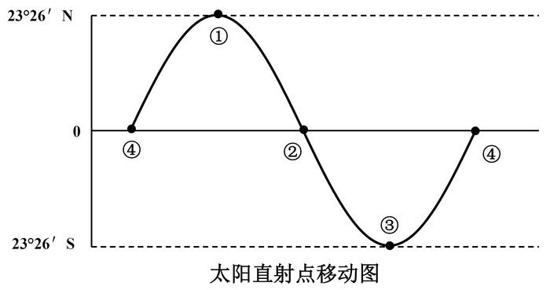
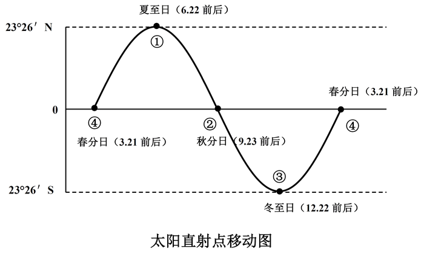
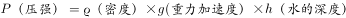
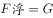
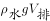

# 2018年国家公务员录用考试《行测》题（副省级网友回忆版）

> 常识判断 · 19 题 · 国考 2018

## 第 1 题　qid 2133600 · 法律常识

我国宪法对非公有制经济的规定进行了几次修改，按时间先后排序正确的是：
①允许发展私营经济，采取“引导、监督、管理”的方针
②在法律规定范围内的个体经济、私营经济等非公有制经济，是社会主义市场经济的重要组成部分
③鼓励、支持和引导非公有制经济的发展，并对非公有制经济依法实行监督和管理
④非公有制经济仅限于个体经济，不包括私营经济，且个体经济处于补充地位

- **A**. ①②④③
- **B**. ①③②④
- **C**. ④①③②
- **D**. ④①②③　✅

**答案**：D

**官方解析**

本题主要考查法律常识中宪法对非公有制经济的规定。
①“允许发展私营经济，采取‘引导、监督、管理’的方针”，根据1988年《宪法修正案》第1条规定，宪法第十一条增加规定：“国家允许私营经济在法律规定的范围内存在和发展。私营经济是社会主义公有制经济的补充。国家保护私营经济的合法的权利和利益，对私营经济实行引导、监督和管理。”即①的时间为1988年。
②“在法律规定范围内的个体经济、私营经济等非公有制经济，是社会主义市场经济的重要组成部分”，根据1999年《宪法修正案》第16条规定，宪法第十一条修改为：“在法律规定范围内的个体经济、私营经济等非公有制经济，是社会主义市场经济的重要组成部分······”即②的时间是1999年。　
③“鼓励、支持和引导非公有制经济的发展，并对非公有制经济依法实行监督和管理”，根据2004年《宪法修正案》第21条规定，宪法第十一条第二款修改为：“国家保护个体经济、私营经济等非公有制经济的合法的权利和利益。国家鼓励、支持和引导非公有制经济的发展，并对非公有制经济依法实行监督和管理。”即③的时间为2004年。
④“非公有制经济仅限于个体经济，不包括私营经济，且个体经济处于补充地位”，根据1982年《宪法》第十一条第一款规定，在法律规定范围内的城乡劳动者个体经济，是社会主义公有制经济的补充。国家保护个体经济的合法的权利和利益。即④的时间为1982年。
按时间先后排序为④①②③。
故正确答案为D。

---

## 第 2 题　qid 2133616 · 人文常识

下列关于“三农”问题的说法错误的是：

- **A**. 民政部门是农民专业合作社登记机关　✅
- **B**. 征地补偿费的使用、分配方案，经村民会议讨论决定方可办理
- **C**. 深入推进农业供给侧结构性改革是当前和今后一个时期农业农村工作的主线
- **D**. 村民委员会作出的决定侵害村民合法权益的，受侵害的村民可以申请人民法院予以撤销

**答案**：A

**官方解析**

本题考查法律及时政常识。
A项错误，《农民专业合作社登记管理条例》第四条第一款规定：“工商行政管理部门是农民专业合作社登记机关。国务院工商行政管理部门负责全国的农民专业合作社登记管理工作。”据此可知，民政部门不是农民专业合作社登记机关。
B项正确，《中华人民共和国村民委员会组织法》第二十四条第七款规定：“征地补偿费的使用、分配方案，经村民会议讨论决定方可办理。”
C项正确，《中共中央 国务院关于深入推进农业供给侧结构性改革 加快培育农业农村发展新动能的若干意见》中明确提出“推进农业供给侧结构性改革是一个长期过程”；“坚持新发展理念，协调推进农业现代化与新型城镇化，以推进农业供给侧结构性改革为主线”。据此可知，深入推进农业供给侧结构改革是当前和今后一个时期农业农村工作的主线。
D项正确，《中华人民共和国村民委员会组织法》第三十六条第一款规定：“村民委员会或者村民委员会成员作出的决定侵害村民合法权益的，受侵害的村民可以申请人民法院予以撤销，责任人依法承担法律责任。”
本题为选非题，故正确答案为A。

---

## 第 3 题　qid 2133752 · 科技常识

关于我国自主研发的新成果，下列说法错误的是：

- **A**. 在世界上首次实现卫星与地面之间的量子通信
- **B**. 实现总装下线的“蛟龙一600”（现被称为鲲龙600）属于水陆两栖飞机
- **C**. 已成功下潜的“潜龙二号”是有缆遥控水下机器人　✅
- **D**. 超级计算机“神威•太湖之光”的运算速度居世界第一

**答案**：C

**官方解析**

本题考查我国自主研发的科技新成果。
A项正确，2016年8月，我国成功发射了世界上首颗量子科学实验卫星“墨子号”，中国成为世界上首个实现卫星与地面之间量子通信的国家。
B项正确，“蛟龙—600”是中国自行设计研发的大型水陆两栖飞机，最大的特点是既能在陆地上起降，又能在水面上起降，于2016年7月23日总装下线。(备注：现在被称为鲲龙600)
C项错误，“潜龙二号”是无缆的自主式水下潜器。2016年1月10日，我国自主研发的 “潜龙二号”在西南印度洋成功下潜至1600米指定位置，在复杂的海底环境下自主航行作业，获得这个区域的精细海底地形地貌图，实现了在大洋中脊海底的首次勘探。
D项正确，“神威•太湖之光”是我国研制的超级计算机。2017年11月发布的新一期的全球超级计算机500强排名，中国的“神威•太湖之光”运算速度居世界第一，已经连续四次获得冠军。
本题为选非题，故正确答案为C。
备注：此题已过时，截至2021年7月，根据新一期的全球超级计算机500强排名，日本的Fugaku（中文名“富岳”）排名第一，中国的神威太湖之光排名第四。

---

## 第 4 题　qid 2133754 · 人文常识

下列说法符合我国著作权法规定的是：

- **A**. 中国公民未发表的作品不享有著作权
- **B**. 外国人的作品首先在中国境内出版的，享有著作权　✅
- **C**. 美术作品出版后，该美术作品原件的展览权归出版人享有
- **D**. 合作作品的著作权保护期截止于最早死亡的作者死亡后第五十年

**答案**：B

**官方解析**

本题考查法律常识。
A项错误，根据《中华人民共和国著作权法》第二条第一款规定：“中国公民、法人或者其他组织的作品，不论是否发表，依照本法享有著作权。” 
B项正确，根据《中华人民共和国著作权法》第二条第三款规定：“外国人、无国籍人的作品首先在中国境内出版的，依照本法享有著作权。”
C项错误，根据《中华人民共和国著作权法》第十条规定：“著作权包括下列人身权和财产权：……（八）展览权，即公开陈列美术作品、摄影作品的原件或者复制件的权利……”。所以展览权归著作权人所有，而不是出版人。
D项错误，根据《中华人民共和国著作权法》第二十一条第一款规定：“公民的作品，其发表权、本法第十条第一款第（五）项至第（十七）项规定的权利的保护期为作者终生及其死亡后五十年，截止于作者死亡后第五十年的12月31日；如果是合作作品，截止于最后死亡的作者死亡后第五十年的12月31日。”
故正确答案为B。

---

## 第 5 题　qid 2133756 · 人文常识

关于2017年新调整的海洋伏季休渔制度，下列说法错误的是：

- **A**. 各类作业方式休渔时间均有所延长
- **B**. 首次将南海的单层刺网纳入休渔范围
- **C**. 统一了所有海域的休渔结束时间　✅
- **D**. 首次要求为捕捞渔船配套服务的捕捞辅助船同步休渔

**答案**：C

**官方解析**

本题考查2017年新调整的海洋伏季休渔制度。2017年，农业部在广泛征求意见的基础上对伏休制度进行了调整，发布了《农业部关于调整海洋伏季休渔制度的通告》（以下简称《通告》）。《通告》规定的休渔时间为：（一）北纬35度以北的渤海和黄海海域为5月1日12时至9月1日12时。（二）北纬35度至26度30分之间的黄海和东海海域为5月1日12时至9月16日12时；北纬26度30分至“闽粤海域交界线”的东海海域为5月1日12时至8月16日12时。在上述海域范围内，桁杆拖虾、笼壶类、刺网和灯光围（敷）网休渔时间为5月1日12时至8月1日12时。（三）北纬12度至“闽粤海域交界线”的南海海域（含北部湾）为5月1日12时至8月16日12时。
A项正确，根据《通告》，休渔时间不少于三个月，总体上延长了休渔时间。此前的规定，2014年—2016年的休渔时间为：北纬35度以北的渤海和黄海海域为6月1日12时至9月1日12时；北纬35度至26度30分的黄海和东海海域为6月1日12时至9月16日12时；北纬26度30分至“闽粤海域交界线”的东海海域为5月16日12时至8月1日12时。
B项正确，依据《通告》，休渔海域规定为“渤海、黄海、东海及北纬12度以北的南海（含北部湾）海域”，休渔作业类型为“除钓具外的所有作业类型”，此前从未将南海的单层刺网纳入休渔，所以说是首次将南海的单层刺网纳入休渔范围。
C项错误，新的制度统一了休渔的开始时间为5月1日12时，利于全国各海区同步行动，实现了在同一时间节点对休渔船的全覆盖监管，但各海域休渔结束时间不同。
D项正确，根据《通告》，休渔作业类型为：除钓具外的所有作业类型，为捕捞渔船配套服务的捕捞辅助船同步休渔。这是首次要求为捕捞渔船配套服务的捕捞辅助船同步休渔。
本题为选非题，故正确答案为C。

---

## 第 6 题　qid 2133758 · 法律常识

甲国与乙国因领土纠纷发生争端，下列说法不符合国际法相关规定的是：

- **A**. 甲乙两国可以派出外交使节进行谈判，这是解决争端最直接的方法
- **B**. 甲乙两国可以约定将争端交付仲裁机构处理，但仲裁裁决不具有法律制裁性质
- **C**. 丙国可以调停者的身份参加两国的谈判，但其提出的解决方案对甲乙两国没有约束力
- **D**. 甲乙两国可用请求书方式将争端提交国际法院，国际法院作出的判决交由联合国强制执行　✅

**答案**：D

**官方解析**

本题考查法律常识之国际法。解析依据《2018年国家统一法律职业资格考试辅导用书•第四卷》（国家统一法律职业资格考试辅导用书编辑委员会编，法律出版社出版）
A项正确，根据《2018年国家统一法律职业资格考试辅导用书•第四卷》344页：“谈判是争端当事国就其争端直接进行交涉，交换意见以求解决的方式。谈判是解决国际争端的最基本方式”。“谈判”即当事国直接进行交涉，是最直接的方式。因此表述正确。
B项正确，根据《2018年国家统一法律职业资格考试辅导用书•第四卷》345-346页：“仲裁或称公断，是指根据争端当事国之间的协议，将争端交与他们选定的仲裁人作出对争端当事方具有拘束力的裁决，从而解决争端的方法”。此外，仲裁裁决不具有法律制裁性质，但当事国出于道义上的责任，必须严格执行。因此表述正确。
C项正确，根据《2018年国家统一法律职业资格考试辅导用书•第四卷》345页：“调停是指第三方以调停人的身份，就争端的解决提出方案，并直接参加或主持谈判，以协助争端解决。调停国提出的方案本身没有拘束力，调停国对于进行调停或调停成败也不承担任何法律义务或后果”。因此表述正确。
D项错误，根据《2018年国家统一法律职业资格考试辅导用书•第四卷》348页：“国际法院的判决是终局性的。判决一经作出，即对本案及本案当事国产生拘束力，当事国必须履行。如有一方拒不履行判决，他方得向安理会提出申诉，安理会可以作出有关建议或决定采取措施执行判决”。因此该项“国际法院作出的判决交由联合国强制执行”表述错误。
本题为选非题，故正确答案为D。

---

## 第 7 题　qid 2133610 · 经济常识

下列金融机构与其可以从事的金融业务对应正确的是：

- **A**. 商业银行——股票承销业务
- **B**. 人寿保险公司——医疗责任保险业务
- **C**. 小额贷款公司——城乡居民储蓄存款业务
- **D**. 中国出口信用保险公司——海外投资保险业务　✅

**答案**：D

**官方解析**

本题考查经济常识，主要考查经济业务的主体和具体业务之间的对应关系。
A项错误，商业银行的主要业务范围是吸收公众存款、发放贷款以及办理票据贴现等，不能承担股票承销业务，股票承销业务一般由证券公司承担。
B项错误，《保险法》第九十五条规定：“保险人不得兼营人身保险业务和财产保险业务。”人寿保险公司的业务属于人身保险业务，而医疗责任保险业务属于财产保险业务，根据保险人不得兼营人身保险业务和财产保险业务的规定，人寿保险公司不能经营医疗责任保险业务。
C项错误，《关于小额贷款公司试点的指导意见》规定：“小额贷款公司是由自然人、企业法人与其他社会组织投资设立，不吸收公众存款，经营小额贷款业务的有限责任公司或股份有限公司。”故小额贷款公司不能承接城乡居民储蓄存款业务。
D项正确，中国出口信用保险公司，简称中国信保，是由国家出资设立、支持中国对外经济贸易发展与合作、具有独立法人地位的国有政策性保险公司，其业务范围包括海外投资保险业务、中长期出口信用保险业务、短期出口信用保险业务、来华投资保险业务等。
故正确答案为D。

---

## 第 8 题　qid 2133760 · 人文常识

下面是对我国一份近代历史文献的描述：是一份改革内政和建设国家的新方案；是发展资本主义的近代化纲领；因脱离当时社会现实而未能实施。
这份文献可能是：

- **A**. 《海国图志》
- **B**. 《资政新篇》　✅
- **C**. 《天朝田亩制度》
- **D**. 《中华民国临时约法》

**答案**：B

**官方解析**

题干列出三项要求，需要一一对应，全部符合才是正确选项。
A项错误，《海国图志》是清代魏源所写的中国近代史上第一部全面系统介绍世界历史地理的巨著，不涉及改革内政、发展资本主义等内容，排除；
B项正确，《资政新篇》是太平天国干王洪仁玕提出的带有资本主义色彩的改革方案，其核心是要在中国发展资本主义，是中国第一个近代化纲领。但由于太平天国本身不具备实施资本主义建设方案的阶级基础和社会条件，加上战争环境的限制，该方案并未能实行，符合题干的三项要求，正确；
C项错误，《天朝田亩制度》是太平天国的建国纲领，反映了农民要求废除封建土地所有制的强烈愿望，体现了绝对平均主义思想，只是空想，根本无法实现，但该制度不涉及改革内政、建设国家、发展资本主义等内容，排除；
D项错误，《中华民国临时约法》是辛亥革命胜利后建都于南京的中华民国临时政府于1912年颁布的。该法是具有“宪法”性质的根本大法，是中国第一部资产阶级宪法性文件。本法曾实施过，不符合题干要求，排除。
故正确答案为B。

---

## 第 9 题　qid 2133612 · 人文常识

下列研究课题与其查阅的主要参考文献对应错误的是：

- **A**. 商周时代的艺术成就——《中国青铜时代》
- **B**. 南宋都城的城市建设——《从平城到洛阳》　✅
- **C**. 晚清的政治改良运动——《从甲午到戊戌》
- **D**. 明末中西文化交流史——《利玛窦与中国》

**答案**：B

**官方解析**

本题考查人文常识，主要考查中国历史。
A项正确，夏商周在中国历史上被称为青铜时代，商周时期是青铜发展的繁盛时期，故研究商周时期的艺术成就选择《中国青铜时代》是正确的。
B项错误，北宋灭亡后赵构在南方建立了南宋，其都城为临安（今浙江杭州），因此研究其都城的城市建设选择文献《从平城到洛阳》是错误的。
C项正确，中日甲午战争后，帝国主义掀起了瓜分中国的狂潮，使中华民族进一步觉醒，以康有为、梁启超为代表的维新派人士通过光绪帝进行倡导学习西方，提倡科学文化，改革政治、教育制度，发展农、工、商业等的政治改良运动。故研究晚清政治改良运动查阅《从甲午到戊戌》是正确的。
D项正确，利玛窦是意大利的传教士，明朝万历年间（明末）来到中国传教。他是最早在中国传教的传教士之一，也是第一位阅读钻研中国文学典籍的西方学者。故研究明末中西文化交流史查阅《利玛窦与中国》是正确的。
本题为选非题，故正确答案为B。

---

## 第 10 题　qid 2133618 · 人文常识

某高校学生会干事小王负责策划一个民族文化展示周活动，下列哪个设计方案不合适？

- **A**. 请维吾尔族学生表演手鼓舞
- **B**. 请蒙古族学生制作奶茶
- **C**. 请朝鲜族学生展示唐卡　✅
- **D**. 请彝族学生展示花腰刺绣

**答案**：C

**官方解析**

本题考查各少数民族的特色活动。
A项正确，手鼓舞是维吾尔族民间舞蹈，流行于新疆维吾尔自治区。多为女子独舞，用手鼓伴奏，舞者能随鼓点的变化舞出不同的姿态。
B项正确，蒙古奶茶，蒙古语称“苏台茄”，是流行于蒙古族的一种奶制品，由砖茶煮成并带有咸味。喝此种奶茶是蒙古族的传统饮食习俗。
C项错误，唐卡不是朝鲜族的艺术，而是藏族文化艺术。唐卡是一种独具特色的绘画艺术形式，题材内容涉及藏族的历史、政治、文化和社会生活等诸多领域，传世唐卡作品大都是藏传佛教和苯教作品。
D项正确，彝族刺绣工艺，无论是从题材、技法，还是纹样、色彩、构图等各方面都具有非常高的水平，是云南红河哈尼族彝族自治州石屏县花腰彝族的传统文化技艺，花腰彝族是彝族的一个分支，因这种浓艳多彩的花腰服饰而得名。
本题为选非题，故正确答案为C。

---

## 第 11 题　qid 2133624 · 人文常识

美国社会学家帕森斯认为：在公元前的第一个千年之内，“哲学的突破”以截然不同的方式分别发生在希腊、以色列、印度和中国等地。下列思想观点产生于这一时代的是：

- **A**. 致虚守静，道法自然　✅
- **B**. 心外无物，心外无理
- **C**. 人民为主，工商皆本
- **D**. 师夷长技，中体西用

**答案**：A

**官方解析**

本题考查公元前1000年—公元前1年的著名思想观点。
A项正确，“致虚守静”出自《道德经》第十六章：“致虚极，守静笃”，“道法自然”出自《道德经》第二十五章：“人法地，地法天，天法道，道法自然”，均是春秋时期道家创始人老子的著名言论。老子，姓李名耳，字聃，约生活于公元前571年—公元前471年，时间符合题干要求，因此当选。
B项错误，“心外无物，心外无理”是明代著名的思想家王阳明的著名言论。王守仁，别号阳明，生活于1472年—1529年，不符合题干公元前1000年—公元前1年的表述，因此排除。
C项错误，“人民为主，工商皆本”是明清之际的批判思想，代表人物是黄宗羲、顾炎武、王夫之。“人民为主”，即反对君主专制独裁；“工商皆本”，强调经世致用，是他们的主要主张。明末清初的时间约为1600年—1700年，不符合题干公元前1000年—公元前1年的表述，因此排除。
D项错误，“师夷长技，中体西用”是晚清时期鸦片战争后及洋务运动的著名口号。鸦片战争是1840年、洋务运动是19世纪60—90年代，不符合题干公元前1000年—公元前1年的表述，因此排除。
故正确答案为A。

---

## 第 12 题　qid 2133764 · 人文常识

下列诗句所描述情景出现的时间与图中标示的时间段，对应正确的是：

- **A**. 今夜月明人尽望，不知秋思落谁家——④①之间
- **B**. 接天莲叶无穷碧，映日荷花别样红——②③之间
- **C**. 天街小雨润如酥，草色遥看近却无——①②之间
- **D**. 半盏屠苏犹未举，灯前小草写桃符——③④之间　✅

**答案**：D

**官方解析**

太阳直射点一年中在南北回归线之间移动，大致方向为：

（1）春分（3月21日前后）——夏至（6月22日前后），从赤道移动至北回归线。

（2）夏至（6月22日前后）——秋分（9月23日前后），从北回归线移动至赤道。

（3）秋分（9月23日前后）——冬至（12月22日前后），从赤道移动至南回归线。

（4）冬至（12月22日前后）——春分（3月21日前后），从南回归线移动至赤道。

 A项错误，④到①时段是春分到夏至。而由选项“秋思”可知诗句发生在秋天，不可能是在④到①之间，因此错误。

 B项错误，②到③时段是秋分至冬至。而由选项“莲叶”“荷花”可知诗句发生在夏季，不可能在②到③之间，因此错误。

 C项错误，①到②时段是夏至至秋分。而选项诗句出自韩愈的《早春》，发生在春季，不可能在①到②之间，因此错误。

 D项正确，③到④时段是冬至至春分。而由选项“屠苏”、“桃符”可知是春节，古人春节习俗，有悬挂“桃符”、饮屠苏酒的风俗。农历春节在大寒和立春之间，即太阳直射点在③至④之间，该选项正确。

 故正确答案为D。

---

## 第 13 题　qid 2133766 · 人文常识

下列哪一现象与季风气候不存在因果关系？

- **A**. 塔里木河在夏季进入汛期　✅
- **B**. 华北地区在初春频发寒潮
- **C**. 我国东北的工业区一般建在城市的东北或西南
- **D**. 夏季长江入海口附近海域的盐度比其他季节低

**答案**：A

**官方解析**

本题考查地理常识。
 我国季风区和非季风区的分界线，由东北向西南大致为大兴安岭--阴山--贺兰山--巴颜喀拉山--冈底斯山，其东部属于季风区，其西部属于非季风区。
 A项错误，塔里木河流域地处亚欧大陆腹地，远离海洋，四周高山环绕，属大陆性暖温带、极端干旱沙漠性气候，属于我国的非季风区。塔里木河夏季汛期是因为夏季气温高，冰雪消融量大所导致的，与季风气候无关。
 B项正确，华北地区位于我国的季风区，初春受西伯利亚冬季风的影响，会带来干冷的大陆气团，强烈发展时，会造成寒潮。
 C项正确，东北地区位于我国的季风区，夏季盛行东南风，冬季盛行西北风。故把工业区建在城市的东北或西南方向，可以减少对城市的污染。
 D项正确，长江入海口地区位于我国的季风区，夏季长江入海口受季风影响，会带来丰沛的降水，导致水流径流量大，稀释了入海口附近的海域盐度，会导致其盐度比其他季节低。
本题为选非题，故正确答案为A。

---

## 第 14 题　qid 2133632 · 地理国情

关于下列地区的说法错误的是：

- **A**. 欧洲北海：既是著名产油区，又是著名渔场
- **B**. 波斯湾地区：既是著名产油区，又是古文明发祥地
- **C**. 湄公河流域：既是小麦主产区，又是佛教圣地　✅
- **D**. 五大湖区：既有世界上面积最大的淡水湖，又跨美加两国边境线

**答案**：C

**官方解析**

本题考查地理常识。
A项正确，北海是著名的产油区，是位于欧洲大陆西北部和大不列颠岛之间的北海海底油田，上世纪80年代开始被大规模开采，使沿岸的英国成为世界上重要产油国之一。北海渔场是受北大西洋暖流与来自北冰洋的南下海水交汇形成的大渔场，冷暖海水在此交汇，为鱼类带来丰富饵料，鱼产丰富，种类繁多，是世界上著名的四大渔场之一。
B项正确，波斯湾位于伊朗高原和阿拉伯半岛之间，在波斯湾及其周边形成了一条巨大的石油带，这里蕴藏着占世界石油总储量一半以上的石油。波斯湾地区历史悠久，在伊拉克东南部幼发拉底河和底格里斯河的下游曾诞生苏美尔文明，是两河流域早期文化的创造者。
C项错误，湄公河上游在中国境内被称为澜沧江，流经的地区有老挝、缅甸、泰国、柬埔寨、越南，为东南亚重要的水稻产区，因此“小麦主产区”的说法错误。湄公河流域的地区和国家佛教盛行，佛寺众多，因此“佛教圣地”的说法正确。
D项正确，五大湖区是世界上最大的淡水湖群，位于加拿大和美国交界处，按大小分别为苏必利尔湖、休伦湖、密歇根湖、伊利湖和安大略湖。其中苏必利尔湖是世界上面积最大的淡水湖。
本题为选非题，故正确答案为C。

---

## 第 15 题　qid 2133628 · 人文常识

假如地球重力加速度减为现在的一半，下列数值不会发生变化的是：

- **A**. 鱼在相同水深下受到的压强
- **B**. 船在水中的吃水深度　✅
- **C**. 人在体重计上的称量结果
- **D**. 人可以举起的石块的最大质量

**答案**：B

**官方解析**

本题考查地球重力加速度变化所产生的影响。地球引力是因地球本身质量而具有的引力。重力加速度是一个物体在受重力作用的情况下所具有的加速度，用表示。假如地球的引力减小一半，即变为原来的一半。 

A项错误，鱼在水中所受的压强公式为，在相同水深下，当变为原来的一半时，鱼受到的压强为原来的一半。

B项正确，变化前后，船始终处于二力（船所受浮力和重力）平衡状态，且船的质量不变，由二力平衡条件可知，即，根据简单的数学计算可知，在公式两边直接消掉，对结果不产生影响，因此船的吃水深度也不变。

C项错误，体重计称的是人的体重，计算公式为，当变为原来的一半时，人的体重变为原来的一半。

D项错误，人举起石头要克服重力做功，其公式为：。当和不变，变为原来的一半时，可举起重物的质量，变为原来的2倍。

本题为选非题，故正确答案为B。

---

## 第 16 题　qid 2133768 · 人文常识

9月底，小李开启了欧洲之旅。他先参加了一场盛大的啤酒节，随后参观了海德公园并瞻仰了马克思墓，最后参观了欧盟总部。问小李依次游历了哪几座城市？

- **A**. 慕尼黑、伦敦、布鲁塞尔　✅
- **B**. 米兰、柏林、阿姆斯特丹
- **C**. 柏林、伦敦、日内瓦
- **D**. 巴黎、汉堡、布鲁塞尔

**答案**：A

**官方解析**

本题考查地理常识。
 （1）慕尼黑啤酒节又称“十月节”，举办时间为每年九月末到十月初，持续两周；
 （2）海德公园是伦敦最知名的公园。马克思墓位于伦敦北郊的海格特公墓内；
 （3）欧洲联盟由欧洲共同体发展而来，总部设立在比利时首都布鲁塞尔。
 据此可知小李欧洲之旅依次游历了慕尼黑、伦敦、布鲁塞尔等城市。
故正确答案为A。

---

## 第 17 题　qid 2133638 · 人文常识

下列与果树有关的说法正确的是：

- **A**. 富含氮的肥料可促进果树开花结果
- **B**. 杏树是耐旱能力比较弱的树种
- **C**. 冬季不需要对果树进行病虫防治
- **D**. 嫁接是一种常用的果树繁殖方式　✅

**答案**：D

**官方解析**

本题考查生物常识。
A项错误，使用含氮的肥料能促进细胞的分裂和生长，使枝叶长得繁茂；含磷的肥料能促进幼苗的发育和花的开放，使果实、种子提早成熟，因此促进开花结果应使用富含磷的肥料，而非含氮的肥料。
B项错误，杏树具有扎根较深，喜光、耐旱、抗寒、抗风的特点，其寿命可长达百年以上，在我国多在北方地区栽培。“耐旱能力较弱”的说法错误。
C项错误，冬季是果树病虫潜伏越冬的时期。做好冬季病虫害防治工作，对减少病原菌及害虫的越冬基数，有效控制次年病虫害的发生十分重要，因此冬季也需要对果树进行病虫防治。
D项正确，为了保持优良特性，加快繁殖速度，人们常用茎对一些植物进行繁殖，嫁接就是其中常用的一种。简单来说嫁接就是把一个植物体的芽或枝，接在另一个植物体上，使结合在一起的两部分长成为一个完整的植物体，常见的苹果、梨、桃等果树都是进行嫁接繁殖的，是一种常用的果树繁殖方式。
故正确答案为D。

---

## 第 18 题　qid 2133770 · 人文常识

关于北斗七星，下列说法正确的是：

- **A**. 北斗七星的相对位置始终不变
- **B**. 北斗七星是七颗亮度相等的恒星
- **C**. 北斗七星中的开阳星与其辅星构成双星　✅
- **D**. 古代“斗牛”中的“斗”指北斗七星

**答案**：C

**官方解析**

本题考查了天文常识。
 A项错误，北斗七星在天空中做缓慢的相对运动，其中五颗星以大致相同的速度朝着一个方向运动，而“天枢”和“摇光”则朝着相反的方向运动。因此，在漫长的宇宙变迁中，北斗七星的相对位置会发生较大的变化。
 B项错误，北斗七星都是恒星，其中“玉衡”最亮，亮度几乎接近一等星。“天权”最暗，是一颗三等星。所以它们的亮度并不相等。
 C项正确，从北斗七星勺柄数起的第二颗是开阳星，它与其辅星构成了一对，观测者能直接用望远镜分辨出。
 D项错误，“斗牛”是指“斗宿”和“牛宿”，其中“斗宿”指的不是北斗，而是只有六颗星星的南斗。
 故正确答案为C。

---

## 第 19 题　qid 2133774 · 科技常识

下列关于蛋白质的说法错误的是：

- **A**. 蛋白质是鸟类羽毛的构成成分
- **B**. 蛋白质缺乏会导致儿童发育迟缓
- **C**. 蛋白质摄入过量会在人体内转化为脂肪
- **D**. 植物蛋白比动物蛋白更易被人类消化吸收　✅

**答案**：D

**官方解析**

本题考查生物常识。
A项正确，鸟类羽毛的主要成分是角蛋白，除此以外还有人体的头发，动物的鳞甲等主要成分也与之类似。
B项正确，蛋白质的缺乏常见症状是代谢率下降，对疾病抵抗力减退，易患病，远期效果是器官的损害，常见的是儿童的生长发育迟缓、营养不良、体质下降、淡漠、易激怒，并因为易感染而继发疾病。
C项正确，摄入必要的蛋白质对人体健康十分重要，但是如果摄取过量的话也会在体内转化成脂肪，造成脂肪堆积，加重肾脏负担。
D项错误，相比之下，动物蛋白更容易被人类消化吸收，主要是由于动物蛋白相对于人类的营养结构比较吻合，其蛋白质的种类和结构更加接近人体的蛋白结构和数量。故植物蛋白比动物蛋白更易被人类消化吸收的说法错误。
本题为选非题，故正确答案为D。

---
