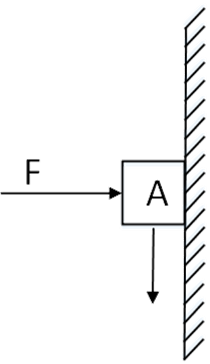
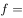
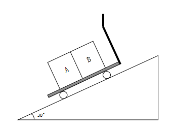
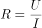
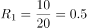
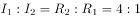
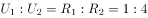
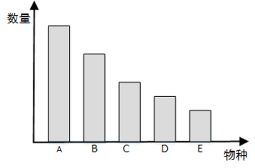
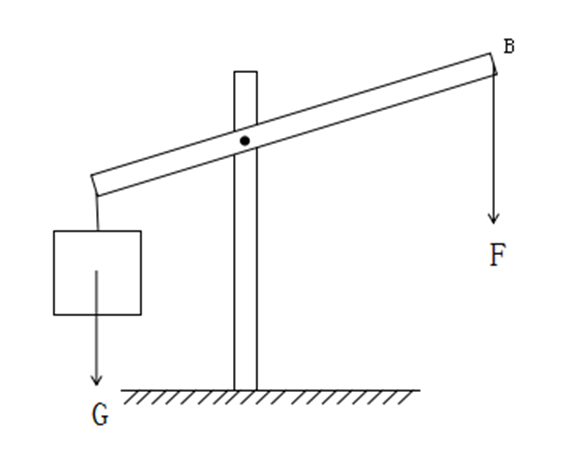
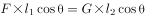

# 2018年广东省公务员录用考试《行测》题（县级、乡镇统一卷）（网友回忆版）

> 常识判断 · 21 题 · 广东 2018

## 第 1 题　qid 2185142 · 科技常识

如图所示，质量为m的物体A在水平力F的作用下，恰好沿竖直墙壁匀速下滑，当水平力增大为2F时，物体A逐渐减速，最后保持静止。则静止时物体A所受摩擦力的大小（  ）。

- **A**. 为原来的2倍
- **B**. 小于F　✅
- **C**. 大于mg
- **D**. 等于2F

**答案**：B

**官方解析**

物体A匀速下滑时，A受力平衡，A竖直方向所受力为向下的重力和向上的动摩擦力，两个力大小相等方向相反，；水平方向受向右的水平力和向左的墙壁支持力，两个力大小相等方向相反，。根据动摩擦力计算公式，一般，故。

物体A静止时，A同样受力平衡，A竖直方向所受力为向下的重力和向上的静摩擦力，两个力同样大小相等方向相反，。故，

根据之前推导出的，，所以。

故正确答案为B。

---

## 第 2 题　qid 2185144 · 科技常识

一颗种子在地下生根发芽，最终破土而出，长成一株小树苗。在这个过程中，其有机物总量（  ）。

- **A**. 逐渐增加
- **B**. 先增加后减少
- **C**. 先减少后增加　✅
- **D**. 先保持不变，后逐渐增加

**答案**：C

**官方解析**

种子在萌发过程中从外界获得氧气，消耗自身有机物，进行呼吸作用，释放能量；当破土而出生根发芽时，通过产生的叶绿素进行光合作用，积累有机物，因此在整个过程中有机物的含量先减少后增加。
故正确答案为C。

---

## 第 3 题　qid 2185146 · 科技常识

现在，人们常利用碘化银实现人工降雨。通过高炮将含有碘化银的炮弹打入云雾厚度比较大的高空中，碘化银因为炮弹的爆炸在高空扩散，促使降雨产生（如图所示）。下列说法正确的是（  ）。

- **A**. 利用碘化银人工降雨需要选择炎热的天气才能实现
- **B**. 银是重金属，利用碘化银人工降雨会对环境造成极大破坏
- **C**. 碘化银在高空形成极细的粒子，云中的水分在其周围凝聚，形成降雨　✅
- **D**. 碘化银作为催化剂，让高空中固态的水液化，实现人工降雨

**答案**：C

**官方解析**

碘化银在人工降雨中所起的作用在气象学上称作冷云催化。碘化银只要受热后就会在空气中形成极多极细（只有头发直径的百分之一到千分之一）的碘化银粒子。1g碘化银可以形成几十万亿个微粒。这些微粒会随气流运动进入云中，在冷云中产生几万亿到上百亿个冰晶。冰晶融化后形成雨滴，实现降雨。碘化银作用的范围很大，所以单位面积中的残留量会很少，且在天然环境中银容易形成不溶于水的化合物，对环境的影响也大大减小。
故正确答案为C。

---

## 第 4 题　qid 2185149 · 科技常识

用手推车将两箱货物A和B拉到仓库存储，途中要经过一段斜坡（如图所示）。已知货物A和B的质量均为m，斜坡的坡度为推车匀速经过斜坡时，货物A和B均处于静止状态，则受力情况正确的是（  ）。

- **A**. 货物B所受的合外力方向沿斜面向上
- **B**. 货物B对货物A的作用力大小为0.5mg
- **C**. 货物A所受的摩擦力比货物B所受的摩擦力大
- **D**. 手推车对货物A的支持力等于对货物B的支持力　✅

**答案**：D

**官方解析**

A项错误，由于货物B处于静止状态，故所受的合外力为0，那么方向不可能沿斜面向上。
B、C两项错误，通过受力分析可知，物体A与B受到的摩擦力均可与重力沿斜面向下的分力的大小相等，由于A与B质量相同，且在同一斜坡上，故二者的重力沿斜面向下的分力也大小相等，所以物体A与B受到的摩擦力大小相等，此时A与B之间无相互作用力。
D项正确，通过受力分析可知，物体A与B受到的支持力与重力沿垂直于斜面方向的分力的大小相等，由于A与B质量相同，且在同一斜坡上，故二者的重力沿垂直于斜面方向的分力的大小相等，所以物体A与B受到的支持力相等。
故正确答案为D。

---

## 第 5 题　qid 2185150 · 科技常识

下图是两种不同导体（、）的伏安特性曲线，则以下选项无法确定的是（  ）。

- **A**. 
、的电阻之比为1：4

- **B**. 
、的额定功率相同
　✅
- **C**. 
并联在电路中时，、电流比为4：1

- **D**. 
串联在电路中时，、电压比为1：4

**答案**：B

**官方解析**

A项，根据欧姆定律得，结合图像可知，，，则，可推出。

B项，额定功率是指用电器正常工作时的功率。它的值为用电器的额定电压乘以额定电流，本题中未告知额定电压和额定电流，故无法推出。

C项，在并联电路中，电压（U）相同，因此I与R成反比，则，可推出。

D项，在串联电路中，电流（I）相同，因此U与R成正比，则，可推出。

本题为选非题，故正确答案为B。

---

## 第 6 题　qid 2185094 · 科技常识

地表某相对独立的生态系统，其主要物种及数量如图所示，则下列说法必然正确的是（  ）。

- **A**. 物种A是该生态系统生产者
- **B**. 物种B是该生态系统的初级消费者
- **C**. 该生态系统的能量流动是从A到E
- **D**. 该生态系统的最终能量来源是太阳能　✅

**答案**：D

**官方解析**

A项错误，图表中给出五个主要物种及其数量的分布，这些物种包含了分解者、生产者以及各类消费者。其中，分解者包含细菌这样的微生物，其个体数量远超过生产者、各类消费者，因此在生态系统中一定是分解者数量最多，可以确定A是分解者，不是生产者；
B项错误，生产者和消费者的数量要根据具体的生态系统来确定。例如，某生态系统中，一颗或几颗大树养活很多动物，这时消费者的数量要多于生产者的数量；又如，在一个草原生态系统中，草的数量要远多于牛、羊、兔子等消费者，这时生产者的数量要多于消费者的数量。由于题干没有给出具体的生态系统类型，故无法判断物种B是否为初级消费者；
C项错误，生态系统中，能量从生产者流向消费者，由于无法确定B、C、D、E属于生产者还是消费者，因此也无法确定能量流动方向；
D项正确，地表生态系统的能量归根结底是来源于植物的光合作用，也就是来自太阳能。
故正确答案为D。

---

## 第 7 题　qid 2185099 · 科技常识

用如图所示的杠杆提升物体。从B点垂直向下用力，在将物体匀速提升到一定高度的过程中，用力的大小将（  ）。

- **A**. 保持不变　✅
- **B**. 逐渐变小
- **C**. 逐渐变大
- **D**. 先变大，后变小

**答案**：A

**官方解析**

如图所示，杠杆夹角为，支点到杠杆两端的距离为，。由于匀速提升，根据杠杆平衡条件，，故。，不变，G不变因此F不变。故正确答案为A。

---

## 第 8 题　qid 2185104 · 科技常识

在检查视力时，检查者通常从面前的平面镜中看身后的视力表（如图所示）。下列说法正确的是（  ）。

- **A**. 视力表在平面镜中的像与检查点相距7米　✅
- **B**. 平面镜中的像略小于视力表本身
- **C**. 平面镜中的像与视力表上下颠倒
- **D**. 平面镜中的成像是真像

**答案**：A

**官方解析**

平面镜成像，物体到平面镜距离与所成的虚像到平面镜距离相等，所成像为大小相等，左右相反的虚像。由大小相等排除B项；由左右相反而非上下颠倒排除C项；由虚像排除D项；视力表距离平面镜4米，平面镜中的像距离平面镜也为4米，故平面镜中的像与检查点相距米，A项正确。

故正确答案为A。

---

## 第 9 题　qid 2185108 · 科技常识

以下关于惯性的分析，正确的是（  ）。

- **A**. 滚动的足球受地面摩擦，滚动速度逐渐减慢，惯性也随之减小
- **B**. 月球绕地球转动，其惯性与地球对它的引力相关
- **C**. 自由落体在下落过程中速度增大，惯性也增加
- **D**. 桌面上静止不动的乒乓球也有惯性　✅

**答案**：D

**官方解析**

惯性是物体抵抗其运动状态被改变的性质。物体的惯性可以用其质量来衡量，质量越大，惯性越大，所以惯性只与质量有关。A项，惯性与质量有关，与速度无关，错误；B项，月球的惯性与自身质量有关，与地球对它的引力无关，错误；C项，下落的物体质量不变，故惯性不变，错误；D项，任何物体都有惯性，正确。
故正确答案为D。

---

## 第 10 题　qid 2185112 · 科技常识

现有三个同样的玻璃瓶，分别装有空气、氧气和氢气。以下能将三瓶气体区分开来的是（  ）。

- **A**. 观察气体的颜色
- **B**. 倒入澄清石灰水
- **C**. 插入燃着的木条　✅
- **D**. 闻气体的气味

**答案**：C

**官方解析**

三瓶气体均无色无味，不能通过颜色和气味区分，故A、D两项错误；三瓶气体加入澄清石灰水后均无明显现象，故B错误；插入燃着的木条，若小木条继续燃烧且火焰无变化，则该气体为空气；若小木条燃烧更旺，则该气体为氧气；若气体被点燃且形成淡蓝色火焰，则该气体为氢气。
故正确答案为C。

---

## 第 11 题　qid 2185053 · 人文常识

我国提出“创新、协调、绿色、开放、共享”五大发展理念。下列措施体现五大发展理念的是（  ）。
①建设粤港澳大湾区
②强化知识产权创造与保护
③“一带一路”建设
④降低农村学生辍学率
⑤淘汰黄标车和老旧车
⑥精准扶贫

- **A**. ①③⑤
- **B**. ②④⑤⑥
- **C**. ②③④⑤⑥
- **D**. ①②③④⑤⑥　✅

**答案**：D

**官方解析**

本题考查政治常识。
①建设粤港澳大湾区主要体现了五大发展理念中“协调”的理念，建设粤港澳大湾区能够实现各地协调发展。
②强化知识产权创造与保护主要体现了五大发展理念中“创新”的理念。强化知识产权创造与保护，制定保护原创的相关制度，就是为创新提供制度保障，鼓励人们积极创新。
③“一带一路”建设主要体现了五大发展理念中“开放”的理念。“一带一路”建设将充分依靠中国和有关国家之间的双多边机制，深化与中亚、南亚、西亚等国家交流合作。“一带一路”建设是开放发展理念的重要体现。
④降低农村学生辍学率主要体现了五大发展理念中“共享”的理念。降低农村学生辍学率，就是要发展公平而有质量的教育，促进教育资源在农村和城市地区的均衡发展。
⑤淘汰黄标车和老旧车主要体现了五大发展理念中“绿色”的理念。黄标车、老旧车是指污染排放量大、浓度高、排放稳定性差的车辆，淘汰这些车辆可以改善环境，实现绿色发展。
⑥精准扶贫主要体现了五大发展理念中“共享”的理念。打好脱贫攻坚战，就是要让贫困群众也能共享社会发展的成果。
故正确答案为D。

---

## 第 12 题　qid 2185061 · 科技常识

“简政放权、放管结合、优化服务”改革简称“放管服”改革。
下列措施不属于“放管服”改革的是（    ）。
①建设政府服务大数据
②降低制度性交易成本
③减少小微企业碳排放
④职责相近的党政机关合署办公
⑤推出市场准入负面清单
⑥发展电子商务

- **A**. ①⑤
- **B**. ③⑥　✅
- **C**. ①③⑤⑥
- **D**. ②③④⑤

**答案**：B

**官方解析**

本题主要考查管理常识。“放”中央政府下放行政权，减少没有法律依据和法律授权的行政权；理清多个部门重复管理的行政权。“管”政府部门要创新和加强监管职能，利用新技术新体制加强监管体制创新。“服”转变政府职能减少政府对市场进行干预，将市场的事推向市场来决定，减少对市场主体过多的行政审批等行为，降低市场主体的市场运行的行政成本，促进市场主体的活力和创新能力。
①建设政府服务大数据，是政府利用新技术加强监管的创新，它有利于更好地服务市场主体，属于“放管服”改革措施；
②降低制度性交易成本，是降低企业在运转过程中由于执行政府制定的一系列规章制度所付出的成本，属于“放管服”改革措施；
③减少小微企业碳排放，是对企业环保方面的要求，不属于“放管服”改革措施内容；
④十九大报告中提出：“转变政府职能，深化简政放权，创新监管方式，增强政府公信力和执行力，建设人民满意的服务型政府。赋予省级及以下政府更多自主权。在省市县对职能相近的党政机关探索合并设立或合署办公。”因此，“职责相近的党政机关合署办公”属于“放管服”改革措施；
⑤根据《国务院关于实行市场准入负面清单制度的意见》规定：“通过实行市场准入负面清单制度，赋予市场主体更多的主动权，有利于落实市场主体自主权和激发市场活力”、“通过实行市场准入负面清单制度，明确政府发挥作用的职责边界，有利于进一步深化行政审批制度改革，大幅收缩政府审批范围、创新政府监管方式，促进投资贸易便利化，不断提高行政管理的效率和效能，有利于促进政府运用法治思维和法治方式加强市场监管，推进市场监管制度化、规范化、程序化，从根本上促进政府职能转变。”因此，“推出市场准入负面清单”属于“放管服”改革措施；
⑥发展电子商务是发展以信息网络技术为手段，以商品交换为中心的商务活动，而且未体现“政府”这一主体，不属于“放管服”改革措施内容。
因此，①②④⑤属于“放管服”改革措施，③⑥不属于“放管服”改革措施。
本题为选非题，故正确答案为B。

---

## 第 13 题　qid 2185033 · 人文常识

我国经济已由高速增长阶段转向高质量发展阶段，正处在攻关期。下列不属于攻关期三大特征的是（  ）。

- **A**. 转变发展方式
- **B**. 优化经济结构
- **C**. 转换增长动力
- **D**. 优化营商环境　✅

**答案**：D

**官方解析**

本题考查时政常识，主要涉及十九大报告的相关知识。
十九大报告指出，我国经济已由高速增长阶段转向高质量发展阶段，正处在转变发展方式、优化经济结构、转换增长动力的攻关期，建设现代化经济体系是跨越关口的迫切要求和我国发展的战略目标。
可知A、B、C三项正确，D项错误。
本题为选非题，故正确答案为D。

---

## 第 14 题　qid 2185035 · 法律常识

行政行为应依法实施，遵守法定权限、法定条件、法定要求和法定程序。行政法规、行政规章和行政规定均不得与法律相抵触，不得规定依法只能由法律规定的事项。这是行政程序法的（  ）。

- **A**. 正当程序原则
- **B**. 依法行政原则　✅
- **C**. 公开原则
- **D**. 参与原则

**答案**：B

**官方解析**

本题考查法律常识，主要涉及行政法的基本原则。
A项错误，正当程序原则是当代行政法的主要原则之一。它包括以下几个原则：第一，行政公开原则，是指除涉及国家秘密和依法受到保护的商业秘密、个人隐私外，行政机关实施行政管理应当公开，以实现公民的知情权。第二，公众参与原则，是指行政机关做出重要规定或者决定，应当听取公民、法人和其他组织的意见，特别是作出对公民、法人和其他组织不利的决定，要听取他们的陈述和申辩。第三，回避原则，行政机关工作人员履行职责，与行政管理相对人存在利害关系时，应当回避。题干表述与程序正当无关，A不应选。
B项正确，依法行政原则是行政法的首要原则，它的要求包括两个方面：第一，行政机关必须遵守现行有效的法律。这一方面的基本要求是：行政机关实施行政管理，应当依照法律、法规、规章的规定进行，禁止行政机关违反现行有效的立法性规定。第二，行政机关应当依照法律授权活动。这一方面的基本要求是：没有法律、法规、规章的规定，行政机关不得作出影响公民、法人或者其他组织合法权益或者增加公民、法人和其他组织义务的决定。
C、D项错误，公开原则和参与原则属于程序正当原则的要求，与题干表述无关，不应选。
故正确答案为B。

---

## 第 15 题　qid 2185036 · 人文常识

水力发电是直接利用水的动能作为原动力，驱动发电机工作的发电方式。以下属于其优点的是（  ）。
①发电设施工程建设投资少、周期短、发电效率高。
②发电过程中不会产生污染环境的大量废气和废渣。
③水用作发电后，还可用于其他用途。

- **A**. ①②③
- **B**. 仅有①和②
- **C**. 仅有②和③　✅
- **D**. 仅有③

**答案**：C

**官方解析**

本题考查科技常识，主要涉及水力发电的相关知识。
①水力发电，需要人工修筑能集中水流落差和调节流量的水工建筑物，如大坝、引水管涵等。因此工程投资大、建设周期长，但水力发电效率高，机组启动快。
②水力发电不使用燃料，因此不会产生污染环境的废气和废渣。
③水力发电对水本身没有污染，因此发电的水也可以用于灌溉和水产养殖等其他用途。
可知①表述错误，②③表述正确。
故正确答案为C。

---

## 第 16 题　qid 2185037 · 人文常识

沉管隧道就是将若干个预制段分别浮运到海面(河面)现场，并逐个沉放在已疏浚好的基槽内，以此修建的水下隧道。以下隧道采用了外海环境沉管隧道技术的是（  ）。

- **A**. 广州珠江隧道
- **B**. 深圳地铁隧道
- **C**. 贵广高铁隧道
- **D**. 港珠澳大桥隧道　✅

**答案**：D

**官方解析**

本题考查我国主要隧道的施工方法。
A项错误，广州珠江隧道全长1238.5米，其中全长475米的河中段隧道是我国大陆首次采用沉管法设计施工的大型水下隧道，但是并非题干所描述的外海环境。
B项错误，深圳地铁在深圳市内及近郊，不穿越大的江河湖海，无须大型水下隧道，不具备沉管施工条件。
C项错误，贵广高铁地处西南复杂艰险山区，峡高谷深，施工难度极高。这条全长856公里的铁路，有二分之一穿行于地下，但无穿越漂河流湖泊的隧道，因此不具备沉管施工条件。
D项正确，港珠澳大桥全程55公里，是世界上最长的跨海大桥，其中一条6.7公里的海底隧道，采用了沉管隧道技术，实现桥梁与隧道的转换，这也是我国第一次在外海环境下建沉管隧道。
故正确答案为D。

---

## 第 17 题　qid 2185034 · 科技常识

许多食物在超过的温度下烘焙煎炸烤时，食物中的碳水化合物和蛋白质在高温烹制过程中，很容易产生丙烯酰胺，这种物质对人类健康有潜在危害。为避免摄入过多丙烯酰胺，以下食物最应减少食用的是（  ）。

- **A**. 热茶
- **B**. 馒头
- **C**. 炒白菜
- **D**. 炸鸡　✅

**答案**：D

**官方解析**

本题考查化学常识。

丙烯酰胺本身是一种有毒的化合物，主要是损伤细胞内遗传物质，并具有一定的致癌性，国际癌症机构将其列为2A级致癌物，从而引起食品行业的广泛关注。通过对食品的调查发现，淀粉类食物在经过烘烤、煎炸等高温烹调才会产生丙烯酰胺。根据目前各国提供的数据，富含丙烯酰胺的食品主要有炸薯条、炸薯片、爆玉米花、蛋糕、炸鸡等等。

A项错误，茶叶中含有较多的有机酸、茶多酚等碳水化合物及少量蛋白质，但热茶的温度一般不超过，故饮用热茶不会摄入过多丙烯酰胺。

B项错误，馒头主要成分是淀粉等糖类，属碳水化合物，但在标准大气压下制蒸馒头时水蒸汽温度为左右，故食用馒头不会摄入过多丙烯酰胺。

C项错误，白菜主要成分是碳水化合物和蛋白质，炒白菜时用低温油（一般为-）快炒即可，故食用炒白菜不会摄入过多丙烯酰胺。

D项正确，鸡肉中含有大量蛋白质，且炸鸡时要用高温油（-）炸制5分钟左右，易产生丙烯酰胺，食用过多可能造成丙烯酰胺摄入过量，因此应当减少食用。

故正确答案为D。

---

## 第 18 题　qid 2185038 · 人文常识

海又称为“大海”，是指与“大洋”相连接的大面积咸水区域，即大洋的边缘部分。以下不属于海的是（  ）。

- **A**. 死海　✅
- **B**. 红海
- **C**. 地中海
- **D**. 亚丁湾

**答案**：A

**官方解析**

本题考查地理常识。
A项错误，死海不是海，而是一个内陆盐湖。死海位于约旦和巴勒斯坦交界，是世界上最低的湖泊，水中盐分极高，浮力极大，高浓度盐分的水中没有生物存活，甚至连死海沿岸的陆地上也很少有生物，因此被称为死海；
B项正确，红海位于非洲东北部与阿拉伯半岛之间，呈现狭长型。其西北面通过苏伊士运河与地中海相连，南面通过曼德海峡与亚丁湾相连，是世界重要的石油运输通道；
C项正确，地中海位于欧洲、非洲和亚洲大陆之间，是世界最大的陆间海，其西部通过直布罗陀海峡与大西洋相接，东部通过土耳其海峡（达达尼尔海峡和博斯普鲁斯海峡、马尔马拉海）和黑海相连。地中海是世界上最古老的海，历史比大西洋还要古老。地中海沿岸还是古代文明的发祥地之一；
D项正确，亚丁湾是印度洋西北方的海湾，位于也门和索马里之间，以也门的海港亚丁为名，海湾东连阿拉伯海，西经曼德海峡与红海相连。
本题为选非题，故正确答案为A。

---

## 第 19 题　qid 2185040 · 科技常识

手指表皮上突起的纹线，被称为指纹。指纹人人皆有，它是遗传与环境共同作用产生的。下列关于指纹的说法有误的是（  ）。

- **A**. 指纹可以用于身份识别
- **B**. 人的指纹一般终身不变
- **C**. 同卵双胞胎的指纹是相同的　✅
- **D**. 只要不伤及真皮层，手指伤愈后仍能长出同样的指纹

**答案**：C

**官方解析**

本题考查生活常识。指纹是人类手指末端指腹上由凹凸的皮肤所形成的纹路，是在人类进化过程式中自然形成的。
A项正确，人的指纹由遗传与环境共同作用，指纹人人皆有，却各不相同，由于指纹重复率极小，大约为150亿分之一，故其称为“人体身份证”，可用于身份识别。
B项正确，指纹的形成主要受遗传和环境因素影响，人的指纹原则上来说是终身不变的。当儿童长大成人，指纹也只是放大增粗，其纹形、纹数等特征则保持不变。
C项错误，尽管同卵双胞胎在指纹上有高度的相似性，但由于发育开始指尖细胞的微环境中的微小差异会被细胞分化过程放大，最终导致两人的指纹完全相同的概率极低，所以同卵双胞胎的指纹并不完全相同。
D项正确，真皮位于表皮下层，表皮和真皮交界处凹凸不平，错综复杂。这些凹凸类似“模子”，最终形成了指纹纹形。只要不伤及手指的内部真皮层，伤愈后仍能长出同样的指纹。
本题为选非题，故正确答案为C。

---

## 第 20 题　qid 2185041 · 人文常识

在阴雨天，由于空气潮湿，衣物容易发霉。下列措施不能防止房间里衣物发霉的是（  ）。

- **A**. 打开室内暖气设备
- **B**. 在潮湿天气适当打开门窗通风透气　✅
- **C**. 开启室内空调抽湿功能或抽风装置
- **D**. 将石灰用布或麻袋包装起来，放在房间的角落

**答案**：B

**官方解析**

本题考查生活常识。潮湿、通风条件差的密闭环境有利于霉菌繁殖和毒素的产生。
A项正确，室内暖气设备可以提高室内的温度，防止水汽凝结，从而减轻室内湿度，可以防止房间里的衣物发霉。
B项错误，在潮湿的天气如果打开门窗通风透气，会让室外湿气进入室内，导致室内空气更为潮湿，从而让衣物受潮发霉。
C项正确，空调抽湿功能或抽风装置的作用是将室内潮湿的空气排出室外，从而达到降低室内相对湿度的目的，所以开启室内空调抽湿功能或抽风装置可以有效地去除室内的湿气，防止衣物发霉。
D项正确，石灰是吸附剂，1公斤生石灰能吸附空气中大约0.3公斤水分，所以把石灰用布或麻袋包起来，放在房间的角落，可以吸收空气中的水分，保持室内干燥，从而防止房间内衣物发霉。
本题为选非题，故正确答案为B。

---

## 第 21 题　qid 2185043 · 科技常识

“春困”是人体随着自然气候的变化而发生的生理反应。为克服“春困”，下列做法不合适的是（  ）。

- **A**. 多吃黄绿色蔬菜
- **B**. 保持室内空气流通
- **C**. 尽可能多做剧烈运动　✅
- **D**. 养成早睡早起的习惯

**答案**：C

**官方解析**

本题考查生活常识。“春困”指气候日渐转暖，人会感到困倦、疲乏、头昏欲睡，“春困”是春季普遍存在的一种正常的暂时性生理现象，是人体对季节转换而自然做出的调节反应。
A项正确，春季人体的新陈代谢旺盛，饮食应清淡，适当地春补。油腻食品可使人产生疲惫无力、情绪低落的症状，这将加重“春困”现象。食用黄绿色蔬菜，如胡萝卜、菠菜等，能够为人体提供维生素A、维生素C等人体必备维生素，一方面可以增强人体免疫力，另外一方面对恢复精力、消除“春困”有很好的效果。 
B项正确，长时间室内空气不流通，容易造成室内氧气不足，导致大脑缺氧而引起困倦。所以春季气温回升时保持空气流通，有利于保证大脑供氧，缓解“春困”。
C项错误，虽然春天多锻炼能够缓解疲劳，克服“春困”，但是这种运动并非是“剧烈”的运动。由于刚刚经历过冬季，人们缺乏锻炼，过于剧烈的运动反而会对身体造成不必要的伤害，同时剧烈运动时，人体通过无氧呼吸提供运动所需能量，肌肉供氧不足，产生乳酸等代谢产物，容易造成身体疲惫、肌肉酸痛，让人困倦，因此春季运动，适度适量即可。
D项正确，充足的睡眠能为人体提供能量，调节气血，缓解白天的困倦感，有效缓解“春困”，另外春日里尽量不要熬夜，以免诱发和加重“春困”。
本题为选非题，故正确答案为C。

---
