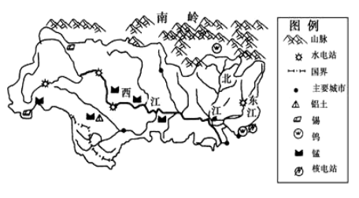

# 2018年新疆生产建设兵团面向社会招录公务员考试《行测》题（网友回忆版）

> 常识判断 · 20 题 · 新疆 2018

## 第 1 题　qid 2247150 · 人文常识

“商君尤称刻薄，又处战攻之世，天下趋于诈力，犹且不敢忘信以畜其民，况为四海治平之政者哉！”这段话评价的是哪个历史事件？

- **A**. 商鞅变法　✅
- **B**. 盘庚迁殷
- **C**. 武丁盛世
- **D**. 焚书坑儒

**答案**：A

**官方解析**

本题考查人文常识。
题干中这段话出自《资治通鉴》，原文是：“此四君者，道非粹白，而商君尤称刻薄，又处于战攻之世，天下趋于诈力，犹且不敢忘信以蓄其民，况为四海治平之政者哉。”意思是“这四位君主的治国之道尚称不上完美，而公孙鞅(商鞅)可以说是过于刻薄了，但他们处于你攻我夺的战国乱世，天下尔虞我诈、斗智斗勇之时，尚且不敢忘记树立信誉以收服人民之心，又何况今日治理一统天下的当政者呢！”
A项正确，题干中这段话描述的是战国时期的执政者通过树立信誉来收服人心。四个选项中只有商鞅变法发生在战国，而且“商君”指的就是商鞅；
B项错误，盘庚是商朝一位很有作为的君主，他为了改变当时社会不安定的局面，决心再一次迁都，搬迁到殷（今河南安阳），史称“盘庚迁殷”。与题干不符；
C项错误，武丁盛世又称武丁中兴，盘庚侄子武丁执政时，殷商国势达到鼎盛。武丁在位共五十余年，国势强盛，政治清明，百姓富庶。由“盛世”可知此选项与题干中“又处战攻之世”不相符；
D项错误，焚书坑儒指的是秦始皇在公元前213年和公元前212年焚毁书籍、坑杀“犯禁者四百六十余人”的事件，其目的在于维护统一的集权政治，进一步排除不同的政治思想和见解。与题干不符。
故正确答案为A。

---

## 第 2 题　qid 2247156 · 人文常识

关于声音和光的传播，下列说法错误的是：

- **A**. 光能在真空中传播
- **B**. 声源振幅的大小决定了声音的强弱
- **C**. 光在水中传播的速度比在空气中快　✅
- **D**. 声音在空气中以声波的形式向四周传播

**答案**：C

**官方解析**

本题考查科技常识。

A项正确，光可以在真空中传播，且传播速度最快，约为；

B项正确，声音的强弱我们称之为响度，响度大小跟振幅有关。振幅越大，响度越大，振幅越小，响度越小；

C项错误，光在水中的速度约为：，光在空气中的速度约为：。故光在空气中的传播速度比水中快；

D项正确，发声体产生的振动在空气或其他物质中的传播叫做声波。声波借助各种介质向四面八方传播。

本题为选非题，故正确答案为C。

---

## 第 3 题　qid 2247163 · 人文常识

某摄制组根据剧情布置了唐朝的街道，包含四样道具，其中符合历史事实的是：
①《金刚经》 ②丝绸制品 ③青花瓷器 ④土豆

- **A**. ①③④
- **B**. ①②③　✅
- **C**. ③④
- **D**. ②④

**答案**：B

**官方解析**

本题考查人文常识。
唐朝（618年—907年），是继隋朝之后的大一统王朝。
①正确，《金刚经》的首译时间是公元402年，由鸠摩罗什译为《金刚般若波罗蜜经》。故《金刚经》出现在唐朝符合历史事实。
②正确，中国科学家在1958年的考古中发现了距今5300年的大汶口文化时期的丝绸织品。故丝绸制品出现在唐朝是符合历史事实的。
③正确，中国青花瓷最早出现在唐代，唐代的巩县窑就开始使用含有钴的蓝釉彩来装饰陶瓷器，只是唐代青花瓷的制作还不成熟，并没有大规模进行生产。故唐朝出现青花瓷器符合历史事实。
④错误，土豆传入我国的年份还没有定论，根据陕西省兴平县县志的记载，16世纪时（明朝末年）马铃薯已传入中国，这是目前中国对土豆的较早记载。因此唐朝时期街道上不可能出现土豆。
故正确答案为B。

---

## 第 4 题　qid 2247173 · 地理国情

关于下图，下列说法<b>错误</b>的是：

- **A**. 图示地区不会出现太阳直射现象　✅
- **B**. 图示地区的主要河流发源于云贵高原
- **C**. 图示地区河流水位一般六、七月份最高
- **D**. 图示地区广泛分布石林、洞穴和地下暗河

**答案**：A

**官方解析**

本题考查地理国情。图示为我国珠江水系图。
珠江是我国第二大河流，是中国境内第三长河流，全长2320千米，流域面积约44万平方公里。
A项错误，图示地区是珠江水系图，珠江流域位于北纬21°31′—26°49′，太阳直射的区域为北纬23°26′—南纬23°26′S，二者有重合部分。因此，该地区一年中会有太阳直射现象；
B项正确，图示标黑的河流为珠江，珠江的主干--西江发源于云南省沾益县乌蒙山脉中的马雄山，沾益县位于云南省东部，属于云贵高原的一部分。故图示地区的主要河流发源于云贵高原；
C项正确，珠江流域地处亚热带，气候温和多雨，径流年内分配极不均匀，6、7、8三个月占年径流量的50%以上。因此其河流水位一般夏季（六、七月份）最高；
D项正确，珠江流域的上游在我国的云贵高原，云贵高原属于典型的喀斯特地貌分布区，有连片的喀斯特地貌分布，较集中的地区为滇、黔、桂毗邻地带，广泛分布有石林、洞穴和地下暗河。
本题为选非题，故正确答案为A。

---

## 第 5 题　qid 2247177 · 人文常识

关于魏晋南北朝诗歌，下列说法正确的是：

- **A**. 《燕歌行》标志着我国七言古诗的成熟　✅
- **B**. 曹丕是第一位大力创作五言诗的文人
- **C**. 《木兰曲》和《西洲曲》并称中国诗歌史上的“乐府双壁”
- **D**. 陶渊明完成了由玄言诗向山水诗的转变，开山水诗一派

**答案**：A

**官方解析**

本题考查人文常识。
A项正确，《燕歌行》是魏文帝曹丕的诗作。《燕歌行》是我国文学史上最早的完整的文人七言诗，它的产生标志着七言古诗的成熟；
B项错误，曹植是第一位大力写作五言诗的文人。他现存诗歌九十余首，其中有六十多首是五言诗；
C项错误，汉乐府诗《孔雀东南飞》和北朝民歌《木兰诗》合称为“乐府双璧”；
D项错误，玄言诗是一种以阐释老庄和佛教哲理为主要内容的诗歌。山水诗是指描写山水风景的诗。谢灵运和谢朓完成了由玄言诗向山水诗的转变，开山水诗一派。而陶渊明则是田园诗派的创始人。
故正确答案为A。

---

## 第 6 题　qid 2247179 · 人文常识

关于运动中受伤的处置方式，下列说法错误的是：

- **A**. 可通过伸展练习缓解运动后的肌肉酸痛
- **B**. 运动中发生肌肉痉挛可采用冷敷痉挛部位来缓解　✅
- **C**. 一般性关节韧带损伤后，应在24小时内采用冷敷
- **D**. 运动骨折后，应先用夹板或其他代用品固定伤肢

**答案**：B

**官方解析**

本题考查科技常识。
A项正确，肌肉酸痛可以说算肌肉疲劳，肌肉酸痛的原因有两种：一种是乳酸堆积导致的酸痛，还有一种是延迟性肌肉酸痛。可以采取如下有效方式缓解：（1）运动后一定要伸展，拉伸可以让筋膜扩张有利于肌肉整体的体积增长。可以舒展肌肉，让肌肉变的更加有弹性，不至于使肌肉变的僵硬。能够有效的缓解肌肉的压力，加速肌肉的恢复。（2）对酸痛局部进行按摩，使肌肉放松，促进肌肉血液循环，有助损伤修复及痉挛缓解；
B项错误，应对肌肉痉挛的具体方法要根据肌肉疼痛的不同感受而定。一旦发生肌肉痉挛，应缓和地帮助痉挛的肌肉伸展，直到痉挛和疼痛消失，再柔和地按摩。按摩后如果肌肉仍紧绷，需要热敷；而按摩后觉得肌肉酸痛则需冷敷。B项说法不全面；
C项正确，对于一般性关节韧带损伤，应在24小时内采用冷敷，必要时加压包扎24小时以后采用理疗，热敷、按摩、针灸等方式治疗；
D项正确，运动骨折后不要移动患肢，应用夹板或其他代用品固定伤肢，及时护送医院检查治疗。
本题为选非题，故正确答案为B。

---

## 第 7 题　qid 2247181 · 科技常识

关于生活中的物理现象，下列说法正确的是：

- **A**. 烈日下，海水的温度要比沙子低，是因为海水的比热容比沙子小
- **B**. 煮鸡蛋时，鸡蛋放入锅中会沉入锅底，是因为鸡蛋的重力大于阻力
- **C**. 冻肉在水中比在同温度空气中解冻得快，是因为水的热传递性更强　✅
- **D**. 大风吹来时，雨伞会被向上吸起来，是因为伞下方的压强大于上方　✅

**答案**：CD

**官方解析**

注：可能由于考生回忆版不够准确，本题有争议，CD项均正确。
A项错误，烈日下，海水的温度要比沙子低，是因为海水的比热容（即升高一度需要的热量）比沙子大，根据吸热公式可知，在吸收相同的热量时，比热容较大得海水温度升高得更少。因此，我们会感觉海水的温度比沙子低。选项中“海水的比热容比沙子小”表述错误；
B项错误，煮鸡蛋时，鸡蛋放入锅中会沉入锅底，是因为鸡蛋的重力大于它受到的浮力，而非“鸡蛋的重力大于阻力”；
C项正确，冰冻的肉类在水中比在同温度的空气中解冻得快，这是因为与空气相比，水的热传递性更强，水能够较快的将热量转移给冻肉，使其更快解冻；
D项正确，雨伞是弧形的，在相同时间内，空气流经上方的速度大，经过下方的速度小。大风吹来时，伞上方空气流速大、压强小，伞下方空气流速小、压强大，在伞的上、下表面产生一个压强差，在压强差的作用下，伞会被向上吸起来。
故正确答案为CD。

---

## 第 8 题　qid 2247185 · 科技常识

下列关于生活常识的说法，错误的是：

- **A**. 缺铁性贫血应多食用水果，因为维生素C可以帮助铁的转化和利用
- **B**. 燕麦有丰富的膳食纤维，能延缓胃中食物进入小肠的速度，产生饱腹感
- **C**. 柴鸡、肉鸡的营养物质含量相差无几，柴鸡更营养的说法并不科学
- **D**. 蔬菜水果一洗就掉色，是因为人为添加了色素，正常情况应该是无色的　✅

**答案**：D

**官方解析**

A项正确，多吃富含维生素C的新鲜水果，如橙子、猕猴桃、山楂等，对补血也有一定的帮助，因为维生素C可以帮助铁的转化和利用，所以缺铁性贫血应多食用水果；
B项正确，燕麦中含有丰富的膳食纤维，尤其是可溶性膳食纤维能够延缓胃中内容物进入小肠的速度，使人产生饱腹感，有利于糖尿病人和肥胖人群减少进食量；
C项正确，从营养物质含量看柴鸡、肉鸡营养成分相差无几，虽然生长周期长的柴鸡口感在一定程度上或许会比肉鸡更好，但是柴鸡更营养的说法并不科学。并且，散养的鸡所进食的食物很有可能得不到保障，无法追根溯源，并不能完全保证食品安全；
D项错误，掉色是蔬菜水果本身就存在的特质，因为其本身含有大量的天然色素。水洗掉色的“色”就属于水溶性的花青素，葡萄、草莓等都含有此类色素。通常被储存在植物细胞液泡中的花青素，当细胞破损时会溶解到外界的水中，水被染色也就不足为怪了。因此，蔬菜水果一洗就掉色，并不一定是人为添加了色素。
本题为选非题，故正确答案为D。

---

## 第 9 题　qid 2247193 · 人文常识

下列关于天文常识的说法，错误的是：

- **A**. 超级月亮指满月时月亮处于近地点位置
- **B**. 冬季大三角指由织女星、天津四及牛郎星组成的三角形　✅
- **C**. 流星雨的名字来自于辐射点所在的星座或附近比较明亮的星名
- **D**. 土星冲日指土星和太阳正好分处地球两侧，三者几乎成一条直线

**答案**：B

**官方解析**

A项正确，“超级月亮”这个词语本身不是专业的天文术语。月亮绕着地球转的轨道并不是一个纯圆的轨道，而是一个椭圆轨道，月亮在这个椭圆形的轨道运行，有时候会靠近地球，有时候会远离地球，靠近地球的点叫近地点，远离地球的点叫远地点。月亮运行到近地点时，如果是恰逢满月，人们会觉得看到的月亮特别大而明亮，就把它称为超级月亮。
B 项错误，夏季大三角指在夏季的东南方高空里由天琴座的织女星、天鹅座的天津四以及天鹰座的牛郎星组成的三角形。而冬季大三角由大犬座的天狼星、小犬座的南河三以及猎户座的参宿四所形成的三角形。
C项正确，流星雨的命名一般用流星雨辐射点所在的星座或附近比较明亮的星名来命名，例如双子座流星雨的辐射点就位于双子座中。
D项正确，土星冲日是指土星、地球、太阳依次排成一条直线，土星和太阳正好分处地球的两侧。该天象每378天发生一次，土星和地球绕太阳公转的方向相同，公转轨迹都近似为圆。
本题为选非题，故正确答案为B。

---

## 第 10 题　qid 2247197 · 人文常识

关于锦绣工艺，下列说法错误的是：

- **A**. 元代开始，云锦一直为皇家服饰专用品
- **B**. 因宋锦的主要产地在杭州，故又被称为“杭州宋锦”　✅
- **C**. 壮锦是壮族自治区的传统丝织物，充满沉稳、内敛的民族格调
- **D**. 汉朝时，成都设有专管织造蜀锦的官员，因此被称为“锦官城”

**答案**：B

**官方解析**

本题考查人文常识。
A项正确，云锦是我国传统提花丝织锦缎，为南京特产。因其图案绚丽、纹饰华美如天上云霞而得名。云锦至今有约1600年的历史。东晋义熙十三年（417年）在建康设锦署，被认为是云锦正式诞生的标志。从元代开始，云锦一直为皇家服饰御用贡品；
B项错误，宋锦，起源于宋代，主要产地在中国的苏州，故又称之为“苏州宋锦”。因而宋锦主要产地为苏州而非杭州；
C项正确，壮锦与云锦、蜀锦、宋锦并称“中国四大名锦”，是广西壮族地区一项最具代表性的民族手工艺品，它以“对比强烈而不火，柔和淡雅而不温”为特点，特意加入灰色元素淡化过于显眼的颜色表达，充满沉稳、内敛的民族格调；
D项正确，蜀锦起源于战国时期，历史悠久、工艺独特。汉朝时成都蜀锦织造业便已经十分发达，朝廷在成都设有专管织锦的官员，因此成都被称为“锦官城”，简称“锦城”。
本题为选非题，故正确答案为B。

---

## 第 11 题　qid 2247165 · 人文常识

下列描写月的诗句中，表达作者思乡情感的是：

- **A**. 秦时明月汉时关，万里长征人未还
- **B**. 我寄愁心与明月，随风直到夜郎西
- **C**. 东船西舫悄无言，唯见江心秋月白
- **D**. 春风又绿江南岸，明月何时照我还　✅

**答案**：D

**官方解析**

本题考查人文常识。
A项错误，此句出自唐代王昌龄《出塞二首·其一》，“秦时明月汉时关”是诗人暗示这里的战事自秦汉以来一直未间歇过，“万里长征人未还”则使人联想到战争给人带来的灾难，表达了诗人希望早日平息边塞战事，使人民过上安定的生活；
B项错误，此句出自唐代李白《闻王昌龄左迁龙标遥有此寄》，是李白得知好友王昌龄被贬（“左迁”指贬谪，降职）后所作，这里的“愁心”表达的是对远方朋友的思念和担忧；
C项错误，此句出自唐代白居易《琵琶行》，诗句侧面烘托了琵琶女的演奏效果。演奏已经结束，而听者尚沉浸在音乐的境界里，周围鸦雀无声，只有水中倒映着一轮明月。本诗通过写琵琶女生活的不幸，结合诗人自己在宦途所受到的打击，唱出了“同是天涯沦落人，相逢何必曾相识”的心声。表达了诗人对不幸者命运的同情和对自身失意的感慨；
D项正确，此句出自宋代王安石《泊船瓜洲》，这是一首著名的抒情小诗，抒发了诗人眺望江南、思念家乡的深切感情。结句“明月何时照我还”，诗人眺望已久，不觉皓月初上，诗人用疑问的句式，想象出一幅“明月照我还”的画面，进一步表达了诗人的思乡之情。
故正确答案为D。

---

## 第 12 题　qid 2247169 · 人文常识

下列哲学家与其思想主张对应错误的是：

- **A**. 黄宗羲——理势合一　✅
- **B**. 王夫之——气一元论
- **C**. 黑格尔——存在即合理
- **D**. 卢梭——感觉是认识的来源

**答案**：A

**官方解析**

本题考查政治常识。
A项错误，黄宗羲，明末清初经学家、史学家、思想家、地理学家、天文历算学家、教育家，与顾炎武、王夫之并称“明末清初三大思想家”，他在哲学上反对宋学中“理在气先”的理论，认为“理”并不是客观存在的物质实体，而是“气”的运动规律。而“理势合一”的历史观是由王夫之所提出的，他认为历史发展过程是天地自然阴阳二气相互交感而呈现的有规律的运动变化过程，而“理”和“势”亦是阴阳二气相互交感的具体表现。
B项正确，王夫之，明末清初杰出的思想家、哲学家，其主张“气一元论”，认为天地万物即是一气所生，气是唯一的实体。
C项正确，黑格尔是德国19世纪唯心论哲学的代表人物之一。存在即合理出自黑格尔《法哲学原理》序，意思是凡是合乎理性的东西都是现实的，凡是现实的东西都是合乎理性的。这里合乎理性就是指绝对精神，黑格尔把绝对精神看作是世界的本原。
D项正确，卢梭是18世纪法国大革命的思想先驱，启蒙运动最卓越的代表人物之一。在哲学上，卢梭主张感觉是认识的来源。
本题为选非题，故正确答案为A。

---

## 第 13 题　qid 2247174 · 法律常识

根据我国现行《民法典》，下列说法符合相关规定的是：

- **A**. 法人分为企业法人和非企业法人
- **B**. 不满八周岁的未成年人为无民事行为能力人　✅
- **C**. 向人民法院请求保护民事权利的诉讼时效期间为二年
- **D**. 因自愿实施紧急救助行为造成受助人损害的，救助人承担民事责任

**答案**：B

**官方解析**

本题考查法律常识。
A项错误，《民法典》总则编在法人一章，将法人分为营利法人、非营利法人、特别法人。
B项正确，根据《民法典》第二十条规定：“不满八周岁的未成年人为无民事行为能力人，由其法定代理人代理实施民事法律行为。”
C项错误，根据《民法典》第一百八十八条规定：“向人民法院请求保护民事权利的诉讼时效期间为三年。法律另有规定的，依照其规定。”因此，一般情况下，诉讼时效期间是三年。
D项错误，根据《民法典》第一百八十四条规定：“因自愿实施紧急救助行为造成受助人损害的，救助人不承担民事责任。”
故正确答案为B。

---

## 第 14 题　qid 2247175 · 人文常识

关于我国近现代历次土地改革和政策，下列说法错误的是：

- **A**. 《中国土地法大纲》标志中国形成了一套正确的土地革命政策　✅
- **B**. 《井冈山土地法》首次以立法形式肯定了广大农民以革命手段获得土地的权利
- **C**. 《五四指示》将党在抗日战争时期实行的“减租减息”政策改变为实现“耕者有其田”
- **D**. 《中华人民共和国土地改革法》由解放战争时期征收富农多余土地财产改变为保存富农经济

**答案**：A

**官方解析**

本题考查人文常识。
A项错误，1929年颁布的《兴国土地法》将“没收一切土地”改为“没收一切公共土地及地主阶级的土地”，这是一个原则性的改正，保护了中农的利益，到了1931年春，基本上形成了一套正确的土地革命政策。1947年7月至9月，中国共产党在河北省平山县召开全国土地会议，制定和通过了《中国土地法大纲》，明确规定“废除封建性及半封建性剥削的土地制度，实现耕者有其田的土地制度”；
B项正确，《井冈山土地法》是中国共产党历史上第一个土地法，首次以立法的形式肯定了广大农民以革命手段获得土地的权利；
C项正确，《五四指示》将党在抗日战争时期实行的“减租减息”政策改变为实行“耕者有其田”的政策。这一政策的提出，标志着解放区在农民土地问题上，开始由抗日战争时期的削弱封建剥削向变革封建土地关系、废除封建剥削制度过渡；
D项正确，1950年6月28日中央人民政府委员会第八次会议通过了《中华人民共和国土地改革法》，这次土改的目的是废除地主阶级封建剥削的土地所有制，实行农民的土地所有制，解放农村生产力，发展农业生产，为新中国的工业化开辟道路。土改中对待富农的政策，由解放战争时期征收富农多余土地财产改变为保存富农经济。
本题为选非题，故正确答案为A。

---

## 第 15 题　qid 2247178 · 科技常识

关于物质组成及其变化，下列说法正确的是：

- **A**. 汽油挥发和形成水垢均是化学变化
- **B**. 地壳中含量最多的非金属元素是氮
- **C**. 构成物质的三种微粒是分子、原子和电子
- **D**. 组成化合物种类最多的元素是碳　✅

**答案**：D

**官方解析**

本题考查科技常识。
A项错误，物理变化指物质的状态虽然发生了变化，但物质本身的组成成分却没有改变。化学变化是有新物质形成的变化过程。汽油挥发只是汽油由液态变为气态，并没有新物质生成，因此属于物理变化。水垢是指含有钙镁盐类等矿物质的水蒸发后，溶于水的钙离子和镁离子形成了碳酸钙和氢氧化镁两种沉淀，因此属于化学变化；
B项错误，地壳是由沙、黏土、岩石等组成的，地壳中所含元素的含量从高到低的排序是氧、硅、铝、铁、钙，因此地壳中含量最多的金属元素是铝，非金属元素是氧，而不是氮；
C项错误，物质是无限可分的，其中构成物质的三种基本微粒是分子、原子和离子，而非电子；
D项正确，凡除了极少数含碳化合物为无机物以外，其余含碳化合物称为有机物，自然界中物质多数是有机物，因此，组成化合物种类最多的元素是碳。
故正确答案为D。

---

## 第 16 题　qid 2247182 · 地理国情

关于下图中的高速公路，说法错误的是：

- **A**. 穿越了我国四大沙漠之一的是巴丹吉林沙漠
- **B**. 是目前世界上穿越沙漠最长的高速公路工程
- **C**. 共经过北京、河北、内蒙古、甘肃、新疆5省份　✅
- **D**. 开辟了从霍尔果斯口岸至天津港最快捷的出海通道

**答案**：C

**官方解析**

本题考查地理国情。从图中可以看出，该高速公路为北京—乌鲁木齐高速公路，称作京新高速公路，简称京新高速（G7）。
A项正确，京新高速在内蒙古境内穿过乌兰布和、腾格里、巴丹吉林三大沙漠，其对推进内蒙古及新疆自治区的跨越发展，促进中蒙经济文化往来，巩固边防、维护民族团结和社会稳定具有极其重要的意义；
B项正确，2017年7月15日上午9时16分，国家“一带一路”标志性工程京新高速临白段正式建成通车，标志着世界上穿越沙漠最长的高速公路京新高速（G7）全线通车；
C项错误，京新高速公路连接北京、河北、山西、内蒙古、甘肃、新疆六个省，选项中“5省份”表述错误；
D项正确，京新高速全线贯通后，从北京通往新疆乌鲁木齐的路程比现有路程缩短1300多公里，其开辟了从新疆霍尔果斯口岸至天津港最快捷的出海通道，成为“一带一路”发展战略中新亚欧大陆桥的重要组成部分。
本题为选非题，故正确答案为C。

---

## 第 17 题　qid 2247183 · 人文常识

下列人物形象与其所属作品对应错误的是：

- **A**. 方鸿渐——《围城》
- **B**. 雅罗米尔——《生活在别处》
- **C**. 伊丽莎白——《傲慢与偏见》
- **D**. 吴荪甫——《林家铺子》　✅

**答案**：D

**官方解析**

本题考查人文常识。
A项正确，《围城》是我国作家钱钟书所著的长篇小说，是中国现代文学史上一部风格独特的讽刺小说，被誉为“新儒林外史”。作品通过描写主人公方鸿渐的人生历程，对20世纪三四十年代国统区的国政时弊和众生相进行了抨击；
B项正确，《生活在别处》是捷克小说家米兰·昆德拉创作的长篇小说。作品语言简洁流畅，人物身份明确，在描写主人公雅罗米尔青春和激情的同时，研究人性的崇高与邪恶，透视人身上最黑暗、最深刻的弱点；
C项正确，《傲慢与偏见》是英国小说家简·奥斯汀创作的长篇小说，主人公为小乡绅班纳特的二女儿伊丽莎白。作品以日常生活为素材，生动地反映了18世纪末到19世纪初处于保守和闭塞状态下英国的乡镇生活和世态人情；
D项错误，《林家铺子》是我国作家茅盾于1932年创作的短篇小说。作品讲述的是当时江南杭嘉湖地区一个小店铺的主人林老板，在时局动荡、经济萧条的社会背景下，虽再三苦苦挣扎，但在黑暗势力的盘剥下终于破产的故事。吴荪甫为茅盾长篇小说《子夜》的主人公。
本题为选非题，故正确答案为D。

---

## 第 18 题　qid 2247184 · 法律常识

根据我国《劳动合同法》，下列说法错误的是：

- **A**. 同一用人单位与同一劳动者只能约定一次试用期
- **B**. 劳动合同部分无效，则整个劳动合同都将失去法律效力　✅
- **C**. 经济补偿按劳动者在本单位工作的年限，每满一年支付一个月工资的标准支付
- **D**. 用人单位需提前三十日以书面形式通知劳动者或额外支付一个月工资后才可以解除劳动合同

**答案**：B

**官方解析**

本题考查法律常识。
A项正确，根据我国《劳动合同法》第十九条第二款规定：“同一用人单位与同一劳动者只能约定一次试用期”；
B项错误，根据我国《劳动合同法》第二十七条规定：“劳动合同部分无效，不影响其他部分效力的，其他部分仍然有效。”故选项中“则整个劳动合同都将失去法律效力”表述错误；
C项正确，根据我国《劳动合同法》第四十七条第一款规定：“经济补偿按劳动者在本单位工作的年限，每满一年支付一个月工资的标准向劳动者支付。六个月以上不满一年的，按一年计算；不满六个月的，向劳动者支付半个月工资的经济补偿”；
D项正确，根据我国《劳动合同法》第四十条规定：“有下列情形之一的，用人单位提前三十日以书面形式通知劳动者本人或者额外支付劳动者一个月工资后，可以解除劳动合同：（一）劳动者患病或者非因工负伤，在规定的医疗期满后不能从事原工作，也不能从事由用人单位另行安排的工作的；（二）劳动者不能胜任工作，经过培训或者调整工作岗位，仍不能胜任工作的；（三）劳动合同订立时所依据的客观情况发生重大变化，致使劳动合同无法履行，经用人单位与劳动者协商，未能就变更劳动合同内容达成协议的”。
注：选项D表述不严谨，没有写明适用条件，但是本题为单选题，B项明显错误，故答案为B。
本题为选非题，故正确答案为B。

---

## 第 19 题　qid 2247189 · 地理国情

下列历史事件按发生的先后顺序，排序正确的是：
①西藏和平解放
②大庆油田被发现

③中苏爆发珍宝岛武装冲突
④中国第一颗原子弹爆炸成功

- **A**. ②①③④
- **B**. ④③①②
- **C**. ③④②①
- **D**. ①②④③　✅

**答案**：D

**官方解析**

本题考查人文历史。
①1951年5月中央人民政府全权代表和西藏地方政府全权代表在北京签订《关于和平解放西藏办法的协议》（简称“十七条协议”），宣告西藏和平解放；
②1959年9月，位于松嫩平原上的松基3井，喷射出黑色的石油，大庆油田被发现。
③1969年3月，苏联军队四次侵入我黑龙江省的珍宝岛地区，打死打伤我边防人员，制造严重流血事件。我边防部队被迫还击。中苏双方爆发珍宝岛武装冲突；
④1964年10月16日，中国第一颗原子弹在新疆罗布泊爆炸成功。这是中国成功进行的第一次核试验。
根据历史事件发生的先后顺序，正确的排序是①②④③。
故正确答案为D。

---

## 第 20 题　qid 2247191 · 人文常识

关于紫外线，下列说法正确的是：

- **A**. 人类肉眼能感觉到
- **B**. 可用来消毒杀菌　✅
- **C**. 波长在10nm-500nm之间
- **D**. 容易引发脑部癌变

**答案**：B

**官方解析**

本题考查科技常识。
A项错误，紫外线是波长10nm-400nm的电磁波，位于可见光谱紫端以外，紫外线属于不可见光，不能影响人们的视觉，故人体肉眼不能感觉到；
B项正确，紫外线可以用来消毒杀菌，一般利用特殊设计的紫外线灯照射，使菌体蛋白发生光解、变性，菌体会因氨基酸、核酸遭到破坏而死亡。另外，紫外线通过空气，使空气中的氧电离产生臭氧，也能够加强消毒杀菌作用；
C项错误，紫外线波长在10nm-400nm之间；
D项错误，大量紫外线照射可能对人体皮肤产生伤害，引起黑色素沉积，导致变黑、色斑、水肿甚至水泡等。长期紫外线照射可能损伤细胞DNA，引起皮肤老化，甚至引发皮肤癌，但跟题干中“容易引发脑部癌变”并无直接关系。
故正确答案为B。

---
