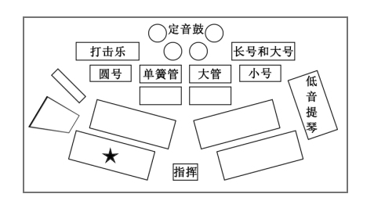
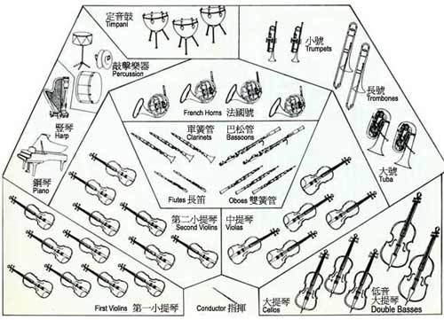

# 2018年浙江省公务员录用考试《行测》题（B类）（网友回忆版）

> 常识判断 · 20 题 · 浙江 2018

## 第 1 题　qid 2144476 · 法律常识

下列与我国宪法有关的表述错误的是：

- **A**. 每年12月4日是我国的国家宪法日
- **B**. 人民主权是宪法规定的一项基本原则
- **C**. 中央军委的职权在宪法中有明确具体的规定　✅
- **D**. 未成年人、依法被剥夺政治权利的人和外国人无选举权和被选举权

**答案**：C

**官方解析**

本题考查法律常识。
A项正确，2014年11月1日，十二届全国人大常委会第十一次会议审议通过关于设立国家宪法日的决定，明确将12月4日设立为国家宪法日。
B项正确，《中华人民共和国宪法》第二条第一款规定：“中华人民共和国的一切权力属于人民。”人民主权原则，亦称主权在民原则，核心是国家权力来源于人民，属于人民。所以人民主权是宪法规定的一项基本原则。
C项错误，《中华人民共和国宪法》涉及中央军委的有两条，第九十三条规定：“中华人民共和国中央军事委员会领导全国武装力量。中央军事委员会由下列人员组成：主席，副主席若干人，委员若干人。中央军事委员会实行主席负责制。中央军事委员会每届任期同全国人民代表大会每届任期相同。”第九十四条规定：“中央军事委员会主席对全国人民代表大会和全国人民代表大会常务委员会负责。”可见宪法未明确具体规定中央军委的职权。
D项正确，《中华人民共和国宪法》第三十四条规定：“中华人民共和国年满十八周岁的公民，不分民族、种族、性别、职业、家庭出身、宗教信仰、教育程度、财产状况、居住期限，都有选举权和被选举权；但是依照法律被剥夺政治权利的人除外。”所以未成年人、依法被剥夺政治权利的人和外国人没有选举权和被选举权。
本题为选非题，故正确答案为C。

---

## 第 2 题　qid 2144477 · 法律常识

关于法律、法规授权的组织，下列说法错误的是：

- **A**. 受害妇女田某提起诉讼需要帮助，当地妇联给予支持
- **B**. 公立大学对违反学校管理规定的学生不予颁发学位证书
- **C**. 公安派出所对参与赌资较大的赌博行为处以400元罚款
- **D**. 保险行业协会对违反行业自律公约的保险公司处以罚款　✅

**答案**：D

**官方解析**

本题考查法律常识，主要涉及其他法律法规的相关知识。
A项正确，《中华人民共和国妇女权益保障法》第五十四条规定：“妇女组织对于受害妇女进行诉讼需要帮助的，应当给予支持。”妇联即妇女联合会，其基本功能是代表、捍卫妇女权益、促进男女平等，亦同时维护少年儿童权益。所以田某可以请求当地妇联给予支持。
B项正确，根据相关法律法规违反成绩、纪律等规定的均可不颁发学位证。如《中华人民共和国学位条例》
第四条　高等学校本科毕业生，成绩优良，达到下述学术水平者，授予学士学位：
（一）较好地掌握本门学科的基础理论、专门知识和基本技能；
（二）具有从事科学研究工作或担负专门技术工作的初步能力。
如果行为人违反上述规定，未达到相关标准，即可不予颁发学位证书。
C项正确，《中华人民共和国治安管理处罚法》第七十条规定：“以营利为目的，为赌博提供条件的，或者参与赌博赌资较大的，处5日以下拘留或者500元以下罚款；情节严重的，处10日以上15日以下拘留，并处500元以上3000元以下罚款。”同时，根据《治安管理处罚法》第九十一条规定：“ 治安管理处罚由县级以上人民政府公安机关决定；其中警告、五百元以下的罚款可以由公安派出所决定。 ”所以公安派出所对参与赌资较大的赌博行为处以400元罚款是合理的。
D项错误，根据《中国保监会关于加强保险行业协会建设的指导意见》指出：“进行自律惩戒。对于违反协会章程、自律公约和管理制度、损害投保人和被保险人合法权益、参与不正当竞争等致使行业利益和形象受损的会员，可按章程或自律公约的有关规定，实施警告、业内批评、公开通报批评、扣罚违约金、开除会员资格等惩戒措施，也可建议监管部门依法对其进行行政处罚。”因此保险行业协会无罚款权。
本题为选非题，故正确答案为D。

---

## 第 3 题　qid 2144478 · 人文常识

2017年5月18日，我国宣布可燃冰试采获得成功，标志着我国成为全球第一个在海域可燃冰试开采中获得连续稳定产气的国家。可燃冰的主要有效成分是：

- **A**. 甲烷　✅
- **B**. 乙炔
- **C**. 甲醇
- **D**. 乙醇

**答案**：A

**官方解析**

本题考查科技常识，主要涉及可燃冰的相关知识。可燃冰，是分布于深海沉积物或陆域的永久冻土中，由天然气与水在高压低温条件下形成的类冰状的结晶物质。
A项正确，可燃冰是一种白色固体物质，有极强的燃烧力，主要由水分子和烃类气体分子（主要是甲烷）组成。
B项错误，乙炔，俗称风煤或电石气，在室温下是一种无色、极易燃的气体，主要用于工业用途，特别是烧焊金属方面。
C项错误，甲醇是结构最为简单的饱和一元醇，是无色有酒精气味易挥发的液体。用于制造甲醛和农药等，并用作有机物的萃取剂和酒精的变性剂等。
D项错误，乙醇俗称酒精，是一种有机物，在常温常压下是一种易燃、易挥发的无色透明液体，可用于制造醋酸、饮料、香精、染料、燃料等。
故正确答案为A。

---

## 第 4 题　qid 2144479 · 地理国情

2017年12月5日，世界互联网大会在浙江乌镇落下帷幕。下列有关表述错误的是:

- **A**. 乌镇是世界互联网大会永久会址
- **B**. 乌镇地处杭嘉湖平原腹地，属典型的温带季风气候　✅
- **C**. 乌镇已举办四届世界互联网大会
- **D**. 乌镇是著名作家茅盾的故乡

**答案**：B

**官方解析**

本题考查地理国情，主要涉及乌镇的相关知识。
A项正确，世界互联网大会是由中华人民共和国倡导并每年在浙江省嘉兴市桐乡市乌镇举办的世界性互联网盛会。2014年开始，乌镇成为世界互联网大会永久会址。
B项错误，乌镇，位于浙江省嘉兴市桐乡市，地处江浙沪“金三角”之地、杭嘉湖平原腹地，属亚热带季风气候。
C项正确，第一届世界互联网大会于2014年11月19日-21日在浙江乌镇举办；第二届世界互联网大会于2015年12月16日-18日在浙江乌镇举办；第三届世界互联网大会于2016年11月16日-18日在浙江乌镇举办；第四届世界互联网大会于2017年12月3日至5日在浙江乌镇举办。因此，截至2017年12月，乌镇已举办四届世界互联网大会。另，2018年、2019年，乌镇分别举办了第五、第六届世界互联网大会。
D项正确，茅盾（1896年7月4日—1981年3月27日），原名沈德鸿，笔名茅盾，生于浙江省桐乡市乌镇，是中国现代著名作家、文学评论家、文化活动家以及社会活动家。所以乌镇是茅盾的故乡。
本题为选非题，故正确答案为B。

---

## 第 5 题　qid 2144480 · 人文常识

下列源自《史记》的成语与其具体出处对应错误的是：

- **A**. 破釜沉舟——《史记·项羽本纪》
- **B**. 鸿鹄之志——《史记·陈涉世家》
- **C**. 运筹帷幄——《史记·平原君列传》　✅
- **D**. 纸上谈兵——《史记·廉颇蔺相如列传》

**答案**：C

**官方解析**

本题主要考查《史记》有关内容。《史记》是西汉著名史学家司马迁撰写的一部纪传体史书，是中国历史上第一部纪传体通史，记载了上至黄帝时代，下至汉武帝元狩元年间共3000多年的历史。
A项正确，破釜沉舟意为打破饭锅，凿沉渡船，比喻不留退路，与敌人决一死战。该成语出自《史记·项羽本纪》：“项羽乃悉引兵渡河，皆沉船，破釜甑，烧庐舍，持三日粮，以示士卒必死，无一还心。”
B项正确，“鸿鹄”即天鹅，鸿鹄之志常用来比喻志向远大。该成语出自《史记·陈涉世家》：“嗟乎！燕雀安知鸿鹄之志哉！”陈胜、吴广由此揭竿而起，爆发了我国历史上第一次大规模的农民起义。
C项错误，运筹帷幄，在军帐内对军略做全面计划，常指在后方决定作战方案，也泛指主持大计，考虑决策。该成语出自《史记·高祖本纪》：“夫运筹帷幄之中，决胜千里之外，吾不如子房”。而出自《史记·平原君列传》的成语有毛遂自荐等。
D项正确，纸上谈兵比喻空谈理论，不能解决实际问题。该成语出自《史记·廉颇蔺相如列传》：战国时赵国名将赵奢之子赵括，年轻时学兵法，谈起兵事来父亲也难不倒他。后来他接替廉颇为赵将，在长平之战中，只知道照搬兵书理论，不知道变通，结果被秦军打败。
本题为选非题，故正确答案为C。

---

## 第 6 题　qid 2144481 · 人文常识

下列诗词所涉及的历史事件，按时间先后顺序排列正确的是：
①开辟荆榛，千秋功业，驱逐荷虏，一代英雄
②渔阳鼙鼓动地来，惊破《霓裳羽衣曲》
③明修栈道欺秦楚，暗度陈仓惊鬼神
④羽扇纶巾，谈笑间，樯橹灰飞烟灭

- **A**. ④③①②
- **B**. ①③②④
- **C**. ②③④①
- **D**. ③④②①　✅

**答案**：D

**官方解析**

本题考查诗词中历史事件时间的排序。
①“开辟荆榛，千秋功业，驱逐荷虏，一代英雄”是郭沫若为郑成功写的一幅挽联。“开辟荆榛”意为开拓荒凉之地，指台湾；而“驱逐荷虏”，指驱逐荷兰殖民者，该对联涉及到的历史事件为清初1662年郑成功从荷兰殖民者手中收复台湾。
②“渔阳鼙鼓动地来，惊破霓裳羽衣曲”出自唐代诗人白居易的古诗作品《长恨歌》。“渔阳鼙鼓”亦作“渔阳鞞鼓”，指安禄山的军事叛乱，“霓裳羽衣曲”，是当时宫中最流行的舞曲。该诗句涉及到的历史事件为公元755年安禄山于范阳举兵叛唐。
③“明修栈道欺秦楚，暗度陈仓惊鬼神”出自《史记·高祖本纪》，指正面迷惑敌人，而从侧翼进行突然袭击，亦比喻暗中进行活动。该计涉及到的历史事件为楚汉之争，刘邦听从谋臣张良的计策，从关中回汉中时，烧毁栈道，表明自己不再进关中。后来，刘邦拜韩信为将军，他命士兵修复栈道，装作从栈道出击进军关中，实际上却和刘邦率主力部队暗中抄小路袭击陈仓，趁守将不备，占领陈仓，进而攻入咸阳，占领关中。
④“羽扇纶巾，谈笑间，樯橹灰飞烟灭”出自宋代苏轼的作品《念奴娇赤壁怀古》。“羽扇纶巾”是三国时期魏晋文人流行的装束，该诗句涉及到的历史事件为三国时期赤壁之战。
根据时间的先后顺序排列，应为③④②①，选择D项。
故正确答案为D。

---

## 第 7 题　qid 2144482 · 人文常识

关于我国古代的行政文书，下列说法正确的是：

- **A**. 曾经使用钟鼎、竹简作为公文的载体　✅
- **B**. 从行文方向来看，周代的誓、命等公文属于上行文
- **C**. 奏是受封赠的大臣向皇帝谢恩的公文
- **D**. 楷书作为公文正式字体开始于宋代

**答案**：A

**官方解析**

本题考查古代行政文书有关知识。
A项正确，“钟鼎”是中国古铜器的总称，上面多铭刻记事表功的文字，鼎在古代还被视为立国的重器，是权力的象征；“竹简”起源于古代用以书写、记事的竹片，《后汉书·宦者传·蔡伦》中提到“自古书契多编以竹简，其用缣帛者谓之为纸”。钟鼎、竹简均曾经作为公文的载体。
B项错误，上行文是指现代公文传递中下级机关或业务部门向所属上级领导机关或业务主管部门的一种行文。而在古代的行政文书中，“誓”的内容偏重于出兵打仗前的盟誓，主要是发布军令或宣布军纪；“命”是指王针对具体事情发布的命令，二者均属于上对下发布的指令，不属于上行文。
C项错误，一般来说，“奏”是古代大臣对政事有所陈述、批评、建议以及对某官进行弹劾时所用的一种陈述文书。而“章”是受封赠的大臣向皇帝谢恩的公文。
D项错误，楷书作为正式公文用字始于两晋，盛于唐代，而不是开始于宋代。
故正确答案为A。

---

## 第 8 题　qid 2144484 · 人文常识

下列词语与道家思想有关的是：

- **A**. 上善若水　✅
- **B**. 兼爱非攻
- **C**. 简礼从俗
- **D**. 六根清净

**答案**：A

**官方解析**

本题考查与道家思想有关的知识。道家崇尚自然，主张清静无为，提倡道法自然，自然无为，与自然和谐相处。
A项正确，“上善若水”出自老子的《道德经》：“上善若水，水善利万物而不争，处众人之所恶，故几于道”。“上善若水”意为最高境界的善行，就像水的品性一样，泽被万物而不争名利。体现了道家的思想。
B项错误，“兼爱”“非攻”出自《墨子》，“兼爱”强调人间相爱的整体性、普遍性、穷尽性、交互性和平等性。即“所有人应该爱所有人”；“非攻”意为反对战争，这都是墨家思想的主要观点。
C项错误，“简礼从俗”出自《史记》，“太公至国，修政，因其俗，简其礼，通商工之业，便鱼盐之利，而人民多归齐，齐为大国”。意思是太公到齐国后，修明政事，顺其风俗，简化礼仪，开放工商之业，发展渔业盐业优势，因而人民多归附齐国，齐成为大国。这与道家的思想无关。
D项错误，“六根”指眼、耳、鼻、舌、身、意。“六根清净”是佛家用语，意在限制欲望和妄想，达到超凡入圣的境界。
故正确答案为A。

---

## 第 9 题　qid 2144486 · 人文常识

下列诗句中，没有涉及节日的是：

- **A**. 遥知兄弟登高处，遍插茱萸少一人
- **B**. 千门万户曈曈日，总把新桃换旧符
- **C**. 绿蚁新醅酒，红泥小火炉　✅
- **D**. 金吾不禁夜，玉漏莫相催

**答案**：C

**官方解析**

本题主要考查文学常识。涉及到节日诗句相关知识。
A项正确，该句诗出自唐代王维的《九月九日忆山东兄弟》，农历“九月九日”为重阳节，民间有登高、插茱萸、饮菊花酒等习俗。
B项正确，该句诗出自宋代王安石的《元日》，此句描写初升的太阳照耀着千家万户，春节有挂桃符的习俗，因此家家给门上的换成新桃符，来描写春节除旧迎新的景象。
C项错误，该句诗出自唐代白居易的《问刘十九》，此诗描写了诗人邀请朋友前来喝酒的情景。体现的是朋友间亲密的情谊，并未涉及到节日。
D项正确，该句诗出自唐代苏味道的《正月十五夜》，此诗描写了元宵之夜的欢乐景象，唐代有宵禁制度，但元宵节时会取消宵禁，全城狂欢。
本题为选非题，故正确答案为C。

---

## 第 10 题　qid 2144488 · 人文常识

彩虹是太阳光照射到空气中的水滴时，光线被折射及反射，在天空中形成的拱形七彩光谱。下列关于彩虹的说法正确的是：

- **A**. 冬天不易出现彩虹　✅
- **B**. 水滴越大，彩虹越不明显
- **C**. 彩虹上的蓝光总在红光上方
- **D**. 彩虹的明显程度与阳光强度无关

**答案**：A

**官方解析**

本题主要考查物理常识，涉及到彩虹相关知识。
A项正确，一般冬天的气温较低，在空中不容易存在小水滴，下阵雨的机会也少，所以冬天一般不容易有彩虹出现。
B项错误，在阳光强度一定的条件下，彩虹的明显程度，取决于空气中小水滴的大小。小水滴体积越大，形成的彩虹越鲜亮，小水滴体积越小，形成的彩虹就不明显。
C项错误，水对阳光有色散作用，不同波长的光的折射率有所不同。因为蓝光的折射率比红光大，致使蓝光的偏折程度大。所以红光在最上方，其它颜色在下。
D项错误，彩虹的明显与否，一主要取决于在各色光的宽度上，宽度大就明显，宽度小则各色光重叠不明显；二与太阳光的强度有一定关系，因为太阳光强可以影响各色光的亮度。因此彩虹明显度与太阳光强有关。
故正确答案为A。

---

## 第 11 题　qid 2144499 · 科技常识

下列关于天文知识的说法正确的是：

- **A**. 太阳系中体积最小的行星是海王星
- **B**. 最早进入太空的航天员是美国的阿姆斯特朗
- **C**. 世界公认最早的太阳黑子记录出自《春秋》
- **D**. 地球通常在7月初经过远日点　✅

**答案**：D

**官方解析**

本题主要考查地理常识，主要涉及天文知识。
A项错误，太阳系有八大行星，包括水星、金星、地球、火星、木星、土星、天王星和海王星，其中体积最小的行星是水星。
B项错误，最早进入太空的是苏联航天员加加林，他于1961年乘坐东方1号宇宙飞船进入太空。美国宇航员阿姆斯特朗是第一个踏上月球的人，登月时间为1969年。
C项错误，目前世界上公认最早记录太阳黑子的是东汉班固所写的《汉书•五行志》，记录了发生在公元前28年的太阳黑子现象。
D项正确，地球公转轨道是一个近似正圆的椭圆形轨道，太阳位于椭圆的一个焦点上。每年的7月初，地球距离太阳最远，这个位置叫远日点。
故正确答案为D。

---

## 第 12 题　qid 2144501 · 人文常识

下列做法属于接种预防的是：

- **A**. 给糖尿病患者注射胰岛素
- **B**. 给孕妇注射黄体酮
- **C**. 给幼儿喂食脊灰糖丸　✅
- **D**. 给患者皮下注射青霉素

**答案**：C

**官方解析**

本题考查生活常识，主要涉及接种预防的相关知识。
接种预防，是利用人工制备的疫苗通过适宜的途径注入人体，使机体获得对疾病的特异免疫力。
A项错误，注射外源性胰岛素是用来治疗糖尿病，而不是用来预防糖尿病。
B项错误，黄体酮，又称孕酮激素，是女性卵巢分泌的具有生物活性的主要孕激素。在女性怀孕后，如果自身孕酮激素过低，会导致胎儿不稳定，可能引起流产。这时可以通过注射黄体酮给胎儿的早期生长及发育提供保障，不属于接种预防。
C项正确，脊髓灰质炎是由脊髓灰质炎病毒引起的一种急性传染病。脊灰糖丸，属于脊髓灰质炎疫苗，给幼儿喂食脊灰糖丸可以预防脊髓灰质炎，属于接种预防。
D项错误，青霉素属于抗菌素（抗生素属于抗菌素），具有杀菌作用。注射青霉素主要用来杀菌，治疗疾病，不属于接种预防。
故正确答案为C。

---

## 第 13 题　qid 2144504 · 科技常识

关于人体细胞，下列说法正确的是：

- **A**. 癌变后失去了增殖功能
- **B**. 可以合成蔗糖和葡萄糖
- **C**. 细胞器散布在细胞质中　✅
- **D**. 同一个体不同功能的细胞中含有的基因组不同

**答案**：C

**官方解析**

本题考查生物学常识，主要涉及人体细胞及其组成的相关知识点。
A项错误，癌变是指细胞在致癌因子的作用下，遗传物质发生变化，变成不受机体控制的、连续进行分裂的恶性增殖细胞。在适宜的条件下，癌细胞能够无限增殖。
B项错误，人体细胞不能合成蔗糖和葡萄糖。葡萄糖、蔗糖是靠进食摄入，人体内可以把蛋白质等非糖物质转化为葡萄糖，也可以将淀粉等多糖物质分解为葡萄糖，而不能自行合成。蔗糖是普遍存在于植物中的二糖，不存在于人体细胞内。
C项正确，细胞质是细胞中细胞质膜包围的除核区外的一切半透明、胶状、颗粒状物质的总称。它包括细胞器、细胞质基质和包含物，是生命活动的主要场所。细胞器分布在呈溶胶状的细胞质基质中，在细胞生理活动中起重要作用。
D项错误，23对染色体共同构成了人类的基因组，这些基因是DNA分子上具有遗传效应的特定核苷酸序列的总称，是具有遗传效应的DNA分子片段。对同一个体来说，细胞都含有相同的基因组。但由于基因的选择性表达不同，从而使得其具有不同的功能。
故正确答案为C。

---

## 第 14 题　qid 2144511 · 科技常识

生物老师把六种动物分成两组，一组是鲫鱼、麻雀、牛，另一组是蜗牛、虾、蝴蝶。这样分组可能的依据是：

- **A**. 是否有脊椎骨　✅
- **B**. 体温是否恒定
- **C**. 胎生还是卵生
- **D**. 呼吸方式的不同

**答案**：A

**官方解析**

本题考查生物学常识，主要涉及动物特征的相关知识点。
A项正确，根据动物是否由脊椎骨组成脊柱，可分为脊椎动物和无脊椎动物。鲫鱼、麻雀、牛都具有脊椎骨，属于脊椎动物；而蜗牛、虾、蝴蝶都没有脊椎骨，属于无脊椎动物。
B项错误，第一组，麻雀和牛属于恒温动物，能在环境温度变化的情况下保持体温的相对稳定。但是第一组中的鲫鱼和第二组的动物都属于变温动物，它们需要寻找凉爽或温暖的环境来改变自身体温，而不能直接地控制自身体温。
C项错误，题干中只有牛是哺乳类动物，属于胎生；其他动物繁殖方式都为卵生。
D项错误，题干中各种动物的呼吸方式多种多样，鲫鱼和虾用鳃呼吸，牛和麻雀用肺呼吸，蝴蝶用气管呼吸，蜗牛用呼吸孔呼吸。
故正确答案为A。

---

## 第 15 题　qid 2144518 · 地理国情

关于世界著名工业或科技区的地理特点，下列说法错误的是：

- **A**. 德国的鲁尔区崛起得益于丰富的煤炭资源
- **B**. 美国的“硅谷”位于安第斯山脉以东　✅
- **C**. 中国的中关村科技园区位于华北平原
- **D**. 日本的“硅岛”九州岛是日本第三大岛

**答案**：B

**官方解析**

本题考查地理常识，主要涉及世界著名工业区和科技区。
A项正确，德国鲁尔区有着丰富的煤炭资源，由于二战前钢铁市场需求强劲，鲁尔区因其自身的煤炭资源优势得到迅速发展。
B项错误，美国的“硅谷”位于旧金山附近，临近美国西海岸，位于落基山脉以西，是新兴电子工业的中心。而安第斯山脉位于南美洲。
C项正确，中关村科技园位于北京，是中国第一个国家级高新技术产业开发区。北京位于华北平原的西北部。
D项正确，九州岛是日本的第三大岛，次于本州和北海道，而比四国稍大，位于日本西南端。九州岛是日本高科技产业的主要集散地，70年代以来，电子工业迅速发展，有“硅岛”之称。
本题为选非题，故正确答案为B。

---

## 第 16 题　qid 2144483 · 人文常识

下图是目前为世界上多数交响乐团所采用的美式乐队席位排列法，★的位置应该排列哪种乐器？

- **A**. A
- **B**. B　✅
- **C**. C
- **D**. D

**答案**：B

**官方解析**

本题考查音乐常识。美式乐队席位排列法是国际上较为常见的一种乐队席位排列法，在演奏浪漫派以及近、现代的交响乐作品时优越性较大。美式乐队席位排列法如下图所示，因此题中★的位置为第一小提琴所在的位置，而题中A为竖琴，B为小提琴，C为钢琴，D为圆号（法国号）。

故正确答案为B。

---

## 第 17 题　qid 2144485 · 人文常识

关于现代军事，下列说法错误的是：

- **A**. 中国海军第一艘可搭载固定翼飞机的航空母舰是“辽宁舰”
- **B**. 爱国者导弹是由美国研制的全天候多用途中程防空导弹系统
- **C**. 歼-10战斗机是我国自主研制的单座单发第二代战斗机　✅
- **D**. 生化武器因其伤害的无差别性和永久性被联合国列为禁用武器

**答案**：C

**官方解析**

本题考查现代军事的科技常识。
A项正确，辽宁号航空母舰，简称“辽宁舰”，是中国人民解放军海军第一艘可以搭载固定翼飞机的航空母舰。其前身是前苏联海军的库兹涅佐夫元帅级航空母舰次舰瓦良格号，改装后于2012年9月25日交付予中国人民解放军海军。
B项正确，爱国者导弹是美国雷神公司制造的全天候多用途中程防空导弹系统，主要用于对付现代装备的高性能飞机，并能在电子干扰环境下击毁近程导弹，拦截战术弹道导弹和潜射巡航导弹。
C项错误，歼-10战斗机是中国航空工业集团有限公司自主研制的第三代战斗机，是多功能、超音速、全天候空中优势战斗机，而非题干中表述的第二代。
D项正确，生化武器是指以细菌、病毒、毒素等使人、动物、植物致病或死亡的物质材料制成的武器。由于其伤害的无差别性和永久性，联合国大会于1992年一致通过了《禁止化学武器公约》，所有缔约国将禁止使用、生产、购买、储存和转移各类化学武器。
本题为选非题，故正确答案为C。

---

## 第 18 题　qid 2144487 · 人文常识

小兰购买某公司股票获得500元的投资收益，其收益主要来源于：

- **A**. 股息和银行存款利息
- **B**. 股票的票面金额和银行贷款利息
- **C**. 股息和股票的金额
- **D**. 股利分配和股价上涨带来的差价　✅

**答案**：D

**官方解析**

本题考查经济常识中股票的相关知识。
股票投资收入包括两部分，一部分是股息收入或者红利收入，也就是股票持有人作为股东享有的，从股份公司取得的利润分配收入。它来源于企业利润。公司有盈利才能分配股息或者红利。另外一部分收入来源于股票价格上升带来的差价，股票的价格会受到公司经营状况、供求关系、银行利率、大众心理等多种因素的影响。
 A项错误，股息是股票投资人定期从股份公司取得的一定收益，是股票投资收益的来源之一，但股票投资收益与银行存款利息无直接关系。
 B项错误，股票的票面金额有账面浮动并且完成差价交易才形成收益，仅票面金额本身并不是股票投资收益的来源，且股票投资收益与银行贷款利息无直接关系。
 C项错误，股息收入是股票投资收益的来源之一，股票的金额有账面浮动并且完成买卖才形成收益，仅是股票的金额本身并不是股票投资收益的来源。
 D项正确，股利分配和股价上涨带来的差价二者构成了购买股票后带来的投资收益。
 故正确答案为D。

---

## 第 19 题　qid 2144491 · 人文常识

下列关于奥运会的说法正确的是：

- **A**. 现代五项赛事中包括射击和游泳比赛　✅
- **B**. 所有的田径类赛事均在体育场内进行
- **C**. 击剑比赛项目按参赛者体重进行分级
- **D**. 足球项目参赛队员年龄均限制在23岁以下

**答案**：A

**官方解析**

本题考查奥运会的相关知识。
 A项正确，现代五项是由“现代奥林匹克之父”法国人顾拜旦先生发起创立的项目，现代五项是一种包含射击、击剑、游泳、马术和越野跑的多项目运动。
 B项错误，田径比赛是径赛、田赛和全能比赛的统称，由田赛、径赛、公路跑、竞走和越野跑组成。以高度和距离长度计算成绩的跳跃、投掷项目叫“田赛”；以时间计算成绩的竞走和跑的项目叫“径赛”。故不是所有的田径赛事都在体育场内进行。
 C项错误，击剑比赛分花剑、重剑、佩剑，个人赛和团体赛等类别，并不按参赛者体重进行分级。按参赛者体重进行分级的有举重、拳击等赛事。
 D项错误，1908年，在英国伦敦奥运会上足球成为正式比赛项目。1988年国际足联规定，奥运会足球运动员年龄限制在23岁以下，每队允许有3名超龄球员。1996年夏季奥林匹克运动会加入女子足球项目，由于当时女子足球运动发展仍未成熟，因此国际足联没有对女子足球作出限制。
 故正确答案为A。

---

## 第 20 题　qid 2144496 · 人文常识

下列关于世界著名建筑的说法正确的是：

- **A**. 法国的凡尔赛宫是以地名命名的　✅
- **B**. 印度的泰姬陵是著名的佛教建筑
- **C**. 巴黎圣母院兴建于法国大革命时期
- **D**. 比萨斜塔是意大利著名的天文研究院

**答案**：A

**官方解析**

本题考查世界著名建筑的有关知识。
 A项正确，凡尔赛宫位于法国巴黎西南郊外伊夫林省省会凡尔赛镇，是巴黎著名的宫殿之一，也是世界五大宫殿（北京故宫、法国凡尔赛宫、英国白金汉宫、美国白宫、俄罗斯克里姆林宫）之一。凡尔赛宫是以地名命名的。
 B项错误，泰姬陵是印度知名度最高的古迹之一，有“印度明珠”的美誉，被评选为“世界新七大奇迹”。是一座白色大理石建成的巨大陵墓，是伊斯兰教建筑中的代表作，而不是佛教建筑。
 C项错误，巴黎圣母院大教堂约建造于1163年到1250年间，属哥特式建筑形式。法国大革命爆发于1789年7月14日，故时间错误。
 D项错误，比萨斜塔是意大利比萨城大教堂的独立式钟楼，与大教堂和洗礼堂交相呼应，并非天文研究院。
 故正确答案为A。

---
