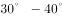
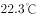
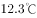

# 2018年重庆市公务员录用考试《行测》题（下半年）

> 常识判断 · 19 题 · 重庆 2018

## 第 1 题　qid 2401958 · 地理国情

在海洋上，人们常能看到因冰川断裂而形成的浮冰，下列对这类浮冰的盐度理解正确的是（    ）。

- **A**. 不含盐分　✅
- **B**. 盐度和周围海水一样
- **C**. 比周围海水盐度更高
- **D**. 比周围海水盐度略低

**答案**：A

**官方解析**

本题考查地理国情。
冰川是水的一种存在形式，是雪经过一系列变化转变而来的。要形成冰川首先要有一定数量的固态降水，其中包括雪、雾、雹等。极地或高山地区地表上多年存在并具有沿地面运动状态的天然冰体。冰川多年积雪，经过压实、重新结晶、再冻结等成冰作用而形成的。它具有一定的形态和层次，并有可塑性，在重力和压力下，产生塑性流动和块状滑动，是地表重要的淡水资源。由于冰川是淡水资源的一种，故冰川断裂而形成的浮冰不含盐分。
故正确答案为A。

---

## 第 2 题　qid 2401959 · 人文常识

2018年6月14日至7月15日，第21届男足世界杯在俄罗斯举行，在此期间，下列情形最不可能出现的是（    ）。

- **A**. 意大利地中海沿岸出现炎热少雨的天气
- **B**. 悉尼正值冬季，最高气温仅12摄氏度
- **C**. 中国观众在北京时间22：00观看于俄罗斯某地当地时间17：00开始的节目
- **D**. 我国南极泰山站的工作人员在极昼中踢球娱乐　✅

**答案**：D

**官方解析**

本题考查地理国情。2018年6月中旬至7月中旬，北半球处于夏季，南半球处于冬季。

A项正确，地中海气候，是由西风带与副热带高气压带交替控制形成的，是亚热带、温带的一种气候类型。其分布于南北纬的大陆西岸，包括地中海沿岸、黑海沿岸、美国加利福尼亚州、澳大利亚西南部伯斯和南部阿德莱德一带、南非西南部，以及智利中部等地区，因地中海沿岸地区最典型而得名。地中海气候的特点是：夏季炎热干燥、冬季温和多雨。意大利大部分地区属地中海型气候。因此六七月份意大利地中海沿岸可能出现炎热少雨的天气。

B项正确，悉尼属于亚热带季风性湿润气候，气候宜人，风景秀丽，夏不酷热，平均气温，冬无严寒，平均气温。悉尼处于南半球，因此7月份为悉尼的冬季，可能会出现最高气温仅12摄氏度的情况。

C项正确，区时是一种按全球统一的时区系统计量的时间。人为规定，在日界线西侧的东十二区在任何时刻，总是比日界线东侧的西十二区早24小时，这样东、西十二区，虽为一个时区钟点相同，但日期总是相差一天，即东十二区任何时候都比西十二区要早一天。中国位于东八区，俄罗斯首都莫斯科位于东三区。由于东面时区较相邻西面时区早过1小时，而北京（东八区）与莫斯科（东三区）相差5个时区，所以北京时间比俄罗斯当地时间早5小时。因此中国观众可以在北京时间22：00观看于俄罗斯某地当地时间17：00开始的节目。

D项错误，极昼又称永昼或午夜太阳，是在地球的极圈范围内，一日之内，太阳都在地平线以上的现象，即昼长等于24小时。由地球公转和黄赤交角而形成。太阳直射点在哪个半球的回归线，哪一半球的极圈内就会出现极昼现象。6月14日至7月15日，太阳直射点在北回归线附近（6月22日前后直射北回归线），在此期间北极圈内会出现极昼，而南极圈则出现极夜。南极圈在极夜状态下，由于缺少光亮，因此无法进行足球运动。故我国南极泰山站的工作人员在极昼中踢球娱乐的说法错误。

本题为选非题，故正确答案为D。

---

## 第 3 题　qid 2401960 · 人文常识

日常生活中，人们通常把鱼出现上浮并翻肚子的现象称为“翻塘”，该情形极易导致鱼死亡，那么，若无污染、沼气等影响，在一天中，鱼儿最容易因缺氧而“翻塘”的时间是（    ）。

- **A**. 早晨　✅
- **B**. 上午
- **C**. 下午
- **D**. 晚上

**答案**：A

**官方解析**

本题考查科技常识。
影响水体溶氧最主要的几个因素中，首先是温度，水温升高，水体的细菌、藻类、鱼类和其它水生动物活动加强，水中的溶氧就会降低；水温越高，水中溶氧的饱和度就越低。一天之中，池塘中的溶氧也是动态变化的。白天光照强，通过光合作用产生较多的氧气溶解于水中，中、上层水的溶解氧在自然状态下开始上升，在中午过后逐渐达到最高值，溶解氧甚至能达到过饱和状态。到了夜晚，由于没有了光合作用，而池塘内对氧气的消耗量并没有明显减少，使得水体的溶解氧含量逐渐减少，一天之中黎明和清晨的温度最低，所以一天中，早晨池塘中的氧最少。因此早晨最容易出现鱼儿最容易因缺氧而“翻塘”。
故正确答案为A。

---

## 第 4 题　qid 2401961 · 科技常识

血液透析后，发生的最主要变化是（    ）。

- **A**. 蛋白质增加
- **B**. 二氧化碳减少
- **C**. 含氧废物减少　✅
- **D**. 氧气增加

**答案**：C

**官方解析**

本题考查科技常识。
血液透析（HD）是急慢性肾功能衰竭患者肾脏替代治疗方式之一。它通过将体内血液引流至体外，经一个由无数根空心纤维组成的透析器中，血液与含机体浓度相似的电解质溶液（透析液）在一根根空心纤维内外，通过弥散、超滤、吸附和对流原理进行物质交换，清除体内的代谢废物，维持电解质和酸碱平衡，同时清除体内过多的水分，并将经过净化的血液回输。血液透析液中的一些小分子的溶质及水分即通过空心纤维上的小孔进行交换，交换的最终结果是血液中的尿毒症毒素及一些电解质、多余的水分进入透析液中被清除，透析液中一些碳酸氢根及电解质进入血液中。从而达到清除毒素、水分、维持酸碱平衡及内环境稳定的目的。因此血液透析后，含氧废物将大大减少。
故正确答案为C。

---

## 第 5 题　qid 2401962 · 科技常识

关于“嫦娥三号”探测器在月球表面降落时没有使用降落伞的原因，下列表述正确的是（    ）。

- **A**. “嫦娥三号”质量太大，无法制作与其质量匹配的降落伞
- **B**. 月球表面附近并没有大气，使用降落伞也起不到减速作用　✅
- **C**. 在降落后，降落伞极可能将探测器的视线遮住，从而引发重大安全事故
- **D**. 探测器在距离月球较远时已开始减速，期间的时间足够探测器将速度降为0

**答案**：B

**官方解析**

本题考查科技常识。
A项错误，降落伞可以根据物体不同质量制作成相应大小，因此可以制作与其质量匹配的降落伞。
B项正确，月球表面是真空状态，没有大气，降落伞是利用空气阻力原理，展开后可增大迎风面积产生气动力作用，使与其相连的物体减速。月球没有大气，故降落伞无法使用。
C项错误，航空器降落伞采用一套非常精密的控制系统控制开伞的时间以及步骤，探测器的视线即使被遮住也不会影响降落过程。
D项错误，月球表面无大气，因此，嫦娥三号无法利用气动减速的方法着陆，只能靠自身推进系统减小约1.7公里每秒的速度，在此过程中探测器还要进行姿态的精确调整，不断减速以便在预定区域安全着陆。为了保证着陆过程可控，研制团队经过反复论证，提出“变推力推进系统”的设计方案，研制出推力可调的7500N变推力发动机，经过多次点火试车和相关试验验证，破解着陆减速的难题。选项说明的是探测器减速的方法，而非不使用降落伞的原因。
故正确答案为B。

---

## 第 6 题　qid 2401963 · 人文常识

两个完全一样的陶瓷杯中分别装有半杯沸腾的热茶和半杯冷牛奶，如果将它们混合在一起做一杯温度尽可能低的奶茶，下列方法效果最好的是（    ）。

- **A**. 在热茶冷却2分钟后，将牛奶倒入其中
- **B**. 将冷牛奶倒入热茶后，再冷却2分钟
- **C**. 在热茶冷却2分钟后，将其倒入牛奶中　✅
- **D**. 将热茶倒入冷牛奶后，再冷却2分钟

**答案**：C

**官方解析**

本题考查科技常识。
自然冷却一般不会是匀速降温，温度高时降温快，接近环境温度时，降温慢。故采用先冷却热茶的方法，排除B、D两项，由于在热茶倒入冷牛奶的过程中会不断向外界散热，而冷牛奶温度低于环境温度，故不会散热，所以在热茶冷却2分钟后，将其倒入牛奶中，可取得最低温度的奶茶。
故正确答案为C。

---

## 第 7 题　qid 2401964 · 地理国情

公元548-552年，长江流域中重要的政治文化中心建康城经历了一场战乱，几乎成为一片废墟，而整个南方社会都受到空前破坏，这场战乱就是著名的（    ）。

- **A**. 董卓之乱
- **B**. 八王之乱
- **C**. 侯景之乱　✅
- **D**. 安史之乱

**答案**：C

**官方解析**

本题考查人文常识。
A项错误，董卓之乱，指东汉中平六年（189年）至初平三年（192年）董卓入朝后实行的专权暴政。中平六年，董卓奉诏率兵进入洛阳，废汉少帝，立陈留王刘协为帝，自为相国，独揽朝政。次年关东诸侯推袁绍为盟主，讨伐董卓，卓败，挟持汉献帝刘协西走长安，并驱使洛阳数百万人口西迁长安。行前，董卓士卒大肆烧掠，洛阳周围二百里内尽成瓦砾。初平三年，董卓被王允、吕布所杀。这次祸乱，给黄河中游、下游地区造成了深重灾难。
B项错误，八王之乱是发生于中国西晋时期的一场皇族为争夺中央政权而引发的内乱，因皇后贾南风干政弄权所引发。这次动乱始于永平元年（291年），八王在长安、洛阳及黄河两岸混战16年，至光熙元年（306年）结束，造成了极大破坏，北方地区广被战火，历史名城洛阳、长安被夷为丘墟。
C项正确，侯景之乱，又称太清之难，是指中国南北朝时期南朝梁将领侯景发动的武装叛乱事件。侯景之乱后，江南地区的社会经济遭到毁灭性的破坏，加剧了南弱北强的形势。符合题意。
D项错误，安史之乱是中国唐代玄宗末年至代宗初年由唐朝将领安禄山与史思明背叛唐朝后发动的战争，是同唐朝争夺统治权的内战，为唐由盛而衰的转折点。这场内战使得唐朝人口大量丧失，国力锐减。因为发起反唐叛乱的指挥官以安禄山与史思明二人为主，因此事件被冠以安史之名。又由于其爆发于唐玄宗天宝年间，也称天宝之乱。
故正确答案为C。

---

## 第 8 题　qid 2401965 · 人文常识

下列选项中，不是生命体共同特征的是（    ）。

- **A**. 新陈代谢
- **B**. 光合作用　✅
- **C**. 生长和繁殖
- **D**. 遗传和变异

**答案**：B

**官方解析**

本题考查科技常识。
A项正确，新陈代谢是生物体内全部有序化学变化的总称，其中的化学变化一般都是在酶的催化作用下进行的。一切生物都能进行新陈代谢，故属于生命体共同特征。
B项错误，光合作用，通常是指绿色植物或部分藻类吸收光能，把二氧化碳和水合成富能有机物，同时释放氧气的过程。而除了绿色植物或部分藻类外，其他生物并不能进行光合作用，故不属于生命体共同特征。
C项正确，一切生物都可以进行生长和繁殖，故属于生命体共同特征。
D项正确，遗传就是子代在这个连续系统中重复亲代的特性和特征（性状）的现象，其实质则是由于亲代所产生的配子，带给子代按亲代性状进行发育的遗传物质──基因。相同的基因规定着生物体发育相同的性状，于是表现为遗传，体现了生物界的稳定性。但这种稳定性是相对的，因为基因在世代延绵的长期发展过程中，难免会在此时或彼时发生结构的改变。结构改变了的基因使生物体发育不同于改变前的性状，于是出现了变异（可遗传变异）。一切生物都可以进行遗传和变异，故属于生命体共同特征。
本题为选非题，故正确答案为B。

---

## 第 9 题　qid 2401966 · 人文常识

下列选项中，没有错别字的是（    ）。

- **A**. 泊来品
- **B**. 亲睐
- **C**. 断章取义　✅
- **D**. 先发治人

**答案**：C

**官方解析**

本题考查人文常识。
A项错误，舶来品指通过航船从国外进口来的物品。A项中泊来品中“泊”不对。
B项错误，是青睐而不是亲睐。青指眼，指人高兴的时候正视对方，眼球居中。用正眼相看，指喜爱或重视。
C项正确，断章取义是一个汉语成语，指不顾全篇文章或谈话的内容，孤立地取其中的一段或一句的意思，指引用与原意不符。没有错别字。
D项错误，先发制人指先动手的处于主动地位，可以控制对方。选项中“治”为错别字。
故正确答案为C。

---

## 第 10 题　qid 2401967 · 科技常识

下列不属于“中国制造2025”五大工程的是（    ）。

- **A**. 制造业创新中心建设工程
- **B**. 航天技术制造工程　✅
- **C**. 工业强基工程
- **D**. 绿色制造工程

**答案**：B

**官方解析**

本题考查政治常识。
《中国制造2025》是中国政府实施制造强国战略的第一个十年行动纲领。规划明确的九大任务、十大领域、五大工程和八大政策，其中五大工程包括制造业创新中心（工业技术研究基地）建设工程、智能制造工程、工业强基工程、绿色制造工程、高端装备创新工程。因此，A、C、D三项正确，B项错误。
本题为选非题，故正确答案为B。

---

## 第 11 题　qid 2401968 · 人文常识

下列选项中，不属于决胜全面建成小康社会“三大攻坚战”的是：

- **A**. 防范化解重大风险
- **B**. 精准脱贫
- **C**. 污染防治
- **D**. 抑制房价　✅

**答案**：D

**官方解析**

本题考查政治常识。
党的十九大报告指出，要坚决打好防范化解重大风险、精准脱贫、污染防治的攻坚战，使全面建成小康社会得到人民认可、经得起历史检验。故ABC项正确，D项错误。
本题为选非题，故正确答案为D。

---

## 第 12 题　qid 2401969 · 人文常识

下列各省份及其对应的广告宣传语中，最不恰当的是：

- **A**. 广东：看漓江碧水，听春天故事　✅
- **B**. 海南：享南国椰风，望江东新区
- **C**. 山西：魅力山西，晋善晋美
- **D**. 河南：华夏之源，天下之中

**答案**：A

**官方解析**

本题考查地理国情。
A项错误，“听春天故事”是指听《春天的故事》这首歌，这首歌是为了纪念改革开放与深圳特区的开创而创作的，因此符合广东的定位。但是漓江属珠江流域西江水系，位于广西壮族自治区东北部，不在广东，因此不恰当。
B项正确，海南省位于我国最南端，自然资源丰富，物种多样，其中椰子树是海南岛典型的树种。江东新区是海南省海口市的一个市辖区，到2035年，将建设成为全面深化改革试验区的创新区，为全球未来城市建设树立“江东样板”。
C项正确，“晋善晋美”是山西旅游主题宣传口号，用简洁的文字浓缩了山西旅游的整体印象，用直白的语言告诉公众，山西是人善景美、适宜旅游观光的好地方，同时寓意山西旅游产业蓬勃向上，追求尽善尽美。
D项正确，河南历史文化悠久，是世界华人宗祖之根、华夏历史文明之源；文化灿烂，人杰地灵，名人辈出，是中国姓氏的重要发源地。河南地区孕育了裴李岗文化、龙山文化，建立了中国第一个奴隶制国家-夏朝。以后，商代的首都西亳和殷均在河南境内。在安阳殷墟发现的甲骨文，是世界上最早的文字，也是世界上最早的历史文献。河南区位优越，位居天地之中，素有“九州腹地，十省通衢”之称，因此“华夏之源，天下之中”的宣传语是恰当的。
本题为选非题，故正确答案为A。

---

## 第 13 题　qid 2401970 · 人文常识

下列选项释义错误的是（    ）。

- **A**. 霆——暴雷
- **B**. 霏——雨、雪、烟、云等很繁盛的样子
- **C**. 霭——狂风大作的样子　✅
- **D**. 霁——雨（雪）停止后天气很快转晴

**答案**：C

**官方解析**

本题考查人文常识。
A项正确，“霆”做动词时释义为震动；做名词时释义为暴雷、霹雳（雷霆）。
B项正确，“霏”释义为飘扬，烟霏云敛；雨、雪、烟、云很繁盛的样子。
C项错误，“霭”释义为云气，即云雾密集的样子。
D项正确，“霁”指雨雪停止，天空放晴。
本题为选非题，故正确答案为C。

---

## 第 14 题　qid 2401971 · 人文常识

下列情形中，用词最为准确恰当的是：

- **A**. 新闻——现将本地A、B公司强强联合，携手上市的新闻通知给大家
- **B**. 复函——来函已经收悉，现回复如下　✅
- **C**. 感谢信——师恩难忘，无以为报，还望关爱
- **D**. 广告——周末优惠大酬宾，欢迎届时光临

**答案**：B

**官方解析**

本题考查公文写作与处理。
A项错误，公司携手上市应该属于新闻中的消息，用“通知”不合适，改为“报道”，是新闻中较为常用的词语。
B项正确，函属于平行文，收到函之后，需要复函给发文单位，因此用“来函已经收悉，现回复如下”是比较恰当的。
C项错误，感谢信一般是学生毕业时写给老师，毕业以后一般很少有交集，这时用“还望关爱”不妥，应用“还望保重”表达对老师的祝福。
D项错误，“光临”是称宾客来访的敬词，而商家广告针对的是顾客，用“光顾”更加合适。
故正确答案为B。

---

## 第 15 题　qid 2401972 · 人文常识

王羲之在《兰亭集序》里说：“永和九年，岁在癸丑，暮春之初，会于会稽山阴之兰亭”，其中，“暮春之初”是指农历：

- **A**. 二月中旬
- **B**. 二月下旬
- **C**. 三月上旬　✅
- **D**. 三月中旬

**答案**：C

**官方解析**

本题考查人文常识。
对季节的划分一般为：农历一、二、三月为春季，四、五、六月为夏季，七、八、九月为秋季，十、十一、十二月为冬季。而每个季节又可划分为初、仲、暮，分别代表每个季节的第一、二、三个月。如初冬表示十月，仲夏表示五月，暮春表示三月。本题的“暮春之初”是三月的开始，因此是三月上旬。
故正确答案为C。

---

## 第 16 题　qid 2401973 · 人文常识

某市教育局计划就相关事宜行文征求市人力资源和社会保障局意见建议，其所行公文的文种应该是：

- **A**. 通知
- **B**. 请示
- **C**. 函　✅
- **D**. 议案

**答案**：C

**官方解析**

本题考查公文写作与处理。
《党政机关公文处理工作条例》的第八条对公文种类及用法进行了规定。
A项错误，通知适用于发布、传达要求下级机关执行和有关单位周知或者执行的事项，批转、转发公文。通知属于下行文，教育局与人社局不是上下级的关系，因此通知不适用。
B项错误，请示适用于向上级机关请求指示、批准。教育局与人社局不是上下级的关系，因此请示不适用。
C项正确，函适用于不相隶属机关之间商洽工作、询问和答复问题、请求批准和答复审批事项。教育局与人社局是不相隶属的机关，教育局计划向人社局征求意见，行文符合函的用法。
D项错误，议案适用于各级人民政府按照法律程序向同级人民代表大会或者人民代表大会常务委员会提请审议事项，不适用于题目的要求。
故正确答案为C。

---

## 第 17 题　qid 2401974 · 人文常识

①某运动服装广告里，一位运动员身披五星红旗，站在领奖台上；②某白酒广告出现未成年人说“请勿贪杯”后饮酒的情形；③某感冒药广告提到该药品对感冒的治愈高达百分之九十；④某牛奶广告出现描述自己产品是“冠军选择，最佳品质”的广告词。①~④中，违反了我国广告法规定的有（    ）。

- **A**. ①②
- **B**. ③④
- **C**. ②③④
- **D**. ①②③④　✅

**答案**：D

**官方解析**

本题考查法律常识。
①错误，根据《中华人民共和国广告法》第九条规定：“广告不得有下列情形：（一）使用或者变相使用中华人民共和国的国旗、国歌、国徽，军旗、军歌、军徽······”①的广告使用了国旗，属于违反广告法规定的行为。
②错误，根据《中华人民共和国广告法》第十条规定：“广告不得损害未成年人和残疾人的身心健康。”本法第二十三条规定：“酒类广告不得含有下列内容：······（二）出现饮酒的动作······”②的广告中出现未成年人饮酒的动作，损害了未成年人的身体健康，属于违反广告法规定的行为。
③错误，根据《中华人民共和国广告法》第十六条第一款规定：“医疗、药品、医疗器械广告不得含有下列内容：······（二）说明治愈率或者有效率。”③的广告说明了药品的治愈率，属于违反广告法规定的行为。
④错误，根据《中华人民共和国广告法》第九条规定：“广告不得有下列情形：······（三）使用‘国家级’、‘最高级’、‘最佳’等用语。”④的广告使用了“最佳”，属于违反广告法规定的行为。
因此①②③④都违反了广告法。
本题为选非题，故正确答案为D。

---

## 第 18 题　qid 2401975 · 人文常识

下列关于足球的常识，表述错误的是（    ）。

- **A**. 一般认为，现代足球始于英国
- **B**. 比赛中，球队不可使用换人补足因被罚红牌而产生的缺员
- **C**. 曼联、拜仁、皇家马德里以及尤文图斯分别是英格兰、德国、西班牙及意大利著名的足球俱乐部
- **D**. 2014年的巴西男足世界杯，是南美洲国家首次举办男足世界杯比赛　✅

**答案**：D

**官方解析**

本题考查人文常识。
A项正确，现代足球起源于英国。12世纪初，英国开始有了足球赛。1848年，足球运动的第一个文字形式的规则《剑桥规则》诞生。1862年，在英国诺丁汉郡成立了世界上第一个足球俱乐部。
B项正确，一般来说，如果红牌罚下一名队员，是不可以使用换人补足缺员的，球队可以在下一场补员，但是这名被罚下的队员下一场也不可以参赛。
C项正确，曼联指曼彻斯特联足球俱乐部，位于英国英格兰西北区曼彻斯特郡曼彻斯特市，是英格兰足球史上最为成功的俱乐部之一，也是欧洲乃至世界最具有影响力最成功的球队之一；拜仁指拜仁慕尼黑足球俱乐部，是一家设于慕尼黑的德国体育俱乐部，为德国最成功的足球俱乐部；皇家马德里指皇家马德里足球俱乐部，是一家位于西班牙首都马德里的足球俱乐部，拥有众多世界球星，曾被国际足球联合会（FIFA）评为20世纪最伟大的球队；尤文图斯指尤文图斯足球俱乐部，是一家位于意大利的足球俱乐部，是意大利国内历史最为悠久的俱乐部之一，在欧洲足坛具有举足轻重的地位，是欧洲乃至世界上最为成功球会之一。
D项错误，2014年巴西男足世界杯是继1950年巴西世界杯之后世界杯第二次在巴西举行，也是继1978年阿根廷世界杯之后男足世界杯第五次在南美洲举行。
本题为选非题，故正确答案为D。

---

## 第 19 题　qid 2401976 · 法律常识

下列各类收入（收益）中，无需缴纳个人所得税的是（    ）。

- **A**. 居民个人购买国债所获得相应利息　✅
- **B**. 文章作者去世后财产继承人取得的遗作稿酬
- **C**. 个体工商户销售服装所取得的收入
- **D**. 受雇从事公益性医疗服务所取得的报酬

**答案**：A

**官方解析**

本题考查法律常识。
根据《个人所得税法》第二条第一款规定：“下列各项个人所得，应当缴纳个人所得税：（一）工资、薪金所得；（二）劳务报酬所得；（三）稿酬所得；（四）特许权使用费所得；（五）经营所得；（六）利息、股息、红利所得；（七）财产租赁所得；（八）财产转让所得；（九）偶然所得。”
A项正确，根据《个人所得税法》第四条第一款规定：“下列各项个人所得，免征个人所得税：······（二）国债和国家发行的金融债券利息。”居民个人购买国债所获得相应利息属于此列，不需要缴纳个人所得税。
B项错误，文章作者去世后财产继承人取得的遗作稿酬属于稿酬所得，需要缴纳个人所得税。
C项错误，个体工商户销售服装所取得的收入属于经营所得，需要缴纳个人所得税。
D项错误，受雇从事公益性医疗服务所取得的报酬属于工资、薪金所得，需要缴纳个人所得税。
故正确答案为A。

---
