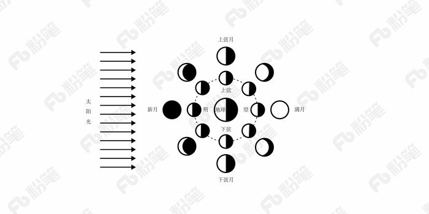
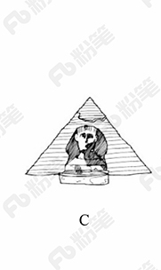
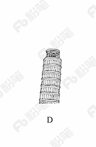

# 2018年黑龙江省公务员考试（公检法）题（网友回忆版）

> 常识判断 · 18 题 · 黑龙江 2018

## 第 1 题　qid 2187719 · 经济常识

下列事件按时间先后顺序排列正确的是：
①中国女排获得里约奥运会女排比赛冠军
②中国（上海）自由贸易实验区正式设立
③第九届金砖国家领导人会晤在厦门举行
④我国举行纪念中国人民抗日战争暨世界反法西斯战争胜利70周年阅兵式

- **A**. ②③①④
- **B**. ④①②③
- **C**. ②④①③　✅
- **D**. ②①③④

**答案**：C

**官方解析**

本题考查毛中特。

②2013年8月22日，国务院正式批准设立中国（上海）自由贸易试验区。

④2015年9月3日，是中国第二个法定的“中国人民抗日战争胜利纪念日”，也是中国人民抗日战争暨世界反法西斯战争胜利70周年。

①北京时间2016年8月21日，在里约奥运会女排决赛中，中国队战胜塞尔维亚队获得金牌。

③2017年9月3日至5日，金砖国家领导人第九次会晤在福建厦门举行，主题是：“深化金砖伙伴关系，开辟更加光明未来。”金砖合作已经步入第二个“黄金十年”。

故按照时间先后顺序排序为②④①③。

故正确答案为C。

---

## 第 2 题　qid 2187710 · 人文常识

下列文学作品没有使用方言的是：

- **A**. 《海上花列传》(韩邦庆)
- **B**. 《凤凰涅槃》(郭沫若)　✅
- **C**. 《秦腔》（贾平凹）
- **D**. 《白鹿原》(陈忠实)

**答案**：B

**官方解析**

本题考查文学常识。
A项正确，《海上花列传》是清末著名小说，主要讲述了清末中国上海十里洋场中的妓院生活，涉及当时的官场、商界及与之有联系的社会的各个层面。它是最著名的吴语小说，也是中国第一部方言小说。
B项错误，《凤凰涅槃》是一首现代白话诗歌，诗歌以凤凰的传说为素材，通过凤凰集木自焚，从烈焰中重生的故事，表达了彻底埋葬旧社会、争取祖国自由解放的思想，在现代诗歌史上具有重要历史地位的诗篇。《凤凰涅槃》运用的现代白话文，不涉及方言的应用。
C项正确，《秦腔》是贾平凹的著名长篇小说。《秦腔》中用了大量的修辞手法，融合比喻、拟人、对偶、象征等手法，活灵活现地展现了农村生活，这些修辞手法结合方言化的语言要素，形成了极具地域色彩的语言风格。
D项正确，《白鹿原》是陈忠实创作的长篇小说。小说中，作者不仅从表层的遣词造句的角度精心选择方言语汇，运用方言语气词以及高密度的排比句和长句来营造方言氛围、创造方言腔调，而且从深层的角度运用方言思维进行布局谋篇。
本题为选非题，故正确答案为B。

---

## 第 3 题　qid 2188569 · 人文常识

宗教对文学艺术的创作影响深远，下列未受宗教影响的作品是：

- **A**. 米开朗基罗的《大卫》
- **B**. 柴可夫斯基的《天鹅湖》　✅
- **C**. 大仲马的《基督山伯爵》
- **D**. 达·芬奇的《最后的晚餐》

**答案**：B

**官方解析**

本题考查人文常识。
A项正确，《大卫》，是文艺复兴雕塑巨匠米开朗基罗的代表作。关于大卫的记载大部分出自犹太教的宗教经典《塔纳赫》，说明作品受犹太教的影响。
B项错误，《天鹅湖》，是俄国作曲家柴可夫斯基的作品，是古典芭蕾舞剧的典范。其内容取材于民间传说，并未体现宗教内容或受到宗教影响。
C项正确，法国作家大仲马的《基督山伯爵》从表面上来看似乎仅仅是一部讲述报恩复仇的故事，但在其背后，也隐含有浓郁的宗教情结，特别是在表面的复仇故事下表达了基督教的爱，从主人公复仇时行为思想的变化，体现出了其爱的精神从旧约精神到新约精神的转变。整个《基督山伯爵》呈现出的“蒙难——神恩——拯救——永生”结构采用的正是与耶稣受难的故事相似的结构模式。
D项正确，《最后的晚餐》，是意大利艺术家列奥纳多·达·芬奇所创作，以《圣经》中耶稣跟12个门徒共进最后一次晚餐为题材。说明作品深受基督教影响。
本题为选非题，故正确答案为B。

---

## 第 4 题　qid 2188565 · 经济常识

关于税收，下列说法错误的是：

- **A**. 涉及税收的制度只能由法律来规定
- **B**. 履行纳税义务是公民享有其他权利的前提条件　✅
- **C**. 企业在缴纳增值税时应当扣除企业的经营成本
- **D**. 小王抽奖获得的10万元奖金应当缴纳个人所得税

**答案**：B

**官方解析**

本题考查法律常识。
A项正确，《立法法》第八条规定：“下列事项只能制定法律：······（六）税种的设立、税率的确定和税收征收管理等税收基本制度；······”
B项错误，《宪法》第五十六条规定：“中华人民共和国公民有依照法律纳税的义务。”依法纳税是公民应该履行的一项基本义务。纳税义务的履行，实际上也为纳税人带来相应的权利。纳税者有权享受政府提供的各种公共和服务设施，如医疗、教育、社会安全、法律保障、交通等，并有权要求政府积极改善这些条件并提供优质服务。从某种意义上说，纳税义务的履行是纳税者享有权利的基础与条件。但这并不表示纳税是公民享有其他权利的前提，比如选举权、人身自由权等。
C项正确，从计税原理上说，增值税是对商品生产、流通、劳务服务中多个环节的新增价值或商品的附加值征收的一种流转税。企业的经营成本也是商品的成本，不属于新增价值，所以在缴税时应该扣除。
D项正确，《个人所得税法》第二条第一款规定：“下列各项个人所得，应当缴纳个人所得税：······（九）偶然所得。”《中华人民共和国个人所得税法实施条例》第六条规定：“个人所得税法规定的各项个人所得的范围：······（九）偶然所得，是指个人得奖、中奖、中彩以及其他偶然性质的所得。······”小王抽奖获得的10万元奖金，应当缴纳个人所得税。
本题为选非题，故正确答案为B。

---

## 第 5 题　qid 2189166 · 人文常识

2014年，万某开了一家网店，专门销售各类知名品牌的鞋服等商品，后经相关品牌的权利人发现并鉴定万某销售的商品均系仿冒其注册商标的产品。在上述案例中，相关知名品牌的权利人不可以：

- **A**. 要求工商部门对万某的行为进行查处
- **B**. 没收万某销售的侵权商品　✅
- **C**. 向法院起诉主张赔偿
- **D**. 与万某进行协商解决

**答案**：B

**官方解析**

本题主要考查法律常识。根据《反不正当竞争法》第六条规定：“经营者不得实施下列混淆行为，引人误认为是他人商品或者与他人存在特定联系：（一）擅自使用与他人有一定影响的商品名称、包装、装潢等相同或者近似的标识；（二）擅自使用他人有一定影响的企业名称（包括简称、字号等）、社会组织名称（包括简称等）、姓名（包括笔名、艺名、译名等）；（三）擅自使用他人有一定影响的域名主体部分、网站名称、网页等；（四）其他足以引人误认为是他人商品或者与他人存在特定联系的混淆行为。”本题中，该网店仿冒他人注册商标产品的行为，构成混淆行为。
A项正确，相关知名品牌权利人作为受害者，有权要求工商部门对万某的行为进行查处，防止万某继续实施侵害其合法权益。
B项错误，《反不正当竞争法》第十八条：“经营者违反本法第六条规定实施混淆行为的，由监督检查部门责令停止违法行为，没收违法商品。”本案中，相关知名品牌的权利人无权没收万某销售的侵权商品，应当由监督检查部门没收违法商品。
C项正确，《反不正当竞争法》第十七条第二款规定：“经营者的合法权益受到不正当竞争行为损害的，可以向人民法院提起诉讼。”
D项正确，相关知名品牌的权利人与万某属于民商事纠纷，可以进行协商以解决纠纷。
本题为选非题，故正确答案为B。

---

## 第 6 题　qid 2188564 · 经济常识

对于债务关系主体，如果实际通货膨胀率高于预期的水平，则下列说法正确的是：

- **A**. 债务人和债权人都受损
- **B**. 债务人和债权人都受益
- **C**. 债权人受损，债务人受益　✅
- **D**. 债务人受损，债权人受益

**答案**：C

**官方解析**

本题考查经济常识，主要涉及通货膨胀率的相关内容。
“债务人”，与“债权人”相对，是指根据法律或合同、契约的规定，在借债关系中对债权人负有偿还义务的人。
在债务关系履行过程中，如果实际通货膨胀率高于预期的水平，则会出现物价进一步上涨，货币贬值的现象。但此时债务人需承担的还款债务并没有随着实际通货膨胀率的比例增加，故债务人受益。而随着通货膨胀率的提高，纸币贬值，债权人的实际利益将会受损。故当实际通货膨胀率高于预期水平时，债务人受益，而债权人受损。
故正确答案为C。

---

## 第 7 题　qid 2189167 · 人文常识

下列名句与所体现的哲学原理对应错误的是:

- **A**. 士别三日，当刮目相看——事物是发展变化的
- **B**. 流水不腐，户枢不蠹——运动是物质的根本属性
- **C**. 唇齿相依，唇亡齿寒——事物是普遍联系的
- **D**. 不识庐山真面目，只缘身在此山中——真理是具体且多元的　✅

**答案**：D

**官方解析**

本题主要考查哲学常识。
A项正确，“士别三日，当刮目相看”指分别一段时间，别人已有进步，当另眼相看。说明在分别的时间内，人发生了可喜的变化，体现了事物是不断发展前进的。
B项正确，“流水不腐，户枢不蠹”指常流的水不发臭，常转的门轴不遭虫蛀；比喻经常运动，生命力才能持久，才有旺盛的活力。说明物质只有在运动中才能存在，运动是物质的存在方式和根本属性。
C项正确，“唇齿相依，唇亡齿寒”比喻双方关系极为密切，休戚相关，体现了事物之间相互连结、相互依赖、相互影响的关系，表明事物是普遍联系的。
D项错误，“不识庐山真面目，只缘身在此山中”意为处于庐山之中不能认识庐山真实的面目，是因为看得不全面，克服主观片面性才能获得对事物的正确认识，体现的是整体观这一哲学原理。真理是多元的本身表述错误，且选项并未体现。马克思主义的真理论认为，真理的客观来源只有一个，即物质世界。凡与客观对象相符合一致的认识就是真理，否则就不是真理，因此真理不能是多元的。
本题为选非题，故正确答案为D。

---

## 第 8 题　qid 2188576 · 科技常识

下列生活常识中，表述错误的是：

- **A**. 药物大多饭后服用，是为了减少对胃肠道的刺激
- **B**. 大米久泡，会使无机盐和可溶性维生素溶于水而损失
- **C**. 经常用冷水刷牙，容易导致牙龈出血、牙髓痉挛等疾病
- **D**. 发烧时喝茶能辅助降温，因为茶叶所含的茶碱能降低人体温度　✅

**答案**：D

**官方解析**

本题考查科技常识。
A项正确，药物饭后服用，是因为有些药对胃有刺激性。在饭后服用，胃里的食物可以将药物隔离，使药性缓慢释放，可减少药物对胃肠道的刺激，有利于药物吸收和利用。
B项正确，由于大米中含有一些溶于水的维生素和无机盐，而且很大一部分在大米的外层，如果久泡，米粒中的无机盐和可溶性维生素会有一部分溶于水中而损失。
C项正确，人的牙齿相对来说最适应约35-36.5摄氏度的温度，如果经常用冷水刺激牙齿将导致牙龈出血、牙髓痉挛或其他牙病的发生。
D项错误，茶叶中含有茶碱，茶碱有兴奋中枢神经、加强血液循环及加速心跳的作用，相对地也会使血压升高。发烧时如果喝茶，由于茶碱的作用，会使体温更快上升，并可影响和降低药物的作用，从而加重病情，因此，发烧时不宜喝茶。
本题为选非题，故正确答案为D。

---

## 第 9 题　qid 2187660 · 科技常识

某患者深夜因剧烈的关节疼痛而惊醒，触摸其手足多个关节，发现有黄白色结晶体隆起。造成这种症状的代谢改变最有可能是：

- **A**. 糖的无氧分解增强，生成过多乳酸
- **B**. 嘌呤核苷酸分解增强，生成过多尿酸　✅
- **C**. 肝中脂肪酸氧化增强，生成大量酮体
- **D**. 氨基酸脱氨基作用增强，生成大量尿素

**答案**：B

**官方解析**

本题考查生物常识。

痛风是由单钠尿酸盐（MSU）沉积所致的晶体相关性关节病，与嘌呤代谢紊乱和尿酸排泄减少所致的高尿酸血症直接相关，特指急性特征性关节炎和慢性痛风石疾病，主要包括急性发作性关节炎、痛风石形成、痛风石性慢性关节炎、尿酸盐肾病和尿酸性尿路结石，重者可出现关节残疾和肾功能不全。

痛风最重要的生化基础是高尿酸血症。尿酸是人体内嘌呤代谢的最终产物。正常成人每日约产生尿酸750mg，其中为内源性，为外源性尿酸，这些尿酸进入尿酸代谢池（约为1200mg），每日代谢池中的尿酸约进行代谢，其中1/3约200mg经肠道分解代谢，2/3约400mg经肾脏排泄，从而可维持体内尿酸水平的稳定，其中任何环节出现问题均可导致高尿酸血症。故造成这种症状的代谢改变最有可能是嘌呤核苷酸分解增强，生成过多尿酸，即B项正确，A、C、D三项错误。

故正确答案为B。

---

## 第 10 题　qid 2188397 · 人文常识

“人有悲欢离合，月有阴晴圆缺”，圆缺就是指“月相变化”，即地球上看到月球被太阳照亮部分的称呼。右图所示“上弦月”大致的农历日期是：

- **A**. 初一、初二
- **B**. 初七、初八　✅
- **C**. 十五、十六
- **D**. 廿二、廿三

**答案**：B

**官方解析**

本题考查自然常识，主要涉及月相变化的相关知识。
A项错误，农历初一的月相是新月，月球位于太阳和地球之间。地球上的人们正好看到月球背离太阳的面，因而在地球上看不见月亮。
B项正确，图中所示的上弦月，大约出现在农历每月初七、初八，月球绕地球继续向东运行，月地连线与日地连线成90度，我们在地球上正好看到月球是西半边亮，呈半圆形，因此叫上弦月。
C项错误，农历十五、十六时出现的月相是满月，月球运行到地球的外侧，即太阳、月球位于地球的两侧。由于白道面与黄道有一夹角，通常情况下，地球不能遮挡住日光，月球亮面全部对着地球。
D项错误，农历廿二、廿三时出现的月相是下弦月，太阳、地球和月球之间的相对位置再次变成直角，月球在日地连线的西边90度，我们在地球上看到月球东半边亮，呈半圆形，称为下弦月。
故正确答案为B。

---

## 第 11 题　qid 2187754 · 科技常识

下列选项不属于航空航天中货运飞船主要任务的是：

- **A**. 货运飞船发射升空完成后，会与空间站自动或人工交会对接
- **B**. 货运飞船进行空间站实验和技术试验，将获取的研究数据回传　✅
- **C**. 货运飞船为空间站补加推进剂以及空气，带来饮水、食物等补给物资
- **D**. 货运飞船可充当空间站的“垃圾桶”，将站内废弃物品搬运至货运飞船

**答案**：B

**官方解析**

本题考查的是科技常识的相关知识。
货运飞船是一种专门运送货物到达太空一次性使用的航天器，主要任务是向空间站定期补给食品、货物、燃料和仪器设备等。它是国际空间站补给物资的重要运输工具，也是空间站的地面后勤保障系统。
A项正确，货运飞船发射升空后，可以与空间站自动或人工交会对接，从而输送空间站需要的补给物资。
B项错误，空间站实验和技术试验，将获取的研究数据回传这是空间站的任务，而不是货运飞船的任务。
C项正确，货运飞船可以为空间实验室以及空间站提供推进剂、空气、航天员的饮水、食物以及用于维修空间站的更换设备等补给物资。
D项正确，空间站丢弃的废弃物和生活垃圾等也可以搬运至货运飞船，随货运飞船进入大气层烧毁。
本题为选非题，故正确答案为B。

---

## 第 12 题　qid 2188480 · 科技常识

下列现象的物理解释错误的是：

- **A**. 高压锅烹煮食物——升高水的沸点
- **B**. 露珠呈球状——液体表面张力
- **C**. 铁轨铺在枕木上——减少压强
- **D**. 大银幕观影——光的漫折射　✅

**答案**：D

**官方解析**

本题考查科技常识。
A项正确，水的沸点受压强影响，压强越高，沸点越高。高压锅烹煮食物增大了锅内的气压，提高了水的沸点，要煮的食物温度升高，从而使食物熟透。
B项正确，物质由分子组成，分子之间有间隙，由于分子在不停地做无规则运动，分子间存在相互作用的引力和斥力。在液体表面，分子间的作用力表现为相互吸引，由此表现为液体的表面张力。表面张力促使露珠以最小的表面积的状态存在，而体积相等的物体中，只有球体的表面积最小，所以露珠总是呈球状的。
C项正确，把铁轨铺在枕木上，是为了在压力一定的情况下，增大铁轨与地面的接触面积，从而减小火车对地面的压强。
D项错误，漫反射是指投射在粗糙表面上的光向各个方向反射的现象。电影院里人能在不同的座位上看到银幕上的画面，是因为屏幕上的光源在银幕上形成了漫反射，而不是光的漫折射。
本题为选非题，故正确答案为D。

---

## 第 13 题　qid 2188558 · 人文常识

下列情形不可能发生在中国宋代的是：

- **A**. 农户张三用铁犁耕地
- **B**. 士兵李四用火药攻城
- **C**. 商人王五用交子订货
- **D**. 厨师赵六用番茄制酱　✅

**答案**：D

**官方解析**

本题考查人文常识。
A项正确，我国铁器的使用一直可以上溯到西周晚期，春秋时期，铁制农具开始出现，战国时期铁农具的使用范围进一步扩大，且在春秋战国时期，人们开始使用牛犁并逐渐推广，宋朝在春秋战国以后，因此A项描述的情形可以发生。
B项正确，火药是中国四大发明之一，唐朝末年，火药已被用于军事，北宋在东京设立专门机构，制造火药和火器。南宋时发明了管型火器“突火枪”，因此B项描述的情形可以发生。
C项正确，交子，是发行于北宋初年的货币，是我国最早由政府正式发行的纸币，也被认为是世界上最早使用的纸币，因此C项描述的情形可以发生。
D项错误，番茄原产南美洲，在明代时期传入我国。因此，番茄制酱不可能出现在我国宋代。
本题为选非题，故正确答案为D。

---

## 第 14 题　qid 2188562 · 人文常识

下列行为构成盗窃罪的是：

- **A**. 张某无意间将李某埋藏在屋外树下的十万元现金挖出，并占为己有，拒不交出
- **B**. 胡某在任邮政局营业员期间，盗取储户的存折密码，然后冒充储户在取款单上签名，提取现金40余万元
- **C**. 张某在给客户维修网络过程中获知该客户的网游账号和密码，后张某和其朋友利用该账号和密码在网吧玩网游，共消费3000余元　✅
- **D**. 赵某意欲窃走丁某的手提包，在其刚拿到手提包准备离开时被丁某发现，丁某当即抓住手提包，但因力气较小，最终手提包还是被赵某夺走

**答案**：C

**官方解析**

本题考查法律常识。
根据《刑法》第二百六十四条规定，盗窃罪是指以非法占有为目的，盗窃公私财物数额较大，或者多次盗窃、入户盗窃、携带凶器盗窃、扒窃的行为。
A项错误，根据《刑法》第二百七十条规定，侵占罪，是指将代为保管的他人财物非法占为己有，数额较大，拒不退还的，或者将他人的遗忘物或者埋藏物非法占为己有，数额较大，拒不交出的行为。该项中的张某将他人的埋藏物非法占为己有，拒不交出，构成侵占罪。
B项错误，根据《刑法》第三百八十二条第一款规定：“国家工作人员利用职务上的便利，侵吞、窃取、骗取或者以其他手段非法占有公共财物的，是贪污罪。”该项中的胡某作为国家工作人员，利用职务上的便利，私自取走（窃取）储户帐户中的钱款，构成贪污罪。此外，储户的存款同时系邮政局管理的财产，其工作人员取走储户的存款具有公共财产的属性。
C项正确，该项中，张某与其朋友以非法占有为目的，非法消费（相当于窃取）客户网游账号里的钱，数额较大（3000余元），构成盗窃罪。
D项错误，该项中的赵某盗窃丁某手提包时（尚未实际取得）被发现，丁某当即抓住手提包，赵某为了非法取得手提包，直接夺取，构成抢夺罪，而不是盗窃罪。
故正确答案为C。

---

## 第 15 题　qid 2187702 · 法律常识

下列情形中保险公司须承担给付或赔偿保险金的是：

- **A**. 定期寿险合同到期时，被保险人仍生存
- **B**. 在终身寿险中，受益人故意造成被保险人死亡　✅
- **C**. 在意外伤害保险有效期间，被保险人突发心脏病死亡
- **D**. 在投保重大疾病保险时，投保人故意隐瞒其有先天性疾病

**答案**：B

**官方解析**

本题主要考查法律常识。
A项错误，定期寿险是指在保险合同约定的期间内，如果被保险人死亡，则保险公司按照约定的保险金额给付保险金；若保险期限届满被保险人健在，则保险合同自然终止，保险公司不再承担保险责任，并且不退回保险费。因此，定期寿险合同到期，被保险人仍然生存，保险公司不用给付或赔偿保险金。
B项正确，终身寿险是指终身提供死亡保障的保险。根据《保险法》第四十三条第二款规定：“受益人故意造成被保险人死亡、伤残、疾病的，或者故意杀害被保险人未遂的，该受益人丧失受益权。”根据《保险法》第四十二条第一款规定：“被保险人死亡后，有下列情形之一的，保险金作为被保险人的遗产，由保险人依照《中华人民共和国继承法》（注：《继承法》现已是《民法典》继承编）的规定履行给付保险金的义务：(一)没有指定受益人，或者受益人指定不明无法确定的；(二)受益人先于被保险人死亡，没有其他受益人的；(三)受益人依法丧失受益权或者放弃受益权，没有其他受益人的。”因此当受益人故意造成被保险人死亡时，受益人丧失受益权，但是保险公司仍然要给付保险金。
C项错误，人身意外伤害险是指当被保险人在保险期限内遭受意外伤害，并以此为直接原因造成死亡或残废时，保险公司按照保险合同的约定向保险人或受益人支付一定数量保险金的一种保险。意外伤害指的是外来的、突发的、非本意的和非疾病的伤害。因此，被保险人突发心脏病死亡，不属于意外伤害，保险公司不用给付或赔偿保险金。
D项错误，重大疾病保险是指当被保险人患保单指定的重大疾病确诊后，保险人按合同约定定额支付保险金的保险。根据《保险法》第十六条第四款规定：“投保人故意不履行如实告知义务的，保险人对于合同解除前发生的保险事故，不承担赔偿或者给付保险金的责任，并不退还保险费。”因此，投保人故意隐瞒先天性疾病的，保险公司不用给付或赔偿保险金。
故正确答案为B。
【注】由于《继承法》已生效，《保险法》未做新修订，故还是引用了《保险法》中的原法条内容。

---

## 第 16 题　qid 2187718 · 人文常识

下列我国古代绘画理论名句所表达的美学理念与其他三项不同的是：

- **A**. 到处云山是吾师
- **B**. 搜尽奇峰打草稿
- **C**. 论画以形似，见与儿童邻　✅
- **D**. 吾师心，心师目，目师华山

**答案**：C

**官方解析**

本题主要考查文化常识的相关知识。
A项“到处云山是吾师”是元代赵孟頫提出的，表达的美学理念是重视向自然美学习。
B项“搜尽奇峰打草稿”是清代石涛提出的，表达的美学理念是重视向自然学习，注意感同身受和提炼构思相结合。
C项“论画以形似，见与儿童邻”是苏轼的两句论画名言。诗句意为：衡量画的好坏，只以形似作为评判优劣的标准，就如同儿童的见解一样幼稚。画要画出神，诗要有言外之味。古代艺术论将这种思想表述为:“含不尽之意见于言外”“象外之象”“味外之味”“意外之韵”等等。
D项“吾师心，心师目，目师华山”是明代王履提出的，表达的美学理念是向自然学习，师法自然，发挥主观能动性。
C项与其他三项不同。
本题为选非题，故正确答案为C。

---

## 第 17 题　qid 2188570 · 人文常识

以下著名建筑中，所处地点的地球纬线最长的是：

- **A**. 

- **B**. 

- **C**. 

　✅
- **D**. 

**答案**：C

**官方解析**

本题考查地理知识。纬线是地球表面某点随地球自转所形成的轨迹。所有的纬线都相互平行，并与经线垂直，纬线指示东西方向。纬线形状为圈。纬线圈的大小不等，赤道为最大的纬线圈，从赤道向两极纬线圈逐渐缩小，到南、北两极缩小为点。即纬度越小，纬线越长。
A项显示的建筑是长城，我们现在看到的长城基本是明长城，大约处在北纬36°~46°之间。
B项显示的建筑是自由女神像，位于美国纽约海港内自由岛的哈德逊河口附近，处在北纬40°41′。
C项显示的建筑是斯芬克斯石狮人面像，屹立于胡夫金字塔东侧，处在北纬29°58′。
D项显示的建筑是比萨斜塔，位于意大利托斯卡纳省比萨城北面的奇迹广场上，处在北纬43°43′。
四座建筑中，石狮人面像的纬度最小，所以纬线最长。
故正确答案为C。

---

## 第 18 题　qid 2189169 · 人文常识

关于中国古代书画艺术作品，下列说法不正确的是:

- **A**. 《洛神赋图》是吴道子根据曹植名篇《洛神赋》创作而成　✅
- **B**. 《步辇图》与松赞干布迎娶文成公主的史实有关
- **C**. 《快雪时晴帖》曾被乾隆皇帝收藏于三希堂
- **D**. 《清明上河图》描绘了北宋京城汴梁的繁华景象

**答案**：A

**官方解析**

本题考查文学常识。
A项错误，《洛神赋图》是东晋顾恺之的画作，它是由多个故事情节组成的类似连环画而又融会贯通的长卷。全卷分为三个部分，曲折细致而又层次分明地描绘着曹植与洛神真挚纯洁的爱情故事。
B项正确，《步辇图》是唐朝画家阎立本的名作之一。其内容反映的是吐蕃王松赞干布迎娶文成公主入藏的事，是汉藏兄弟民族友好情谊的历史见证。
C项正确，《快雪时晴帖》是东晋王羲之的书法作品，现收藏于台北故宫博物院。1746年（清乾隆十一年），乾隆遂将此帖与王献之的《中秋帖》、王珣的《伯远帖》收藏于他的书房“三希堂”，并且视《快雪时晴帖》为“三希”之首。
D项正确，《清明上河图》是中国十大传世名画之一。是北宋画家张择端仅见的存世精品。作品以长卷形式，采用散点透视构图法，生动记录了中国十二世纪北宋都城东京（又称汴京）的城市面貌和当时社会各阶层人民的生活状况，是北宋时期都城汴京当年繁荣的见证。
本题为选非题，故正确答案为A。

---
