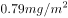
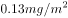

# 2018深圳市公务员录用考试《行测》题（网友回忆版）

> 常识判断 · 18 题 · 深圳市考 2018

## 第 1 题　qid 2166128 · 人文常识

2018年2月，第23届冬季奥林匹克运动会在韩国平昌郡举行。该届冬奥会上，获得奖牌数最多的国家为（  ）。

- **A**. 韩国
- **B**. 挪威　✅
- **C**. 奥地利
- **D**. 加拿大

**答案**：B

**官方解析**

本题主要考查时政。第23届冬季奥林匹克运动会，简称“平昌冬奥会”，于2018年2月9日-25日在韩国平昌郡举行。在该届冬奥会上，挪威以14块金牌、14块银牌、11块铜牌，共39枚奖牌，位居奖牌榜首位，德国共夺取31枚奖牌，位居第二，加拿大排名第三。
故正确答案为B。

---

## 第 2 题　qid 2166129 · 人文常识

海绵城市，是指在适应环境变化和应对雨水带来的自然灾害等方面具有良好的“弹性”的城市。深圳是国家海绵城市建设试点城市，计划到（  ）年，城市建成区以上的面积达到海绵城市要求。

- **A**. 2018
- **B**. 2020
- **C**. 2025
- **D**. 2030　✅

**答案**：D

**官方解析**

本题主要考查海绵城市的建设。《深圳市推进海绵城市建设工作实施方案》指出：到2020年，深圳市建成区以上的面积将达到海绵城市要求；到2030年，深圳市建成区以上的面积达到海绵城市要求，届时深圳将成为国际一流的海绵城市。

故正确答案为D。

---

## 第 3 题　qid 2166130 · 人文常识

下列观点体现了朴素唯物主义思想的是（  ）。

- **A**. 凡是存在的都是合理的
- **B**. 天地合气，万物自生　✅
- **C**. 没有调查就没有发言权
- **D**. 祸兮福之所倚，福兮祸之所伏

**答案**：B

**官方解析**

本题主要考查哲学有关问题。朴素唯物主义是用某种或几种具体物质形态来解释世界本原的哲学学说，其否认世界是神创造的，试图找到具有无限多样性的自然现象的统一。
A项错误，黑格尔认为，宇宙的本原是绝对精神。它自在地具备着一切，然后外化出自然界、人类社会、精神科学，最后在更高的层次上回归自身。简单地说，凡是绝对精神外化出的存在的事物，都是合理地存在的，就是存在即合理。主张世界的本原是“绝对精神”，这是客观唯心主义的观点。
B项正确，“天地合气，万物自生”出自东汉唯物主义思想家王充，其认为万物是由于物质性的“气”自然运动而生成的，天和地都是无意志的自然物质实体，宇宙万物的运动变化和事物的生成是自然无为的结果，属于朴素唯物主义思想。
C项错误，“没有调查就没有发言权”是毛主席提出的著名论断。调查研究是从实际出发的中心一环，既是“从物到感觉和思想”的唯物主义认识路线的具体体现，也是发挥人的主观能动性把握客观规律的具体途径，属于辩证唯物主义。
D项错误，“祸兮福之所倚，福兮祸之所伏”指福与祸相互依存、相互转化。祸使人悲伤，福使人快乐，但祸可能使人吸取教训而产生福，福可能使人乐极生悲而产生祸，两者是对立统一的矛盾关系，属于辩证唯物主义。
故正确答案为B。

---

## 第 4 题　qid 2166131 · 人文常识

公务员辞去公职，应当向任免机关提出书面申请。任免机关应当自接到申请之日起（  ）日内予以审批，其中对领导成员辞去公职的申请，应当自接到申请之日起（  ）日内予以审批。

- **A**. 十，二十
- **B**. 十，三十
- **C**. 三十，六十
- **D**. 三十，九十　✅

**答案**：D

**官方解析**

本题主要考查公务员法。《中华人民共和国公务员法》第八十五条规定：“公务员辞去公职，应当向任免机关提出书面申请。任免机关应当自接到申请之日起三十日内予以审批，其中对领导成员辞去公职的申请，应当自接到申请之日起九十日内予以审批。”
故正确答案为D。

---

## 第 5 题　qid 2166133 · 人文常识

2017年11月14日，中央文明办公布了第五届全国文明城市名单，深圳榜上有名。这是深圳第（  ）次荣膺全国文明城市称号。

- **A**. 二
- **B**. 三
- **C**. 四
- **D**. 五　✅

**答案**：D

**官方解析**

本题考查时政，主要考查深圳市所获城市荣誉。2017年11月14日，中央文明办公布了第五届全国文明城市名单，深圳榜上有名，第五次荣膺全国文明城市称号。多年来，深圳持之以恒地推动文明城市建设，已连续五次荣获全国文明城市这一国内城市综合评比中的最高荣誉，彰显了深圳经济特区在经济、政治、文化、社会、生态建设中的协调发展，彰显了深圳青春之城的新气象、新风尚、新变化、新活力。
故正确答案为D。

---

## 第 6 题　qid 2166134 · 法律常识

关于我国宪法宣誓制度，下列说法错误的是（  ）。

- **A**. 宣誓仪式应当采取集体宣誓的形式　✅
- **B**. 宣誓仪式应当奏唱中华人民共和国国歌
- **C**. 人民法院、人民检察院任命的国家工作人员，在就职时应当公开进行宪法宣誓
- **D**. 全国人民代表大会选举产生的人员，在依照法定程序产生后，进行宪法宣誓

**答案**：A

**官方解析**

本题主要考查宪法宣誓制度相关内容。
A项错误，《全国人民代表大会常务委员会关于实行宪法宣誓制度的决定》第八条规定：“宣誓仪式根据情况，可以采取单独宣誓或者集体宣誓的形式。”
B项正确，《全国人民代表大会常务委员会关于实行宪法宣誓制度的决定》第八条规定：“宣誓场所应当庄重、严肃，悬挂中华人民共和国国旗或者国徽。宣誓仪式应当奏唱中华人民共和国国歌。”
C项正确，《全国人民代表大会常务委员会关于实行宪法宣誓制度的决定》第一条规定：“各级人民代表大会及县级以上各级人民代表大会常务委员会选举或者决定任命的国家工作人员，以及各级人民政府、监察委员会、人民法院、人民检察院任命的国家工作人员，在就职时应当公开进行宪法宣誓。”
D项正确，《全国人民代表大会常务委员会关于实行宪法宣誓制度的决定》第三条规定：“全国人民代表大会选举或者决定任命的中华人民共和国主席、副主席，全国人民代表大会常务委员会委员长、副委员长、秘书长、委员，国务院总理、副总理、国务委员、各部部长、各委员会主任、中国人民银行行长、审计长、秘书长，中华人民共和国中央军事委员会主席、副主席、委员，国家监察委员会主任，最高人民法院院长，最高人民检察院检察长，以及全国人民代表大会专门委员会主任委员、副主任委员、委员等，在依照法定程序产生后，进行宪法宣誓。宣誓仪式由全国人民代表大会会议主席团组织。”
本题为选非题，故正确答案为A。

---

## 第 7 题　qid 2166135 · 人文常识

巡视是党内监督的重要方式，下列关于巡视工作的说法错误的是（  ）。

- **A**. 党的中央和省、自治区、直辖市委员会实行巡视制度，建立专职巡视机构
- **B**. 巡视工作坚持中央统一领导、分级负责
- **C**. 巡视组依靠被巡视党组织开展工作，履行执纪审查的职责，但不得干预被巡视地区（单位）的正常工作　✅
- **D**. 派出巡视组的党组织及其组织部门应当把巡视结果作为干部考核评价、选拔任用的重要依据

**答案**：C

**官方解析**

本题考查巡视工作条例相关内容。
A项正确，《中国共产党巡视工作条例》第二条第一款规定：“党的中央和省、自治区、直辖市委员会实行巡视制度，建立专职巡视机构，在一届任期内对所管理的地方、部门、企事业单位党组织全面巡视。”
B项正确，《中国共产党巡视工作条例》第四条规定：“巡视工作坚持中央统一领导、分级负责；坚持实事求是、依法依规；坚持群众路线、发扬民主。”
C项错误，《中国共产党巡视工作条例》第十八条规定：“巡视组依靠被巡视党组织开展工作，不干预被巡视地区(单位)的正常工作，不履行执纪审查的职责。” 
D项正确，《中国共产党巡视工作条例》第三十条规定：“派出巡视组的党组织及其组织部门应当把巡视结果作为干部考核评价、选拔任用的重要依据。”
本题为选非题，故正确答案为C。

---

## 第 8 题　qid 2166136 · 人文常识

既可用作上文，又可用作下文，也可用作平行文的党政机关公文文种是（  ）。

- **A**. 通知
- **B**. 通告
- **C**. 报告
- **D**. 意见　✅

**答案**：D

**官方解析**

本题考查公文常识。按公文的行文方向划分，可将公文分为上行文、下行文和平行文。上行文是指下级机关或业务部门向所属上级领导机关或业务主管部门的一种行文；下行文是指上级领导机关对下级机关发文；平行文是指同级机关或者不相隶属的，没有领导与指导关系的机关、部门、单位之间的一种行文。
A项错误，通知适用于发布、传达要求下级机关执行和有关单位周知或者执行的事项，批转、转发公文。通知可以作下行文，可以作平行文。
B项错误，通告适用于在一定范围内公布应当遵守或者周知的事项。通告一般为下行文。
C项错误，报告适用于向上级机关汇报工作、反映情况，回复上级机关的询问。报告是上行文。
D项正确，意见适用于对重要问题提出见解和处理办法。意见可以作上行文，可以作下行文，也可以作平行文。
故正确答案为D。

---

## 第 9 题　qid 2166137 · 人文常识

下列中国古代诗句中，所描写情境的季节与其他三项不一致的是（  ）。

- **A**. 乱花渐欲迷人眼，浅草才能没马蹄
- **B**. 碧玉妆成一树高，万条垂下绿丝绦
- **C**. 天街小雨润如酥，草色遥看近却无
- **D**. 小荷才露尖尖角，早有蜻蜓立上头　✅

**答案**：D

**官方解析**

本题考查文学常识。
A项“乱花渐欲迷人眼，浅草才能没马蹄”出自唐代诗人白居易的《钱塘湖春行》，意思是观岸边野花，渐使游人为之着迷；路上浅浅绿草，刚刚能把马蹄遮盖。本句描写的是早春植物变化的景象，描述的季节是春季。
B项“碧玉妆成一树高，万条垂下绿丝绦”出自唐代诗人贺知章的《咏柳》，意思是高高的柳树长满了翠绿的新叶，轻柔的柳枝垂下来，就像万条轻轻飘动的绿色丝带。本句描写的是早春的垂柳，描述的季节是春季。
C项“天街小雨润如酥，草色遥看近却无”出自唐代诗人韩愈的《早春呈水部张十八员外（其一）》，意思是长安街上丝雨纷纷，它像酥油般细密而滋润，远望草色依稀连成一片，近看时却显得稀疏零星。本句描写的是初春的小雨及小草沾雨后的景色，描述的季节是春季。
D项“小荷才露尖尖角，早有蜻蜓立上头”出自南宋诗人杨万里的《小池》，意思是娇嫩的小荷叶刚从水面露出尖尖的角，早有一只小蜻蜓立在它的上头。本句描写的是初夏的景色，描述的季节是夏季。
A、B、C三项描述的是春季，D项描述的是夏季。
本题为选非题，故正确答案为D。

---

## 第 10 题　qid 2166138 · 人文常识

下列内容不属于我国全面深化改革总目标的是（  ）。

- **A**. 完善和发展中国特色社会主义制度
- **B**. 建设社会主义法治体系　✅
- **C**. 推进国家治理体系现代化
- **D**. 推进国家治理能力现代化

**答案**：B

**官方解析**

中国共产党第十八届中央委员会第三次全体会议通过的《中共中央关于全面深化改革若干重大问题的决定》明确提出：“全面深化改革的总目标是完善和发展中国特色社会主义制度，推进国家治理体系和治理能力现代化。”因此，A、C、D三项正确，B项错误。
本题为选非题，故正确答案为B。

---

## 第 11 题　qid 2166139 · 人文常识

下列说法不符合党政机关公文规范的是（    ）。

- **A**. 紧急公文限三日内办结　✅
- **B**. 公文加盖签发人签名章时，签名章一般用红色
- **C**. 上级政府部门与下一级政府可以联合行文
- **D**. 除页码外，公文各组成要素一般分为版头、主体、版记三部分

**答案**：A

**官方解析**

本题考查公文相关知识。
A项错误，《党政机关公文处理工作条例》第二十四条第四款规定：紧急公文应当明确办理时限。承办部门对交办的公文应当及时办理，有明确办理时限要求的应当在规定时限内办理完毕。由此可见，紧急公文办结时间并未明确规定。
B项正确，《党政机关公文格式》GB-T 9704-2012第7.3.5.3条规定：签名章一般用红色。
C项正确，《党政机关公文处理工作条例》第十七条规定，同级党政机关、党政机关与其他同级机关必要时可以联合行文。属于党委、政府各自职权范围内的工作，不得联合行文。可知，同级政府与政府之间，部门与部门之间，上级政府部门与下一级政府之间可以联合行文，因为上级政府部门与下一级政府同级。
D项正确，《党政机关公文格式》GB-T 9704-2012第7.1条关于“公文格式各要素的划分”中规定：本标准将版心内的公文格式各要素划分为版头、主体、版记三部分。公文首页红色分隔线以上的部分称为版头；公文首页红色分隔线（不含）以下、公文末页首条分隔线（不含）以上的部分称为主体；公文末页首条分隔线以下、末条分隔线以上的部分称为版记。页码位于版心外。 
本题为选非题，故正确答案为A。

---

## 第 12 题　qid 2166140 · 人文常识

深化机构和行政体制改革，应赋予省级及以下政府更多自主权，对职能相近的党政机关可探索合并设立或合署办公。关于合署办公，下列说法错误的是（  ）。

- **A**. 合署办公须在同一处所办公
- **B**. 合署单位可分别配备行政领导班子
- **C**. 合署办公应以机构整合、合并为目的　✅
- **D**. 合署单位的人员、资源可在上级统一指挥调度下，视工作需要灵活运用

**答案**：C

**官方解析**

本题考查合署办公的相关知识。
合署办公是中国党政机构一种编制组织形式。两个具有不同编制、职责的党政机构由于工作对象、工作性质相近或其它原因而在同一地点办公，两个机构的人员、资源可在上级统一指挥调度下视工作需要而灵活运用。
A项正确，合署办公的两个党政机构，由于工作对象、工作性质相近或其它原因，须在同一地点办公。
B项正确，合署办公机构指由两个或两个以上的机构组成的联合机构。“合署”不是合并，合署单位可分别配备行政领导班子（也可兼职），分别刻制印章和挂牌子。
C项错误，2017年10月18日，习近平在十九大强调应赋予省级及以下政府更多自主权，在省市县对职能相近的党政机关探索合并设立或合署办公，因此合署办公的目的是为赋予党政机构更多自主权，而非机构整合、合并。
D项正确，合署办公单位的工作对象、工作性质相近，因此其人员和资源可在上级统一指挥调度下视工作需要而灵活运用。
本题为选非题，故正确答案为C。

---

## 第 13 题　qid 2166141 · 法律常识

下列情形不构成民法所称“不当得利”的是（  ）。

- **A**. 李某借用王某的单反相机，借用期间私自将相机出租给刘某，收取租金300元
- **B**. 张某在便利店买东西，收银员因疏忽大意错将50元当成10元找零给张某，张某收钱后即刻离开
- **C**. 纪某为使其子能够通过某高校自主招生考试，找到严某“打招呼”，严某因此收取纪某8000元打点费　✅
- **D**. 赵某请周某辅导其复习考试，并约定如及格将赠予周某价值500元的化妆品，考后赵某认为肯定能及格，提前将化妆品送给了周某，但成绩公布后赵某并未及格

**答案**：C

**官方解析**

本题考查法律常识。
《中华人民共和国民法典》第一百二十二条规定：因他人没有法律根据，取得不当利益，受损失的人有权请求其返还不当利益。不当得利的成立要件有四：一方取得财产利益；一方受有损失；取得利益与所受损失间有因果关系；没有法律上的根据。注意，因不法原因而给付的情况不属于不当得利。
A项正确，李某借用王某的单反相机，并未取得相机的所有权，其将相机出租给刘某并收取租金的行为，同时满足上述四个成立要件，构成不当得利。
B项正确，张某多收取的40元找零，使便利店遭受损失，满足上述四个成立要件，构成不当得利。
C项错误，纪某给严某打点好处费的行为，属于因不法原因而给付的情况。这种情况不属于不当得利。
D项正确，赵某与周某约定，当考试及格这一条件成立之后，赵某才应当赠与周某化妆品。但是最终赵某并未及格，此时周某收受赵某的化妆品，并没有合法的依据，使得赵某受到了损失。同时满足上述四个成立要件，构成不当得利。
本题为选非题，故正确答案为C。

---

## 第 14 题　qid 2166142 · 人文常识

寓言，通常篇幅短小，语言精练，用比喻性的故事寄托意味深长的道理，给人以启示。下列寓言故事与《农夫与蛇》表达同样道理的是（  ）。

- **A**. 《东郭先生》　✅
- **B**. 《南郭先生》
- **C**. 《杯弓蛇影》
- **D**. 《渔夫和金鱼》

**答案**：A

**官方解析**

《农夫与蛇》出自《伊索寓言》，这个故事告诉我们，做人一定要分清善恶，只能把援助之手伸向善良的人，对恶人千万不能心慈手软。
A项正确，《东郭先生》中的“东郭先生”专指那些不辨是非而滥施同情心的人。这个故事告诉我们，在人与人的关系中，也存在“东郭先生”式的问题，一个人应该真心实意爱人民，但丝毫不应该怜惜狼一样的恶人。
B项错误，《南郭先生》中的“南郭先生”指滥竽充数的人，比喻无才而占据其位的人。这个故事告诉我们，做人要实事求是，要有真才实学。
C项错误，《杯弓蛇影》中的“杯弓蛇影”意思是将映在酒杯里的弓影误认为蛇，比喻因疑神疑鬼而引起恐惧。这个故事告诉我们，在生活中无论遇到什么问题，都要问一个为什么，都要通过调查研究去努力弄清事情的真相，求得正确解决的方法。
D项错误，《渔夫和金鱼》的故事告诉我们，追求好的生活处境并没有错，但关键是要懂得适度，过度贪婪的结果必定是一无所获。
故正确答案为A。

---

## 第 15 题　qid 2166143 · 人文常识

国务院要求，在政府管理方式和规范市场执法中，全面推行“双随机、一公开”的监管模式。这一模式为各级政府推动简政放权、放管结合和优化服务提供了新思路，其中，“双随机”是指（  ）。

- **A**. 随机确定检查频次，随机抽取检查对象
- **B**. 随机抽取检查对象，随机选派执法检查人员　✅
- **C**. 随机抽取检查对象，随机选派民意代表
- **D**. 随机确定检查时间，随机确定检查频次

**答案**：B

**官方解析**

国务院办公厅于2015年8月发布的《国务院办公厅关于推广随机抽查规范事中事后监管的通知》中要求在全国全面推行“双随机、一公开”的监管模式。其中“双随机”是指要建立随机抽取检查对象、随机选派执法检查人员的“双随机”抽查机制，严格限制监管部门自由裁量权。“一公开”是指要将抽查情况及查处结果及时向社会公开。
故正确答案为B。

---

## 第 16 题　qid 2166145 · 科技常识

2017年4月，我国首艘货运飞船（  ）在文昌航天发射场成功发射，标志着我国即将开启空间站时代。

- **A**. 嫦娥一号
- **B**. 天宫一号
- **C**. 天舟一号　✅
- **D**. 丝路一号

**答案**：C

**官方解析**

本题考查科技常识。
A项错误，“嫦娥一号”是我国首颗绕月人造卫星，于2007年10月24日在西昌卫星发射中心升空。
B项错误，“天宫一号”是我国第一个目标飞行器，于2011年9月29日在酒泉卫星发射中心发射。
C项正确，“天舟一号”是我国第一艘面向空间站建造和运营任务全新研制的货运飞船，于2017年4月20日在海南文昌航天发射场发射成功。其成功发射，是我国载人航天工程“三步走”发展战略第二步的收官之作，标志着我国即将开启空间站时代。
D项错误，“丝路一号”不是货运飞船，而是科学试验卫星，随天舟一号货运飞船升空。其主要任务是为西部地区及丝路沿线国家提供便捷稳定的增强导航和遥感影像服务，不是为宇宙空间探测。
故正确答案为C。

---

## 第 17 题　qid 2166146 · 科技常识

甲醛是一种无色、有强烈刺激性气味的气体，在室内达到一定浓度会危害人体健康。下列花卉植物中，除（  ）外，均可有效吸收甲醛，净化居室空气。

- **A**. 吊兰
- **B**. 芦荟
- **C**. 常春藤
- **D**. 山茶花　✅

**答案**：D

**官方解析**

本题不严谨，选项中四种植物均有吸收甲醛作用，在此情况下，应选择吸收甲醛能力最弱者为本题答案。

根据相关研究文献，甲醛环境下15小时内，4种植物吸收甲醛能力分别为（以每平方米叶片吸收甲醛质量计算）：常春藤，吊兰为，芦荟为。另有以山茶花等8种植物为对象，对比吸收甲醛能力，15H内吸收能力排名为：吊兰＞芦荟＞绿萝＞······＞山茶花＞······。综合两个研究结果可知，山茶花吸收能力为最小。

本题为选非题，故正确答案为D。

---

## 第 18 题　qid 2166147 · 人文常识

在股份制公司，大股东凭借所占的多数股权影响公司决策，维护自己的利益，而众多的中小股东则可以通过由律师、学者等非投资人担任的（  ）在董事会维护自己的利益。

- **A**. 机构监管人
- **B**. 独立董事　✅
- **C**. 监事
- **D**. 职业经理人

**答案**：B

**官方解析**

本题考查法律常识。
B项正确，A、C、D三项错误，根据证监会《上市公司独立董事规则》第五条规定：“独立董事对上市公司及全体股东负有诚信与勤勉义务，并应当按照相关法律法规、本规则和公司章程的要求，认真履行职责，维护公司整体利益，尤其要关注中小股东的合法权益不受损害。”
故正确答案为B。

---
