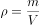

# 2019年420联考《行测》题（吉林甲级）（网友回忆版）

> 常识判断 · 15 题 · 吉林 2019

## 第 1 题　qid 2376694 · 人文常识

有人把做学问比作勘探石油，钻井打到3000米找不到油，就打到5000米、8000米······只要找准地方，越往下打，希望就越大。学懂党的理论和打井一样没有捷径，唯有深入学、刻苦学、持久学，才能掌握其精神实质。这段话蕴含的哲理是：

- **A**. 量变是质变的必要准备　✅
- **B**. 要善于抓事物的主要矛盾
- **C**. 质变和量变会相互转化
- **D**. 要善于发挥意识能动作用

**答案**：A

**官方解析**

本题考查政治常识。有人把做学问比作勘探石油，钻井打到3000米找不到油，就打到5000米、8000米······只要找准地方，越往深处打，希望就越大。这个形象比喻，对于党员、干部学习党的十九大精神颇有启发，这也表明任何事物的发展都必须首先从量变开始，没有一定程度的量的积累，就不可能有事物性质的变化，就不可能实现事物的飞跃和发展。
A项正确，题干描述的情况就是体现了量变是质变的必要准备。
B项错误，马克思主义告诉我们，在诸多矛盾中，要善于抓主要矛盾，在主要矛盾中要善于抓矛盾的主要方面。题干中没有体现。
C项错误，量变是事物发展的一个过程，质变是量变发展到一定阶段时的突变，量变是质变的准备阶段，质变是量变的新起点。题干中主要讲的是量变引起质变。
D项错误，意识能动作用指人的主观意识和实践活动对于客观世界的能动作用。题干中没有提到意识能动作用。
故正确答案为A。

---

## 第 2 题　qid 2376578 · 人文常识

1798年，拉普拉斯曾根据牛顿引力理论预言宇宙中存在一种类似于黑洞的天体。1939年，奥本海默等根据广义相对论，进一步证明，一个无压的尘埃球体，在自引力作用下将能坍缩到它的引力半径的范围以内，这就形成黑洞。2019年4月10日，黑洞研究开创性成果——“虚拟望远镜”在2017年拍摄的黑洞照片在全球同时发布，人们对于黑洞的研究又向前迈进了一步。这一过程蕴含的哲理是：

- **A**. 联系具有普遍性和条件性
- **B**. 世界具有统一性和多样性
- **C**. 认识具有反复性和上升性　✅
- **D**. 实践具有客观性和历史性

**答案**：C

**官方解析**

本题考查政治常识。
A项错误，联系具有普遍性和条件性。世界上的一切事物都与周围其他事物有着这样或那样的联系。一切事物的存在和发展都是有条件的。但本题没有体现联系的普遍性和条件性。
B项错误，世界具有物质统一性，世界的本原只有一个，即物质。而物质世界中各种事物和现象都是物质及其存在形式的不同表现。世界具有的统一性和多样性是共性和个性的关系。题干中没有体现世界的统一性和多样性。
C项正确，认识具有反复性。人们对一个事物的正确认识往往要经过从实践到认识、再从认识到实践的多次反复才能完成。从实践到认识、从认识到实践的循环是一种波浪式的前进和螺旋式的上升。题干中对于黑洞从预言到如今照片发布的认识过程，体现了人类认识的反复性和上升性。
D项错误，实践是人类改造客观世界的物质性活动，具有客观物质性和社会历史性。题干强调的是认识活动而非实践。
故正确答案为C。

---

## 第 3 题　qid 2376696 · 法律常识

某市一公民从海外回国，入境时带回的一箱化妆品被该市海关扣押，该公民不服，其申请行政复议的机关应该是：

- **A**. 该市海关
- **B**. 该市人民政府
- **C**. 该市海关的上一级海关　✅
- **D**. 该市所属省级人民政府

**答案**：C

**官方解析**

本题考查法律常识。
根据《行政复议法》第二十七条规定：“对海关、金融、外汇管理等实行垂直领导的行政机关、税务和国家安全机关的行政行为不服的，向上一级主管部门申请行政复议。”该公民对市海关的行政行为不服，应向该市海关的上一级海关申请行政复议，C项正确，A、B、D三项错误。
故正确答案为C。

---

## 第 4 题　qid 2376700 · 法律常识

据报道，某商场广告牌围挡被风吹倒，有行人被砸，送医就诊后，均无生命危险。事件发生时，市民吴某用手机录制了视频，谎称“商场牌子砸人了，3死2伤”。该视频被快速传播，在社会上造成不良影响。对此，下列说法正确的是：

- **A**. 吴某不遵守社会公德，应该由街道办进行教育与处罚
- **B**. 吴某的行为违反刑法，应该由法院判处其相应的刑罚
- **C**. 吴某触犯了民事法律，属于严重扰乱公共秩序的行为
- **D**. 吴某违反治安管理处罚法，应接受公安机关相应处罚　✅

**答案**：D

**官方解析**

本题考查法律常识。
《治安管理处罚法》第二十五条规定：“有下列行为之一的，处五日以上十日以下拘留，可以并处五百元以下罚款；情节较轻的，处五日以下拘留或者五百元以下罚款:（一）散布谣言，谎报险情、疫情、警情或者以其他方法故意扰乱公共秩序的；（二）投放虚假的爆炸性、毒害性、放射性、腐蚀性物质或者传染病病原体等危险物质扰乱公共秩序的；（三）扬言实施放火、爆炸、投放危险物质扰乱公共秩序的。”
A项错误，吴某在网上传播虚假信息，散布谣言，不仅仅是不遵守社会公德的行为，是违法行为。
B项错误，吴某的行为虽然在社会上造成了不良影响，但是并不是对社会具有很大的危害，没有触犯刑法规定，是一般违法行为，非犯罪行为。
C项错误，民法调整平等主体的自然人、法人和非法人组织之间的人身关系和财产关系。吴某的行为并不涉及到民事法律关系，触犯的不是民事法律。
D项正确，吴某在网上制造虚假信息，散布谣言，在社会上造成了不良的影响，是违反治安管理的行为，违反了治安管理处罚法，应该由公安机关进行相应的处罚。
故正确答案为D。

---

## 第 5 题　qid 2376693 · 人文常识

“鞋子合不合脚，自己穿着才知道，一个国家的发展道路合不合适，只有这个国家的人民才最有发言权。”下列古诗词蕴涵的哲理与“鞋子合脚论”最相近的是：

- **A**. 沉舟侧畔千帆过，病树前头万木春
- **B**. 古歌旧曲君休听，听取新翻杨柳枝
- **C**. 问渠那得清如许，为有源头活水来
- **D**. 纸上得来终觉浅，绝知此事要躬行　✅

**答案**：D

**官方解析**

本题考查政治常识。
A项错误，该句的意思是翻覆的船只旁仍有千千万万的帆船经过；枯萎树木的前面也有万千林木欣欣向荣。体现的哲理是事物总是不断发展变化的，新事物必然战胜旧事物，新陈代谢是宇宙间不可抗拒的规律。
B项错误，该句的意思是请你不要再听那前朝的曲子，来欣赏新创作的《杨柳枝》。体现的哲理是事物是变化发展的，不可因循守旧。
C项错误，该句的意思是要问池塘里的水为何这样清澈呢？是因为有永不枯竭的源头源源不断地为它输送活水。该句表面是写水因为有源头活水不断注入才“清如许”，实则暗喻人要心灵澄明，就得认真读书，时时补充新知识。体现的哲理是事物都是不断运动、变化和发展的，运动是物质的存在方式和根本属性。
D项正确，该句的意思是从书本上得来的知识毕竟不够完善，要透彻地认识事物还必须亲自实践。体现的哲理是实践是认识的来源，是检验真理的唯一标准。题干中“鞋子合脚论”也体现了这一原理。
故正确答案为D。

---

## 第 6 题　qid 2376562 · 人文常识

文风会风体现工作作风，也反映领导干部的能力和水平。下列名言最能体现改进文风会风要求的是：

- **A**. 智者弃短取长，以致其功
- **B**. 一室之不治，何以天下家国为
- **C**. 不学诗，无以言；不学礼，无以立
- **D**. 凫胫虽短，续之则忧；鹤胫虽长，断之则悲　✅

**答案**：D

**官方解析**

本题考查人文常识。
A项错误，“智者弃短取长，以致其功”意思是聪明人舍弃短处，采取长处，取得成功。意在强调做人要扬长避短，与题干要求不符。
B项错误，“一室之不治，何以天下家国为”意思是一间屋子都管理不好，怎么能管理好国家呢？意在强调要自律，重视小事的积累，没有体现改进文风会风的要求。
C项错误，“不学诗，无以言；不学礼，无以立”意思是不学《诗经》，在社会交往中就不会说话；不学礼，在社会上就不能立足。意在强调学习诗礼，与题干要求无关。
D项正确，“凫胫虽短，续之则忧；鹤胫虽长，断之则悲”意思是野鸭的小腿虽然短，续长一截就有忧患；鹤的小腿虽然长，截去一段就会痛苦。告诫我们行事要遵循规律，工作中文风会风也需要结合实际，务求实效，宜短则短，宜长则长，符合题干要求。
故正确答案为D。

---

## 第 7 题　qid 2376702 · 人文常识

下列诗句中，划线词语所指对象不同于其它三项的是：

- **A**. 
万松围坐石，大海浴<u>金轮</u>
　✅
- **B**. 
<u>桂魄</u>十分满，暮容千里晴

- **C**. 
天上分金镜，人间望<u>玉钩</u>

- **D**. 
绛河<u>冰鉴</u>朗，黄道玉轮巍

**答案**：A

**官方解析**

本题考查人文常识。
A项错误，诗句出自宋代薛嵎的《本无师住甸阳山庵》，诗句中的“金轮”所指对象是太阳。
B项正确，诗句出自宋代郑作肃的《中秋登青原台》，诗句中的“桂魄”所指的对象是月亮。
C项正确，诗句出自唐代李贺的《七夕》，诗句中的“玉钩”所指的对象是月亮，状新月、缺月，望月而冀其复圆，寓人间别而重逢意。
D项正确，诗句出自唐代元稹的《月三十韵》，诗句中将月亮比作“冰鉴”，意思是银河之上有一轮明朗的月亮犹如冰鉴，黄道天空中有一轮巍巍明月好像玉盘。
本题为选非题，故正确答案为A。

---

## 第 8 题　qid 2376695 · 人文常识

有人说，做好机关工作应该经历三重境界：最基本的是“技”，其次是“法”，最高的是“道”。下列寓言故事所反映的道理与此最相近的是：

- **A**. 愚公移山
- **B**. 庖丁解牛　✅
- **C**. 画龙点睛
- **D**. 画蛇添足

**答案**：B

**官方解析**

本题考查人文常识。
有人说，做好机关工作应该经历三重境界：最基本的是“技”，其次是“法”，最高的是“道”，意指做工作应当遵循一定的步骤。
A项错误，“愚公移山”出自春秋战国的列御寇《列子·汤问》，讲述了愚公不畏艰难，坚持不懈，挖山不止，最终感动天帝而将山挪走的故事。
B项正确，“庖丁解牛”出自《庄子·内篇·养生主》。它说明世上事物纷繁复杂，只要反复实践，掌握了它的客观规律，就能得心应手，运用自如。庖丁解牛之初，所看见的是浑然一牛；三年之后，就未尝见全牛了，而是对牛生理上的天然结构、筋骨相连的间隙、骨节之间的窍穴皆了如指掌；最后用精神去接触牛，不再用眼睛看它，感官的知觉停止了，只凭精神在活动，体现了从“技”到“法”再到“道”的三重境界，与题干中机关工作三重境界相符合。
C项错误，“画龙点睛”出自唐·张彦远《历代名画记·张僧繇》，原形容梁代画家张僧繇作画的神妙，后多比喻写文章或讲话时，在关键处用几句话点明实质，使内容更加生动有力。
D项错误，“画蛇添足”语出《战国策·齐策二》，比喻做多余的事，反而不恰当，讽刺了那些做事多此一举，反而得不偿失的人。也比喻虚构事实，无中生有。
故正确答案为B。

---

## 第 9 题　qid 2376697 · 经济常识

甲、乙两个地区居民的恩格尔系数分别为和，这可能表明：

- **A**. 甲地居民之间的贫富差距较大
- **B**. 乙地居民之间的贫富差距较大
- **C**. 甲地居民比乙地居民富裕　✅
- **D**. 乙地居民比甲地居民富裕

**答案**：C

**官方解析**

本题考查经济常识。

恩格尔系数是食品支出总额占个人消费支出总额的比重。其主要内容是指一个家庭或个人收入越少，用于购买生存性的食物的支出在家庭或个人收入中所占的比重就越大。对一个国家而言，一个国家越穷，每个国民的平均支出中用来购买食物的费用所占比例就越大。恩格尔系数达以上为贫困，为温饱，为小康，为富裕，低于为最富裕。题干中甲地恩格尔系数小于乙地，说明甲地居民比乙地居民富裕，故C项正确，D项错误。

A、B两项错误，基尼系数是判断收入分配公平程度的指标，国际上用来综合考察居民内部收入分配差异状况的一个重要分析指标。基尼系数越大，贫富差距越大。

故正确答案为C。

---

## 第 10 题　qid 2376698 · 人文常识

《初学记·鸟赋》云：“雏既壮而能飞兮，乃衔食而反哺。”其所描写的鸟是：

- **A**. 燕子
- **B**. 喜鹊
- **C**. 麻雀
- **D**. 乌鸦　✅

**答案**：D

**官方解析**

本题考查人文常识。
“雏既壮而能飞兮，乃衔食而反哺。”出自《初学记·鸟赋》，源自典故“乌鸦反哺”，意思指：乌雏长成，衔食喂养其母。后比喻报答亲恩。句中所描写的鸟指乌鸦。 
故正确答案为D。

---

## 第 11 题　qid 2376701 · 科技常识

科学家宣称太阳活动正在向着低点滑落，预计在2019至2020年达到低峰。届时地球受到的影响最可能是：

- **A**. 全球农业歉收　✅
- **B**. 航天危险增大
- **C**. 北极极光消失
- **D**. 上层大气升温

**答案**：A

**官方解析**

本题考查地理国情。
太阳黑子受强烈磁场的影响，在太阳表面形成相对低温的区域。其周边常伴随着耀斑爆发，向地球释放X射线和极端紫外辐射。每隔几年，太阳黑子会消退，黑子和耀斑等激烈活动减退，太阳活动向着低点滑落，太阳活动会减弱，这是太阳黑子循环的常规部分。
A项正确，太阳活动与自然灾害有一定的相关性，若太阳活动达到低峰，太阳活动进入极小年可能出现旱涝灾害，导致农业减产。
B项错误，太阳活动的减弱，相应地对无线电短波通信干扰减弱，对执行太空任务的宇航员来说，航天危险会相对减少。
C项错误，太阳活动的减弱，地球上极光现象会减少，但不会消失。
D项错误，太阳活动减弱，太阳辐射相应发生减退，地球上层大气温度会变低。
故正确答案为A。

---

## 第 12 题　qid 2376685 · 人文常识

长春市轨道交通2号线已投入运营，在工程建设中用量最大的硅酸盐材料是：

- **A**. 石灰
- **B**. 陶瓷
- **C**. 水泥　✅
- **D**. 大理石

**答案**：C

**官方解析**

A项错误，石灰是一种以氧化钙为主要成分的气硬性无机胶凝材料，不含硅酸盐。
B项错误，陶瓷是陶器和瓷器的统称，其中用黏土或陶土为原料烧制的器皿叫陶器，用瓷土、瓷石等为原料烧制的器皿叫瓷器。轨道交通的工程建设中一般不使用陶瓷。
C项正确，水泥是一种能把砂、石等材料牢固地胶结在一起的水硬性无机胶凝材料。水泥种类很多，最常用的是硅酸盐水泥，广泛应用于各类建筑工程中。因此轨道交通工程建设中用量最大的硅酸盐材料是水泥。
D项错误，大理石主要成分为碳酸钙，是一种装饰性很强的装饰材料，常用于大型公共建筑的门厅、大厅等比较重要的场所。
故正确答案为C。

---

## 第 13 题　qid 2376689 · 人文常识

压强和温度会引起密度的变化。假定其他条件不变的情况下，下列关于压强和密度的说法中，错误的是：

- **A**. 
氧气瓶中的氧气用掉一部分后，体积不变，密度变小

- **B**. 
给自行车胎打气，车胎体积不变，质量变大，密度变大

- **C**. 
通常情况下，水在0时的密度大于4时的密度
　✅
- **D**. 
温度计内的水银随温度升高而密度减小，体积变大

**答案**：C

**官方解析**

本题考查科技常识。

密度（）是对特定体积内的质量（）的度量（），计算公式是物体的质量除以体积，即。

A项正确，氧气瓶中的氧气是经压缩后保存的，在使用过程中，氧气被不断消耗，质量减小，而氧气瓶的体积不发生变化，即瓶内的氧气体积不变，故瓶内氧气的密度减小。

B项正确，车胎在满气状态下，其体积已经达到最大，此时给车胎打气，车胎内气体质量不断增加，但由于外胎束缚，车胎体积已基本不再变化，故车胎内气体密度变大。

C项错误，水在的密度为0.99984g每立方厘米，水在的密度为0.99997g每立方厘米，因此通常情况下，水在时的密度小于时的密度。

D项正确，水银温度计内的水银含量是不变的，即水银的总质量不变，受热后，水银膨胀，体积变大，密度减小。

本题为选非题，故正确答案为C。

---

## 第 14 题　qid 2376690 · 科技常识

开瓶放置的葡萄酒，数天后会变酸。这是由于发生了：

- **A**. 水解反应
- **B**. 氧化反应　✅
- **C**. 酯化反应
- **D**. 加成反应

**答案**：B

**官方解析**

本题考查科技常识。
A项错误，水解反应包括盐水解和有机化合物水解两类，通常指水中的氢和羟基分别加到化合物的某一部分，因而得到两种或两种以上新化合物的反应过程。葡萄酒变酸未涉及到水解反应。
B项正确，有机物的氧化反应是指失电子或电子偏离化合价升高的反应过程。葡萄酒开瓶后很容易被空气氧化，酒精（乙醇）在氧化作用下先生成乙醛，乙醛后被氧化为乙酸，使酒变成醋，因此会有酸味。
C项错误，酯化反应一般指醇和酸（无机酸或有机酸）作用生成酯（无机酸酯或有机酸酯）和水的反应。葡萄酒变酸未生成酯，不涉及酯化反应。
D项错误，加成反应是一种有机化学反应，指两个或多个分子互相作用，生成一个加成产物，其发生在有双键或叁键(不饱和键)的物质中。葡萄酒变酸未涉及到加成反应。
故正确答案为B。

---

## 第 15 题　qid 2376691 · 科技常识

高粱、玉米等植物的种子经发酵、蒸馏就可以得到一种“绿色能源”物质。这种物质是：

- **A**. 氢气
- **B**. 甲烷
- **C**. 酒精　✅
- **D**. 乙炔

**答案**：C

**官方解析**

本题考查科技常识。
A项错误，氢气是一种极易燃烧，无色透明、无臭无味的气体，液态氢可用做火箭或导弹的高能燃料。氢气是气体，且难溶于水，不能通过蒸馏的形式得到，实验室中可采用电解水、氨分解等方式制备氢气。
B项错误，甲烷是结构最简单的碳氢化合物，其主要是作为燃料，广泛应用于民用和工业中。由于甲烷是气体，不能通过蒸馏的形式得到，实验室中主要是用无水的醋酸钠和氢氧化钠加热在氧化钙（催化剂）的条件下发生脱羧反应生成碳酸钠和甲烷。
C项正确，高粱、玉米等植物的种子主要成分是淀粉，淀粉属于多糖，其经发酵、蒸馏后可以得到酒精。酒精燃烧生成二氧化碳和水，对环境无影响，所以被称为“绿色能源”。
D项错误，乙炔是最简单的炔烃，主要用于焊接金属、合成高分子化合物。乙炔不能通过植物发酵等形式得到，主要制备方法有电石法、天然气制乙炔法。
故正确答案为C。

---
