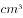

# 2019年420联考《行测》题（海南卷精选）（网友回忆版）

> 常识判断 · 18 题 · 海南 2019

## 第 1 题　qid 2377035 · 人文常识

下列选项释义错误的是：

- **A**. 驽：性烈但跑得快的马　✅
- **B**. 驷：套有四匹马的车
- **C**. 驹：小马、少壮的马
- **D**. 骥：好马、千里马

**答案**：A

**官方解析**

本题考查人文常识。
A项错误，驽，读音nú，指劣马，走不快的马，比喻愚钝无能。
B项正确，驷，读音sì，古代同驾一辆车的四匹马；或套有四匹马的车。
C项正确，驹，读音jū，指两岁以下的小马，少壮的骏马。也比喻少年英俊的人。
D项正确，骥，读音jì，本意指好马，一种能一日行千里的良马，比喻贤能。
本题为选非题，故正确答案为A。

---

## 第 2 题　qid 2377028 · 人文常识

让贫困人口和贫困地区同全国一道进入全面小康社会是我们党的庄严承诺。关于打赢脱贫攻坚战，下列说法准确的是：

- **A**. 强化行政一把手负总责的责任制
- **B**. 坚持先扶志，再扶智，后扶技的顺序
- **C**. 坚持中央统筹省负总责县乡抓落实的工作机制
- **D**. 动员全党全国全社会力量，坚持精准扶贫，精准脱贫　✅

**答案**：D

**官方解析**

本题考查政治常识。
党的十九大报告指出：“坚决打赢脱贫攻坚战。让贫困人口和贫困地区同全国一道进入全面小康社会是我们党的庄严承诺。要动员全党全国全社会力量，坚持精准扶贫、精准脱贫，坚持中央统筹省负总责市县抓落实的工作机制，强化党政一把手负总责的责任制，坚持大扶贫格局，注重扶贫同扶志、扶智相结合，深入实施东西部扶贫协作，重点攻克深度贫困地区脱贫任务，确保到二O二O年我国现行标准下农村贫困人口实现脱贫，贫困县全部摘帽，解决区域性整体贫困，做到脱真贫、真脱贫。”因此，D项正确，ABC项错误。
故正确答案为D。

---

## 第 3 题　qid 2376946 · 人文常识

办好2022年北京冬奥会，是我国对国际奥林匹克大家庭的庄严承诺，也是实施京津冀协同发展战略的重要举措。我国关于2022年北京冬奥会的办奥理念是：

- **A**. 环保、公平、竞争、和谐
- **B**. 绿色、共享、开放、廉洁　✅
- **C**. 生态、温暖、公平、实用
- **D**. 共享、友好、竞争、绿色

**答案**：B

**官方解析**

2015年7月31日，北京成功申办2022年冬季奥林匹克运动会和冬季残疾人奥林匹克运动会。2015年8月20日，习近平主持召开中共中央政治局常委会会议，专题听取申办冬奥会情况汇报，研究筹办工作，提出了坚持绿色办奥、共享办奥、开放办奥、廉洁办奥的要求。
故正确答案为B。

---

## 第 4 题　qid 2377033 · 人文常识

新形势下党的思想宣传工作使命任务是：

- **A**. 举旗帜、聚民心、育新人、兴文化、展形象　✅
- **B**. 树新风、育新德、兴产业、建形象、顺民心
- **C**. 聚民声、育思想、兴文化、树新风、富产业
- **D**. 聚民心、顺时代、树新风、讲美德、育新人

**答案**：A

**官方解析**

本题考查政治常识。
2018年8月21日至22日在北京召开全国宣传思想工作会议。中共中央总书记、国家主席、中央军委主席习近平出席会议并发表重要讲话。他强调，完成新形势下宣传思想工作的使命任务，必须以新时代中国特色社会主义思想和党的十九大精神为指导，增强“四个意识”、坚定“四个自信”，自觉承担起举旗帜、聚民心、育新人、兴文化、展形象的使命任务，坚持正确政治方向，在基础性、战略性工作上下功夫，在关键处、要害处下功夫，在工作质量和水平上下功夫，推动宣传思想工作不断强起来，促进全体人民在理想信念、价值理念、道德观念上紧紧团结在一起，为服务党和国家事业全局作出更大贡献。
故正确答案为A。

---

## 第 5 题　qid 2377181 · 法律常识

6岁的小凡身高1.05米，某日他瞒着父母独自去商场购买4000元的平板电脑。当天，其父母将一切完好的平板电脑退还并要求退还全款。商场以“电子商品一经使用，只换不退”为由拒绝。根据相关法律，下列说法正确的是：

- **A**. 
商场既不用退货退款，也不用换货

- **B**. 
商场做法正确，电子产品只换不退

- **C**. 
商场做法缺少法律依据，应全额退款
　✅
- **D**. 
商场应收取平板电脑原价50的折旧费

**答案**：C

**官方解析**

本题考查法律常识。
《民法典》第二十条规定：“不满八周岁的未成年人为无民事行为能力人，由其法定代理人代理实施民事法律行为。”《民法典》第一百四十四条规定：“无民事行为能力人实施的民事法律行为无效。”《民法典》第一百五十七条规定：“民事法律行为无效、被撤销或者确定不发生效力后，行为人因该行为取得的财产，应当予以返还；不能返还或者没有必要返还的，应当折价补偿。有过错的一方应当赔偿对方由此所受到的损失；各方都有过错的，应当各自承担相应的责任。法律另有规定的，依照其规定。”在本案中，6岁的小凡属于无民事行为能力人，他购买4000元平板电脑的行为是无效的。小凡的父母将完好无损的平板电脑带到商场，要求退还的要求符合法律规定。因此，商场的做法缺乏法律依据，应全额退款。
故正确答案为C。

---

## 第 6 题　qid 2377034 · 人文常识

下列最有可能不会受到治安管理处罚的是：

- **A**. 两人酒后打架斗殴，但均未受伤，酒醒后双方愿意和解　✅
- **B**. 房东发现房客在出租房内开赌场却不告知管理部门，反而提醒房客小心点
- **C**. 小明饲养了一只属于禁养犬只的大型犬，该犬性格温和从不咬人，民警多次提醒，小明仍然坚持饲养
- **D**. 在某足球比赛中，球迷不满“黑哨”，扔啤酒罐砸向裁判，但力度较轻，裁判未受伤

**答案**：A

**官方解析**

本题考查法律常识。
A项错误，根据《中华人民共和国治安管理处罚法》第九条规定：“对于因民间纠纷引起的打架斗殴或者损毁他人财物等违反治安管理行为，情节较轻的，公安机关可以调解处理。经公安机关调解，当事人达成协议的，不予处罚。经调解未达成协议或者达成协议后不履行的，公安机关应当依照本法的规定对违反治安管理行为人给予处罚，并告知当事人可以就民事争议依法向人民法院提起民事诉讼。”因此，对于两位打架斗殴后愿意和解的公民，可以不予处罚。
B项正确，根据《中华人民共和国治安管理处罚法》第五十七条第二款规定：“房屋出租人明知承租人利用出租房屋进行犯罪活动，不向公安机关报告的，处二百元以上五百元以下罚款；情节严重的，处五日以下拘留，可以并处五百元以下罚款。”该房东的行为属于违反《治安管理处罚法》的行为，会受到治安管理处罚。
C项正确，根据《中华人民共和国治安管理处罚法》第七十五条第一款规定：“饲养动物，干扰他人正常生活的，处警告；警告后不改正的，或者放任动物恐吓他人的，处二百元以上五百元以下罚款。”具体适用本条时，应当以他人的感受为判断标准，小明饲养了禁止饲养的大型犬，民警已多次提醒，可以看出该行为已经干扰了他人的正常生活，因此会受到治安管理处罚。
D项正确，根据《中华人民共和国治安管理处罚法》第二十四条规定：“有下列行为之一，扰乱文化、体育等大型群众性活动秩序的，处警告或者二百元以下罚款；情节严重的，处五日以上十日以下拘留，可以并处五百元以下罚款：（一）强行进入场内的；······（四）围攻裁判员、运动员或者其他工作人员的；（五）向场内投掷杂物，不听制止的；（六）扰乱大型群众性活动秩序的其他行为。因扰乱体育比赛秩序被处以拘留处罚的，可以同时责令其十二个月内不得进入体育场馆观看同类比赛；违反规定进入体育场馆的，强行带离现场。”因此，该球迷会受到治安管理处罚。
本题为选非题，故正确答案为A。

---

## 第 7 题　qid 2377425 · 科技常识

下列关于钢的表述错误的是：

- **A**. 碳是其最重要的硬化元素，所有钢材中都含有碳元素
- **B**. 钢按照成分的不同可分为低碳钢、中碳钢和高碳钢　✅
- **C**. 钢是含碳量在一定区间的铁碳合金
- **D**. 生铁经过高温煅烧可成为钢

**答案**：B

**官方解析**

本题考查科技常识中的化学常识，主要分析钢材的成分，与碳元素的关系及钢材的生成等。

AC项正确、B项错误，钢是含碳量在的铁合金。钢按照成分一般分为碳素钢与合金钢。碳素钢是普通钢，主要含铁，还有碳以及很少量的硅、锰、硫、磷等杂质。合金钢又叫特种钢。除铁、碳以外，还含有一种或多种一定量的合金元素的钢。合金元素有硅、锰、钼、镍、铬、钒、钛、铌、硼，钨和稀土元素等。故无论何种钢材都有碳；其中碳素钢根据含碳量不同，碳素钢可分为高碳钢、中碳钢、低碳钢。高碳钢硬度大，可用于制造模具、刀具等；低碳钢和中碳钢硬度适中，韧性较好，用于制造机器和用具。故B表述错误。

D项表述不严谨，生铁炼钢需三步：一是高温煅烧，为降低含碳量、去除有害杂质；二是脱氧， 加入脱氧剂(硅铁、锰铁或铝)，使钢水中少量的氧化铁还原成铁单质；三是去除硫和磷。加入氧化钙，与磷、硫元素反应，生成炉渣排出。仅仅是高温煅烧得不到钢，但是得到钢必须经过高温煅烧。因此D表述不十分严谨，而B明显错误，单选择优选B。

本题为选非题，故正确答案为B。

---

## 第 8 题　qid 2377055 · 地理国情

下列说法正确的是：

- **A**. 阿拉伯数字由古罗马人发明，经阿拉伯人传入亚洲
- **B**. 一般认为，“尼德兰革命”是世界上最早成功的资产阶级革命　✅
- **C**. 亚洲耕地面积最大的国家为印度，其境内主要有阿拉伯河、恒河流经
- **D**. 文艺复兴起源于英国，后扩展到西欧各国；其与宗教改革、启蒙运动并称为西欧近代三大思想解放运动

**答案**：B

**官方解析**

本题考查人文常识。
A项错误，阿拉伯数字是现今国际通用数字，最初由古印度人发明，后由阿拉伯人传入欧洲，之后再经欧洲人将其现代化。正因阿拉伯人的传播，成为该种数字最终被国际通用的关键节点，所以人们称其为“阿拉伯数字”。
B项正确，尼德兰革命（今荷兰、比利时等国的资产阶级革命，约发生在1566-1609年），是历史上第一次成功的资产阶级革命。这次革命是通过民族解放战争的形式完成的，革命后建立了资产阶级共和国。
C项错误，印度从喜马拉雅山向南，一直伸入印度洋，北部是山地，中部是印度河—恒河平原，南部是德干高原及其东西两侧的海岸平原。平原面积广，而且山地、高原大部分海拔不超过1000米，耕地面积广，是亚洲耕地面积最大的国家。阿拉伯河属于伊拉克东南部的河流，由底格里斯和幼发拉底两河在古尔奈镇汇流而成，流经伊拉克的巴斯拉港和伊朗的阿巴丹港，注入波斯湾，阿拉伯河并不在印度境内。
D项错误，文艺复兴是发生在14世纪到16世纪的一场反映新兴资产阶级要求的欧洲思想文化运动，最先在意大利各城市兴起，然后扩展到西欧各国。文艺复兴与宗教改革、启蒙运动并称为西欧近代三大思想解放运动。
故正确答案为B。

---

## 第 9 题　qid 2377026 · 地理国情

男子足球国际比赛中，人们常结合各国的历史、地理、文化等因素，给予参赛队伍别称。据此，下列别称与其国家对应不恰当的是：

- **A**. 阿根廷：潘帕斯雄鹰
- **B**. 英格兰：三狮军团
- **C**. 意大利：高卢雄鸡　✅
- **D**. 伊朗：波斯铁骑

**答案**：C

**官方解析**

本题考查人文常识。
A项正确，潘帕斯是南美洲阿根廷最大草原，草原上生活着一种雄鹰，十分凶猛，由此大家都称阿根廷男子足球队是潘帕斯雄鹰，来赞美它的强大。
B项正确，英格兰男子足球国家队队徽是由三头狮子及十朵蔷薇花组成。因此，三狮军团也就成为英格兰男子足球国家队的昵称。
C项错误，高卢是法国古称，高卢雄鸡是法国第一共和国时代国旗上的标志，是当时法国人民的革命意识的象征，在国际男足比赛中，高卢雄鸡也被称为法国国家足球队的绰号。而意大利国家男子足球队的别称为蓝衣军团。
D项正确，伊朗是文明古国，在公元前550年，建立了世界历史上第一个领土横跨欧亚非三大洲的帝国——波斯帝国，在国际男足比赛中，波斯铁骑也被称为伊朗国家足球队的绰号。
本题为选非题，故正确答案为C。

---

## 第 10 题　qid 2377027 · 人文常识

在日常生活中，下列各项影响食品腐败变质速度的因素中，起最主要作用的是：

- **A**. 食品自身的成分
- **B**. 食品所含的水分
- **C**. 储存食品的环境温度　✅
- **D**. 储存食品的环境湿度

**答案**：C

**官方解析**

本题考查科技常识。引起食物腐败变质有多种原因，比如微生物、食物中的酶等等，但最主要影响因素还是微生物。因此影响食物腐败变质速度主要是看微生物的生长繁殖速度。影响微生物生长的主要因素有温度、氧气、辐射、渗透压等等。其中，温度的影响最大，主要是因为微生物的代谢活动在较小的温度范围内波动就会有很大的变化。
故正确答案为C。

---

## 第 11 题　qid 2377046 · 人文常识

下列符合常识的是：

- **A**. 2000毫升矿泉水约重2斤
- **B**. 成人使用的标准筷子长度约为14厘米
- **C**. 仍在流动的淡水河其水温为零下3摄氏度　✅
- **D**. 弯道较多的盘山公路限速100公里每小时

**答案**：C

**官方解析**

本题考查科技常识。

A项错误，毫升是一个容积单位，跟立方厘米对应，容积单位的主单位是升（L）。，。500毫升水大约是1斤，即500、0.5。水的密度是1，500，即500，质量是（），。故2000毫升矿泉水约重4斤。

B项错误，现在中国人使用的筷子，标准长度是七寸六分（约为22至24厘米左右）。

C项正确，因为淡水河中的水并不是纯净的水，里面可能溶解了很多物质，水的凝固点降低，水也有可能需在0以下才能冻结。因此流动中的淡水河其水温在零下3摄氏度是有可能的。

D项错误，《中华人民共和国道路交通安全法实施条例》第四十六条规定：“机动车行驶中遇有下列情形之一的，最高行驶速度不得超过每小时30公里，其中拖拉机、电瓶车、轮式专用机械车不得超过每小时15公里：（一）进出非机动车道，通过铁路道口、急弯路、窄路、窄桥时；（二）掉头、转弯、下陡坡时；（三）遇雾、雨、雪、沙尘、冰雹，能见度在50米以内时；（四）在冰雪、泥泞的道路上行驶时；（五）牵引发生故障的机动车时。”

故正确答案为C。

---

## 第 12 题　qid 2377180 · 科技常识

下列哪一选项不属于我国在2018年取得的成就？

- **A**. 港珠澳大桥正式通车
- **B**. 实现了人类首次肺脏再生
- **C**. “慧眼”硬X射线调制望远镜正式投入使用
- **D**. 诞生世界上首台超越早期经典计算机的光量子计算机　✅

**答案**：D

**官方解析**

本题考查政治常识。
A项正确，2018年10月23日上午，港珠澳大桥开通仪式在广东省珠海市举行。中共中央总书记、国家主席、中央军委主席习近平出席仪式，宣布大桥正式开通并巡览大桥。
B项正确，2018年2月12日，同济大学医学院左为教授团队在国际上率先利用成年人体肺干细胞移植技术，在临床上成功实现了人类肺脏再生。这一成果近日以封面文章形式发表于最新一期《蛋白质与细胞》杂志，标志着人体自身内脏器官的再生正逐步从实验室理论走向临床现实。
C项正确，“慧眼”硬X射线调制望远镜卫星是我国首颗X射线天文卫星。2018年1月30日，中国首颗X射线天文卫星“慧眼”正式交付，投入使用。
D项错误，2017年5月3日，中国科学技术大学潘建伟教授及其同事陆朝阳、朱晓波等，联合浙江大学王浩华教授研究组，成功构建了世界首台超越早期经典计算机的光量子计算机。
本题为选非题，故正确答案为D。

---

## 第 13 题　qid 2376948 · 科技常识

下列关于维生素的说法错误的是：

- **A**. 人体无法完全依靠自身合成维生素，食物是人类获取维生素的主要来源
- **B**. 维生素E、K的重要作用分别是抗氧化、延缓衰老和维持视力、免疫力　✅
- **C**. 维生素可分为水溶性维生素和脂溶性维生素，维生素D属于后者
- **D**. 新鲜的西红柿、猕猴桃、辣椒等果蔬含有丰富的维生素C

**答案**：B

**官方解析**

本题考查生物常识。需结合具体选项予以分析。

A项正确，研究发现，早在40亿年以前，维生素对原始生物来说就已经必不可少了。原始生命可以自己合成维生素，但有些物种却失去了这样的能力——比如人类，无法完全依靠自身合成维生素，必须依靠其他物种才能取得维生素，通过阳光照射在裸露皮肤上，可以刺激皮肤合成维生素D。新鲜水果和蔬菜是人类获取维生素的主要食物来源。

B项错误，维生素E能抗氧化、保护机体细胞免受自由基的毒害，延缓衰老、有效减少皱纹的产生，保持青春的容貌；维生素K主要功能为促进血液正常凝固。维持视力、免疫力的是维生素A。

C项正确，维生素是个庞大的家族，现阶段所知的维生素就有几十种，大致可分为脂溶性和水溶性两大类。维生素D为类固醇衍生物，属于脂溶性维生素。

D项正确，维生素C的主要食物来源是新鲜蔬菜与水果。《中国食物成分表2012修正版》中记录，每100新鲜的西红柿、猕猴桃、辣椒分别含维生素C的量为19、62、144。

本题为选非题，故正确答案为B。

---

## 第 14 题　qid 2377051 · 人文常识

下列文物中，最可能是赝品的是：

- **A**. 拍摄于19世纪70年代的，展示沙俄宫廷的照片
- **B**. 制作于明代末年，起矫正视力作用的眼镜
- **C**. 战国时期记录如何制作青花瓷的竹简　✅
- **D**. 3000年前西亚赫梯人使用的铁器

**答案**：C

**官方解析**

本题考查科技常识中与历史相关的科技成就。
A项正确，沙俄时代是指1721年彼得一世加冕为皇帝后，至1917年尼古拉二世退位为止的俄罗斯国家，而照相机是1839年发明的，因此19世纪70年代（1870-1879年之间）是可以给沙俄宫廷拍照片的。
B项正确，眼镜最早在明朝中后期，由意大利传教士利玛窦传入中国，因此明朝末年，可能会有起矫正视力的眼镜。
C项错误，青花瓷最早起源于唐代，到明清时期逐渐达到制作工艺的巅峰。因此战国时期不可能有青花瓷的制作工艺。
D项正确，西亚的赫梯人是西亚地区乃至全球最早发明冶铁术和使用铁器的民族。考古记录显示，其铁器的生成和使用至少可以追溯到公元前14-20世纪。中国使用铁器也较早，但是在公元前5世纪（春秋末期）才开始普及。
本题为选非题，故正确答案为C。

---

## 第 15 题　qid 2377029 · 经济常识

下列说法正确的是：

- **A**. 未经相关主管机关批准，出版物不得使用人民币图样　✅
- **B**. 人民币由中国人民银行负责设计发行，其主币单位为元、角
- **C**. 一般情况下，本币汇率上升能起到促进出口，抑制进口的作用
- **D**. 我国古代先后出现了贝币、开元通宝、五铢钱、交子等流通货币

**答案**：A

**官方解析**

本题考查经济常识。
A项正确，《中华人民共和国人民币管理条例》第五条规定：“中国人民银行是国家管理人民币的主管机关，负责本条例的组织实施。”第二十六条：“禁止下列损害人民币的行为：（三）未经中国人民银行批准，在宣传品、出版物或者其他商品上使用人民币图样”。 
B项错误，《中华人民共和国人民币管理条例》第四条规定：“人民币的单位为元，人民币辅币单位为角、分。”
C项错误，本币汇率上升，即本币对外币的比值上升，有利于进口，不利于出口。
D项错误，我国古代最早的货币是海贝，西汉铸行五铢钱，唐高祖武德年间开铸开元通宝，北宋年间出现世界最早的纸币——交子。
故正确答案为A。

---

## 第 16 题　qid 2377183 · 人文常识

关于现阶段我国教育工作，下列表述错误的是：

- **A**. 要努力构建“德能勤绩”全面培养的教育体系，形成高水平的培养体系　✅
- **B**. 坚持以人民为中心发展教育，坚持把教师队伍建设作为基础工作
- **C**. 要构建以普惠性资源为主的学前教育公共服务体系
- **D**. 以培养社会主义建设者和接班人作为根本任务

**答案**：A

**官方解析**

本题考查政治常识。
2018年9月10日，全国教育大会在北京召开，习近平主席出席会议并发表重要讲话。
A项错误，习主席在全国教育大会上指出：要努力构建德智体美劳全面培养的教育体系，形成更高水平的人才培养体系。故选项表述有误。
B项正确，习主席在全国教育大会上指出：坚持以人民为中心发展教育，坚持深化教育改革创新，坚持把服务中华民族伟大复兴作为教育的重要使命，坚持把教师队伍建设作为基础工作。
C项正确，《国务院办公厅关于开展城镇小区配套幼儿园治理工作的通知》中指出：依法落实城镇公共服务设施建设规定，着力构建以普惠性资源为主体的学前教育公共服务体系，聚焦小区配套幼儿园规划、建设、移交、办园等环节存在的突出问题开展治理，进一步提高学前教育公益普惠水平，切实办好学前教育，满足人民群众对幼有所育的期盼。
D项正确，习主席在全国教育大会上强调，我们的教育必须把培养社会主义建设者和接班人作为根本任务，培养一代又一代拥护中国共产党领导和我国社会主义制度、立志为中国特色社会主义奋斗终身的有用人才。
本题为选非题，故正确答案为A。

---

## 第 17 题　qid 2377032 · 科技常识

下列对各种现象（行为）原理解释错误的是：

- **A**. 百炼成钢——经高温，铁中的碳和氧气反应生成二氧化碳，其含碳量降低
- **B**. 雨后彩虹——阳光射到空中接近球形的水滴，造成散射及干涉　✅
- **C**. 热胀冷缩——分子空隙随温度升高而变大，随温度降低而缩小
- **D**. 煽风点火——扇动扇子使空气流通，为火焰燃烧补充氧气

**答案**：B

**官方解析**

A项正确，百炼成钢的主要反应原理是利用氧化还原反应，在高温下，铁中的碳和氧气反应生成二氧化碳，即用氧化剂把生铁里过多的碳和其它杂质氧化成气体或炉渣除去。炼钢时常用的氧化剂是空气、纯氧气或氧化铁，通过氧化反应降低碳含量。
B项错误，雨后彩虹是太阳光沿着一定角度射入空气中的水滴所引起的比较复杂的由折射和反射造成的一种色散现象。阳光射入水滴时会同时以不同角度入射，在水滴内亦以不同的角度反射。当中以40至42度的反射最为强烈，造成我们所见到的彩虹。阳光进入水滴，先折射一次，然后在水滴的背面反射，最后离开水滴时再折射一次，总共经过一次反射两次折射。因为水对光有色散的作用，不同波长的光的折射率有所不同。
C项正确，热胀冷缩是指物体受热时会膨胀，遇冷时会收缩的特性。而物体热胀冷缩的实质是物质的分子间隙受温度影响而变化。由于分子是不断运动的，温度越高，运动越快，分子之间有间隔，温度越高，间隔越大，反之，则间隔变小。
D项正确，燃烧是可燃物和氧发生激烈的氧化反应，无论固体、液体都是从表面开始燃烧，即在游离状态物质元素与氧混合，在达到适宜浓度的时候燃烧最为激烈，风吹过来会带来更多的氧气，从而起到助燃的作用。 
本题为选非题，故正确答案为B。

---

## 第 18 题　qid 2377037 · 人文常识

下列说法错误的是：

- **A**. 汉字是世界上唯一仍被广泛使用的象形文字
- **B**. 腓尼基字母是拉丁字母等的源头鼻祖
- **C**. 法语是世界上使用最广泛的语言　✅
- **D**. 葡萄牙语是巴西官方语言

**答案**：C

**官方解析**

本题考查人文常识。
A项正确，汉字是目前世界上唯一仍被广泛使用的高度发达的文字。汉字是世界上最古老的文字之一，大约已有六千年的历史。象形文字是由图画文字演化而来的，汉字是从三千多年前的甲骨文和之后的金文等演变而来的，汉字属于象形文字。
B项正确，腓尼基字母是腓尼基人在楔形字基础上将原来的几十个简单的象形字字母化形成，时间约在公元前1500年。现在的字母文字，几乎都可追溯到腓尼基字母，如希伯来字母、阿拉伯字母、希腊字母、拉丁字母等。
C项错误，法语被称为“世界上最美丽的语言”，法语虽为联合国6种工作语言之一，但法语不如英语使用的广泛。
D项正确，葡萄牙语，简称葡语，属于印欧语系。葡萄牙语的使用者绝大部分居住在巴西。以葡萄牙语为通用语言的国家和地区有：葡萄牙、巴西、安哥拉、莫桑比克、几内亚比绍、佛得角、圣多美和普林西比、东帝汶、中国澳门。
本题为选非题，故正确答案为C。

---
