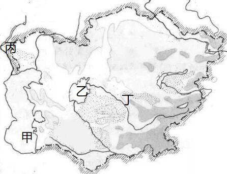
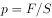

# 2019年国家公务员录用考试《行测》题（副省级网友回忆版）

> 常识判断 · 17 题 · 国考 2019

## 第 1 题　qid 2264318 · 人文常识

下列与扶贫有关的说法正确的是：

- **A**. 习近平总书记首次提出了“精准扶贫”的理念　✅
- **B**. 扶贫工作坚持扶贫同扶志相结合，“大水漫灌”与“精准滴灌”相结合
- **C**. 全面发展高新技术产业是《“十三五”脱贫攻坚规划》提出的一项重要举措
- **D**. 脱贫目标是到2035年稳定实现现行标准下农村贫困人口“两不愁、三保障”

**答案**：A

**官方解析**

本题考查政治常识。
A项正确，2013年11月，习近平总书记到湖南湘西考察时首次提出了“精准扶贫”的重要思想。
B项错误，党的十九大报告指出：“坚持大扶贫格局，注重扶贫同扶志、扶智相结合。”因此选项前半句表述正确。《“十三五”脱贫攻坚规划》中指出：“坚持精准扶贫、精准脱贫。”“变‘大水漫灌’为‘精准滴灌’，做到真扶贫、扶真贫、真脱贫。”因此“大水漫灌”与“精准滴灌”相结合表述错误。
C项错误，《“十三五”脱贫攻坚规划》中关于脱贫的路径包括产业发展脱贫、转移就业脱贫、易地搬迁脱贫、教育扶贫、健康扶贫、生态保护扶贫、兜底保障以及社会扶贫等8大路径，在产业发展脱贫中包括农林产业、旅游、电商、资产收益、科技等扶贫项目，没有提及全面发展高新技术产业。
D项错误，《“十三五”脱贫攻坚规划》中第三节脱贫目标提出：“到2020年，稳定实现现行标准下农村贫困人口不愁吃、不愁穿，义务教育、基本医疗、住房安全有保障（即‘两不愁、三保障’）。”
故正确答案为A。

---

## 第 2 题　qid 2264443 · 法律常识

2018年3月11日，十三届全国人大一次会议通过了《中华人民共和国宪法修正案》。下列与之相关的说法不准确的是：

- **A**. 这是我国1982年宪法公布施行以来对部分内容作的第五次修改
- **B**. 确立了监察委员会作为国家的监察机关的宪法地位
- **C**. 将全国人民代表大会法律委员会更名为全国人民代表大会宪法委员会　✅
- **D**. 将习近平新时代中国特色社会主义思想写入宪法

**答案**：C

**官方解析**

本题考查法律常识。
A项正确，我国于1988年、1993年、1999年、2004年和2018年对1982年现行《宪法》进行了五次修改，2018年3月11日，十三届全国人民代表大会第一次会议通过了《中华人民共和国宪法修正案》，这也是对1982年宪法部分内容作的第五次修改。
B项正确，《中华人民共和国宪法修正案》第五十二条规定：“宪法第三章‘国家机构’中增加一节，作为第七节‘监察委员会’；增加五条，分别作为第一百二十三条至第一百二十七条。”《宪法》第一百二十三条规定：“中华人民共和国各级监察委员会是国家的监察机关。”因此，该次宪法修正案确立了监察委员会作为国家的监察机关的宪法地位。
C项错误，《中华人民共和国宪法修正案》第四十四条第二款规定：“宪法第七十条第一款中‘全国人民代表大会设立民族委员会、法律委员会、财政经济委员会、教育科学文化卫生委员会、外事委员会、华侨委员会和其他需要设立的专门委员会。’修改为：‘全国人民代表大会设立民族委员会、宪法和法律委员会、财政经济委员会、教育科学文化卫生委员会、外事委员会、华侨委员会和其他需要设立的专门委员会。’”因此，该次修正案将全国人民代表大会法律委员会更名为全国人民代表大会宪法和法律委员会。
D项正确，《中华人民共和国宪法修正案》第三十二条规定，宪法序言第七自然段中“在马克思列宁主义、毛泽东思想、邓小平理论和‘三个代表’重要思想指引下”修改为“在马克思列宁主义、毛泽东思想、邓小平理论、‘三个代表’重要思想、科学发展观、习近平新时代中国特色社会主义思想指引下”。 因此，该次宪法修正案将习近平新时代中国特色社会主义思想写入宪法。
本题为选非题，故正确答案为C。

---

## 第 3 题　qid 2264321 · 人文常识

下列与我国军事国防相关的说法错误的是：

- **A**. 大力发展军民融合是维护国家主权和安全的战略基石　✅
- **B**. 新形势下我军的军事战略方针是积极防御
- **C**. 中国位于海洋地缘战略区和欧亚大陆地缘战略区的交接处
- **D**. 维护地区和世界和平是我国军队担负的主要战略任务之一

**答案**：A

**官方解析**

本题考查政治常识。
A项错误，2015年国防白皮书《中国的军事战略》指出：“核力量是维护国家主权和安全的战略基石。中国始终奉行不首先使用核武器的政策，坚持自卫防御的核战略，无条件不对无核武器国家和无核武器区使用或威胁使用核武器，不与任何国家进行核军备竞赛，核力量始终维持在维护国家安全需要的最低水平。” 
B项正确，2015年国防白皮书《中国的军事战略》指出：“积极防御战略思想是中国共产党军事战略思想的基本点。”“根据国家安全和发展战略，适应新的历史时期形势任务要求，坚持实行积极防御军事战略方针，与时俱进加强军事战略指导，进一步拓宽战略视野、更新战略思维、前移指导重心，整体运筹备战与止战、维权与维稳、威慑与实战、战争行动与和平时期军事力量运用，注重深远经略，塑造有利态势，综合管控危机，坚决遏制和打赢战争。”
C项正确，中国位于世界两大地缘战略区的交接处，既受其他大国关系的影响，又影响其他大国关系。目前，世界可划分为两大地缘战略区，即海洋地缘战略区和欧亚大陆地缘战略区。美国属于海洋地缘战略区，而且是世界超级海洋强国，具有全球性影响。世界上其他强国大都集中在欧亚大陆地缘战略区，俄罗斯则位于该战略区的心脏地带。中国属于欧亚大陆地缘战略区，背靠欧亚大陆，面向太平洋，处于两大战略区的交接处，历史上曾遭到两大战略区强国的侵略和压迫，现在则成为能够对两大战略区关系产生重要影响和作用的国家。
D项正确， 2015年国防白皮书《中国的军事战略》指出：“中国军队主要担负以下战略任务：应对各种突发事件和军事威胁，有效维护国家领土、领空、领海主权和安全；坚决捍卫祖国统一；维护新型领域安全和利益；维护海外利益安全；保持战略威慑，组织核反击行动；参加地区和国际安全合作，维护地区和世界和平；加强反渗透、反分裂、反恐怖斗争，维护国家政治安全和社会稳定；担负抢险救灾、维护权益、安保警戒和支援国家经济社会建设等任务。”
本题为选非题，故正确答案为A。

---

## 第 4 题　qid 2264444 · 人文常识

关于农村土地流转，下列说法错误的是：

- **A**. 坚持依法、自愿、有偿的基本原则
- **B**. 鼓励农户依法采取转包、出租、互换等方式流转承包地
- **C**. 没有农户的书面委托，农村基层组织无权以任何方式决定流转农户的承包地
- **D**. 各地要鼓励工商企业租赁农户承包地，不应在时间、面积上设限　✅

**答案**：D

**官方解析**

本题考查政治常识。
A项正确，《关于引导农村土地经营权有序流转发展农业适度规模经营的意见》在“基本原则”部分指出：“坚持依法、自愿、有偿，以农民为主体，政府扶持引导，市场配置资源，土地经营权流转不得违背承包农户意愿、不得损害农民权益、不得改变土地用途、不得破坏农业综合生产能力和农业生态环境。”
B项正确，《关于引导农村土地经营权有序流转发展农业适度规模经营的意见》在“鼓励创新土地流转形式”部分指出：“鼓励承包农户依法采取转包、出租、互换、转让及入股等方式流转承包地。”
C项正确，《关于引导农村土地经营权有序流转发展农业适度规模经营的意见》在“严格规范土地流转行为”部分指出：“没有农户的书面委托，农村基层组织无权以任何方式决定流转农户的承包地，更不能以少数服从多数的名义，将整村整组农户承包地集中对外招商经营。”
D项错误，《关于引导农村土地经营权有序流转发展农业适度规模经营的意见》在“加强对工商企业租赁农户承包地的监管和风险防范”部分指出：“各地对工商企业长时间、大面积租赁农户承包地要有明确的上限控制，建立健全资格审查、项目审核、风险保障金制度，对租地条件、经营范围和违规处罚等作出规定。”
本题为选非题，故正确答案为D。

---

## 第 5 题　qid 2264317 · 经济常识

有关经济学常识，下列说法错误的是：

- **A**. 国民收入统计中包括退休金　✅
- **B**. 货币发行是中央银行的负债业务
- **C**. 公共物品无法通过市场机制来调节供求
- **D**. 春节前后的物价上涨不属于通货膨胀

**答案**：A

**官方解析**

本题考查经济常识。
A项错误，国民收入是指物质生产部门劳动者在一定时期所创造的价值，是一国生产要素（包括土地、劳动、资本、企业家才能等）所有者在一定时期内提供生产要素所得的报酬，即工资、利息、租金和利润等的总和。退休人员的退休金在经济中属于政府转移支付的范畴，属于政府支出，不属于国民收入。
B项正确，中央银行负债业务主要包括存款业务、货币发行业务、经理国库业务、对外负债和资本业务。
C项正确，公共物品是“私人物品” 的对称，具有非竞争性和非排他性。如果公共物品由市场进行调节，由于市场调节具有自发性、盲目性和滞后性等缺点，会导致资源配置效率低下、社会不稳定等后果，因此公共物品不能由私营部门通过市场提供而必须由公共部门以非市场方式提供。
D项正确，通货膨胀指市场上流通的货币量超过实际所需的货币量，导致货币贬值，而引起的一段时间内物价持续而普遍地上涨现象。春节期间由于短时间内的商品需求增加从而导致物价上涨，不属于通货膨胀。
本题为选非题，故正确答案为A。

---

## 第 6 题　qid 2264445 · 人文常识

图中所示的是“一带一路”沿线的中亚地区，下列说法正确的是：

- **A**. 甲湖在成因上属于构造湖
- **B**. 乙湖是世界陆地的最低处
- **C**. 丙河处于亚欧两洲分界线上
- **D**. 丁河水源是由冰雪融水供给　✅

**答案**：D

**官方解析**

本题考查地理常识。
A项错误，湖泊按照成因类型，可划分为构造湖、火口湖、堰塞湖、海迹湖、河成湖、冰川湖等。构造湖是指由地壳的构造运动(断裂、断层、地堑)所造成的洼陷，积水而成的湖，特点是湖泊的形状狭长，湖岸平直、湖坡陡峻，深度较大，如我国的青海湖、滇池、洱海等，此外还有亚洲的贝加尔湖、东非大裂谷中的一连串湖泊等。甲湖是里海，从形成原因来看，里海曾是古地中海的一部分，经过海陆演变，古地中海逐渐缩小，最后形成的湖泊，因此在成因上属于海迹湖。杭州西湖、太湖等均为海迹湖。
B项错误，世界陆地的最低处位于死海。乙湖是咸海。
C项错误，丙河是伏尔加河，处于亚欧两洲分界线上的是乌拉尔河和里海。
D项正确，丁河是锡尔河，发源于天山山脉，水源主要是由冰雪融水供给。
故正确答案为D。

---

## 第 7 题　qid 2264446 · 人文常识

关于儒释道三教异同，古人多有争论。对此，唐代僧人宗密曾在《圆觉经略疏钞》中说：“古来诸德皆判：儒宗      ，道宗      ，释宗      。”依次填入画横线部分最恰当的一项是：

- **A**. 齐物；中庸；正名
- **B**. 四谛；五行；三纲
- **C**. 五常；自然；因缘　✅
- **D**. 兼爱；良知；涅槃

**答案**：C

**官方解析**

本题主要考查人文常识。
A项错误，“齐物”一说来自《庄子》，庄子认为世界万物包括人的品性和感情，看起来是千差万别，归根结底却又是齐一的，这就是“齐物”。属于道家思想；“中庸”是儒家的道德标准，孔子认为，任何事情都有一个适当的标准，即“中”，既不过分也非不够，善于运用“中”这一标准，在后来即发展为“中庸”思想；春秋时期，礼坏乐崩，社会秩序混乱。子路对孔子说:“卫国国君要您去治理国家,您打算先从哪些事情做起呢？”孔子说：“必也正名乎？”先要从匡正社会等级名分入手，理由是：“名不正则言不顺，言不顺则事不成，事不成则礼乐不兴，礼乐不兴则刑罚不中，刑罚不中则民无所措手足。”“正名”属于儒家思想。
B项错误，“四谛”是佛教基本教义之一，指苦、集、灭、道四谛；“五行”是我国古代朴素唯物主义哲学的重要范畴，指水、火、木、金、土五种物质。关于五行较早的资料主要保存在《左传》、《国语》和《尚书·洪范》等书中。五行思想被道家、阴阳家、儒家等哲学派别和自然科学家（如中医）所运用。后来，五行被逐步神秘化，阴阳家用其解释社会的兴衰和王朝的更替，提出“五德终始”的历史循环论。西汉新儒学代表董仲舒赋予五行情感和道德属性，用以论证天人感应的神学目的论。北宋新儒学代表周敦颐把五行作为无极产生万物的一个环节，纳入客观唯心主义体系之中；三纲五常（纲常）是中国儒家伦理文化中的重要思想，儒教通过三纲五常的教化来维护社会的伦理道德、政治制度，在漫长的封建社会中起到了极为重要的作用。其中“三纲”即“君为臣纲”、“父为子纲”、“夫为妻纲”。
C项正确，宗密《圆觉经略疏钞》卷四曰：“古来诸德皆判：儒宗五常，道宗自然，释宗因缘也。”“五常”即仁、义、礼、智、信，是中国儒家伦理文化中的重要思想；《道德经》第二十五章有一句名言，曰：“人法地，地法天，天法道，道法自然”。“道法自然”是道家的核心思想；“因缘”是佛学术语。因缘，为“因”与“缘”之并称。因，指引生结果之直接内在原因；缘，指由外来相助之间接原因。简言之，即产生结果的一切原因总称为因缘。
D项错误。“兼爱”是墨家学派创始人墨子提倡的一种伦理学说，他针对儒家“爱有等差”的说法，主张爱无差别等级,不分厚薄亲疏；“致良知”是中国明代王守仁的心学主旨。语出《孟子·尽心上》：“ 人之所不学而能者，其良能也，所不虑而知者，其良知也。”“涅槃”是佛教用语，“涅槃”的意思是不生不灭、超离生死烦恼、安住永恒快乐的境界，“涅槃”是佛教修行所达到的最高理想境界。
故正确答案为C。

---

## 第 8 题　qid 2264322 · 人文常识

关于文学作品中的典故，下列解释错误的是：

- **A**. “蓬山此去无多路，青鸟殷勤为探看”中的“青鸟”指的是信使
- **B**. “相顾无相识，长歌怀采薇”中的“采薇”指的是建功立业的抱负　✅
- **C**. “劳歌一曲解行舟，红叶青山水急流”中的“劳歌”指的是送别歌曲
- **D**. “忆君初得昆山玉，同向扬州携手行”中的“昆山玉”指的是杰出人才

**答案**：B

**官方解析**

本题考查人文常识。
A项正确，“蓬山此去无多路，青鸟殷勤为探看”出自唐代李商隐的《无题·相见时难别亦难》，此句诗的意思是：“对方的住处就在不远的蓬莱山，却无路可通。希望有青鸟一样的使者殷勤地为我去探看情人。”“青鸟”指的是神话中为西王母传递音讯的信使。
B项错误，“相顾无相识，长歌怀采薇”出自唐代王绩的《野望》。此句诗的意思是“大家彼此互不相识相对无言，我长啸高歌真想隐居在山冈！ ”“薇”是一种植物，相传周武王灭商后 ，伯夷、叔齐不愿做周的臣子，在首阳山上采薇而食，最后饿死。后以“采薇”代指隐居生活，而不是建功立业的抱负。
C项正确，“劳歌一曲解行舟，红叶青山水急流”出自唐代许浑的《谢亭送别》。“劳歌”典出《文选·谢混〈游西池〉诗》：“悟彼蟋蟀唱，信此劳者歌。”劳歌本为古时劳作者有所感发，相从而作的歌。后以此典形容奔波辛劳；也形容思友、送友等歌。本题中即为送别友人歌曲。
D项正确，“忆君初得昆山玉，同向扬州携手行”出自唐代刘禹锡的《送李中丞赴楚州》。“昆山玉”典出《晋书·卷五十二·郄诜传》：武帝于东堂会送，晋郄诜对策第一，以昆山片玉自比。后世以“昆山玉”比喻优秀的人才，也借以咏科举登第。本句讲的是刘禹锡回想李中丞科举登第后，携手下扬州。
本题为选非题，故正确答案为B。

---

## 第 9 题　qid 2264447 · 人文常识

下列宫殿的名称与典籍不直接相关的是：

- **A**. 两仪殿——《周易》
- **B**. 明德殿——《大学》
- **C**. 关雎宫——《诗经》
- **D**. 坤宁宫——《论语》　✅

**答案**：D

**官方解析**

本题考查人文常识。
A项正确，《易传·系辞上传》中有：“易有太极，是生两仪，两仪生四象，四象生八卦，八卦定吉凶，吉凶生大业”，因此，两仪殿与《周易》直接相关。
B项正确，《大学》中有：“大学之道，在明明德，在亲民，在止于至善。”因此，明德殿与《大学》直接相关。
C项正确，《诗经》中有：“关关雎鸠，在河之洲，窈窕淑女，君子好逑。”因此，关雎宫与《诗经》直接相关。
D项错误，老子《道德经》中有：“昔之得一者，天得一以清；地得一以宁；神得一以灵；谷得一以盈，万物得一以生；侯王得一而以为正”。古代封建社会皇帝是天，皇后是地，皇帝是乾，皇后是坤，皇帝寝宫依据前述《道德经》的原文取名乾清宫，皇后寝宫则取名为坤宁宫。因此，坤宁宫与《论语》没有直接关系。
本题为选非题，故正确答案为D。

---

## 第 10 题　qid 2264448 · 人文常识

下面能正确反映我国农业生产工具或生产方式演变顺序的是：
①曲辕犁  ②水车  ③石斧  ④牛耕  ⑤铜铲

- **A**. ③⑤④②①　✅
- **B**. ③④①⑤②
- **C**. ④②⑤①③
- **D**. ④①③②⑤

**答案**：A

**官方解析**

本题主要考查人文常识。
①曲辕犁是唐代出现的一种新式犁。唐以前，主要使用笨重的长直辕犁，回转困难，耕地费力。在敦煌莫高窟第四百四十五窟的唐代壁画中有曲辕犁耕作图。据唐朝末年著名文学家陆龟蒙《耒耜经》记载， 曲辕犁由十一个部件组成。这种犁操作轻巧简便，深浅自如，又适应各种土壤耕作，对劳动生产率的提高和对耕地质量的提高都起了重大的作用。自此以后，我国的耕犁可以说是基本定型了，并一直延用到今天。
②水车是一种古老的提水灌溉工具。东汉灵帝时宦官毕岚创造翻车，供洒道之用，三国时经机械制造家马钧改进，用于农业排灌。
③石斧是石器时代（380万年以前至公元前2000年左右）就已广泛制造使用，是具有多种用途的石质工具，既能用来砍伐和捕猎，也能用来搏斗杀敌。
④春秋战国时期，我国开始用牛犁耕并逐渐推广。牛耕的运用，是我国农业技术史上农用动力的一次革命。
⑤我国夏商时期就已出现青铜农具。铜铲在《诗经》和其他古书里另有钱、镈(音博)、臿(音插)、铫(音摇)等名称，大致相当于现在的锹。
所以，正确反映我国农业生产工具或生产方式演变顺序的是③⑤④②①。
故正确答案为A。

---

## 第 11 题　qid 2264449 · 人文常识

在日常生活中，我们经常根据不同的需求去增大或减小压强，下列哪种做法对于压强的改变与其他三项不同？

- **A**. 挖掘机上装有履带
- **B**. 沙发被设计得很柔软
- **C**. 破窗锤锤头被设计成锥形　✅
- **D**. 滑雪板比较宽大

**答案**：C

**官方解析**

本题考查科技常识。压强指物体所受的压力与受力面积之比，其计算公式是：。据此公式可知，在所受压力F不变的情况下，压强与受力面积成反比。

A项，挖掘机上装上履带后，相比于之前的轮子，增大的与地面的接触面积（即受力面积）。在压力一定时，增大受力面积，可减小压强。

B项，沙发设计的很柔软，人们坐到沙发上时会“陷”下去，身体与沙发充分接触，即增大了受力面积，减小了压强，所以人体会很舒服。

C项，用破窗锤锥形尖头破窗时，锤头与玻璃的接触面积仅为锥形的尖部，与普通锤头相比，减小了受力面积，增大了压强，因此很容易破窗。

D项，用滑雪板滑雪，由于滑雪板宽大，增大了受力面积，减小了压强，避免在滑雪时陷入雪中。

综上，可知A、B、D三项原理相同，均是减小了压强，C项是增大了压强。

本题为选非题，故正确答案为C。

---

## 第 12 题　qid 2264450 · 科技常识

关于生物，下列说法错误的是：

- **A**. 酸菜和腐乳的制作过程中都离不开乳酸菌的发酵　✅
- **B**. 病毒只能寄生在活细胞中进行生命活动
- **C**. 细菌有完整的能量代谢系统，可以独立地生长繁殖
- **D**. 木耳是真菌的一种，常生长在阴湿、腐朽的树干上

**答案**：A

**官方解析**

A项错误，制作酸菜过程要用到乳酸菌，在无氧的条件下，乳酸菌发酵产生乳酸，使得酸菜具有特殊的风味；而腐乳的主要生产工序分为前期发酵和后期发酵，前期发酵使得豆腐上开始生长毛霉，前期发酵的作用，一是使豆腐表面有一层菌膜包住；二是毛霉分泌以蛋白酶为主的各种酶，有利于豆腐所含有的蛋白质水解为各种氨基酸。后期发酵通过腌制并配入各种辅料，促进其他生化反应，生成腐乳的香气。故在腐乳的制作过程没有乳酸菌的参与。
B项正确，病毒没有细胞结构，不能独立生活，它具有高度的寄生性，必须依赖宿主细胞的能量和代谢系统，获取生命活动所需的物质和能量。因此，病毒只能寄生在活细胞中进行生命活动。
C项正确，细菌是一种具有细胞壁的单细胞微生物。细胞是生命活动的单位，一些生命活动的基本过程，如物质代谢、能量转换、运动、发育、繁殖和遗传等，都是以细胞为结构基础来实现的。能进行能量转换是因细胞具有完整的能量代谢系统。细菌作为细胞生物，因而具有完整的能量代谢系统。
D项正确，木耳是木耳科木耳属的一种真菌，属于真核生物，有完整的细胞核，主要靠菌丝体分解吸收现成的营养物质。木耳寄生于阴湿、腐朽的树干上，单生或群生。
本题为选非题，故正确答案为A。

---

## 第 13 题　qid 2264451 · 人文常识

关于照明用品，下列说法错误的是：

- **A**. 手术室里的无影灯利用了光沿直线传播的原理
- **B**. 手电筒用凹面镜作反射面是为了增强照明效果
- **C**. 声控灯利用麦克风接收声音信号来实现灯的开启
- **D**. 家用台灯正常工作时流过灯丝的电流约为2安培　✅

**答案**：D

**官方解析**

本题考查科技常识。

A项正确，由于光是沿直线传播的，所以当发光体（非点光源）所发出光线被非透明物体阻挡后，会在屏幕（或其他物体）上形成影子，该影子由两部分构成，其中影子中部特别黑暗的部分叫本影，四周灰暗的部分叫半影。发光物体的面积越大，本影就越小。手术中用到的无影灯就是根据这个原理制成的，无影灯是将若干个发光强度很大的灯在灯盘上排成球冠状形，形成的一个区域较大的光源，光从不同角度把光线照到手术台上，这样就能消除施手术者的头、手和器械均可能对手术部位造成的干扰阴影。

B项正确，凹面镜是球面镜的一种，反射面凹进去，能将平行的光反射后聚在镜面前的一点上，这点叫焦点。如果光源在焦点上，所发出的光经反射后就形成平行的光束。手电筒的光源就在焦点上，这样就使发出的光线经凹面镜反射后成为平行于主轴的平行光，从而增强了照明效果。

C项正确，声控灯是一种声控电子照明装置，由音频放大器、选频电路、延时开启电路和可控硅电路组成。声控灯接收声音信号用的是小话筒（也叫麦克风），话筒将声音信号转换成电信号，经整流，再去触发可控硅，实现电灯的开启。经过约一分钟的延时后，再去掉触发信号，可控硅就自动关断了，灯也就熄灭了。 

D项错误，台灯是人们生活中用来照明的一种家用电器，台灯的光亮照射范围相对比较小和集中，作用局限在台灯周围，便于阅读、学习、工作、节省能源。所以家用台灯的功率不会很高，一般都在几瓦到一百瓦之间。按照选项给出的2A电流，根据（家庭电压为220V），换算出的功率是440W，这已经相当高了，不仅不利于保护眼睛，更与设计台灯的初衷相违背，所以家庭台灯正常工作时流过灯丝的电流大约在0.2A到0.5A之间，不可能是2A。

本题为选非题，故正确答案为D。

---

## 第 14 题　qid 2264452 · 人文常识

下表列出了分布在我国的几种土壤的特质，填入表格最合适的是：

- **A**. ①紫色土  ②热带     ③玉米，苹果
- **B**. ①黑土     ②暖温带  ③甘蔗，油菜　✅
- **C**. ①黑土     ②中温带  ③小麦，茶叶
- **D**. ①紫色土 ②亚热带  ③水稻，荔枝

**答案**：B

**官方解析**

本题考查地理国情。
①紫色土是指亚热带、热带湿润地区紫色砂页岩风化物上发育的一种母质特征明显的土壤，我国主要分布在四川盆地等地区，土壤肥力较高，主要经济作物为油菜、棉花。黑土是指温暖半湿润地区发育的富含腐殖质和植物营养元素的黑色土壤，在我国主要分布于黑龙江、吉林两省，土壤肥力高。根据题目表格，位于中温带土壤肥力高且适合种植大豆、甜菜的，应当是黑土。
②温带又可分为寒温带、中温带、暖温带。我国的黄土主要分布于黄土高原地区。黄土高原大部分位于暖温带，故此处应选暖温带。黄土是一种并不非常肥沃的土壤，由很细的粘土和被风吹来的淤积颗粒所组成，其主要的经济作物为棉花、花生。
③红土是在亚热带湿热气候条件下由碳酸盐类或硅酸盐类岩石风化形成，一般呈褐红色，是一种具有高含水率、低密度、较高强度和较低压缩性的土。主要分布在我国长江以南地区，主要经济作物为甘蔗、油菜、茶树等。
故①为黑土，②为暖温带，③为甘蔗、油菜。
故正确答案为B。

---

## 第 15 题　qid 2264453 · 人文常识

摄影师在野外环境中最不可能拍摄到的是：

- **A**. 在云南丽江拍摄成片的针叶林
- **B**. 在青海拍摄成群的藏羚羊
- **C**. 在阿拉伯半岛拍摄海豹　✅
- **D**. 在冰岛拍摄火山喷发

**答案**：C

**官方解析**

本题考查地理国情。
A项正确，针叶林主要由云杉、冷杉、落叶松和松树等一些耐寒树种组成，主要分布于寒温带及中、低纬度亚高山地区的常绿或落叶针叶林。丽江市属低纬亚高山地区，此处分布有丽江云杉等植被，组成单纯林或与其他针叶树组成混交林。因此有可能在丽江拍摄成片的针叶林。
B项正确，藏羚羊栖息于海拔3700-5500米的高山草原、草甸和高寒荒漠地带，为中国一级保护动物，主要分布于中国以羌塘为中心的青藏高原地区（青海、西藏、新疆）。因此有可能在青海拍摄成群的藏羚羊。
C项错误，海豹主要生活在寒温带海洋中。南极海豹数量最多，其次是北冰洋、北大西洋、北太平洋等地。而阿拉伯半岛常年受副高及信风带控制，非常干燥，几乎整个半岛都是热带沙漠气候区并有面积较大的无流区。因此最不可能在阿拉伯半岛拍摄海豹。
D项正确，冰岛型火山喷发，裂隙式喷发。因现仅能在冰岛观察到这种火山喷发，故叫冰岛型火山喷发。其特征是大量喷出易流动的玄武岩质熔岩，形成表面较平坦的熔岩台地。因此有可能在冰岛拍摄火山喷发。
本题为选非题，故正确答案为C。

---

## 第 16 题　qid 2264455 · 科技常识

下列关于激光的表述错误的是：

- **A**. 条码扫描器可以利用红外线或者激光进行扫描
- **B**. CD唱片利用激光束扫描，通过光电转换重现语言和音乐
- **C**. 眼科医生常使用激光技术进行近视矫正手术
- **D**. 激光武器可全天候作战，不受大雾、大雪等天气的影响　✅

**答案**：D

**官方解析**

本题考查科学常识。
A项正确，条码扫描器可以利用红外线或者激光进行扫描。其中，红外线条码扫描的原理是利用扫描器发射红外线光源，然后根据反射的结果，利用芯片来译码，最后再返回条形码所代表的正确字符；而激光条码扫描的原理是通过一个激光二极管发出一束光线，照射到一个旋转的棱镜或来回摆动的镜子上，反射后的光线穿过阅读窗照射到条码表面，光线经过条或空的反射后返回阅读器，由一个镜子进行采集、聚焦，通过光电转换器转换成电信号，该信号将通过扫描器或终端上的译码软件进行译码。
B项正确，激光唱片简称“CD”，利用激光束扫描，通过光电转换，重现语言和音乐的唱片。其片基为透明的聚氯乙烯或透明的聚碳酸酯，信号面上刻有很多存储信号的凹坑，并涂有铝质反射层和保护漆。当放唱时，激光束对信号面进行扫描，遇到凹点，光线就发生散射，遇到高出凹点的表面，光线就被反射回来，这样就产生了时断时续的反射。放音部分接收到这种反射信号，重新把它们变成原来形式的电脉冲，再把电脉冲变成声音重放出来。
C项正确，激光作用于生物机体时，它能被吸收转化成热能，几秒钟内温度可高达数百至上千度，同时可产生很强的光压。这种机械作用与热效应一起，能使激光成为一把锐利的“光刀”，采用激光刀进行手术，切口出血少，不易感染；切割骨骼速度快，切口平滑，在近视矫正、肿瘤切除等手术有着广泛应用。
D项错误，激光武器是用高能的激光对远距离的目标进行精确射击或用于防御导弹等的武器，具有快速、灵活、精确和抗电磁干扰等优异性能，在光电对抗、防空和战略防御中可发挥独特作用。激光武器的缺点是不能全天候作战，受限于大雾、大雪、大雨，且激光发射系统属精密光学系统，也受大气影响严重，如大气对能量的吸收、大气扰动引起的能量衰减、热晕效应、湍流以及光束抖动引起的衰减等。
本题为选非题，故正确答案为D。

---

## 第 17 题　qid 2264329 · 人文常识

某人扁桃体化脓，医生建议其静脉注射头孢，药液从其手背静脉到达扁桃体患处所经过的途径是：上肢静脉→右心房→①→②→左心房→③→④→动脉→扁桃体毛细血管（患处）。依次填入①②③④正确的是：

- **A**. 肺循环；右心室；左心室；主动脉
- **B**. 左心室；肺循环；主动脉；右心室
- **C**. 主动脉；右心室；左心室；肺循环
- **D**. 右心室；肺循环；左心室；主动脉　✅

**答案**：D

**官方解析**

本题考查生物常识。

人体内血液循环分为两大部分，体循环和肺循环。体循环是指血液由左心室进入主动脉，再流经全身的各级动脉、毛细血管网，各级静脉，最后汇集到上、下腔静脉，流回右心房的循环途径。

肺循环是指血液由右心室进入肺动脉，流经肺部的毛细血管网，再由肺静脉流入左心房的循环途径。体循环和肺循环同时进行，并且在心脏处汇合在一起，组成一条完整的循环途径。

本题中药物从上肢静脉随血液流入，进入右心房，然后到右心室，经过肺循环进入左心房，再到左心室进入体循环，经过主动脉，各级动脉，最后到达扁桃体毛细血管（患处）。具体途径见下图：

故正确答案为D。

---
