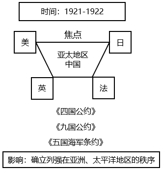

# 2019年国家公务员录用考试《行测》题（地市级网友回忆版）

> 常识判断 · 17 题 · 国考 2019

## 第 1 题　qid 2264318 · 人文常识

下列与扶贫有关的说法正确的是：

- **A**. 习近平总书记首次提出了“精准扶贫”的理念　✅
- **B**. 扶贫工作坚持扶贫同扶志相结合，“大水漫灌”与“精准滴灌”相结合
- **C**. 全面发展高新技术产业是《“十三五”脱贫攻坚规划》提出的一项重要举措
- **D**. 脱贫目标是到2035年稳定实现现行标准下农村贫困人口“两不愁、三保障”

**答案**：A

**官方解析**

本题考查政治常识。
A项正确，2013年11月，习近平总书记到湖南湘西考察时首次提出了“精准扶贫”的重要思想。
B项错误，党的十九大报告指出：“坚持大扶贫格局，注重扶贫同扶志、扶智相结合。”因此选项前半句表述正确。《“十三五”脱贫攻坚规划》中指出：“坚持精准扶贫、精准脱贫。”“变‘大水漫灌’为‘精准滴灌’，做到真扶贫、扶真贫、真脱贫。”因此“大水漫灌”与“精准滴灌”相结合表述错误。
C项错误，《“十三五”脱贫攻坚规划》中关于脱贫的路径包括产业发展脱贫、转移就业脱贫、易地搬迁脱贫、教育扶贫、健康扶贫、生态保护扶贫、兜底保障以及社会扶贫等8大路径，在产业发展脱贫中包括农林产业、旅游、电商、资产收益、科技等扶贫项目，没有提及全面发展高新技术产业。
D项错误，《“十三五”脱贫攻坚规划》中第三节脱贫目标提出：“到2020年，稳定实现现行标准下农村贫困人口不愁吃、不愁穿，义务教育、基本医疗、住房安全有保障（即‘两不愁、三保障’）。”
故正确答案为A。

---

## 第 2 题　qid 2264319 · 法律常识

根据我国宪法和有关法律，下列国家机关的哪一做法不符合规定？

- **A**. 某市监察委员会决定对涉嫌行贿的某公司法定代表人实行留置
- **B**. 某自治州人民代表大会常务委员会制定城市环境管理的地方性法规
- **C**. 某县人民法院执行民事案件时要求被执行人提供手机微信记录　✅
- **D**. 中国证券监督管理委员会依法制定有关上市公司的监管规章

**答案**：C

**官方解析**

本题考查法律常识。
A项正确，根据《监察法》第二十二条第一、二款规定：“被调查人涉嫌贪污贿赂、失职渎职等严重职务违法或者职务犯罪，监察机关已经掌握其部分违法犯罪事实及证据，仍有重要问题需要进一步调查，并有下列情形之一的，经监察机关依法审批，可以将其留置在特定场所：（一）涉及案情重大、复杂的；（二）可能逃跑、自杀的；（三）可能串供或者伪造、隐匿、毁灭证据的；（四）可能有其他妨碍调查行为的。对涉嫌行贿犯罪或者共同职务犯罪的涉案人员，监察机关可以依照前款规定采取留置措施。”因此，某市监察委员会决定对涉嫌行贿的某公司法定代表人实行留置符合法律规定。
B项正确，根据《立法法》第七十二条第五款规定：“自治州的人民代表大会及其常务委员会可以依照本条第二款规定行使设区的市制定地方性法规的职权。”《立法法》第七十二条第二款规定：“设区的市的人民代表大会及其常务委员会根据本市的具体情况和实际需要，在不同宪法、法律、行政法规和本省、自治区的地方性法规相抵触的前提下，可以对城乡建设与管理、环境保护、历史文化保护等方面的事项制定地方性法规，法律对设区的市制定地方性法规的事项另有规定的，从其规定。”因此，某自治州人大常委会有权制定城市环境管理方面的地方性法规。
C项错误，根据《宪法》第四十条规定：“中华人民共和国公民的通信自由和通信秘密受法律的保护。除因国家安全或者追查刑事犯罪的需要，由公安机关或者检察机关依照法律规定的程序对通信进行检查外，任何组织或者个人不得以任何理由侵犯公民的通信自由和通信秘密。”微信记录属于公民的通信秘密，某县人民法院执行民事案件时无权要求被执行人提供手机微信记录。
D项正确，《证券法》第一百六十九条规定：“国务院证券监督管理机构在对证券市场实施监督管理中履行下列职责：（一）依法制定有关证券市场监督管理的规章、规则，并依法进行审批、核准、注册，办理备案······”中国证券监督管理委员会（证监会）是国务院证券监督管理机构，有权依法制定有关上市公司的监管规章。
本题为选非题，故正确答案为C。
【注】本题A项所涉《中华人民共和国监察法》于2024年12月修改，解析中的第22条第一、二款在新法中为第24条第一、二款；B项《中华人民共和国立法法》于2023年3月修改，解析中的第72条第二款、第五款在新法中是第81条第二款、第五款。

---

## 第 3 题　qid 2264321 · 人文常识

下列与我国军事国防相关的说法错误的是：

- **A**. 大力发展军民融合是维护国家主权和安全的战略基石　✅
- **B**. 新形势下我军的军事战略方针是积极防御
- **C**. 中国位于海洋地缘战略区和欧亚大陆地缘战略区的交接处
- **D**. 维护地区和世界和平是我国军队担负的主要战略任务之一

**答案**：A

**官方解析**

本题考查政治常识。
A项错误，2015年国防白皮书《中国的军事战略》指出：“核力量是维护国家主权和安全的战略基石。中国始终奉行不首先使用核武器的政策，坚持自卫防御的核战略，无条件不对无核武器国家和无核武器区使用或威胁使用核武器，不与任何国家进行核军备竞赛，核力量始终维持在维护国家安全需要的最低水平。” 
B项正确，2015年国防白皮书《中国的军事战略》指出：“积极防御战略思想是中国共产党军事战略思想的基本点。”“根据国家安全和发展战略，适应新的历史时期形势任务要求，坚持实行积极防御军事战略方针，与时俱进加强军事战略指导，进一步拓宽战略视野、更新战略思维、前移指导重心，整体运筹备战与止战、维权与维稳、威慑与实战、战争行动与和平时期军事力量运用，注重深远经略，塑造有利态势，综合管控危机，坚决遏制和打赢战争。”
C项正确，中国位于世界两大地缘战略区的交接处，既受其他大国关系的影响，又影响其他大国关系。目前，世界可划分为两大地缘战略区，即海洋地缘战略区和欧亚大陆地缘战略区。美国属于海洋地缘战略区，而且是世界超级海洋强国，具有全球性影响。世界上其他强国大都集中在欧亚大陆地缘战略区，俄罗斯则位于该战略区的心脏地带。中国属于欧亚大陆地缘战略区，背靠欧亚大陆，面向太平洋，处于两大战略区的交接处，历史上曾遭到两大战略区强国的侵略和压迫，现在则成为能够对两大战略区关系产生重要影响和作用的国家。
D项正确， 2015年国防白皮书《中国的军事战略》指出：“中国军队主要担负以下战略任务：应对各种突发事件和军事威胁，有效维护国家领土、领空、领海主权和安全；坚决捍卫祖国统一；维护新型领域安全和利益；维护海外利益安全；保持战略威慑，组织核反击行动；参加地区和国际安全合作，维护地区和世界和平；加强反渗透、反分裂、反恐怖斗争，维护国家政治安全和社会稳定；担负抢险救灾、维护权益、安保警戒和支援国家经济社会建设等任务。”
本题为选非题，故正确答案为A。

---

## 第 4 题　qid 2264324 · 法律常识

关于人民陪审员，下列说法符合法律规定的是：

- **A**. 陪审员小李所在的单位因其在工作日参加审判活动而扣发他的奖金
- **B**. 公证员小张被某县人民法院选聘为人民陪审员
- **C**. 陪审员小赵在七人合议庭审理的案件中对法律适用参加表决
- **D**. 陪审员小刘参加审判活动，人民法院按实际工作日对其给予补助　✅

**答案**：D

**官方解析**

本题考查法律常识。
A项错误，《人民陪审员法》第二十九条第一款规定：“人民陪审员参加审判活动期间，所在单位不得克扣或者变相克扣其工资、奖金及其他福利待遇。”因此，小李所在单位扣发奖金的做法不符合法律规定。
B项错误，《人民陪审员法》第六条规定：“下列人员不能担任人民陪审员：（一）人民代表大会常务委员会的组成人员，监察委员会、人民法院、人民检察院、公安机关、国家安全机关、司法行政机关的工作人员；（二）律师、公证员、仲裁员、基层法律服务工作者；（三）其他因职务原因不适宜担任人民陪审员的人员。”因此，公证员小张不能担任人民陪审员。
C项错误，《人民陪审员法》第二十二条规定：“人民陪审员参加七人合议庭审判案件，对事实认定，独立发表意见，并与法官共同表决；对法律适用，可以发表意见，但不参加表决。”因此，陪审员小赵参加七人合议庭审判案件，不能对法律适用进行表决。
D项正确，《人民陪审员法》第三十条第一款规定：“人民陪审员参加审判活动期间，由人民法院依照有关规定按实际工作日给予补助。”因此，法院的做法符合法律规定。
故正确答案为D。

---

## 第 5 题　qid 2264326 · 法律常识

下列犯罪行为应以盗窃罪论处的是：

- **A**. 甲窃得价值5000元的手机一部，被发现后持械抗拒抓捕
- **B**. 乙窃得同事的信用卡一张，并用其消费10000元　✅
- **C**. 丙在火车上捡到价值50000元的提包一只，经失主催要后拒不归还
- **D**. 丁为某私营公司的销售主管，在销售过程中私自将价值50000元的产品据为己有

**答案**：B

**官方解析**

本题考查法律常识。
A项错误，根据《中华人民共和国刑法》第二百六十九条规定：“犯盗窃、诈骗、抢夺罪，为窝藏赃物、抗拒抓捕或者毁灭罪证而当场使用暴力或者以暴力相威胁的，依照抢劫罪定罪处罚。”甲犯盗窃罪，为抗拒抓捕而当场使用暴力，其行为已转化为抢劫。
B项正确，根据《中华人民共和国刑法》第一百九十六条第三款规定：“盗窃信用卡并使用的，依照盗窃罪定罪处罚。”乙盗窃信用卡并使用，构成盗窃罪。
C项错误，根据《中华人民共和国刑法》第二百七十条第二款规定：“将他人的遗忘物或者埋藏物非法占为己有，数额较大，拒不交出的，依照侵占罪处罚。”丙捡到价值50000的提包，经失主催要拒不归还的行为构成侵占罪。
D项错误，根据《中华人民共和国刑法》第二百七十一条第一款规定：“公司、企业或者其他单位的工作人员，利用职务上的便利，将本单位财物非法占为己有，数额较大的，处三年以下有期徒刑或者拘役，并处罚金；数额巨大的，处三年以上十年以下有期徒刑，并处罚金；数额特别巨大的，处十年以上有期徒刑或者无期徒刑，并处罚金。”丁作为私营公司销售主管，利用职务便利将产品据为己有的行为构成职务侵占罪。
故正确答案为B。

---

## 第 6 题　qid 2264330 · 法律常识

关于我国诉讼程序中的鉴定，下列说法错误的是：

- **A**. 对于鉴定所形成的结果，当事人有异议的可申请重新鉴定
- **B**. 鉴定人在鉴定意见上的签名或盖章均具有法律效力
- **C**. 民事诉讼中，基于意思自治原则，鉴定只能由当事人申请　✅
- **D**. 刑事诉讼中，鉴定人是否有必要出庭由人民法院决定

**答案**：C

**官方解析**

本题主要考查法律常识。
A项正确，根据《最高人民法院关于民事诉讼证据的若干规定》第二十七条规定：“当事人对人民法院委托的鉴定部门作出的鉴定结论有异议申请重新鉴定，提出证据证明存在下列情形之一的，人民法院应予准许：（一）鉴定机构或者鉴定人员不具备相关的鉴定资格的；（二）鉴定程序严重违法的；（三）鉴定结论明显依据不足的；（四）经过质证认定不能作为证据使用的其他情形。对有缺陷的鉴定结论，可以通过补充鉴定、重新质证或者补充质证等方法解决的，不予重新鉴定。”以及第二十八条规定：“一方当事人自行委托有关部门作出的鉴定结论，另一方当事人有证据足以反驳并申请重新鉴定的，人民法院应予准许。”可知，对于鉴定所形成的结果，当事人有异议的可申请重新鉴定。根据《刑事诉讼法》第一百四十八条规定：“侦查机关应当将用作证据的鉴定意见告知犯罪嫌疑人、被害人。如果犯罪嫌疑人、被害人提出申请，可以补充鉴定或者重新鉴定。”由此可见，民事诉讼和刑事诉讼中，当事人均可以申请重新鉴定。
B项正确，根据《中华人民共和国民事诉讼法》第七十七条第二款规定：“鉴定人应当提出书面鉴定意见，在鉴定书上签名或者盖章。”《中华人民共和国刑事诉讼法》第一百四十七条第一款规定：“鉴定人进行鉴定后，应当写出鉴定意见，并且签名。”由此可知，鉴定人的签名或者盖章均具有法律效力。
C项错误，根据《中华人民共和国民事诉讼法》第七十六条规定：“当事人可以就查明事实的专门性问题向人民法院申请鉴定。当事人申请鉴定的，由双方当事人协商确定具备资格的鉴定人；协商不成的，由人民法院指定。当事人未申请鉴定，人民法院对专门性问题认为需要鉴定的，应当委托具备资格的鉴定人进行鉴定。”由此可见，鉴定的启动方式有二：一是当事人申请鉴定，二是法院委托鉴定。
D项正确，根据《中华人民共和国刑事诉讼法》第一百九十二条第三款规定：“公诉人、当事人或者辩护人、诉讼代理人对鉴定意见有异议，人民法院认为鉴定人有必要出庭的，鉴定人应当出庭作证。经人民法院通知，鉴定人拒不出庭作证的，鉴定意见不得作为定案的根据。”可见鉴定人是否出庭，取决于人民法院是否认为有必要。 
本题为选非题，故正确答案为C。

---

## 第 7 题　qid 2264331 · 人文常识

某有限责任公司有股东甲、乙、丙、丁、戊5人，注册资本为200万元，其中甲出资10万元、乙20万元、丙10万元、丁10万元、戊150万元。公司运行3年后，效益良好，甲、乙、丙、丁在戊出差期间自行商量后通过了进一步增加注册资本50万元的决议。下列说法正确的是：

- **A**. 甲、乙、丙、丁通过的决议有效
- **B**. 该增资决议应由全体股东一致同意
- **C**. 戊可以自行决定是否增加注册资本，无需经过甲乙丙丁的同意
- **D**. 戊可以向人民法院起诉确认该增资决议无效　✅

**答案**：D

**官方解析**

本题考查法律常识。
根据《中华人民共和国公司法》第三十七条规定：“股东会行使下列职权：······(七)对公司增加或者减少注册资本作出决议······对前款所列事项股东以书面形式一致表示同意的，可以不召开股东会会议，直接作出决定，并由全体股东在决定文件上签名、盖章。”根据该法第四十三条第二款规定：“股东会会议作出修改公司章程、增加或者减少注册资本的决议，以及公司合并、分立、解散或者变更公司形式的决议，必须经代表三分之二以上表决权的股东通过。”根据该法第四十二条规定：“股东会会议由股东按照出资比例行使表决权；但是，公司章程另有规定的除外。”
A项错误，根据《中华人民共和国公司法》第三十七条的规定，公司通过增资决议且不需要召开股东会会议的情形为股东以书面形式一致表示同意，则可直接作出决定，并由全体股东在决定文件上签名、盖章。本题中，戊出差不知情，显然不属于《中华人民共和国公司法》第三十七条规定的可以不召开股东会会议的情形。且甲、乙、丙、丁四人不能代表三分之二以上表决权，故其自行商量通过的增资决议无效。
B项错误，甲、乙、丙、丁四人自行商量后通过增资决议，不属于《中华人民共和国公司法》第三十七条的可以不召开股东会会议的情形，需要召开股东会会议，并且经代表三分之二以上表决权的股东通过即可，不需要全体股东一致同意。
C项错误，虽然戊代表该公司三分之二以上的表决权，但通过增资决议需要按照法律和章程规定召开股东会由股东会决议，或者以书面形式一致表示同意，而不能由戊自行决定。 
D项正确，由于甲乙丙丁四人自行商量通过的增资决议无效(A项已解析)，故根据《最高人民法院关于适用 &lt;中华人民共和国公司法&gt;若干问题的规定（四）》第一条：“公司股东、董事、监事等请求确认股东会或者股东大会、董事会决议无效或者不成立的，人民法院应当依法予以受理。”所以戊可以向人民法院起诉确认该增资决议无效。
故正确答案为D。

---

## 第 8 题　qid 2264313 · 人文常识

垄断协议分为横向垄断协议和纵向垄断协议。下列哪一垄断协议与其他三项不同？

- **A**. 甲市销售额排名前五的手机销售门店召开会议，指定下半年各类手机产品的最低价格
- **B**. 乙市四家最大的面包店把全市五十家面包店组织在一起，协议指定采购某品牌面粉
- **C**. 丙市七家米粉厂互相约定，各米粉厂只能在划定的区域内销售米粉
- **D**. 丁市某电器生产公司和八家电器销售公司约定对外批发电器的销售价格　✅

**答案**：D

**官方解析**

本题考查法律常识。
根据《中华人民共和国反垄断法》第十三条规定：“禁止具有竞争关系的经营者达成下列垄断协议：（一）固定或者变更商品价格；（二）限制商品的生产数量或者销售数量；（三）分割销售市场或者原材料采购市场；（四）限制购买新技术、新设备或者限制开发新技术、新产品；（五）联合抵制交易；（六）国务院反垄断执法机构认定的其他垄断协议。本法所称垄断协议，是指排除、限制竞争的协议、决定或者其他协同行为。”根据该法第十四条规定：“禁止经营者与交易相对人达成下列垄断协议：（一）固定向第三人转售商品的价格；（二）限定向第三人转售商品的最低价格；（三）国务院反垄断执法机构认定的其他垄断协议。”横向垄断协议即《中华人民共和国反垄断法》第十三条规定的情形，是指具有竞争关系的经营者达成的协议，典型的横向垄断协议包括固定价格、限定产量、划分市场、联合抵制等。纵向垄断协议即《中华人民共和国反垄断法》第十四条规定的情形，是指两个或两个以上在同一产业中处于不同阶段而有买卖关系的企业间的垄断协议，典型的纵向垄断协议包括维持转售价格协议和独家销售协议等。
A项中甲市排名前五的手机销售门店是具有竞争关系的经营者，达成的指定各类手机产品最低销售价格的协议属于横向垄断协议。
B项中乙市四家最大面包店与其他五十家面包店是具有竞争关系的经营者，达成的采购某品牌面粉的协议属于横向垄断协议。
C项中丙市七家米粉厂是具有竞争关系的经营者，达成的在划定区域内销售米粉的协议属于横向垄断协议。
D项中丁市某电器生产公司和八家电器销售公司是有买卖关系的企业，达成的对外批发电器销售价格的协议属于纵向垄断协议。
故正确答案为D。

---

## 第 9 题　qid 2264315 · 法律常识

下列情形中，用人单位不需要支付经济补偿金的是：

- **A**. 甲公司提出并与张某协商一致解除劳动合同
- **B**. 乙公司未依法为李某提供劳动保护，李某提出解除劳动合同
- **C**. 丙公司生产经营发生严重困难而解除与孙某的劳动合同
- **D**. 丁公司于劳动合同期满后提高待遇要求续签，赵某拒绝　✅

**答案**：D

**官方解析**

本题考查法律常识。
关于经济补偿的问题，《劳动合同法》第四十六条作出了规定：“有下列情形之一的，用人单位应当向劳动者支付经济补偿：（一）劳动者依照本法第三十八条规定解除劳动合同的；（二）用人单位依照本法第三十六条规定向劳动者提出解除劳动合同并与劳动者协商一致解除劳动合同的；（三）用人单位依照本法第四十条规定解除劳动合同的；（四）用人单位依照本法第四十一条第一款规定解除劳动合同的；（五）除用人单位维持或者提高劳动合同约定条件续订劳动合同，劳动者不同意续订的情形外，依照本法第四十四条第一项规定终止固定期限劳动合同的；（六）依照本法第四十四条第四项、第五项规定终止劳动合同的；（七）法律、行政法规规定的其他情形。”
《劳动合同法》第四十四条规定：“有下列情形之一的，劳动合同终止：（一）劳动合同期满的；······（四）用人单位被依法宣告破产的；（五）用人单位被吊销营业执照、责令关闭、撤销或者用人单位决定提前解散的；······”
A项正确，《劳动合同法》第三十六条规定：“用人单位与劳动者协商一致，可以解除劳动合同。”因此，甲公司应当向张某支付经济补偿金。
B项正确，《劳动合同法》第三十八条规定：“用人单位有下列情形之一的，劳动者可以解除劳动合同：（一）未按照劳动合同约定提供劳动保护或者劳动条件的；······”因此，乙公司应当向李某支付经济补偿金。
C项正确，《劳动合同法》第四十一条第一款规定：“有下列情形之一，需要裁减人员二十人以上或者裁减不足二十人但占企业职工总数百分之十以上的，用人单位提前三十日向工会或者全体职工说明情况，听取工会或者职工的意见后，裁减人员方案经向劳动行政部门报告，可以裁减人员：······（二）生产经营发生严重困难的；······”因此，丙公司应当向孙某支付经济补偿金。
D项错误，根据《劳动合同法》第四十六条第（五）项的规定，劳动合同期满，用人单位维持或者提高劳动合同约定条件续订劳动合同，劳动者不同意续订的，用人单位不支付经济补偿金。因此，丁公司不需要向赵某支付经济补偿金。
本题为选非题，故正确答案为D。

---

## 第 10 题　qid 2264317 · 经济常识

有关经济学常识，下列说法错误的是：

- **A**. 国民收入统计中包括退休金　✅
- **B**. 货币发行是中央银行的负债业务
- **C**. 公共物品无法通过市场机制来调节供求
- **D**. 春节前后的物价上涨不属于通货膨胀

**答案**：A

**官方解析**

本题考查经济常识。
A项错误，国民收入是指物质生产部门劳动者在一定时期所创造的价值，是一国生产要素（包括土地、劳动、资本、企业家才能等）所有者在一定时期内提供生产要素所得的报酬，即工资、利息、租金和利润等的总和。退休人员的退休金在经济中属于政府转移支付的范畴，属于政府支出，不属于国民收入。
B项正确，中央银行负债业务主要包括存款业务、货币发行业务、经理国库业务、对外负债和资本业务。
C项正确，公共物品是“私人物品” 的对称，具有非竞争性和非排他性。如果公共物品由市场进行调节，由于市场调节具有自发性、盲目性和滞后性等缺点，会导致资源配置效率低下、社会不稳定等后果，因此公共物品不能由私营部门通过市场提供而必须由公共部门以非市场方式提供。
D项正确，通货膨胀指市场上流通的货币量超过实际所需的货币量，导致货币贬值，而引起的一段时间内物价持续而普遍地上涨现象。春节期间由于短时间内的商品需求增加从而导致物价上涨，不属于通货膨胀。
本题为选非题，故正确答案为A。

---

## 第 11 题　qid 2264320 · 人文常识

这幅图反映了某次重要会议，这次会议可能是：

- **A**. 巴黎和会
- **B**. 华盛顿会议　✅
- **C**. 万隆会议
- **D**. 雅尔塔会议

**答案**：B

**官方解析**

本题考查人文常识。
A项错误，巴黎和会是在1919年，第一次世界大战获胜的协约国集团在法国巴黎召开的缔结和约的会议，美、英、法三国的政府首脑操纵了和会。和会上签订了处置德国的《凡尔赛和约》，同时还分别同奥地利、匈牙利、土耳其等国签订了一系列和约。它们构成了凡尔赛体系，确立了一战后由美、英、法等主要战胜国主导的国际政治格局。
B项正确， 1921年11月，美、英、法、日、意、比、荷、葡和中国九国代表在华盛顿召开会议。华盛顿会议实质上是巴黎和会的继续，其主要目的是要解决《凡尔赛和约》未能解决的彼此间关于海军力量对比及在远东太平洋地区特别是在中国的利益冲突。1921年12月，美、英、法、日签署了《四国条约》，条约规定，各缔约国相互尊重彼此在太平洋岛屿属地和岛屿领地的权利。1922年2月，与会九国代表签订了《九国公约》，《九国公约》在名义上“尊重中国的主权与独立及领土和行政的完整”，实际上是几个帝国主义国家共同染指中国的协议。1922年2月签订的《五国海军条约》即《美英法意日五国关于限制海军军备条约》，使英国正式承认了美英海军力量的对等原则，标志着英国海上优势从此终结，并使日本的扩军计划受到限制。华盛顿会议是巴黎和会的继续，它确定了战后帝国主义国家在亚洲和太平洋地区的统治秩序。
C项错误，万隆会议于1955年在印度尼西亚万隆召开。这是亚非国家和地区第一次在没有殖民国家参加的情况下讨论亚非人民切身利益的大型国际会议。主要目的是促进亚非国家之间的经济文化交流，并共同抵制美国与苏联的殖民主义和新殖民主义活动。
D项错误，雅尔塔会议于1945年在雅尔塔召开，是美国、英国和苏联三个大国关于制定战后世界新秩序和列强利益分配问题的一次关键性的首脑会议，会议对于加强反法西斯统一战线、加速世界反法西斯战争胜利进程以及在二战后消除纳粹主义和军国主义势力影响等起了重要作用。
故正确答案为B。

---

## 第 12 题　qid 2264322 · 人文常识

关于文学作品中的典故，下列解释错误的是：

- **A**. “蓬山此去无多路，青鸟殷勤为探看”中的“青鸟”指的是信使
- **B**. “相顾无相识，长歌怀采薇”中的“采薇”指的是建功立业的抱负　✅
- **C**. “劳歌一曲解行舟，红叶青山水急流”中的“劳歌”指的是送别歌曲
- **D**. “忆君初得昆山玉，同向扬州携手行”中的“昆山玉”指的是杰出人才

**答案**：B

**官方解析**

本题考查人文常识。
A项正确，“蓬山此去无多路，青鸟殷勤为探看”出自唐代李商隐的《无题·相见时难别亦难》，此句诗的意思是：“对方的住处就在不远的蓬莱山，却无路可通。希望有青鸟一样的使者殷勤地为我去探看情人。”“青鸟”指的是神话中为西王母传递音讯的信使。
B项错误，“相顾无相识，长歌怀采薇”出自唐代王绩的《野望》。此句诗的意思是“大家彼此互不相识相对无言，我长啸高歌真想隐居在山冈！ ”“薇”是一种植物，相传周武王灭商后 ，伯夷、叔齐不愿做周的臣子，在首阳山上采薇而食，最后饿死。后以“采薇”代指隐居生活，而不是建功立业的抱负。
C项正确，“劳歌一曲解行舟，红叶青山水急流”出自唐代许浑的《谢亭送别》。“劳歌”典出《文选·谢混〈游西池〉诗》：“悟彼蟋蟀唱，信此劳者歌。”劳歌本为古时劳作者有所感发，相从而作的歌。后以此典形容奔波辛劳；也形容思友、送友等歌。本题中即为送别友人歌曲。
D项正确，“忆君初得昆山玉，同向扬州携手行”出自唐代刘禹锡的《送李中丞赴楚州》。“昆山玉”典出《晋书·卷五十二·郄诜传》：武帝于东堂会送，晋郄诜对策第一，以昆山片玉自比。后世以“昆山玉”比喻优秀的人才，也借以咏科举登第。本句讲的是刘禹锡回想李中丞科举登第后，携手下扬州。
本题为选非题，故正确答案为B。

---

## 第 13 题　qid 2264323 · 人文常识

关于我国的油料作物，下列说法错误的是：

- **A**. 芝麻喜凉，果实有黑、白之分，山东省产量最高　✅
- **B**. 花生喜温耐瘠，适宜种在排水良好的沙质土壤中
- **C**. 大豆喜温，生长发育期间低温会延迟开花成熟
- **D**. 油菜抗寒力较强，是我国分布最广的油料作物

**答案**：A

**官方解析**

本题考查科技常识。

A项错误，芝麻是我国主要油料作物之一，种子有黑白二种，具有较高的应用价值。芝麻喜温，在我国黄河及长江中下游各省均有种植，以河南、湖北、安徽、江西、河北等省分布较多，其中以河南省产量最高。

B项正确，花生是一种喜温的豆科作物，适应性强，有较强的耐旱、耐瘠薄能力，种植花生对土壤要求不严, 以排水良好的沙质土壤为最好。

C项正确，大豆是喜温作物，在温暖的环境下生长良好。发育期间以最为适宜。大豆进入花芽分化期后，如果温度过低会使花芽分化受阻，使花期延迟。

D项正确，油菜是喜冷凉、抗寒力较强的作物，主要分布在长江流域，是我国分布最广的油料作物。

本题为选非题，故正确答案为A。

---

## 第 14 题　qid 2264325 · 地理国情

下列地理分界线对应正确的是：

- **A**. 横断山脉——内流区和外流区
- **B**. 本初子午线——东半球和西半球
- **C**. 200毫米等降水量线——农耕区和畜牧业区
- **D**. 祁连山脉——河西走廊和柴达木盆地　✅

**答案**：D

**官方解析**

本题考查地理国情。

A项错误，内流区指地表径流最终不能流入海洋的地区，即内流河流域的区域，与之相对的则是外流区。我国内外流区域的分界线大致是大兴安岭西麓向西南，经阴山—贺兰山—祁连山—巴颜喀拉山—冈底斯山一线。

B项错误，本初子午线，即经线，是经过英国格林尼治天文台的一条经线。而西经和东经才是地理上东西半球的分界线。

C项错误， 400毫米等降水量线是我国畜牧业区和农耕区的大致分界线。400毫米等降水量线大致沿大兴安岭南下，经张家口、兰州和拉萨附近，到达喜马拉雅山脉东部。这条线的西部降水少，农业以畜牧业为主；东部水热条件较好，是我国主要的农耕区。

D项正确，祁连山脉位于我国青海省东北部与甘肃省西部边境，其东北部为河西走廊，西南部与柴达木盆地和青海湖相连，故祁连山脉是河西走廊和柴达木盆地的分界线。

故正确答案为D。

---

## 第 15 题　qid 2264327 · 人文常识

关于核磁共振，下列说法错误的是：

- **A**. 核磁共振技术可以进行地下水探测
- **B**. 核磁共振技术常用于脑肿瘤的检测
- **C**. 核磁共振会产生电离辐射影响人体健康　✅
- **D**. 带有心脏起搏器的病人不能做核磁共振

**答案**：C

**官方解析**

本题考查科技常识。
核磁共振是磁矩不为零的原子核，在外磁场作用下自旋能级发生塞曼分裂，共振吸收某一定频率的射频辐射的物理过程。
A项正确，核磁共振地下水探测技术是一种进行地下水探测的新方法，是通过测量地层水中的氢核来实现直接找水的新技术。具有可以直接反演出地下0-150 m深度的含水层位置、含水量大小、介质孔隙度及电导率等地质水文信息的优点，已广泛应用于我国的地下水勘探领域，尤其是在旱区进行水文地质调查，为缓解旱灾提供了有效的技术支持。
B项正确，核磁共振是一种生物磁自旋成像技术，利用人体中的遍布全身的氢原子在外加的强磁场内受到射频脉冲的激发，产生核磁共振现象，经过空间编码技术，用探测器检测并接受以电磁形式放出的信号，输入计算机，形成人体各组织的形态形成图像。脑磁共振具有无放射线损害，无骨性伪影，能多方面、多参数成像，有高度的软组织分辨能力，能不用对比剂即可显示血管结构，即在磁共振照片上也就把肿瘤的轮廓勾勒出来了。
C项错误，核磁共振成像是一种利用核磁共振原理的最新医学影像新技术。由于核磁共振是磁场成像，没有放射性，所以对人体无害，是非常安全的。
D项正确，由于金属会对外加磁场产生干扰，患者进行核磁共振检查前，必须把身体上的金属物全部拿掉。戴有心脏起搏器的病人，体内有顺磁性金属植入物，如金属夹、支架、钢板和螺钉等，这些金属都对外加磁场进行干扰，无法正常地检查。因此，带有心脏起搏器的病人不能做核磁共振。
本题为选非题，故正确答案为C。

---

## 第 16 题　qid 2264328 · 科技常识

钢是主要由铁元素和碳元素组成的①合金，钢的含碳量②大于生铁。在钢中加入其它元素能够继续改善钢的性质，例如，加入锰元素主要增加钢的③强度。在钢的锻造中，淬火可以实现其④快速冷却。
这段文字中画线部分错误的是：

- **A**. ①
- **B**. ②　✅
- **C**. ③
- **D**. ④

**答案**：B

**官方解析**

本题考查科技常识。

A项正确，钢是用量最大、用途最广的合金，以铁为主要元素、以铁为主要成份，含碳量一般在以下，并含有少量的锰、硅、硫、磷等元素。

B项错误，生铁是铁碳合金，一般把含碳量在的铁碳合金叫做生铁。而钢的含碳量一般在以下，所以钢的含碳量小于生铁。

C项正确，在钢铁生产上加入锰元素（锰铁合金的形式）可作为去硫剂和去氧剂，提高钢铁的纯度，进而提高钢铁的强度和硬度。

D项正确，淬火是将金属工件加热到某一适当温度并保持一段时间，随即浸入淬冷介质（冷却剂）中快速冷却的金属热处理工艺。因此，在钢的锻造中，淬火可以让钢快速冷却。

本题为选非题，故正确答案为B。

---

## 第 17 题　qid 2264329 · 人文常识

某人扁桃体化脓，医生建议其静脉注射头孢，药液从其手背静脉到达扁桃体患处所经过的途径是：上肢静脉→右心房→①→②→左心房→③→④→动脉→扁桃体毛细血管（患处）。依次填入①②③④正确的是：

- **A**. 肺循环；右心室；左心室；主动脉
- **B**. 左心室；肺循环；主动脉；右心室
- **C**. 主动脉；右心室；左心室；肺循环
- **D**. 右心室；肺循环；左心室；主动脉　✅

**答案**：D

**官方解析**

本题考查生物常识。

人体内血液循环分为两大部分，体循环和肺循环。体循环是指血液由左心室进入主动脉，再流经全身的各级动脉、毛细血管网，各级静脉，最后汇集到上、下腔静脉，流回右心房的循环途径。

肺循环是指血液由右心室进入肺动脉，流经肺部的毛细血管网，再由肺静脉流入左心房的循环途径。体循环和肺循环同时进行，并且在心脏处汇合在一起，组成一条完整的循环途径。

本题中药物从上肢静脉随血液流入，进入右心房，然后到右心室，经过肺循环进入左心房，再到左心室进入体循环，经过主动脉，各级动脉，最后到达扁桃体毛细血管（患处）。具体途径见下图：

故正确答案为D。

---
