# 2019年广东省公务员录用考试《行测》题（乡镇卷）（网友回忆版）

> 常识判断 · 31 题 · 广东 2019

## 第 1 题　qid 2374794 · 科技常识

风能是一种清洁的可再生能源，很早就被人们所利用。下列关于利用风能发电的说法不正确的是（    ）。

- **A**. 风力发电场可以建在海上
- **B**. 风力发电是将风的动能转换为电能
- **C**. 风力发电的能量最终来源于太阳能
- **D**. 风力发电的过程中不会有能量的损失　✅

**答案**：D

**官方解析**

A项：由于海上没有山丘和建筑物的遮挡，海水对风的摩擦阻力也明显小于陆地对风的摩擦阻力，所以海上风力更大，海上可以建造风力发电厂，正确；
B项：风力发电的原理是风吹动桨转动，桨叶的转动带动发电机发电，故风力发电是将风的动能转化为电能，正确；
C项：太阳照射地面，地表温度不同，地表温度高的地区空气受热上升，产生气压差，周围气压较高的空气在气压作用下向低气压地区运动，产生了风，所以太阳能是风能的根本来源，正确；
D项：在风力发电过程中，桨叶运转、发电机工作，因为摩擦和散热都会伴随有热量的散失，所以不可能没有能量损失，错误。
本题为选非题，故正确答案为D。

---

## 第 2 题　qid 2374795 · 科技常识

人在短时间内从低海拔处上升至高海拔处时，环境气压变化大，但鼓膜内的气压不变，鼓膜会感觉不适。这时，可通过做咀嚼运动或大口呼吸缓解，其原理是（    ）。

- **A**. 通过转移人的注意力，减少不适感
- **B**. 吸入更多的氧气，使机体的新陈代谢加快
- **C**. 疏通咽鼓管，使外耳道与鼓室之间的气压平衡　✅
- **D**. 提高鼓膜的震动频率，缓解不适症状

**答案**：C

**官方解析**

海拔越高、气压越低，在短时间内突然从低海拔上升至高海拔处，外界气压突然减小，而鼓膜内的气压不变，因此容易造成不适。做咀嚼运动或大口呼吸，可以使连通咽部和鼓膜内鼓室的咽鼓管打开，保持鼓膜内的气压与鼓膜外的气压平衡，解除不适。
故正确答案为C。

---

## 第 3 题　qid 2374796 · 科技常识

下图是具有起钉功能的锤子，要使锤子起钉时更省力，最科学的做法是（    ）。

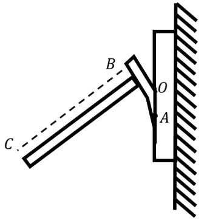

- **A**. 适当延长把手BC的长度　✅
- **B**. 适当延长起钉部位OA的长度
- **C**. 增加锤子的重量
- **D**. 增加把手的重量

**答案**：A

**官方解析**

根据杠杆原理，动力动力臂阻力阻力臂，若要使锤子起钉时更省力，则需要增大动力臂或者减小阻力臂。如图，支点为O，增大BC的长度或者减小OA的长度，可使动力臂增加或者阻力臂减少，而增加锤子和把手的重量，并不能省力。

故正确答案为A。

---

## 第 4 题　qid 2374797 · 科技常识

将瘪了的乒乓球放在热水里一段时间后，乒乓球便会恢复原来的圆形状态。其原理是（    ）。

- **A**. 乒乓球内部气体溢出，内部气体减少
- **B**. 乒乓球受热后球壁变软，恢复原来形状
- **C**. 乒乓球内部气体受热膨胀，挤压乒乓球内壁　✅
- **D**. 水蒸气流入乒乓球内部，乒乓球内部压强增大

**答案**：C

**官方解析**

瘪了的乒乓球放到热水中时，乒乓球内部气体温度升高，热胀冷缩，气体受热体积膨胀，挤压乒乓球内壁，乒乓球就会重新鼓起来。
故正确答案为C。

---

## 第 5 题　qid 2374798 · 科技常识

如图所示，货车停在某处卸货时货物从倾斜的货箱滑下。那么，下列关于货车车轮所受的摩擦力说法正确的是（    ）。

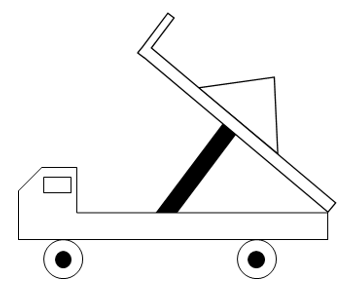

- **A**. 货车车轮与地面之间没有摩擦力
- **B**. 货车车轮所受摩擦力的方向水平向右　✅
- **C**. 货车车轮所受摩擦力的方向水平向左
- **D**. 货车车轮与地面之间的摩擦力大小和方向都不确定

**答案**：B

**官方解析**

货物自己下滑，一定是重力的分力大于摩擦力，故加速下滑。

设物体沿斜面向下的加速度为，斜面倾角为，货物质量为，受力分析如下图所示。

此时，， ；

根据力的作用是相互的，货车的受力分析如下图所示。

水平方向的力为方向向左的，水平方向的力为方向向右的，货车水平方向上受到和的合力为，方向水平向左。

若保持货车静止不动，需受到地面方向向右的摩擦力。

故正确答案为B。

---

## 第 6 题　qid 2374663 · 科技常识

如图所示，将一只充了气的密封小气球放在针筒壁内，封闭针筒孔后向外抽拉针筒推杆，忽略摩擦力的影响，则在这一过程中（    ）。

- **A**. 小气球体积会变大　✅
- **B**. 针筒内的压强保持不变
- **C**. 小气球受到的合力为零
- **D**. 针筒内的气体温度会升高

**答案**：A

**官方解析**

对于封闭针筒向外拉推杆的过程中，针筒封闭气体体积增大，压强变小，B项错误；小气球外部气体压强减小，小气球在内部气体压强作用下膨胀，故小气球体积变大，A项正确；由于气球膨胀，导致气球重心上升，将气球看成一个质点，气球并非静止不动，而是由静止变为向上运动，因此受到合力不为零，C项错误；在向外拉推杆的过程中，针筒内气体对外做功，消耗气体内能，相对抽拉针筒推杆前，针筒内气体温度不会升高，D项错误。
故正确答案为A。

---

## 第 7 题　qid 2374669 · 科技常识

物质的用途与性质密切相关。下列说法正确的是（    ）。

- **A**. 木炭能作为炼钢的原料，是利用了木炭的可燃性
- **B**. 钨常用作灯丝，是因为钨在高温下化学性质稳定
- **C**. 活性炭可以去除水中杂质，是因为其具有很强的吸附能力　✅
- **D**. 铝制品的表面可以不做防锈处理，是因为铝的金属活动性不强

**答案**：C

**官方解析**

A项错误，木炭能作为炼钢的原料，使用的是木炭的还原性，而非可燃性。在高温下，木炭作为还原剂，与矿石（主要为金属氧化物）中的氧结合，生成二氧化碳，而使金属被还原。
B项错误，钨常用作灯丝，是因为钨丝的熔点高，不容易因过热而熔化，而非钨在高温下化学性质稳定。
C项正确，活性炭具有吸附性，能吸附水中的杂质，可用活性炭净水。
D项错误，铝的金属活动性强，化学性质活泼，因此能在空气中和氧气反应生成氧化铝，在金属表面形成致密的保护膜，防止生锈，因而不需要防锈。
故正确答案为C。

---

## 第 8 题　qid 2374664 · 科技常识

办公室里的四盏灯型号相同，电路如下图所示。如果逐一打开这四盏灯，在电源的输出电压不变的情况下，下列说法正确的是（    ）。

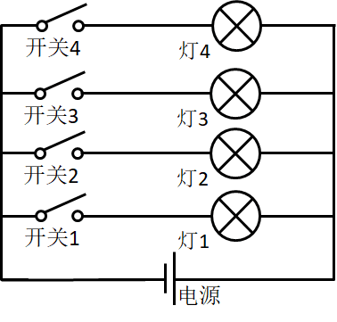

- **A**. 打开的灯越多，通过各灯的电流变得越大
- **B**. 打开的灯越多，各灯两端的电压变得越小
- **C**. 打开的灯越多，通过电源的电流变得越大　✅
- **D**. 打开的灯越多，各灯变得越暗

**答案**：C

**官方解析**

由于灯泡均与电源并联，所以所有灯泡两端的电压均为电源输出电压，保持不变，B项错误；由于四盏灯型号相同，电阻相等，根据欧姆定律，所以流经每个灯泡支路的电流不变，A项错误；由于干路电流等于各支路电流之和，所以打开的灯越多，干路电流越大，即通过电源的电流变得越大，C项正确；而根据功率公式，可知灯泡功率不变，即亮度不变，D项错误。

故正确答案为C。

---

## 第 9 题　qid 2374676 · 科技常识

冬天气温很低的时候往玻璃杯里倒开水，杯壁较厚的玻璃杯更容易发生炸裂，这是因为（    ）。

- **A**. 内壁和外壁受热不均　✅
- **B**. 开水遇到玻璃后温度迅速降低
- **C**. 空气对杯壁的压力超过杯壁的承受范围
- **D**. 倒水时水的冲击力将玻璃杯击破

**答案**：A

**官方解析**

杯子内倒入开水后，厚玻璃杯内壁温度迅速升高，受热膨胀，而外壁温度变化慢，膨胀程度小。内外壁受热膨胀不均匀，内外壁膨胀程度不同，导致玻璃杯发生炸裂。
故正确答案为A。

---

## 第 10 题　qid 2374674 · 科技常识

如图所示，甲、乙两个大小相同的实心金属球放置在光滑水平面上，甲球以水平向右的速度碰撞静止的乙球。已知甲球质量大于乙球，则有关碰撞后的情形，下列说法正确的是（    ）。

- **A**. 甲球可能静止
- **B**. 乙球可能静止
- **C**. 甲球可能向左运动
- **D**. 甲球一定向右运动　✅

**答案**：D

**官方解析**

根据碰撞过程动量守恒可得：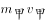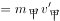——①

根据动能守恒可得：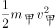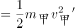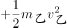——②

连立①②，分别消去 、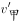，可得：

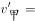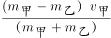——③

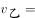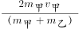——④

由④可得，，方向与方向相同，水平向右运动，故B项错误；

因为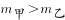，由③可得，所以的方向与方向相同，水平向右运动，故A项、C项错误，D项正确。

故正确答案为D。

---

## 第 11 题　qid 2374799 · 科技常识

细胞膜能够防止细胞外物质自由进入细胞，保证细胞内环境的相对稳定。这是因为（    ）。

- **A**. 细胞膜具有流动性
- **B**. 细胞膜具有选择透过性　✅
- **C**. 细胞膜主要由氨基酸构成
- **D**. 细胞膜具有维持细胞形状的功能

**答案**：B

**官方解析**

细胞膜主要由脂质（主要为磷脂）、蛋白质和糖类等物质组成；其中以蛋白质和脂质为主。细胞膜的主要功能有：1、将细胞与外界环境分开；2、控制物质进出细胞；3、进行细胞间的物质交流。流动性为细胞膜的结构特点，选择透过性为细胞膜的功能特性。
A项：细胞膜的流动性是结构特点，不能够防止细胞外物质自由进入细胞，错误；
B项：细胞膜具有选择透过性，可以控制物质进出细胞，防止细胞外物质自由进入细胞，保证细胞内环境的相对稳定，正确；
C项：细胞膜主要由脂质（主要为磷脂）、蛋白质和糖类等物质组成，氨基酸是蛋白质分解之后的产物，错误；
D项：细胞膜主要是保护和控制物质进出的作用，可以起到维持细胞形状的结构是细胞壁，错误。
故正确答案为B。

---

## 第 12 题　qid 2374668 · 科技常识

人们在乘坐小船时，应尽量坐下，站立会降低小船的稳定性，其根本原因是（    ）。

- **A**. 人和船的整体重量增加
- **B**. 人和船的整体重心变高　✅
- **C**. 船的行驶速度增加
- **D**. 水流波动幅度变大

**答案**：B

**官方解析**

当人坐下时，人和船整体重心更低，当倾斜相同的角度时，重心低的物体，其重心偏移不易超出它的底部的支撑范围，因而不易倾倒，所以重心越低越稳定；而人站立时，刚好相反。而无论人站立、坐下，整体重量都不变，也不会引起速度变化，更不影响水面波动幅度。
故正确答案为B。

---

## 第 13 题　qid 2374682 · 科技常识

“后驱”是指发动机的动力通过传动轴传递给后轮，从而推动车辆前进的一种驱动形式。当后驱车在水平公路上匀速前进时，下列说法正确的是（    ）。

- **A**. 前轮和后轮受到的摩擦力均向前
- **B**. 前轮和后轮受到的摩擦力均向后
- **C**. 前轮受到的摩擦力向前，后轮受到的摩擦力向后
- **D**. 前轮受到的摩擦力向后，后轮受到的摩擦力向前　✅

**答案**：D

**官方解析**

车辆前进时，后轮是驱动轮，主动转动，对地面的力是向后的，所以受到的反作用力即摩擦力是向前的；但是对前轮来说，被动转动，受到来自地面向后的摩擦力。
故正确答案为D。

---

## 第 14 题　qid 2374672 · 科技常识

如图所示，将所点燃的一高一矮两只蜡烛放入圆筒，圆筒顶端不封闭，并从圆筒侧壁缓慢注入二氧化碳气体。则最可能发生的情况是（    ）。

- **A**. 高蜡烛先熄灭
- **B**. 矮蜡烛先熄灭　✅
- **C**. 两只蜡烛的火苗没有变化
- **D**. 两只蜡烛的火苗都变矮并逐渐熄灭

**答案**：B

**官方解析**

二氧化碳本身不燃烧，也不支持燃烧，密度比空气大。如图，从上方注入二氧化碳，由于二氧化碳密度比空气大，因此下沉。又因为二氧化碳不支持燃烧，下沉的二氧化碳，自下而上逐渐排出容器内的空气，包裹火焰、隔绝氧气，使蜡烛熄灭。因此，逐渐注入二氧化碳，矮蜡烛先熄灭，高蜡烛后熄灭。
故正确答案为B。

---

## 第 15 题　qid 2374679 · 科技常识

为了整治超速，交警采用了一套系统。在某一路段，系统会自动记录车辆进入和离开的时间，从而判断该车辆是否超速。这种方法是计算车辆的（    ）。

- **A**. 平均速率　✅
- **B**. 瞬时速率
- **C**. 加速度
- **D**. 位移

**答案**：A

**官方解析**

平均速率是指物体运动的路程和通过这段路程所用时间的比。题干中“某一路段”是指路程，“进入和离开所用的时间”是通过这段路程所用的时间，二者的比值就是该车辆在这段时间的平均速率，可用该速率来估测车辆是否超速。
故正确答案为A。

---

## 第 16 题　qid 2374675 · 人文常识

2019年3月12日，十三届全国人大二次会议举行第三次全体会议，听取审议最高人民法院工作报告和最高人民检察院工作报告。这体现了人民代表大会的（    ）。

- **A**. 立法权
- **B**. 决定权
- **C**. 任免权
- **D**. 监督权　✅

**答案**：D

**官方解析**

本题考查法律常识。
全国人大有权监督由它产生的其他国家机关的工作，这些国家机关主要包括全国人大常委会、国务院、国家监察委员会、最高人民法院、最高人民检察院等，它们都要向全国人大负责，并报告工作。具体来说，全国人大听取并通过全国人大常委会的工作报告；听取最高人民法院、最高人民检察院的工作报告；改变或者撤销全国人民代表大会常务委员会不适当的决定等。
故正确答案为D。

---

## 第 17 题　qid 2374680 · 人文常识

人才是实施乡村振兴战略的关键因素。以下举措不属于推动乡村人才振兴的是（    ）。

- **A**. 大力支持乡村休闲旅游　✅
- **B**. 实施新乡贤返乡工程
- **C**. 扩大“三支一扶”计划人员招募规模
- **D**. 完善农村劳动力技能培训补贴机制

**答案**：A

**官方解析**

本题考查政治常识。
A项错误，大力支持乡村休闲旅游，属于发展农村产业经济，并未体现出吸引、培育人才等方面的举措。
B项正确，实施新乡贤返乡工程，属于吸引人才的举措，把更多从农村走出来的精英群体引回乡村创新创业。
C项正确，扩大“三支一扶”计划人员招募规模，属于吸纳高校毕业生到基层工作的举措，大学生村官计划是向农村提供人才支撑的重要途径，能为建设高素质专业化“三农”工作干部队伍提供源头活水。
D项正确，完善农村劳动力技能培训补贴机制，属于提升农村劳动力技能的举措，通过培训提高、吸引发展、培育储备，加快构建一支有文化、懂技术、善经营、会管理的新型职业农民队伍。
本题为选非题，故正确答案为A。

---

## 第 18 题　qid 2374691 · 人文常识

近几年，我国政府出台了一系列减税降费的举措。减税降费有利于（    ）。
①减轻企业负担、稳定就业
②优化经济和收入分配结构
③畅通小微企业融资渠道

- **A**. ①②　✅
- **B**. ①③
- **C**. ②③
- **D**. ①②③

**答案**：A

**官方解析**

本题考查经济常识。
2019年3月21日，李克强总理考察财政部、税务总局并主持召开座谈会指出，要坚持以习近平新时代中国特色社会主义思想为指导，贯彻党中央、国务院决策部署，把大规模减税降费作为重大改革举措和宏观调控“当头炮”。这既利当前又利长远，不仅减轻企业负担、稳定就业，而且优化经济和收入分配结构，培育税源、促进财政可持续。要把减税加快落实到位，以企业活力更大释放保持经济运行在合理区间，推动高质量发展。因此①②正确。
故正确答案为A。

---

## 第 19 题　qid 2374805 · 人文常识

2018年8月，国家提出衡量贫困人口是否脱贫的标准是“两不愁、三保障”，其中“两不愁”是指不愁吃、不愁穿。以下不属于“三保障”的是（    ）。

- **A**. 基本医疗
- **B**. 义务教育
- **C**. 住房安全
- **D**. 环境优美　✅

**答案**：D

**官方解析**

2015年中共中央、国务院制定的《关于打赢脱贫攻坚战的决定》是当前脱贫攻坚工作的总遵循。《决定》明确提出：到2020年，要稳定实现农村贫困人口不愁吃、不愁穿，义务教育、基本医疗、住房安全有保障，实现贫困地区农民人均可支配收入增长幅度高于全国平均水平，基本公共服务主要领域指标接近全国平均水平。《“十三五”脱贫攻坚规划》指出：现行标准下农村建档立卡贫困人口实现脱贫。贫困户有稳定收入来源，人均可支配收入稳定超过国家扶贫标准，实现“两不愁、三保障”。据此可知，A、B、C三项属于“三保障”，D项不属于。
本题为选非题，故正确答案为D。

---

## 第 20 题　qid 2374670 · 人文常识

粤港澳大湾区包括香港特别行政区、澳门特别行政区和珠三角九市，是我国经济活力最强的区域之一，在国家发展大局中具有重要战略地位。以下关于粤港澳大湾区发展基础的说法，错误的是（    ）。

- **A**. 经济实力雄厚
- **B**. 创新要素集聚
- **C**. 内部发展差距小　✅
- **D**. 国际化水平领先

**答案**：C

**官方解析**

本题考查政治常识。2019年2月18日，中共中央、国务院印发了《粤港澳大湾区发展规划纲要》，《纲要》第一节指出，粤港澳大湾区发展基础为：区位优势明显、经济实力雄厚、创新要素集聚、国际化水平领先、合作基础良好。
A项正确，粤港澳大湾区经济实力雄厚。经济发展水平全国领先，产业体系完备，集群优势明显，经济互补性强，香港、澳门服务业高度发达，珠三角九市已初步形成以战略性新兴产业为先导、先进制造业和现代服务业为主体的产业结构，2017年大湾区经济总量约10万亿元。
B项正确，粤港澳大湾区创新要素集聚。创新驱动发展战略深入实施，广东全面创新改革试验稳步推进，国家自主创新示范区加快建设。粤港澳三地科技研发、转化能力突出，拥有一批在全国乃至全球具有重要影响力的高校、科研院所、高新技术企业和国家大科学工程，创新要素吸引力强，具备建设国际科技创新中心的良好基础。
C项错误，内部发展差距小并非粤港澳大湾区的发展基础。
D项正确，粤港澳大湾区国际化水平领先。香港作为国际金融、航运、贸易中心和国际航空枢纽，拥有高度国际化、法治化的营商环境以及遍布全球的商业网络，是全球最自由经济体之一。澳门作为世界旅游休闲中心和中国与葡语国家商贸合作服务平台的作用不断强化，多元文化交流的功能日益彰显。珠三角九市是内地外向度最高的经济区域和对外开放的重要窗口，在全国加快构建开放型经济新体制中具有重要地位和作用。
本题为选非题，故正确答案为C。

---

## 第 21 题　qid 2374692 · 人文常识

只要把握住历史发展大势，抓住历史变革时机，奋发有为，锐意进取，人类社会就能更好前进。这句话体现的哲学原理是（    ）。

- **A**. 物质和意识的辩证关系
- **B**. 规律是可以认识和利用的　✅
- **C**. 事物发展是前进性和曲折性的统一
- **D**. 实践是检验认识正确与否的唯一标准

**答案**：B

**官方解析**

本题考查马克思主义哲学。
A项错误，辩证唯物主义认为，世界的本原是物质的，物质决定意识，意识是物质的反映，意识对物质又具有能动作用。题干并未体现这一原理。
B项正确，规律是可以认识和利用的。人们可以认识和把握规律，并根据规律发生作用的条件和形式，利用规律，改造客观世界，造福人类。题干中强调只要抓住历史发展大势，抓住历史变革时机，锐意进取，人类社会就能更好前进，体现了认识和利用规律的原理。
C项错误，事物发展的总趋势是前进的，而发展的道路则是迂回曲折的。任何事物的发展都是前进性与曲折性的统一。前途是光明的，道路是曲折的，在前进中有曲折，在曲折中向前进，是一切新事物发展的途径。选项本身表述无误，但题干未体现这一原理。
D项错误，实践是检验认识正确与否的唯一标准，选项本身表述无误，但题干未体现这一原理。
故正确答案为B。

---

## 第 22 题　qid 2374808 · 人文常识

扶贫先扶智，治贫先治愚。以下扶贫举措中不属于“扶智”的是（    ）。

- **A**. 在贫困村建设图书室
- **B**. 开展农业实用技能培训
- **C**. 组织大学生到贫困地区支教
- **D**. 向贫困户发放现代化农业机具　✅

**答案**：D

**官方解析**

本题考查政治常识。
A项正确，摆脱贫困首要并不是摆脱物质的贫困，而是摆脱意识和思路的贫困。贫困村建设图书室，有利于丰富贫困地区文化活动，武装贫困群众思想，振奋贫困地区和贫困群众精神风貌。
B项正确，脱贫攻坚，群众动力是基础。必须坚持依靠人民群众，激发贫困群众内生动力。培养贫困群众发展生产和务工经商技能，组织、引导、支持贫困群众用自己的辛勤劳动实现脱贫致富，用人民群众的内生动力支撑脱贫攻坚。
C项正确，扶贫先扶智，重点是要推进教育精准脱贫，把下一代的教育工作做好。大学生到贫困地区支教，帮助贫困人口子女接受良好教育，可以提升文化水平及思想道德素质，有利于阻断贫困代际传递，让每一个孩子都对自己有信心、对未来有希望。
D项错误，治贫先治愚。贫穷并不可怕，怕的是智力不足、头脑空空，怕的是知识匮乏、精神委顿。对贫困地区来说，现代化农业机具终究只是外力，“扶智”才是内力，外力帮扶固然重要，但如果自身不努力、不作为，即使外力帮扶再大，也难以有效发挥作用。
本题为选非题，故正确答案为D。

---

## 第 23 题　qid 2374809 · 人文常识

自2018年起，我国将每年农历（    ）定为“中国农民丰收节”，作为亿万农民庆祝丰收、享受丰收的节日。

- **A**. 立春
- **B**. 芒种
- **C**. 秋分　✅
- **D**. 冬至

**答案**：C

**官方解析**

本题考查政治常识。
2018年6月7日，经党中央批准、国务院批复，自2018年起，将每年农历秋分设立为“中国农民丰收节”。这是第一个在国家层面专门为农民设立的节日。
故正确答案为C。

---

## 第 24 题　qid 2374817 · 人文常识

消除贫困、改善民生、逐步实现（    ），是社会主义的本质要求，是我们党的重要使命。

- **A**. 共同富裕　✅
- **B**. 同步富裕
- **C**. 同时富裕
- **D**. 全体富裕

**答案**：A

**官方解析**

本题考查政治常识。
习近平同志曾多次在扶贫工作会议中指出，消除贫困、改善民生、逐步实现共同富裕，是社会主义的本质要求，是我们党的重要使命。
中国人多地广，共同富裕不是同时富裕，也不是同步富裕，而是一部分人一部分地区先富起来，先富的帮助后富的，逐步实现共同富裕。因此B、C、D三项错误。
故正确答案为A。

---

## 第 25 题　qid 2374726 · 地理国情

广东属于岭南地区，具有深厚的岭南文化。以下诗句中描写岭南风物的是（    ）。

- **A**. 此地空余黄鹤楼
- **B**. 罗浮山下四时春　✅
- **C**. 风吹草低见牛羊
- **D**. 不识庐山真面目

**答案**：B

**官方解析**

本题考查地理国情。
岭南，所谓 “岭南”，一般指南岭（又称 “五岭”）山脉以南， 包括今天广东 、广西 、海南、香港、澳门等地在内的广大地区 。
A项错误，“昔人已乘黄鹤去，此地空余黄鹤楼”出自唐朝诗人崔颢的《黄鹤楼》。黄鹤楼，位于湖北省武汉市，紧依长江，自古就享有“天下江山第一楼”的赞誉。因此该诗描写的不属于岭南风物。
B项正确，“罗浮山下四时春，卢橘杨梅次第新。日啖荔枝三百颗，不辞长作岭南人。”出自宋代苏轼的《惠州一绝》。罗浮山，位于广东省，是岭南四大名山之一。因此该诗描写的属于岭南风物。
C项错误，“敕勒川，阴山下。天似穹庐，笼盖四野。天苍苍，野茫茫。风吹草低见牛羊。”出自《敕勒歌》，是南北朝时代敕勒族的一首民歌，描绘了北方草原壮丽富饶的风光。因此该诗描写的不属于岭南风物。
D项错误，“不识庐山真面目，只缘身在此山中”出自宋代苏轼《题西林壁》。该诗作描绘的是庐山景色。庐山位于江西省九江市，因此该诗描写的不属于岭南风物。
故正确答案为B。

---

## 第 26 题　qid 2374826 · 地理国情

港珠澳大桥跨越（    ），东接香港，西接广东珠海和澳门，总长约55公里，是粤港澳三地首次合作共建的超大型跨海交通工程。

- **A**. 渤海
- **B**. 东海
- **C**. 北部湾
- **D**. 伶仃洋　✅

**答案**：D

**官方解析**

本题主要考查政治常识。
港珠澳大桥于2009年12月15日动工建设，2018年10月24日上午9时开通运营，是中国境内一座连接香港、珠海和澳门的桥隧工程，位于中国广东省伶仃洋区域内，为珠江三角洲地区环线高速公路南环段。港珠澳大桥东起香港国际机场附近的香港口岸人工岛，向西横跨南海伶仃洋后连接珠海和澳门人工岛，止于珠海洪湾立交。港珠澳大桥跨越的是伶仃洋，因此D项正确，ABC项错误。
故正确答案为D。

---

## 第 27 题　qid 2374699 · 科技常识

“山上多植物，胜似修水库，有雨它能吞，无雨它能吐”。这一谚语形象地说明了森林具有（    ）的功能。

- **A**. 净化空气
- **B**. 过滤尘埃
- **C**. 减小噪音
- **D**. 涵养水源　✅

**答案**：D

**官方解析**

本题考查地理国情。
“山上多植物，胜似修水库，有雨它能吞，无雨它能吐”这句谚语形象地说明了山上如果有多种植物，在雨水多的时候它能储水。在下雨时节，森林可以通过林冠和地面的残枝落叶等截住雨滴，减轻雨滴对地面的冲击，增加雨水渗入土地的速度和土壤涵养水分的能力；又由于森林中植物蒸腾作用巨大，不断向大气中散失水蒸气，此时森林地区空气湿度大，降水多，体现了无雨它能“吐”。
ABC项错误，净化空气、过滤尘埃、减小噪音都是森林的功能，但是与题意不符。
D项正确，涵养水源功能是森林所具有的重要功能之一，题中正体现了森林的这一功能。
故正确答案为D。

---

## 第 28 题　qid 2374687 · 人文常识

全面建成小康社会，最艰巨最繁重的任务在（    ），特别是在贫困地区。

- **A**. 城市
- **B**. 城镇
- **C**. 社区
- **D**. 农村　✅

**答案**：D

**官方解析**

本题考查政治常识。
习近平总书记在河北省阜平县考察扶贫开发工作时的讲话中强调：“全面建成小康社会，最艰巨最繁重的任务在农村，特别是在贫困地区。没有农村的小康，特别是没有贫困地区的小康，就没有全面建成小康社会。”
故正确答案为D。

---

## 第 29 题　qid 2374834 · 人文常识

俗话说：正月十五闹元宵。“闹”元宵的习俗包括张灯、观灯、舞龙、舞狮等。以下诗句与元宵节有关的是（    ）。

- **A**. 火树银花合　✅
- **B**. 千里共婵娟
- **C**. 遍插茱萸少一人
- **D**. 爆竹声中一岁除

**答案**：A

**官方解析**

本题考查人文常识。
A项正确，“火树银花合”出自唐代苏味道的《正月十五夜》，这首诗描写了洛阳城里元宵之夜的景色。
B项错误，“婵娟”指嫦娥，也就是代指明月，“但愿人长久，千里共婵娟”出自苏轼的《水调歌头》，“千里共婵娟”与中秋节相关。
C项错误，“遍插茱萸少一人”出自王维的《九月九日忆山东兄弟》，与重阳节相关。
D项错误，“爆竹声中一岁除”出自王安石的《元日》，“元日”是农历正月初一。
故正确答案为A。

---

## 第 30 题　qid 2374839 · 科技常识

2018年12月，中国发射的（    ）成为人类第一个着陆月球背面的探测器。

- **A**. 神舟七号
- **B**. 长征三号
- **C**. 嫦娥四号　✅
- **D**. 天宫一号

**答案**：C

**官方解析**

本题考查科技常识。
A项错误，神舟七号载人航天飞船是于2008年9月25日21点10分从中国酒泉卫星发射中心载人航天发射场发射升空的中国第三个载人航天飞船。
B项错误，长征三号是以“长征二号丙”为原型加氢氧第三级组成的三级运载火箭。
C项正确，嫦娥四号探测器于2018年12月8日2时23分发射升空飞向月球，2019年1月3日嫦娥四号成功着陆在了月球背面东经177.6度、南纬45.5度附近的预选着陆区，月球背面真正意义上第一次成功留下了人类探测器的身影。
D项错误，天宫一号是中国第一个目标飞行器和空间实验室，于2011年9月29日21时16分在酒泉卫星发射中心发射。
故正确答案为C。

---

## 第 31 题　qid 2374694 · 人文常识

地球内部具有巨大的热量，并通过不同途径由内向外散发地热能。以下现象与地热能有关的是（    ）。

- **A**. 台风生成
- **B**. 火山喷发　✅
- **C**. 山洪暴发
- **D**. 岩石风化

**答案**：B

**官方解析**

本题考查自然常识。
A项错误，台风发源于热带海面，那里温度高，大量的海水被蒸发到了空中，形成一个低气压中心。随着气压的变化和地球自身的运动，流入的空气也旋转起来，形成一个逆时针旋转的空气漩涡，这就是热带气旋。只要气温不下降，这个热带气旋就会越来越强大，最后形成了台风，台风属于大气的运动，与地热能无关。
B项正确，火山喷发是一种奇特的地质现象，是岩浆等喷出物在短时间内从火山口向地表的释放，是地壳运动的一种表现形式，也是地球内部热能在地表的一种最强烈的显示。
C项错误，一般山洪泥石流形成于中高山区，这里相对高差大，河谷坡度陡峻，且大都表层为植皮覆盖有较厚的土体，土体下面为中深断裂及其派生级断裂切割的破碎岩石层，加之短历时雷暴雨，降水量巨大，就会引发山洪，因此山洪主要是由短时降雨引发的，与地热能无关。
D项错误，岩石风化是指岩石在太阳辐射、大气、水和生物作用下出现破碎、疏松及矿物成分次生变化的现象。温度变化是引起岩石物理风化作用的最主要因素。由于温度的变化产生温差，温差可促使岩石膨胀和收缩交替地进行，久之则引起岩石破裂。岩石风化与地热能无关。
故正确答案为B。

---
