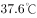

# 2019年广东省公务员录用考试《行测》题（县级卷）（网友回忆版）

> 常识判断 · 23 题 · 广东 2019

## 第 1 题　qid 2374663 · 科技常识

如图所示，将一只充了气的密封小气球放在针筒壁内，封闭针筒孔后向外抽拉针筒推杆，忽略摩擦力的影响，则在这一过程中（    ）。

- **A**. 小气球体积会变大　✅
- **B**. 针筒内的压强保持不变
- **C**. 小气球受到的合力为零
- **D**. 针筒内的气体温度会升高

**答案**：A

**官方解析**

对于封闭针筒向外拉推杆的过程中，针筒封闭气体体积增大，压强变小，B项错误；小气球外部气体压强减小，小气球在内部气体压强作用下膨胀，故小气球体积变大，A项正确；由于气球膨胀，导致气球重心上升，将气球看成一个质点，气球并非静止不动，而是由静止变为向上运动，因此受到合力不为零，C项错误；在向外拉推杆的过程中，针筒内气体对外做功，消耗气体内能，相对抽拉针筒推杆前，针筒内气体温度不会升高，D项错误。
故正确答案为A。

---

## 第 2 题　qid 2374664 · 科技常识

办公室里的四盏灯型号相同，电路如下图所示。如果逐一打开这四盏灯，在电源的输出电压不变的情况下，下列说法正确的是（    ）。

- **A**. 打开的灯越多，通过各灯的电流变得越大
- **B**. 打开的灯越多，各灯两端的电压变得越小
- **C**. 打开的灯越多，通过电源的电流变得越大　✅
- **D**. 打开的灯越多，各灯变得越暗

**答案**：C

**官方解析**

由于灯泡均与电源并联，所以所有灯泡两端的电压均为电源输出电压，保持不变，B项错误；由于四盏灯型号相同，电阻相等，根据欧姆定律，所以流经每个灯泡支路的电流不变，A项错误；由于干路电流等于各支路电流之和，所以打开的灯越多，干路电流越大，即通过电源的电流变得越大，C项正确；而根据功率公式，可知灯泡功率不变，即亮度不变，D项错误。

故正确答案为C。

---

## 第 3 题　qid 2374666 · 科技常识

日常生活中的一些简单器械都应用了杠杆原理，根据使用杠杆时的用力情况，杠杆可以分为省力杠杆、费力杠杆和等臂杠杆。拾取垃圾使用的钳子（图1）和修剪树枝用的剪刀（图2），这两者的杠杆类型（    ）。

- **A**. 一样，都是省力杠杆
- **B**. 一样，都是费力杠杆
- **C**. 不一样，前者是费力杠杆，后者是省力杠杆　✅
- **D**. 不一样，前者是省力杠杆，后者是费力杠杆

**答案**：C

**官方解析**

根据杠杆原理，动力动力臂阻力阻力臂。

对于图1，支点距离握把较近，因而动力臂小于阻力臂，故使用时动力大于阻力，为费力杠杆；对于图2，支点距离握把较远，因而动力臂大于阻力臂，故使用时动力小于阻力，为省力杠杆。

故正确答案为C。

---

## 第 4 题　qid 2374668 · 科技常识

人们在乘坐小船时，应尽量坐下，站立会降低小船的稳定性，其根本原因是（    ）。

- **A**. 人和船的整体重量增加
- **B**. 人和船的整体重心变高　✅
- **C**. 船的行驶速度增加
- **D**. 水流波动幅度变大

**答案**：B

**官方解析**

当人坐下时，人和船整体重心更低，当倾斜相同的角度时，重心低的物体，其重心偏移不易超出它的底部的支撑范围，因而不易倾倒，所以重心越低越稳定；而人站立时，刚好相反。而无论人站立、坐下，整体重量都不变，也不会引起速度变化，更不影响水面波动幅度。
故正确答案为B。

---

## 第 5 题　qid 2374669 · 科技常识

物质的用途与性质密切相关。下列说法正确的是（    ）。

- **A**. 木炭能作为炼钢的原料，是利用了木炭的可燃性
- **B**. 钨常用作灯丝，是因为钨在高温下化学性质稳定
- **C**. 活性炭可以去除水中杂质，是因为其具有很强的吸附能力　✅
- **D**. 铝制品的表面可以不做防锈处理，是因为铝的金属活动性不强

**答案**：C

**官方解析**

A项错误，木炭能作为炼钢的原料，使用的是木炭的还原性，而非可燃性。在高温下，木炭作为还原剂，与矿石（主要为金属氧化物）中的氧结合，生成二氧化碳，而使金属被还原。
B项错误，钨常用作灯丝，是因为钨丝的熔点高，不容易因过热而熔化，而非钨在高温下化学性质稳定。
C项正确，活性炭具有吸附性，能吸附水中的杂质，可用活性炭净水。
D项错误，铝的金属活动性强，化学性质活泼，因此能在空气中和氧气反应生成氧化铝，在金属表面形成致密的保护膜，防止生锈，因而不需要防锈。
故正确答案为C。

---

## 第 6 题　qid 2374672 · 科技常识

如图所示，将所点燃的一高一矮两只蜡烛放入圆筒，圆筒顶端不封闭，并从圆筒侧壁缓慢注入二氧化碳气体。则最可能发生的情况是（    ）。

- **A**. 高蜡烛先熄灭
- **B**. 矮蜡烛先熄灭　✅
- **C**. 两只蜡烛的火苗没有变化
- **D**. 两只蜡烛的火苗都变矮并逐渐熄灭

**答案**：B

**官方解析**

二氧化碳本身不燃烧，也不支持燃烧，密度比空气大。如图，从上方注入二氧化碳，由于二氧化碳密度比空气大，因此下沉。又因为二氧化碳不支持燃烧，下沉的二氧化碳，自下而上逐渐排出容器内的空气，包裹火焰、隔绝氧气，使蜡烛熄灭。因此，逐渐注入二氧化碳，矮蜡烛先熄灭，高蜡烛后熄灭。
故正确答案为B。

---

## 第 7 题　qid 2374674 · 科技常识

如图所示，甲、乙两个大小相同的实心金属球放置在光滑水平面上，甲球以水平向右的速度碰撞静止的乙球。已知甲球质量大于乙球，则有关碰撞后的情形，下列说法正确的是（    ）。

- **A**. 甲球可能静止
- **B**. 乙球可能静止
- **C**. 甲球可能向左运动
- **D**. 甲球一定向右运动　✅

**答案**：D

**官方解析**

根据碰撞过程动量守恒可得：——①

根据动能守恒可得：——②

连立①②，分别消去 、，可得：

——③

——④

由④可得，，方向与方向相同，水平向右运动，故B项错误；

因为，由③可得，所以的方向与方向相同，水平向右运动，故A项、C项错误，D项正确。

故正确答案为D。

---

## 第 8 题　qid 2374676 · 科技常识

冬天气温很低的时候往玻璃杯里倒开水，杯壁较厚的玻璃杯更容易发生炸裂，这是因为（    ）。

- **A**. 内壁和外壁受热不均　✅
- **B**. 开水遇到玻璃后温度迅速降低
- **C**. 空气对杯壁的压力超过杯壁的承受范围
- **D**. 倒水时水的冲击力将玻璃杯击破

**答案**：A

**官方解析**

杯子内倒入开水后，厚玻璃杯内壁温度迅速升高，受热膨胀，而外壁温度变化慢，膨胀程度小。内外壁受热膨胀不均匀，内外壁膨胀程度不同，导致玻璃杯发生炸裂。
故正确答案为A。

---

## 第 9 题　qid 2374679 · 科技常识

为了整治超速，交警采用了一套系统。在某一路段，系统会自动记录车辆进入和离开的时间，从而判断该车辆是否超速。这种方法是计算车辆的（    ）。

- **A**. 平均速率　✅
- **B**. 瞬时速率
- **C**. 加速度
- **D**. 位移

**答案**：A

**官方解析**

平均速率是指物体运动的路程和通过这段路程所用时间的比。题干中“某一路段”是指路程，“进入和离开所用的时间”是通过这段路程所用的时间，二者的比值就是该车辆在这段时间的平均速率，可用该速率来估测车辆是否超速。
故正确答案为A。

---

## 第 10 题　qid 2374682 · 科技常识

“后驱”是指发动机的动力通过传动轴传递给后轮，从而推动车辆前进的一种驱动形式。当后驱车在水平公路上匀速前进时，下列说法正确的是（    ）。

- **A**. 前轮和后轮受到的摩擦力均向前
- **B**. 前轮和后轮受到的摩擦力均向后
- **C**. 前轮受到的摩擦力向前，后轮受到的摩擦力向后
- **D**. 前轮受到的摩擦力向后，后轮受到的摩擦力向前　✅

**答案**：D

**官方解析**

车辆前进时，后轮是驱动轮，主动转动，对地面的力是向后的，所以受到的反作用力即摩擦力是向前的；但是对前轮来说，被动转动，受到来自地面向后的摩擦力。
故正确答案为D。

---

## 第 11 题　qid 2374691 · 人文常识

近几年，我国政府出台了一系列减税降费的举措。减税降费有利于（    ）。
①减轻企业负担、稳定就业
②优化经济和收入分配结构
③畅通小微企业融资渠道

- **A**. ①②　✅
- **B**. ①③
- **C**. ②③
- **D**. ①②③

**答案**：A

**官方解析**

本题考查经济常识。
2019年3月21日，李克强总理考察财政部、税务总局并主持召开座谈会指出，要坚持以习近平新时代中国特色社会主义思想为指导，贯彻党中央、国务院决策部署，把大规模减税降费作为重大改革举措和宏观调控“当头炮”。这既利当前又利长远，不仅减轻企业负担、稳定就业，而且优化经济和收入分配结构，培育税源、促进财政可持续。要把减税加快落实到位，以企业活力更大释放保持经济运行在合理区间，推动高质量发展。因此①②正确。
故正确答案为A。

---

## 第 12 题　qid 2374670 · 人文常识

粤港澳大湾区包括香港特别行政区、澳门特别行政区和珠三角九市，是我国经济活力最强的区域之一，在国家发展大局中具有重要战略地位。以下关于粤港澳大湾区发展基础的说法，错误的是（    ）。

- **A**. 经济实力雄厚
- **B**. 创新要素集聚
- **C**. 内部发展差距小　✅
- **D**. 国际化水平领先

**答案**：C

**官方解析**

本题考查政治常识。2019年2月18日，中共中央、国务院印发了《粤港澳大湾区发展规划纲要》，《纲要》第一节指出，粤港澳大湾区发展基础为：区位优势明显、经济实力雄厚、创新要素集聚、国际化水平领先、合作基础良好。
A项正确，粤港澳大湾区经济实力雄厚。经济发展水平全国领先，产业体系完备，集群优势明显，经济互补性强，香港、澳门服务业高度发达，珠三角九市已初步形成以战略性新兴产业为先导、先进制造业和现代服务业为主体的产业结构，2017年大湾区经济总量约10万亿元。
B项正确，粤港澳大湾区创新要素集聚。创新驱动发展战略深入实施，广东全面创新改革试验稳步推进，国家自主创新示范区加快建设。粤港澳三地科技研发、转化能力突出，拥有一批在全国乃至全球具有重要影响力的高校、科研院所、高新技术企业和国家大科学工程，创新要素吸引力强，具备建设国际科技创新中心的良好基础。
C项错误，内部发展差距小并非粤港澳大湾区的发展基础。
D项正确，粤港澳大湾区国际化水平领先。香港作为国际金融、航运、贸易中心和国际航空枢纽，拥有高度国际化、法治化的营商环境以及遍布全球的商业网络，是全球最自由经济体之一。澳门作为世界旅游休闲中心和中国与葡语国家商贸合作服务平台的作用不断强化，多元文化交流的功能日益彰显。珠三角九市是内地外向度最高的经济区域和对外开放的重要窗口，在全国加快构建开放型经济新体制中具有重要地位和作用。
本题为选非题，故正确答案为C。

---

## 第 13 题　qid 2374675 · 人文常识

2019年3月12日，十三届全国人大二次会议举行第三次全体会议，听取审议最高人民法院工作报告和最高人民检察院工作报告。这体现了人民代表大会的（    ）。

- **A**. 立法权
- **B**. 决定权
- **C**. 任免权
- **D**. 监督权　✅

**答案**：D

**官方解析**

本题考查法律常识。
全国人大有权监督由它产生的其他国家机关的工作，这些国家机关主要包括全国人大常委会、国务院、国家监察委员会、最高人民法院、最高人民检察院等，它们都要向全国人大负责，并报告工作。具体来说，全国人大听取并通过全国人大常委会的工作报告；听取最高人民法院、最高人民检察院的工作报告；改变或者撤销全国人民代表大会常务委员会不适当的决定等。
故正确答案为D。

---

## 第 14 题　qid 2374680 · 人文常识

人才是实施乡村振兴战略的关键因素。以下举措不属于推动乡村人才振兴的是（    ）。

- **A**. 大力支持乡村休闲旅游　✅
- **B**. 实施新乡贤返乡工程
- **C**. 扩大“三支一扶”计划人员招募规模
- **D**. 完善农村劳动力技能培训补贴机制

**答案**：A

**官方解析**

本题考查政治常识。
A项错误，大力支持乡村休闲旅游，属于发展农村产业经济，并未体现出吸引、培育人才等方面的举措。
B项正确，实施新乡贤返乡工程，属于吸引人才的举措，把更多从农村走出来的精英群体引回乡村创新创业。
C项正确，扩大“三支一扶”计划人员招募规模，属于吸纳高校毕业生到基层工作的举措，大学生村官计划是向农村提供人才支撑的重要途径，能为建设高素质专业化“三农”工作干部队伍提供源头活水。
D项正确，完善农村劳动力技能培训补贴机制，属于提升农村劳动力技能的举措，通过培训提高、吸引发展、培育储备，加快构建一支有文化、懂技术、善经营、会管理的新型职业农民队伍。
本题为选非题，故正确答案为A。

---

## 第 15 题　qid 2374683 · 法律常识

宏观调控是国家综合运用各种手段对国民经济进行的一种调节控制。国家宏观调控分为经济手段、法律手段和行政手段。下列选项中，不属于经济手段的是（    ）。

- **A**. 央行上调存款准备金率
- **B**. 全国各地发布最低工资标准
- **C**. 政府下令关停整改严重污染企业　✅
- **D**. 国家实施个人所得税专项附加扣除

**答案**：C

**官方解析**

本题考查经济常识。
A、B、D三项正确，经济手段，是指政府在自觉依据和运用价值规律的基础上借助于经济杠杆的调节作用，对国民经济进行宏观调控。经济杠杆是对社会经济活动进行宏观调控的价值形式和价值工具，主要包括税收、信贷、工资等。经济手段中的政策包括税收政策、信贷政策、利率政策、汇率政策、产品赊销政策、价格政策等。央行上调存款准备金率属于经济手段中的利率政策，全国各地发布最低工资标准属于经济杠杆中的工资，个人所得税专项附加扣除属于税收政策。
C项错误，行政手段，是指依靠行政机构，采取强制性的命令、指示、规定等行政方式来调节经济活动，以达到宏观调控目标的一种手段。行政手段是短期的非常规的手段，不可滥用，必须在尊重客观经济规律的基础上，从实际出发加以运用。政府下令关停整改严重污染企业属于行政手段，而非经济手段。
本题为选非题，故正确答案为C。
【知识拓展】法律手段，是指政府依靠法制力量，通过经济立法和司法，运用经济法规来调节经济关系和经济活动，以达到宏观调控目标的一种手段。通过法律手段可以有效地保护公有财产、个人财产，维护各种所有制经济、各个经济组织和社会成员个人的合法权益；调整各种经济组织之间横向和纵向的关系，保证经济运行的正常秩序。

---

## 第 16 题　qid 2374687 · 人文常识

全面建成小康社会，最艰巨最繁重的任务在（    ），特别是在贫困地区。

- **A**. 城市
- **B**. 城镇
- **C**. 社区
- **D**. 农村　✅

**答案**：D

**官方解析**

本题考查政治常识。
习近平总书记在河北省阜平县考察扶贫开发工作时的讲话中强调：“全面建成小康社会，最艰巨最繁重的任务在农村，特别是在贫困地区。没有农村的小康，特别是没有贫困地区的小康，就没有全面建成小康社会。”
故正确答案为D。

---

## 第 17 题　qid 2374690 · 法律常识

行政机关在法律的授权范围内，将一般性的原则或者条款适用于个案时，需要作出一种最适当的法律效果选择。这属于行政法的（    ）。

- **A**. 行政效力推定原则
- **B**. 行政裁量合理原则　✅
- **C**. 行政职权法定原则
- **D**. 行政程序正当原则

**答案**：B

**官方解析**

本题考查法律常识。
A项错误，行政效力推定原则是指行政主体作出的行政行为，即使存在瑕疵也应当推定行政行为合法有效，所有的组织和个人都必须给予尊重，相关的组织和个人必须履行行政行为所设定的义务。
B项正确，行政裁量合理原则是指行政机关在法律授权的范围内，根据具体情况将一般性原则或者条款适用于个案的一种最适当的选择。这一原则的法理意义在于通过行政程序规范行政裁量权，达成行政权的有效率地行使。
C项错误，行政职权法定原则是指行政机关所行使的职权必须有法律规定，任何机关不得超越法律的授权。其特点包括：行政机关的创设具有法律依据，行政机关的权力来源于法律授权，行政机关在权限范围内行使权力符合法律的规定。
D项错误，行政程序正当原则是指行政机关作出影响行政相对人权益的行政行为，必须遵遁正当法律程序，包括事先告知相对人，向相对人说明行为的根据、理由，听取相对人的陈述、申辩，事后为相对人提供相应的救济途径等。
故正确答案为B。

---

## 第 18 题　qid 2374692 · 人文常识

只要把握住历史发展大势，抓住历史变革时机，奋发有为，锐意进取，人类社会就能更好前进。这句话体现的哲学原理是（    ）。

- **A**. 物质和意识的辩证关系
- **B**. 规律是可以认识和利用的　✅
- **C**. 事物发展是前进性和曲折性的统一
- **D**. 实践是检验认识正确与否的唯一标准

**答案**：B

**官方解析**

本题考查马克思主义哲学。
A项错误，辩证唯物主义认为，世界的本原是物质的，物质决定意识，意识是物质的反映，意识对物质又具有能动作用。题干并未体现这一原理。
B项正确，规律是可以认识和利用的。人们可以认识和把握规律，并根据规律发生作用的条件和形式，利用规律，改造客观世界，造福人类。题干中强调只要抓住历史发展大势，抓住历史变革时机，锐意进取，人类社会就能更好前进，体现了认识和利用规律的原理。
C项错误，事物发展的总趋势是前进的，而发展的道路则是迂回曲折的。任何事物的发展都是前进性与曲折性的统一。前途是光明的，道路是曲折的，在前进中有曲折，在曲折中向前进，是一切新事物发展的途径。选项本身表述无误，但题干未体现这一原理。
D项错误，实践是检验认识正确与否的唯一标准，选项本身表述无误，但题干未体现这一原理。
故正确答案为B。

---

## 第 19 题　qid 2374694 · 人文常识

地球内部具有巨大的热量，并通过不同途径由内向外散发地热能。以下现象与地热能有关的是（    ）。

- **A**. 台风生成
- **B**. 火山喷发　✅
- **C**. 山洪暴发
- **D**. 岩石风化

**答案**：B

**官方解析**

本题考查自然常识。
A项错误，台风发源于热带海面，那里温度高，大量的海水被蒸发到了空中，形成一个低气压中心。随着气压的变化和地球自身的运动，流入的空气也旋转起来，形成一个逆时针旋转的空气漩涡，这就是热带气旋。只要气温不下降，这个热带气旋就会越来越强大，最后形成了台风，台风属于大气的运动，与地热能无关。
B项正确，火山喷发是一种奇特的地质现象，是岩浆等喷出物在短时间内从火山口向地表的释放，是地壳运动的一种表现形式，也是地球内部热能在地表的一种最强烈的显示。
C项错误，一般山洪泥石流形成于中高山区，这里相对高差大，河谷坡度陡峻，且大都表层为植皮覆盖有较厚的土体，土体下面为中深断裂及其派生级断裂切割的破碎岩石层，加之短历时雷暴雨，降水量巨大，就会引发山洪，因此山洪主要是由短时降雨引发的，与地热能无关。
D项错误，岩石风化是指岩石在太阳辐射、大气、水和生物作用下出现破碎、疏松及矿物成分次生变化的现象。温度变化是引起岩石物理风化作用的最主要因素。由于温度的变化产生温差，温差可促使岩石膨胀和收缩交替地进行，久之则引起岩石破裂。岩石风化与地热能无关。
故正确答案为B。

---

## 第 20 题　qid 2374698 · 科技常识

赤潮是指在特定的环境条件下，海水中某些浮游生物爆发性增殖，引起水体变色的一种生态现象。下列关于赤潮的说法中，正确的是（    ）。

- **A**. 海水富营养化是赤潮爆发的基础　✅
- **B**. 赤潮爆发与人类活动关系不大
- **C**. 多数赤潮对环境没有危害
- **D**. 所有的赤潮都是红色的

**答案**：A

**官方解析**

本题考查地理国情。
A项正确，海水富营养化是赤潮生物快速繁殖的物质基础和首要条件，大量工农业废水、生活污水和养殖废水排入海洋，海水中氮、磷、硅等营养盐，水温、盐度、微量金属元素以及维生素类等含量大大增加，导致近海、河口、港湾富营养化程度日趋严重，赤潮频发。
B项错误，大量工农业废水和生活污水排入海洋，其中相当一部分未经处理就直接排入海洋，导致近海、港湾富营养化程度日趋严重；由于沿海开发程度的增高和海水养殖业的扩大，也带来了海洋生态环境和养殖业自身污染问题；海运业的发展导致外来有害赤潮种类的引入；全球气候的变化也导致了赤潮的频繁发生。因此赤潮爆发与人类活动有较大关系。
C项错误，赤潮破坏海洋生态平衡，当赤潮发生时由于赤潮生物的异常爆发性增殖，这种平衡遭受到严重干扰和破坏。赤潮破坏海洋渔业和水产资源，赤潮生物的异常爆发性增殖，导致了海域生态平衡被打破，进而破坏海洋渔业和水产资源。赤潮还危害人类健康，有些赤潮生物还能分泌一些可以在贝类体内积累的毒素，统称贝毒，其含量往往有可能超过食用时人体可接受的水平。这些贝类如果不慎被食用，就会引起人体中毒，严重时可导致死亡。
D项错误，赤潮是一个历史沿用名，它并不一定都是红色的，比如，绿藻赤潮是绿色的，硅藻赤潮一般为棕黄色，裸甲藻赤潮则多为红褐色······它的颜色由引发赤潮的生物种类和数量来决定。
故正确答案为A。

---

## 第 21 题　qid 2374699 · 科技常识

“山上多植物，胜似修水库，有雨它能吞，无雨它能吐”。这一谚语形象地说明了森林具有（    ）的功能。

- **A**. 净化空气
- **B**. 过滤尘埃
- **C**. 减小噪音
- **D**. 涵养水源　✅

**答案**：D

**官方解析**

本题考查地理国情。
“山上多植物，胜似修水库，有雨它能吞，无雨它能吐”这句谚语形象地说明了山上如果有多种植物，在雨水多的时候它能储水。在下雨时节，森林可以通过林冠和地面的残枝落叶等截住雨滴，减轻雨滴对地面的冲击，增加雨水渗入土地的速度和土壤涵养水分的能力；又由于森林中植物蒸腾作用巨大，不断向大气中散失水蒸气，此时森林地区空气湿度大，降水多，体现了无雨它能“吐”。
ABC项错误，净化空气、过滤尘埃、减小噪音都是森林的功能，但是与题意不符。
D项正确，涵养水源功能是森林所具有的重要功能之一，题中正体现了森林的这一功能。
故正确答案为D。

---

## 第 22 题　qid 2374718 · 科技常识

用水银体温计依次给甲、乙、丙三人测量体温时，一直没有甩体温计。已知测量甲的体温时读数为，乙、丙的实际体温分别为和，那么在测量乙、丙的体温时，体温计的读数分别是（    ）。

- **A**. 
和

- **B**. 
和

- **C**. 
和
　✅
- **D**. 
和

**答案**：C

**官方解析**

本题考查科技常识。

水银体温计是用水银作为填充液制成的玻璃棒温度计。其原理是在测人体体温时，水银受热体积膨胀，水银可由缩口部上升到管柱某位置，当与体温达到热平衡时，水银柱恒定，显示当前人体体温；当体温计离开人体后，外界气温较低，水银遇冷体积收缩，就在狭窄的缩口部断开，使已升入管内的部分水银退不回来，仍保持水银柱在与人体接触时所达到的高度。因此每次使用前，都要拿着体温计把水银甩下去。

甲测量完体温后，体温计显示的是甲的体温，后在没有甩下的情况下，先后测量了乙、丙的体温。由于乙的实际体温，低于甲的体温，水银膨胀的程度不会超过甲测量时的程度，因此温度计只能显示之前甲的体温。由于丙的实际体温，高于甲的体温，水银膨胀的程度超过甲测量时的程度，因此温度计可以显示丙的体温。

故正确答案为C。

---

## 第 23 题　qid 2374726 · 地理国情

广东属于岭南地区，具有深厚的岭南文化。以下诗句中描写岭南风物的是（    ）。

- **A**. 此地空余黄鹤楼
- **B**. 罗浮山下四时春　✅
- **C**. 风吹草低见牛羊
- **D**. 不识庐山真面目

**答案**：B

**官方解析**

本题考查地理国情。
岭南，所谓 “岭南”，一般指南岭（又称 “五岭”）山脉以南， 包括今天广东 、广西 、海南、香港、澳门等地在内的广大地区 。
A项错误，“昔人已乘黄鹤去，此地空余黄鹤楼”出自唐朝诗人崔颢的《黄鹤楼》。黄鹤楼，位于湖北省武汉市，紧依长江，自古就享有“天下江山第一楼”的赞誉。因此该诗描写的不属于岭南风物。
B项正确，“罗浮山下四时春，卢橘杨梅次第新。日啖荔枝三百颗，不辞长作岭南人。”出自宋代苏轼的《惠州一绝》。罗浮山，位于广东省，是岭南四大名山之一。因此该诗描写的属于岭南风物。
C项错误，“敕勒川，阴山下。天似穹庐，笼盖四野。天苍苍，野茫茫。风吹草低见牛羊。”出自《敕勒歌》，是南北朝时代敕勒族的一首民歌，描绘了北方草原壮丽富饶的风光。因此该诗描写的不属于岭南风物。
D项错误，“不识庐山真面目，只缘身在此山中”出自宋代苏轼《题西林壁》。该诗作描绘的是庐山景色。庐山位于江西省九江市，因此该诗描写的不属于岭南风物。
故正确答案为B。

---
