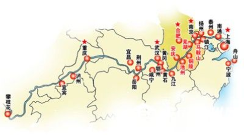
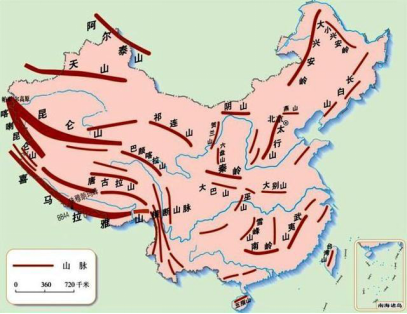

# 2019年福建省选调生考试《行政职业能力测验》

> 常识判断 · 26 题 · 福建 2019

## 第 1 题　qid 4706334 · 科技常识

2018年国家科学技术奖刘永坦、钱七虎，都是因为（    ）做出贡献而获得最高科学技术奖。

- **A**. 航天技术
- **B**. 核物理学
- **C**. 国防科技　✅
- **D**. 热动力学

**答案**：C

**官方解析**

本题考查政治常识。
C项正确，A、B、D三项错误，2019年1月8日上午，中共中央、国务院在北京隆重举行国家科学技术奖励大会，刘永坦、钱七虎获得2018年度国家最高科学技术奖。刘永坦一生胸怀爱国心、强国梦，长期致力于我国对海远程预警技术研究和装备发展。自力更生研制了我国首部全天时、全天候、超视距、海空兼容的海防预警装备，创建了我国新体制超视距探测理论体系，实现了国家海防预警科技的重大原始创新，培育凝聚了一支掌握海防科技主动权的战略创新力量，铸就了捍卫国家领土主权的海防重器，极大拓展了我国的海防战略纵深，为加快建设海洋强国、全面建设社会主义现代化强国作出了突出贡献。钱七虎对国家和国防事业有强烈的使命感和责任感，长期致力于我国防护工程研究与应用。系统建立了从浅埋到深埋、从单体到体系、从常规抗力到超高抗力的工程防护体系，解决了核武器空中、触地、钻地爆炸以及新型钻地弹侵彻爆炸等关键工程防护技术难题，培养造就了一支防护工程领域铸盾强军的国际一流科技创新队伍，确保了我国首脑指挥工程和战略武器洞库等地下工程的安全稳定，对我国国防和人防工程各个时期的建设发展作出了杰出贡献。
故正确答案为C。

---

## 第 2 题　qid 4706341 · 人文常识

迄今世界最长的跨海大桥——港珠澳大桥已正式通车，全长55公里，是中国桥梁在设计、施工、材料研发等各方面成果的集中展示，体现了大国工匠对国家重大工程精雕细琢、精益求精、开拓创新的精神理念。以下哪一个不能体现港珠澳大桥之最（    ）。

- **A**. 钢结构最长
- **B**. 最长海隧道（沉管隧道最长）
- **C**. 最长跨海大桥
- **D**. 公铁共用的路最长　✅

**答案**：D

**官方解析**

本题考查科技常识。
A项正确，港珠澳大桥主体桥梁总用钢量达到了42万吨，是世界钢结构最长的大桥。
B项正确，港珠澳大桥的海底隧道长约6.7公里，是世界最长海隧道。
C项正确，港珠澳大桥全长为49.968公里，是世界最长跨海大桥。
D项错误，平潭海峡公铁大桥位于海坛海峡北口，全长16.323千米，跨海段长11.15千米，是世界最长跨海公铁两用大桥。
本题为选非题，故正确答案为D。

---

## 第 3 题　qid 4706343 · 地理国情

2018年2月7日，罗斯海新站在恩克斯堡岛正式选址奠基，这是中国第五个南极科考站。位于南极三大湾系之一的罗斯海区域沿岸，面向太平洋扇区，是南极地区岩石圈、冰冻圈、生物圈、大气圈等典型自然地理单元集中相互作用的区域，具有重要的科研价值。以下哪一个不是中国已经建成的南极科考站（    ）。

- **A**. 中国南极长城站
- **B**. 中国南极中山站
- **C**. 中国南极黄山站　✅
- **D**. 中国南极昆仑站

**答案**：C

**官方解析**

本题考查科技常识。
A项正确，中国南极长城站是中国在南极建立的第一个科学考察站，位于南极洲南设得兰群岛乔治王岛西部，其地理坐标为南纬62度12分59秒、西经58度57分52秒，于1985年2月20日落成。
B项正确，中国南极中山站建立于1989年2月26日，位于东南极大陆拉斯曼丘陵，地理坐标为南纬69度22分24秒、东经76度22分40秒，是中国第二个南极考察站。
C项错误，中国在南极已经建成的科考站包括中国南极长城站、中国南极中山站、中国南极昆仑站和中国南极泰山站，并没有黄山站。
D项正确，中国南极昆仑站是中国首个南极内陆考察站，地理坐标为南纬80度25分01秒，东经77度06分58秒，位于南极内陆冰盖最高点冰穹A西南方向约7.3公里，是中国继在南极建立长城站、中山站以来，建立的第三个南极考察站。
本题为选非题，故正确答案为C。

---

## 第 4 题　qid 4706354 · 人文常识

“靡不有初，鲜克有终。”实现中华民族伟大复兴，需要一代又一代人为之努力。中华民族创造了具有5000多年历史的灿烂文明，也一定能够创造出更加灿烂的明天。和“靡不有初，鲜克有终”含义不相同的是哪个选项：

- **A**. 行百里者半九十
- **B**. 善始者实繁，克终者盖寡
- **C**. 为之，则难者亦易矣；不为，则易者亦难矣　✅
- **D**. 善妖善老，善始善终

**答案**：C

**官方解析**

本题考查政治常识。
题干所述出自习近平总书记在纪念中国人民抗日战争暨世界反法西斯战争胜利70周年大会上的讲话。“靡不有初，鲜克有终”出自《诗经·大雅》，“靡”的意思是无；“初”的意思是始；“鲜”的意思是少；“克”的意思是能。意思是做事、为人、做官、为政，没有不能好好开头的，却少见能有好好到头的。这句话是提醒人们，善始容易、善终不易，虎头不难、蛇尾常见。
A项正确，“行百里者半九十”最早见于刘向《战国策·秦策五》。原意是走一百里的路程走到九十里只能算走了一半，比喻做事越接近成功越困难，越要认真对待，常用以勉励人做事情要坚持到底不松劲。与题干句子含义相同。
B项正确，“善始者实繁，克终者盖寡”出自唐代大臣魏徵写给唐太宗的奏章《谏太宗十思疏》，意思是国君开头做得好的确实很多，能够坚持到底的大概不多。在现代用来指很多人做同一件事开始做得很好的有很多，但是能坚持到底把一整件事做好的人就很少了。与题干句子含义相同。
C项错误，“为之，则难者亦易矣；不为，则易者亦难矣”出自清代彭端淑的《为学一首示子侄》，意思是只要肯做，那么困难的事情也变得容易了；如果不做，那么容易的事情也变得困难了。劝勉子侄读书求学不要受资昏材庸、资聪材敏的限制，要发挥主观能动性。与题干句子含义不同。
D项正确，“善妖善老；善始善终“出自《庄子·大宗师》，意思是既要好好对待年幼的人，也要好好对待年老的人；做事情要有好的开头，也要有好的结尾。提醒人们要坚持一以贯之、做到不忘初心、有头有尾、全始全终。与题干句子含义相同。
本题为选非题，故正确答案为C。

---

## 第 5 题　qid 4706360 · 地理国情

2018年8月5日10时，福建向金门供水工程正式通水，“两岸一家亲，共饮一江水”愿景成为现实，请问向金门供水的是福建的哪所城市？

- **A**. 厦门
- **B**. 漳州龙海市
- **C**. 泉州惠安市
- **D**. 泉州晋江市　✅

**答案**：D

**官方解析**

本题考查地理国情。
2018年8月5日10时，福建向金门供水工程通水现场会在泉州晋江市举行。福建正式开机向金门供水，金门同胞期盼多年的愿望得以实现，“两岸一家亲、共饮一江水”成为现实。福建向金门供水工程取水于福建第二大天然淡水湖——晋江龙湖。源自晋江山美水库的水，经龙湖抽水泵站抽水输水至围头入海点，再经海底管道输送至金门。输水线路总长约28公里。
故正确答案为D。

---

## 第 6 题　qid 4706355 · 地理国情

2018年12月18日上午，庆祝改革开放40周年大会在人民大会堂举行。100名“改革先锋”称号获得者和10名“中国改革友谊奖章”获得者在大会上受到表彰。福建籍有3人，请问以下哪一个不是福建人（    ）。

- **A**. 钟南山
- **B**. 吴荣男
- **C**. 林毅夫　✅
- **D**. 陈景润

**答案**：C

**官方解析**

本题考查政治常识。
A项正确，钟南山，男，汉族，中共党员，1936年10月出生，福建厦门人，广州医科大学附属第一医院国家呼吸系统疾病临床医学研究中心原主任，中国工程院院士。2003年抗击“非典”中，他不顾生命危险救治危重病人，奔赴疫区指导医疗救治工作，倡导与国际卫生组织合作，主持制定我国“非典”等急性传染病诊治指南，为战胜“非典”疫情作出重要贡献。此外，他主动承担突发公共卫生事件代言人角色，向公众普及卫生知识，积极建言献策推动公共卫生应急体系建设，为夺取应对甲型流感、H7N9禽流感等突发公共卫生事件的胜利发挥了重要作用。他曾两次荣获“全国先进工作者”称号，荣获国家科学技术进步奖一等奖。
B项正确，吴荣南，男，汉族，中共党员，1942年6月出生，福建厦门人，厦门航空有限公司党委原副书记、总经理。他始终以改革创新的精神推动厦航发展，带领厦航从无到有、从弱到强，探索出一条具有厦航特色的发展之路。他率先在中国民航改革重组中实施有偿兼并，实行全员劳动合同制，建立一套完整而科学的现代企业制度。在他的努力下，厦航的发展壮大，被视为中国民用航空体制改革和厦门经济特区改革开放相结合的成果，成为当时全国民航系统“政企合一、航港合一”体制改革的创举。1998年厦航被评为全国民航系统唯一的“金雁杯”三连冠单位，成为福建及厦门特区改革开放的亮丽名片。吴荣南荣获福建省“突出贡献企业家”称号。
C项错误，林毅夫，男，汉族，无党派人士，1952年10月出生，台湾宜兰人，北京大学教授，国务院参事，第十三届全国政协常委、经济委员会副主任，全国工商联原专职副主席，世界银行原高级副行长、首席经济学家。他植根于改革开放实际，自主创立并实践了新结构经济学理论体系，在国际上产生重要影响力；积极推动中非合作新模式，帮助有关发展中国家成功实现经济结构转型；参与创立北京大学南南合作与发展学院，推动了合作转型和深化发展。他荣获“全国先进工作者”“有突出贡献的中青年专家”称号。
D项正确，陈景润，男，汉族，无党派人士，1933年5月出生，1996年3月去世，福建福州人，中国科学院原数学研究所研究员，中国科学院原学部委员。他在逆境中潜心学习，忘我钻研，取得解析数论研究领域多项重大成果；1973年在《中国科学》发表了“1+2”详细证明，引起世界巨大轰动，被公认是对哥德巴赫猜想研究的重大贡献，是筛法理论的光辉顶点，国际数学界称之为“陈氏定理”，至今仍在“哥德巴赫猜想”研究中保持世界领先水平。
本题为选非题，故正确答案为C。

---

## 第 7 题　qid 4706366 · 地理国情

2018年福建省第十六届运动会在福建宁德举行，此次运动会的主题是（    ）。

- **A**. 激情省运  健康福建
- **B**. 相约三都澳  逐梦新时代　✅
- **C**. 八闽新跨越  山海竞风流
- **D**. 绿色省运  清新福建

**答案**：B

**官方解析**

本题考查政治常识。
B项正确，A、C、D三项错误。2018年10月19日20时，福建省第十六届运动会开幕式在福建宁德市举行。这届省运会主题口号为“相约三都澳 逐梦新时代”，是党的十九大之后我省举办的规格最高、规模最大的综合体育盛会。
故正确答案为B。

---

## 第 8 题　qid 4706353 · 人文常识

2018年9月23日，经党中央批准、国务院批复，自2018年起设立“中国农民丰收节”，请问这一天丰收节是指：

- **A**. 立秋
- **B**. 秋分　✅
- **C**. 立暑
- **D**. 白露

**答案**：B

**官方解析**

本题考查政治常识。
B项正确，A、C、D三项错误，“中国农民丰收节”是第一个在国家层面专门为农民设立的节日，于2018年设立（国函〔2018〕80号），节日时间为每年“秋分”。
故正确答案为B。

---

## 第 9 题　qid 4706364 · 科技常识

2019年1月3日上午10点26分，我国嫦娥四号月球探测器不负众望，成功地在月球背面软着陆，有关嫦娥四号说法错误的是（    ）。

- **A**. 中国第一次月球背面软着陆
- **B**. 选择棉花、油菜、土豆、拟南芥、酵母和果蝇六种生物作为样本进行培育
- **C**. 首次证明月球没有水　✅
- **D**. 证实了月幔富含橄榄石的推论的正确性

**答案**：C

**官方解析**

本题考查科技常识。
A项正确，嫦娥四号是中国探月工程二期发射的月球探测器，也是人类第一个着陆月球背面的探测器，于2018年12月8日由长征三号乙运载火箭在西昌卫星发射中心发射升空，于2018年12月12日完成近月制动，被月球捕获，于2019年1月3日在月球背面预选区着陆，嫦娥四号着陆器于2019年1月11日与玉兔二号完成两器互拍工作，实现了人类首次月球背面软着陆和巡视勘察。
B项正确，嫦娥四号在月球上进行的生物科普试验选择了棉花、油菜、土豆、拟南芥、酵母和果蝇六种生物作为样本，将它们的种子和虫卵带到月球上进行培育。根据传回的图片显示，棉花的嫩芽长势良好，这是在经历月球低重力、强辐射、高温差等严峻环境考验后，在月球上长出的第一株植物嫩芽，实现了人类首次月面的生物生长培育实验。
C项错误，嫦娥三号是中国探月工程二期发射的月球探测器，由着陆器和巡视器（“玉兔号”月球车）组成。2013年12月2日，长征三号乙加强型火箭成功将嫦娥三号探测器发射升空；12月14日，嫦娥三号着陆月面，着陆器和巡视器分离；12月15日，嫦娥三号着陆器和巡视器互拍成像，标志着嫦娥三号任务圆满成功。嫦娥三号实现了中国首次地外天体软着陆和巡视探测，嫦娥三号上的月基光学望远镜首次证明月球没有水（此处指的是截至到2016年，嫦娥三号证明月球没有水）。
D项正确，嫦娥四号利用红外成像光谱仪的就位光谱探测数据，成功揭示了月球背面的物质组成，验证了月幔富含橄榄石，加深了人类对月球形成与演化的认识。
本题为选非题，故正确答案为C。

---

## 第 10 题　qid 4706362 · 人文常识

她一生亲自接生了5万多婴儿，被称为“万婴之母”，堪称中国版的特蕾莎修女。请问被称为“万婴之母”的是（    ）。

- **A**. 林巧稚　✅
- **B**. 乐以成
- **C**. 凌筱瑛
- **D**. 苏祖斐

**答案**：A

**官方解析**

本题考查政治常识。
A项正确，B、C、D三项错误，林巧稚是一名医学家，在胎儿宫内呼吸、女性盆腔疾病、妇科肿瘤、新生儿溶血症等方面的研究做出了贡献，是中国妇产科学的主要开拓者、奠基人之一。她是北京协和医院第一位中国籍妇产科主任及首届中国科学院唯一的女学部委员（院士），虽然一生没有结婚，却亲自接生了5万多婴儿，被尊称为“万婴之母”“生命天使”“中国医学圣母”，又与梁毅文被合称为“南梁北林”。2019年9月25日，她被评选为“最美奋斗者”。
故正确答案为A。

---

## 第 11 题　qid 4706373 · 人文常识

某男按当地习俗，向某女支付了结婚彩礼现金10万元及金银首饰数件，婚后不久，某男即主张离婚并要求返还彩礼。关于该彩礼的返还，下列选项说法正确的是（    ）。

- **A**. 因双方已办理结婚登记，故不能主张返还
- **B**. 某男主张彩礼返还，不以双方离婚为条件
- **C**. 已办理结婚登记，未共同生活的，可主张返还　✅
- **D**. 已办理结婚登记，并已共同生活的，仍可主张返还

**答案**：C

**官方解析**

本题考查法律常识。
根据《最高人民法院关于适用〈中华人民共和国民法典〉婚姻家庭编的解释（一）》中第五条规定：“当事人请求返还按照习俗给付的彩礼的，如果查明属于以下情形，人民法院应当予以支持：（一）双方未办理结婚登记手续；（二）双方办理结婚登记手续但确未共同生活；（三）婚前给付并导致给付人生活困难。适用前款第二项、第三项的规定，应当以双方离婚为条件。”
A项错误，即使双方办理结婚登记，在离婚时符合上述规定第二项、第三项规定的情形时仍可以要求返还彩礼。
B项错误，题中男女双方已登记结婚，某男要求返还彩礼应以离婚为条件。
C项正确，题中男女双方如果未共同生活，某男可以依据上述规定第二项要求返还彩礼。
D项错误，题中男女双方如果共同生活后，某男不得主张返还彩礼。
故正确答案为C。

---

## 第 12 题　qid 4706380 · 人文常识

朋友圈是当下最潮的生活方式，假如古人也有朋友圈，以下哪一个可能给李白的朋友圈点赞（    ）。

- **A**. 阎立本
- **B**. 狄仁杰
- **C**. 白居易
- **D**. 王昌龄　✅

**答案**：D

**官方解析**

本题考查人文常识。
李白（701年—762年12月），字太白，号青莲居士，又号“谪仙人”，唐代伟大的浪漫主义诗人，被后人誉为“诗仙”，与杜甫并称为“李杜”。
A项错误，阎立本（601年—673年），唐朝时期宰相、画家。阎立本擅长工艺，富于巧思，工篆隶书，对绘画、建筑都很擅长。代表作品《步辇图》《历代帝王像》等。故阎立本不可能给李白的朋友圈点赞。
B项错误，狄仁杰（630年－700年），字怀英，唐代政治家、武周时期的宰相。狄仁杰著有文集十卷，《家范》一卷。此外，《全唐诗》、《全唐文》等文集还收录有他的诗词、奏疏、文告等作品。故狄仁杰不可能给李白的朋友圈点赞。
C项错误，白居易（772年－846年），字乐天，号香山居士，又号醉吟先生，是唐代伟大的现实主义诗人，有“诗魔”和“诗王”之称。代表诗作有《长恨歌》《卖炭翁》《琵琶行》等。故白居易不可能给李白的朋友圈点赞。
D项正确，王昌龄（698年—757年），字少伯，唐朝时期大臣，著名边塞诗人。其诗以七绝见长，尤以边塞诗最为著名，有“诗家夫子”、“七绝圣手”之称。故王昌龄可能给李白的朋友圈点赞。
故正确答案为D。

---

## 第 13 题　qid 2042296 · 人文常识

下列现象对应的光学原理错误的是：

- **A**. 汽车后视镜扩大驾驶员视野——折射　✅
- **B**. 雨夜路灯出现一圈圈的光环——色散
- **C**. 看立体电影需戴上特殊眼镜——偏振
- **D**. 使用闪光灯拍照时出现红眼——反射

**答案**：A

**官方解析**

A项错误，汽车后视镜利用光的反射原理观察车后情况，同时利用凸面镜对光有发散作用的原理，可以扩大视野，从而更好地注意到后方车辆的情况。而光的折射是光从一种介质斜射入另一种介质时，传播方向发生改变，从而使光线在不同介质的交界处发生偏折。
B项正确，色散是指白色的复合光（如阳光），经过介质被折射，形成单色光的现象。雨天水雾笼罩着路灯，灯光发射出来，发生了色散，不同颜色的光线被分开，从而形成五颜六色的光环。 
C项正确，偏振式3D技术是利用光线有“振动方向”的原理来分解原始图像的，它先把图像分为垂直向偏振光和水平向偏振光两组画面，3D眼镜左右镜片分别采用不同偏振方向的偏光镜片，这样人的左右眼就能接收到两组画面，再经过大脑合成立体影像。 
D项正确，当人长时间地待在较黑暗的环境中，瞳孔为适应视觉需要而放大，这 时如果闪光灯的位置与人的眼睛一般高低，被拍摄者又是正面对着镜头，瞳孔与闪光灯处于同一直线上。那么，在拍摄时，当闪光灯的强光照射到眼睛时，就会直射视网膜，其红色的反射光就很有可能进入相机的拍摄视角，从而产生“红眼”。
本题为选非题，故正确答案为A。

---

## 第 14 题　qid 4706387 · 人文常识

以下哪一个不属于宋代四大书院（    ）。

- **A**. 岳麓书院
- **B**. 东林书院　✅
- **C**. 应天书院
- **D**. 白鹿洞书院

**答案**：B

**官方解析**

本题考查人文常识。
北宋四大书院为衡阳石鼓书院、江西庐山白鹿洞书院、湖南长沙岳麓书院、河南商丘应天书院。
A项正确，岳麓书院是中国历史上赫赫闻名的四大书院之一，坐落于湖南长沙湘江西岸的岳麓山脚下。北宋开宝九年，潭州太守朱洞在僧人办学的基础上，由官府捐资兴建，正式创立岳麓书院。北宋祥符八年，宋真宗召见岳麓山长周式，御笔赐书“岳麓书院”四字门额。
B项错误，东林书院创建于北宋政和元年，是当时知名学者杨时长期讲学的地方。后废。明朝万历三十二年（1604年），由东林学者顾宪成等人重兴修复并在此聚众讲学，他们倡导“读书、讲学、爱国”的精神，引起全国学者普遍响应，一时声名大著。东林书院成为江南地区人文荟萃之区和议论国事的主要舆论中心。
C项正确，应天府书院又称应天书院、睢阳书院，位于河南省商丘市睢阳区商丘古城南湖畔，是中国古代著名的四大书院之一，史载“州郡置学始于此”。北宋大中祥符二年，宋真宗改升应天书院为府学，称为“应天府书院”，并正式赐额“应天府书院”。
D项正确，白鹿洞书院，位于江西省九江市庐山五老峰南麓，享有“海内第一书院”之誉。始建于南唐升元年间，李善道、朱弼等人在白鹿书院置田聚徒讲学，称为“庐山国学”。宋初，扩为书院，与睢阳、石鼓、岳麓并称四大书院。
本题为选非题，故正确答案为B。

---

## 第 15 题　qid 4706431 · 人文常识

以下按照时间节点，排序正确的是：

- **A**. 
从实行家庭联产承包农村承包地“三权”分置乡镇企业异军突起取消农业税牧业税和特产税打赢脱贫攻坚战实施乡村振兴战略

- **B**. 
从实行家庭联产承包乡镇企业异军突起取消农业税牧业税和特产税农村承包地“三权”分置打赢脱贫攻坚战实施乡村振兴战略
　✅
- **C**. 
从实行家庭联产承包取消农业税牧业税和特产税乡镇企业异军突起农村承包地“三权”分置打赢脱贫攻坚战实施乡村振兴战略

- **D**. 
从实行家庭联产承包乡镇企业异军突起农村承包地“三权”分置取消农业税牧业税和特产税实施乡村振兴战略打赢脱贫攻坚战

**答案**：B

**官方解析**

本题考查政治常识。

“实行家庭联产承包”指1978年开始的家庭联产承包责任制，1978年安徽、四川一些农村，开始实行包产到组、包产到户的农业生产责任制。这种责任制使农民有了生产和分配的自主权，克服过去分配中的平均主义弊端，极大调动了农民的生产积极性。这种生产责任制的经营方式得到中央的肯定。不久，在全国普遍实行以家庭承包经营为主要形式的责任制。

“农村承包地‘三权’分置”是2014年印发的《关于引导农村土地经营权有序流转发展农业适度规模经营的意见》中提出的，在2016年的《关于完善农村土地所有权承包权经营权分置办法的意见》通知则要求各地区结合当地实际落实。“三权”分置将农村土地产权中的土地承包经营权进一步划分为承包权和经营权，实行所有权、承包权、经营权分置并行，这一意见的出台是继家庭联产承包责任制后农村改革又一重大制度创新。

“乡镇企业异军突起”：1987年，乡镇企业发展到1750多万个，年总产值4764亿元，占农村社会总产值的50.4%，第一次超过了农业总产值，其中工业产值占全国工业总产值的1/4。乡镇企业从业人员达到近9000万人，实现税利640多亿元，其中上交国家税金185亿元，占全国各种税收比重的8.7%。随着乡镇企业的发展，兴起了一大批小城镇。这为缩小工农差距创出了一条新路。正是在这种情况下，邓小平作出了关于乡镇企业“异军突起”的论断。

“取消农业税牧业税和特产税”：2005年12月29日，十届全国人大常委会第十九次会议高票通过决定，自2006年１月１日起废止《农业税条例》，取消除烟叶以外的农业特产税、全部免征牧业税。从2006年起，中国全面取消农业税，比原定用五年时间取消农业税的时间表，整整提前了三年。

“打赢脱贫攻坚战”：2015年11月23日，中共中央政治局审议通过《关于打赢脱贫攻坚战的决定》。《决定》提出的目标是，到2020年，稳定实现农村贫困人口不愁吃、不愁穿，义务教育、基本医疗和住房安全有保障。实现贫困地区农民人均可支配收入增长幅度高于全国平均水平，基本公共服务主要领域指标接近全国平均水平。确保我国现行标准下农村贫困人口实现脱贫，贫困县全部摘帽，解决区域性整体贫困。

“实施乡村振兴战略”是习近平同志2017年10月18日在党的十九大报告中提出的战略。十九大报告指出，农业农村农民问题是关系国计民生的根本性问题，必须始终把解决好“三农”问题作为全党工作的重中之重，实施乡村振兴战略。

故按照时间节点排列正确的是：从实行家庭联产承包乡镇企业异军突起取消农业税牧业税和特产税农村承包地“三权”分置打赢脱贫攻坚战实施乡村振兴战略。

故正确答案为B。

---

## 第 16 题　qid 4706389 · 人文常识

下列诗句与所代表的节日对应错误的是：(    )

- **A**. 月色灯山满帝都，香车宝盖隘通衢。——元宵节
- **B**. 春城无处不飞花，寒食东风御柳斜。——清明节
- **C**. 彩线轻缠红玉臂，小符斜挂绿云鬟。——端午节
- **D**. 他乡共酌金花酒，万里同悲鸿雁天。——中秋节　✅

**答案**：D

**官方解析**

本题考查人文常识。
A项正确，该句出自唐代李商隐的《观灯乐行》，意为帝王之都，到处月光如水，花灯如山，装饰华丽的香艳的马车堵塞了宽敞大道。描写了元宵节的场景。
B项正确，该句出自唐代韩翃的《寒食》，意为暮春时节，长安城处处柳絮飞舞、落红无数，寒食节东风吹拂着皇家花园的柳枝。寒食节在清明节前一到两天，本为两个节日，但由于日期相邻，逐渐合二为一。
C项正确，该句出自宋代苏轼的《浣溪沙·端午》，意为将那五彩花线轻轻地缠在玉色手臂上，小小的符篆斜挂在发髻上。缠线、挂符活动为端午节习俗。
D项错误，该句出自唐代卢照邻的《九月九日登玄武山》，意为身在他乡我们一起喝下这菊花酒，我们离家万里，望着大雁飞过的天空，心中有着一样的悲伤。饮菊花酒是重阳节的习俗。
本题为选非题，故正确答案为D。

---

## 第 17 题　qid 2033528 · 人文常识

关于成语或俗语所揭示的声学、热学现象，下列表述错误的是：

- **A**. 长啸一声，山鸣谷应：声音在山谷之间发生多次反射，形成回声
- **B**. 曲高和寡：频率越大，所发声音的音调越高，能跟着唱的人越少
- **C**. 瑞雪兆丰年：雪覆盖在农作物上面，防止热传导和空气对流，起到保温作用
- **D**. 弦外之音：声音在传播过程中，会发生衍射，所以有些声音我们听不到　✅

**答案**：D

**官方解析**

本题考查科技常识。
A项正确：“长啸一声，山鸣谷应”是回声现象，声音遇到障碍物会被反射回来。具体说是声音的反射现象，声音从人口中啸出会经过多次反射，而每次反射都会有一部分进入你的耳朵，所以山反射的像是山在回应，谷反射的像是谷在回应。
B项正确：“曲高和寡”的字面意思是乐曲的音调越高，能跟着唱的人就越少。曲高指的是音乐的音调高，音调就是指声音的高低，频率是指发声体一秒钟振动的次数。音调主要由声音的频率决定，同时也与声音强度有关。对一定强度的纯音，音调随频率的升降而升降；对一定频率的纯音、低频纯音的音调随声强增加而下降，高频纯音的音调却随强度增加而上升。
C项正确：“瑞雪兆丰年”的科学道理是，对于北方来说，秋季种的冬小麦，在冬天里，如果下雪的话，雪不易融化，盖在土壤上的雪是比较松软的，雪花和雪花之间留有空隙，空隙中充满空气，空气又具有不良的热传导特性，这样就像给庄稼盖了一条棉被，外面天气再冷，下面的温度也不会降得很低，起到一种保温作用。
D项错误：“弦外之音”原指音乐的余音，比喻言外之意，即在话里间接透露，而不是明说出来的意思。用物理常识来解释就是指人的听觉频率范围之外的（如超声、次声）确实存在且我们是听不到的声音。声衍射是指声波传播过程中遇到障碍物时，部分声波会绕至障碍物背后并继续向前传播的一种现象，又称声绕射。衍射和听不到之间没有因果关系。
本题为选非题，故正确答案为D。

---

## 第 18 题　qid 4706398 · 人文常识

下列哪项运动与其他三项运动动能与势能转换不同？

- **A**. 射箭
- **B**. 蹦床
- **C**. 铁饼　✅
- **D**. 跳高

**答案**：C

**官方解析**

本题考查科技常识。
动能是指物体因运动而具有的能量，重力势能是物体因被抬高而具有的能量，弹性势能是物体因为弹性形变而具有的能量。
A项正确，射箭的过程是利用弹性势能转化为动能和势能。
B项正确，蹦床的过程是利用弹性势能转化为动能和势能。
C项错误，掷铁饼的过程是利用掷铁饼时所具有的惯性。
D项正确，跳高的过程是利用弹性势能转化为动能和势能。
本题为选非题，故正确答案为C。

---

## 第 19 题　qid 2274529 · 人文常识

作为热带海洋和大气共同作用的产物，拉尼娜现象指的是：

- **A**. 赤道太平洋东部和中部海面温度持续异常偏冷　✅
- **B**. 赤道太平洋东部和中部海面温度持续异常偏热
- **C**. 赤道太平洋西部和中部海面温度持续异常偏冷
- **D**. 赤道太平洋西部和中部海面温度持续异常偏热

**答案**：A

**官方解析**

本题考查地理国情。
拉尼娜现象是赤道太平洋东部和中部海面温度持续异常偏冷的现象。拉尼娜（西班牙语原意“圣女”）是厄尔尼诺现象的反相，也称为“反厄尔尼诺现象”或“冷事件”。是热带海洋与大气共同作用的产物。东南信风将表面被太阳晒热的海水吹向太平洋西部，致使西部比东部海平面增高将近60厘米，东部底层海水上翻，致使太平洋东部和中部海水变冷。
故正确答案为A。

---

## 第 20 题　qid 2274527 · 人文常识

地球可视为一个大磁体，地磁场是指地球内部存在的天然磁性现象。下列现象或应用与地磁场无关的是：

- **A**. 北宋时期发明的指南针
- **B**. 鸽子识归巢，候鸟辨迁途
- **C**. 使用核磁共振断层成像装置诊断疾病　✅
- **D**. 极光大多出现在地理南北极附近上空

**答案**：C

**官方解析**

本题考查地理国情。地磁场是指地球内部存在的天然磁性现象。地球可视为一个磁偶极，其中一极位于地理北极附近，另一极位于地理南极附近。
A项正确，指南针是中国古代四大发明之一。早在战国时期，人们已发现磁铁在地球磁场中的南北指极性能，因而利用天然磁石制成司南。北宋时，人们发明了指南鱼及指南针，并应用于航海。指南针即于12世纪末、13世纪初由海路传入阿拉伯，再由阿拉伯传入欧洲。
B项正确，鸽子、候鸟等动物能够“识归巢”、“辨迁途”，在旅行中测定精确的位置，主要是通过地球磁场、太阳及其他星体的位置来辨别方向。
C项错误，核磁共振断层成像是断层成像的一种，它是通过对人体施加某种特定频率的射频脉冲，使人体中的氢原子核受到激发而发生磁共振现象，并重建出人体信息，从而诊断疾病。其与地磁场无关。
D项正确，极光是南北极地区特有的一种大气发光现象。极光与地球高空大气和地磁场的大规模相互作用有关，也与太阳喷发出来的高速带电粒子流有关。
本题为选非题，故正确答案为C。

---

## 第 21 题　qid 2274525 · 地理国情

长江是我国第一大江，沿长江发展形成了许多城市。以下城市中，不在长江边的是：

- **A**. 宜昌
- **B**. 南京
- **C**. 九江
- **D**. 长沙　✅

**答案**：D

**官方解析**

本题考查地理国情。

由下图可知，宜昌、南京、九江分别位于长江边，而长沙位于湖南省东部偏北，长江南部，并非位于长江边。

本题为选非题，故正确答案为D。

---

## 第 22 题　qid 2274587 · 人文常识

下列关于中国古代著名科技文献的说法中，错误的是：

- **A**. 《授时历》——元代郭守敬等天文学家修订的历法
- **B**. 《营造法式》——我国古代最完整的建筑技术书籍
- **C**. 《伤寒杂病论》——药王孙思邈确立了中医临床基本原则　✅
- **D**. 《天工开物》——世界上第一部关于农业和手工业生产的综合性著作

**答案**：C

**官方解析**

本题考查科技常识。
A项正确，《授时历》是元代颁行的历法，由元代天文学家郭守敬等人在科学观测的基础上，参考历代历法修订而成，是我国古代优秀的历法。
B项正确，《营造法式》是宋代李诫在两浙工匠喻皓《木经》的基础上编成的，是北宋官方颁布的一部建筑设计、施工的规范书。《营造法式》是我国古代最完整的建筑技术书籍，标志着我国古代建筑已经发展到了较高阶段。
C项错误，《伤寒杂病论》是由东汉张仲景撰写的一部医学专著。从辨症、立法、拟方、用药等各个环节，建立了完整的医疗原则。所以此书并不是药王孙思邈所著，孙思邈的代表作是《千金方》。
D项正确，《天工开物》是世界上第一部关于农业和手工业生产的综合性著作，是我国古代一部综合性的科学著作，作者是明朝的宋应星。外国学者称它为“中国17世纪的工艺百科全书”。
本题为选非题，故正确答案为C。

---

## 第 23 题　qid 2402765 · 地理国情

关于我国山脉走向对应错误的是（    ）。

- **A**. 弧形走向——喜马拉雅山
- **B**. 东西走向——六盘山　✅
- **C**. 西北—东南走向——祁连山
- **D**. 东北—西南走向——武夷山

**答案**：B

**官方解析**

本题考查地理常识。

A项正确，喜马拉雅山脉分布在我国西藏自治区和巴基斯坦、印度、尼泊尔、锡金、不丹的边境，大致为东西走向并向南凸出，略呈弧形。

B项错误，六盘山屹立在宁夏南端及宁、陕、甘交界地带，是我国主要的南北走向山地之一。

C项正确，祁连山脉位于中国青海省东北部与甘肃省西部边境，由多条西北—东南走向的平行山脉和宽谷组成。因位于河西走廊南侧，又名南山。

D项正确，武夷山位于福建、江西两省边境。北连仙霞岭，南接九连山，呈东北—西南走向。

本题为选非题，故正确答案为B。

---

## 第 24 题　qid 24455 · 经济常识

关于中国交通建设，下列说法不正确的是：

- **A**. 目前国道线采用数字编号，分别以1、2、3、4开头　✅
- **B**. 我国自建的第一条铁路——京张铁路由詹天佑主持设计修建
- **C**. 20世纪50年代，新中国第一架自制飞机在南昌试飞成功
- **D**. 宋元时期的泉州港是当时世界上最大的贸易港口之一

**答案**：A

**官方解析**

本题考查地理国情。
A项错误，中国国道采用数字编号，分为四种编号方式，第一类是放射状的，这些公路排序都是“1”字开头；第二类是南北向的，以“2”字开头；第三类是东西向的，以“3”字开头，第四类是“五纵七横”主干线，以“0”字开头。B、C、D三项均正确。
本题为选非题，故正确答案为A。

---

## 第 25 题　qid 24511 · 人文常识

下列有关地震的表述，不正确的是：

- **A**. 2008年四川汶川地震是我国自1949年以来破坏性最强、波及范围最广的一次地震
- **B**. 我国位于世界两大地震带——环太平洋地震带与欧亚地震带之间
- **C**. 我国的地震带主要分布在台湾、西南、西北、华北、东南沿海等五个区域
- **D**. 震源的深度越浅，地震破坏力越大，波及范围也越广　✅

**答案**：D

**官方解析**

本题考查地理国情。
A、B、C三项正确。D项错误，震中到震源的距离叫作震源深度。通常震源深度小于60公里的叫浅源地震，震源深度在60~300公里的叫中源地震，深度大于300公里的叫深源地震。对于同样大小的地震，由于震源深度不一样，对地面造成的破坏程度也不一样。震源的深度越浅，破坏力越大，但波及范围也越小，反之亦然。
本题为选非题，故正确答案为D。

---

## 第 26 题　qid 24553 · 人文常识

下列有关书法艺术的表达，正确的是：

- **A**. 东汉著名书法家张芝被称为“书圣”
- **B**. 唐代书法家颜真卿是楷书四大家之一　✅
- **C**. 《真书千字文》是唐代著名书法家怀素的代表作
- **D**. “苏、黄、米、蔡”中的“黄”指的是黄公望

**答案**：B

**官方解析**

本题考查人文常识。
A项错误，被称为“书圣”的是东晋书法家王羲之；
B项正确，“楷书四大家”指的是唐朝的欧阳询（欧体）、颜真卿（颜体）、柳公权（柳体）和元朝的赵孟頫（赵体）；
C项错误，《真书千字文》是南朝陈与隋朝间僧人智永的代表作；
D项错误，“苏、黄、米、蔡”即书法宋四家，指的是苏轼、黄庭坚、米芾、蔡襄四人，黄公望为元代大画家。
故正确答案为B。

---
