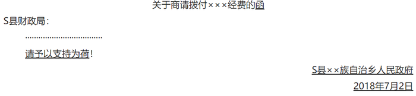

# 2019年贵州省选调高校优秀毕业生到基层工作考试《行测》试题（网友回忆版）

> 常识判断 · 12 题 · 选调 2019

## 第 1 题　qid 2377033 · 人文常识

新形势下党的思想宣传工作使命任务是：

- **A**. 举旗帜、聚民心、育新人、兴文化、展形象　✅
- **B**. 树新风、育新德、兴产业、建形象、顺民心
- **C**. 聚民声、育思想、兴文化、树新风、富产业
- **D**. 聚民心、顺时代、树新风、讲美德、育新人

**答案**：A

**官方解析**

本题考查政治常识。
2018年8月21日至22日在北京召开全国宣传思想工作会议。中共中央总书记、国家主席、中央军委主席习近平出席会议并发表重要讲话。他强调，完成新形势下宣传思想工作的使命任务，必须以新时代中国特色社会主义思想和党的十九大精神为指导，增强“四个意识”、坚定“四个自信”，自觉承担起举旗帜、聚民心、育新人、兴文化、展形象的使命任务，坚持正确政治方向，在基础性、战略性工作上下功夫，在关键处、要害处下功夫，在工作质量和水平上下功夫，推动宣传思想工作不断强起来，促进全体人民在理想信念、价值理念、道德观念上紧紧团结在一起，为服务党和国家事业全局作出更大贡献。
故正确答案为A。

---

## 第 2 题　qid 2377180 · 科技常识

下列哪一选项不属于我国在2018年取得的成就？

- **A**. 港珠澳大桥正式通车
- **B**. 实现了人类首次肺脏再生
- **C**. “慧眼”硬X射线调制望远镜正式投入使用
- **D**. 诞生世界上首台超越早期经典计算机的光量子计算机　✅

**答案**：D

**官方解析**

本题考查政治常识。
A项正确，2018年10月23日上午，港珠澳大桥开通仪式在广东省珠海市举行。中共中央总书记、国家主席、中央军委主席习近平出席仪式，宣布大桥正式开通并巡览大桥。
B项正确，2018年2月12日，同济大学医学院左为教授团队在国际上率先利用成年人体肺干细胞移植技术，在临床上成功实现了人类肺脏再生。这一成果近日以封面文章形式发表于最新一期《蛋白质与细胞》杂志，标志着人体自身内脏器官的再生正逐步从实验室理论走向临床现实。
C项正确，“慧眼”硬X射线调制望远镜卫星是我国首颗X射线天文卫星。2018年1月30日，中国首颗X射线天文卫星“慧眼”正式交付，投入使用。
D项错误，2017年5月3日，中国科学技术大学潘建伟教授及其同事陆朝阳、朱晓波等，联合浙江大学王浩华教授研究组，成功构建了世界首台超越早期经典计算机的光量子计算机。
本题为选非题，故正确答案为D。

---

## 第 3 题　qid 2377181 · 法律常识

6岁的小凡身高1.05米，某日他瞒着父母独自去商场购买4000元的平板电脑。当天，其父母将一切完好的平板电脑退还并要求退还全款。商场以“电子商品一经使用，只换不退”为由拒绝。根据相关法律，下列说法正确的是：

- **A**. 
商场既不用退货退款，也不用换货

- **B**. 
商场做法正确，电子产品只换不退

- **C**. 
商场做法缺少法律依据，应全额退款
　✅
- **D**. 
商场应收取平板电脑原价50的折旧费

**答案**：C

**官方解析**

本题考查法律常识。
《民法典》第二十条规定：“不满八周岁的未成年人为无民事行为能力人，由其法定代理人代理实施民事法律行为。”《民法典》第一百四十四条规定：“无民事行为能力人实施的民事法律行为无效。”《民法典》第一百五十七条规定：“民事法律行为无效、被撤销或者确定不发生效力后，行为人因该行为取得的财产，应当予以返还；不能返还或者没有必要返还的，应当折价补偿。有过错的一方应当赔偿对方由此所受到的损失；各方都有过错的，应当各自承担相应的责任。法律另有规定的，依照其规定。”在本案中，6岁的小凡属于无民事行为能力人，他购买4000元平板电脑的行为是无效的。小凡的父母将完好无损的平板电脑带到商场，要求退还的要求符合法律规定。因此，商场的做法缺乏法律依据，应全额退款。
故正确答案为C。

---

## 第 4 题　qid 2377035 · 人文常识

下列选项释义错误的是：

- **A**. 驽：性烈但跑得快的马　✅
- **B**. 驷：套有四匹马的车
- **C**. 驹：小马、少壮的马
- **D**. 骥：好马、千里马

**答案**：A

**官方解析**

本题考查人文常识。
A项错误，驽，读音nú，指劣马，走不快的马，比喻愚钝无能。
B项正确，驷，读音sì，古代同驾一辆车的四匹马；或套有四匹马的车。
C项正确，驹，读音jū，指两岁以下的小马，少壮的骏马。也比喻少年英俊的人。
D项正确，骥，读音jì，本意指好马，一种能一日行千里的良马，比喻贤能。
本题为选非题，故正确答案为A。

---

## 第 5 题　qid 2377026 · 地理国情

男子足球国际比赛中，人们常结合各国的历史、地理、文化等因素，给予参赛队伍别称。据此，下列别称与其国家对应不恰当的是：

- **A**. 阿根廷：潘帕斯雄鹰
- **B**. 英格兰：三狮军团
- **C**. 意大利：高卢雄鸡　✅
- **D**. 伊朗：波斯铁骑

**答案**：C

**官方解析**

本题考查人文常识。
A项正确，潘帕斯是南美洲阿根廷最大草原，草原上生活着一种雄鹰，十分凶猛，由此大家都称阿根廷男子足球队是潘帕斯雄鹰，来赞美它的强大。
B项正确，英格兰男子足球国家队队徽是由三头狮子及十朵蔷薇花组成。因此，三狮军团也就成为英格兰男子足球国家队的昵称。
C项错误，高卢是法国古称，高卢雄鸡是法国第一共和国时代国旗上的标志，是当时法国人民的革命意识的象征，在国际男足比赛中，高卢雄鸡也被称为法国国家足球队的绰号。而意大利国家男子足球队的别称为蓝衣军团。
D项正确，伊朗是文明古国，在公元前550年，建立了世界历史上第一个领土横跨欧亚非三大洲的帝国——波斯帝国，在国际男足比赛中，波斯铁骑也被称为伊朗国家足球队的绰号。
本题为选非题，故正确答案为C。

---

## 第 6 题　qid 2377032 · 科技常识

下列对各种现象（行为）原理解释错误的是：

- **A**. 百炼成钢——经高温，铁中的碳和氧气反应生成二氧化碳，其含碳量降低
- **B**. 雨后彩虹——阳光射到空中接近球形的水滴，造成散射及干涉　✅
- **C**. 热胀冷缩——分子空隙随温度升高而变大，随温度降低而缩小
- **D**. 煽风点火——扇动扇子使空气流通，为火焰燃烧补充氧气

**答案**：B

**官方解析**

A项正确，百炼成钢的主要反应原理是利用氧化还原反应，在高温下，铁中的碳和氧气反应生成二氧化碳，即用氧化剂把生铁里过多的碳和其它杂质氧化成气体或炉渣除去。炼钢时常用的氧化剂是空气、纯氧气或氧化铁，通过氧化反应降低碳含量。
B项错误，雨后彩虹是太阳光沿着一定角度射入空气中的水滴所引起的比较复杂的由折射和反射造成的一种色散现象。阳光射入水滴时会同时以不同角度入射，在水滴内亦以不同的角度反射。当中以40至42度的反射最为强烈，造成我们所见到的彩虹。阳光进入水滴，先折射一次，然后在水滴的背面反射，最后离开水滴时再折射一次，总共经过一次反射两次折射。因为水对光有色散的作用，不同波长的光的折射率有所不同。
C项正确，热胀冷缩是指物体受热时会膨胀，遇冷时会收缩的特性。而物体热胀冷缩的实质是物质的分子间隙受温度影响而变化。由于分子是不断运动的，温度越高，运动越快，分子之间有间隔，温度越高，间隔越大，反之，则间隔变小。
D项正确，燃烧是可燃物和氧发生激烈的氧化反应，无论固体、液体都是从表面开始燃烧，即在游离状态物质元素与氧混合，在达到适宜浓度的时候燃烧最为激烈，风吹过来会带来更多的氧气，从而起到助燃的作用。 
本题为选非题，故正确答案为B。

---

## 第 7 题　qid 2377044 · 人文常识

19世纪60年代，某运河通航。当时，某作家赞叹其“是在一个有着5000多年文明的国家开通的，东方伟大之航道”。据此可知，其描述的是：

- **A**. 伊利运河
- **B**. 巴拿马运河
- **C**. 苏伊士运河　✅
- **D**. 曼彻斯特运河

**答案**：C

**官方解析**

本题考查地理国情。
A项错误，伊利运河是美国历史上著名的运河。于1817年国家立法机关通过建立，1825年10月25日通航。它通过哈得逊河将北美五大湖与纽约市连接起来，属于纽约州运河系统。运河对上中西部发展的影响不次于它对纽约市发展的影响。因此伊利运河通航时间并非19世纪60年代。排除。
B项错误，巴拿马运河由美国建造完成，1914年开始通航。该运河位于中美洲国家巴拿马，横穿巴拿马地峡，连接太平洋和大西洋，是重要的航运要道，被誉为世界七大工程奇迹之一的“世界桥梁”。因此巴拿马运河通航时间并非19世纪60年代。排除。
C项正确，苏伊士运河1869年修筑通航。在埃及贯通苏伊士地峡，沟通地中海与红海，提供从欧洲至印度洋和西太平洋附近土地的最近航线。该运河是世界使用最频繁的航线之一，也是亚洲与非洲的交界线，是亚洲与非洲、欧洲人民来往的主要通道。
D项错误，曼彻斯特运河1885年开工建设，1894年通航。是英国英格兰西北部的运河。从东哈姆到曼彻斯特，有5个船闸，可通海轮。由默西河和伊尔韦尔河供水。因此曼彻斯特运河通航时间并非19世纪60年代。排除。
故正确答案为C。

---

## 第 8 题　qid 2376948 · 科技常识

下列关于维生素的说法错误的是：

- **A**. 人体无法完全依靠自身合成维生素，食物是人类获取维生素的主要来源
- **B**. 维生素E、K的重要作用分别是抗氧化、延缓衰老和维持视力、免疫力　✅
- **C**. 维生素可分为水溶性维生素和脂溶性维生素，维生素D属于后者
- **D**. 新鲜的西红柿、猕猴桃、辣椒等果蔬含有丰富的维生素C

**答案**：B

**官方解析**

本题考查生物常识。需结合具体选项予以分析。

A项正确，研究发现，早在40亿年以前，维生素对原始生物来说就已经必不可少了。原始生命可以自己合成维生素，但有些物种却失去了这样的能力——比如人类，无法完全依靠自身合成维生素，必须依靠其他物种才能取得维生素，通过阳光照射在裸露皮肤上，可以刺激皮肤合成维生素D。新鲜水果和蔬菜是人类获取维生素的主要食物来源。

B项错误，维生素E能抗氧化、保护机体细胞免受自由基的毒害，延缓衰老、有效减少皱纹的产生，保持青春的容貌；维生素K主要功能为促进血液正常凝固。维持视力、免疫力的是维生素A。

C项正确，维生素是个庞大的家族，现阶段所知的维生素就有几十种，大致可分为脂溶性和水溶性两大类。维生素D为类固醇衍生物，属于脂溶性维生素。

D项正确，维生素C的主要食物来源是新鲜蔬菜与水果。《中国食物成分表2012修正版》中记录，每100新鲜的西红柿、猕猴桃、辣椒分别含维生素C的量为19、62、144。

本题为选非题，故正确答案为B。

---

## 第 9 题　qid 2377031 · 人文常识

加快生态文明体制改革，建设美丽中国必须要坚持的方针是：

- **A**. 节约优先、保护优先、自然恢复为主　✅
- **B**. 预防为主、治理优先、兼顾经济发展
- **C**. 节流为主、兼顾开源、环境友好优先
- **D**. 保护优先、保障发展、全区统筹为主

**答案**：A

**官方解析**

本题考查政治常识。
党的十九大报告指出：“加快生态文明体制改革，建设美丽中国。我们要建设的现代化是人与自然和谐共生的现代化，既要创造更多物质财富和精神财富以满足人民日益增长的美好生活需要，也要提供更多优质生态产品以满足人民日益增长的优美生态环境需要。必须坚持节约优先、保护优先、自然恢复为主的方针，形成节约资源和保护环境的空间格局、产业结构、生产方式、生活方式，还自然以宁静、和谐、美丽。”因此，A项正确，BCD项错误。
故正确答案为A。

---

## 第 10 题　qid 2377049 · 人文常识

以下公文划横线部分有<b>错误</b>的是：

- **A**. 函
- **B**. 请予以支持为荷
- **C**. 2018年7月2日
- **D**. S县××族自治乡人民政府　✅

**答案**：D

**官方解析**

本题考查公文写作与处理。
A项正确，根据《党政机关公文处理工作条例》第八条的规定，函适用于不相隶属机关之间商洽工作、询问和答复问题、请求批准和答复审批事项。本题为乡人民政府给县财政局发公文商请拨付XXX经费，属于不相隶属机关之间商洽工作，用“函”文种。
B项正确，“请予以支持为荷”在本文中的意思是“感谢能给予资金支持”，可以作为本文的结束语。
C项正确，根据《党政机关公文格式》的规定，成文日期是用阿拉伯数字将年、月、日标全，年份标全称，月、日不编虚位，该题中的成文日期符合规定。
D项错误，根据《党政机关公文处理工作条例》第九条的规定，发文机关署名，应该署发文机关全称或规范化简称。该题中发文机关署名为“S县XX族自治乡人民政府”，在我国行政机关中有“民族乡”，但是不属于民族自治地方，应改为“S县XX族乡人民政府”。
本题为选非题，故正确答案为D。

---

## 第 11 题　qid 2377046 · 人文常识

下列符合常识的是：

- **A**. 2000毫升矿泉水约重2斤
- **B**. 成人使用的标准筷子长度约为14厘米
- **C**. 仍在流动的淡水河其水温为零下3摄氏度　✅
- **D**. 弯道较多的盘山公路限速100公里每小时

**答案**：C

**官方解析**

本题考查科技常识。

A项错误，毫升是一个容积单位，跟立方厘米对应，容积单位的主单位是升（L）。，。500毫升水大约是1斤，即500、0.5。水的密度是1，500，即500，质量是（），。故2000毫升矿泉水约重4斤。

B项错误，现在中国人使用的筷子，标准长度是七寸六分（约为22至24厘米左右）。

C项正确，因为淡水河中的水并不是纯净的水，里面可能溶解了很多物质，水的凝固点降低，水也有可能需在0以下才能冻结。因此流动中的淡水河其水温在零下3摄氏度是有可能的。

D项错误，《中华人民共和国道路交通安全法实施条例》第四十六条规定：“机动车行驶中遇有下列情形之一的，最高行驶速度不得超过每小时30公里，其中拖拉机、电瓶车、轮式专用机械车不得超过每小时15公里：（一）进出非机动车道，通过铁路道口、急弯路、窄路、窄桥时；（二）掉头、转弯、下陡坡时；（三）遇雾、雨、雪、沙尘、冰雹，能见度在50米以内时；（四）在冰雪、泥泞的道路上行驶时；（五）牵引发生故障的机动车时。”

故正确答案为C。

---

## 第 12 题　qid 2377053 · 科技常识

将1000毫升水和1000毫升酒精混合成溶液，下列关于该溶液说法正确的是：
①质量小于2000克
②质量等于2000克
③质量大于2000克
④体积大于2000毫升
⑤体积等于2000毫升
⑥体积小于2000毫升

- **A**. ①⑥　✅
- **B**. ②⑤
- **C**. ③④
- **D**. ①⑤

**答案**：A

**官方解析**

本题考查科技常识。

①正确、②③错误，水的密度为1克每毫升（1/），故1000毫升的水质量为1000克；酒精的密度比水小，因此1000毫升的酒精质量小于1000。因此1000毫升水和1000毫升酒精混合成溶液，总质量小于2000克。

⑥正确、④⑤错误，酒精和水不发生化学反应，但由于分子之间有间隔，当把酒精和水混合以后，两种物质的分子相互穿插渗透，进入彼此分子的间隔，所以总体积会小于二者体积之和。因此1000毫升水和1000毫升酒精混合成溶液，总体积小于2000毫升。

综上，①⑥表述正确。

故正确答案为A。

---
