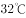

# 2019年重庆市选调优秀大学生到基层工作考试《行测》题

> 常识判断 · 14 题 · 选调 2019

## 第 1 题　qid 2668473 · 经济常识

以下是改革开放以来，我国历届党和国家领导人的重要论断，对其按时间先后排序，排列正确的一项是：
①改革开放是决定当代中国命运的关键一招，也是决定实现“两个一百年”奋斗目标，实现中华民族伟大复兴的关键一招。
②经济全球化是世界经济发展的客观趋势，对我国的发展有利也有弊。不能看到有风险，有不利因素，就因噎废食，不敢参与进去，同时又要对风险保持清醒认识，坚持独立自主，加强防范工作，增强抵御和化解能力。
③判断姓“社”还是姓“资”的标准，应该主要看是否有利于发展社会主义社会的生产力，是否有利于增强社会主义国家的综合国力，是否有利于提高人民的生活水平。
④落实好人才强国战略，必须树立适应新形势新任务要求的科学人才观，使我国由人口大国转化为人才资源强国。

- **A**. ③①②④
- **B**. ③②①④
- **C**. ③②④①　✅
- **D**. ③④②①

**答案**：C

**官方解析**

本题考查政治。
①：2018年12月18日，习近平总书记在庆祝改革开放40周年大会上的讲话中指出：“40年的实践充分证明，改革开放是党和人民大踏步赶上时代的重要法宝，是坚持和发展中国特色社会主义的必由之路，是决定当代中国命运的关键一招，也是决定实现‘两个一百年’奋斗目标、实现中华民族伟大复兴的关键一招。”
②：1998年8月28日，江泽民同志在第九次驻外使节会议上的讲话指出：“经济全球化是世界经济发展的客观趋势，对我国的发展有利也有弊。不能看到有风险、有不利因素，就因噎废食，不敢参与进去，同时又要对风险保持清醒认识，坚持独立自主，加强防范工作，增强抵御和化解能力。”
③：1992年1月18日―2月21日，邓小平同志在南巡中发表重要讲话，讲话指出：“（是姓‘资’还是姓‘社’）判断的标准，应主要看是否有利于发展社会主义社会的生产力，是否有利于增强社会主义国家的综合国力，是否有利于提高人民的生活水平。”
④：2003年12月19日至20日，胡锦涛同志在全国人才工作会议上的讲话指出：“做好人才工作，落实好人才强国战略，必须以马克思主义为指导，从当代世界和中国深刻变化着的实际出发，根据党和国家事业发展的迫切需要，解放思想、实事求是、与时俱进，树立适应新形势新任务要求的科学人才观。”
综上所述，按时间先后排序顺序为③②④①。
故正确答案为C。

---

## 第 2 题　qid 2668475 · 经济常识

下列经济常识不正确的是：

- **A**. 物价水平的持续下降意味着实际利率的上升
- **B**. 通过公开市场业务出售政府证券属于紧缩性货币政策
- **C**. 当通货膨胀严重时提高存款准备金率
- **D**. 经济衰退时期，应提高税率以扩大内需　✅

**答案**：D

**官方解析**

本题考查经济常识。
A项正确，物价水平的持续下降意味着实际利率的上升，投资成本变得昂贵，投资项目的吸引力下降，投资减少必然导致经济增长的下降，可能形成经济衰退。
B项正确，紧缩性的货币政策是通过货币供应的增长率来降低总需求水平，在这种政策下，取得信贷较为困难，利息率也随之提高。公开市场业务是货币政策工具之一，是指中央银行通过买进或卖出有价证券，吞吐基础货币，调节货币供应量的活动。题干中，通过公开市场业务出售政府证券，吸收市场中的货币，从而降低市场中的货币供应量，属于紧缩性货币政策。常见的紧缩性货币政策还有提高存款准备金率、提高再贴现率等。
C项正确，通货膨胀是指在货币流通条件下，因货币实际需求小于货币供给，也即现实购买力大于产出供给,导致货币贬值，而引起的一段时间内物价持续而普遍地上涨现象。其实质是社会总供给小于社会总需求（供远小于求）。提高存款准备金率，商业银行需要上缴中央银行的法定存款准备金增加，商业银行的可用资金减少，在其他情况不变的条件下，商业银行贷款或投资下降，导致货币供应量减少，有助于缓解通货膨胀。
D项错误，在经济衰退时期，通过降低税率、增加公共投资、完善社会保障等方法能够有效刺激消费、扩大内需。
本题为选非题，故正确答案为D。

---

## 第 3 题　qid 2668477 · 法律常识

十三届全国人民代表大会第一次会议通过了宪法修正案，完成了宪法修改的重大历史任务，实现了我国宪法的又一次与时俱进。下列哪一项不属于我国第五次宪法修改的内容？

- **A**. 将“健全社会主义法制”修改为“健全社会主义法治”
- **B**. 将“全国人民代表大会设立法律委员会”修改为“全国人民代表大会设立宪法和法律委员会”
- **C**. 增加“国家倡导社会主义核心价值观”
- **D**. 增加“国家尊重和保护人权”　✅

**答案**：D

**官方解析**

本题考查法律常识。
A项正确，2018年《宪法修正案（五）》第三十二条规定：“······‘健全社会主义法制’修改为‘健全社会主义法治’；······”
B项正确，2018年《宪法修正案（五）》第四十四条规定：“······宪法第七十条第一款中‘全国人民代表大会设立民族委员会、法律委员会、财政经济委员会、教育科学文化卫生委员会、外事委员会、华侨委员会和其他需要设立的专门委员会。’修改为：‘全国人民代表大会设立民族委员会、宪法和法律委员会、财政经济委员会、教育科学文化卫生委员会、外事委员会、华侨委员会和其他需要设立的专门委员会。’”
C项正确，2018年《宪法修正案（五）》第三十九条规定：“宪法第二十四条第二款中‘国家提倡爱祖国、爱人民、爱劳动、爱科学、爱社会主义的公德’修改为‘国家倡导社会主义核心价值观，提倡爱祖国、爱人民、爱劳动、爱科学、爱社会主义的公德’。这一款相应修改为：‘国家倡导社会主义核心价值观，提倡爱祖国、爱人民、爱劳动、爱科学、爱社会主义的公德，在人民中进行爱国主义、集体主义和国际主义、共产主义的教育，进行辩证唯物主义和历史唯物主义的教育，反对资本主义的、封建主义的和其他的腐朽思想。’”
D项错误，2004年《宪法修正案（四）》第二十四条规定：“宪法第三十三条增加一款，作为第三款：‘国家尊重和保障人权。’第三款相应地改为第四款。”
本题为选非题，故正确答案为D。

---

## 第 4 题　qid 2668480 · 人文常识

在中国古代，一支从长安出发的和平使团，开始打通东方通往西方的道路，完成了“凿空之旅”，这就是著名的：

- **A**. 张骞出使西域　✅
- **B**. 王昭君出塞和亲
- **C**. 郑和七下西洋
- **D**. 唐玄奘西天取经

**答案**：A

**官方解析**

本题考查人文常识。
A项正确，张骞出使西域，指的是汉武帝时期希望联合月氏夹击匈奴，派遣张骞出使西域各国的历史事件。张骞出使西域本为贯彻汉武帝联合大月氏抗击匈奴之战略意图，但出使西域后汉夷文化交往频繁，中原文明通过“丝绸之路”迅速向四周传播。张骞对开辟从中国通往西域的丝绸之路有卓越贡献，被称为“凿空之旅”，至今举世称道。
B项错误，公元前33年，匈奴单于呼韩邪稽侯珊第三次来到汉朝的京师长安城，觐见汉元帝刘奭，表示归附中央王朝的诚意和对汉元帝的尊敬，并且请求“婿汉氏以自亲”。元帝应允，后宫宫女王昭君挺身而出“请掖庭令求行”，担当“和蕃使者”的角色。这就是中国历史上著名的“昭君出塞和亲”。昭君到匈奴后，被封为“宁胡阏氏”（意思是王后），象征她将给匈奴带来和平、安宁和兴旺。
C项错误，郑和下西洋是明代永乐、宣德年间的一场海上远航活动，首次航行始于永乐三年（1405年），末次航行结束于宣德八年（1433年），共计七次。郑和下西洋是中国古代规模最大、船只和海员最多、时间最久的海上航行，也是15世纪末欧洲的地理大发现的航行以前世界历史上规模最大的一系列海上探险。
D项错误，玄奘，唐代著名高僧，法相宗创始人，是我国历史上伟大的思想家、哲学家、外交家、中外文化交流的使者。玄奘西行5万里，历时17年，到印度取真经，并穷一生译经，其足迹遍布印度，影响远至日本、韩国以至全世界，其思想与精神如今已是中国、亚洲乃至世界人民的共同财富。
故正确答案为A。

---

## 第 5 题　qid 2668481 · 人文常识

去年8月，挪威和芬兰的北极圈内区域多次记录到了超过的高温，比往年均温高出，然而北极熊并没有受到热潮的威胁。其原因有可能是：

- **A**. 北极熊分布很广，不局限于挪威和芬兰的北极圈内区域
- **B**. 斯堪的纳维亚北部区域属于北极圈中较暖的地方，北极圈中心区域依然比较凉爽　✅
- **C**. 春天到初夏才是北极熊捕食的主要时期
- **D**. 热浪对于海冰覆盖率的影响是需要时间累积的

**答案**：B

**官方解析**

本题考查地理国情。
作为地理区划，北极圈占据了23.5个纬度，它的边缘地区在夏天其实并不是很冷，7月均温通常在10摄氏度左右；斯堪的纳维亚北部区域属于北极圈中较暖的地方，如挪威北部的巴纳克位于北纬70度，夏季最高温通常在17摄氏度左右。2018年的热浪打破了多地的夏季气温记录，虽然北极圈局部地区面临异常高温，但此刻北极圈的中心地区还比较凉爽，因而北极熊并没有受到热潮的威胁。
故正确答案为B。

---

## 第 6 题　qid 2668482 · 人文常识

2016年，启动5G技术研究试验；2018年，多地开展5G试点；2020年，5G全面投入商用······中国5G正按照规划时间表有序发展，并走在世界前列。5G主要有三类典型业务场景，其中不包括：

- **A**. 超密集组网　✅
- **B**. 增强型移动宽带
- **C**. 海量机器类通信
- **D**. 高可靠低时延通信

**答案**：A

**官方解析**

本题考查科技常识。
A项错误，未来5G应用有三大场景，包括增强型移动宽带、海量机器类通信、高可靠低时延通信。超密集组网是5G的关键技术，不属于应用场景。
B项正确，增强型移动宽带，是指5G的峰值速率将达到4G网络的10倍以上。增强型移动宽带是为了发挥5G传输速率快与网络连接容量大的优势、满足人们对多媒体产品与服务等的接入需求与消费。
C项正确，海量机器类通信，是指5G将实现从消费到生产的全环节、从人到物的全场景覆盖，即“万物互联”。
D项正确，高可靠低时延通信，是指5G的通信响应速度将降至毫秒级，如自动驾驶汽车探测到障碍后的响应速度将比人的反应更快，将助推自动驾驶汽车从实验室开到路上。
本题为选非题，故正确答案为A。

---

## 第 7 题　qid 2668486 · 人文常识

入夏以来，强对流天气造成严重灾害的事件时有发生。以下不属于强对流天气的是：

- **A**. 雷雨大风
- **B**. 冰雹
- **C**. 台风　✅
- **D**. 短时强降水

**答案**：C

**官方解析**

本题考查地理国情。
强对流天气是指出现短时强降水、雷雨大风、龙卷风、冰雹和飑线等现象的灾害性天气，它发生在对流云系或单体对流云块中，在气象上属于中小尺度天气系统。
A项正确，雷雨大风，指在出现雷、雨天气现象时，平均风力大于等于6级、阵风大于等于8级的天气现象。当雷雨大风发生时，乌云滚滚，电闪雷鸣，狂风夹伴强降水，有时伴有冰雹，风速极大。它涉及的范围一般只有几公里至几十公里。
B项正确，冰雹也叫“雹”，是一种天气现象，夏季或春夏之交最为常见。冰雹是一些小如绿豆、黄豆，大似栗子、鸡蛋的冰粒。
C项错误，台风，属于热带气旋的一种。热带气旋是发生在热带或副热带洋面上的低压涡旋，是一种强大而深厚的“热带天气系统”。我国把南海与西北太平洋的热带气旋按其底层中心附近最大平均风力（风速）大小划分为6个等级，其中风力达12级或以上的，统称为台风。
D项正确，短时强降雨，指的是1小时内某地降雨量超过20毫米，短时强降雨是一种强对流天气。
本题为选非题，故正确答案为C。

---

## 第 8 题　qid 2668487 · 人文常识

中国传统节日形式多样，内容丰富，蕴涵着深邃丰厚的文化内涵，是中华民族悠久历史文化的重要组成部分。下列古诗词描写的传统节日中，对应有误的一项是：

- **A**. 春节——爆竹声中一岁除，春风送暖入屠苏
- **B**. 上元节——众里寻他千百度，蓦然回首，那人却在，灯火阑珊处
- **C**. 中秋节——暮云收尽溢清寒，银汉无声转玉盘
- **D**. 下元节——尘世难逢开口笑，菊花须插满头归　✅

**答案**：D

**官方解析**

本题考查人文常识。
A项正确，“爆竹声中一岁除，春风送暖入屠苏”出自宋代王安石的《元日》，意思是阵阵轰鸣的爆竹声中，旧的一年已经过去；和暖的春风吹来了新年，人们欢乐地畅饮着新酿的屠苏酒。此诗描写的是春节除旧迎新的景象。
B项正确，“众里寻他千百度，蓦然回首，那人却在，灯火阑珊处”出自南宋辛弃疾的《青玉案·元夕》，意思是对着众多走过的女人一一辨认，偶一回头，却发现自己的心上人站立在昏黑的幽暗之处。此词描绘出元宵佳节通宵灯火的热闹场景。元宵节，又称上元节、小正月、元夕或灯节，是中国的传统节日之一，时间为每年农历正月十五。
C项正确，“暮云收尽溢清寒，银汉无声转玉盘”出自宋代苏轼的《阳关曲·中秋月》，意思是夜幕降临，云气收尽，天地间充满了寒气；银河流泻无声，皎洁的月儿转到了天空，就像玉盘那样洁白晶莹。月到中秋分外明，是中秋月的特点，两句并没有写赏月的人，但全是赏心悦目之意，而人自在其中。
D项错误，“尘世难逢开口笑，菊花须插满头归”出自唐代杜牧的《九日齐山登高》，意思是尘世烦扰平生难逢让人开口一笑的事，满山盛开的菊花我定要插满头才归。九日指旧历九月九日，为重阳节。下元节，又称“下元日”、“下元”，是中国民间传统节日之一，为农历十月十五。
本题为选非题，故正确答案为D。

---

## 第 9 题　qid 2668490 · 人文常识

我们通常认为，声音传播的速度为340米/秒，其实这是在气温且干燥的空气中的声速。空气的温度、湿度以及传播的介质都会影响声速。下列有关声速的判断中，错误的一项是：

- **A**. 
声速在的干燥空气中比在的干燥空气中传播得快

- **B**. 
声速在的干燥空气中比在的氦气中传播得快
　✅
- **C**. 
声速在水中比在水蒸气中传播得快

- **D**. 
声速在冰中比在水中传播得快

**答案**：B

**官方解析**

本题考查科技常识。

A项正确，声音在空气中的传播速度与温度有关，气温越高，声音的传播速度越快。时海平面声音在空气中的传播速度约为331.5米/秒，时为340米/秒。温度每升高，声速约增加0.6米/秒。

B项错误，构成气体的原子和分子组成发生变化时，声速也会随之改变。比如在的氦气中，声速为970米/秒，接近干燥空气中的3倍。

C、D两项正确，物质的状态不同，声速会有很大的区别，如水蒸气中声速为473米/秒，水中声速为1500米/秒，冰中声速为3230米/秒。一般来说，在固体中声速最快、液体次之、气体最慢。

本题为选非题，故正确答案为B。

---

## 第 10 题　qid 2668491 · 人文常识

草书、行书、楷书、隶书四种字体中哪一种是其余三种的起源？

- **A**. 草书
- **B**. 行书
- **C**. 楷书
- **D**. 隶书　✅

**答案**：D

**官方解析**

本题考查人文常识。
草书、行书、楷书、隶书四种字体中，“隶书”是其余三种的起源。一般认为隶书由篆书发展而来，时间上早于行书、草书和楷书。
A项错误，草书，作为一种特定的字体，形成于汉代，是为了书写简便，在隶书基础上演变出来的。草书代表人物是唐朝的张旭和怀素，合称“颠张狂素”。
B项错误，行书，是一种书法统称，分为行楷和行草两种。它在楷书的基础上发展起源，是介于楷书、草书之间的一种字体，是为了弥补楷书的书写速度太慢和草书的难于辨认而产生的。行书代表人物是东晋书法家王羲之，他的《兰亭序》被誉为“天下第一行书”。
C项错误，楷书，由隶书逐渐演变而来，更趋简化，横平竖直。《辞海》中解释说它“形体方正，笔画平直，可作楷模”。这种汉字字体端正，就是现代通行的汉字手写正体字。著名的“楷书四大家”为：唐朝的欧阳询、唐颜真卿、柳公权和元朝的赵孟頫。
D项正确，隶书，一般认为由篆书发展而来，字形多呈宽扁，横画长而竖画短，讲究“蚕头燕尾”、“一波三折”。唐代隶书历来有韩择木、蔡有邻、李潮、史惟则四家平分秋色。
故正确答案为D。

---

## 第 11 题　qid 2668492 · 人文常识

2018年12月13日，维珍银河公司一架载有两名宇航员的飞船到达了距离地面82.7千米高的天空，相当于已到达地球大气层的哪一层？

- **A**. 对流层
- **B**. 平流层
- **C**. 中间层　✅
- **D**. 外层

**答案**：C

**官方解析**

本题考查地理国情。

A项错误，对流层，是指最接近地球表面的一层大气，也是大气的最下层，密度最大，所包含的空气质量几乎占整个大气质量的，以及几乎所有的水蒸气及气溶胶。其下界与地面相接，上界高度随地理纬度和季节而变化，它的高度因纬度而不同，在低纬度地区平均高度为17～18公里，在中纬度地区平均为10～12公里，极地平均为8～9公里，并且夏季高于冬季。

B项错误，平流层，亦称同温层，是地球大气层里上热下冷的一层，此层被分成不同的温度层，当中高温层置于顶部，而低温层置于低部。它与位于其下贴近地表的对流层刚好相反，对流层是上冷下热。在中纬度地区，平流层位于离地表10公里至50公里的高度，而在极地，此层则始于离地表8公里左右。

C项正确，中间层，又称中层，是指自平流层顶到85千米之间的大气层。该层内因臭氧含量低，同时，能被氮、氧等直接吸收的太阳短波辐射已经大部分被上层大气所吸收，所以温度垂直递减率很大，对流运动强盛。

D项错误，散逸层，又称“外层”、“逃逸层”，是热层（暖层）以上的大气层，也是地球大气的最外层。这层空气在太阳紫外线和宇宙射线的作用下，大部分分子发生电离，使质子和氦核的含量大大超过中性氢原子的含量。逃逸层空气极为稀薄，其密度几乎与太空密度相同，故又常称为外大气层。散逸层的下界距离地表800千米以上，而顶界约为2000~3000千米的高度。

故正确答案为C。

---

## 第 12 题　qid 2668493 · 科技常识

化学与人类生活密切相关，下列说法正确的是：

- **A**. 苯酚有一定毒性，不能做消毒剂和防腐剂
- **B**. 白磷着火点高且无毒，可用于制造安全火柴
- **C**. 油脂发生皂化反应生成的高级脂肪酸钠是肥皂的有效成分　✅
- **D**. 用食醋去除水壶中的水垢时所发生的反应是水解反应

**答案**：C

**官方解析**

本题考查科技常识。

A项错误，苯酚是一种有机化合物，是具有特殊气味的无色针状晶体，有毒，是生产某些树脂、杀菌剂、防腐剂以及药物（如阿司匹林）的重要原料。也可用于消毒外科器械和排泄物的处理，皮肤杀菌、止痒及中耳炎。

B项错误，白磷的着火点是，白磷易自燃且有毒，所以不能用于制造安全火柴，用于制造安全火柴的是红磷。

C项正确，油脂在碱溶液的作用下发生水解，叫皂化反应。皂化反应生成硬脂酸钠，硬脂酸钠用于制造肥皂，即肥皂的主要成分是硬脂酸钠。

D项错误，水垢的主要成分是碳酸钙、氢氧化镁，用食醋去除水壶中的水垢时所发生的反应是复分解反应。复分解反应是由两种化合物互相交换成分，生成另外两种化合物的反应，其实质是发生复分解反应的两种化合物在水溶液中交换离子，结合成难电离的沉淀、气体或弱电解质（最常见的为水），使溶液中离子浓度降低，化学反应向着离子浓度降低的方向进行的反应。

故正确答案为C。

---

## 第 13 题　qid 2668496 · 人文常识

2018年11月，第26届国际计量大会正式更新，包括国际标准质量单位“千克”在内的4项基本单位定义，至此，国际计量单位制的7个基本单位全部实现由常数定义。国际单位制和市制都是我国的基本计量制度，下列计量单位与我国市制计量单位的换算正确的一项是：

- **A**. 

- **B**. 

- **C**. 

　✅
- **D**. 

**答案**：C

**官方解析**

本题考查科技常识。

A项错误，钱是最小的重量单位，在中药方、黄金、食谱中仍沿用这一计量单位。。

B项错误，最早用大指与中指的跨度为一尺，一尺相当于八寸，但不利于计算。后改成一尺为十寸并规制沿用而成为市尺。。

C项正确，公顷为面积的公制单位（国际单位）。一块面积一公顷的土地为10000平方米。。

D项错误，斗的本义是一种盛酒的器具，又用作计量粮食的工具，后来才引申为单位。。

故正确答案为C。

---

## 第 14 题　qid 2668497 · 人文常识

下列有关饮食的常识，说法正确的一项是：

- **A**. 粗粮富含膳食纤维，脂肪很少，吃粗粮有助于降低血糖
- **B**. 反式脂肪在炸鸡、爆米花、饼干、蛋糕等食品中比较常见　✅
- **C**. 人体内的胆固醇主要经膳食摄入
- **D**. 食品一旦过期，便会对人体健康造成危害，因此不能食用

**答案**：B

**官方解析**

本题考查科技常识。
A项错误，粗粮是相对精米白面等细粮而言的，主要包括谷类中的玉米、紫米、高粱、以及各种干豆类，如黄豆、青豆、绿豆等。食用粗粮血糖上升较慢，有助于控制血糖，但是并不能降低血糖。
B项正确，反式脂肪，又称为反式脂肪酸、逆态脂肪酸，是一种不饱和脂肪酸（单元不饱和或多元不饱和）。反式脂肪存在于植物油、糖果、巧克力、蛋糕、面包、披萨、人造奶油、曲奇饼等常见食物中。
C项错误，人体胆固醇的来源有两种，一种是从食物中获取，一种是机体以乙酰辅酶A为原料自身合成的。食物的主要来源是动物的内脏、蛋黄、奶油及肉等动物性食品。
D项错误，食品包装上的保质期是指食品的最佳食用期，一般是指在生产厂家规定的贮藏条件下，能够保持食品优良品质的期限。有些食物虽已过了保质期，也是可以食用的，但它的品质可能有某种程度的下降。
故正确答案为B。

---
