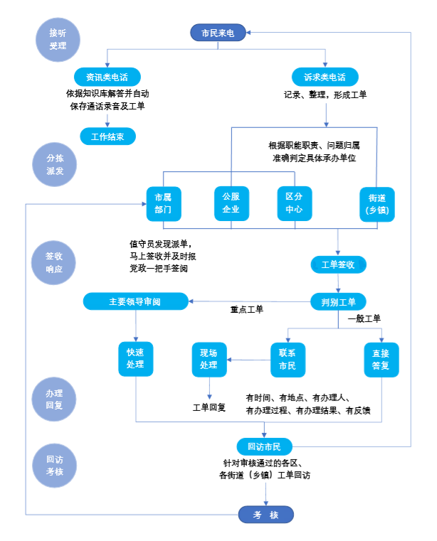
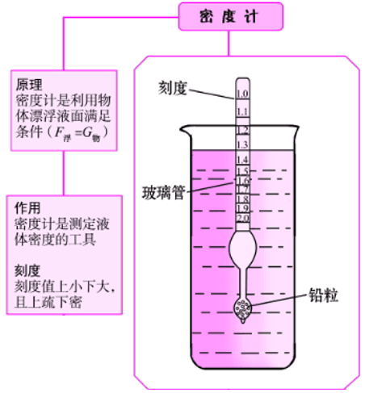
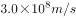
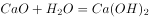

# 2020年北京市公务员录用考试《行测》题（区级及以上卷）（网友回忆版）

> 常识判断 · 31 题 · 北京 2020

## 材料 1

        1949年3月23日，中共中央和毛泽东同志离开西柏坡前往北平，25日进驻北京香山，这里成为党中央所在地。在庆祝新中国成立70周年前夕，习近平总书记前往中共中央北京香山革命纪念地，回顾中国共产党领导中国人民夺取全国胜利和党中央筹建中华人民共和国的光辉历史。习总书记在视察北京香山革命纪念地时强调，全党全国各族人民要紧密团结起来，不忘初心、牢记使命，锐意进取、开拓创新，沿着中国特色社会主义道路，满怀信心继续把新中国巩固好、发展好，为实现“两个一百年”奋斗目标、实现中华民族伟大复兴中国梦而不懈奋斗。

### 第 1 题　qid 2453161 · 人文常识

下列历史事件中，发生在中共中央进驻香山期间的有：
①渡江战役吹响了解放全中国的进军号角
②毛泽东同志发表《论人民民主专政》
③《中国人民政治协商会议共同纲领》起草通过
④人民解放军举行盛大的北平入城式

- **A**. ①②③　✅
- **B**. ①②④
- **C**. ①③④
- **D**. ②③④

**答案**：A

**官方解析**

本题考查毛中特。
①正确，渡江战役是1949年4月21日至6月2日，中国人民解放军第二、第三野战军和第四野战军一部，在长江中下游强渡长江，对国民党军汤恩伯、白崇禧两集团进行的战略性进攻战役。
②正确，《论人民民主专政》是1949年6月30日，毛泽东为纪念中国共产党成立二十八周年而写的一篇论文。该论文论述了即将成立的中华人民共和国的国家性质，各阶级在国家中的地位及其相互关系，国家对内、对外政策等。
③正确，1949年9月29日，中国人民政治协商会议通过了具有临时宪法性质的《中国人民政治协商会议共同纲领》，选举产生了中央人民政府委员会，宣告了中华人民共和国的成立。
④错误，1949年2月3日，人民解放军举行盛大的进驻北平入城式，这次入城仪式在整个中国和世界都引起了强烈反响。该历史事件发生在1949年3月25日进驻香山之前。
故正确答案为A。

---

### 第 2 题　qid 2453167 · 人文常识

随着政治形势的发展和工作重心的转移，中共中央早期所在地也相应地发生过多次变迁。以下选项中，中共中央早期所在地不包括：

- **A**. 上海
- **B**. 武汉
- **C**. 江西瑞金
- **D**. 长春　✅

**答案**：D

**官方解析**

本题考查毛中特。
A项正确，1920年8月，陈独秀、李达等人在上海建立中国第一个共产党早期组织，上海成为中国共产党的发祥地。1921年7月23日，中国共产党第一次全国代表大会在上海召开，会后成立的由陈独秀、张国焘、李达组成的中共中央局即驻上海。
B项正确，1927年初，大革命期间国民党中央和国民政府由广州迁至武汉。中共中央秘书厅、中央组织部、中央军委等机关也分别于1926年底到1927年春完成了从上海到武汉的搬迁工作。武汉成为中共中央的第二个驻扎地。
C项正确，1931年11月，中华苏维埃共和国临时中央政府在江西瑞金宣告成立，瑞金成为中国共产党领导下的第一个全国性红色政权首府，也成为中共中央的第三个驻扎地。
D项错误，中国共产党早期所在地不包括长春。
本题为选非题，故正确答案为D。

---

### 第 3 题　qid 2453170 · 人文常识

缅怀这段历史，就是要继承和发扬老一辈革命家“宜将剩勇追穷寇，不可沽名学霸王”的：

- **A**. 革命到底精神　✅
- **B**. 团结奋进、勇于创新精神
- **C**. 舍生取义、视死如归精神
- **D**. 勇于担当精神

**答案**：A

**官方解析**

本题考查人文常识。
“宜将剩勇追穷寇，不可沽名学霸王”出自毛泽东的《七律·人民解放军占领南京》，意思是：应该趁现在这敌衰我盛的大好时机，痛追残敌，解放全中国。不可学那贪图虚名，放纵敌人而造成自己失败的楚霸王项羽。2019年9月12日，在庆祝新中国成立70周年前夕，习近平前往中共中央北京香山革命纪念地，并发表重要讲话。他强调：“我们缅怀这段历史，就是要继承和发扬老一辈革命家‘宜将剩勇追穷寇，不可沽名学霸王’的革命到底精神，不断增强中国特色社会主义的道路自信、理论自信、制度自信、文化自信，勇于进行具有许多新的历史特点的伟大斗争。”因此，BCD项不符合题意。
故正确答案为A。

---

## 材料 2

        12345市民服务热线是北京市政府设立的非紧急救助服务，前身是1987年设立的“市长电话”。通过接听市民来电，解答公众咨询，收集整理社情民意，受理市民提出的诉求、问题、建议等，通过交办妥善解决市民遇到的非紧急类问题。

        北京市提出“接诉即办”，即提高对“诉”的重视，加强“办”的力度。2019年1月1日起12345市民服务热线开始将街道（乡镇）管辖权属清晰的群众诉求，直接派给街乡镇。街乡镇迅速回应“接诉即办”，区政府同时接到派单，负责督办。一般性问题7天反馈办理结果。

        “接诉即办”推行以来收到很大成效，据不完全统计，2019年截至6月底，12345共受理群众来电241万件，向街乡镇派单41万多件，一批市民集中关心、老大难问题得到解决。在这个机制的推动下，基层探索出24小时值班、群众诉求首接责任、“四微”工作法、新媒体派单、未诉先办等颇具实效的机制。

### 第 4 题　qid 2453137 · 人文常识

自2019年1月1日起，北京市逐步将各类热线整合到12345市民服务热线，实现“一号通”集中受理市民群众各类诉求。以下关于北京市这种整合热线改革举措的表述中，正确的是
①意在打通城市治理的“最后一公里”，由各级监察机关直接对接百姓诉求
②打破过去各个单位各自受理、分别办理的局限，更加方便了市民诉求的表达
③引导政府部门“一竿子插到底”，到基层解决群众反映的现实难题
④重点为了解决街道职能定位不准、责权利不匹配等问题

- **A**. ①②
- **B**. ②③　✅
- **C**. ①③
- **D**. ③④

**答案**：B

**官方解析**

本题考查政治常识。
①错误，集中受理市民群众各类诉求，这种模式的创新找准了服务群众“最后一公里”的痛点和难点，极大提高了为民办事的效率，从而真正回应群众的诉求，体现出“为人民服务”的改革宗旨。根据《监察法》第三条规定：“各级监察委员会是行使国家监察职能的专责机关，依照本法对所有行使公权力的公职人员(以下简称公职人员)进行监察，调查职务违法和职务犯罪，开展廉政建设和反腐败工作，维护宪法和法律的尊严。”由此可知①后半句表述错误，各级监察机关不直接对接百姓诉求。
②正确，整合热线、实现“一号通”的改革，打破了过去各个单位各自受理、分别办理、效率低下的局限，更加方便市民诉求的表达。
③正确，集中受理市民群众各类诉求的方式在过去“街乡吹哨，部门报到”机制的基础上，把更多的力量下沉到基层，引导政府部门“一竿子插到底”，到基层解决群众反映的现实难题。
④错误，“接诉即办”把管辖权属清晰的群众诉求直接派给街道（乡镇），并从响应率、解决率、满意率三方面进行考核，不仅省去了不必要的中间环节，更重要的是实现了案件办理在时间上、速度上、效果上的显著提升。
因此②③正确。
故正确答案为B。

---

### 第 5 题　qid 2453142 · 人文常识

根据“接诉即办”的工作流程，对于市民诉求类电话。以下说法不正确的是

- **A**. 可直接派单到街乡镇
- **B**. 所有派单需要报党政一把手签阅
- **C**. 所有工单在答复市民前须经主责领导审阅　✅
- **D**. 对审核通过的各街乡镇的工单要向市民进行回访

**答案**：C

**官方解析**

本题考查政治常识。
A项正确，根据职能职责、问题归属来判定具体承办单位，对于管辖权属清晰的群众诉求直接派给街乡镇，并从响应率、解决率、满意率三方面进行考核。
B项正确，在准确判定具体承办单位后进行派单，值班员发现派单后需要马上签收，并及时报党政一把手签阅。
C项错误，工单签收后需要对其进行判别，一般工单可以直接回复或联系市民现场处理，重点工单需要经主责领导审阅，进行快速处理。
D项正确，针对审核通过的各区、各街乡镇的工单要向市民进行回访，向群众反馈诉求处置过程和办理结果，耐心解答问题，与群众零距离真诚沟通，并认真记录群众后续需求，虚心接受群众意见建议。
本题为选非题，故正确答案为C。

---

### 第 6 题　qid 2453147 · 人文常识

为积极响应市民诉求，做到“闻风而动、接诉即办”，A镇实行闭环管理，全程督办。近日，市民安女士反映社区附近垃圾站散发臭味的问题，A镇政府在签收工单后采取了一系列措施，以下措施中不符合工作流程要求的是

- **A**. 直接将安女士反映的问题派单至A镇所在区的城市管理委员会
- **B**. 联系镇环卫部门具体承办，安女士所在社区全程盯办，并及时和安女士沟通
- **C**. 在整件事情解决的过程中，镇纪委牵头，区监察专员参与，对履职情况和办理实效等进行全程监督　✅
- **D**. 在工单办结后及时回访安女士，确认办理结果

**答案**：C

**官方解析**

本题考查政治常识。
A项正确，根据材料，安女士反映的问题（社区附近垃圾站散发臭味）管辖权属清晰，直接派单至A镇所在区的城市管理委员会符合工作流程要求。
B项正确，题干中垃圾站的问题应当由对口的镇环卫部门负责承办；安女士所在的社区为相关方，应当全程盯办，并及时和安女士沟通。
C项错误，根据材料，A镇政府回应“接诉即办”后，区政府同时接到派单并负责督办。因此，在整件事情解决的过程中，应当由区政府的纪委监察委牵头，对履职情况和办理实效进行全程监督。
D项正确，根据材料，工单办结后应当对反映问题的市民进行回访，确认办理结果。
本题为选非题，故正确答案为C。

---

### 第 7 题　qid 2453153 · 人文常识

2019年1月1日以来，12345受理市民来电数百万件。根据12345群众来电诉求的“大数据”，北京市加强规律性研究，梳理形成违法建设、物业管理、群租房等11项专项整治问题清单，由市领导分工负责推动解决。
下列对在“接诉即办”工作中开展大数据分析和规律性研究的目的意义理解不正确的是

- **A**. 推动“接诉即办”从“有一办一”“举一反三”向主动治理、未诉先办深化
- **B**. 大大增强了政府工作的靶向性
- **C**. 推动工作模式转变，从一类诉求打包办，到一个诉求一个诉求精细办　✅
- **D**. 引导各区增加公共服务有效供给，有针对性补短板、强弱项

**答案**：C

**官方解析**

本题考查管理学常识。
A项正确，通过分析群众来电“大数据”，政府部门可以总结规律，形成专项整治问题清单，从而推动“接诉即办”从“有一办一”“举一反三”向主动治理、未诉先办深化。
B项正确，“接诉即办”机制依托大数据，能够做到从一个诉求一个诉求地办理，到一类诉求的打包解决，再到民生大问题的根本性梳理，从而实现未诉先办，大大增强了政府工作的靶向性。
C项错误，从题干可知，北京市政府在分析群众来电“大数据”的基础上，不断总结规律，形成专项整治问题清单，体现了政府在解决民生问题上的创新，即从一个诉求一个诉求地办理，到一类诉求的打包解决，再到民生大问题的根本性梳理。
D项正确，北京市依托12345市民服务热线平台，以“接诉即办”机制为抓手，撬动基层治理大变革，从“民有所呼”的大数据积累中，梳理出高频问题、重点区域，未诉先办、主动治理，最终引导各区增加公共服务有效供给，有针对性地补短板、强弱项，真正做到为人民办实事、办好事，满足人民群众的需求。
本题为选非题，故正确答案为C。

---

### 第 8 题　qid 2453159 · 人文常识

北京市已探索出一套保障和提升“接诉即办”效率的机制，定期分析研判群众诉求，对群众反映集中的热点问题加大“点穴”式督办力度，并将相关考核数据分别纳入各部门党组织书记年度考核和政府年度绩效考评。这一做法意在
①推动各部门切实改进工作作风，保障“接诉即办”的效果
②指导各部门把量化指标作为唯一依据开展各项工作
③进一步创新政府绩效考评体系，强化政府在“接诉即办”效果评估中的主导地位
④通过排名传导压力，形成各部门努力解决问题的态势

- **A**. ①②
- **B**. ②③
- **C**. ②④
- **D**. ①④　✅

**答案**：D

**官方解析**

本题考查管理学常识。
①正确，北京市政府的这一做法其目的是了解各部门在某一阶段的工作效率和工作成果，最终推动各部门切实改进工作作风，保障“接诉即办”的效果和“接诉即办”制度的有效落实。
②错误，把量化指标作为唯一依据开展各项工作不利于各部门有针对性的解决问题，可能会导致各部门陷入数据竞争而忽略真正为群众解决实际问题。
③错误，虽然政府在“接诉即办”过程中处于主导地位，但是“接诉即办”效果评估应该充分了解群众的满意度和反馈，保证考核数据的准确性。该说法与题干无关，排除。
④正确，通过排名，可以使各部门看到差距和不足，在此基础上不断提高解决问题的能力和效率，最终实现从上到下形成努力解决问题的态势。
因此，①④正确，②③错误。
故正确答案为D。

---

### 第 9 题　qid 2453113 · 人文常识

根据国家《“十三五”脱贫攻坚规划》，到2020年稳定实现现行标准下农村贫困人口“两不愁、三保障”。“两不愁、三保障”具体是指

- **A**. 不愁吃、不愁穿，义务教育、基本医疗和住房安全有保障　✅
- **B**. 不愁吃、不愁花，义务教育、基本医疗和住房安全有保障
- **C**. 不愁吃、不愁穿，义务教育、基本医疗和就业有保障
- **D**. 不愁吃、不愁住，义务教育、基本医疗和就业有保障

**答案**：A

**官方解析**

本题考查政治常识。
2016年11月23日，国务院公开发布了《“十三五”脱贫攻坚规划》。《规划》提出：“到2020年，稳定实现现行标准下农村贫困人口不愁吃、不愁穿，义务教育、基本医疗和住房安全有保障（以下称‘两不愁、三保障’）。”
故正确答案为A。

---

### 第 10 题　qid 2453115 · 人文常识

2019年是推动京津冀协同发展的重要一年，下列关于京津冀协同发展的说法中，不正确的是

- **A**. 建设雄安新区是千年大计
- **B**. 京津冀协同发展目前处于谋思路、打基础、寻突破的阶段　✅
- **C**. 积极稳妥有序疏解北京非首都功能是京津冀协同发展战略首要的任务
- **D**. 京津冀协同发展在交通、生态、产业等重点领域实现了率先突破

**答案**：B

**官方解析**

本题考查政治。
A项正确，2019年1月16日至18日，习近平总书记在京津冀三省市考察，主持召开京津冀协同发展座谈会并发表重要讲话。他强调，建设雄安新区是千年大计。新区首先就要新在规划、建设的理念上，要体现出前瞻性、引领性。要全面贯彻新发展理念，坚持高质量发展要求，努力创造新时代高质量发展的标杆。
B项错误，2019年1月18日，习近平总书记在京津冀三省市考察并主持召开京津冀协同发展座谈会上指出：“过去的5年，京津冀协同发展总体上处于谋思路、打基础、寻突破的阶段，当前和今后一个时期进入到滚石上山、爬坡过坎、攻坚克难的关键阶段，需要下更大气力推进工作。”
C项正确，2019年1月16日至18日，习近平总书记在京津冀三省市考察，主持召开京津冀协同发展座谈会并发表重要讲话。他对推动京津冀协同发展提出了6个方面的要求。其中，第一条要求紧紧抓住“牛鼻子”不放松，积极稳妥有序疏解北京非首都功能。即稳妥有序疏解北京非首都功能是京津冀协同发展战略首要的、也是最核心的任务。
D项正确，2019年1月11日，国务院新闻办举行新闻发布会，京津冀协同发展领导小组办公室副主任、国家发展改革委副主任林念修介绍河北雄安新区和北京城市副中心规划建设有关情况。他指出：“到目前为止，雄安新区和北京城市副中心规划建设正在高标准、高质量推进，北京非首都功能疏解正在积极稳妥开展。交通、生态、产业等重点领域也实现了率先突破。”
本题为选非题，故正确答案为B。

---

### 第 11 题　qid 2453116 · 经济常识

下列国际组织，按照中国加入的时间先后顺序排列正确的一项是
①联合国
②亚太经合组织
③国际原子能机构
④世界贸易组织

- **A**. ①②③④
- **B**. ①③②④　✅
- **C**. ③②①④
- **D**. ③①④②

**答案**：B

**官方解析**

本题考查经济。
①中国1945年10月24日加入联合国，于1971年10月25日恢复合法席位。
②中国于1991年11月加入亚太经合组织。
③中国于1984年1月加入国际原子能机构。
④中国于2001年12月加入世界贸易组织。
按加入时间先后顺序排列为①③②④。
故正确答案为B。

---

### 第 12 题　qid 2453118 · 人文常识

绿色食品是我国对无污染、安全的、优质的、营养类食品的总称。下列标志属于我国绿色食品标志的是

- **A**. 

　✅
- **B**. 

- **C**. 

- **D**. 

**答案**：A

**官方解析**

本题考查人文常识。
A项正确，是绿色食品标志。
B项错误，是无公害农产品标志。
C项错误，是质量安全标志。
D项错误，是可回收物标志。
故正确答案为A。

---

### 第 13 题　qid 2453119 · 人文常识

在浮力应用的过程中，下列有关说法正确的是

- **A**. 潜水艇——通过改变排水的多少来实现下沉和上浮
- **B**. 热气球——在上升过程中球囊内的气体密度小于外界空气密度　✅
- **C**. 轮船——在风力更大的江面上吃水会变深
- **D**. 密度计——测量不同密度的液体时所受到的浮力不同

**答案**：B

**官方解析**

本题考查科技常识。

A项错误，潜水艇外形、体积固定，因此排水量一定，潜入海中所受海水浮力也一定，故只有改变自身重量才能控制下沉和浮起。下沉时潜水艇打开压舱入水口，海水进入潜艇内部的水舱，使艇重超过浮力而下沉；需浮起时潜艇应用内部贮备的压缩空气，将水舱内的海水排出艇外，此时，艇重小于浮力而向上浮起。

B项正确，微观来讲，气体受热之后分子之间的距离变大，导致体积变大、密度变小。热气球就是利用这一原理，喷火装置启动后，将热气球气囊中的空气加热，空气受热膨胀，密度变小，热气球所受大气浮力为气囊所排开的空气重力，即，大于气囊内空气重力。随着加热的进行，气囊内部空气密度进一步减小，当大气浮力大于气囊内空气重力和热气球附属设备重力之和时，热气球便缓缓上升。

C项错误，根据伯努利效应，流体的速度越大，压力越小，这时候整体的大气压力减小了，因此轮船会获得一个向上的升力，而自身重力不变的情况下，需要水的浮力会变小，吃水变浅。风力越大，吃水越浅。

D项错误，密度计是根据阿基米德原理和物体浮在液面上平衡的条件制成的。它是一根密闭的玻璃管，上部粗细均匀，内壁贴有刻度纸，下部较粗，下端装有铅丸或水银，使玻璃管能竖直浮在液面上。测量液体密度时，密度计漂浮在液体中达到二力平衡，自身重力与所受浮力方向相反、大小相同，由于密度计自身重力始终不变，所以测量不同密度的液体时所受到的浮力也不变。

故正确答案为B。

---

### 第 14 题　qid 2453120 · 科技常识

“修身齐家治国平天下”体现以下哪一学派的人生理想和志趣？

- **A**. 道家
- **B**. 法家
- **C**. 墨家
- **D**. 儒家　✅

**答案**：D

**官方解析**

本题考查科技人文常识。“修身齐家治国平天下”出自《礼记·大学》。修身就是完善自己，使行为有规范；齐家就是管理好一个家族，成为宗族的楷模、效仿学习的样板；治国就是治理好一个小小的诸侯国，这里的国不是我们现代意义的国家，古代的诸侯国是要对周王室负责，也就是我们平时所说的“邦”；平天下就是安抚天下黎民百姓，使他们能够丰衣足食、安居乐业，而不是用武力平定天下。“平天下”是儒家的终极目标，即达到一种在等级秩序基础上的平等和公平。
法家思想强调以法治国、法术势相结合，墨家思想强调兼爱、非攻、尚贤，道家思想强调无为而治、齐物论。
故正确答案为D。

---

### 第 15 题　qid 2453121 · 人文常识

下列选项中，与王国维在《人间词话》中谈到治学三境界时引用的“衣带渐宽终不悔，为伊消得人憔悴”内涵最相近的是

- **A**. 海内存知己，天涯若比邻
- **B**. 宝剑锋从磨砺出，梅花香自苦寒来　✅
- **C**. 会当凌绝顶，一览众山小
- **D**. 劝君更尽一杯酒，西出阳关无故人

**答案**：B

**官方解析**

本题考查人文常识。“衣带渐宽终不悔，为伊消得人憔悴”字面意思是沉溺于热恋中的情人对爱情的执着，人消瘦了，但决不后悔，就如学者在追求知识的过程中所表现出一种认定了目标就呕心沥血、孜孜以求的执着精神。
A项错误，诗句出自唐代诗人王勃的作品《送杜少府之任蜀州》，是送别诗的名作，此诗意在慰勉友人勿在离别之时悲哀。
B项正确，此句字面意思是说宝剑的锐利刃锋是从不断地磨砺中得到的，挨过寒冷冬季的梅花更加的幽香，喻义要想拥有珍贵品质或美好才华等是需要不断的努力、修炼、克服一定的困难才能达到的。
C项错误，出自杜甫的名篇《望岳》，诗句意为当人登上泰山的顶峰，俯瞰那众山，而众山就会显得极为渺小。表达了诗人敢攀顶峰、俯视一切的雄心和气概。
D项错误，出自唐代诗人王维的《送元二使安西》，是一首送朋友去西北边疆的诗。表达依依惜别的情谊，而且包含着对远行者处境、心情的深情体贴，包含着前路珍重的殷勤祝愿。
故正确答案为B。

---

### 第 16 题　qid 2453117 · 人文常识

电磁波包括无线电波、微波、红外线、可见光、紫外线等。下列关于电磁波的说法正确的是：

- **A**. 红外线是电磁波粒子性的体现
- **B**. 微波在真空中的传播速度小于可见光
- **C**. 紫外线在遥控和热成像仪中普遍应用
- **D**. 雷达可以通过无线电波的反射测距　✅

**答案**：D

**官方解析**

本题考查科技常识。

A项错误，电磁波的波长越短，粒子性越强；波长越长，波动性越强。而红外线的波长较长，其更多体现的是波动性。

B项错误，微波和可见光在真空中的传播速度是一样的，都是光速，速度为。

C项错误，遥控和热成像仪应用的是红外线。红外遥控具有抗干扰、电路简单、容易编码和解码、功耗小、成本低的优点，因此应用广泛。自然界中一切物体都可以辐射红外线，热成像仪利用这个原理，将物体辐射出的红外线的功率信号转换为电信号，经过处理，从而得到物体的热像图。

D项正确，“雷达”一词是音译，原意为“无线电探测和测距”，其实际含义是利用目标对电磁波的反射现象来发现目标并测定其位置。因此雷达可以通过无线电波的反射测距。

故正确答案为D。

---

### 第 17 题　qid 2453122 · 法律常识

根据宪法和法律规定，我国各级人民政府是各级国家        的执行机关。

- **A**. 权力机关　✅
- **B**. 共产党组织
- **C**. 司法机关
- **D**. 社会团体

**答案**：A

**官方解析**

本题考查法律常识。
根据《宪法》第一百零五条规定：“地方各级人民政府是地方各级国家权力机关的执行机关，是地方各级国家行政机关。地方各级人民政府实行省长、市长、县长、区长、乡长、镇长负责制。”
故正确答案为A。

---

### 第 18 题　qid 2453123 · 法律常识

根据《中华人民共和国行政诉讼法》，下列诉讼事项中，人民法院不予受理的是：

- **A**. 对公安机关作出的行政拘留的决定不服
- **B**. 认为行政机关违法摊派费用
- **C**. 对行政机关作出的有关行政许可的决定不服
- **D**. 对行政机关作出的有关工作人员奖惩的决定不服　✅

**答案**：D

**官方解析**

本题考查法律常识。
根据《行政诉讼法》第十二条第一款规定：“人民法院受理公民、法人或者其他组织提起的下列诉讼：(一)对行政拘留、暂扣或者吊销许可证和执照、责令停产停业、没收违法所得、没收非法财物、罚款、警告等行政处罚不服的；(二)对限制人身自由或者对财产的查封、扣押、冻结等行政强制措施和行政强制执行不服的；(三)申请行政许可，行政机关拒绝或者在法定期限内不予答复，或者对行政机关作出的有关行政许可的其他决定不服的；……(九)认为行政机关违法集资、摊派费用或者违法要求履行其他义务的；……”
A项正确，符合上述第（一）项的情形，人民法院应当受理。
B项正确，符合上述第（九）项的情形，人民法院应当受理。
C项正确，符合上述第（三）项的情形，人民法院应当受理。
D项错误，根据《行政诉讼法》第十三条规定：“人民法院不受理公民、法人或者其他组织对下列事项提起的诉讼：(一)国防、外交等国家行为；(二)行政法规、规章或者行政机关制定、发布的具有普遍约束力的决定、命令；(三)行政机关对行政机关工作人员的奖惩、任免等决定；(四)法律规定由行政机关最终裁决的行政行为。”故对行政机关作出的有关工作人员奖惩的决定不服的，不能提起行政诉讼。
本题为选非题，故正确答案为D。

---

### 第 19 题　qid 2453125 · 法律常识

贾某经相亲与李某确立恋爱关系，贾某按照习俗给李某家送了彩礼。办理结婚登记手续后，开始准备婚礼。之后因贾某与李某感情破裂，办理了离婚登记手续，贾某要求李某返还彩礼，以下哪个理由可以得到法律支持？

- **A**. 彩礼金额远远超过当地平均水平
- **B**. 两人还未开始共同生活　✅
- **C**. 贾某家当前因发生变故生活困难
- **D**. 两人还未举行婚礼

**答案**：B

**官方解析**

本题考查法律常识。
《最高人民法院关于适用&lt;中华人民共和国民法典&gt;婚姻家庭编的解释（一）》第五条规定：“当事人请求返还按照习俗给付的彩礼的，如果查明属于以下情形，人民法院应当予以支持：（一）双方未办理结婚登记手续；（二）双方办理结婚登记手续但确未共同生活；（三）婚前给付并导致给付人生活困难。适用前款第二项、第三项的规定，应当以双方离婚为条件。”
A项错误，彩礼金额超过了当地平均水平并非是法院支持退还彩礼的情形。
B项正确，贾某与李某办理了婚姻登记手续，但两人还未开始共同生活的，可以得到法院的支持。
C项错误，夫妻双方离婚，婚前给付彩礼并导致给付人生活困难的，是法院支持退还彩礼的情形。贾某家是在离婚后因变故导致生活困难，并非是因给付彩礼导致生活困难，不可以得到法院的支持。
D项错误，两人未举行婚礼不是法院支持退还彩礼的情形。
故正确答案为B。

---

### 第 20 题　qid 2453129 · 地理国情

某县地处黄土高原，水土流失严重。如果你是该县相关部门的工作人员，你认为采取以下哪些措施能有效治理水土流失？
①压缩农业用地，扩大林草种植面积
②调整种植结构，发展棉花产业
③施用石灰，降低土壤酸性
④打坝淤地，平整土地

- **A**. ①②
- **B**. ②③
- **C**. ①④　✅
- **D**. ③④

**答案**：C

**官方解析**

本题考查地理国情。
①正确，实行退耕还林还草，扩大林草种植面积可有效防风固沙，减少水土流失。
②错误，大面积种植棉花会导致自然植被被破坏、土地退化、水土流失加剧。
③错误，黄土高原水土流失主要是降水集中和土质疏松等原因导致，与土壤酸碱性无关，且黄土高原土层富含碳酸钙和磷、钾、硼、锰等元素，土壤反应多偏碱性。
④正确，在黄土高原塬面平整土地可以增加水分下渗，在沟谷处修建挡土坝，打坝淤地可减少水土流失。
综上，①④项措施可以达到治理水土流失的目的。
故正确答案为C。

---

### 第 21 题　qid 2453133 · 人文常识

明代名臣于谦曾写下《石灰吟》：“千锤万凿出深山，烈火焚烧若等闲。粉骨碎身浑不怕，要留清白在人间”。诗中“烈火焚烧若等闲”描写的是：

- **A**. 生石灰变成熟石灰的过程
- **B**. 利用石灰石生产生石灰的过程　✅
- **C**. 石灰浆固化的过程
- **D**. 熟石灰改良酸性土壤的过程

**答案**：B

**官方解析**

本题考查科技常识。

首句“千锤万凿出深山”描写的是石灰石的开采，石灰石的主要成分为碳酸钙，碳酸钙经过高温煅烧，会生成氧化钙和二氧化碳，反应式：。生成的氧化钙就是我们通常所讲的生石灰。

A项错误，生石灰的主要成分为氧化钙，熟石灰的主要成分为氢氧化钙。生石灰与水反应变成熟石灰，反应式：。该反应会放出大量的热，不需要烈火焚烧。

B项正确，“烈火焚烧若等闲”描写的就是石灰石（碳酸钙）经过烈火焚烧（高温煅烧）生成生石灰（氧化钙）和二氧化碳这个反应过程，即利用石灰石生产生石灰的过程。

C项错误，石灰浆的固化是在干燥、结晶、碳酸化等几个作用下共同进行的，不需要烈火焚烧。

D项错误，熟石灰呈弱碱性，可以与土壤中的酸性物质发生中和反应，从而改良酸性土壤，不需要进行烈火焚烧。

故正确答案为B。

---

### 第 22 题　qid 2453173 · 人文常识

2019年是“基层减负年”，考核评价一个地方和单位的工作关键看：

- **A**. 有没有解决实际问题　✅
- **B**. 群众的评价怎么样　✅
- **C**. 有没有出台专门的制度措施
- **D**. 有没有完整的工作笔记

**答案**：AB

**官方解析**

本题考查政治。
2019年3月11日，中共中央办公厅印发《关于解决形式主义突出问题为基层减负的通知》文件指出：“考核评价一个地方和单位的工作，关键看有没有解决实际问题、群众的评价怎么样。”
故正确答案为AB。

---

### 第 23 题　qid 2453175 · 人文常识

北京大兴国际机场于2019年国庆前投入运营。下列有关北京大兴国际机场的说法中，正确的有：

- **A**. 北京大兴国际机场坐落于北京大兴区与河北廊坊市交界　✅
- **B**. 北京大兴国际机场航站楼是目前全球最大规模的单体航站楼　✅
- **C**. 北京大兴国际机场航站楼成为全球首座高铁地下穿行的机场航站楼　✅
- **D**. 北京大兴国际机场与首都国际机场形成国际一流的双枢纽机场　✅

**答案**：ABCD

**官方解析**

本题考查政治。
2019年9月25日上午，在新中国成立70周年之际，北京大兴国际机场投运仪式在北京举行，北京大兴国际机场正式投入运营。北京大兴国际机场，是建设在北京市大兴区与河北省廊坊市广阳区之间的超大型国际航空综合交通枢纽。大兴机场航站楼，是目前全球最大规模的单体航站楼，以其独特的造型设计、精湛的施工工艺、便捷的交通组织、先进的技术应用，创造了许多世界之最。大兴国际机场是全球首座高铁从地下穿行的机场，也是全球首座双层出发双层到达的航站楼。北京大兴国际机场将与首都国际机场形成国际一流的双枢纽机场，进而与京津冀周边机场一道建设世界级机场群。
故正确答案为ABCD。

---

### 第 24 题　qid 2453128 · 人文常识

2018～2020年，我国实施打赢蓝天保卫战三年作战计划，以下哪些重点区域为该作战计划的主战场？

- **A**. 京津冀及周边　✅
- **B**. 长三角　✅
- **C**. 汾渭平原　✅
- **D**. 武汉城市圈

**答案**：ABC

**官方解析**

本题考查政治。
根据2018年6月27日，《国务院关于印发打赢蓝天保卫战三年行动计划的通知》（国发〔2018〕22号）文件中明确指出，重点区域范围包括京津冀及周边地区，包含北京市，天津市，河北省石家庄、唐山、邯郸、邢台、保定、沧州、廊坊、衡水市以及雄安新区，山西省太原、阳泉、长治、晋城市，山东省济南、淄博、济宁、德州、聊城、滨州、菏泽市，河南省郑州、开封、安阳、鹤壁、新乡、焦作、濮阳市等；长三角地区，包含上海市、江苏省、浙江省、安徽省；汾渭平原，包含山西省晋中、运城、临汾、吕梁市，河南省洛阳、三门峡市，陕西省西安、铜川、宝鸡、咸阳、渭南市以及杨凌示范区等。
故正确答案为ABC。

---

### 第 25 题　qid 2453131 · 人文常识

俗话说“麻雀虽小，五脏俱全”，所以人们在进行调查研究工作时，应该抓住典型，学会“解剖麻雀”，达到举一反三、“窥一斑而知全豹”的效果。这体现的哲学原理有

- **A**. 矛盾的普遍性和矛盾的特殊性之间的辩证关系　✅
- **B**. 认识事物的过程通常是先由个性到共性，再由共性到个性　✅
- **C**. 意识的能动性能使人认识和发展规律
- **D**. 人们能够根据事物的固有联系来建立新的联系

**答案**：AB

**官方解析**

本题考查政治常识。
A项正确，“麻雀小”反映了这一事物的特殊性，“五脏全”反映了这一类事物的普遍性。“麻雀虽小，五脏俱全”反映了矛盾的普遍性寓于矛盾的特殊性之中，通过特殊性表现出来。
B项正确，人们对客观事物的认识，总是由个别到一般、由个性到共性，再由一般到个别、由共性到个性，这样不断循环往复和向前发展的。因此，人们在进行调查研究工作时，要抓住典型，“解剖麻雀”，重视特殊性在认识过程中所起的作用，从而达到举一反三、“窥一斑而知全豹”，认识到事物的普遍性。
C项错误，规律是客观的，人们可以发挥主观能动性，认识和利用规律，但是不能发展规律。
D项错误，选项本身说法正确，但是与题干无关。联系是客观的，人们可以根据事物固有的联系，改变事物的状态，建立新的具体的联系。
故正确答案为AB。

---

### 第 26 题　qid 2453135 · 人文常识

在长期的革命、建设、改革过程中，我国已经结成的爱国统一战线包括

- **A**. 全体社会主义劳动者　✅
- **B**. 社会主义事业的建设者　✅
- **C**. 拥护社会主义的爱国者　✅
- **D**. 拥护祖国统一和致力于中华民族伟大复兴的爱国者　✅

**答案**：ABCD

**官方解析**

本题考查法律常识。
我国《宪法》在序言中明确提到：“在长期的革命、建设、改革过程中，已经结成由中国共产党领导的，有各民主党派和各人民团体参加的，包括全体社会主义劳动者、社会主义事业的建设者、拥护社会主义的爱国者、拥护祖国统一和致力于中华民族伟大复兴的爱国者的广泛的爱国统一战线，这个统一战线将继续巩固和发展。”
故正确答案为ABCD。

---

### 第 27 题　qid 2453139 · 经济常识

下列关于我国社会主义基本经济制度的表述正确的有

- **A**. 公有制经济和非公有制经济都是社会主义市场经济的重要组成部分，都是我国经济社会发展的重要基础　✅
- **B**. 必须毫不动摇巩固和发展公有制经济，坚持公有制主体地位，发挥国有经济主导作用，推动国有资本做强做优做大　✅
- **C**. 必须毫不动摇鼓励、支持、引导非公有制经济发展，激发非公有制经济活力和创造力　✅
- **D**. 我国民营经济只能壮大、不能弱化，而且要走向更加广阔的舞台　✅

**答案**：ABCD

**官方解析**

本题考查经济。
A项正确，党的十八届三中全会提出，公有制为主体、多种所有制经济共同发展的基本经济制度，是中国特色社会主义制度的重要支柱，也是社会主义市场经济体制的根基。公有制经济和非公有制经济都是社会主义市场经济的重要组成部分，都是我国经济社会发展的重要基础。
B、C项正确，党的十八届三中全会提出，必须毫不动摇巩固和发展公有制经济，坚持公有制主体地位，发挥国有经济主导作用，不断增强国有经济活力、控制力、影响力。必须毫不动摇鼓励、支持、引导非公有制经济发展，激发非公有制经济活力和创造力。
D项正确，2018年11月，习近平在民营企业座谈会上的讲话明确指出，“民营经济是我国经济制度的内在要素，民营企业和民营企业家是我们自己人”，“我国民营经济只能壮大、不能弱化，不仅不能‘离场’，而且要走向更加广阔的舞台”。
故正确答案为ABCD。

---

### 第 28 题　qid 2453144 · 法律常识

对于保健食品广告，我国法律做了特殊的限制，下列广告内容违反法律规定的有

- **A**. 服用甲保健食品可以有效预防糖尿病　✅
- **B**. 服用乙保健食品是保障老年人骨骼健康所必需　✅
- **C**. 服用丙保健食品的效果得到某明星的推荐和证明　✅
- **D**. 购买丁保健食品是聪明人都会为健康做的投资　✅

**答案**：ABCD

**官方解析**

本题考查法律常识。
根据《广告法》第十八条规定：“保健食品广告不得含有下列内容：（一）表示功效、安全性的断言或者保证；（二）涉及疾病预防、治疗功能；（三）声称或者暗示广告商品为保障健康所必需；（四）与药品、其他保健食品进行比较；（五）利用广告代言人作推荐、证明；（六）法律、行政法规规定禁止的其他内容。保健食品广告应当显著标明‘本品不能代替药物’。”
A项错误，“服用甲保健食品可以有效预防糖尿病”，涉及疾病预防、治疗功能，违反法律规定（二）。
B、D项错误，“服用乙保健食品是保障老年人骨骼健康所必需”、“购买丁保健食品是聪明人都会为健康做的投资”，均声称或者暗示广告商品为保障健康所必需，违反法律规定（三）。
C项错误，“服用丙保健食品的效果得到某明星的推荐和证明”，利用广告代言人作推荐、证明，违反法律规定（五）。
本题为选非题，故正确答案为ABCD。

---

### 第 29 题　qid 2453148 · 科技常识

下列选项中，涉及植物呼吸活动的有

- **A**. 大棚水果栽培中夜间适当降温　✅
- **B**. 适当延长光照时间提高蔬菜产量
- **C**. 通过立体栽培提高土地利用率
- **D**. 给土壤松土以促进植物根部生长　✅

**答案**：AD

**官方解析**

本题考查科技常识。
植物呼吸活动分为有氧呼吸和无氧呼吸，绝大多数情况下进行的是有氧呼吸。有氧呼吸是指植物在有氧条件下，将有机化合物氧化，产生二氧化碳和水的过程。
A项正确，大棚水果栽培中夜间适当降温：通过增加二氧化碳的含量可以抑制储存蔬菜水果等的呼吸作用；充氮气也可以降低氧气的浓度，抑制呼吸作用。所以“大棚水果栽培中夜间适当降温”涉及植物呼吸作用。
B项错误，光合作用通常是指绿色植物（包括藻类）吸收光能，把二氧化碳和水合成富能有机物，同时释放氧气的过程。延长光照时间，会增强光合作用，产生更多的有机物，从而提高产量，但基本不影响呼吸作用。
C项错误，立体栽培也叫垂直栽培，是立体化的无土栽培，这种栽培是在不影响平面栽培的条件下，通过四周竖立起来的柱形栽培或者以搭架、吊挂形式按垂直梯度分层栽培，向空间发展，充分利用温室空间和太阳能，以提高土地利用率3～5倍，可提高单位面积产量2～3倍。所以“通过立体栽培提高土地利用率”与植物呼吸作用无关。
D项正确，松土可以增大土壤间的空隙，方便植物的根进行呼吸作用。所以“给土壤松土以促进植物根部生长”涉及植物呼吸作用。
故正确答案为AD。

---

### 第 30 题　qid 2453152 · 科技常识

体检报告中的指标值往往反映了人体的健康状况，下列说法正确的有

- **A**. 血小板减少意味着出血的危险性增加　✅
- **B**. 高密度胆固醇升高会增加患冠心病的风险
- **C**. 血红蛋白是判断贫血的重要指标之一　✅
- **D**. 谷丙转氨酶和谷草转氨酶同时升高可能是肝细胞受损　✅

**答案**：ACD

**官方解析**

本题考查科技常识。

A项正确，血小板减少症是外周血液中血小板数量异常减少（采用血小板直接计数法时低于10^10/L）的现象。通常情况下，血小板5010^9/L时，即存在皮肤、黏膜出血的危险性；2010^9/L时，有自发性出血的高度危险性；1010^9/L时则有极高度危险性。综上所述，血小板减少意味着出血的危险性增加。

B项错误，胆固醇又分为高密度胆固醇和低密度胆固醇两种，前者对心血管有保护作用，通常称之为“好胆固醇”；后者偏高，冠心病的危险性就会增加，通常称之为“坏胆固醇”。

C项正确，血色素又称血红蛋白，红细胞里一种含铁质的蛋白质，是人体血液中的血红蛋白的主要成分，是判断病人是否贫血的一个重要指标。如果发现血红蛋白低于正常标准，就是贫血。贫血会危害人体中造血器官的功能，还会导致其他病变。所以血色素成为观察人体健康的一个重要方面。

D项正确，转氨酶大体分为：谷丙转氨酶和谷草转氨酶等。谷丙转氨酶（ALT）主要存在于各种细胞中，尤以肝细胞为最，整个肝脏内转氨酶含量约为血中含量的100倍。正常时，只要少量释放入血中，血清中其酶的活性即可明显升高。在各种病毒性肝炎的急性期、药物中毒性肝细胞坏死时，ALT大量释放入血中，因此它是诊断病毒性肝炎、中毒性肝炎的重要指标。肝细胞内谷丙转氨酶的浓度比血清高1000～3000倍。只要有1%的肝细胞坏死，便可使血中酶活性增高1倍，因此转氨酶（尤其是ALT）是急性肝细胞损害的敏感标志。谷草转氨酶（AST）主要分布在心肌，其次是肝脏、骨骼肌和肾脏等组织中。正常时血清中的AST含量较低，但相应细胞受损时，细胞膜通透性增加，胞浆内的AST释放入血，故其血清浓度可升高，临床一般常作为心肌梗死和心肌炎的辅助检查。综上所述，谷丙转氨酶和谷草转氨酶同时升高可能是肝细胞受损。

故正确答案为ACD。

---

### 第 31 题　qid 2453157 · 人文常识

古代长城沿线上建有许多关口，下列位于北京的关口有

- **A**. 居庸关　✅
- **B**. 雁门关
- **C**. 九门口
- **D**. 古北口　✅

**答案**：AD

**官方解析**

本题考查地理国情。
A项正确，居庸关在距北京市区50余公里外的昌平区境内。居庸关得名始自秦代，相传秦始皇修筑长城时，将囚犯、士卒和强征来的民夫徙居于此，取“徙居庸徒”之意。
B项错误，雁门关，位于山西省忻州市代县县城以北约20公里处的雁门山中，是长城上的重要关隘，以“险”著称，被誉为“中华第一关”，有“天下九塞，雁门为首”之说。
C项错误，九门口长城坐落在辽宁省葫芦岛市绥中县李家乡新台子村境内，距山海关15公里，全长1704米，是中国万里长城中唯一的一段水上长城。
D项正确，古北口长城位于北京市密云区古北口镇东南，是中国长城史上最完整的长城体系。由北齐长城和明长城共同组成，包括卧虎山、蟠龙山、金山岭和司马台4个城段。
故正确答案为AD。

---
