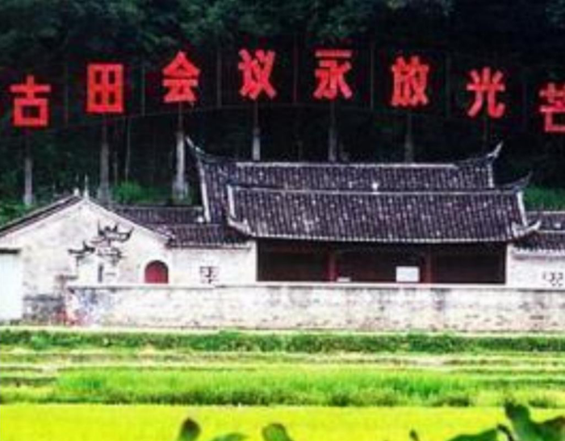
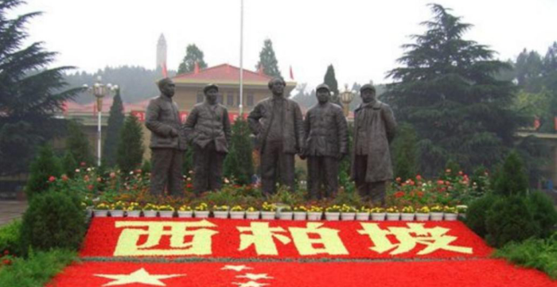
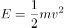

# 2020年国家公务员录用考试《行测》题（副省级网友回忆版）

> 常识判断 · 16 题 · 国考 2020

## 第 1 题　qid 2448447 · 人文常识

时代楷模是具有很强先进性、代表性、时代性和典型性的先进人物。下列时代楷模与事迹特点对应正确的是：

- **A**. 张富清—95岁老党员的本色人生　✅
- **B**. 杜富国—践行社会主义核心价值观的优秀知识分子
- **C**. 黄文秀—用生命担当使命的新时代英雄战士
- **D**. 黄大年—乡村教育守望者

**答案**：A

**官方解析**

本题考查政治常识。
A项正确，2019年6月17日，中央宣传部在湖北省来凤县向全社会公开发布张富清的先进事迹，授予他“时代楷模”称号。今年95岁的老党员张富清是原西北野战军359旅718团2营6连战士，在解放战争的枪林弹雨中九死一生，先后荣立一等功3次、二等功1次，被西北野战军记“特等功”，两次获得“战斗英雄”荣誉称号。1955年，张富清退役转业，主动选择到湖北省最偏远的来凤县工作，为贫困山区奉献一生。60多年来，张富清刻意尘封功绩，连儿女也不知情。2018年年底，在退役军人信息采集中，张富清的事迹被发现，这段英雄往事重现在人们面前。
B项错误，2019年5月22日，中央宣传部在北京向全社会宣传发布杜富国的先进事迹，授予他“时代楷模”称号。杜富国是陆军某扫雷排爆大队战士。入伍以来，他始终把忠诚和信仰刻在心中，把使命和责任扛在肩上，主动请缨征战雷场，苦练精练过硬本领，为人民利益和边境安宁挥洒热血，在平凡岗位干出了突出业绩。2018年10月11日，杜富国随队参加排雷作业时，危急时刻冲锋在前，为保护战友身受重伤，失去双眼和双手。杜富国同志曾先后获得“全国自强模范”“感动中国十大人物”、陆军“四有”新时代革命军人标兵等称号，荣立个人一等功。
C项错误，2019年7月1日，中宣部向全社会宣传发布黄文秀的先进事迹，追授她“时代楷模”称号。黄文秀同志生前是广西壮族自治区百色市委宣传部干部。2016年硕士研究生毕业后，她自愿回到百色革命老区工作，主动请缨到贫困村担任驻村第一书记。她自觉践行党的宗旨，始终把群众的安危冷暖装在心间，带领群众发展多种产业，为村民脱贫致富倾注了全部心血和汗水。2019年6月17日凌晨，黄文秀同志在突发山洪中不幸遇难，献出了年仅30岁的宝贵生命。黄文秀同志被追授“全国三八红旗手”“全国脱贫攻坚模范”等称号。
D项错误，2017年5月26日，中央宣传部向全社会公开宣传发布“践行社会主义核心价值观的优秀知识分子”黄大年的先进事迹，追授黄大年同志“时代楷模”荣誉称号。黄大年同志生前是享誉世界的地球物理学家。2009年，他放弃国外优越条件，怀着一腔爱国热情义无反顾返回祖国，担任母校吉林大学地球探测科学与技术学院全职教授、博士生导师，是东北地区首位引进的“千人计划”专家。7年多来，他不计得失、只争朝夕，带领科研团队辛勤奉献、顽强攻关，取得一系列重大科技成果，填补多项国内技术空白，部分成果达到国际领先水平，为深地资源探测和国防安全建设作出了突出贡献。2017年1月，黄大年同志因病逝世，年仅58岁。
故正确答案为A。

---

## 第 2 题　qid 2448552 · 人文常识

下列图片所反映的历史事件，按时间先后顺序排列正确的是：

图①

图②

图③

图④

- **A**. ②③①④
- **B**. ②①③④
- **C**. ①③②④　✅
- **D**. ①②③④

**答案**：C

**官方解析**

本题考查毛中特。
图①反映的是1921年7月23日，中国共产党第一次全国代表大会在上海举行。在会议进行过程中，突然有法租界巡捕闯进了会场，会议被迫中断。于是，最后一天的会议，便转到了浙江嘉兴南湖的一艘红色游船上举行。经过讨论，大会通过了中国共产党的第一个纲领和决议，并选举产生党的领导机构——中央局。
图②反映的是1934年10月，红军主力8.6万人跨过于都河，从这里踏上二万五千里长征的第一步，开启了人类历史上前所未有的壮举。
图③反映的是1929年12月28日召开的古田会议，即中国共产党红军第四军第九次代表大会。在福建省上杭县古田村召开，是人民军队建设史上的一个重要里程碑。这次会议的主要任务在于克服由于红四军的组织成分和长期处于艰苦的战斗环境而出现的各种非无产阶级思想，加强党对军队的领导。
图④反映的是1947年，以刘少奇、朱德为首的中央工作委员会先期进驻西柏坡。在这里召开了全国土地会议，颁布并实施了《中国土地法大纲》。1948年，毛泽东、周恩来、任弼时率领中共中央和解放军总部移驻西柏坡，在此组织指挥了震惊中外的辽沈、淮海、平津三大战役，召开了具有伟大历史意义的中共七届二中全会。
按时间先后，正确顺序为①③②④。
故正确答案为C。

---

## 第 3 题　qid 2448398 · 法律常识

“套路贷”是假借民间借贷之名，非法占有被害人财物的违法犯罪行为，是扫黑除恶专项斗争的重点打击对象。下列关于“套路贷”的说法正确的是：

- **A**. 
“套路贷”犯罪案件可由犯罪行为发生地、结果发生地及犯罪嫌疑人居住地公安机关侦查
　✅
- **B**. 
因法律规定民间借贷最高年利率为，故超过的可认定为“套路贷”

- **C**. 
因“套路贷”属于非法行为，追债时一般不会采用仲裁、诉讼方式

- **D**. 
我国刑法设置有专门针对“套路贷”的罪名

**答案**：A

**官方解析**

本题考查法律常识。根据最高人民法院、最高人民检察院、公安部、司法部《关于办理“套路贷”刑事案件若干问题的意见》：1.“套路贷”，是对以非法占有为目的，假借民间借贷之名，诱使或迫使被害人签订“借贷”或变相“借贷”“抵押”“担保”等相关协议，通过虚增借贷金额、恶意制造违约、肆意认定违约、毁匿还款证据等方式形成虚假债权债务，并借助诉讼、仲裁、公证或者采用暴力、威胁以及其他手段非法占有被害人财物的相关违法犯罪活动的概括性称谓。
A项正确，根据最高人民法院、最高人民检察院、公安部、司法部《关于办理“套路贷”刑事案件若干问题的意见》：11.“套路贷”犯罪案件一般由犯罪地公安机关侦查，如果由犯罪嫌疑人居住地公安机关立案侦查更为适宜的，可以由犯罪嫌疑人居住地公安机关立案侦查。犯罪地包括犯罪行为发生地和犯罪结果发生地······
B项错误，根据《关于办理“套路贷”刑事案件若干问题的意见》：“套路贷”与平等主体之间基于意思自治而形成的民事借贷关系存在本质区别，民间借贷的出借人是为了到期按照协议约定的内容收回本金并获取利息，不具有非法占有他人财物的目的，也不会在签订、履行借贷协议过程中实施虚增借贷金额、制造虚假给付痕迹、恶意制造违约、肆意认定违约、毁匿还款证据等行为。因此，“套路贷”与民间借贷有本质区别，并非以借款的年利率作为区分标准。
C项错误，根据最高人民法院、最高人民检察院、公安部、司法部《关于办理“套路贷”刑事案件若干问题的意见》：3.实践中，“套路贷”的常见犯罪手法和步骤包括但不限于以下情形：······（5）软硬兼施“索债”。在被害人未偿还虚高“借款”的情况下，犯罪嫌疑人、被告人借助诉讼、仲裁、公证或者采用暴力、威胁以及其他手段向被害人或者被害人的特定关系人索取“债务”。
D项错误，根据最高人民法院、最高人民检察院、公安部、司法部《关于办理“套路贷”刑事案件若干问题的意见》：9.对于“套路贷”犯罪分子，应当根据其所触犯的具体罪名，依法加大财产刑适用力度。符合刑法第三十七条之一规定的，可以依法禁止从事相关职业。我国刑法尚未设置专门针对“套路贷”的罪名，对于“套路贷”，应当根据其所触犯的具体罪名定罪量刑。
故正确答案为A。

---

## 第 4 题　qid 2448459 · 人文常识

关于党在新时代的强军目标，下列说法正确的是：

- **A**. 力争到本世纪中叶基本实现国防和军队现代化
- **B**. 建设一支听党指挥、能打胜仗、作风优良的人民军队　✅
- **C**. 到2035年把人民军队全面建成世界一流军队
- **D**. 确保到2020年全面实现机械化

**答案**：B

**官方解析**

本题考查政治常识。
ACD项错误，党的十九大作出新时代国防和军队建设新的“三步走”发展战略，即：到2020年基本实现机械化，信息化建设取得重大进展，战略能力有大的提升。同国家现代化进程相一致，全面推进军事理论现代化、军队组织形态现代化、军事人员现代化、武器装备现代化，力争到2035年基本实现国防和军队现代化，到本世纪中叶把人民军队全面建成世界一流军队。这个战略安排清晰勾画出实现党在新时代的强军目标的时间表、路线图，为新时代人民军队建设发展指明了方向。
B项正确，党的十九大报告指出：“坚持党对人民军队的绝对领导。建设一支听党指挥、能打胜仗、作风优良的人民军队，是实现‘两个一百年’奋斗目标、实现中华民族伟大复兴的战略支撑。”
故正确答案为B。

---

## 第 5 题　qid 2448417 · 人文常识

社会信用体系的建立有利于提高全社会的诚信意识和信用水平。下列关于国家加快社会信用体系建设的说法错误的是：

- **A**. “重点突破，强化应用”是社会信用体系建设的主要原则之一
- **B**. 为惩戒失信被执行人，规定其不得以财产支付子女就读高等院校的费用　✅
- **C**. 推进青年信用体系建设，逐步应用到入学、就业、创业等领域
- **D**. 使统一社会信用代码成为企业的唯一身份代码

**答案**：B

**官方解析**

本题考查政治常识。
A项正确，我国社会信用体系建设的主要原则：一是政府推动，社会共建。二是健全法制，规范发展。三是统筹规划，分步实施。四是重点突破，强化应用。
B项错误，可以对失信被执行人采取的行为有：一是禁止部分高消费行为，包括禁止乘坐飞机、列车软卧；二是实施其他信用惩戒，包括限制在金融机构贷款或办理信用卡；三是失信被执行人为自然人的，不得担任企业的法定代表人、董事、监事、高级管理人员等。没有规定其不得以财产支付子女就读高等院校的费用，故该选项说法错误。
C项正确，中共中央国务院印发的《中长期青年发展规划（2016-2025年）》中提到：“推进青年信用体系建设，逐步应用到青年入学、就业、创业等领域，引导青年践行诚信理念。”
D项正确，法人和其他组织统一社会信用代码相当于让法人和其他组织拥有了一个全国统一的“身份证号”，是推动社会信用体系建设的一项重要改革措施。2015年6月4日，国务院常务会议决定实施法人和其他组织统一社会信用代码制度，提升社会运行效率和信用。
本题为选非题，故正确答案为B。

---

## 第 6 题　qid 2448421 · 科技常识

关于近五年我国天文科技成就，下列说法错误的是：

- **A**. 在中国首次成功实现了月球激光测距
- **B**. 发现了新的太阳系外行星族群——热海星
- **C**. 发现了迄今为止最高能量的宇宙伽玛射线
- **D**. 拥有了世界最大口径光学红外望远镜​　✅

**答案**：D

**官方解析**

本题考查科技常识。
A项正确，2018年1月22日晚，中国科学院云南天文台应用天文研究团组利用1.2m望远镜激光测距系统，多次成功探测到月面反射器Apollo15返回的激光脉冲信号，在国内首次成功实现月球激光测距。
B项正确，南京大学天文与空间科学学院行星课题组与北京大学科维理天文研究所等单位合作利用国家天文台的郭守敬望远镜（LAMOST）发现了一类新的太阳系外行星族群—热海星（Hoptunes）。相关研究论文于2018年1月9日在《美国科学院院刊》（PNAS）发表，并被选为当期杂志封面的研究亮点文章之一。
C项正确，2019年7月初，中日合作西藏ASgamma实验团队利用我国西藏羊八井ASgamma实验阵列发现迄今为止最高能量的宇宙伽马射线，这些宇宙伽马射线来自蟹状星云方向，能量超过100TeV（1TeV即10的12次方电子伏特），最高达450TeV，比此前国际上正式发表的75TeV的最高能量高出5倍以上。这标志着超高能伽马射线天文观测进入到100TeV以上的观测能段，将有助于揭示宇宙极端天体的性质。
D项错误，“十三五”期间中国或建世界最大口径的光学红外望远镜，现在并未建成。
本题为选非题，故正确答案为D。
备注：中国于“十三五”期间计划建设世界上最大口径红外光学望远镜，但目前还未建设成功。另外建于贵州省平塘县的世界最大单口径射电望远镜500米口径球面射电望远镜（FAST），是中国国家“十一五”重大科技基础设施建设项目，于2011年3月25日动工兴建；于2016年9月25日进行落成启动仪式，该科技基础设施进入试运行、试调试工作；于2020年1月11日通过中国国家验收工作，正式开放运行。

---

## 第 7 题　qid 2448426 · 人文常识

下列言论中涉及到的人才选拔制度，按出现顺序先后排列正确的是：
①学通行修，经中博士
②宗室非有军功论，不得为属籍
③九品访人，唯问中正
④风吹金榜落凡世，三十三人名字香

- **A**. ②①③④　✅
- **B**. ③②④①
- **C**. ②④①③
- **D**. ①③②④​

**答案**：A

**官方解析**

本题考查人文常识。
①“学通行修，经中博士”反映的是察举制。察举制是西汉时期选拔官吏的一种制度，它的主要特征是由地方长官在辖区内随时考察、选取人才并推荐给上级或中央，经过试用考核再任命官职。
②“宗室非有军功论，不得为属籍”出自司马迁《史记·商君列传》，反映的是军功爵制。军功爵制的出现和确立，在先秦军事史上具有划时代的意义，事实上，由于军功爵制的实行，列国也都程度不同地收到了富国强兵的效果。
③“九品访人，唯问中正”反映的是九品中正制。九品中正制，又称九品官人法，是魏晋南北朝时期重要的选官制度，是曹丕采纳吏部尚书陈群的意见，命其制定的制度。
④“风吹金榜落凡世，三十三人名字香”反映的是科举制。科举是通过考试选拔官吏，具有分科考试，取士权归于中央所有，允许自由报考和主要以成绩定取舍等显著的特点。科举制从隋朝开始实行。
按出现顺序先后排列正确的是②①③④。
故正确答案为A。

---

## 第 8 题　qid 2448555 · 人文常识

关于陶瓷，下列说法错误的是：

- **A**. “入窑一色，出窑万彩”是钧瓷的特点
- **B**. 紫砂壶是用含铁量较高的黏土制成的
- **C**. 景德镇在宋代时期主要烧制青白瓷
- **D**. 唐三彩中最具代表性的造型是虎和骆驼　✅

**答案**：D

**官方解析**

本题考查人文常识。
A项正确，钧瓷以其“入窑一色、出窑万彩”的独特的自然窑变艺术特征而著称于世，钧瓷之美，美在窑变。钧瓷以“釉具五色，艳丽绝伦，窑变美妙，彩色缤纷”为其他窑口瓷器所无法媲美。
B项正确，紫砂壶是用含铁量较高的黏土制成的，紫砂泥被称作"泥中泥，岩中岩"，含铁量较高，是紫泥、红泥（朱泥）、绿泥（米黄色）的总称。
C项正确，青白瓷是宋代景德镇窑烧制成的一种具有独特风格的瓷器，并风靡国内外，至南宋时形成了以景德镇为中心的南方青白瓷系，除景德镇外，安徽、福建、湖北、广东、广西等地都有烧青白釉瓷器的窑场。
D项错误，动物俑是出土的唐三彩中数量最多、工艺较好的陶器。最常见的是马和骆驼，此外还有牛、驴、猪、狗、鸡、鸭、猴、狮、龟，以及人面、兽面镇墓兽等。这些动物俑的作用是给墓主提供交通工具或保卫墓主的安全。其中，马是古人生活、军事上不可缺少的动物，所以唐人对马非常重视，所塑造的三彩马是唐三彩中最出色的陶器。
本题为选非题，故正确答案为D。

---

## 第 9 题　qid 2448556 · 科技常识

关于诗句涉及的物候特征，下列对应错误的是：

- **A**. 不知近水花先发，疑是经冬雪未销——水对温度的调节作用
- **B**. 羌笛何须怨杨柳，春风不度玉门关——冷锋过境产生的天气变化　✅
- **C**. 春风疑不到天涯，二月山城未见花——海拔对植物生长的影响
- **D**. 南枝向暖北枝寒，一种春风有两般——光照对植物的影响

**答案**：B

**官方解析**

本题考查地理国情。
A项正确，“不知近水花先发，疑是经冬雪未销”出自张谓的《早梅》，意思是：“人们不知道寒梅靠近溪水而提早开放，以为那是经过冬天而尚未消融的白雪。”这是因为水的比热容大，其升降温都较慢，所以近水的地方夏季温度较低、冬季温度较高，近水的地方温度高，早春的花先开放了，诗句体现了水对温度的调节作用。
B项错误，“羌笛何须怨杨柳，春风不度玉门关”出自王之涣的《凉州词》，意思是：“何必用羌笛吹起那哀怨的杨柳曲去埋怨春光迟迟不来呢，原来玉门关一带春风是吹不到的啊！”诗句中的“春风”是指夏季风，在气候学上，受夏季风影响明显的地方称为季风区，反之则称为非季风区。玉门关正处于非季风区，所以出现“春风不度玉门关”。与冷锋过境无关。
C项正确，“春风疑不到天涯，二月山城未见花”出自欧阳修的《戏答元珍》，意思是：“我真怀疑春风吹不到这边远的山城，已是二月，居然还见不到一朵花。”通常情况下，海拔越高，气温越低。海拔每上升100米，气温下降0.6摄氏度。而温度又是影响植物生长的重要因素，故诗句体现了海拔对植物生长的作用。
D项正确，“南枝向暖北枝寒，一种春风有两般”出自观梅女仙的《题壁》，从地理角度看，是由于光照强度不同，南枝向阳，光照较强，温度较高；北枝背阳，光照较弱，温度较低。体现了光照对植物的影响。
本题为选非题，故正确答案为B。

---

## 第 10 题　qid 2448430 · 人文常识

下列与成语有关的描述错误的是：

- **A**. “叶落归根”是因为地球表面的物体会受到重力的作用
- **B**. “青出于蓝”描述的是传统植物染料的提取过程
- **C**. “囊萤映雪”中“囊萤”和“映雪”包含的光学原理相同　✅
- **D**. “沙里淘金”中的“金”属于金属单质

**答案**：C

**官方解析**

本题考查科技常识。
A项正确，物体由于地球的吸引而受到的力叫重力。重力的施力物体是地心，重力的方向总是竖直向下。叶落归根意思是树叶从树根发出，最终凋落后回到树根，是由于重力的作用。
B项正确，“青出于蓝”中，青，即靛青；蓝，即蓼蓝之类可作染料的草。青是从蓝草里提炼出来的，但颜色比蓝更深。最初是比喻人通过学习可以提升自己，后多用来比喻学生超过老师或后人胜过前人。
C项错误，“囊萤”出自典故“囊萤夜读”，是指车胤用白绢做成透光的袋子，装着萤火虫照亮书本在夜晚继续学习，萤火虫的发光原理是因为在其发光器的部位，存在着一种含磷的化学物质，称为萤光素；“映雪”出自典故“孙康映雪”，是指孙康利用半夜地上雪反射的月光读书，体现的光学原理是光的反射。故二者利用的光学原理不一致。
D项正确，元素的存在形式由其化学性质决定，金的化学性质稳定，不与土壤中的水及氧气等物质发生反应，在自然界中以单质的形式存在。故“沙里淘金”中的“金”属于金属单质。
本题为选非题，故正确答案为C。

---

## 第 11 题　qid 2448549 · 科技常识

下列关于电池的说法错误的是：

- **A**. 干电池利用液态电解液产生电流　✅
- **B**. 自行放电是蓄电池不可避免的渐生故障
- **C**. 锂电池不会产生铅、汞等有害重金属物质
- **D**. 太阳能电池产生的电是直流电​

**答案**：A

**官方解析**

本题考查科技常识。
A项错误，干电池是一种以糊状电解液来产生直流电的化学电池，湿电池为使用液态电解液的化学电池。
B项正确，蓄电池的自行放电和极板逐渐硫化是铅酸蓄电池不可避免的“渐生故障”，会使蓄电池的技术状态变差，工作能力逐渐削弱以至报废，因此需定期对蓄电池的技术状态进行检测。
C项正确，锂金属电池一般是使用二氧化锰为正极材料、金属锂或其合金金属为负极材料、使用非水电解质溶液的电池。锂离子电池一般是使用锂合金金属氧化物为正极材料、石墨为负极材料、使用非水电解质的电池。在上述两种锂电池的工作过程中，均不会产生铅、汞等有害重金属物质。
D项正确，太阳能电池是通过光电效应或者光化学效应直接把光能转化成电能的装置，产生的电是直流电。若需提供电力给家电用品或各式电器则需加装直/交流转换器，换成交流电，才能供电至家庭用电或工业用电。
本题为选非题，故正确答案为A。

---

## 第 12 题　qid 2448550 · 人文常识

关于能量与做功，下列说法正确的是：

- **A**. 雨点从高空中匀速下落时只有重力做功
- **B**. 匀速圆周运动的物体动能始终发生变化
- **C**. 自由落体过程中物体的机械能保持不变　✅
- **D**. 向上飞的石子重力做负功导致势能减小​

**答案**：C

**官方解析**

本题考查科技常识。

A项错误，牛顿第一运动定律，又称惯性定律、惰性定律，定义为：一切物体在没有受到外力的作用时，总保持静止状态或匀速直线运动状态。雨点从高空中匀速下落，说明雨点受到的合外力为零。雨点此时受到向上的空气阻力和向下的重力。如果一个物体受到力的作用，并在力的方向上发生了一段位移，我们就说这个力对物体做了功。显然，雨点受到的空气阻力和重力都在力的方向上发生了位移，即空气阻力和重力对雨点都做了功。

B项错误，匀速圆周运动，亦称“匀速率圆周运动”，因为物体作圆周运动时速率不变，但速度方向随时发生变化。动能是指物体由于运动而具有的能量，它的大小定义为物体质量与速度平方乘积的二分之一，即。对于匀速圆周运动的物体，质量m和速率v不变，动能也不变。

C项正确，在只有重力或弹力做功的物体系统内(或者不受其他外力的作用下），物体系统的动能和势能（包括重力势能和弹性势能）发生相互转化，但机械能的总能量保持不变。这个规律叫做机械能守恒定律。物体在只受重力作用下从相对静止开始下落的运动叫做自由落体运动。对于自由落体过程中的物体，符合机械能守恒定律，在下落过程中，重力势能转化为动能，但机械能总量保持不变。

D项错误，势能是指物体（或系统）由于位置或位形而具有的能。功等于力与物体在力的方向上通过距离的乘积。功的正负表示是动力对物体做功还是阻力对物体做功，或者说是表示力对物体做了功还是物体克服这个力做了功。对于向上飞的石子，受到向下的重力，需要克服重力，即重力做负功。同时，石子的动能转化为重力势能，动能减小，势能增加。

故正确答案为C。

---

## 第 13 题　qid 2448551 · 科技常识

白居易有诗云：“绿蚁新醅酒，红泥小火炉。晚来天欲雪，能饮一杯无？”下列与该诗相关的说法正确的是：

- **A**. “绿蚁”是因为酒中添加了可食用调色剂
- **B**. “醅酒”的过程利用了微生物的作用　✅
- **C**. 炉火燃烧的过程是内能转化成化学能
- **D**. 从雪到水的转化过程会释放出热量​

**答案**：B

**官方解析**

本题考查科技常识。
A项错误，由于酒是新近酿好的，未经过滤，酒面泛起酒渣泡沫，颜色微绿，细小如蚁，故称“绿蚁”。“绿蚁”并非是因为酒中添加了可食用调色剂。
B项正确，“醅酒”是指酿造酒，是利用微生物发酵生产含一定浓度酒精饮料的过程。
C项错误，内能是物质系统内部分子热运动的各种形式的动能以及分子间势能的总和。化学能是指参与化学反应的物质所具有的能量。炉火燃烧的过程是化学能转化成内能。
D项错误，融雪的时候水由固体变为液体会吸收热量，使气温降低。
故正确答案为B。

---

## 第 14 题　qid 2448553 · 人文常识

关于塑料大棚，下列说法正确的是：

- **A**. 塑料大棚的薄膜能够提高光照强度
- **B**. 搭建塑料大棚能有效防御地质灾害
- **C**. 冬季在塑料大棚内熏烟有助于防御霜冻　✅
- **D**. 无土栽培技术必须在塑料大棚中进行​

**答案**：C

**官方解析**

本题考查科技常识。
A项错误，塑料大棚内的光照强度比外界要低，因为所有的塑料薄膜都有吸收和反光作用。
B项错误，地质灾害是指因地质现象给人类造成的灾害，包括地震、海啸、火山喷发、山崩、滑坡、泥石流、塌陷、地面下沉等。地质灾害破坏性强，塑料大棚无法起到防御作用。
C项正确，大气凭借自身的温度向外辐射能量，为大气辐射。大气辐射中一小部分向上，散失于宇宙空间；其余大部分向下，归还给地面。大气辐射中向下的部分，称为大气逆辐射，属于长波辐射。由于大气逆辐射的存在，使地面实际损失的热量比它以长波辐射放出的热量要少一些。大气逆辐射的强度主要与大气中的水汽含量、二氧化碳之类所谓“温室气体”的浓度以及大气温度成正比关系。人造烟幕中含有大量的二氧化碳、水汽、尘埃，能强烈地吸收地面辐射，从而增强大气逆辐射，减少夜晚地面辐射损失的热量，对地面起到保温的作用，所以可以预防霜冻。
D项错误，无土栽培指完全不用土壤而用化肥溶液（营养液）供给作物养分的栽培方法。无土栽培设施分为环境设施、监控设施及栽培设施。环境设施主要指生产蔬菜的保护地设施，即温室、大棚、中棚等。因此无土栽培栽培场所不仅仅局限于塑料大棚。
故正确答案为C。

---

## 第 15 题　qid 2448554 · 科技常识

下列与疫苗有关的说法正确的是：

- **A**. 疫苗通过三角肌注射才能产生作用
- **B**. 免疫力弱的人不能接种疫苗
- **C**. 疫苗的接种者必须是健康个体
- **D**. 卡介疫苗是典型的活疫苗​　✅

**答案**：D

**官方解析**

本题考查科技常识。
A项错误，1988年WHO建议：狂犬病疫苗注射部位由臀部改为上臂三角肌。观察证明狂犬病疫苗注入人体不同部位会产生不同程度的抗体应答，其中注射三角肌抗体应答滴度最高，臀部肌肉注射滴度最低，比较观察乙肝疫苗在臀部和三角肌肌肉注射的免疫效果也证明：三角肌注射的抗体阳转率和GMT均比臀部肌肉注射的高得多。普遍认为这是由于注入臀部脂肪中，影响疫苗的吸收与免疫效果的发挥，而三角肌较接近腋下淋巴结，有利于免疫力的产生。所以并不是疫苗通过三角肌注射才能产生作用，只是通过三角肌注射效果比较好。
B项错误，免疫力低下者一般不可以接种减毒活疫苗，而灭活疫苗是可以接种的，比如乙肝疫苗等。
C项错误，预防性接种，受种者普遍是健康的个体。然而在治疗性接种中，比如狂犬疫苗，由于狂犬病是致命性疾病，为挽救生命任何禁忌症都是次要的，故被患狂犬病的动物咬后预防无禁忌症。
D项正确，卡介苗是一种减毒牛型结核分枝杆菌活菌疫苗，用来预防结核病的疫苗。卡介苗接种后可使儿童产生对结核病的特殊抵抗力，可以降低儿童结核病的发病率及其严重性，特别是结核性脑膜炎等严重结核病减少，并可减少此后内源性恶化的可能性。
故正确答案为D。

---

## 第 16 题　qid 2448444 · 科技常识

下列与现代通讯科技有关的说法错误的是：

- **A**. 高密度无线网络技术是5G移动通信技术的关键之一
- **B**. 计算机通信的基本原理是将逻辑信号转换为电信号　✅
- **C**. 路由器可以根据信道情况自动选择和设定路由
- **D**. 无线局域网利用射频技术进行通信连接​

**答案**：B

**官方解析**

本题考查科技常识。
A项正确，5G移动通信标志性的关键技术主要体现在超高效能的无线传输技术和高密度无线网络技术。
B项错误，计算机通信的基本原理是将电信号转换为逻辑信号，其转换方式是将高低电平表示为二进制数中的1和0，再通过不同的二进制序列来表示所有的信息。
C项正确，路由器是连接因特网中各局域网、广域网的设备，它会根据信道的情况自动选择和设定路由，以最佳路径，按前后顺序发送信号。
D项正确，无线局域网是计算机网络与无线通信技术结合的产物，它以无线信道作传输媒介，利用射频技术实现局域网的全部功能，是一种更灵活、建网速度快、适合移动办公及有线网络难以达到的接入方式。
本题为选非题，故正确答案为B。

---
