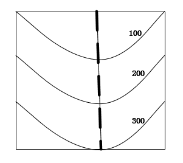

# 2020年国家公务员录用考试《行测》题（地市级网友回忆版）

> 常识判断 · 17 题 · 国考 2020

## 第 1 题　qid 2448419 · 人文常识

下列有关“不忘初心、牢记使命”主题教育的说法正确的是：

- **A**. 总要求是坚守初心使命，积极担当作为
- **B**. 根本任务是建设高素质党员干部队伍
- **C**. 把学习教育、调查研究、检视问题、整改落实贯穿主题教育全过程　✅
- **D**. 具体目标是找差距、抓落实

**答案**：C

**官方解析**

本题考查政治。
A、B、D项错误，2019年5月31日，“不忘初心、牢记使命”主题教育工作会议在北京召开。习近平总书记出席会议并发表重要讲话。他强调：开展“不忘初心、牢记使命”主题教育，要牢牢把握守初心、担使命，找差距、抓落实的总要求，牢牢把握深入学习贯彻新时代中国特色社会主义思想、锤炼忠诚干净担当的政治品格、团结带领全国各族人民为实现伟大梦想共同奋斗的根本任务，努力实现理论学习有收获、思想政治受洗礼、干事创业敢担当、为民服务解难题、清正廉洁作表率的具体目标，确保这次主题教育取得扎扎实实的成效。
C项正确，习近平总书记在“不忘初心、牢记使命”主题教育工作会议上的讲话指出，各地区各部门各单位要结合实际，创造性开展工作，把学习教育、调查研究、检视问题、整改落实贯穿主题教育全过程，努力取得最好成效。
故正确答案为C。

---

## 第 2 题　qid 2448447 · 人文常识

时代楷模是具有很强先进性、代表性、时代性和典型性的先进人物。下列时代楷模与事迹特点对应正确的是：

- **A**. 张富清—95岁老党员的本色人生　✅
- **B**. 杜富国—践行社会主义核心价值观的优秀知识分子
- **C**. 黄文秀—用生命担当使命的新时代英雄战士
- **D**. 黄大年—乡村教育守望者

**答案**：A

**官方解析**

本题考查政治常识。
A项正确，2019年6月17日，中央宣传部在湖北省来凤县向全社会公开发布张富清的先进事迹，授予他“时代楷模”称号。今年95岁的老党员张富清是原西北野战军359旅718团2营6连战士，在解放战争的枪林弹雨中九死一生，先后荣立一等功3次、二等功1次，被西北野战军记“特等功”，两次获得“战斗英雄”荣誉称号。1955年，张富清退役转业，主动选择到湖北省最偏远的来凤县工作，为贫困山区奉献一生。60多年来，张富清刻意尘封功绩，连儿女也不知情。2018年年底，在退役军人信息采集中，张富清的事迹被发现，这段英雄往事重现在人们面前。
B项错误，2019年5月22日，中央宣传部在北京向全社会宣传发布杜富国的先进事迹，授予他“时代楷模”称号。杜富国是陆军某扫雷排爆大队战士。入伍以来，他始终把忠诚和信仰刻在心中，把使命和责任扛在肩上，主动请缨征战雷场，苦练精练过硬本领，为人民利益和边境安宁挥洒热血，在平凡岗位干出了突出业绩。2018年10月11日，杜富国随队参加排雷作业时，危急时刻冲锋在前，为保护战友身受重伤，失去双眼和双手。杜富国同志曾先后获得“全国自强模范”“感动中国十大人物”、陆军“四有”新时代革命军人标兵等称号，荣立个人一等功。
C项错误，2019年7月1日，中宣部向全社会宣传发布黄文秀的先进事迹，追授她“时代楷模”称号。黄文秀同志生前是广西壮族自治区百色市委宣传部干部。2016年硕士研究生毕业后，她自愿回到百色革命老区工作，主动请缨到贫困村担任驻村第一书记。她自觉践行党的宗旨，始终把群众的安危冷暖装在心间，带领群众发展多种产业，为村民脱贫致富倾注了全部心血和汗水。2019年6月17日凌晨，黄文秀同志在突发山洪中不幸遇难，献出了年仅30岁的宝贵生命。黄文秀同志被追授“全国三八红旗手”“全国脱贫攻坚模范”等称号。
D项错误，2017年5月26日，中央宣传部向全社会公开宣传发布“践行社会主义核心价值观的优秀知识分子”黄大年的先进事迹，追授黄大年同志“时代楷模”荣誉称号。黄大年同志生前是享誉世界的地球物理学家。2009年，他放弃国外优越条件，怀着一腔爱国热情义无反顾返回祖国，担任母校吉林大学地球探测科学与技术学院全职教授、博士生导师，是东北地区首位引进的“千人计划”专家。7年多来，他不计得失、只争朝夕，带领科研团队辛勤奉献、顽强攻关，取得一系列重大科技成果，填补多项国内技术空白，部分成果达到国际领先水平，为深地资源探测和国防安全建设作出了突出贡献。2017年1月，黄大年同志因病逝世，年仅58岁。
故正确答案为A。

---

## 第 3 题　qid 2448452 · 人文常识

坚持农村基本经营制度，是党的农村政策的基石，是乡村振兴的制度基础。关于农村基本经营制度，下列说法错误的是：

- **A**. 实行家庭承包经营为基础、统分结合的双层经营体制
- **B**. 保持土地承包关系稳定并长久不变，第二轮土地承包到期后再延长三十年
- **C**. 完善农村承包地所有权、承包权、经营权“三权”分置制度
- **D**. 支持进城落户农民依法自愿有偿转让集体土地所有权　✅

**答案**：D

**官方解析**

本题考查政治常识。
A项正确，《宪法》第八条第一款规定：“农村集体经济组织实行家庭承包经营为基础、统分结合的双层经营体制。农村中的生产、供销、信用、消费等各种形式的合作经济，是社会主义劳动群众集体所有制经济。参加农村集体经济组织的劳动者，有权在法律规定的范围内经营自留地、自留山、家庭副业和饲养自留畜。”
B项正确，《中共中央国务院关于实施乡村振兴战略的意见》中指出：“巩固和完善农村基本经营制度。落实农村土地承包关系稳定并长久不变政策，衔接落实好第二轮土地承包到期后再延长30年的政策，让农民吃上长效‘定心丸’。”
C项正确，2016年，国务院印发《关于完善农村土地所有权承包权经营权分置办法的意见》，将农村土地产权中的土地承包经营权进一步划分为承包权和经营权，实行所有权、承包权、经营权分置并行。2018年，《中共中央国务院关于实施乡村振兴战略的意见》中指出：“完善农村承包地‘三权分置’制度，在依法保护集体土地所有权和农户承包权前提下，平等保护土地经营权。”
D项错误，《农村土地承包法》第二十七条规定：“承包期内，发包方不得收回承包地。国家保护进城农户的土地承包经营权。不得以退出土地承包经营权作为农户进城落户的条件。承包期内，承包农户进城落户的，引导支持其按照自愿有偿原则依法在本集体经济组织内转让土地承包经营权或者将承包地交回发包方，也可以鼓励其流转土地经营权。承包期内，承包方交回承包地或者发包方依法收回承包地时，承包方对其在承包地上投入而提高土地生产能力的，有权获得相应的补偿。”引导支持按照自愿有偿原则依法在本集体经济组织内转让土地承包经营权，而非集体土地所有权。
本题为选非题，故正确答案为D。

---

## 第 4 题　qid 2448456 · 法律常识

党的十八大以来，我国在重要历史节点已依法实施两次特赦，具有重大意义。下列与之相关的说法错误的是：

- **A**. 两次特赦时间分别为2015年和2019年
- **B**. 特赦对象包括被判处监禁刑和非监禁刑的罪犯
- **C**. 特赦令由全国人民代表大会常务委员会签发　✅
- **D**. 特赦须经人民法院裁定

**答案**：C

**官方解析**

本题考查政治常识。
A项正确，2015年8月29日，国家主席习近平签署主席特赦令，根据十二届全国人大常委会第十六次会议29日通过的全国人大常委会关于特赦部分服刑罪犯的决定，对参加过抗日战争、解放战争等四类服刑罪犯实行特赦。2019年6月29日，国家主席习近平签署发布特赦令，根据十三届全国人大常委会第十一次会议通过的全国人大常委会关于在中华人民共和国成立七十周年之际对部分服刑罪犯予以特赦的决定，对九类服刑罪犯实行特赦。
B项正确，特赦是指对国家特定的犯罪分子免去其刑罚的部分或全部的执行，只能消灭其刑，不能消灭其罪。经特赦免除刑罚的犯罪分子，不论其刑罚已经执行一部分还是完全没有执行，都等同于刑罚已执行完，以后无论何时，都不能因为没有执行或没有执行完，而重新再次追诉。特赦对象包括被判处监禁刑或者非监禁刑的罪犯。
C项错误，《宪法》第六十七条规定：“全国人民代表大会常务委员会行使下列职权：······（十八）决定特赦；······”根据《宪法》第八十条的规定，中华人民共和国主席根据全国人民代表大会常务委员会的决定发布特赦令。特赦令由国家主席签发，全国人大常委会有权决定特赦。
D项正确，在主席特赦令中指出，对符合条件的服刑罪犯，经人民法院依法作出裁定后，予以释放。由此可知，特赦须经人民法院裁定。
本题为选非题，故正确答案为C。

---

## 第 5 题　qid 2448459 · 人文常识

关于党在新时代的强军目标，下列说法正确的是：

- **A**. 力争到本世纪中叶基本实现国防和军队现代化
- **B**. 建设一支听党指挥、能打胜仗、作风优良的人民军队　✅
- **C**. 到2035年把人民军队全面建成世界一流军队
- **D**. 确保到2020年全面实现机械化

**答案**：B

**官方解析**

本题考查政治常识。
ACD项错误，党的十九大作出新时代国防和军队建设新的“三步走”发展战略，即：到2020年基本实现机械化，信息化建设取得重大进展，战略能力有大的提升。同国家现代化进程相一致，全面推进军事理论现代化、军队组织形态现代化、军事人员现代化、武器装备现代化，力争到2035年基本实现国防和军队现代化，到本世纪中叶把人民军队全面建成世界一流军队。这个战略安排清晰勾画出实现党在新时代的强军目标的时间表、路线图，为新时代人民军队建设发展指明了方向。
B项正确，党的十九大报告指出：“坚持党对人民军队的绝对领导。建设一支听党指挥、能打胜仗、作风优良的人民军队，是实现‘两个一百年’奋斗目标、实现中华民族伟大复兴的战略支撑。”
故正确答案为B。

---

## 第 6 题　qid 2448464 · 法律常识

对侵害英雄烈士的姓名、肖像、名誉、荣誉的行为，有权向人民法院提起诉讼的主体是：
①英雄烈士近亲属
②检察机关
③当地人民政府
④负责英雄烈士保护工作的部门

- **A**. ②④
- **B**. ①④
- **C**. ①③
- **D**. ①②　✅

**答案**：D

**官方解析**

本题考查法律常识。
《英雄烈士保护法》第二十五条第一款、第二款规定：“对侵害英雄烈士的姓名、肖像、名誉、荣誉的行为，英雄烈士的近亲属可以依法向人民法院提起诉讼。英雄烈士没有近亲属或者近亲属不提起诉讼的，检察机关依法对侵害英雄烈士的姓名、肖像、名誉、荣誉，损害社会公共利益的行为向人民法院提起诉讼。”因此，有权向人民法院提出诉讼的主体是英雄烈士的近亲属和检察机关。
故正确答案为D。

---

## 第 7 题　qid 2448467 · 法律常识

2018年某大型玻璃厂超标排放大气污染物，严重污染了周边的大气环境。根据我国相关法律，下列哪项无违法记录且符合年限要求的主体有权提起公益诉讼？

- **A**. 由周边住户合法有效推选出的某环保志愿者
- **B**. 依法在邻省民政厅登记的某环保协会　✅
- **C**. 依法在玻璃厂所在地的县民政局登记的某环保中心
- **D**. 在国外合法设立但尚未在我国民政部门登记的某环保基金会

**答案**：B

**官方解析**

本题考查法律常识。
《环境保护法》第五十八条规定：“对污染环境、破坏生态，损害社会公共利益的行为，符合下列条件的社会组织可以向人民法院提起诉讼：（一）依法在设区的市级以上人民政府民政部门登记；（二）专门从事环境保护公益活动连续五年以上且无违法记录。符合前款规定的社会组织向人民法院提起诉讼，人民法院应当依法受理。提起诉讼的社会组织不得通过诉讼牟取经济利益。”根据上述规定，无违法记录且符合年限要求的主体必须是依法在设区的市级以上人民政府民政部门登记的社会组织可以起诉。
故正确答案为B。

---

## 第 8 题　qid 2448397 · 人文常识

甲乘坐公交车时因到站未停与司机发生争执，一怒之下抢夺正在行驶的公交车方向盘，致公交车失控撞到路边电线杆，乘客及行人受伤、公交车严重受损。甲的行为构成：

- **A**. 以危险方法危害公共安全罪　✅
- **B**. 交通肇事罪
- **C**. 寻衅滋事罪
- **D**. 危险驾驶罪

**答案**：A

**官方解析**

【备注】：本题根据刑法修正案十一，无正确答案，题目已过时。
据《刑法》第一百三十三条之二规定：【妨害安全驾驶罪】对行驶中的公共交通工具的驾驶人员使用暴力或者抢控驾驶操纵装置，干扰公共交通工具正常行驶，危及公共安全的，处一年以下有期徒刑、拘役或者管制，并处或者单处罚金。前款规定的驾驶人员在行驶的公共交通工具上擅离职守，与他人互殴或者殴打他人，危及公共安全的，依照前款的规定处罚。有前两款行为，同时构成其他犯罪的，依照处罚较重的规定定罪处罚。故本题无正确答案。
本题考查法律常识。
A项正确，根据《刑法》第一百一十四条、第一百一十五条的规定，以危险方法危害公共安全罪是指故意使用放火、决水、爆炸、投放危险物质以外的危险方法危害公共安全的行为。第一百三十三条之二规定：“对行驶中的公共交通工具的驾驶人员使用暴力或者抢控驾驶操纵装置，干扰公共交通工具正常行驶，危及公共安全的，处一年以下有期徒刑、拘役或者管制，并处或者单处罚金。······有前两款行为，同时构成其他犯罪的，依照处罚较重的规定定罪处罚。”甲在公交车行驶途中抢夺方向盘，危害不特定多人的生命、健康和公私财产的安全，并造成了严重后果，甲的行为构成以危险方法危害公共安全罪。
B项错误，根据《刑法》第一百三十三条的规定，交通肇事罪是指违反交通运输管理法规，因而发生重大事故，致人重伤、死亡或者使公私财产遭受重大损失的行为。交通肇事罪主观方面是过失，而题中甲抢夺方向盘时的主观方面是故意，显然不构成交通肇事罪。
C项错误，根据《刑法》第二百九十三条第一款规定：“有下列寻衅滋事行为之一，破坏社会秩序的，处五年以下有期徒刑、拘役或者管制：（一）随意殴打他人，情节恶劣的；（二）追逐、拦截、辱骂、恐吓他人，情节恶劣的；（三）强拿硬要或者任意损毁、占用公私财物，情节严重的；（四）在公共场所起哄闹事，造成公共场所秩序严重混乱的。”寻衅滋事罪侵犯的客体是社会公共秩序，而题中甲的行为危害不特定多人的生命、健康和公私财产的安全，因此不构成寻衅滋事罪。
D项错误，根据《刑法》第一百三十三条之一第一款规定：“在道路上驾驶机动车，有下列情形之一的，处拘役，并处罚金：（一）追逐竞驶，情节恶劣的；（二）醉酒驾驶机动车的；（三）从事校车业务或者旅客运输，严重超过额定乘员载客，或者严重超过规定时速行驶的；（四）违反危险化学品安全管理规定运输危险化学品，危及公共安全的。”甲抢夺方向盘的行为不符合危险驾驶罪的情形。
故正确答案为A。

---

## 第 9 题　qid 2448398 · 法律常识

“套路贷”是假借民间借贷之名，非法占有被害人财物的违法犯罪行为，是扫黑除恶专项斗争的重点打击对象。下列关于“套路贷”的说法正确的是：

- **A**. 
“套路贷”犯罪案件可由犯罪行为发生地、结果发生地及犯罪嫌疑人居住地公安机关侦查
　✅
- **B**. 
因法律规定民间借贷最高年利率为，故超过的可认定为“套路贷”

- **C**. 
因“套路贷”属于非法行为，追债时一般不会采用仲裁、诉讼方式

- **D**. 
我国刑法设置有专门针对“套路贷”的罪名

**答案**：A

**官方解析**

本题考查法律常识。根据最高人民法院、最高人民检察院、公安部、司法部《关于办理“套路贷”刑事案件若干问题的意见》：1.“套路贷”，是对以非法占有为目的，假借民间借贷之名，诱使或迫使被害人签订“借贷”或变相“借贷”“抵押”“担保”等相关协议，通过虚增借贷金额、恶意制造违约、肆意认定违约、毁匿还款证据等方式形成虚假债权债务，并借助诉讼、仲裁、公证或者采用暴力、威胁以及其他手段非法占有被害人财物的相关违法犯罪活动的概括性称谓。
A项正确，根据最高人民法院、最高人民检察院、公安部、司法部《关于办理“套路贷”刑事案件若干问题的意见》：11.“套路贷”犯罪案件一般由犯罪地公安机关侦查，如果由犯罪嫌疑人居住地公安机关立案侦查更为适宜的，可以由犯罪嫌疑人居住地公安机关立案侦查。犯罪地包括犯罪行为发生地和犯罪结果发生地······
B项错误，根据《关于办理“套路贷”刑事案件若干问题的意见》：“套路贷”与平等主体之间基于意思自治而形成的民事借贷关系存在本质区别，民间借贷的出借人是为了到期按照协议约定的内容收回本金并获取利息，不具有非法占有他人财物的目的，也不会在签订、履行借贷协议过程中实施虚增借贷金额、制造虚假给付痕迹、恶意制造违约、肆意认定违约、毁匿还款证据等行为。因此，“套路贷”与民间借贷有本质区别，并非以借款的年利率作为区分标准。
C项错误，根据最高人民法院、最高人民检察院、公安部、司法部《关于办理“套路贷”刑事案件若干问题的意见》：3.实践中，“套路贷”的常见犯罪手法和步骤包括但不限于以下情形：······（5）软硬兼施“索债”。在被害人未偿还虚高“借款”的情况下，犯罪嫌疑人、被告人借助诉讼、仲裁、公证或者采用暴力、威胁以及其他手段向被害人或者被害人的特定关系人索取“债务”。
D项错误，根据最高人民法院、最高人民检察院、公安部、司法部《关于办理“套路贷”刑事案件若干问题的意见》：9.对于“套路贷”犯罪分子，应当根据其所触犯的具体罪名，依法加大财产刑适用力度。符合刑法第三十七条之一规定的，可以依法禁止从事相关职业。我国刑法尚未设置专门针对“套路贷”的罪名，对于“套路贷”，应当根据其所触犯的具体罪名定罪量刑。
故正确答案为A。

---

## 第 10 题　qid 2448417 · 人文常识

社会信用体系的建立有利于提高全社会的诚信意识和信用水平。下列关于国家加快社会信用体系建设的说法错误的是：

- **A**. “重点突破，强化应用”是社会信用体系建设的主要原则之一
- **B**. 为惩戒失信被执行人，规定其不得以财产支付子女就读高等院校的费用　✅
- **C**. 推进青年信用体系建设，逐步应用到入学、就业、创业等领域
- **D**. 使统一社会信用代码成为企业的唯一身份代码

**答案**：B

**官方解析**

本题考查政治常识。
A项正确，我国社会信用体系建设的主要原则：一是政府推动，社会共建。二是健全法制，规范发展。三是统筹规划，分步实施。四是重点突破，强化应用。
B项错误，可以对失信被执行人采取的行为有：一是禁止部分高消费行为，包括禁止乘坐飞机、列车软卧；二是实施其他信用惩戒，包括限制在金融机构贷款或办理信用卡；三是失信被执行人为自然人的，不得担任企业的法定代表人、董事、监事、高级管理人员等。没有规定其不得以财产支付子女就读高等院校的费用，故该选项说法错误。
C项正确，中共中央国务院印发的《中长期青年发展规划（2016-2025年）》中提到：“推进青年信用体系建设，逐步应用到青年入学、就业、创业等领域，引导青年践行诚信理念。”
D项正确，法人和其他组织统一社会信用代码相当于让法人和其他组织拥有了一个全国统一的“身份证号”，是推动社会信用体系建设的一项重要改革措施。2015年6月4日，国务院常务会议决定实施法人和其他组织统一社会信用代码制度，提升社会运行效率和信用。
本题为选非题，故正确答案为B。

---

## 第 11 题　qid 2448421 · 科技常识

关于近五年我国天文科技成就，下列说法错误的是：

- **A**. 在中国首次成功实现了月球激光测距
- **B**. 发现了新的太阳系外行星族群——热海星
- **C**. 发现了迄今为止最高能量的宇宙伽玛射线
- **D**. 拥有了世界最大口径光学红外望远镜​　✅

**答案**：D

**官方解析**

本题考查科技常识。
A项正确，2018年1月22日晚，中国科学院云南天文台应用天文研究团组利用1.2m望远镜激光测距系统，多次成功探测到月面反射器Apollo15返回的激光脉冲信号，在国内首次成功实现月球激光测距。
B项正确，南京大学天文与空间科学学院行星课题组与北京大学科维理天文研究所等单位合作利用国家天文台的郭守敬望远镜（LAMOST）发现了一类新的太阳系外行星族群—热海星（Hoptunes）。相关研究论文于2018年1月9日在《美国科学院院刊》（PNAS）发表，并被选为当期杂志封面的研究亮点文章之一。
C项正确，2019年7月初，中日合作西藏ASgamma实验团队利用我国西藏羊八井ASgamma实验阵列发现迄今为止最高能量的宇宙伽马射线，这些宇宙伽马射线来自蟹状星云方向，能量超过100TeV（1TeV即10的12次方电子伏特），最高达450TeV，比此前国际上正式发表的75TeV的最高能量高出5倍以上。这标志着超高能伽马射线天文观测进入到100TeV以上的观测能段，将有助于揭示宇宙极端天体的性质。
D项错误，“十三五”期间中国或建世界最大口径的光学红外望远镜，现在并未建成。
本题为选非题，故正确答案为D。
备注：中国于“十三五”期间计划建设世界上最大口径红外光学望远镜，但目前还未建设成功。另外建于贵州省平塘县的世界最大单口径射电望远镜500米口径球面射电望远镜（FAST），是中国国家“十一五”重大科技基础设施建设项目，于2011年3月25日动工兴建；于2016年9月25日进行落成启动仪式，该科技基础设施进入试运行、试调试工作；于2020年1月11日通过中国国家验收工作，正式开放运行。

---

## 第 12 题　qid 2448426 · 人文常识

下列言论中涉及到的人才选拔制度，按出现顺序先后排列正确的是：
①学通行修，经中博士
②宗室非有军功论，不得为属籍
③九品访人，唯问中正
④风吹金榜落凡世，三十三人名字香

- **A**. ②①③④　✅
- **B**. ③②④①
- **C**. ②④①③
- **D**. ①③②④​

**答案**：A

**官方解析**

本题考查人文常识。
①“学通行修，经中博士”反映的是察举制。察举制是西汉时期选拔官吏的一种制度，它的主要特征是由地方长官在辖区内随时考察、选取人才并推荐给上级或中央，经过试用考核再任命官职。
②“宗室非有军功论，不得为属籍”出自司马迁《史记·商君列传》，反映的是军功爵制。军功爵制的出现和确立，在先秦军事史上具有划时代的意义，事实上，由于军功爵制的实行，列国也都程度不同地收到了富国强兵的效果。
③“九品访人，唯问中正”反映的是九品中正制。九品中正制，又称九品官人法，是魏晋南北朝时期重要的选官制度，是曹丕采纳吏部尚书陈群的意见，命其制定的制度。
④“风吹金榜落凡世，三十三人名字香”反映的是科举制。科举是通过考试选拔官吏，具有分科考试，取士权归于中央所有，允许自由报考和主要以成绩定取舍等显著的特点。科举制从隋朝开始实行。
按出现顺序先后排列正确的是②①③④。
故正确答案为A。

---

## 第 13 题　qid 2448430 · 人文常识

下列与成语有关的描述错误的是：

- **A**. “叶落归根”是因为地球表面的物体会受到重力的作用
- **B**. “青出于蓝”描述的是传统植物染料的提取过程
- **C**. “囊萤映雪”中“囊萤”和“映雪”包含的光学原理相同　✅
- **D**. “沙里淘金”中的“金”属于金属单质

**答案**：C

**官方解析**

本题考查科技常识。
A项正确，物体由于地球的吸引而受到的力叫重力。重力的施力物体是地心，重力的方向总是竖直向下。叶落归根意思是树叶从树根发出，最终凋落后回到树根，是由于重力的作用。
B项正确，“青出于蓝”中，青，即靛青；蓝，即蓼蓝之类可作染料的草。青是从蓝草里提炼出来的，但颜色比蓝更深。最初是比喻人通过学习可以提升自己，后多用来比喻学生超过老师或后人胜过前人。
C项错误，“囊萤”出自典故“囊萤夜读”，是指车胤用白绢做成透光的袋子，装着萤火虫照亮书本在夜晚继续学习，萤火虫的发光原理是因为在其发光器的部位，存在着一种含磷的化学物质，称为萤光素；“映雪”出自典故“孙康映雪”，是指孙康利用半夜地上雪反射的月光读书，体现的光学原理是光的反射。故二者利用的光学原理不一致。
D项正确，元素的存在形式由其化学性质决定，金的化学性质稳定，不与土壤中的水及氧气等物质发生反应，在自然界中以单质的形式存在。故“沙里淘金”中的“金”属于金属单质。
本题为选非题，故正确答案为C。

---

## 第 14 题　qid 2448432 · 科技常识

人们经常利用植物去判断生长地的环境，下列有关说法正确的是：

- **A**. 矮牵牛含有的花青素对二氧化硫有指示作用　✅
- **B**. 树林中所有树冠西边稀疏东边繁盛，说明东风盛行
- **C**. 胡杨的生长地土壤通常呈现深褐色
- **D**. 地衣大量生长反映空气湿度较低​

**答案**：A

**官方解析**

本题考查科技常识。
A项正确，花青素的颜色因酸碱度不同而异，在酸性条件下呈红色，在碱性条件下为蓝色。随着一天从早晨到晚上空气中二氧化硫含量的增加，矮牵牛对二氧化硫吸收量也逐渐加大，花中的酸性不断提高，从而造成花色由蓝变红。
B项错误，树木向风面的芽体由于受风的袭击而损坏，因此向风面枝条稀疏；而背风面的芽体则因受风的影响较小而存活较多。选项中树冠西边稀疏东边繁盛，说明风从西边吹来，即西风盛行。
C项错误，胡杨主要分布于中国西北各地，喜沙质土壤，常于沙漠地区水源附近形成绿洲，故胡杨的生长地土壤通常呈现黄色。
D项错误，地衣的生长一般喜爱高湿度、低温度及低光照强度。这些因素中湿度是其生长最重要的因素，因此地衣大量生长反映空气湿度较高。
故正确答案为A。

---

## 第 15 题　qid 2448437 · 人文常识

下列哪句诗涉及的地形接近下图？

- **A**. 横看成岭侧成峰，远近高低各不同
- **B**. 连峰去天不盈尺，枯松倒挂倚绝壁
- **C**. 天姥连天向天横，势拔五岳掩赤城
- **D**. 天寒日暮山谷里，肠断非关陇头水　✅

**答案**：D

**官方解析**

本题考查地理国情。
使用等高线区分地形可以按照以下知识点去判断：等高线弯曲部分向数值低处凸出——山脊；等高线弯曲部分向数值高处凸出——山谷；等高线闭合，数值从中心向四周逐渐降低——山顶；数值从中心向四周逐渐升高——盆地或洼地。题干中等高线地形图，等高线向数值高处凸出，说明图中所示地形为山谷。
A项错误，“横看成岭侧成峰，远近高低各不同”形容山峰连绵起伏，忽高忽低，有多个山顶，其等高线图上应有多个闭合圆环。
B项错误，“连峰去天不盈尺，枯松倒挂倚绝壁”形容山峰座座相连，越来越高，其等高线接近山脊，即弯曲部分应向数值低处凸出。
C项错误，“天姥连天向天横，势拔五岳掩赤城”形容天姥山高耸入云，远远高出周边环境，其等高线图上应有一处闭合圆环且海拔远远高出周边环境。
D项正确，“天寒日暮山谷里，肠断非关陇头水”描写的是山谷地形，符合题意。
故正确答案为D。

---

## 第 16 题　qid 2448439 · 人文常识

下列关于生活现象的说法错误的是：

- **A**. 无风时落叶各处受空气作用力不均，因此呈曲线翻转落下
- **B**. 衣服湿后对光线的反射能力减弱，因此颜色比干的时候深
- **C**. 挂钟电池耗尽后，秒针因受到重力矩的作用，会停在30秒的位置　✅
- **D**. 自来水中含有少量次氯酸，因此不宜直接用自来水养鱼​

**答案**：C

**官方解析**

本题考查科技常识。
A项正确，由于落叶各处凸凹不同，形状各异，因而在下落过程中，其表面各处的气流速度不同，根据流体力学原理，流速大，压强小，致使落叶上各处受空气作用力不均匀，且随落叶运动情况的变化而变化，所以落叶不断翻滚，曲折下落。
B项正确，物体反射的光线如果很多，那么我们看到它的颜色也就浅；它反射的光线很少，那么它的颜色就会很深。衣物的潮湿程度和光反射率呈负相关，所以衣服湿后对光线的反射能力减弱，因此颜色看起来比干的时候深。
C项错误，挂在壁墙上的石英钟，当电池的电能耗尽而停止走动时，其秒针往往停在刻度盘上“9”的位置。这是由于秒针在“9”的位置处受到重力矩的阻碍作用最大。所以秒针停的位置是45秒处，而不是30秒处。
D项正确，自来水常使用氯气消毒，氯气与水发生反应，会生成次氯酸，而次氯酸是一种强氧化剂，对鱼的健康有很大伤害。它使鱼体分泌的粘液失去了对鱼的保护作用，导致其体内电解质代谢严重失调，并在缺氧的状态下窒息死亡，所以，不宜直接用自来水养鱼。
本题为选非题，故正确答案为C。

---

## 第 17 题　qid 2448444 · 科技常识

下列与现代通讯科技有关的说法错误的是：

- **A**. 高密度无线网络技术是5G移动通信技术的关键之一
- **B**. 计算机通信的基本原理是将逻辑信号转换为电信号　✅
- **C**. 路由器可以根据信道情况自动选择和设定路由
- **D**. 无线局域网利用射频技术进行通信连接​

**答案**：B

**官方解析**

本题考查科技常识。
A项正确，5G移动通信标志性的关键技术主要体现在超高效能的无线传输技术和高密度无线网络技术。
B项错误，计算机通信的基本原理是将电信号转换为逻辑信号，其转换方式是将高低电平表示为二进制数中的1和0，再通过不同的二进制序列来表示所有的信息。
C项正确，路由器是连接因特网中各局域网、广域网的设备，它会根据信道的情况自动选择和设定路由，以最佳路径，按前后顺序发送信号。
D项正确，无线局域网是计算机网络与无线通信技术结合的产物，它以无线信道作传输媒介，利用射频技术实现局域网的全部功能，是一种更灵活、建网速度快、适合移动办公及有线网络难以达到的接入方式。
本题为选非题，故正确答案为B。

---
