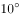

# 2020年山东省公务员录用考试《行测》试题（网友回忆版）

> 常识判断 · 9 题 · 山东 2020

## 第 1 题　qid 2571744 · 地理国情

下列有关山东省“三大经济圈”表述正确的是：

- **A**. 淄博、泰安、德州、滨州、潍坊都属于省会经济区
- **B**. 水浒故里、黄河口生态旅游区位于胶东经济圈
- **C**. 东方圣地、亲情沂蒙等旅游品牌都属于鲁南经济区　✅
- **D**. 省会经济区的定位包括金融中心和乡村振兴先行区

**答案**：C

**官方解析**

本题考查地理国情。
A项错误，根据《山东省人民政府关于加快省会经济圈一体化发展的指导意见》，省会经济圈涵盖济南、淄博、泰安、聊城、德州、滨州、东营7市，潍坊不属于省会经济圈，而属于胶东经济圈。
B项错误，根据《山东省人民政府关于加快胶东经济圈一体化发展的指导意见》，胶东经济圈涵盖青岛、烟台、威海、潍坊、日照5市。黄河口生态旅游区位于东营市，属于省会经济圈，水浒故里位于济宁市，属于鲁南经济圈。
C项正确，根据《山东省人民政府关于加快鲁南经济圈一体化发展的指导意见》，鲁南经济圈涵盖临沂、枣庄、济宁、菏泽4市。“东方圣地”是济宁市旅游品牌，“亲情沂蒙”是临沂市旅游品牌，均属于鲁南经济圈。
D项错误，省会经济圈的定位是打造黄河流域生态保护和高质量发展示范区、全国动能转换区域传导引领区、世界文明交流互鉴新高地，其建设的是济南区域性金融中心；打造全国金融中心是胶东经济圈的定位，而乡村振兴先行区则是鲁南经济圈的定位。
故正确答案为C。

---

## 第 2 题　qid 2571748 · 人文常识

下列哪一情形符合我国公务员法的相关规定？

- **A**. 某新录用的公务员经历了六个月的试用期后，便可予以任职
- **B**. 某公务员因工作失误，受到了免职处分
- **C**. 某公务员在挂职期间，为了工作便利，把人事关系转入挂职单位
- **D**. 机关聘任公务员可以进行公开招聘，也可以从符合条件的人员中直接选聘　✅

**答案**：D

**官方解析**

本题考查法律常识。
A项错误，根据《中华人民共和国公务员法》第三十四条规定：“新录用的公务员试用期为一年。试用期满合格的，予以任职；不合格的，取消录用。”
B项错误，根据《中华人民共和国公务员法》第六十二条规定：“处分分为：警告、记过、记大过、降级、撤职、开除。”免职并非公务员处分的种类。
C项错误，根据《中华人民共和国公务员法》第七十二条规定：“根据工作需要，机关可以采取挂职方式选派公务员承担重大工程、重大项目、重点任务或者其他专项工作。公务员在挂职期间，不改变与原机关的人事关系。”故“为了工作便利，把人事关系转入挂职单位”表述错误。
D项正确，根据《中华人民共和国公务员法》第一百零一条第一款规定：“机关聘任公务员可以参照公务员考试录用的程序进行公开招聘，也可以从符合条件的人员中直接选聘。”
故正确答案为D。

---

## 第 3 题　qid 2571754 · 科技常识

近年来，“共享单车”在许多城市兴起，给群众带来方便的同时，也被一些不法分子盯上。下列表述不正确的是：

- **A**. 赵某用技术开锁的手段解锁共享单车并贩卖，价值共计5000元，构成盗窃罪
- **B**. 钱某酒后为寻求刺激砸坏多辆共享单车，价值共计5000元，构成寻衅滋事罪
- **C**. 孙某将共享单车搬回家里解锁后又砸坏，价值共计5000元，构成故意毁坏财物罪
- **D**. 李某将共享单车上的二维码换成手机病毒二维码，非法获利5000元，构成诈骗罪　✅

**答案**：D

**官方解析**

本题考查法律常识。
A项正确，盗窃罪是指以非法占有为目的，窃取公私财物数额较大，或者多次盗窃、入户盗窃、携带凶器盗窃、扒窃的行为。题中，赵某解锁并贩卖共享单车，主观上具有非法占有的目的，客观上在共享单车经营者不知情的情况下转移了车辆的占有，侵犯了其对共享单车的所有权，应以盗窃罪论处。
B项正确，根据《中华人民共和国刑法》第二百九十三条规定：“有下列寻衅滋事行为之一，破坏社会秩序的，处五年以下有期徒刑、拘役或者管制：（一）随意殴打他人，情节恶劣的；（二）追逐、拦截、辱骂、恐吓他人，情节恶劣的；（三）强拿硬要或者任意损毁、占用公私财物，情节严重的；（四）在公共场所起哄闹事，造成公共场所秩序严重混乱的。  纠集他人多次实施前款行为，严重破坏社会秩序的，处五年以上十年以下有期徒刑，可以并处罚金。”题中，钱某为求刺激酒后砸坏多辆共享单车，符合该条第（三）项规定的情形，应以寻衅滋事罪论处。
C项正确，题干，孙某将共享单车搬回家里解锁后砸坏，主观上不具有占有利用的意思，应构成故意毁坏财物罪。
D项错误，根据《中华人民共和国刑法》第二百六十六条规定：“诈骗罪是以非法占有为目的，用虚构事实或者隐瞒真相的方式，骗取数额较大的公私财物的行为。”诈骗罪要想成立，需要让被害人产生错误认知，并基于错误认知处分财产。本题中，李某将二维码进行调换，导致使用共享单车的人将钱转到李某的账户中，而未能转入共享单车所属公司，不存在被害人产生认知错误处分财产的过程，故不符合诈骗罪的行为结构。而李某的行为以非法占有为目的，利用调换二维码的方式秘密窃取他人财物，符合盗窃罪特征，故应成立盗窃罪。
本题为选非题，故正确答案为D。
注：本题C项有一定瑕疵，没有明确说明孙某的目的是为了砸车还是偷车，但结合D选项，优中选优选择D项更合适些。

---

## 第 4 题　qid 2571757 · 法律常识

下列哪种情形可以在甲、乙之间成立民事法律关系？

- **A**. 甲跟乙口头约定，第二天早上八点甲搭乘乙的车上班，结果乙忘记此事，导致甲错过一单50万元的生意
- **B**. 甲购物时看到乙在扶梯上摔倒，情急之下上前救乙，但乙仍被电梯夹伤
- **C**. 甲在一场赌博中输给乙5万元，现场支付3万元，还有2万元未偿还
- **D**. 甲对乙说，如果乙考上研究生就把自己的劳力士手表赠送给乙，乙表示同意　✅

**答案**：D

**官方解析**

本题考查法律常识。
民事法律关系是由民法规范调整的、以权利义务为内容的社会关系，包括平等主体之间的人身关系和财产关系。
A项错误，关于甲搭乘便车的行为属于由道德规范的情谊行为，不受法律拘束，不成立合同关系。乙忘记此事导致甲的损失不构成违约。
B项错误，根据《民法典》第一百八十四条规定：“因自愿实施紧急救助行为造成受助人损害的，救助人不承担民事责任。”题干中甲的行为属于自愿实施紧急救助行为，因此不承担民事责任。
C项错误，根据《民法典》第一百五十三条第一款规定：“违反法律、行政法规的强制性规定的民事法律行为无效。但是，该强制性规定不导致该民事法律行为无效的除外。”赌博行为违反了我国治安管理法等法律明令禁止赌博的规定，也损害社会公共利益，属于违法行为。
D项正确，根据《民法典》第六百五十七条规定：“赠与合同是赠与人将自己的财产无偿给予受赠人，受赠人表示接受赠与的合同。”根据《民法典》第六百六十一条规定：“赠与可以附义务。赠与附义务的，受赠人应当按照约定履行义务。”题干中甲、乙的行为构成赠与合同。
故正确答案为D。

---

## 第 5 题　qid 2571765 · 人文常识

杜牧《秋夕》中有“银烛秋光冷画屏，轻罗小扇扑流萤”，据此，下列说法不正确的是：

- **A**. 此时南半球地区可能处于春季
- **B**. 作者与李商隐合称为“小李杜”
- **C**. “画屏”上可能出现唐伯虎的题词　✅
- **D**. “流萤”因体内含有荧光素而发光

**答案**：C

**官方解析**

本题考查人文常识。
A项正确，《秋夕》描写的是我国古代七夕节的场景，七夕节为每年的农历七月初七，一般都是处于北半球的夏季或秋季，此时南半球处于冬季或春季。
B项正确，杜牧（803年-约852年），字牧之，号樊川居士，是唐代杰出的诗人、散文家，著有《樊川文集》。杜牧的诗歌以七言绝句著称，内容以咏史抒怀为主，与李商隐合称“小李杜”。
C项错误，唐寅（1470年3月6日-1524年1月7日），字伯虎，小字子畏，号六如居士。明朝著名画家、书法家、诗人。唐伯虎生活的年代晚于杜牧，因此“画屏”上不可能出现唐伯虎的题词。
D项正确，“流萤”是指萤火虫，萤火虫有专门的发光细胞，在发光细胞中有两类化学物质，一类被称作荧光素，另一类被称为荧光素酶。荧光素能在荧光素酶的催化下消耗ATP，并与氧气发生反应，反应中产生激发态的氧化荧光素，当氧化荧光素从激发态回到基态时释放出光子。
本题为选非题，故正确答案为C。

---

## 第 6 题　qid 2571767 · 人文常识

关于物体的运动，下列说法正确的是：

- **A**. 物体从高空中下落其速度变得越来越快是因其具有惯性
- **B**. 跳伞运动员在匀速下降的过程中其机械能逐渐减小　✅
- **C**. 当物体受到力的作用后其运动速度必然发生改变
- **D**. 足球在空中飞行时受到的空气阻力保持不变

**答案**：B

**官方解析**

本题考查科技常识。
A项错误，物体受到地球引力从高空下落，在加速度的作用下，做加速运动。当物体运动方向与加速度方向一致时，运动速度会变得越来越快。物体从空中下落速度越来越快不是因为惯性。
B项正确，机械能是动能与势能的总和。物体的质量与速度决定动能，跳伞运动员在匀速下降的过程中，质量不变，速度不变，故动能不变；物体的质量和高度决定重力势能，跳伞运动员在匀速下降的过程中，质量不变，高度下降，故重力势能逐渐减小。动能不变，重力势能逐渐减小，因此机械能逐渐减小。
C项错误，当物体受到的合外力为零时，将保持静止或匀速运动状态。因此当物体受到力的作用后，其运动速度不一定发生改变。
D项错误，足球在空中飞行时，受到的空气阻力与运动速度成正比，速度越快，空气阻力越大。足球在空中飞行的速度受到重力的影响，不断变化，因此空气阻力也不断改变。
故正确答案为B。

---

## 第 7 题　qid 2571774 · 人文常识

下列哪种疾病经过粪口途径传播？

- **A**. 细菌性痢疾　✅
- **B**. 流行性脑炎
- **C**. 乙型肝炎
- **D**. 疟疾

**答案**：A

**官方解析**

本题考查科技常识。
A项正确，细菌性痢疾是一种肠道传染病，流行于夏秋季，主要表现为起病急、发热、腹痛、腹泻，严重者可能出现感染性休克和中毒性脑病。细菌性痢疾主要经过粪口途径传播，主要传染源为病人及带菌者。
B项错误，流行性脑炎的患者会出现咽喉疼痛等症状，该疾病主要通过飞沫传播。
C项错误，乙型肝炎是由乙肝病毒引起的，以肝脏损害为主的一组全身性传染病，主要表现为疲乏、食欲减退、厌油、肝功能异常等。主要传染源为乙肝患者、病毒携带者。传播途径为母婴传播、血液及血制品传播、破损的皮肤和粘膜及性接触传播等。
D项错误，疟疾是由疟原虫引起的传染病，主要表现为发抖、寒战、高热、乏力等，严重可危及生命。疟疾的主要传播媒介是按蚊，当按蚊叮咬人时，可将携带的疟原虫带入人体血液，引起疟疾的传播。
故正确答案为A。

---

## 第 8 题　qid 2571780 · 科技常识

下列哪一措施不能起到减少空气污染的作用：

- **A**. 加快天然气等清洁能源利用
- **B**. 尽可能使用低硫少灰的燃料
- **C**. 鼓励步行，加强自行车交通系统建设
- **D**. 发展高层建筑，提高城市容积率　✅

**答案**：D

**官方解析**

本题考查科技常识。
A项正确，清洁能源即绿色能源，是指不排放污染物、能够直接用于生产生活的能源，它包括核能和可再生能源。天然气作为一种清洁能源，燃烧时产生的二氧化碳少于其他化石燃料，造成的温室效应较低，燃烧之后也没有废渣、废水。大力推广清洁燃料天然气，重点用于民用燃料及工业燃料的替代方面，对于我国一次能源以煤炭为主而带来的废气排放严重超标、酸雨成灾及温室效应等环境保护被动局面的改变，推进节能减排、减少大气污染将起到积极作用。
B项正确，大气污染物的生成，与工业生产原料和燃料有直接关系。应当严格选择原料和燃料，尽可能使用低硫少灰的燃料，采取预处理措施，如洗煤脱硫、重油脱硫，或者建设焦炉，变煤为气焦双收，变有害物多的原料和燃料为无害少害的原料和燃料，依次降低硫和杂质的排放量，减少空气污染。
C项正确，机动车尾气排放的二氧化碳、硫化物、氮氧化物、氟氯烃等使温室效应、光化学烟雾、臭氧层破坏和酸雨等大气环境问题日益严重。鼓励步行，加强自行车交通系统建设，倡导绿色出行理念，可以有效减少机动车的使用，既节约能源，提高能源利用效率，减少空气污染，又有益于健康，兼顾效率。
D项错误，发展高层建筑，可以提高城市容积率和土地利用效率，缓解住宅供求矛盾，但与减少空气污染无关。
本题为选非题，故正确答案为D。

---

## 第 9 题　qid 2571784 · 人文常识

人们对消毒杀菌越来越重视，下列说法正确的是：

- **A**. 
的酒精消毒效果最好

- **B**. 
洁厕灵和84消毒液混合使用可提高杀菌效果

- **C**. 
多酶消毒液应在沸水状态下使用

- **D**. 
巴氏消毒法可用来给啤酒消毒
　✅

**答案**：D

**官方解析**

本题考查科技常识。

A项错误，酒精的学名叫乙醇，它具有很大的渗透能力，能钻到细菌体内，使细菌蛋白质凝固，从而杀死细菌。并不是纯度越高，杀菌消毒的效果就越好。酒精的浓度很高，过高浓度的酒精会快速使表层细菌的蛋白质固化，形成一层蛋白膜，阻止其进入细菌体内，难以将细菌彻底杀死；若酒精浓度过低，虽可进入细菌，但不能将其体内的蛋白质凝固，同样也不能将细菌彻底杀死。当酒精浓度为时，它的杀菌能力是最强的。

B项错误，洁厕灵和84消毒液不能混合，可能产生有毒气体。当洁厕灵的主要成分是盐酸时，它与主要成分是次氯酸钠的强碱性84消毒液混合会发生化学反应，反应后产生氯气。氯气是一种有强烈刺激性气味的有毒气体。如果吸入一定量的氯气，会损伤人体的呼吸道、眼鼻等器官，出现不适症状，若氯气浓度很高，吸入量又大则会危及生命。

C项错误，多酶消毒液即多酶清洗液。需要清洗的物品应当浸泡在已经稀释后的多酶清洗液溶液中，浸泡的时间在2-10分钟左右。多酶清洗液的使用环境一般在PH值5.5-9.0之间，但是PH值6.5-7.5之间的环境下使用效果最好。使用多酶清洗液进行清洗时，水温最好在之间。

D项正确，巴氏消毒法，也称巴氏灭菌法，是法国生物学家路易·巴斯德于1865年发明的消毒方法。巴氏灭菌法是一种利用较低的温度既可杀死病菌又能保持物品中营养物质风味不变的消毒法。巴氏消毒法经后人改进，是一种用于彻底杀灭啤酒、酒、牛奶、血清蛋白等液体中病原体的方法，也是现世界通用的一种牛奶消毒法。

故正确答案为D。

---
