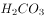
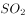
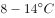
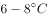
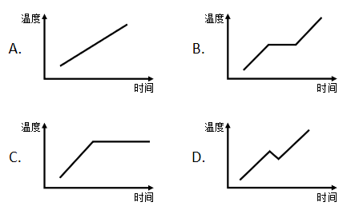
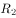
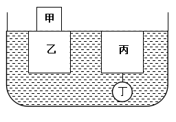
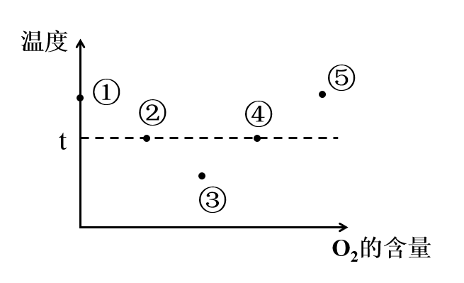
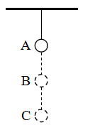

# 2020年广东省公务员录用考试《行测》试题（乡镇卷）（网友回忆版）

> 常识判断 · 37 题 · 广东 2020

## 第 1 题　qid 2604231 · 法律常识

我国民法典规定，未设立村集体经济组织的，（    ）可以依法代行村集体经济组织职能。

- **A**. 村长
- **B**. 村民委员会　✅
- **C**. 村党支部
- **D**. 村民小组

**答案**：B

**官方解析**

本题考查法律常识。
根据《民法典》第一百零一条规定：“居民委员会、村民委员会具有基层群众性自治组织法人资格，可以从事为履行职能所需要的民事活动。未设立村集体经济组织的，村民委员会可以依法代行村集体经济组织的职能。”
故正确答案为B。

---

## 第 2 题　qid 2604237 · 经济常识

为有效应对新冠疫情对我国经济的影响，相关部门出台了一系列举措帮助企业复工复产。以下属于金融政策举措的是：

- **A**. 降低政府定价的货物港务费和港口设施保安费收费标准，显著降低物流运输成本
- **B**. 对中小微企业生产经营场所的用电、用水、用气实施阶段性缓缴费用，缓缴期“欠费不停供”
- **C**. 免征中小微企业三项社保的单位缴费，降低企业负担
- **D**. 引导银行加大对民营和小微企业支持的力度，保持贷款额合理增加　✅

**答案**：D

**官方解析**

本题考查经济常识。金融政策是指中央银行为实现宏观经济调控目标而采用各种方式调节货币、利率和汇率水平，进而影响宏观经济的各种方针和措施的总称。一般而言，一个国家的宏观金融政策主要包括三大政策：货币政策、利率政策和汇率政策。而财政政策是政府运用各种财政手段和措施，以实现一定时期预定的包括充分就业，物价稳定和经济增长的宏观经济目标的政策。其主要是通过财政支出与税收政策调节总需求来实现的。
A项错误，降低政府定价的货物港务费和港口设施保安费收费标准属于政府财政政策举措。
B项错误，对中小微企业生产经营场所的用电、用水、用气实施阶段性缓缴费用，缓缴期“欠费不停供”属于政府财政政策举措。
C项错误，免征中小微企业三项社保的单位缴费，降低企业负担属于政府财政政策举措。
D项正确，引导银行加大对民营和小微企业支持的力度，保持贷款额合理增加是银行运用金融政策举措保证民营和小微企业正常发展。
故正确答案为D。

---

## 第 3 题　qid 2604242 · 人文常识

打赢脱贫攻坚战、实施乡村振兴战略，需要强化科技支撑作用。以下措施属于强化科技支撑作用的是（    ）。
①完善村规民约
②支持丘陵山区农田宜机化改造
③推进相对贫困户危房改造
④建设农业科技成果转化交易平台
⑤推动复合型农业机械研发

- **A**. ①②④
- **B**. ②④⑤　✅
- **C**. ①②④⑤
- **D**. ①②③④⑤

**答案**：B

**官方解析**

本题考查政治常识。
①错误，从农村实际出发，健全完善村规民约，切实用制度管理好村民事务。进一步发挥村民自治的功能，用好村民“一事一议”制度，真正实现村民管理自身的事务。其不属于强化科技支撑作用的措施。
②正确，《国务院关于加快推进农业机械化和农机装备产业转型升级的指导意见》明确提出，推进机械化生产与农田建设相适应，重点支持丘陵山区开展农田“宜机化”改造。
③错误，推进相对贫困户危房改造是精准扶贫的措施之一，不属于强化科技支撑作用的措施。
④正确，2013年，全国农业科技成果转化交易服务平台建设正式启动，建设农业科技成果转化交易平台将提高我国农业科技成果的转化水平，使农业科技成果转化更方便、快捷而规范。
⑤正确，《国务院关于加快推进农业机械化和农机装备产业转型升级的指导意见》指出：瞄准农业机械化需求，加快推进农机装备创新，研发适合国情、农民需要、先进适用的各类农机，既要发展适应多种形式适度规模经营的大中型农机，也要发展适应小农生产、丘陵山区作业的小型农机以及适应特色作物生产、特产养殖需要的高效专用农机。因此②④⑤正确。
故正确答案为B。

---

## 第 4 题　qid 2604248 · 人文常识

党的十九届四中全会首次提出要“重视发挥第三次分配作用，发展慈善等社会公益事业”。以下属于第三次分配的是（    ）。

- **A**. 企业员工获取加班劳动报酬
- **B**. 政府向困难家庭发放低保
- **C**. 银行为家庭困难学生办理助学贷款
- **D**. 中国红十字会出资救助患病儿童　✅

**答案**：D

**官方解析**

本题考查经济常识。
A项错误，第一次分配即初次分配，是由市场按照效率原则进行、直接与生产要素相联系的分配。任何生产活动都离不开劳动力、资本、土地和技术等生产要素，在市场经济条件下，取得这些要素必须支付一定的货币，这种货币报酬就形成各要素提供者的初次分配收入。企业员工获取加班劳动报酬属于初次分配。
B、C项错误，第二次分配是由政府按照兼顾公平和效率的原则、侧重公平原则，通过税收、社会保障支出等进行的再分配，如对贫困户和灾民的救济，征收个人所得税、遗产税、赠与税等。政府向困难家庭发放低保、为家庭困难学生办理助学贷款属于第二次分配。
D项正确，第三次分配体现社会成员更高的精神追求，其是在道德、文化、习惯等影响下，社会力量自愿通过民间捐赠、慈善事业、志愿行动等方式济困扶弱的行为，是对再分配的有益补充。中国红十字会出资救助患病儿童属于第三次分配。
故正确答案为D。

---

## 第 5 题　qid 2604257 · 人文常识

产业增收是脱贫攻坚的主要途径和长久之策。以下举措不属于产业扶贫的是（    ）。

- **A**. 种植特色水果
- **B**. 开展乡村旅游
- **C**. 兴建乡村卫生站　✅
- **D**. 成立农产品产业园

**答案**：C

**官方解析**

本题考查政治常识。
A项正确，《关于实施产业扶贫三年攻坚行动的意见》指出：“（四）推进特色林产业提质增效。深入实施特色林产业扶贫行动，因地制宜发展市场需求旺盛、带贫效益较高的木本油料、特色林果、林下经济、竹藤、种苗花卉等特色林产业，加快建设特色林产品标准化生产基地，发展林下中药材、特色经济林、野生动植物繁育利用、林下种养殖等产业。”
B项正确，《关于实施产业扶贫三年攻坚行动的意见》指出：“（六）大力发展休闲农业、乡村旅游等新产业新业态。支持贫困县、贫困村依托特色农产品、农事景观、人文景观等资源，结合易地搬迁、危房改造等项目，发展休闲农业、乡村旅游、康养健身、创意农业、体验农业等多元业态，拓宽贫困群众就业增收渠道。”
C项错误，兴建乡村卫生站能够强化乡镇医疗基础设施，但不属于产业扶贫的举措。
D项正确，《关于实施产业扶贫三年攻坚行动的意见》指出：“（七）支持创建扶贫产业园。把扶贫产业园建设作为贫困地区产业扶贫和乡村产业兴旺的重要抓手，支持有条件的贫困县创建一二三产业融合的扶贫产业园。”
本题为选非题，故正确答案为C。

---

## 第 6 题　qid 2604265 · 科技常识

新冠肺炎疫情发生以来，中国始终同国际社会开展交流合作，并提出（    ）的新理念：倡导团结合作共同抗疫。

- **A**. 构建人类命运共同体
- **B**. 建立疫苗协作开发机制
- **C**. 构建人类卫生健康共同体　✅
- **D**. 建立全球治理体系

**答案**：C

**官方解析**

本题考查政治常识。
2020年5月18日，习近平主席在第73届世界卫生大会视频会议开幕式上发表致辞，呼吁各国团结合作战胜疫情，共同构建人类卫生健康共同体，提出全力搞好疫情防控、发挥世界卫生组织作用、加大对非洲国家支持、加强全球公共卫生治理、恢复经济社会发展、加强国际合作等六点建议。因此，A、B、D三项不符合题意。
故正确答案为C。

---

## 第 7 题　qid 2604270 · 地理国情

2020年4月，经国务院批准，海南省三沙市设立南沙区，南沙区人民政府驻永暑礁。以下对永暑礁的描述有误的是（    ）。

- **A**. 永暑礁位于海南省东南部
- **B**. 永暑礁位于西沙群岛　✅
- **C**. 永暑礁的气候为热带季风气候
- **D**. 永暑礁拥有丰富的渔业和矿产资源

**答案**：B

**官方解析**

本题考查地理国情。

A项正确，永暑礁是海南省三沙市南沙区政府驻地，位于海南省东南部。

B项错误，永暑礁是我国南沙群岛的一座珊瑚环礁，而不是位于西沙群岛。

C项正确，永暑礁位于北纬，东经，属于热带季风气候。

D项正确，永暑礁海域鱼类属于印度洋-太平洋热带动物区系，以珊瑚礁鱼类和热带大洋性鱼类占绝大多数，是我国海洋鱼类区系的重要组成部分；永暑礁周围海域海底蕴藏着大量矿藏，包括铁、锰、铜、镍、钴、铅、锌等数十种金属元素和沸石、珊瑚贝壳灰岩等非金属矿产，以及热液矿床。

本题为选非题，故正确答案为B。

---

## 第 8 题　qid 2604250 · 法律常识

2020年6月30日颁布的《中华人民共和国香港特别行政区维护国家安全法》是保持香港特别行政区繁荣和稳定的重要法律。以下属于该法规定处罚的罪行有（    ）。
①分裂国家罪
②颠覆国家政权罪
③恐怖活动罪
④勾结外国或者境外势力危害国家安全罪

- **A**. ①④
- **B**. ①②③
- **C**. ②③④
- **D**. ①②③④　✅

**答案**：D

**官方解析**

本题考查法律常识。
①正确，《香港特别行政区维护国家安全法》第二十条第一款规定：“任何人组织、策划、实施或者参与实施以下旨在分裂国家、破坏国家统一行为之一的，不论是否使用武力或者以武力相威胁，即属犯罪：（一）将香港特别行政区或者中华人民共和国其他任何部分从中华人民共和国分离出去；（二）非法改变香港特别行政区或者中华人民共和国其他任何部分的法律地位；（三）将香港特别行政区或者中华人民共和国其他任何部分转归外国统治。”这是该法关于分裂国家罪的规定。
②正确，《香港特别行政区维护国家安全法》第二十二条第一款规定：“任何人组织、策划、实施或者参与实施以下以武力、威胁使用武力或者其他非法手段旨在颠覆国家政权行为之一的，即属犯罪：（一）推翻、破坏中华人民共和国宪法所确立的中华人民共和国根本制度；（二）推翻中华人民共和国中央政权机关或者香港特别行政区政权机关；（三）严重干扰、阻挠、破坏中华人民共和国中央政权机关或者香港特别行政区政权机关依法履行职能；（四）攻击、破坏香港特别行政区政权机关履职场所及其设施，致使其无法正常履行职能。”这是该法关于颠覆国家政权罪的规定。
③正确，《香港特别行政区维护国家安全法》第二十四条第一款规定：“为胁迫中央人民政府、香港特别行政区政府或者国际组织或者威吓公众以图实现政治主张，组织、策划、实施、参与实施或者威胁实施以下造成或者意图造成严重社会危害的恐怖活动之一的，即属犯罪：（一）针对人的严重暴力；（二）爆炸、纵火或者投放毒害性、放射性、传染病病原体等物质；（三）破坏交通工具、交通设施、电力设备、燃气设备或者其他易燃易爆设备；（四）严重干扰、破坏水、电、燃气、交通、通讯、网络等公共服务和管理的电子控制系统；（五）以其他危险方法严重危害公众健康或者安全。”这是该法关于恐怖活动罪的规定。
④正确，《香港特别行政区维护国家安全法》第二十九条第一款规定：“为外国或者境外机构、组织、人员窃取、刺探、收买、非法提供涉及国家安全的国家秘密或者情报的；请求外国或者境外机构、组织、人员实施，与外国或者境外机构、组织、人员串谋实施，或者直接或者间接接受外国或者境外机构、组织、人员的指使、控制、资助或者其他形式的支援实施以下行为之一的，均属犯罪：（一）对中华人民共和国发动战争，或者以武力或者武力相威胁，对中华人民共和国主权、统一和领土完整造成严重危害；（二）对香港特别行政区政府或者中央人民政府制定和执行法律、政策进行严重阻挠并可能造成严重后果；（三）对香港特别行政区选举进行操控、破坏并可能造成严重后果；（四）对香港特别行政区或者中华人民共和国进行制裁、封锁或者采取其他敌对行动；（五）通过各种非法方式引发香港特别行政区居民对中央人民政府或者香港特别行政区政府的憎恨并可能造成严重后果。”这是该法关于勾结外国或者境外势力危害国家安全罪的规定。
故正确答案为D。

---

## 第 9 题　qid 2604261 · 地理国情

2020年7月23日，“天问一号”深空探测器在海南文昌发射成功，大约9个月后，“天问一号”将在（    ）表面着陆，标志着我国正式开启行星探测时代。

- **A**. 月球
- **B**. 火星　✅
- **C**. 金星
- **D**. 木星

**答案**：B

**官方解析**

本题考查科技常识。
2020年7月23日12时41分，我国在海南文昌航天发射场用长征五号遥四运载火箭，将我国首颗火星探测器 “天问一号”成功发射升空，任务取得圆满成功。此次是我国完全自主实施的火星探测任务，标志着我国行星探测的大幕正式拉开。因此，A、C、D三项均不符合题意，排除。
故正确答案为B。

---

## 第 10 题　qid 2604278 · 人文常识

乡村文化繁荣兴盛重大工程包括“农耕文化保护传承”，以下诗句最能体现农耕文化保护传承的是（    ）。

- **A**. 谁知盘中餐，粒粒皆辛苦　✅
- **B**. 离离原上草，一岁一枯荣
- **C**. 尧有欲谏之鼓，舜有诽谤之木
- **D**. 山重水复疑无路，柳暗花明又一村

**答案**：A

**官方解析**

本题考查政治常识。走中国特色社会主义乡村振兴道路，必须传承发展提升农耕文明，走乡村文化兴盛之路。
A项正确，“谁知盘中餐，粒粒皆辛苦”出自唐代诗人李绅的《悯农·其二》。其描绘了在烈日当空的正午农民田里劳作的景象，概括地表现了农民终年辛勤劳动的生活，表达了诗人对农民真挚的同情之心。
B项错误，“离离原上草，一岁一枯荣”出自唐代诗人白居易的《赋得古原草送别》。作者用叠字“离离”描写春草的茂盛，第二句“一岁一枯荣”，进而写出原上野草秋枯春荣，岁岁循环，生生不已的规律。未体现农耕文化保护传承。
C项错误，“尧有欲谏之鼓，舜有诽谤之木”出自《吕氏春秋》的“自知”一节。相传尧、舜为了鼓励老百姓进谏献言，分别设立谏鼓、谤木，作为与民众沟通的一种渠道，鼓励民众积极进言谏言。未体现农耕文化保护传承。
D项错误，“山重水复疑无路，柳暗花明又一村”出自南宋诗人陆游的《游山西村》。比喻在遇到困难时，一种办法不行，可以用另一种办法去解决，通过探索去发现答案。未体现农耕文化保护传承。
故正确答案为A。

---

## 第 11 题　qid 2604289 · 地理国情

在中国史、亚洲史上，（    ）有着深远的意义和影响，它大大地拓宽了古人的地理视野，改变了汉朝的地域观念，有历史学家甚至将它与哥伦布“发现”美洲相提并论。

- **A**. 昭君出塞
- **B**. 蒙古西征
- **C**. 张骞凿空　✅
- **D**. 鉴真东渡

**答案**：C

**官方解析**

本题考查人文常识。
A项错误，昭君出塞发生在公元前54年，匈奴呼韩邪单于被他哥哥郅支单于打败，南迁至长城外的光禄塞下，同西汉结好，曾三次进长安入朝，并向汉元帝请求和亲，王昭君请求出塞和亲。昭君出塞顺应了当时的形势，推动了汉王朝和匈奴的和平发展。
B项错误，蒙古西征是蒙古帝国的三次西征，将蒙古帝国的铁蹄遍及欧亚广大地区。题干中的朝代是汉代，蒙古西征发生的朝代为元代，时间不一致。
C项正确，张骞凿空一般指张骞出使西域，汉武帝时期希望联合月氏夹击匈奴，派遣张骞出使西域各国的历史事件。张骞出使西域后丝绸之路逐渐打通，它把西汉同中亚许多国家联系起来，促进了它们之间的政治、经济、军事和文化的交流，同时拓宽了古人的地理视野，改变了汉朝的地域观念。
D项错误，鉴真是唐朝名僧，曾担任扬州大明寺住持，应日本遣唐留学僧人请求先后六次东渡，弘传佛法，传播博大精深的中国文化，促进了日本佛学、医学、建筑和雕塑水平的提高，受到中日人民和佛学界的尊敬。题干中的朝代是汉代，鉴真东渡发生的朝代为唐代，时间不一致。
故正确答案为C。

---

## 第 12 题　qid 2604297 · 人文常识

岭南地区盛产甜美可口的荔枝，自古就有“日啖荔枝三百颗，不辞长作岭南人”的美誉。以下最有可能为岭南地区适合荔枝生长主要原因的是（    ）。

- **A**. 日照时间长，光合作用充分
- **B**. 昼夜温差小，易于糖分聚集
- **C**. 土壤粘，强碱性，利于中和果酸
- **D**. 气温高，降水多，适宜果实生长　✅

**答案**：D

**官方解析**

本题考查地理国情。

A项错误，岭南地区位于北回归线附近，太阳辐射量较多，日照时间较长。但光合作用取决于光照强度和光质，日照时间越长并不意味着光合作用越充分。

B项错误，昼夜温差大的地区，白天温度高，光合作用旺盛，制造的有机物多；夜间温度低，呼吸作用弱，分解的有机物少，因此植物光合作用积累的有机物多于呼吸作用消耗的有机物，体内积累的有机物增多。故昼夜温差大的地区瓜果更甜。

C项错误，我国土壤pH大多在4.5～8.5范围内，由南向北pH值递增，长江（北纬）以南的土壤多为酸性和强酸性；华中华东地区的红壤，pH值在5.5～6.5之间；长江以北的土壤多为中性或碱性。岭南地区多砖红壤、赤红壤，其特点为：颜色红，土层较厚，质地较粘重，肥力较差，呈酸性。

D项正确，岭南地区属东亚季风气候区南部，具有热带、亚热带季风海洋性气候特点，该气候区域夏季太阳高度角大，气温较高，且南季风带来的降水丰沛，雨热同期，雨季持续时间长。荔枝树喜高温高湿，喜光向阳，岭南地区的气候条件适合荔枝的生长。

故正确答案为D。

---

## 第 13 题　qid 2604232 · 人文常识

在日常生活中，下列说法符合科学原理的是（    ）。

- **A**. 
使用碳酸饮料可以有效溶解水壶内的水垢
　✅
- **B**. 
成年人体内的水分大约能占到体重的

- **C**. 
烧开的水放置一个晚上后，亚硝酸盐含量会显著增加

- **D**. 
剧烈运动后，人们应当避免摄入电解质，以免增加肾脏负担

**答案**：A

**官方解析**

本题考查科技常识。

A项正确，碳酸饮料中含有（碳酸），水垢是水中所含的微量沉淀物质长期积累形成的，主要成分是碳酸钙等碳酸盐，碳酸饮料里面的碳酸会与其发生反应，产生溶于水的碳酸氢钙，从而达到去水垢的目的。

B项错误，根据生物学家的报告，成年人体内水分约占人体重的。其中脑脊髓中水占、淋巴腺中水占、血液中水占、肌肉中水占、骨骼中水占。

C项错误，按照国家规定，生活饮用水的亚硝酸盐标准是1微克/ml。只要亚硝酸盐不超过这个量，就是安全的。而一般隔夜水的亚硝酸盐含量都不会超过这个数字。

D项错误，运动时会丢失大量汗液，其中的成分是水，剩余的则是尿素、乳酸、脂肪酸和各种电解质。过多丢失体内电解质，对运动能力及健康有严重影响。因此大量运动后既要补水，也要补充矿物元素。

故正确答案为A。

---

## 第 14 题　qid 2604235 · 人文常识

煤燃烧后的产物主要是，也含有一定量的，还可能含有。某市环保部门监测发现，该市郊区的火力发电厂（以煤为燃料）周围的树木枯萎情况比上一年严重。造成树木枯萎的最主要原因可能是（    ）。

- **A**. 
的超标排放

- **B**. 
的超标排放

- **C**. 
排放导致的酸雨
　✅
- **D**. 
排放导致的酸雨

**答案**：C

**官方解析**

本题考查科技常识。

A项错误，一氧化碳（），一种碳氧化合物，标准状况下为无色、无臭、无刺激性的气体。一氧化碳超标排放到大气中，在血液中极易与血红蛋白结合，形成碳氧血红蛋白，使血红蛋白丧失携氧的能力和作用，造成组织窒息，严重时死亡。

B项错误，二氧化碳（），常温常压下是一种无色无味或无色无嗅而略有酸味的气体，也是一种常见的温室气体。二氧化碳排放过多容易引起温室效应，加剧气候变暖。

C项正确，D项错误，二氧化硫排放到大气中，经过“云内成雨过程”，即水汽凝结在硫酸根凝结核上，发生液相氧化反应，形成硫酸雨滴；又经过“云下冲刷过程”，即含酸雨滴在下降过程中不断合并吸附、冲刷其他含酸雨滴和含酸气体，形成较大雨滴，最后降落在地面上，形成了酸雨。酸雨可导致土壤酸化、植被枯萎等危害。

故正确答案为C。

---

## 第 15 题　qid 2604238 · 人文常识

消费者权利是消费者在购买、使用商品或者接受服务中所享有的权利。下列消费者权利与侵犯该权利的事件对应正确的是（    ）。

- **A**. 知情权——某线上服装店为快速清仓，推出低价“福袋”商品，并注明“福袋”内服装的款式、颜色等随机搭配
- **B**. 自主选择权——某餐厅推出外卖8折活动，但是消费者点外卖时只有选择套餐才享受折扣，自由搭配时无法享受8折优惠
- **C**. 安全保障权——王某的轿车已达到报废标准，但是他依旧照常使用，在一次高速行驶中刹车失灵造成事故
- **D**. 公平交易权——李某在车行订购汽车后，车行要求李某购买“车辆维护套餐”，否则汽车不予交付　✅

**答案**：D

**官方解析**

本题考查法律常识。
A项错误，根据《消费者权益保护法》第八条规定可知：“消费者享有知悉其购买、使用的商品或者接受的服务的真实情况的权利。消费者有权根据商品或者服务的不同情况，要求经营者提供商品的价格、产地、生产者、用途、性能、规格、等级、主要成份、生产日期、有效期限、检验合格证明、使用方法说明书、售后服务，或者服务的内容、规格、费用等有关情况。”消费者已经知晓“福袋”内的商品颜色、样式是随机搭配的，消费者已经知情。
B项错误，根据《消费者权益保护法》第九条规定可知：“消费者享有自主选择商品或者服务的权利。消费者有权自主选择提供商品或者服务的经营者，自主选择商品品种或者服务方式，自主决定购买或者不购买任何一种商品、接受或者不接受任何一项服务。消费者在自主选择商品或者服务时，有权进行比较、鉴别和挑选。”餐厅对外卖套餐8折促销，未侵犯消费者的自主选择权。
C项错误，根据《消费者权益保护法》第七条第二款规定可知：“消费者有权要求经营者提供的商品和服务，符合保障人身、财产安全的要求。”王某的轿车并非在购买的时候存在质量问题，经营者未侵犯王某的安全保障权。
D项正确，根据《消费者权益保护法》第十条规定可知：“消费者享有公平交易的权利。消费者在购买商品或者接受服务时，有权获得质量保障、价格合理、计量正确等公平交易条件，有权拒绝经营者的强制交易行为。”车行要求李某购买“车辆维护套餐”，否则汽车不予交付，是捆绑销售行为，侵犯的是李某的公平交易权。
故正确答案为D。

---

## 第 16 题　qid 2604240 · 法律常识

某公司与陈某在签订劳动合同时，在该合同约定“本人自愿放弃缴纳社保，公司每月给予200元补贴作为补偿，与每月工资一同发放”，陈某工作一年后辞职。辞职后，他在当地申请劳动仲裁，要求该公司补缴社会保险金。关于以上案例，以下说法错误的是（    ）。

- **A**. 案例中合同所约定的不缴纳社保的条款属于无效条款
- **B**. 该公司应为陈某补缴社会保险
- **C**. 陈某应当返还由该公司每月发放的200元补贴
- **D**. 为确保放弃缴纳社保声明合法生效，应另起协议　✅

**答案**：D

**官方解析**

本题考查法律常识。
《劳动法》第七十条规定：“国家发展社会保险事业，建立社会保险制度，设立社会保险基金，使劳动者在年老、患病、工伤、失业、生育等情况下获得帮助和补偿。”《社会保险法》第四条第一款规定：“中华人民共和国境内的用人单位和个人依法缴纳社会保险费，有权查询缴费记录、个人权益记录，要求社会保险经办机构提供社会保险咨询等相关服务。” 由此可知，用人单位负有依法缴纳社会保险费的法定义务，该法定义务不因当事人的约定而可予以免除。
A项正确，公司与陈某在合同中约定放弃缴纳社会保险的条款违反了法律法规的强制性规定，属于无效条款。
B、C项正确，公司有为陈某依法缴纳社会保险的法定义务，该公司应为陈某补缴社会保险，陈某应当返还由该公司每月发放的200元补贴。
D项错误，用人单位与劳动者约定放弃缴纳社会保险的约定违反了法律的强制性规定，另起协议约定亦属于无效约定。
本题为选非题，故正确答案为D。

---

## 第 17 题　qid 2604244 · 经济常识

“逆经济风向调节”是指当经济萎缩时要采取扩张的经济政策，当经济过热时要采用紧缩的经济政策。据此，当一个国家经济过热时，应当采取的政策措施是（    ）。

- **A**. 减少政府支出，提高利率　✅
- **B**. 减少政府支出，降低利率
- **C**. 增加政府支出，提高利率
- **D**. 增加政府支出，降低利率

**答案**：A

**官方解析**

本题考查经济常识。
经济过热是指市场供给发展速度与市场需求发展速度不成比例。依据经济学的定义，实际增长率超过了潜在增长率叫经济过热，它的基本特征表现为经济要素总需求超过总供给，由此引发物价指数的全面持续上涨。在经济过热时，应采取紧缩性的货币政策和财政政策，减少政府支出是紧缩性的财政政策，能抑制社会总需求；提高利率也是紧缩性的货币政策，会增加储蓄，减少消费，抑制经济过热。
故正确答案为A。

---

## 第 18 题　qid 2604283 · 科技常识

农技站为了贮存种子，拟采用以下做法，其中最可行的是（    ）。

- **A**. 
将种子浸泡在含水的容器中

- **B**. 
将种子置放在含氧量低于的干燥地窖中
　✅
- **C**. 
将种子置于15摄氏度左右的低温环境中

- **D**. 
将种子封闭在完全避光的黑暗环境中

**答案**：B

**官方解析**

农技站贮存种子时，为了延长种子的寿命，需要注意两方面：一是保持干燥，这样可以防止提前发芽、防止发霉；二是削弱呼吸作用，减少有机物消耗，这样可以保证播种时种子有足够的营养物质，提高发芽率，降低温度和含氧量能够抑制种子的呼吸作用，此外，呼吸作用需要水环境，干燥的环境也能一定程度上抑制呼吸作用。因此，保存种子应该做到干燥、低温、低氧。

A项：将种子短时间在水中浸泡会使得种子的种皮软化，使水分和氧气进入种子内部，会使种子有发芽的倾向（部分水生植物甚至可以在水中完成种子萌发的全过程），不利于种子保存；而长时间浸泡在水中会导致种皮破裂、种子腐烂发臭等后果，直接导致种子死亡，也不利于种子保存，错误；

B项：保持周围环境干燥，可以有效防止种子吸水返潮，氧气浓度低也会抑制细胞的呼吸作用，防止种子消耗过多的有机物，同时地窖中通常温度不会很高，因此是适合种子保存的条件，正确；

C项：的低温环境可以一定程度上减弱呼吸作用，但是仅说的低温环境，除此之外再无其他限制条件，并不知道外界的湿度如何、氧气含量如何，只控制温度，不控制水分和氧气浓度，也无法保证种子的长期保存。而且对于很多农作物来说，已经达到发芽的最低温度了（例如水稻、大豆、玉米种子发芽的最低温度分别是、、），因此的温度下这些农作物的种子会有部分发芽，错误；

D项：光照强度不会直接影响细胞呼吸，与种子贮存条件无关，错误。

故正确答案为B。

---

## 第 19 题　qid 2604288 · 科技常识

援藏干部小吴发现，夏天在藏区的高山上能看到一条横在半山腰的线，这条线之上冰雪璀璨闪耀，线下则只有裸露岩坡或草丛树林。当地人告诉他，这就是“雪线”。如果气候稳定，雪线每年大致在同一个高度上，如果气候或降雪量发生变化，雪线就会发生变化。则小吴最不可能观察到的现象是（    ）。

- **A**. 气候变暖，降雪量增加，雪线上移
- **B**. 气候变暖，降雪量减少，雪线上移
- **C**. 气候变冷，降雪量减少，雪线下移
- **D**. 气候变冷，降雪量增加，雪线上移　✅

**答案**：D

**官方解析**

当气候变暖，或降雪量减少，降雪量小于消融量，雪线上移；反之，当气候变冷，或降雪量增加，降雪量大于消融量，雪线下移。
A项：气候变暖，降雪量增加，降雪量可能仍小于消融量，雪线可能上移，正确；
B项：气候变暖，降雪量减少，降雪量小于消融量，雪线应上移，正确；
C项：气候变冷，降雪量减少，降雪量可能大于消融量，雪线可能下移，正确；
D项：气候变冷，降雪量增加，降雪量大于消融量，雪线应下移，错误。
本题为选非题，故正确答案为D。

---

## 第 20 题　qid 2604292 · 科技常识

一般来说，海水会从密度大的地方向密度小的地方流动，而海水的密度主要受到温度和盐度的影响。则以下判断正确的是（    ）。

- **A**. 越热越咸的海水，密度越大
- **B**. 越冷越咸的海水，密度越大　✅
- **C**. 越冷越淡的海水，密度越大
- **D**. 越热越淡的海水，密度越大

**答案**：B

**官方解析**

海水的密度取决于温度、盐度和压力（或深度）。在低温、高盐和深水压力大的情况下，海水密度大。而在高温、低盐的表层水域，海水密度就小。
因此越冷越咸的海水，密度越大。
故正确答案为B。

---

## 第 21 题　qid 2604295 · 科技常识

在生活中，我们可以用紫色的蝴蝶兰花溶液作为酸碱指示剂，其遇酸性溶液显红色，遇碱性溶液则显黄色。下列说法正确的是（    ）。

- **A**. 在盐水中滴入蝴蝶兰花溶液，溶液呈红色
- **B**. 在纯净水中滴入蝴蝶兰花溶液，溶液呈无色
- **C**. 在苏打水中滴入蝴蝶兰花溶液，溶液呈黄色　✅
- **D**. 在酸或碱性溶液中滴入蝴蝶兰花溶液后，变色的过程属于物理变化

**答案**：C

**官方解析**

盐水和纯净水均呈中性，向盐水和纯净水中滴加蝴蝶兰花溶液，溶液的颜色将变为与蝴蝶兰花溶液相似的紫色，故A、B两项均错误。苏打水呈碱性，根据题目可知蝴蝶兰花溶液遇碱性溶液则显黄色，故C项正确。指示剂遇酸或碱性溶液变色，是由于指示剂与酸碱性溶液发生了化学反应，生成了新物质，从而使溶液呈现不同的颜色，故D项错误。
故正确答案为C。

---

## 第 22 题　qid 2604300 · 科技常识

下列物质与其用途搭配正确的是（    ）。
1臭氧——用作氧化剂
2二氧化碳——用作干燥剂
3氦气——用作燃料
4液氮——用作制冷剂

- **A**. 14　✅
- **B**. 23
- **C**. 12
- **D**. 34

**答案**：A

**官方解析**

臭氧具有很强的氧化性，可以用作氧化剂，正确；二氧化碳不具有吸水性，不能用作干燥剂，错误；氦气不是可燃性气体，不能用作燃料，错误；液氮变为气态时吸收大量的热，降低周围温度，所以液氮可用作制冷剂，正确。
故正确答案为A。

---

## 第 23 题　qid 2604284 · 科技常识

甲、乙两人在森林中走散了。为了找到对方，两人都打开了定位器。甲所看到的定位信息显示，乙目前在甲位置的东偏北37度方向。如果定位信息无误，则乙看到甲的位置信息应是甲在乙位置的（    ）。

- **A**. 西偏南37度　✅
- **B**. 西偏南53度
- **C**. 西偏北27度
- **D**. 西偏北53度

**答案**：A

**官方解析**

如图所示，乙作为参照点时，甲位于乙西偏南的位置。

故正确答案为A。

---

## 第 24 题　qid 2604287 · 科技常识

有甲、乙、丙三个轻质小球，已知甲与乙相互吸引，甲与丙相互排斥，则以下说法正确的是（    ）。

- **A**. 若乙带正电，丙可能带正电
- **B**. 若乙带正电，丙可能不带电
- **C**. 若丙带负电，乙可能带负电
- **D**. 若丙带负电，乙可能不带电　✅

**答案**：D

**官方解析**

甲、乙、丙三个轻质小球，由于带电体能够吸引轻质物体。甲与乙相互吸引，说明甲、乙可能是异种电荷，也可能甲、乙一个带电一个不带电；甲与丙相互排斥，说明甲、丙是同种电荷。由此可知丙带有电荷，乙可能带有异种电荷，也可能不带电。
故正确答案为D。

---

## 第 25 题　qid 2604303 · 科技常识

如图所示，肖大伯家有两口水缸摆在一起（①和③、②和④是同一口水缸）。在同一天内，①②表示水缸在日光直射下，③④表示水缸在月光直射下。如果忽略其他因素影响，则下列说法不正确的是（    ）。

- **A**. ③④水分蒸发的速度相同　✅
- **B**. ①③水分蒸发的速度不同
- **C**. ②水分蒸发的速度最快
- **D**. ③水分蒸发的速度最慢

**答案**：A

**官方解析**

A项：③和④的温度相同，但是④的表面积大，则④的蒸发速度更快，错误；
B项：①和③的表面积相同，但是温度不同，则蒸发速度也不同，正确；
C项：②与④相比，表面积相同，但是②温度高，则②的蒸发速度快；同理①的蒸发速度比③快，而①与②温度相同，但是②的表面积更大，因此②的蒸发速度比①快，由此可见②的蒸发速度最快，正确；
D项：③与④相比，温度相同，但是③的表面积小，则③的蒸发速度比④慢；由于①比③快，②比④快，由此可见③的蒸发速度是最慢的，正确。
本题为选非题，故正确答案为A。

---

## 第 26 题　qid 2604305 · 科技常识

下列关于生活现象的说法，正确的是（    ）。

- **A**. 不锈钢容器比铁容器更持久耐用是因为所用合金材料永远不会生锈
- **B**. 氮气常用作食品防腐剂是因为其不与食品反应，无毒且容易获得　✅
- **C**. 小苏打可使面团蓬松多孔是因为其在面团发酵过程中会汽化
- **D**. 洗洁精能除去油污是因为洗洁精与油污发生了化学反应，使油粒分解

**答案**：B

**官方解析**

A项：不锈钢容器比铁容器更持久耐用是因为不锈钢不易生锈，但如果使用、保养不当或使用环境太恶劣，不锈钢容器是有可能生锈的，永远不会生锈说法过于绝对，错误；

B项：氮气不活泼，在常温常压下难与其它化学物质反应，同时能使食物处于无氧环境中，抑制导致食物腐败的细菌、微生物的繁殖；另一方面，氮气做为空气中主要成分，易获取，且成本更低廉，说法正确；

C项：面团发酵过程中产生的酸性物质，与小苏打（NaHCO）发生化学反应产生二氧化碳，从而使面团体积膨胀，所以会蓬松多孔，是化学变化，而非汽化，说法错误；

D项：洗洁精具有乳化作用，能将油污中大的油粒分散成细小的油粒，随水冲走，达到洗涤的目的，是物理变化，而不是洗洁精与油污发生化学反应，说法错误。

故正确答案为B。

---

## 第 27 题　qid 2604319 · 科技常识

一般而言，在北半球地转偏向力会使风向右偏离其原始的路线。图中显示的是位于北半球的甲地的等压线分布情况，则甲地的风向最可能是（    ）。

- **A**. A　✅
- **B**. B
- **C**. C
- **D**. D

**答案**：A

**官方解析**

气体的流动方向是从高气压流向低气压。风从高气压流向低气压时，由于在北半球受地转偏向力影响，风向右偏离，如图在甲处的原风向指向下方，向右偏之后最可能如A选项的图中所示。

故正确答案为A。

---

## 第 28 题　qid 2604335 · 科技常识

夏季，从冰箱内拿出一个装有冰块的杯子，则在杯内物体变为常温的过程中，杯壁温度随着时间变化的图像最有可能接近（  ）。

- **A**. A
- **B**. B　✅
- **C**. C
- **D**. D

**答案**：B

**官方解析**

从冰箱内拿出一个装有冰块的杯子，原先杯子所处的环境为以下，拿出冰箱后，由于外部气温高，杯子逐渐升温，同时冰块开始融化；升温到时，此时杯中物质为冰水混合物，冰水混合物温度为不变，这段时间内，随着冰块的融化，杯子温度也保持不变，排除A、D两项；当冰块全部融化为水后，杯子温度和水温逐渐升高变为常温，排除C项。

故正确答案为B。

备注：据考生回忆，实际试卷选项横坐标标注温度，纵坐标标注时间，推测为打印错误。实际同一时间不可能对应多个不同温度。故粉笔将选项修改为横坐标标注时间，纵坐标标注温度。

---

## 第 29 题　qid 2604338 · 科技常识

实验员小张计划配制浓度为8的氯化钠溶液，在配制过程中，他使用托盘天平称量氯化钠的质量，使用量筒称量水的体积。但由于操作失误，最终配制的溶液浓度偏小，则以下可能导致这一结果的是（  ）。

- **A**. 称量前未调平衡，天平指针偏右
- **B**. 称量时，使用了已生锈的砝码
- **C**. 用量筒取水时，仰视读数　✅
- **D**. 将水倒入烧杯时，一部分洒在外面

**答案**：C

**官方解析**

最终配制的溶液浓度偏小，根据溶液浓度=溶质质量溶液质量可以推断，可能的原因为称量出的氯化钠质量偏小或者是量取的水的体积偏大。

A项：托盘天平称量是根据左右平衡的原理，左物右码，称量前未调平衡，天平指针偏右，说明原先右边重，则称量一定质量的氯化钠，相当于是事先先用部分氯化钠平衡天平后又进行的称量，故所称量的氯化钠质量会偏大，溶液浓度也偏大，排除；

B项：天平砝码如果生锈，则会导致砝码的质量变大，则所称量的氯化钠质量会偏大，溶液浓度也偏大，排除；

C项：用量筒取水时，仰视读数，看到的读数偏小，真正看到示数已经到了需要量取的体积时，量取的水已经多了，即量取的水的体积偏大，溶液浓度偏小，正确；

D项：将水倒入烧杯时，一部分洒在外面，即溶剂质量变小，所以溶液质量也变小，溶液浓度偏大，排除。

故正确答案为C。

---

## 第 30 题　qid 2604344 · 科技常识

如果将等量的氧气和氮气混合，注入一个密闭容器，则静置较长一段时间后，容器内氧元素（用O代表）和氮元素（用N代表）的分布最可能接近（  ）。

- **A**. A　✅
- **B**. B
- **C**. C
- **D**. D

**答案**：A

**官方解析**

根据分子动理论，分子在不停地做不规则运动，气体分子通过不规则运动扩散到其他气体分子之间的空隙中。较长一段时间后，两种气体分子均匀地混合在一起。所以在密闭容器静置很长一段时间后，氮气和氧气会均匀混合，氧元素与氮元素均匀分布在容器内。
故正确答案为A。

---

## 第 31 题　qid 2604346 · 科技常识

如图所示是某仓库报警器的电路示意图，热传感器安装在仓库内部，监控机A和报警电铃安装在监控室内。热传感器的阻值会随着温度的升高而减小，当仓库发生火情时，下列说法正确的是（  ）

- **A**. 
监控机A两端的电流增大

- **B**. 
报警电铃两端的电压减小

- **C**. 
电阻器两端的电压不变
　✅
- **D**. 
电源的电压降低

**答案**：C

**官方解析**

根据电路图分析电路：与报警电铃同在一条支路，监控机A与在另一条支路，两条支路并联后连接在电源两端。

当发生火情时，温度升高，热传感器的阻值将减小，此时电路总电阻随之减小，但电源输出电压始终不变，D项错误；根据并联电路特点：各并联支路两端的电压等于电路的总电压，电阻器所在支路电阻无变化，所以该支路电流不变，热传感器所在支路电阻变小，该支路电流变大。通过监控机A两端的电流保持不变，A项错误；通过电阻器两端的电流也不变，则其两端电压保持不变，C项正确；根据串联分压规律，报警电铃和热传感器两端的电压之和等于电源电压，由于热传感器的阻值减小，其分到的电压也减小，而电源电压不变，则报警电铃两端的电压增大，B项错误。

故正确答案为C。

---

## 第 32 题　qid 2604347 · 科技常识

小张乘坐的小船在平静的湖面上匀速行驶，他在甲板上竖直跳起后下落，则下落点（  ）。

- **A**. 在起跳点　✅
- **B**. 在起跳点前
- **C**. 在起跳点后
- **D**. 位置不确定

**答案**：A

**官方解析**

小张从匀速行驶的小船上跳起，由于惯性，小张在水平方向上依旧会保持起跳时小船匀速行驶的速度。而在小张跳起、下落的过程中，小船也仍保持匀速行驶，小张与小船在水平方向上速度一致，因此小张落下后仍在起跳点。
故正确答案为A。

---

## 第 33 题　qid 2604326 · 科技常识

如图所示，乙、丙两个正方体漂浮在装有溶液的容器内保持静止状态，且上表面与液面持平，正方体甲下表面与乙物体的上表面密切接触，球体丁与丙之间用细绳牵连，则下列说法正确的是（    ）。

- **A**. 液体对物体甲有浮力作用
- **B**. 丙受到的浮力大于丁受到的浮力　✅
- **C**. 乙受到的浮力大于甲乙两物体的重力之和
- **D**. 细绳的牵引力等于丙受到的浮力减去丁的重力

**答案**：B

**官方解析**

先将甲、乙看成一个整体进行分析，此时甲乙整体可看做漂浮在液面的物体，则所受浮力应与二者重力之和相等，由于物体甲并未接触液体，因此不受浮力，甲乙整体所受浮力即为物体乙所受浮力，乙受到的浮力等于甲乙两物体的重力之和，A项、C项错误；
对物体丙进行受力分析可知，物体丙漂浮在液体中保持静止，受竖直向上的浮力、自身重力与细绳的牵引力，因此细绳的牵引力等于丙受到的浮力减去丙的重力，D项错误；物体所受浮力大小等于排开液体所受重力，如图所示正方体丙体积大于球体丁体积，因此丙排开液体体积大，丙受到的浮力大于丁受到的浮力，B项正确。
故正确答案为B。

---

## 第 34 题　qid 2604327 · 科技常识

某可燃物的着火点为t，如图所示，则该物质燃烧火势从大到小的点依次是（    ）。

- **A**. ①②③
- **B**. ②④⑤
- **C**. ③④⑤
- **D**. ⑤④②　✅

**答案**：D

**官方解析**

物质燃烧的条件是：物质具有可燃性，有助燃剂（氧气），温度达到着火点。只有温度达到物质的着火点，物质才可能燃烧，所以③处物质不燃烧。当温度达到着火点后，物质燃烧的剧烈程度与助燃剂（氧气）浓度有关，氧气浓度越大，燃烧越剧烈，①处氧气浓度为0，故①处物质也不燃烧，只有②④⑤三处物质可以燃烧，由图可知这三处的氧气浓度大小关系为⑤④②，故燃烧剧烈程度由大到小排序为⑤④②。

故正确答案为D。

---

## 第 35 题　qid 2604330 · 科技常识

如图所示，仓库工人计划用小车运送三箱货物，第一次先用大小为F的力将一箱货物从A仓库推到B仓库，第二次用同样大小的力将两箱货物从A仓库拉到B仓库。则在货物的移动过程中，关于两次做功的情况下列说法正确的是（    ）。

- **A**. 工人第一次做的功比第二次多
- **B**. 工人第一次做的功比第二次少
- **C**. 工人第一次做的功与第二次一样多　✅
- **D**. 无法确定

**答案**：C

**官方解析**

由题目可知两个移动过程均为从A仓库到B仓库，位移相同。根据功的计算公式得，力做的功只与力和力方向上产生的位移有关，而两次过程，工人施加给货物的力相等，该力方向上的位移也相同，所以两次工人做的功一样多。

故正确答案为C。

---

## 第 36 题　qid 2604331 · 科技常识

如图所示，小球用橡皮筋固定在天花板上。如果让小球从A点落下，B点是橡皮筋的自然长度，C点是小球达到的最低点。则下列说法正确的是（    ）。

- **A**. 在B点时，小球的重力等于橡皮筋的张力
- **B**. 小球在C点受到2个力的作用　✅
- **C**. 小球在C点受力平衡
- **D**. 小球在A点的重力势能等于动能

**答案**：B

**官方解析**

A项：由于B点是橡皮筋的自然长度点，此时橡皮筋的张力为0，即橡皮筋对小球没有作用力，错误；
B项：当小球位于C点时，橡皮筋处于拉伸状态，此时小球受自身重力和橡皮筋的张力共两个力作用，正确；
C项：橡皮筋的张力大小取决于橡皮筋的形变量的大小，形变量越大，橡皮筋的张力越大，从B点到C点，橡皮筋的张力在增大。小球下落过程中，先加速后减速，最后在最低点C速度减少为零。减速过程中，橡皮筋张力大于小球重力，C点橡皮筋张力最大，大于小球所受重力，C点受力不平衡，错误；
D项：小球从A点落下，在A点时速度为零，动能也为零，故重力势能等于动能说法错误。
故正确答案为B。

---

## 第 37 题　qid 2604332 · 科技常识

李先生驾车外出，用导航计算得知出发地到目的地的直线距离是20km，路途中经过测速点时，他看到车内记速表显示为60km/h，半小时后到达目的地，导航显示路程是33km。由此可以判断（    ）。
①李先生驾车的位移是20km
②李先生驾车的位移是33km
③整个路途中，李先生驾车的平均速度为60km/h
④经过测速点时的瞬时速度是60km/h

- **A**. ①③
- **B**. ②③
- **C**. ②④
- **D**. ①④　✅

**答案**：D

**官方解析**

根据物体位移的定义可知，位移是物体运动过程由初位置到末位置的有向线段，其大小与路程无关，所以李先生驾车的位移大小为出发地到目的地的直线距离，即20km，①正确，②错误。车内记速表所测得的数值，是对车辆当前速度的反应，所以车内记速表测得数值为瞬时速度，车辆平均速度为，故③错误，④正确。

故正确答案为D。

---
