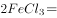

# 2020年新疆公务员录用考试《行测》试题（网友回忆版）

> 常识判断 · 24 题 · 新疆 2020

## 第 1 题　qid 2662167 · 人文常识

2020年是全面建成小康社会目标实现之年、是全面打赢脱贫攻坚战收官之年。下列关于全面建成小康社会和脱贫攻坚的说法，错误的是：

- **A**. 如期全面建成小康社会，更重要、更难做到的是“全面”
- **B**. 全面建成小康社会是针对全国讲的，不是每个地区、每个民族、每个人都达到同一个水平
- **C**. 坚持“两不愁三保障”脱贫标准，即不愁吃，不愁穿，保障义务教育、基本医疗、住房安全
- **D**. 脱贫攻坚的目标要做到“两个确保”：确保现行标准下的农村贫困人口全部脱贫，消除相对贫困；确保贫困县全部摘帽，解决区域性整体贫困　✅

**答案**：D

**官方解析**

本题考查政治常识。
A项正确，习近平总书记在党的十八届五中全会第二次全体会议上指出：“全面建成小康社会，强调的不仅是‘小康’，而且更重要的也是更难做到的是‘全面’。”
B项正确，《习近平总书记系列重要讲话读本（2016年版）》中指出：“全面建成小康社会是针对全国讲的，不是每个地区、每个民族、每个人都达到同一水平。贫困人口脱贫是全面建成小康社会的底线目标，如果几千万贫困人口的问题不解决，几百个贫困县的问题不解决，就不能说全面建成小康社会。全面实现小康，就是说56个民族都要建成小康社会，一个都不能少，一个都不能掉队，这是最起码的要求，但不可能是同一个水平的小康，底线要求的标准就是到2020年这个时间节点上，要全部实现脱贫，消除绝对贫困。”
C项正确，2019年4月16日，习近平总书记在解决“两不愁三保障”突出问题座谈会上的讲话中指出：“到2020年稳定实现农村贫困人口不愁吃、不愁穿，义务教育、基本医疗、住房安全有保障，是贫困人口脱贫的基本要求和核心指标，直接关系攻坚战质量。总的看，‘两不愁’基本解决了，‘三保障’还存在不少薄弱环节。”
D项错误，2018年2月14日，习总书记在打好精准脱贫攻坚战座谈会上发表重要讲话，强调：“确保到2020年现行标准下农村贫困人口全部脱贫，消除绝对贫困；确保贫困县全部摘帽，解决区域性整体贫困。稳定实现贫困人口‘两不愁三保障’，贫困地区基本公共服务领域主要指标接近全国平均水平。既不能降低标准、影响质量，也不要调高标准、吊高胃口。”选项中“消除相对贫困”表述错误。
本题为选非题，故正确答案为D。

---

## 第 2 题　qid 2662170 · 科技常识

在抗击新冠肺炎疫情过程中，中国始终秉持人类命运共同体理念，彰显负责任大国形象，为全球公共卫生事业作出了重要贡献。下列直接体现了这一点的有几项？
①采取最坚决、最彻底的措施，全力阻止新冠肺炎疫情在全球范围的蔓延
②及时向各方通报疫情信息，分享病毒基因序列，与世界卫生组织、周边和有关国家密切合作
③把人民生命安全和身体健康放在第一位，实施新冠肺炎确诊患者免费救治
④向其他出现疫情扩散的国家和地区提供力所能及的援助

- **A**. 1
- **B**. 2
- **C**. 3
- **D**. 4　✅

**答案**：D

**官方解析**

本题考查政治常识。
2020年3月，《求是》杂志发表中国外交部部长王毅的文章《坚决打赢抗击疫情阻击战 推动构建人类命运共同体》。
①正确，文章中指出：“中国为阻止疫情全球扩散展现了担当。中国站在抗击新冠肺炎疫情的第一线，我们不仅对中国人民负责，也为全球公共卫生事业尽责，通过采取最坚决、最彻底的措施，全力阻止新冠肺炎疫情在全球范围的蔓延。”
②正确，文章中指出：“中国为携手应对全球挑战赢得了信任。中方从一开始就高度重视国际卫生合作，本着公开透明原则，及时向各方通报疫情信息，分享病毒基因序列，与世界卫生组织、周边和有关国家密切合作，邀请国际专家并肩工作。”
③正确，中国把人民生命安全和身体健康放在第一位，实施新冠肺炎确诊患者免费救治，治疗费用全部由国家承担。这一举措大大减轻了我国疫情防控的阻力，用中国速度为全球作出防疫准备争取了宝贵时间，用中国力量撑起了控制疫情蔓延的坚固防线。联合国秘书长古特雷斯表示，中国为抗击新冠肺炎疫情并避免其蔓延付出了巨大牺牲，为全人类作出了贡献。世界卫生组织总干事谭德塞指出，中国强有力的举措既控制了疫情在中国境内扩散，也阻止了疫情向其他国家蔓延，不仅是在保护中国人民，也是在保护世界人民。
④正确，文章中指出：“我们将秉持人类命运共同体理念，积极开展抗疫国际和地区合作。战胜这场疫情不仅攸关中国人民的生命和健康，也关系到世界各国人民的安全和福祉。我们将按照党中央部署，围绕统筹推进新冠肺炎疫情防控和经济社会发展做好涉外工作，推动中外人员往来和各领域合作有序进行。我们将扩大抗疫双多边合作，继续同世卫组织保持良好沟通，探索开展跨国联防联控，加强卫生、检疫、交通、出入境等部门协调，及时分享疫情信息、防控措施和研究成果，加强抗病毒药物及疫苗联合研发。我们也将在全面有力防控本国疫情的同时，向其他出现疫情扩散的国家和地区提供力所能及的援助，发挥负责任大国作用。”
故正确答案为D。

---

## 第 3 题　qid 2662179 · 人文常识

《中共中央 国务院关于抓好“三农”领域重点工作确保如期实现全面小康的意见》一文指出，要完善农村留守儿童和妇女、老年人关爱服务体系。发展农村（    ），多形式建设日间照料中心，改善失能老年人和重度残疾人护理服务。

- **A**. 互助式养老　✅
- **B**. 嵌入式养老
- **C**. 群居式养老
- **D**. 家庭式养老

**答案**：A

**官方解析**

本题考查政治常识。
《中共中央 国务院关于抓好“三农”领域重点工作确保如期实现全面小康的意见》一文指出：“加强农村社会保障。适当提高城乡居民基本医疗保险财政补助和个人缴费标准。提高城乡居民基本医保、大病保险、医疗救助经办服务水平，地级市域范围内实现“一站式服务、一窗口办理、一单制结算”。加强农村低保对象动态精准管理，合理提高低保等社会救助水平。完善农村留守儿童和妇女、老年人关爱服务体系。发展农村互助式养老，多形式建设日间照料中心，改善失能老年人和重度残疾人护理服务。”
故正确答案为A。

---

## 第 4 题　qid 2662184 · 人文常识

关于我国最高科学技术奖，下列说法错误的是：

- **A**. 是中国五个国家科学技术奖中的最高等级奖项
- **B**. 每年评选出两名杰出科学工作者获得本奖项　✅
- **C**. 袁隆平是第一届国家最高科学技术奖获得者
- **D**. 国家最高科学技术奖采取推荐制

**答案**：B

**官方解析**

本题考查科技常识。
A项正确，国务院设立了五项国家科学技术奖，分别为国家最高科学技术奖、国家自然科学奖、国家技术发明奖、国家科学技术进步奖、中华人民共和国国际科学技术合作奖。其中，最高科学技术奖是五个国家科学技术奖中的最高等级奖项，须报请国家主席签署并颁发奖章、证书和奖金。
B项错误，国家最高科学技术奖每年授予人数不超过两名，获奖者必须在当代科学技术前沿取得重大突破或者在科学技术发展中有卓越建树；在科学技术创新、科学技术成果转化和高技术产业化中，创造巨大经济效益或者社会效益。每一年度的最高科学技术奖获得者并非一定为两名，如2002年度、2006年度、2014年度获奖者仅有一位，2004年度、2015年度获奖者空缺。
C项正确，袁隆平，杂交水稻专家，中国工程院院士，湖南省农业科学院研究员，2000年获得第一届国家最高科学技术奖。
D项正确，国家最高科学技术奖采取的是推荐制。有推荐资格的单位和个人包括：省、自治区、直辖市人民政府；国务院有关组成部门、直属机构；中国人民解放军各总部；经国务院科学技术行政部门认定的符合国务院科学技术行政部门规定的资格条件的其他单位和科学技术专家。（注：该说法已过时，根据新版《国家科学技术奖励条例》，国家最高科学技术奖已由推荐制改为提名制。）
本题为选非题，故正确答案为B。

---

## 第 5 题　qid 2662187 · 科技常识

2020年7月23日，我国首次火星探测任务（    ）探测器在中国文昌航天发射场启程。随着长征五号遥四火箭的点火升空，我国拉开了向更遥远的深空探测的序幕。

- **A**. 天问一号　✅
- **B**. 凤凰一号
- **C**. 火星一号
- **D**. 朱雀一号

**答案**：A

**官方解析**

本题考查科技常识。
2020年7月23日12时41分，我国在海南岛东北海岸中国文昌航天发射场，用长征五号遥四运载火箭将我国首次火星探测任务“天问一号”探测器发射升空，飞行2000多秒后，成功将探测器送入预定轨道，开启火星探测之旅，迈出了我国自主开展行星探测的第一步。
故正确答案为A。

---

## 第 6 题　qid 2662194 · 人文常识

2020年最高人民法院工作报告指出要保护未成年人健康成长。完善少年司法制度，坚持（    ）审判。

- **A**. 要素式
- **B**. 一站式
- **C**. 圆桌式　✅
- **D**. 纠问式

**答案**：C

**官方解析**

本题考查政治常识。
《2020年最高人民法院工作报告》中指出：“保护未成年人健康成长。完善少年司法制度，坚持圆桌式审判。”圆桌式审判有利于缓解未成年人面对法庭审理的紧张感，更好地通过审判工作让犯罪的未成年人深刻认识到其行为的社会危害性，纠正其行为。
故正确答案为C。

---

## 第 7 题　qid 2662165 · 人文常识

2020年3月2日，我国具有完全自主知识产权的三代核电“华龙一号”全球首堆——中核集团（    ）热态性能试验基本完成，为后续机组装料、并网发电等工作奠定了坚实基础。

- **A**. 福清核电5号机组　✅
- **B**. 海阳核电1号机组
- **C**. 阳江核电4号机组
- **D**. 田湾核电2号机组

**答案**：A

**官方解析**

本题考查科技常识。
2020年3月2日，我国具有完全自主知识产权的三代核电“华龙一号”全球首堆——中核集团福清核电5号机组热态性能试验基本完成，为后续机组装料、并网发电等工作奠定了坚实基础。
故正确答案为A。

---

## 第 8 题　qid 2662171 · 地理国情

2020年3月24日，新疆维吾尔自治区党委农村工作会议强调，巩固脱贫攻坚成果、促进农民持续稳定增收，根本要靠（    ）。

- **A**. 乡村产业发展　✅
- **B**. 构建乡村治理新体系
- **C**. 夯实基层基础
- **D**. 农业供给侧结构性改革

**答案**：A

**官方解析**

本题考查政治常识。
2020年3月24日，新疆维吾尔自治区党委农村工作会议召开。会议强调，巩固脱贫攻坚成果、促进农民持续稳定增收，根本要靠乡村产业发展。
故正确答案为A。

---

## 第 9 题　qid 2662175 · 地理国情

作为新疆第三条出疆铁路，全长1213.7公里的（    ）于2020年7月全线铺轨完成，它是我国又一条入疆大动脉。

- **A**. 青喀铁路
- **B**. 兰库铁路
- **C**. 兰喀铁路
- **D**. 格库铁路　✅

**答案**：D

**官方解析**

本题考查政治常识。
2020年7月21日，在新疆与青海交界处的阿尔金山，随着格库铁路（青海格尔木至新疆库尔勒）新疆段最后一节轨排铺设到位，标志着格库铁路铺轨全线贯通，为年内全线开通运营打下了坚实基础。格库铁路起自青海省格尔木市，沿昆仑山北麓、柴达木盆地南缘西行，进入新疆境内，穿越阿尔金山，经新疆若羌县、尉犁县，到达库尔勒市，全长约1213.7公里，是新疆的第三条出疆通道。全线开通后，将进一步完善我国西部铁路网结构，推动西部大开发提速，加快“丝绸之路经济带”建设。
故正确答案为D。

---

## 第 10 题　qid 2662180 · 地理国情

被业内专家称为“新疆三峡工程”的（    ）水利枢纽工程于2019年11月19日下闸蓄水，使叶尔羌河彻底告别千年水患。该工程是新疆最大水利枢纽工程，将保证塔里木河生态供水条件下，发挥防洪、灌溉、发电的综合利用功能。

- **A**. 大石门
- **B**. 阿尔塔什　✅
- **C**. 大石峡
- **D**. 乌鲁瓦提

**答案**：B

**官方解析**

本题考查政治常识。
阿尔塔什水利枢纽工程位于莎车县霍什拉甫乡阿尔塔什村和克孜勒苏克尔克孜自治州阿克陶县的库斯拉甫乡交界处，总投资109.86亿元，工期历时74个月，于2019年11月19日起开始下闸蓄水。阿尔塔什水利枢纽工程是目前新疆最大的水利工程、国家“十三五”期间的百项重大项目工程之一，也是国务院加快推进的172项重大节水供水工程之一。由于在设计、施工等方面面临诸多技术难点，它被业内专家称为“新疆的三峡工程”。
故正确答案为B。

---

## 第 11 题　qid 2662188 · 地理国情

2019年12月29日23时，新疆首个光热发电项目——（    ）一次并网成功。该项目是国家首批光热发电示范项目之一，可实现年供电量1.983亿度。

- **A**. 
中核克拉玛依100MW光热发电项目

- **B**. 
伊犁尼勒克县大唐60MW光热发电项目

- **C**. 
新疆华能电气股份有限公司25万千兆光热发电项目

- **D**. 
哈密熔盐塔式50MW光热发电项目
　✅

**答案**：D

**官方解析**

本题考查政治常识。
2019年12月29日23时39分，新疆首个光热发电示范项目——中电工程哈密50MW熔盐塔式光热发电项目一次并网成功。中电工程哈密塔式50MW光热发电项目是国家能源局首批光热发电示范项目之一，也是新疆自治区首个光热示范项目，由中国能源建设集团投资有限公司投资建设。
故正确答案为D。

---

## 第 12 题　qid 2662172 · 地理国情

坐落在吐鲁番盆地中央平原的（    ），是新疆地区规模最大、延续时间最长、形制最复杂、影响最深远的一座名城。它奠基于公元前1世纪，是汉魏以来河西及中原移民所营建的中心城市。

- **A**. 高昌故城　✅
- **B**. 楼兰古城
- **C**. 交河故城
- **D**. 北庭故城

**答案**：A

**官方解析**

本题考查地理国情。
A项正确，高昌故城位于新疆吐鲁番市，是公元前1世纪至公元14世纪吐鲁番盆地第一大中心城镇，城址包括外城、内城和“可汗堡”三重城。城址内分布有大量宗教建筑遗址和房屋遗址。高昌故城曾是西域重要的政治、经济、文化、宗教、军事中心，展现了城市文化、建筑技术、多种宗教和多民族文化在吐鲁番盆地的交流与传播。
B项错误，楼兰古城一般指楼兰古国。楼兰古国，是古丝绸之路上的一个小国，位于罗布泊西部，处于西域的枢纽，在古代丝绸之路上占有极为重要的地位。
C项错误，交河故城是公元前2世纪至5世纪由车师人开创和建造的，是世界上最大最古老、保存得最完好的生土建筑城市，也是我国保存两千多年最完整的都市遗迹。唐西域最高军政机构安西都护府最早就设在交河故城。
D项错误，北庭故城遗址为唐代北庭大都护府治所遗址，位于新疆维吾尔自治区吉木萨尔县城正北12千米处，古时为西域城池，是北疆的重要交通枢纽和贸易中转站，古代丝绸之路北道必经之地。
故正确答案为A。

---

## 第 13 题　qid 2662174 · 地理国情

下列哪一项不是新疆出土的文物？

- **A**. 阿斯塔那伏羲女娲图
- **B**. 司禾府印
- **C**. 透雕人鸟兽玉饰件　✅
- **D**. “五星出东方利中国”

**答案**：C

**官方解析**

本题考查地理国情。
A项正确，《伏羲女娲图》是唐代一位佚名作者所画，1965年新疆阿斯塔那出土，藏于新疆维吾尔自治区博物馆。其描绘的是伏羲女娲相拥交媾的景象，表现了中国古代神话传说中的人类始祖形象以及未知的宗教含义。
B项正确，司禾府印为汉代西域屯田官员印，1959年出土于新疆民丰县尼雅遗址东汉合葬墓。桥纽方形，煤精质地，篆书体，通高1.7厘米，边长2厘米。
C项错误，透雕人鸟兽玉饰件出土于1991年，昆山市赵陵山遗址77号墓中。赵陵山位于昆山市张浦镇西南，属长江三角洲太湖水乡地带新石器时代遗址。
D项正确，五星出东方利中国，汉代织锦护臂，为国家一级文物，被誉为20世纪中国考古学最伟大的发现之一。1995年10月，中日尼雅遗址学术考察队成员在新疆和田地区民丰县尼雅遗址一处古墓中发现该织锦。
本题为选非题，故正确答案为C。

---

## 第 14 题　qid 2662177 · 人文常识

下列与丝绸之路无关的名胜古迹是：

- **A**. 敦煌莫高窟
- **B**. 克孜尔千佛洞
- **C**. 洛阳白马寺
- **D**. 云冈石窟　✅

**答案**：D

**官方解析**

本题考查地理国情。
丝绸之路指西汉时，由张骞出使西域开辟的从长安（今西安）经甘肃、新疆，到中亚、西亚，并联结地中海各国的陆上信道。
A项正确，敦煌莫高窟位于甘肃省境内，是中国规模最大、内容最丰富的石窟群，是中西方交流之要冲，古丝绸之路必经之地。敦煌莫高窟有五座唐宋木结构窟檐建筑，是中国现存建筑中的珍贵标本。
B项正确，克孜尔石窟又称克孜尔千佛洞，位于新疆维吾尔自治区拜城县克孜尔乡东南8公里处的渭干河河谷北岸，始建于公元3世纪，是中国历史上开凿最早的佛教石窟。克孜尔石窟是丝绸之路承载世界文明、佛教传播进程不可替代的历史典范。
C项正确，白马寺位于河南省洛阳市，始建于东汉永平十一年（公元68年），是佛教传入中国后兴建的第一座官办寺院，历来被尊为中国佛教的“祖庭”和“释源”。洛阳白马寺是中外通过丝绸之路进行佛教文化交流的见证。
D项错误，云冈石窟位于山西省大同市，以壮观的石刻闻名，其造像气势宏伟，内容丰富多彩，堪称公元5世纪中国石刻艺术之冠。其与丝绸之路无关。
本题为选非题，故正确答案为D。

---

## 第 15 题　qid 2662183 · 人文常识

关于甲骨文，下列说法不正确的是：

- **A**. 是我国现存最早的文字
- **B**. 既可以表音又可以表意　✅
- **C**. 所用的骨片曾经被当作药材
- **D**. 记录内容大多是卜辞

**答案**：B

**官方解析**

本题考查人文常识。
A、D两项正确，甲骨文是中国汉字的早期形式，最早出土于河南省安阳市殷墟，因此又称“殷墟文字”。殷墟甲骨文上刻写的主要是占卜记录（“卜辞”），是记载“占卜”过程的王室档案。
B项错误，甲骨文的功能可以概括为以形表意或象形表意，它既具有象形文字的特征，亦具备表意文字的属性。
C项正确，据《甲骨琐语》记载，剃头匠李成最先把当地的甲骨当作药材卖给药铺，因甲骨治病被传的很神奇，引起了一位翰林的注意，他对比金文等古文字，确定这是殷商时期的文字，由此，甲骨文终于走出安阳小屯村，为世界所知。
本题为选非题，故正确答案为B。

---

## 第 16 题　qid 2662185 · 法律常识

关于我国税收制度，下列说法不符合法律规定的是：

- **A**. 房产税和车船税都属于财产行为税
- **B**. 目前中央人民政府不在特别行政区征税
- **C**. 我国现行个人所得税征税起征点是5000元
- **D**. 所有税种均由税务部门负责征收　✅

**答案**：D

**官方解析**

本题考查法律常识。
A项正确，财产行为税是指以纳税人拥有的财产数量或者财产价值为征税对象，或是为了实现某种特定的目的，以纳税人的某些特定行为为征税对象的税种。例如我国现行的印花税、契税、车船税、房产税都属于这一类。
B项正确，《香港特别行政区基本法》第一百零六条规定：“香港特别行政区保持财政独立。香港特别行政区的财政收入全部用于自身需要，不上缴中央人民政府。中央人民政府不在香港特别行政区征税。”《澳门特别行政区基本法》第一百零四条规定：“澳门特别行政区保持财政独立。澳门特别行政区财政收入全部由澳门特别行政区自行支配，不上缴中央人民政府。中央人民政府不在澳门特别行政区征税。”因此，目前中央人民政府不在特别行政区征税。
C项正确，2018年8月31日，全国十三届全国人大常委会第五次会议表决通过了全国人大常委会关于修改个人所得税法的决定。根据决定，个税起征点由原来的3500元/月提高至现行的5000元/月。
D项错误，目前我国的税收分别由税务、财政、海关等系统负责征收管理。（1）税务机关负责征收管理的有增值税，消费税，车辆购置税，企业所得税（铁道部门、各银行总行、各保险总公司集中缴纳的增值税、所得税、城市维护建设税，中央企业缴纳的所得税，中央与地方所属企业、事业单位组成的联营企业、股份制企业缴纳的所得税，地方银行、非银行金融企业缴纳的所得税，海洋石油企业缴纳的所得税等），资源税，个人所得税，城镇土地使用税，耕地占用税，土地增值税，房产税，车船税，印花税，契税等。（2）在大部分地区契税由地方财政部门征收和管理。（3）海关系统负责征收和管理关税、船舶吨税，同时负责代征进口环节的增值税和消费税。
本题为选非题，故正确答案为D。

---

## 第 17 题　qid 2662190 · 人文常识

儒释道是影响我国传统文化的主要思想，下列与之相关的说法错误的是：

- **A**. 佛教传入中国后曾被称为“浮屠教”
- **B**. 山西悬空寺是一座儒释道三教合一的寺院
- **C**. 宋代将四书五经确定为唯一的科举考试内容　✅
- **D**. 北魏拓跋焘确立了儒学的主体地位

**答案**：C

**官方解析**

本题考查人文常识。
A项正确，佛教传入中国后曾被称为“浮屠教”。根据《佛学大辞典》，浮屠亦作浮图、休屠。古人因称佛教徒为浮屠，故称佛教为浮屠教。
B项正确，悬空寺，位于山西省大同市浑源县城南3.5公里处，始建于北魏后期(公元491年)，距今已有一千五百多年。悬空寺佛、道、儒“三教合一”的宗教特色在世界东方独树一枝，蜚声中外，被誉为“世界一绝”“东方瑰宝”。
C项错误，宋代科举前期基本上沿袭唐制，进士科考帖经、墨义和诗赋，弊病很大。王安石任参知政事后，对科举考试的内容着手进行改变，取消诗赋、帖经、墨义，专以经义、论、策取士。熙宁八年，宋神宗下令废除诗赋、帖经、墨义取士，颁发王安石的《三经新义》和论、策取士。并把《易官义》《诗经》《书经》《周礼》《礼记》称为大经，《论语》《孟子》称为兼经，定为应考士子的必读书。规定进士考试为四场：一场考大经，二场考兼经，三场考论，最后一场考策。
D项正确，北魏太武帝拓跋焘在执政的实践中，逐渐认识到要维护和巩固自己的统治，而实行了一系列的改革采用汉人治理国家的办法，推行文治。他在国内大范围地推崇儒学，让很多的汉族高级知识分子参政，他尊崇孔子，提倡儒学，大量吸收汉族地主阶级知识分子参政，目的是要用儒家学说统治百姓的思想，利用汉族知识分子的知识和经验治国安邦，确立了儒学的主体地位。
本题为选非题，故正确答案为C。

---

## 第 18 题　qid 2662209 · 人文常识

关于我国农业，下列说法错误的是：

- **A**. 广西、广东、云南三省是我国主要糖料产区
- **B**. 温室大棚占地面积居世界第一
- **C**. 耕地灌溉面积超过10亿亩
- **D**. 农林牧渔中产值占比最低的是畜牧业　✅

**答案**：D

**官方解析**

本题考查地理国情。

A项正确，2019年国家统计局发布《农业生产跃上新台阶 现代农业擘画新蓝图——新中国成立70周年经济社会发展成就系列报告之十二》。《报告》指出，糖料向广西、云南和广东3省（区）集中。2018年广西、云南和广东3省（区）糖料产量合计为10346万吨，占全国糖料产量的。

B项正确，第三次全国农业普查结果显示，2016年末全国温室占地面积334千公顷，比2006年末增长，大棚占地面积981千公顷，增长。我国温室大棚占地面积稳居世界第一，工厂化种养也呈快速发展态势。

C项正确，2019年国家统计局发布《农业生产跃上新台阶 现代农业擘画新蓝图——新中国成立70周年经济社会发展成就系列报告之十二》。《报告》指出，国家深入实施藏粮于地、藏粮于技战略，持续加强以农田水利为重点的农业基础设施建设力度，加大投入兴修农田水利，深化重大水利工程建设，不断完善小型农田水利设施，农田灌溉条件明显改善。据水利部统计，2018年我国耕地灌溉面积10.2亿亩，比1952年增长2.4倍，年均增长。

D项错误，2019年国家统计局发布《农业生产跃上新台阶 现代农业擘画新蓝图——新中国成立70周年经济社会发展成就系列报告之十二》。《报告》指出，改革开放后，林、牧、渔业开始全面发展，农林牧渔四业结构日益协调合理。2018年农业产值占农林牧渔四业产值的比重为，比1952年下降28.8个百分点；林业占，提高3.4个百分点；畜牧业占，提高15.4个百分点；渔业占，提高10.0个百分点。因此，农林牧渔中产值占比最低的是林业。

本题为选非题，故正确答案为D。

---

## 第 19 题　qid 2662210 · 科技常识

下列关于生活常识说法错误的是：

- **A**. 心肺复苏抢救时，胸外心脏按压与人工呼吸的比例为30：2
- **B**. 照相馆废相纸属于可回收垃圾　✅
- **C**. 5G的优势支撑了无人驾驶汽车和无人机的操控
- **D**. 海水稻具有抗病虫和耐盐碱等特性

**答案**：B

**官方解析**

本题考查科技常识。
A项正确，心肺复苏是对心跳呼吸停止的人进行抢救，其既有心脏按压又有人工呼吸，进行人工呼吸前，要使病人呼吸畅通。人工呼吸和胸外心脏按压的方法结合时，要先做30次心脏按压，并保持气道通畅，再做2次人工呼吸，如此交替反复进行。
B项错误，可回收物是指适宜回收循环使用和资源利用的废物。其中可回收纸类是指未严重玷污的文字用纸、包装用纸和其他纸制品等。而照相馆废相纸属于对人体健康或自然环境造成直接或潜在危害的生活废弃物，为有害垃圾。
C项正确，无人驾驶汽车和无人机都是通过利用机载传感器来感知周围环境，并根据感知所获得的道路、位置和障碍物信息，控制转向和速度，从而使车辆能安全行驶，无人机安全飞行。5G具备高性能、低延迟与高容量特性，支撑了无人驾驶汽车和无人机的操控。
D项正确，“海水稻”是耐盐碱水稻的俗称，其并非直接生长在海水里，而是在盐碱地及滩涂上存活生长的一类特殊的水稻，具有无需施肥、抗病虫、耐盐碱三大特性。
本题为选非题，故正确答案为B。

---

## 第 20 题　qid 2662213 · 人文常识

摄影作品先后顺序：
①海浪中的脸 
②胜利旗帜插到帝国国会大厦 
③南京大屠杀
④希特勒在巴黎

- **A**. ③④①②　✅
- **B**. ②③④①
- **C**. ④①③②
- **D**. ①②④③

**答案**：A

**官方解析**

本题考查人文常识。
①海浪中的脸时间点为1944年，莱利参加诺曼底登陆战的第一轮攻击，涉水冲向奥马哈海滩，那瞬间情景被战地摄影记者捕捉到，因此诞生此照片。
②胜利旗帜插到帝国国会大厦拍摄于1945年的德国柏林，作者是叶普盖尼·哈尔岱。
③南京大屠杀拍摄于1937年，作者是美国传教士约翰·马吉。
④希特勒在巴黎拍摄于1940年，记录了希特勒和他的亲信们巡视战果的场景。
因此顺序应为③④①②。
故正确答案为A。

---

## 第 21 题　qid 2662214 · 人文常识

下列关于天文学说法错误的是：

- **A**. 银河系里存在大量恒星
- **B**. 就整个地球而言，日环食发生次数少于日全食　✅
- **C**. 对流层集中了大气中大部分水汽
- **D**. 大批流星群闯入大气层造成的电离效应可能使远距离电讯异常

**答案**：B

**官方解析**

本题考查地理国情。

A项正确，银河系是太阳系所在的恒星系统，包括1200亿颗恒星和大量的星团、星云，还有各种类型的星际气体和星际尘埃。

B项错误，从全球范围来看：日环食出现的频率比日全食高。这是因为月球本影的平均长度（373293公里）小于月球与地球之间的平均距离（384400公里），因此日环食发生的次数多于日全食。

C项正确，对流层，是指最接近地球表面的一层大气，也是大气的最下层，密度最大，所包含的空气质量几乎占整个大气质量的，以及几乎所有的水蒸气及气溶胶。

D项正确，流星雨对人类活动会产生一定影响。流星雨可能对航天器造成威胁、陨星可能击中人类或牲畜、大批流星群闯入地球大气层造成的电离效应则可能使远距离电讯发生异常。

本题为选非题，故正确答案为B。

---

## 第 22 题　qid 2662217 · 地理国情

下列关于高速铁路说法正确的是：

- **A**. 沪昆高铁横跨第一、二、三级阶梯
- **B**. 徐兰高铁经过安徽和湖北
- **C**. 京广高铁连接了我国两大工业基地　✅
- **D**. 京哈高铁穿过温带大陆性气候区

**答案**：C

**官方解析**

本题考查地理国情。
A项错误，沪昆高铁是一条连接上海市与云南省昆明市的高速铁路，跨越第二、第三级阶梯，没有跨越第一级阶梯。
B项错误，徐兰高铁是我国“四纵四横”高速铁路网中横向高铁干线，同时也是“八纵八横”快速客运通道陆桥通道的重要组成部分。线路经过江苏、安徽、河南、陕西、甘肃5个省份，全长约1580公里，线路走向大体上与既有陇海铁路平行。
C项正确，京广高速铁路自北京西站起，经过北京、河北、河南、湖北、湖南、广东6个省市，止于广州南站，我国京广高速铁路南北连接京津唐和珠江三角洲两大工业基地。
D项错误，京哈高铁由北京市出发，途经河北省、辽宁省、吉林省，终到黑龙江省哈尔滨市，均属于温带季风气候。
故正确答案为C。

---

## 第 23 题　qid 2662218 · 科技常识

关于生活常识，下列说法正确的是：

- **A**. 双层玻璃中间有一个空气层，是因为空气能保温和隔热　✅
- **B**. 汽车车身设计成流线型，是为了加大汽车行驶时受到的阻力
- **C**. 对着电视画面拍照，应开启照相机闪光灯，这样画面更清晰
- **D**. 看电影时从每个角度都能看到银幕上的画面，是因为银幕产生了光的折射

**答案**：A

**官方解析**

本题考查科技常识。
A项正确，空气的导热系数很低，且双层玻璃的特殊结构限制了空气的对流，因此起到保温和隔热的作用。
B项错误，汽车的车身设计成流线型，是为了减小汽车行驶时受到的阻力。
C项错误，照相机拍照利用的是凸透镜成像原理，就是物体自身的光或反射的太阳光穿过照相机镜头在照相机感光元件上呈倒立缩小的实像。我们看到的电视画面的光是电视机内部光源穿过电视机显示器的透射光，如果想让照相机照的电视机画面清晰，必须减少闪光灯和照明灯对电视机画面的影响，避免闪光灯和照明灯的光在电视屏幕上反射，干扰到电视画面本身的透射光。
D项错误，银幕是凹凸不平的，平行光线入射到粗糙的银幕上，反射光线射向四面八方，进入不同方向的人的眼睛，不同方向的人们都能看到，因此光在银幕上发生漫反射。
故正确答案为A。

---

## 第 24 题　qid 2662221 · 科技常识

化学与生产生活息息相关，下列说法错误的是：

- **A**. 桥梁吊绳中所使用的聚乙烯纤维属于有机合成材料
- **B**. 蔬菜中残留的农药用酸性物质泡，可降低农药的药性　✅
- **C**. 印刷电路板常用化学腐蚀剂来生产，这种化学腐蚀剂是氯化铁
- **D**. 点燃蜡烛的炭黑具有吸附性，因此可点燃蜡烛去除烟味

**答案**：B

**官方解析**

本题考查科技常识。

A项正确，聚乙烯纤维属于有机合成材料，它是由聚乙烯经熔融纺丝法纺丝而得到的纤维材料，包括短纤维和长丝，这种纤维的机械强度可通过纺丝工艺参数进行调节，而且湿态强度和伸长与干态相同，聚乙烯纤维具有强度高，密度低，绝缘性佳等优点，但热承载能力低和冷蠕变限制了它的应用，主要用于生产各种工业用纺织品，特别是滤材，篷布以及网带等产品。

B项错误，绝大多数农药呈酸性，用碱性物质泡会降低农药的药性，用酸性物质泡则不会。

C项正确，制印刷电路板时常用氯化铁溶液作为“腐蚀液”，其反应的化学方程式为。

D项正确，蜡烛燃烧产生炭黑等无定形炭对烟雾有吸附作用，它能将室内有异味的气体吸附在黑色烟子表面，从而达到消除烟味的作用。

本题为选非题，故正确答案为B。

---
