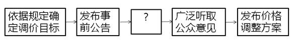

# 2020年江苏省公务员录用考试《行测》题（A类）（网友回忆版）

> 常识判断 · 12 题 · 江苏 2020

## 第 1 题　qid 2452630 · 科技常识

我国当前正处在转变发展方式、优化经济结构、转换增长动力的攻关期，建设现代化经济体系是跨越关口的迫切要求。下列关于现代化经济体系的说法正确的是：

- **A**. 关注劳动和资本的投入，稳定经济增长
- **B**. 国民经济体系中的各个门类和产业均衡发展
- **C**. 互联网大数据人工智能与虚拟经济深度融合
- **D**. 强化市场的决定性作用，提高供给质量和效率　✅

**答案**：D

**官方解析**

本题考查经济常识。
A项错误，由于经济发展方式转变，经济增长应该由劳动和资本投入转变为科技和创新投入。
B项错误，不可能保证每个门类和产业都做到均衡发展，应该有所侧重。
C项错误，推动互联网、大数据、人工智能和实体经济深度融合，培育壮大经济发展新动能，不是虚拟经济。
D项正确，现代化经济体系是更完善的经济体制，即强化市场的决定性作用，深化供给侧结构改革，提高供给质量和效率。
故正确答案为D。

---

## 第 2 题　qid 2452631 · 人文常识

2019年10月31日，国务院决定开展第七次全国人口普查。关于第七次全国人口普查，下列说法不正确的是

- **A**. 标准时点是2020年11月1日零时
- **B**. 普查对象不含在境内定居的外国人　✅
- **C**. 将首次采集普查对象的身份证号码
- **D**. 采取电子化方式开展人口普查登记

**答案**：B

**官方解析**

本题考查政治常识。
A项正确，2020年第七次全国人口标准时点是2020年11月1日零时普查。
B项错误，普查对象是普查标准时点在中华人民共和国境内的自然人以及在中华人民共和国境外但未定居的中国公民，不包括在中华人民共和国境内短期停留的境外人员。
C项正确，为了提高普查数据质量，在全国第七次人口普查中将首次采集普查对象的身份证号码。
D项正确，国务院决定于2020年开展第七次全国人口普查。本次全国人口普查采取电子化方式开展普查登记，探索使用智能手机采集数据。
本题为选非题，故正确答案为B。

---

## 第 3 题　qid 2452634 · 人文常识

我国要优化行政区划设置，提高中心城市和城市群综合承载和资源优化配置能力，实行扁平化管理，形成高效率组织体系。下列属于实行扁平化管理的改革措施是

- **A**. 大部制改革
- **B**. 综合执法改革
- **C**. 垂直化管理改革
- **D**. 省直管县改革　✅

**答案**：D

**官方解析**

本题考查管理学常识。
扁平式管理，或称扁平化管理，是指管理层级的减少和效率提升。传统的管理模式一般呈现层级较多，效率相对较低的金字塔结构。扁平式管理的贡献是：1、减少管理层级；2、上级层级能映射更大面积的下级，从而提高管理效率；3、特殊的下级职能会被越级关注（直管模式或说网络结构）。
A项错误，大部制改革即为大部门体制改革，即为推进政府事务综合管理与协调，按政府综合管理职能合并政府部门，组成超级大部的政府组织体制。特点是扩大一个部所管理的业务范围，把多种内容有联系的事务交由一个部管辖，从而最大限度地避免政府职能交叉、政出多门、多头管理，从而提高行政效率，降低行政成本。
B项错误，综合执法改革是指为解决多头执法、多层执法、执法扰民、基层执法力量不足等问题，提升执法效率和监管水平，合理确定综合执法范围，整合相近职能，在市场监管、交通运输、城市建设管理等领域整合组建综合行政执法队伍，保留必要的专业技术性强的执法队伍。
C项错误，“垂直”管理是我国政府管理中的一大特色，我国比较重要的政府职能部门，主要包括履行经济管理和市场监管职能的部门，如海关、工商、税务、烟草、交通、盐业的中央或者省级以下机关多数实行垂直管理。
D项正确，“省管县”体制指省市县行政管理关系由目前的“省—市—县”三级体制转变为“省—市、县”二级体制，对县的管理由现在的“省管市—市管县”模式变为由省替代市，实行“省管县”模式，其内容包括人事、财政、计划、项目审批等原由市管理的所有方面。省直管县改革减少了中间的管理层级，上级层级能直接映射下级层级，属于扁平化的管理改革模式。
故正确答案为D。

---

## 第 4 题　qid 2452636 · 人文常识

1949年3月，中共中央和毛泽东离开西柏坡前往北平进驻香山。在香山的半年时间里，发生的一系列重大历史事件在党和国家历史上具有非常重要的地位。下列发生在这一时期的重大历史事件是
①毛泽东、朱德发布向全国进军的命令，吹响了解放全中国的伟大号角
②召开了党的七届二中全会，规定了党在全国胜利后应当采取的基本政策
③毛泽东发表了《论人民民主专政》，为新中国建立奠定了理论和政策基础
④制定了《中国人民政治协商会议共同纲领》，描绘了建立建设新中国的蓝图

- **A**. ①②③
- **B**. ①②④
- **C**. ①③④　✅
- **D**. ②③④

**答案**：C

**官方解析**

本题考查毛中特。
①、③、④正确，2019年9月12日，中共中央总书记、国家主席、中央军委主席习近平专程前往北京香山革命纪念地，瞻仰双清别墅、来青轩等革命旧址，参观香山革命纪念馆。他表示，1949年3月23日，中共中央和毛泽东同志离开西柏坡前往北平，25日进驻北京香山，这里成为党中央所在地。在这里，毛泽东、朱德同志发布向全国进军的命令，吹响了“打过长江去，解放全中国”的伟大号角，中国人民解放军以摧枯拉朽之势向全国各地胜利大进军，彻底结束了国民党在大陆的统治。在这里，毛泽东同志发表了《论人民民主专政》，为新中国的建立奠定理论基础和政策基础。在这里，中共中央同各民主党派、各界人士共同筹备中国人民政治协商会议，制定通过了起到临时宪法作用的《中国人民政治协商会议共同纲领》，确定了新中国的国体和政体，制定了一系列基本政策，描绘了建立建设新中国的宏伟蓝图。
②错误，党的七届二中全会于1949年3月5日—13日在河北西柏坡召开。这次会议规定了党在全国胜利以后在政治、经济、外交方面应当采取的基本政策，为夺取全国革命的胜利，推动新民主主义革命向社会主义革命转变，奠定了政治上和思想上的基础。此次会议在西柏坡召开，因此不属于离开西柏坡前往北平进驻香山后发生的重大历史事件。
故正确答案为C。

---

## 第 5 题　qid 2452637 · 人文常识

人们常常引用希腊典故来分析当今世界的现实问题。下列希腊典故与其寓意对应正确的是

- **A**. 潘多拉的盒子——世事变幻无常
- **B**. 阿喀琉斯之踵——强大事物的软肋　✅
- **C**. 修昔底德陷阱——安静祥和背后暗藏的风险
- **D**. 达摩克利斯之剑——守成大国与崛起大国必有一战

**答案**：B

**官方解析**

本题考查人文常识。
A项错误，潘多拉，希腊神话中的第一个女人。她貌美性诈，私自打开宙斯送给她的一只盒子，里面装的疾病、疯狂、罪恶、嫉妒等祸患，一齐飞出，只有希望留在盒底，人间因此充满灾难。因此“潘多拉的盒子”成为“灾祸的来源”的同义语。
B项正确，荷马史诗中的英雄阿喀琉斯出生后便被神仙母亲倒提着浸入冥河，而脚后跟却不慎露在水外，因而除脚后跟外，全身各处刀枪不入。后来，一次战斗中他被人一箭射中脚踝而死去。后人用阿喀琉斯之踵喻指即使再强大的英雄，也有致命的死穴或软肋。
C项错误，“修昔底德陷阱”，指一个新崛起的大国必然要挑战现存大国，而现存大国也必然会回应这种威胁，这样战争变得不可避免。此说法源自古希腊著名历史学家修昔底德，他认为，当一个崛起的大国与既有的统治霸主竞争时，双方面临的危险多数以战争告终。
D项错误，古希腊传说中迪奥尼修斯国王请他的大臣达摩克利斯赴宴，命其坐在用一根马鬃悬挂的一把寒光闪闪的利剑下，意指令人处于一种危机状态，随时要有危机意识。达摩克利斯之剑比喻安逸祥和背后存在的杀机和危险，告诫人们要经常反思潜在的风险并化解之。现也引申为做坏事的人随时都有可能受到惩罚。
故正确答案为B。

---

## 第 6 题　qid 2452652 · 人文常识

我国在区块链领域拥有良好基础，要加快推动区块链技术和产业创新发展，积极推进区块链和经济社会融合发展。关于区块链的特征和作用，下列说法不正确的是

- **A**. 省去第三方中间环节，降低交易成本
- **B**. 打通部门间的数据壁垒，实现信息共享
- **C**. 解决经济社会发展中的“存证”难题，维护社会秩序
- **D**. 排除管理员外任何人修改信息的可能性，确保信息安全　✅

**答案**：D

**官方解析**

本题考查科技常识。
A项正确，区块链技术通过“去中心化”和“点对点”的特征，进一步减少中间环节，消除了第三方交易中介存在的必要性，从而降低交易成本。因为实现了点对点的交易，中央处理或清算组织成为冗余；因为交易的真实性是由区块链上所有参与者共同验证和维护的，所以作为第三方的信用中介也失去了存在价值。
B项正确，区块链“分布式”的特点，可以打通部门间的“数据壁垒”，实现信息和数据共享。与中心化的数据存储不同，区块链上的信息都会通过点对点广播的形式分布于每一个节点，通过“全网见证”实现所有信息的“如实记录”。在公共服务领域，区块链能够实现政务数据跨部门、跨区域共同维护和利用，为人民群众带来更好的政务服务体验。
C项正确，区块链“不可篡改”的特点，为经济社会发展中的“存证”难题提供了解决方案。只要能够确保上链信息和数据的真实性，那么区块链就可以解决信息的“存”和“证”难题。比如在版权领域，区块链可以用于电子证据存证，可以保证不被篡改，并通过分布式账本链接原创平台、版权局、司法机关等各方主体，可以大大提高处理侵权行为的效率。在金融、司法、医疗、版权等对数据真实性要求高的领域，区块链都可以创造安全、高效的应用场景。
D项错误，区块链通过时间戳保证每个区块依次顺序相连。时间戳使区块链上每一笔数据都具有时间标记。简单来说，时间戳证明了区块链上什么时候发生了什么事情，且任何人无法篡改，甚至管理员也无法修改。
本题为选非题，故正确答案为D。

---

## 第 7 题　qid 2452653 · 人文常识

“春江潮水连海平，海上明月共潮生。”关于海水涨落，下列说法不正确的是

- **A**. 地球对海水的引力最大，它使海水有涨有落　✅
- **B**. 海水的涨落受太阳、地球和月球引力的影响
- **C**. 由于距离地球遥远，太阳对海水的引力没有月球大
- **D**. 太阳、月球和地球处在一条线上时，潮汐的潮差最大

**答案**：A

**官方解析**

本题考查地理国情。
A项错误、B项正确，地球表面的海水，随时随地都受万有引力的影响，主要是地球、月球和太阳的引力，其中地球的引力最大。但地球引力只会使海水永恒地依附在地球表面上，海水的涨落是由于受到地球、月球和太阳这三股力量的综合影响，并非只有地球引力。
C项正确，太阳虽然远比月球大，但是太阳与地球之间的距离是月球与地球之间距离的约400倍，所以月球对海水的引力比太阳大。
D项正确，潮差是指在一个潮汐周期内，相邻高潮位与低潮位间的差值，又称潮幅。每当太阳、月球和地球三者连成一条线过后的一两天，海面所受引力为太阳、月球引力的综合，因而出现最高的高潮和最低的低潮，此时潮汐的潮差最大。而每当太阳、月球和地球三者成直角关系过后的一两天，太阳引力和月球引力相互抵消，便出现最低的高潮和最高的低潮，此时潮汐的潮差最小。
本题为选非题，故正确答案为A。

---

## 第 8 题　qid 2452654 · 法律常识

对下列古语所蕴含法律思想的理解，不正确的是

- **A**. 法不察民情而立之，则不威——法律应当服从民意　✅
- **B**. 刑罚不足以移风，杀戮不足以禁奸——严刑峻法有其局限性
- **C**. 国有常法，虽危不亡——法律是国家长治久安的保障
- **D**. 天下之事，不难于立法，而难于法之必行——法律的生命力在于实施

**答案**：A

**官方解析**

本题考查法律常识。
A项错误，出自《商君书•壹言》，意思是如果不体察民情民意就制定法律，那么法律会失去权威。这句古语说明法律的最终目的是服务于民众，制定法律必须考虑民意，但并不意味着法律应当服从民意，这是因为法律的本质是统治阶级进行阶级统治的工具。正如卢梭所说：“明智的创造者并不从制定良好的法律本身着手，而是要事先考察一下，他要为之而立法的那些人民是否适于接受那些法律。”
B项正确，出自《淮南子•主术训》，意思是单靠刑罚不能够改变社会的不良风气，单靠杀戮也不能够禁止坏人坏事。这句古语说明严刑峻法也有其局限性，要想社会秩序井然，不能仅靠刑罚，还要靠道德教育。
C项正确，出自《韩非子•饰邪》，意思是国家有稳定的法度，虽遇到危难也不致灭亡。这句古语说明法律是国家长治久安的保障。
D项正确，出自明代张居正的《请稽查章奏随事考成以修实政疏》，意思是天下的事情，困难之处不在于制定法令，而在于让法令得到切实贯彻执行。这句古语说明法律的生命力在于实施。
本题为选非题，故正确答案为A。

---

## 第 9 题　qid 2452655 · 法律常识

某区教育局将学区调整的情况张贴在各学校门口。刘某的住房被划入新的学区，但他没有及时了解情况，将房屋低价卖给了王某。对此，下列说法正确的是

- **A**. 刘某认为区教育局公开学区信息不当，有权提起行政诉讼　✅
- **B**. 区教育局公开学区信息的行为构成行政不作为
- **C**. 刘某有权以重大误解为由，解除与王某的房屋买卖合同
- **D**. 区教育局应对刘某的损失承担赔偿责任

**答案**：A

**官方解析**

本题考查法律常识。
A项正确，根据《政府信息公开条例》第五十一条规定：“公民、法人或者其他组织认为行政机关在政府信息公开工作中侵犯其合法权益的，可以向上一级行政机关或者政府信息公开工作主管部门投诉、举报，也可以依法申请行政复议或者提起行政诉讼。”因此，如果刘某认为教育局做法不当的，有权提起行政诉讼。
B项错误，行政不作为是指行政机关应当履行职责而不履行或者拖延履行职责。区教育局主动公开学区，并不存在不作为。
C项错误，根据《民法典》第一百四十七条规定：“基于重大误解实施的民事法律行为，行为人有权请求人民法院或者仲裁机构予以撤销。”刘某因为没有及时了解情况，将学区房低价卖给了王某，双方存在重大误解，刘某可以请求人民法院或者仲裁机构将合同撤销，但不能直接与王某解除合同。
D项错误，刘某没有及时了解学区变动信息，是由于自己的过错，其不能要求区教育局承担责任。但是其将房屋低价卖给了王某，存在重大误解，刘某可以通过请求人民法院或者仲裁机构将合同撤销挽回损失。
故正确答案为A。

---

## 第 10 题　qid 2452656 · 人文常识

制度建设不在于制度的多少，而在于精，在于务实管用，突出针对性和指导性，“牛栏关猫”是不行的。下列管理举措属于“牛栏关猫”的是

- **A**. 某地完善配套政策机制，鼓励区块链产业发展
- **B**. 某地采取分类帮扶措施，帮助贫困户精准脱贫
- **C**. 某地为打击“套路贷”，关停所有的网贷机构　✅
- **D**. 某地出台针对性政策，解决营商环境的突出问题

**答案**：C

**官方解析**

本题考查管理学常识。
“牛栏关猫”现象告诉我们牛栏关猫是关不住的，空隙太大，猫可以来去自如。因此作为制度建设的主体，各单位和部门要主动增强“自己把自己关进笼子”的意识，自觉约束自己的权力，减少自由裁量权，把权力的笼子织得紧一些、密一些，并力求各项制度衔接配套、环环相扣，保证制度既拦得住牛，也关得住猫，真正实现“用制度管权、用制度管事、用制度管人”。
A项错误，通过政府层面出台相关政策，不断完善配套政策机制，能够为该地区区块链产业发展创造良好环境，有助于区块链产业健康发展，与题干不符。
B项错误，通过采取分类帮扶措施，体现了精准扶贫、精准脱贫，最终帮助贫困户真正脱贫，与题干不符。
C项正确，“套路贷”是假借民间借贷之名，非法占有被害人财物的违法犯罪行为，是扫黑除恶专项斗争的重点打击对象。该地区打击“套路贷”其目的是为了维护广大人民群众的利益；但是关停所有的网贷机构会导致一些正规的金融机构利益受损，同时无法满足群众的贷款需求。因此，打击“套路贷”必须疏堵并举，大力推进普惠金融服务，为急需用钱的消费者提供可靠、便捷的渠道。
D项错误，该地区出台针对性措施解决本地营商环境突出问题，能够有针对性地解决当地实际问题，使各项措施能够真正得到落实，保障各类市场主体公平参与市场竞争，与题干不符。
故正确答案为C。

---

## 第 11 题　qid 2452657 · 人文常识

为应对运营成本上涨压力，某地政府决定对现行地铁票价进行调整，下图为地铁票价调整的部分工作流程：

填入上述流程图中“？”处的正确选项是

- **A**. 获得上级主管部门的批准
- **B**. 核算成本收益拟定调价方案　✅
- **C**. 与地铁公司进行沟通和协调
- **D**. 选取部分地铁线路先行试点

**答案**：B

**官方解析**

本题考查管理学常识。
A项错误，上级主管部门的批准应该是在发布价格调整方案提交部门审议之后。
B项正确，通过发布事前公告，能够使广大群众了解政府举措；待该地政府根据相关规定和与地铁公司的协定以及各部门意见，拟定调价方案，通过政府平台发布该初步方案，利于广大群众参与提出更好的意见。
C项错误，与地铁公司进行沟通和协调属于发布事前公告的前一环节。
D项错误，在调整方案批准发布之后，可以选取部分地铁线路先行试点，能够为政府提供经验，并在全面推行改革之前不断优化政策，更好为人民服务。
故正确答案为B。

---

## 第 12 题　qid 2452658 · 人文常识

按照城市品质提升的总体要求，住建部于2019年7月在9个城市开展规范城市户外广告设施管理工作。就政策执行来说，下列举措与此属于同一类的是

- **A**. 甲省为鼓励高新技术产业发展出台优惠补贴政策
- **B**. 乙省借鉴国内外经验完善退伍军人荣誉奖励制度
- **C**. 丙省挑选部分国有企业开展混合所有制改革工作　✅
- **D**. 丁省为推动文化产业发展设立文化产业创新基地

**答案**：C

**官方解析**

本题考查政治常识。
“政策试点”，是中国治理实践中所特有的一种政策测试与创新机制，具体类型包括各种形式的试点项目、试验区等。试点项目是中国政策过程中最为典型和普遍的一种政策试点类型，它是指在一定时间段和一定范围（特定的地域、政府部门或企事业单位）内所进行的一种局部性政策探索及实施活动。住建部挑选9个城市先行开展规范城市户外广告设施管理工作就是一种试点项目。
A项错误，甲省的政策面对的是甲省全部的高新企业，与题干政策不是同一类。
B项错误，乙省的政策面对的乙省全部的退伍军人，与题干政策不是同一类。
C项正确，“挑选部分国有企业”也是一种试点项目政策。
D项错误，“设立文化产业创新基地”属于设立试验区，试验区是指为探索或实施某一项或某一领域的新政策、新制度而选定的一个地域性区划单位，具体表现为各种样式的综合性试验区、专门性试验区以及特区、新区、开发开放区、示范区、合作区等。
故正确答案为C。

---
