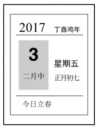
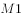
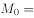
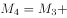
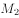

# 2020年浙江公务员考试《行测》（B类）试题（网友回忆版）

> 常识判断 · 14 题 · 浙江 2020

## 第 1 题　qid 2579721 · 人文常识

下列说法错误的是：

- **A**. 新时代的五大发展理念是指创新、绿色、开放、包容、可持续　✅
- **B**. “四个意识”是指政治意识、大局意识、核心意识、看齐意识
- **C**. “四个自信”是指中国特色社会主义道路自信、理论自信、制度自信、文化自信
- **D**. “两个维护”是指坚决维护习近平总书记党中央的核心、全党的核心地位，坚决维护党中央权威和集中统一领导

**答案**：A

**官方解析**

本题考查政治常识。
A项错误，党的十八届五中全会指出：“实现‘十三五’时期发展目标，破解发展难题，厚植发展优势，必须牢固树立并切实贯彻创新、协调、绿色、开放、共享的发展理念。这是关系我国发展全局的一场深刻变革。”
B项正确，党的十九大报告指出：“推动全党尊崇党章，增强政治意识、大局意识、核心意识、看齐意识，坚决维护党中央权威和集中统一领导，严明党的政治纪律和政治规矩，层层落实管党治党政治责任。”
C项正确，党的十九大报告指出:“全党要更加自觉地增强道路自信、理论自信、制度自信、文化自信，既不走封闭僵化的老路，也不走改旗易帜的邪路，保持政治定力，坚持实干兴邦，始终坚持和发展中国特色社会主义。”
D项正确，在中国共产党第十九届中央纪律检查委员会第三次全体会议上中共中央政治局常委、中央纪律检查委员会书记赵乐际作题为《忠实履行党章和宪法赋予的职责 努力实现新时代纪检监察工作高质量发展》的工作报告。报告指出：“把党的政治建设摆在首位，自觉担负坚决维护习近平总书记党中央的核心、全党的核心地位，坚决维护党中央权威和集中统一领导的重大政治责任。”
本题为选非题，故正确答案为A。

---

## 第 2 题　qid 2579736 · 法律常识

下列说法不符合我国宪法规定的是：

- **A**. 国家监察机关和审判机关均由人民代表大会产生
- **B**. 国家工作人员就职时应当依照法律规定公开进行宪法宣誓
- **C**. 上级人民法院、人民检察院领导下级人民法院、人民检察院的工作　✅
- **D**. 监察委员会依照法律规定独立行使监察权，不受行政机关、社会团体和个人的干涉

**答案**：C

**官方解析**

本题考查法律常识。
A项正确，根据《宪法》第三条第三款规定：“国家行政机关、监察机关、审判机关、检察机关都由人民代表大会产生，对它负责，受它监督。”
B项正确，根据《宪法》第二十七条第三款规定：“国家工作人员就职时应当依照法律规定公开进行宪法宣誓。”
C项错误，根据《宪法》第一百三十二条规定：“最高人民法院是最高审判机关。最高人民法院监督地方各级人民法院和专门人民法院的审判工作，上级人民法院监督下级人民法院的审判工作。”第一百三十七条规定：“最高人民检察院是最高检察机关。最高人民检察院领导地方各级人民检察院和专门人民检察院的工作，上级人民检察院领导下级人民检察院的工作。”上下级法院之间是监督关系，上下级检察院之间是领导关系。
D项正确，根据《宪法》第一百二十七条规定：“监察委员会依照法律规定独立行使监察权，不受行政机关、社会团体和个人的干涉。监察机关办理职务违法和职务犯罪案件，应当与审判机关、检察机关、执法部门互相配合，互相制约。”
本题为选非题，故正确答案为C。

---

## 第 3 题　qid 2579746 · 法律常识

下列关于试用期的说法错误的是：

- **A**. 劳动者在试用期内依法享受社会保险待遇
- **B**. 同一用人单位与同一劳动者只能约定一次试用期
- **C**. 用人单位在试用期解除劳动合同的，应当向劳动者说明理由
- **D**. 以完成一定工作任务为期限的劳动合同，约定的试用期不得超过一个月　✅

**答案**：D

**官方解析**

本题考查法律常识。
A项正确，根据《劳动合同法》的规定，社会保险是劳动合同的必备条款，劳动关系一旦建立，用人单位就应当依法为劳动者缴纳社会保险，试用期并非独立于劳动关系外的“特殊期”，试用期包括在劳动合同期限内，因此劳动者在试用期内依法享受社会保险待遇。
B项正确，D项错误，根据《劳动合同法》第十九条规定：“劳动合同期限三个月以上不满一年的，试用期不得超过一个月；劳动合同期限一年以上不满三年的，试用期不得超过二个月；三年以上固定期限和无固定期限的劳动合同，试用期不得超过六个月。同一用人单位与同一劳动者只能约定一次试用期。以完成一定工作任务为期限的劳动合同或者劳动合同期限不满三个月的，不得约定试用期。试用期包含在劳动合同期限内。劳动合同仅约定试用期的，试用期不成立，该期限为劳动合同期限。”因此，以完成一定工作任务为期限的劳动合同，不得约定试用期。
C项正确，根据《劳动合同法》第二十一条规定：“在试用期中，除劳动者有本法第三十九条和第四十条第一项、第二项规定的情形外，用人单位不得解除劳动合同。用人单位在试用期解除劳动合同的，应当向劳动者说明理由。”
本题为选非题，故正确答案为D。

---

## 第 4 题　qid 2579764 · 科技常识

下列我国重大科技成就时间先后顺序排列正确的是：
①第一颗人造卫星发射成功
②第一台亿次巨型计算机研制成功
③神舟五号载人飞船成功返航
④第一株籼型杂交水稻培育成功
⑤第一颗原子弹爆炸成功
⑥三峡大坝全线修建成功

- **A**. ①④⑤③⑥②
- **B**. ⑤①④②③⑥　✅
- **C**. ④①⑤⑥②③
- **D**. ⑤⑥①②④③

**答案**：B

**官方解析**

本题考查科技常识。
①“东方红一号”卫星，是中国发射的第一颗人造地球卫星，于1970年4月24日在酒泉卫星发射中心成功发射，由此开创了中国航天史的新纪元，使中国成为继苏、美、法、日之后世界上第五个独立研制并发射人造地球卫星的国家。
②1983年12月22日，国防科技大学研制成功我国第一台亿次巨型计算机银河-I，运算速度每秒1亿次。
③2003年10月16日，神舟五号载人飞船成功返航。
④1973年，袁隆平在世界上首次培育成功籼型杂交水稻。
⑤1964年10月16日下午3时，在我国西部地区新疆罗布泊上空，中国第一次将原子核裂变的巨大火球和蘑菇云升上了戈壁荒漠，第一颗原子弹爆炸成功。
⑥三峡水电站是中国湖北省宜昌市境内的长江西陵峡段与下游的葛洲坝水电站构成梯级电站。三峡大坝于2006年全线修建成功。
我国重大科技成就时间先后顺序排列为⑤①④②③⑥。
故正确答案为B。

---

## 第 5 题　qid 2579714 · 人文常识

下列关于图中日历中信息的说法错误的是：

- **A**. 上一年是丙申年
- **B**. 这一年的2月有28天
- **C**. 这一天中某一时刻太阳直射点位于赤道　✅
- **D**. “大地阳和暖气生”是描写这一时节的诗句

**答案**：C

**官方解析**

本题考查人文常识。
A项正确，丁酉年为干支纪年法的表示。十天干：甲、乙、丙、丁、戊、己、庚、辛、壬、癸；十二地支：子、丑、寅、卯、辰、巳、午、未、申、酉、戌、亥。把十天干和十二地支一对一进行相配，共可配成60个组合，用来表示年份的次序，周而复始，循环使用。2017年的上一年天干为“丙”，地支为“申”，合起来为丙申年。
B项正确，一般情况下，能被4整除的年份是闰年，不能被4整除的年份是平年，闰年2月有29天，平年2月有28天，2017年为平年，2月有28天。
C项错误，春分和秋分太阳直射点都在赤道。春分一般在每年的3月19日-22日中的一天，即农历的二月十四日，春分这天，太阳光直射赤道。日历中的日期为立春，此时太阳直射点不位于赤道。
D项正确，“东风带雨逐西风，大地阳和暖气生”出自左河水的《立春》，描写的是立春。
本题为选非题，故正确答案为C。

---

## 第 6 题　qid 2579717 · 科技常识

下列与土壤有关的说法正确的是：

- **A**. 犁地可以增加土壤中的矿物质
- **B**. 红壤的pH值大于7，是碱性土壤
- **C**. 土壤的形成与岩石的风化作用有关　✅
- **D**. 土壤的有机质可被植物的根部直接吸收

**答案**：C

**官方解析**

本题考查科技常识。
A项错误，犁过的土地，土壤间隙增大，透气性好，水和空气能够很好地进入土壤中，并且能够很好地保留下来，并不能增加土壤中的矿物质。
B项错误，酸性土壤是pH值小于7的土壤总称。包括砖红壤、赤红壤、红壤、黄壤和燥红土等土类。红壤是酸性土壤。
C项正确，风化作用使岩石破碎，理化性质改变，形成结构疏松的风化壳，故土壤的形成与岩石的风化作用有关。
D项错误，土壤的有机质不能被直接吸收，必须经过微生物的发酵，将有机物分解为无机物，比如铵态氮、硝态氮、矿物质离子，之后才能被吸收。
故正确答案为C。

---

## 第 7 题　qid 2579720 · 人文常识

下列典故的发生年代与“破釜沉舟”最接近的是：

- **A**. 围魏救赵
- **B**. 明修栈道，暗度陈仓　✅
- **C**. 卧薪尝胆
- **D**. 庆父不死，鲁难未已

**答案**：B

**官方解析**

本题考查人文常识。
破釜沉舟，故事源于秦末，意思是把饭锅打破，把渡船凿沉；表示下定决心，为取得胜利准备牺牲一切。
A项错误，围魏救赵，原指战国时齐军用围攻魏国的方法，迫使魏国撤回攻赵部队而使赵国得救。后指袭击敌人后方的据点以迫使进攻之敌撤退的战术。
B项正确，明修栈道，暗度陈仓，发生在秦朝灭亡，楚汉相争之时，指将真实的意图隐藏在表面的行动背后，用明显的行动迷惑对方，使敌人产生错觉，并忽略自己的真实意图，从而出奇制胜。其发生年代与“破釜沉舟”最为接近。
C项错误，卧薪尝胆，发生在春秋战国时期，形容一个人忍辱负重，发愤图强，最终苦尽甘来。
D项错误，庆父不死，鲁难未已，出自《左传·闽公元年》，故事源于春秋战国时期，意思是如果不除去庆父，鲁国的灾难是不会终止的；比喻不清除制造内乱的罪魁祸首，国家就不得安宁。
故正确答案为B。

---

## 第 8 题　qid 2579727 · 地理国情

下列诗词描绘的名胜位于长江以北的是：

- **A**. 二十四桥明月夜，玉人何处教吹箫　✅
- **B**. 横看成岭侧成峰，远近高低各不同
- **C**. 水光潋滟晴方好，山色空蒙雨亦奇
- **D**. 月落乌啼霜满天，江枫渔火对愁眠

**答案**：A

**官方解析**

本题考查人文历史。
A项正确，“二十四桥明月夜，玉人何处教吹箫”出自杜牧的《寄扬州韩绰判官》，“二十四桥”是扬州古代桥梁建筑的杰作，扬州位于长江以北，有“淮左名都，竹西佳处”之称。
B项错误，“横看成岭侧成峰，远近高低各不同”出自苏轼的《题西林壁》，描写的是庐山景象，位于江西省九江市庐山市境内，东偎婺源、鄱阳湖，南靠滕王阁，西邻京九铁路大通脉，北枕滔滔长江（即位于长江以南）。
C项错误，“水光潋滟晴方好，山色空蒙雨亦奇”出自苏轼的《饮湖上初晴后雨》，描写的是西湖景象，西湖位于浙江省杭州市境内，杭州位于长江以南。
D项错误，“月落乌啼霜满天，江枫渔火对愁眠”出自张继的《枫桥夜泊》，描写的是秋天夜晚姑苏城外的枫桥。姑苏是苏州的古称，苏州位于长江以南。
故正确答案为A。

---

## 第 9 题　qid 2579733 · 科技常识

下列关于植物种子传播方式的说法错误的是：

- **A**. 柳树的种子利用风力传播
- **B**. 樱桃会自己裂开通过弹力传播种子　✅
- **C**. 莲蓬的种子利用水流传播
- **D**. 野葡萄靠鸟类食用和排泄传播种子

**答案**：B

**官方解析**

本题考查科技常识。
A项正确，柳树种子上有附生的白色绒毛，即柳絮，柳树种子成熟后靠柳絮随风飞扬把种子传播到远处。
B项错误，樱桃种子的传播主要是靠鸟类或其他小型哺乳动物的食用和排泄。这些动物会把樱桃果实吃掉，种子很难消化，然后就会随着粪便排出，从而把种子传播开来。
C项正确，莲蓬的种子是莲子，莲子能够长出新的植株，一般等莲子自然老去，会掉落到水中，随后随着水流遇到合适的环境就会自己发芽生长。
D项正确，野葡萄是某些鸟类或小型哺乳动物的食物，被吃下后，种子会因为动物的迁移，随着它们的粪便四处传播，形成新的生命个体。
本题为选非题，故正确答案为B。

---

## 第 10 题　qid 2579792 · 地理国情

下列关于我国岛屿的说法错误的是：

- **A**. 我国第二大岛海南岛属于亚热带岛屿　✅
- **B**. 我国领土最南端是南沙群岛的曾母暗沙
- **C**. 我国岛屿大部分分布在长江口以南的海域
- **D**. 舟山群岛的舟山渔场是我国最大的海洋渔场

**答案**：A

**官方解析**

本题考查地理国情。

A项错误，海南岛是中国南方的热带岛屿，面积3.39万平方公里，为国内仅次于台湾岛的第二大岛。

B项正确，中国地理四至：最北端位于黑龙江省漠河以北黑龙江主航道的中心线上；最南端为南沙群岛的曾母暗沙；最西端在帕米尔高原上；最东端在黑龙江和乌苏里江主航道中心线交汇处。

C项正确，我国岛屿大部分分布在长江口以南的海域，其中，东海约占岛屿总数的，南海约占，黄、渤海约占。

D项正确，舟山渔场位于杭州湾以东，长江口东南的浙江东北部，面积约5.3万平方公里，是中国最大的渔场，是浙江省、江苏省、福建省和上海市三省一市及台湾渔民的传统作业区域。

本题为选非题，故正确答案为A。

---

## 第 11 题　qid 2579794 · 经济常识

下列关于经济指数的说法正确的是：

- **A**. 
恩格尔系数越大，表示生活越富裕

- **B**. 
货币供应量中，的流动性强于

- **C**. 
基尼系数小于0.2时，表示收入绝对平均
　✅
- **D**. 
国民总收入（GNI）一定大于国内生产总值（GDP）

**答案**：C

**官方解析**

本题考查经济常识。

A项错误，恩格尔系数是食品支出总额占个人消费支出总额的比重。19世纪德国统计学家恩格尔根据统计资料，对消费结构的变化得出的规律，即收入中购买食品的比重越大，生活水平越低，即恩格尔系数越大，生活水平越低；反之，恩格尔系数越小，生活水平越高。 

B项错误：参照国际通用原则，根据我国实际情况，中国人民银行将我国货币供应量指标分为以下五个层次：流通中的现金；企业活期存款机关团体部队存款农村存款个人持有的信用卡类存款；城乡居民储蓄存款企业存款中具有定期性质的存款外币存款信托类存款；金融债券商业票据大额可转让存单等；其它短期流动资产。其中，是通常所说的狭义货币量，流动性较强，是国家中央银行重点调控对象。是广义货币量，与的差额是准货币，流动性较弱。

C项正确，基尼系数是指国际上通用的、用以衡量一个国家或地区居民收入差距的常用指标。基尼系数最大为“1”，最小等于“0”。基尼系数越接近0表明收入分配越是趋向平等。国际惯例把0.2以下视为收入绝对平均；0.2-0.3视为收入比较平均；0.3-0.4视为收入差异相对合理；0.4-0.5视为收入差距较大，当基尼系数达到0.5以上时，则表示收入差距悬殊。

D项错误，国民总收入GDP来自国外的净要素收入净额。所以，两者的关系取决于来自国外的净要素收入净额。而国外净要素收入净额为国外本国居民同期创造价值与国内外国居民同期创造的价值之差。当国内外国居民同期创造的价值大于国外本国居民同期创造价值时，国民总收入会小于国内生产总值。

故正确答案为C。

---

## 第 12 题　qid 2579795 · 人文常识

刘某乘火车从徐州出发去乌鲁木齐，列车行驶在徐新高铁线上，下列情况不可能发生的是：

- **A**. 刘某看到了黄河
- **B**. 列车经过太原站　✅
- **C**. 列车驶入河南省境内
- **D**. 列车速度达到300千米/小时

**答案**：B

**官方解析**

本题考查地理国情。
徐新高铁，是从江苏徐州到新疆乌鲁木齐的一条高速线路，途经江苏、安徽、河南、陕西、甘肃、青海、新疆7省/自治区。
A项正确，徐新高铁途经郑州、西安、兰州等城市，在兰州跨越黄河，通向乌鲁木齐，因此，刘某在火车上可以看到黄河。
B项错误，徐新高铁途经河南郑州后直接向西通向陕西西安，不经过山西太原。
C项正确，徐新高铁途经河南郑州后直接向西通向陕西西安，因此要经过河南。
D项正确，目前我国“复兴号”动车组已实现350公里时速运营，因此列车速度达到300千米/小时是可能发生的。
本题为选非题，故正确答案为B。

---

## 第 13 题　qid 2579796 · 人文常识

下列与农业有关的说法符合历史事实的是：

- **A**. 隋唐时期，我国农民种植番薯
- **B**. 汉朝农民使用曲辕犁在水田耕作
- **C**. 河姆渡先民广泛使用彩陶来储存稻米
- **D**. 宋朝时期，贫困农民可以出卖自己的土地　✅

**答案**：D

**官方解析**

本题考查人文常识。
A项错误，番薯原产于美洲，明万历年间从东南亚传入我国福建等地，明代中后期，其种植已由江南推广到北方各地， 成为全国主要杂粮作物中的一种。故隋唐时期我国农民种植番薯不符合历史事实。
B项错误，曲辕犁是唐代普遍使用的耕犁。唐以前，主要使用笨重的长直辕犁，回转困难，耕地费力。故汉朝农民使用曲辕犁不符合历史事实。
C项错误，彩陶是一种出现在新石器时代晚期的绘有黑色、红色的装饰花纹的红褐色或棕黄色的陶器，陕西西安半坡原始居民掌握较高的制陶技术，出现彩陶。而河姆渡属于新石器早期文化，其陶器比较原始，以夹碳黑陶为主。故河姆渡先民广泛使用彩陶储存稻米不符合历史事实。
D项正确，北宋政府为了巩固中央集权专制统治的基础，对地主阶级采取优容的态度，“不立田制”“不抑兼并”，鼓励和支持土地的私人占有，允许土地自由买卖，对土地兼并基本采取了放任的态度，这使得宋代典卖土地的现象十分普遍。所谓“典卖”，是指将土地、房屋等不动产出典给他人，收取一定的典价，在约定期限内原价赎回，典卖者大多数是贫困农民。故选项表述符合历史事实。
故正确答案为D。

---

## 第 14 题　qid 2579799 · 人文常识

下列与人体有关的说法错误的是：

- **A**. 消化和吸收的主要场所是小肠
- **B**. 尿液中糖分过多可能是由于胰岛素分泌不足
- **C**. 分泌生长激素，促进人体生长发育的器官是垂体
- **D**. 人能看清远处和近处的物体是因为瞳孔的大小可以调节　✅

**答案**：D

**官方解析**

本题考查科技常识。
A项正确，小肠上端起于胃幽门口，下端止于回盲瓣，是消化管中最长的一部分，成人全长5-7m，按位置与形态，分为十二指肠、空肠和回肠三部分，是食物消化与吸收的主要场所。 
B项正确，胰岛素的主要功能是调节糖在体内的吸收、利用和转化等，如促进血糖合成糖元，加速血糖的分解，从而降低血糖的浓度，若胰岛素分泌不足，会使血糖浓度超过正常水平，导致尿液中糖分过多。
C项正确，垂体是人体最重要的内分泌腺，分前叶和后叶两部分。它分泌多种激素，如生长激素、促甲状腺激素、促肾上腺皮质激素、促性腺素、催产素、催乳素、黑色细胞刺激素等，还能够贮藏并释放下丘脑分泌的抗利尿激素。这些激素对代谢、生长、发育和生殖等有重要作用。
D项错误，人能够看清远近不同的物体，是因为睫状体能够调节晶状体的曲度大小，而瞳孔的大小是控制进入眼球内部光线的多少。
本题为选非题，故正确答案为D。

---
