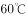
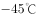

# 2020年海南公务员录用考试《行测》试题（网友回忆版）

> 常识判断 · 23 题 · 海南 2020

## 第 1 题　qid 2616113 · 人文常识

为应对新冠肺炎疫情，我国出台了一系列政策举措，帮助企业和个体工商户减负纾困，促进复工复产。下列哪一选项不属于我国在支持复工复产方面的优惠政策：

- **A**. 阶段性减免增值税小规模纳税人增值税
- **B**. 阶段性减免企业和个体工商户物业租金　✅
- **C**. 阶段性减征职工基本医疗保险单位缴费
- **D**. 阶段性减免企业养老、失业、工伤保险单位缴费

**答案**：B

**官方解析**

本题考查政治常识。
2020年3月，国家税务总局发布新版《支持疫情防控和经济社会发展税费优惠政策指引》，在支持复工复产方面，对受疫情影响较大的困难行业企业2020年度发生的亏损最长结转年限延长至8年；阶段性减免增值税小规模纳税人增值税；阶段性减免企业养老、失业、工伤保险单位缴费；阶段性减免以单位方式参保的个体工商户职工养老、失业、工伤保险；阶段性减征职工基本医疗保险单位缴费；鼓励各地通过减免城镇土地使用税等方式支持出租方为个体工商户减免物业租金。
本题为选非题，故正确答案为B。

---

## 第 2 题　qid 2616112 · 人文常识

“一带一路”倡议自提出以来，已逐步成为当今世界广泛参与的重要国际合作平台。下列有关2019年“一带一路”发展成果的说法正确的是：

- **A**. 中欧班列全年开列8200多列，“一带一路”在欧洲稳步前行　✅
- **B**. 2019年4月，第二届“一带一路”国际合作高峰论坛在杭州举行
- **C**. 中国人民银行和联合国开发计划署共同撰写研究报告，提出了“一带一路”投融资规划框架
- **D**. 第六届丝绸之路国际电影节于2019年10月在泉州举办，推动“一带一路”国家间的文化交流

**答案**：A

**官方解析**

本题考查政治常识。

A项正确，2019年，中欧班列开行8225列，同比增长，“一带一路”在欧洲稳步前行。

B项错误，第二届“一带一路”国际合作高峰论坛于2019年4月25日至27日在北京举行。

C项错误，2019年11月，《融合投融资规则 促进“一带一路”可持续发展——“一带一路”经济发展报告（2019）》正式对外发布。该报告由中国国家开发银行和联合国开发计划署共同撰写，报告重点研究了“一带一路”投融资规则、促进包容性发展、助力可持续发展等问题。

D项错误，第六届丝绸之路国际电影节于2019年10月15至20日在福建省福州市举办。

故正确答案为A。

---

## 第 3 题　qid 2616014 · 地理国情

为提升生态文明、建设美丽中国，党和政府做了一系列重要工作。下列有关生态文明建设的说法不正确的是：

- **A**. 自2020年1月起，黄河流域的自然保护区将全面禁止生产性捕捞　✅
- **B**. 2019年8月，第一届国家公园论坛在青海省举行，与会代表形成了8条“西宁共识”
- **C**. 2019年，第二轮中央生态环保督察启动，拟用三年时间完成例行督察，再用一年时间开展“回头看”
- **D**. 2019年11月，住建部发布了新修订的《生活垃圾分类标志》标准，将生活垃圾类别调整为可回收物、有害垃圾、厨余垃圾和其他垃圾4个大类

**答案**：A

**官方解析**

本题考查政治常识。
A项错误，根据《农业农村部关于长江流域重点水域禁捕范围和时间的通告》，长江上游珍稀特有鱼类国家级自然保护区等332个自然保护区和水产种质资源保护区，自2020年1月1日0时起，全面禁止生产性捕捞。
B项正确，2019年8月19日至20日，由国家林业和草原局、青海省人民政府共同举办的第一届国家公园论坛在青海省西宁市成功举行。与会代表通过交流、讨论，形成8条“西宁共识”。
C项正确，2019年3月，生态环境部部长李干杰在生态环境保护督察专题培训班中指出，将全面启动第二轮例行督察。从2019年起，用三年左右时间完成第二轮中央生态环境保护例行督察，再用一年时间开展“回头看”。
D项正确，2019年11月15日，住建部发布了新修订的《生活垃圾分类标志》标准，将生活垃圾类别调整为可回收物、有害垃圾、厨余垃圾和其他垃圾4个大类、11个小类。
本题为选非题，故正确答案为A。

---

## 第 4 题　qid 2616436 · 地理国情

海关总署表示，为支持海南逐步探索、稳步推进中国特色自由贸易港建设，分步骤、分阶段建设自由贸易港政策和制度体系，除禁止进出口和限制出口以及需要检验检疫的货物外，（    ）率先试行“一线放开、二线管住”的货物进出境管理制度。

- **A**. 三亚崖州湾科技城
- **B**. 博鳌乐城国际医疗旅游先行区
- **C**. 海口保税区
- **D**. 洋浦经济开发区　✅

**答案**：D

**官方解析**

本题考查政治常识。
A项错误，海南自由贸易港三亚崖州湾科技城，于2020年6月3日正式揭牌。围绕《海南自由贸易港建设总体方案》要求，重点打造“一港三城一基地”（南山港、南繁科技城、深海科技城、科教城和全球动植物种质资源引进中转基地），坚持规划先行、加大招商力度、引导科技创新，压茬推进重大项目开工建设，切实促进高新技术产业集聚。与题干不相符，故排除。
B项错误，博鳌乐城国际医疗旅游先行区，于2013年2月28日国务院正式批复设立，于2019年9月四部门印发《关于支持建设博鳌乐城国际医疗旅游先行区的实施方案》，是我国首个以国际医疗旅游服务、低碳生态社区和国际组织聚集地为主要内容的国家级试验区，被李克强总理誉为“博鳌亚洲论坛第二乐章”。与题干不相符，故排除。
C项错误，海口保税区，于1992年10月21日经国务院批准设立，肩负着探索具有中国特色自由贸易区发展之路的使命，目前园区已形成了以生物制药、汽车制造、电子信息、机电、加工为主导的高新技术产业群，成为海南省高新技术产业发展基地和示范区，并有效地辐射带动了周边经济的发展。与题干不相符，故排除。
D项正确，洋浦经济开发区，是国务院1992年批准设立的享受保税区政策的国家级开发区，2007年国务院批准设立洋浦保税港区。2020年6月，海南自由贸易港洋浦经济开发区正式挂牌成立，海关总署发布《中华人民共和国海关对洋浦保税港区监管办法》。海关总署表示，为支持海南逐步探索、稳步推进中国特色自由贸易港建设，分步骤、分阶段建设自由贸易港政策和制度体系，对进出海南洋浦保税港区的货物，除禁止进出口和限制出口以及需要检验检疫的货外，试行“一线放开、二线管住”的货物进出境管理制度，特制定《中华人民共和国海关对洋浦保税港区监管办法》。
故正确答案为D。

---

## 第 5 题　qid 2616452 · 地理国情

下列关于海南自贸港建设表述错误的是：

- **A**. 海南自由贸易港的实施范围覆盖全岛
- **B**. 到本世纪中叶全面建成具有较强国际影响力的高水平自由贸易港
- **C**. 全岛封关以后，对所有进口商品免税　✅
- **D**. 海南省是除港澳外唯一一个单向免签的省

**答案**：C

**官方解析**

本题考查政治常识。
A项正确，2020年6月1日，中共中央、国务院印发的《海南自由贸易港建设总体方案》中指出：“海南自由贸易港的实施范围为海南岛全岛。”
B项正确，根据《海南自由贸易港建设总体方案》中确定的发展目标，到2025年，初步建立以贸易自由便利和投资自由便利为重点的自由贸易港政策制度体系。到2035年，自由贸易港制度体系和运作模式更加成熟，以自由、公平、法治、高水平过程监管为特征的贸易投资规则基本构建，实现贸易自由便利、投资自由便利、跨境资金流动自由便利、人员进出自由便利、运输来往自由便利和数据安全有序流动。到本世纪中叶，全面建成具有较强国际影响力的高水平自由贸易港。
C项错误，2020年6月1日，中共中央、国务院印发的《海南自由贸易港建设总体方案》中指出：“全岛封关运作前，对部分进口商品，免征进口关税、进口环节增值税和消费税。全岛封关运作、简并税制后，对进口征税商品目录以外、允许海南自由贸易港进口的商品，免征进口关税。”故并非对“所有进口商品”免税。
D项正确，2020年6月1日，中共中央、国务院印发的《海南自由贸易港建设总体方案》中指出：“实施更加便利的免签入境措施。将外国人免签入境渠道由旅行社邀请接待扩展为外国人自行申报或通过单位邀请接待免签入境。放宽外国人申请免签入境事由限制，允许外国人以商贸、访问、探亲、就医、会展、体育竞技等事由申请免签入境海南。实施外国旅游团乘坐邮轮入境15天免签政策。”故海南省是除港澳外唯一一个单向免签的省份。
本题为选非题，故正确答案为C。

---

## 第 6 题　qid 2616027 · 人文常识

下列关于我国科技自主可控的说法错误的是：

- **A**. 基础性技术创新关乎科技自主可控的根本
- **B**. 国产替代是我国近期和未来科技进步和工业发展的主要途径
- **C**. 当前我国科技发展的主要问题表现为“缺芯少魂”“缺芯少屏”
- **D**. 实现科技自主可控，要着力引进技术，引领关键核心领域科技崛起　✅

**答案**：D

**官方解析**

本题考查科技常识。
A项正确，基础性技术创新关乎科技自主可控的根本。只有从源头开始的基础性技术创新才可能真正做到自主可控，并充分享有国际分工与合作的好处。

B项正确，国产替代将是中国近期和未来科技进步与工业发展的主要途径。任何国家层面上的工业发展、科技进步可以通过以下三种途径完成：引进技术、国产替代和自主创新。

C项正确，“缺芯”指的是“缺少国产的芯片”，“少屏”指的是“缺少国产的屏幕”，“少魂”则是指缺少国产的操作系统，常用来形容我国科技发展的现状。虽然目前“少屏”已大为改善，但“缺芯少魂”的问题一直存在。

D项错误，随着我国经济由高速增长阶段转向高质量发展阶段，关键核心技术受制于人已成为制约经济高质量发展的瓶颈。习近平总书记强调：“关键核心技术是要不来、买不来、讨不来的。只有把关键核心技术掌握在自己手中，才能从根本上保障国家经济安全、国防安全和其他安全。”所以实现科技自主可控，关键是在于提高自主创新能力，而非着力引进技术，让引进的技术去引领关键核心技术领域的科技崛起更是违背了自主可控的原则。
本题为选非题，故正确答案为D。
备注：本题C项亦存在问题，2020年，中国新型显示产业直接营收达到4460亿元，全球占比高达40.3%，产业规模位居全球第一。尤其是LCD屏幕领域，目前我国已经成为全球最大的LCD屏幕生产国、出口国，占全球50%以上的市场份额。“少屏”已经不再是我国科技发展的主要问题。

---

## 第 7 题　qid 2616013 · 人文常识

下列有关公共卫生的说法正确的是：

- **A**. 突发公共卫生事件应急响应分为Ⅰ级、Ⅱ级、Ⅲ级三个等级
- **B**. 按照我国现行标准，甲类传染病有鼠疫、霍乱、传染性非典型肺炎三种
- **C**. 省、自治区、直辖市人民政府卫生行政主管部门有权向社会发布本行政区域内突发事件的消息
- **D**. 医疗卫生机构发现可能发生传染病暴发、流行的，应当在2小时内向所在地县级人民政府卫生行政主管部门报告　✅

**答案**：D

**官方解析**

本题考查法律常识。
A项错误，《国家突发公共卫生事件应急预案》总则第三条规定：“根据突发公共卫生事件性质、危害程度、涉及范围，突发公共卫生事件可分为特别重大（Ⅰ级）、重大（Ⅱ级）、较大（Ⅲ级）和一般（Ⅳ级）四级。”“突发公共卫生事件的应急反应和终止”部分第一条规定：“发生突发公共卫生事件时，事发地的县级、市（地）级、省级人民政府及其有关部门按照分级响应的原则，作出相应级别应急反应······”因此，应急响应为四个等级。
B项错误，根据《中华人民共和国传染病防治法》第三条第二款规定：“甲类传染病是指：鼠疫、霍乱。”
C项错误：《突发公共卫生事件应急条例》第二十五条规定：“国家建立突发事件的信息发布制度。国务院卫生行政主管部门负责向社会发布突发事件的信息。必要时，可以授权省、自治区、直辖市人民政府卫生行政主管部门向社会发布本行政区域内突发事件的信息。信息发布应当及时、准确、全面。”
D项正确，根据《突发公共卫生事件应急条例》第十九条第三款规定：“有下列情形之一的，省、自治区、直辖市人民政府应当在接到报告1小时内，向国务院卫生行政主管部门报告：（一）发生或者可能发生传染病暴发、流行的；（二）发生或者发现不明原因的群体性疾病的；（三）发生传染病菌种、毒种丢失的；（四）发生或者可能发生重大食物和职业中毒事件的。······”第二十条第一款规定：“突发事件监测机构、医疗卫生机构和有关单位发现有本条例第十九条规定情形之一的，应当在2小时内向所在地县级人民政府卫生行政主管部门报告；接到报告的卫生行政主管部门应当在2小时内向本级人民政府报告，并同时向上级人民政府卫生行政主管部门和国务院卫生行政主管部门报告。”
故正确答案为D。

---

## 第 8 题　qid 2616026 · 人文常识

下列关于我国城市的表述错误的是：

- **A**. 北京市、上海市、天津市和重庆市是直辖市
- **B**. 昆山市、义乌市、江阴市、温岭市是县级市
- **C**. 东莞市、三沙市、中山市和嘉峪关市是地级市
- **D**. 成都市、西安市、杭州市和长沙市是副省级市　✅

**答案**：D

**官方解析**

本题考查地理国情。
A项正确，直辖市的行政地位与省、自治区、特别行政区相同，是中华人民共和国省级行政区，是直接由中央人民政府所管辖的建制市。我国现有北京市、天津市、上海市、重庆市4个直辖市。
B项正确，昆山市是江苏省辖县级市，由苏州市代管；义乌市是浙江省金华市所辖县级市；江阴市是江苏省无锡市所辖县级市；温岭市是浙江省台州市所辖县级市。
C项正确，东莞市是广东省地级市；三沙市是海南省地级市；中山市是广东省地级市；嘉峪关市是甘肃省地级市。
D项错误，副省级市是中国行政架构为副省级建制的地级市，其行政级别正式施行于1994年2月25日，前身为计划单列市。最初共有16个副省级市，后来由于重庆市直辖，副省级市变为目前的15个，分别是：广州、武汉、哈尔滨、沈阳、成都、南京、西安、长春、济南、杭州、大连、青岛、深圳、厦门、宁波。长沙市不属于副省级市。
本题为选非题，故正确答案为D。

---

## 第 9 题　qid 2616019 · 人文常识

下列作家与其作品中所展现的地域对应错误的是：

- **A**. 鲁迅—《阿Q正传》—绍兴
- **B**. 沈从文—《边城》—湘西
- **C**. 汪曾祺—《受戒》—高邮
- **D**. 莫言—《红高粱》—东北　✅

**答案**：D

**官方解析**

本题考查人文常识。
A项正确，《阿Q正传》是鲁迅于1921年12月以绍兴地区为背景创作的中篇小说，最初发表于北京《晨报副刊》，后收入小说集《呐喊》。小说以辛亥革命前后的中国农村为背景，描写了未庄流浪雇农阿Q，虽然干起活来“真能做”，但却一无所有，甚至连名姓都被人遗忘的故事。该小说批判了当时中国社会的封建、保守、庸俗、腐败等社会特点，有力地揭示了旧中国人民的生活场景和其处在水深火热之中的病态。
B项正确，《边城》是沈从文创作的中篇小说，首次出版于1934年。该小说以20世纪30年代川湘交界的边城小镇茶峒为背景，以兼具抒情诗和小品文的优美笔触，描绘了湘西地区特有的风土人情，借船家少女翠翠的纯爱故事，展现出了人性的善良美好。
C项正确，《受戒》是汪曾祺以早年间在故乡高邮的生活为素材创作的短篇小说，发表于《北京文学》1980年第10期。作品描写了小和尚明海与农家女小英子之间天真无邪的朦胧爱情，蕴含着对生活、对人生的热爱，洋溢着人性和人情的欢歌。
D项错误，《红高粱》是中国作家莫言创作的中篇小说，于1986年在《人民文学》杂志问世。该小说以抗日战争及20世纪30、40年代高密东北乡的民间生活为背景，塑造了一系列的抗日英雄，是表现高密人民在抗日战争中的顽强生命力和充满血性与民族精神的经典之作。该项中“东北”表述错误，应为山东省潍坊市高密东北乡。
本题为选非题，故正确答案为D。

---

## 第 10 题　qid 2616110 · 人文常识

蔡襄是北宋著名书法家、文学家、茶学家。下列关于蔡襄说法错误的是：

- **A**. 他的书法浑厚端庄，淳淡婉美
- **B**. 他主持建造了泉州万安桥（洛阳桥）
- **C**. 他所著的《大观茶论》是重要的茶学专著和书法杰作　✅
- **D**. 他所著的《荔枝谱》被称为“世界上第一部果树分类学著作”

**答案**：C

**官方解析**

本题考查人文常识。
A项正确，蔡襄是北宋初年著名书法家，与苏轼、黄庭坚、米芾齐名，并称“宋四家”。他的书法浑厚端庄，淳淡婉美，自成一体。
B项正确，蔡襄主持修建了中国第一座海港大石桥——万安桥（洛阳桥）。该桥横跨泉州湾，在中国桥梁建筑史上有重要地位，被茅以升称作“中国古代桥梁的状元”。
C项错误，蔡襄是一位茶学专家，他撰写的《茶录》是继唐代陆羽《茶经》之后的又一部重要的茶学专著。而《大观茶论》是宋徽宗赵佶所著的关于茶的专论，因成书于大观元年，故被后人称之为《大观茶论》。
D项正确，《荔枝谱》是蔡襄撰写的一部果艺栽培学专著，内容包括荔枝的产地、生态、功用、服食、加工、贮藏、运销等，被称赞为“世界上第一部果树分类学著作”。
本题为选非题，故正确答案为C。

---

## 第 11 题　qid 2616117 · 人文常识

下列影视剧情符合历史事实的是：

- **A**. 清朝时称官员为大人，如刘大人、李大人等　✅
- **B**. 宋朝官员大声宣读圣旨道“奉天承运皇帝诏曰”
- **C**. 武则天的父亲见到武则天时，称呼其为“媚娘”
- **D**. 唐贞观年间官员对话讲到唐太宗时，称“吾皇太宗”

**答案**：A

**官方解析**

本题考查人文常识。
A项正确，“大人”这个词最早可见于《易经》，初始含义是指父母长辈，并不是用于称呼官员。到了宋朝后期，开始将官员称之为“大人”。因此，清朝时称官员为大人符合历史事实。
B项错误，“奉天承运皇帝诏曰”这一句式用于圣旨始于明太祖朱元璋时期。奉天殿是朱元璋和大臣举行朝议的地方，他用“奉天承运皇帝”作为自称，以示法统正确。从此之后，圣旨的开头开始采用“奉天承运皇帝诏曰”。因此，宋朝官员宣读圣旨不可能出现这句话。
C项错误，武则天是十四岁时进宫被赐号“武媚”，亦有人称之为“媚娘”。而其父于武则天十二岁去世（进宫前），故其父不可能称呼其为“媚娘”。
D项错误，贞观是唐太宗李世民的年号，而太宗是李世民死后的庙号，他当政期间是不可能被人称为太宗的。
故正确答案为A。

---

## 第 12 题　qid 2616020 · 人文常识

祠堂在中国传统社会是家族成员的重要活动中心，一般情况下按姓氏称为某氏宗祠，但有时也会称为某氏家庙。称为“家庙”的依据是：

- **A**. 该家族与宗教有关
- **B**. 社会习惯约定俗成
- **C**. 该家族受到皇帝册封
- **D**. 该家族有人获得官爵　✅

**答案**：D

**官方解析**

本题考查人文常识。
家庙即儒教为祖先立的庙，属于中国儒教徒祭祀祖先和先贤的场所。古时家族有官爵者才能建家庙，作为祭祀祖先的场所。古代，对庙的规模有严格的等级限制。根据《礼记·王制》记载：“天子七庙，三昭三穆，与太祖之庙而七。诸侯五庙，二昭二穆，与太祖之庙而五。大夫三庙，一昭一穆，与太祖之庙而三。士一庙，庶人祭于寝。”“太庙”是帝王的祖庙，其他凡有官爵的人，也可按制建立“家庙”。上古时期其叫“宗庙”，唐朝始创“私庙”，宋改为“家庙”。故称为“家庙”的依据是该家族有人获得官爵。
故正确答案为D。

---

## 第 13 题　qid 2616017 · 人文常识

囚徒困境是博弈论的非零和博弈的经典例子，表明个人的最佳选择并非团体的最佳选择。下列选项中不属于囚徒困境的是：

- **A**. 广告战
- **B**. 关税战
- **C**. 军备竞赛
- **D**. 股市中的散户跟庄　✅

**答案**：D

**官方解析**

本题考查经济常识。
囚徒困境是指两个被捕的囚徒之间的一种特殊博弈，说明为什么在合作对双方都有利时，保持合作也是困难的。囚徒困境的主旨为：虽然囚徒们彼此合作，坚不吐实，可为全体带来最佳利益。但在资讯不明的情况下，因为出卖同伙可为自己带来利益，也因为同伙把自己招出来可为他带来利益，因此彼此出卖虽违反最佳共同利益，反而是自己最大利益所在。在这种情况下，双方都不能得到最好的结果。
A、B项正确，广告战、关税战均体现了由于对对方不信任，往往采取不合作方式，打“价格战”，结果两败俱伤，陷入囚徒困境之中。
C项正确，军备竞赛是指各国往往都是倾向于扩大自己的军备，而不是采取合作的方式削减军备。这种不合作行为长期来看也会危害自己。
D项错误，在股市中，跟庄是指跟随大资金做同方向的操作。散户与庄家相比，没有雄厚的资金和到位的技术分析力，需要具有超常的耐心，跟踪庄家的行动。散户的跟庄行为是为在高位卖出股票获利，并不涉及囚徒困境。
本题为选非题，故正确答案为D。

---

## 第 14 题　qid 2616018 · 人文常识

下列诗词所反映的历史时期按时间先后顺序排列正确的是：
①风云突变，军阀重开战。洒向人间都是怨，一枕黄粱再现
②外侮需人御，将军赋采薇。师称机械化，勇夺虎罴威
③宜将剩勇追穷寇，不可沽名学霸王。天若有情天亦老，人间正道是沧桑
④山高路远坑深，大军纵横驰奔。谁敢横刀立马？唯我彭大将军

- **A**. ①②③④
- **B**. ①②④③
- **C**. ①④②③　✅
- **D**. ②③①④

**答案**：C

**官方解析**

本题考查毛中特。
①“风云突变，军阀重开战。洒向人间都是怨，一枕黄粱再现”出自毛泽东的《清平乐·蒋桂战争》。该词反映的是一九二九年春发生于国民党南京军阀蒋介石和广西（简称“桂”）军阀李宗仁、白崇禧之间的战争，即蒋桂战争。
②“外侮需人御，将军赋采薇。师称机械化，勇夺虎罴威”出自毛泽东的《五律·挽戴安澜将军》。1942年，中国远征军第5军200师师长戴安澜率部赴缅甸援英抗日，历经血战，不幸殉国，年仅38岁。此诗为毛泽东主席为戴安澜将军写的挽诗。
③“宜将剩勇追穷寇，不可沽名学霸王。天若有情天亦老，人间正道是沧桑”出自毛泽东的《七律·人民解放军占领南京》。该诗写于1949年，诗人热情歌颂了人民解放军飞渡长江天堑，解放南京，改造黑暗旧社会的光辉史实，并以富有哲理意味的诗句，阐发了“追穷寇”的深刻军事哲理。
④“山高路远坑深，大军纵横驰奔。谁敢横刀立马？唯我彭大将军”出自毛泽东的《六言诗·给彭德怀同志》。1935年10月，彭德怀在吴起镇战斗中歼敌一个团，击溃三个团，毛主席立即挥毫赋诗一首，赞扬彭德怀杰出的军事指挥才能。
因此，按照时间先后顺序排列应为①④②③。
故正确答案为C。

---

## 第 15 题　qid 2616016 · 法律常识

下列关于法律基础知识的表述正确的是：

- **A**. 司法机关在适用法律审理案件时，优先适用法律原则，再适用法律规则
- **B**. 法的渊源通常指法的形式意义上的渊源，即法律规范的创制方式和外部表现形式　✅
- **C**. 法的公布与法的实施是两个不同的概念，但实践中法的公布日期即法的实施日期
- **D**. 当同一机关制定的法律出现效力冲突时，一般解决原则是新法优于旧法，一般法优于特别法

**答案**：B

**官方解析**

本题考查法律常识。
A项错误，法律原则是指在一定法律体系中作为法律规则的指导思想、基础或本原的、综合的、稳定的原理和准则。法律规则是采取一定的结构形式具体规定人们的法律权利、法律义务以及相应的法律后果的行为规范。法律规则是法律要素里最主要的构成，也是具体案件适用的首选，在穷尽了规则后，法律规定也可以在具体案件中适用法律原则。
B项正确，法的渊源简称“法源”。通常指法的创立方式及表现为何种法律文件形式。分为直接渊源和间接渊源两种。前者为成文法，后者可以是判例、惯例甚至法理。
C项错误，法的实施日期也即法的生效日期，法律的生效时间主要有三种：1.自法律公布之日起生效；2.由该法律规定具体生效时间；3.规定法律公布后符合一定条件时生效。因此，法的公布日期和法的实施日期并非同一概念。
D项错误，当同一机关制定的法律出现效力冲突时，一般适用如下原则：根本法优于普通法、上位法优于下位法、新法优于旧法、特别法优于一般法等。
故正确答案为B。

---

## 第 16 题　qid 2616111 · 人文常识

下列政府举措中，不能够直接促进城镇居民人均可支配收入增长的是：

- **A**. 减税
- **B**. 发行政府债券　✅
- **C**. 将学前教育纳入义务教育
- **D**. 提高退休职工养老金发放标准

**答案**：B

**官方解析**

本题考查经济常识。
城镇居民人均可支配收入是指将家庭总收入扣除交纳的个人所得税和个人交纳的各项社会保障支出之后，按照居民家庭人口平均的收入水平。其中，家庭总收入是指该家庭中生活在一起的所有家庭人员从各种渠道得到的所有收入之和。城镇居民人均可支配收入标志着居民的购买力，是衡量城镇居民收入水平和生活水平的最重要和最常用的统计指标。
A项正确，减税可以降低居民所交纳的个人所得税等税费，少交的税费可以用于其他家庭支出，从而直接提高居民可支配收入。
B项错误，发行政府债券是国家对经济进行宏观调控的工具，可以通过国家对经济的宏观调控来间接影响个人收入。
C项正确，学前教育纳入义务教育后将不再交纳学费，省下的学费可用于其他家庭支出，故可以直接提高居民可支配收入。
D项正确，提高退休职工养老金发放标准可以直接增加居民的工资收入，从而直接提高了居民可支配收入。
本题为选非题，故正确答案为B。

---

## 第 17 题　qid 2616015 · 人文常识

下列俗语与其蕴含的经济学道理对应错误的是：

- **A**. 田忌赛马—成本与收益　✅
- **B**. 知人知面不知心—信息不对称
- **C**. 十年栽树，百年树人—长期投资
- **D**. 萝卜白菜，各有所爱—偏好理论

**答案**：A

**官方解析**

本题考查经济常识。
A项错误，“田忌赛马”讲的是田忌通过调整自己的马与齐威王的马的对阵顺序，最终取胜的故事。这个故事告诉我们如何利用自己的长处去对付对手的短处，从而在竞技中获胜。从经济学角度看，这揭示了权衡取舍的原理，只有懂得取舍，才能作出最优的决策，在市场竞争中取胜。“田忌赛马”的故事跟“成本与收益”无关。
B项正确，“知人知面不知心”指认识一个人容易，但要了解一个人的内心却很困难。信息不对称理论是指在市场经济活动中，各类人员对有关信息的了解是有差异的；掌握信息比较充分的人员，往往处于比较有利的地位，而信息贫乏的人员，则处于比较不利的地位。“知人知面不知心”体现了各类人员对有关信息的了解存在差异，体现了信息不对称理论。
C项正确，“十年栽树，百年树人”意思是小树需要十年才能长成大树，而人则需要更长的时间才能被培养成才。长期投资是指不准备随时变现，持有时间超过1年的企业对外投资。“十年栽树，百年树人”体现了长期投资。
D项正确，“萝卜白菜，各有所爱”指的就是各人有各人的喜好。消费者偏好是反映消费者对不同产品和服务的喜好程度的个性化偏好，是影响市场需求的一个重要因素。“萝卜白菜，各有所爱”体现了消费者偏好理论。
本题为选非题，故正确答案为A。

---

## 第 18 题　qid 2616109 · 人文常识

香蕉水作为油性涂料、油漆等建筑材料的溶剂和稀释剂，常用于家庭和办公室装修。下列关于香蕉水的说法正确的是：

- **A**. 香蕉水是无色透明易挥发的有机液体　✅
- **B**. 香蕉水的主要成分是乙醇，易燃无毒
- **C**. 香蕉水是一种特殊水溶液，不易燃烧
- **D**. 香蕉水是提取于香蕉的天然无毒液体

**答案**：A

**官方解析**

本题考查科技常识。
A项正确，香蕉水是由多种有机溶剂配制而成的无色透明易挥发的液体。
B项错误，香蕉水的主要成分是甲苯、醋酸丁酯、环己酮、醋酸异戊酯、乙二醇乙醚醋酸酯等，易燃有毒。
C项错误，香蕉水易燃烧，其蒸气与空气可形成爆炸性混合物，遇明火、高热能引起燃烧爆炸。
D项错误，香蕉水的得名是因为有乙酸戊酯或乙酸异戊酯的香蕉味，其对人体有一定的毒性。
故正确答案为A。

---

## 第 19 题　qid 2616029 · 人文常识

下列哪一选项是蚊子用于获取“猎物”信息的主要器官？

- **A**. 复眼
- **B**. 蚊翅
- **C**. 蚊足
- **D**. 触角　✅

**答案**：D

**官方解析**

本题考查科技常识。
A项错误，蚊子复眼由多数小眼组成，作用是同时得到多角度视觉信息并快速作出反应，是其主要视觉器官，不是其获取“猎物”信息的主要器官。
B项错误，蚊翅长在蚊子中胸上，共1对，是其飞行的主要器官。
C项错误，蚊足细长，自前而后分别称前足、中足和后足，是其行走或着陆物体的主要器官。
D项正确，蚊子触角上有众多短毛，短毛上有众多感官器官，对空气中化学物质的变化有反应，对二氧化碳和湿度尤其敏感。当人呼出二氧化碳和散发出汗液等气味时，这些气味会在空气中扩散，而蚊子触角上的感觉器可以敏感地感受到这些气味，在雌蚊寻觅吸血对象时起重要作用，因此它是蚊子用于获取“猎物”信息的主要器官。
故正确答案为D。

---

## 第 20 题　qid 2616025 · 科技常识

生活中，俗称“暖宝宝”的一次性取暖片主要由铁粉、活性炭、蛭石、水、盐等材料构成。下列关于其发热原理的说法正确的是：

- **A**. 活性炭的作用是减少铁粉和空气的接触面积
- **B**. 盐和水的作用是加快铁粉氧化　✅
- **C**. 发热原理是铁的氧化吸热过程
- **D**. 蛭石的作用是散热

**答案**：B

**官方解析**

本题考查科技常识。
A项错误，平常的活性炭可以用来吸附杂质，暖宝宝里的活性炭是用来吸收发热过程中产生的水分的，起到分散铁粉、透气、防结块，从而能够达到均衡发热的作用。
B项正确，食盐和水能帮助铁粉形成微电池，起到加速铁粉氧化腐蚀的作用。
C项错误，“暖宝宝”是利用铁的氧化反应放热来发热，而不是吸热。
D项错误，蛭石的作用是使温度能够持续更长，即其起到的作用是保温，而不是散热。
故正确答案为B。

---

## 第 21 题　qid 2616115 · 人文常识

下列关于人体单纯性肥胖的说法错误的是：

- **A**. 进食过多的糖类食物，会导致肥胖
- **B**. 肥胖者会因动脉粥样硬化而产生心血管疾病
- **C**. 不吃肥肉少放油，提倡低脂膳食就能避免肥胖　✅
- **D**. 脂肪虽供给人体能量，但摄入过多会沉积皮下引起肥胖

**答案**：C

**官方解析**

本题考查科技常识。  
A项正确，当人摄入过量的糖分时，多余的糖分就会转化为肝肌糖元。如果还有剩余，就会大量转化成脂肪，使人长胖。 
B项正确，身体太肥胖的话会改变血流动力，左心室异常肥大，使得心律失常，提高血栓生成风险，从而加快动脉粥样硬化生成。
C项错误，肥胖的成因是多方面的，有遗传、饮食、运动、年龄等因素，所以只是不吃肥肉少放油，提倡低脂膳食并不一定能够避免肥胖。
D项正确，人体能量摄入超过能量消耗，多余的能量就会转变成脂肪囤积在人体内，从而导致肥胖。
本题为选非题，故正确答案为C。

---

## 第 22 题　qid 2616028 · 人文常识

手机电池的发展经历了镍镉电池、镍氢电池和锂离子电池3个阶段。锂离子电池相对于其他两种电池的优势在于：
①重量轻
②安全性高
③绿色环保
④高低温适应性强

- **A**. ①②③
- **B**. ①③④　✅
- **C**. ①②④
- **D**. ②③④

**答案**：B

**官方解析**

本题考查科技常识。

锂系电池分为锂电池和锂离子电池。锂离子电池是一种二次电池（充电电池），它主要依靠锂离子在正极和负极之间移动来工作。锂离子电池重量轻，相同体积下重量约为铅酸产品的-，故①正确；锂离子电池绿色环保，不论生产、使用和报废，都不含有、也不产生任何铅、汞、镉等有毒有害重金属元素和物质，故③正确；锂离子电池高低温适应性强，可以在至的环境下使用，经过工艺上的处理，可以在环境下使用，故④正确；由于锂离子电池组成物质非常活跃，若使用错误将会出现电解液分解、燃烧甚至爆炸的重大事故，错误使用存在安全隐患，故②错误。

故正确答案为B。

---

## 第 23 题　qid 2616023 · 人文常识

下列食物经过人体口腔能够初步消化的是：

- **A**. 牛肉和鱼
- **B**. 鸡蛋和牛奶
- **C**. 青菜和螃蟹
- **D**. 米饭和馒头　✅

**答案**：D

**官方解析**

本题考查科技常识。
A项错误，牛肉和鱼肉中含有大量蛋白质和少量脂肪，口腔中不含蛋白酶和脂肪酶，不能完成牛肉和鱼的初步消化。蛋白质的消化开始于胃，蛋白质进入胃以后，在胃液中胃蛋白酶的作用下进行初步消化后进入小肠，小肠里的胰液和肠液含有消化蛋白质的酶，在这些酶的作用下，蛋白质被彻底消化为氨基酸而被人体吸收利用；而脂肪的消化主要在小肠进行，先是胆汁（不包含任何消化酶）将脂肪颗粒乳化为脂肪微粒，再在肠液和胰液中脂肪酶的作用下，被彻底分解为甘油和脂肪酸。
B项错误，鸡蛋和牛奶的主要成分是蛋白质，在胃中完成初步消化。
C项错误，青菜中含有大量纤维素，但由于人体缺乏分解纤维素的酶，因此青菜的主要成分在人体不能被消化吸收；螃蟹肉主要成分是蛋白质和脂肪，蛋白质在胃中完成初步消化，脂肪在小肠中完成初步消化。
D项正确，米饭和馒头的主要成分是淀粉，口腔中含有唾液淀粉酶，能将淀粉初步分解为麦芽糖，因此米饭和馒头可以在口腔内初步消化。
故正确答案为D。

---
